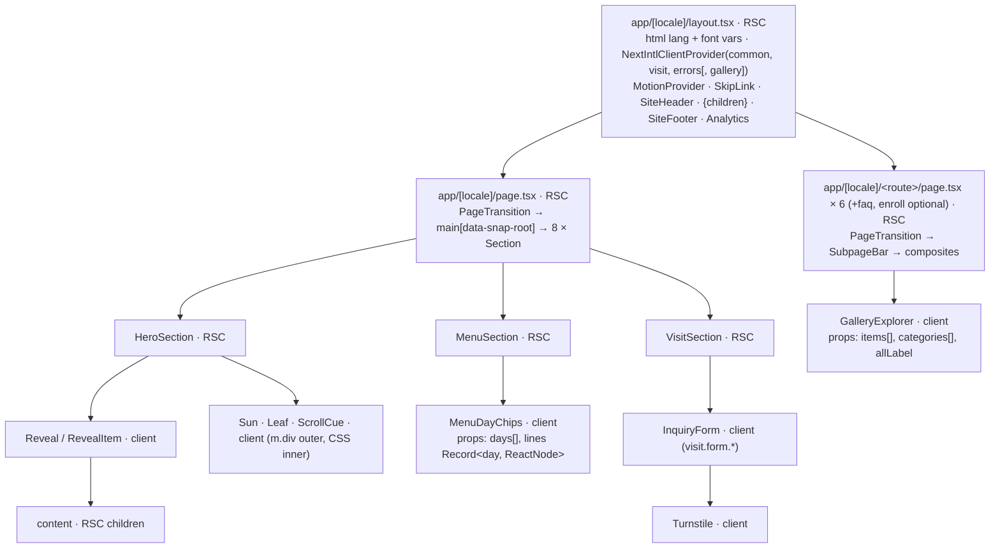

# 04 · Components & sections

## Purpose

This document fixes the React component architecture of the Green Pastures site: the App Router layout and
provider stack, the server/client boundary, the `src/` directory layout, the complete component inventory (name,
kind, props, which messages and collections each one consumes, which design section it renders, how desktop and
mobile differ, which 05 motion variant it uses, its accessibility contract), the section → key map against the
R1 string inventory and the 02 contract, the props/data conventions, the responsive switch points, the
accessibility rules, what must be tested, and the invariants other docs may cite (`INV-04.n`). It builds on
`02-i18n-content-contract.md` (the contract of record for every key and collection named here — nothing is
restated, only cited), `03-design-system-tokens.md` (every colour, size, radius, shadow, duration is a token),
`05-animation-system.md` (the `Reveal` primitive, variant names, `PageTransition`, `WordSwap`, `CountUp`) and
`07-forms-integrations.md` (the inquiry form). It does not define routes or metadata (06), test mechanics (08)
or operations (09).

Status: draft · seat writer-components · 2026-08-22

## Decisions

- **D-04.1 Sections and pages are server components; interactivity lives in enumerated client leaves.** Every
  `page.tsx`, every `*Section` and every subpage composite except `ErrorPanel` renders on the server with
  `getTranslations` / `useTranslations` and the collection loaders. The client components are exactly those
  listed in §3 with kind "client": the 05 motion set (`MotionProvider`, `Reveal`, `RevealItem`, `WordSwap`, `CountUp`,
  `PageTransition`), the eight addressable decorations (INV-05.5), `LangSwitcher`, `TrackedLink`, `PrimaryNav`,
  `FooterLinks`, `Hamburger` + `MobileMenu` (whose link list is the third of 06 D-06.7's three link lists),
  `BackLink`, `MenuDayChips`, `GalleryExplorer` (filters + grid + lightbox), `InquiryForm` +
  `Turnstile` + `FormField` + `SuccessPanel` + `FormAlert`, `ErrorPanel` and `AmbientScope` — 30 files. On top of
  those, the two route-file boundaries 06 owns are client because Next requires it: `app/[locale]/error.tsx` and
  `app/[locale]/global-error.tsx` (06 §6.2, 02 D-02.16), so the repo holds 32 `'use client'` files in all. A new
  `'use client'` file is a change to this list. `PrimaryNav`, `FooterLinks` and the sheet's link list are client
  because each item's href is chosen from `usePathname()` — `#id` on the home page, `homeHref(id)` elsewhere
  (06 D-06.7) — while `SiteHeader` and `SiteFooter` stay server and pass the resolved
  `{ id, anchor, label, href }[]` down as serialisable props, so no message or collection read crosses with them.
  `ErrorPanel` is client because `error.tsx` imports it (a module imported by a client boundary is client);
  `not-found.tsx` stays server and renders the same component. `SuccessPanel` and `FormAlert` are client
  because the form chooses them at runtime from state the server never saw (D-04.14's code record);
  `NoscriptFallback` stays server and reaches the form as the `noscript` node prop (§3.5). `TrackedLink` is
  the one-line `onClick` wrapper that fires 07 §4's link events — `cta_book_tour` from `BookTourButton`,
  `yelp_click` from `YelpButton` and the home Yelp link — so no server component ever grows a handler. The
  other two events belong to components already on this list
  (`locale_toggle` → `LangSwitcher`, `inquiry_submitted|failed` → `InquiryForm`); the Maps link fires nothing
  and stays a plain server `<a>`.
- **D-04.2 Client leaves receive plain props or server-rendered children; they never import content.** No
  `'use client'` module imports `src/content/*`, `content/**/*.json` or `src/i18n/messages.ts`. Collections are
  joined on the server (`src/content/collections.ts`) and cross the boundary as serialisable props
  (`{ id, label, href }[]`) or as already-rendered React nodes (`children`, `Record<string, ReactNode>`). The
  `NextIntlClientProvider` carries only 02's client namespaces (D-02.16, verbatim: `common`, `visit`, `gallery`
  at launch, plus `errors` for `error.tsx`); §5 lists which client component needs which, and at launch
  `common`, `visit` and `errors` are the three actually read on the client.
- **D-04.3 One `Section` shell.** Every homepage section is `Section` (`<section id aria-labelledby data-section>`)
  with background from `--color-bg-<id>`, `scroll-snap-align: start`, `scroll-margin-top: var(--nav-h)`, the
  section's role colours exposed as scoped variables (`--section-bg`, `--section-accent`, `--section-link`,
  `--section-link-underline`, `--section-sub`) mapped from 03's canonical `--color-bg-<id>` /
  `--color-accent-<id>` / `--color-link-<id>` / `--color-link-underline-<id>` / `--color-sub-<id>` tokens in one
  CSS rule per section id (`--section-bg` is what `PhotoSlot` mixes its fill from, §3.2).
  Primitives (`Eyebrow`, `LearnMoreLink`, `SectionHeader` intro) consume the role variables only, so no component
  names a per-section colour. Section ids are `site.routes[].homeAnchor` (02 D-02.12): `hero`, `philosophy`,
  `programs`, `menu`, `gallery`, `testimonials`, `teachers`, `visit`.
- **D-04.4 Sections are self-sufficient.** A section reads its own namespace and collections; `page.tsx` composes
  sections and passes nothing. This keeps the section → key map (§4) local to one file per section and makes
  per-section RTL tests trivial. Subpage composites follow the same rule.
- **D-04.5 Per-view copy and per-surface membership are never branched in code.** `*Short` siblings (D-02.13)
  render as two elements toggled by `md:` utilities (`<span class="md:hidden">{short}</span><span class="hidden
  md:inline">{long}</span>`); keys the design shows on one view only (`home.programs.intro`, the third
  teacher tag, the second programme highlight, `philosophy.badges.ams|bilingualDaily`) render with the same
  toggle. Count differences (testimonials 3 → 2, polaroids 7 → 5, filters 5 → 4, dietary chips 3 → 2) come from
  the `site.json` flags `onHome`, `onMobile`, `featured`; an item with `onMobile: false` is rendered and hidden
  below `md`, never filtered by a JS viewport check (no hydration mismatch, no layout shift).
- **D-04.6 Layout geometry is component config, not content.** Polaroid slot positions/sizes/tilts (7 desktop,
  5 mobile, from the reference files), stepping-stone sizes, bubble tail sides and teacher column placement live
  in `src/components/sections/<section>/layout.ts` as percentage/grid values; `site.json` carries only data
  (`photos[].rotation` is an optional per-photo override of the slot tilt). Editors reorder by editing `site.json`
  order; slots fill in order.
- **D-04.7 Gallery lightbox ships at launch** as a native `<dialog>` inside `GalleryExplorer` (the design's hint
  copy promises it: `gallery.hint`), with `common.lightbox.close|prev|next`, arrow-key navigation and focus
  return. Filtering is client-side local state over server-rendered items; without JavaScript every photo shows
  and the filter chips are inert (OQ-04.2 if the owner prefers URL-backed filters).
- **D-04.8 Hamburger menu = full-screen sheet below the nav bar** (the design leaves it undesigned,
  `docs/design/mobile/README.md` "Layout"): cream background, the six primary links, `common.nav.contact`, the
  `LangSwitcher`, and the "Book a tour" pill; opens/closes with 05's default `fade` + `rise` (OQ-05.3); focus is
  trapped, `Escape` closes, the page behind is `inert`, body scroll is locked. Design sign-off is OQ-04.1.
- **D-04.9 Navigation row at `lg`, not `md`.** The full desktop nav (logo 50px + six links + divider + "EN · 中文"
  + pill, `docs/design/desktop/README.md` "Layout") needs ≈ 990px (116 logo + 505 links/gaps + 40 divider +
  65 toggle + 138 pill + 88 padding + gaps), so it cannot fit at 768px; the hamburger stays until `lg` (1024px)
  while 03's `md` token values (logo height, pill size) still switch at `md`. This refines 03 §8's "nav" row;
  03 keeps the tokens, 04 owns the switch point (D-03.6 delegates layout switches to 04).
- **D-04.10 Menu day chips swap server-rendered sample lines.** `MenuSection` renders one `SampleLine` node per
  weekday (`home.menu.sampleLine` over `collections.menu.week.<day>`) and passes `Record<DayId, ReactNode>` plus
  `{ id, label }[]` (labels from the `weekdayShort` format) to `MenuDayChips` (client), which owns
  `selectedDay`. The default is **computed on the server** by `src/lib/menu-day.ts` in `site.timeZone`
  (`America/Los_Angeles`, 02 §Collections; weekend → `mon` is 04's rule) and passed as `defaultDay`, so the
  markup is deterministic, there is no hydration mismatch, and the pre-hydration / no-JS page shows that day's
  line with its chip already marked selected (05 §5.6). `MenuDayChips` shows `lines[selectedDay]` inside
  `WordSwap`. No dishes, no `home` namespace, no collection reach the client.
- **D-04.11 Menu subpage renders two structures, toggled by CSS.** `WeeklyMenuTable` (`≥ md`, a real `<table>`
  with `<th scope>`) and `DayCards` (`< md`) are both server-rendered because the mobile design is a transpose of
  the desktop table (cards per day vs columns per day) and a transpose cannot be expressed in CSS from one DOM.
  The hidden structure is `display: none` (out of the accessibility tree). Cost: 15 short strings twice.
- **D-04.12 Photos go through `Picture`** (a `next/image` wrapper): `image` from `site.json` (`src`, `width`,
  `height`), `alt` from the per-locale collection/message key, `sizes` per breakpoint, radius from a 03 radius
  token name, `priority` only for the hero photo, `PhotoSlot` fill as the background (03 §9) so no blur data is
  required; `placeholder="blur"` only when `site.json` carries a `blurDataURL` (optional field, §10). Until
  client photography lands, `Picture` renders `PhotoSlot` when `image` is absent.
- **D-04.13 Rich text tag map is one helper.** `richTags()` in `src/components/ui/rich.tsx` maps 02's allowlist:
  `em` → `<em class="not-italic text-(--section-accent)">`, `strong` → `<strong>`, `link` → next-intl `Link`
  (href supplied by the caller), `count` → `CountUp`, `day` → `<strong>`. Every `t.rich` call uses it; a
  message needing another tag is a design question, not a new mapping (02 §Message syntax).
- **D-04.14 Error-code record lives in `InquiryForm`.** The typed record mapping 07's wire codes to 02's key
  segments (`visit.form.fields.<field>.errors.<code>` → `visit.form.errors.<code>` → `unknown`) is
  `src/components/forms/inquiry-codes.ts`; 07's schema code `invalid_email` resolves to the field-scoped
  `invalid` on `email` — `visit.form.fields.email.errors.invalid` — which is exactly the row 02's error table
  already carries, so the record copies 02 rather than deciding anything (the earlier claim that 02 had no
  `invalid_email` row is withdrawn).
- **D-04.15 Decorations are client components from day one.** `Sun`, `Leaf`, `ScrollCue`, `Plate`, `Polaroid`,
  `SteppingStone`, `Bubble`, `TeacherFrame` render an outer `m.div` (stable `id`, forwarded `ref`,
  `data-deco="<id>"`) and an inner layer that carries the CSS loop / resting tilt / hover (INV-05.5). Ids follow
  05's `deco-*` scheme (INV-05.5 names `deco-hero-sun`, `deco-leaf-1`): every id is `deco-` + the section id +
  the kind, numbered when a section holds more than one (`deco-hero-leaf-1`, `deco-philosophy-leaf-2`,
  `deco-visit-sun`), unique on the page, and `data-deco` repeats it so 08 can assert the pair in the DOM. They
  are stateless and receive server-rendered children, so the "sections are server" rule holds around them.

## Design

### 1 · Architecture



**Providers and layout.** `app/[locale]/layout.tsx` (06 owns the route tree; 04 owns what it renders): `<html
lang={LOCALE_META[locale].htmlLang} data-scroll-behavior="smooth" className={fonts}>` (02 D-02.9, 03 §3.1, 05
D-05.11), `<body>` → `NextIntlClientProvider messages={pick(messages, CLIENT_NAMESPACES)}` (02 D-02.16; the
`pick` is the only place the client allowlist exists) → `MotionProvider` (05 D-05.5) → `SkipLink` →
`SiteHeader` → `<main id="main">{children}</main>`? No: `main` is rendered by each page so the home page can
carry `data-snap-root` (05 §5.8) and detail pages cannot; the layout renders `SkipLink`, `SiteHeader`,
`{children}`, `SiteFooter` and the analytics components (07 D-07.9). Whether a pass-through `app/layout.tsx`
exists for a root `not-found` is 06's call (02 §Routing).

**Pages.** `page.tsx` (home) = `PageTransition` → `<main id="main" data-snap-root>` → `HeroSection`,
`PhilosophySection`, `ProgramsSection`, `MenuSection`, `GallerySection`, `TestimonialsSection`,
`TeachersSection`, `VisitSection`. The six detail pages (`philosophy`, `programs`, `menu`, `gallery`, `reviews`,
`team`; ids from `site.routes[]`) = `PageTransition` → `SubpageBar` → `<main id="main">` → `SubpageHeader` +
the composites in §3.6, with a focusable `h1` (`tabIndex={-1}`) for 05 §5.7. Optional `faq` and `enroll` pages
(OQ-02.7) reuse `SubpageBar` + `FaqList` / `InquiryForm source="enroll"`. Metadata per page is 06's
(`<page>.meta.*`).

**Boundary rule.** Props that cross to a client component are strings, numbers, booleans, plain arrays/objects
of those, or React nodes rendered on the server — never functions, never collection objects, never `t`. Client
components that need copy read it through `useTranslations` from a client namespace or receive it as props;
§5.2 lists which.

**Data flow.** Messages: `getTranslations('home.hero')` in async RSC, `useTranslations` in sync RSC and in client
leaves. Collections: `getPrograms()`, `getMenu()`, `getGallery()`, `getTestimonials()`, `getTeachers()`,
`getFaq()` from `src/content/collections.ts` (server-only, `import 'server-only'`), each returning entries of
`site.json` joined with the current locale's text (locale from next-intl's `getLocale()`). Shared config:
`site` from `src/content/site.ts` (server; client leaves get the values they need as props). Formats:
`getFormatter()` / `useFormatter()` with 02's named formats (`weekdayShort`, `weekdayLong`, `timeShort`,
`rating`, `dateMonth`).

### 2 · Directory layout (`src/`)

```text
src/
├── app/
│   ├── globals.css                  @import tailwindcss; imports styles/tokens.css, styles/base.css, motion css (03/05)
│   ├── [locale]/layout.tsx          html/body, fonts, providers, SkipLink, SiteHeader, SiteFooter (06 routes; 04 content)
│   ├── [locale]/page.tsx            home · [locale]/{philosophy,programs,menu,gallery,reviews,team}/page.tsx
│   ├── [locale]/{faq,enroll}/       OPTIONAL (OQ-02.7) · not-found.tsx · [...rest]/page.tsx · error.tsx* · global-error.tsx* (06)
├── components/
│   ├── layout/        SiteHeader, PrimaryNav*, LangSwitcher*, BookTourButton, TrackedLink*, Hamburger*,
│   │                  MobileMenu*, SiteFooter, LogoCard, FooterLinks*, Copyright, SkipLink, Section,
│   │                  SectionHeader, SubpageBar, BackLink*, SubpageHeader
│   ├── ui/            Eyebrow, SectionTitle, LearnMoreLink, Button, Chip, Emoji, Picture, PhotoSlot, StarRow, IconDot,
│   │                  VisuallyHidden, rich.tsx (richTags helper)
│   ├── motion/        05's modules: MotionProvider*, Reveal*/RevealItem*, WordSwap*, CountUp*, PageTransition*,
│   │                  variants.ts, registry.ts, ambient.css, view-transitions.css, AmbientScope*
│   ├── decor/         Sun*, Leaf*, ScrollCue*, QuoteMark, Plate*, Polaroid*, SteppingStone*, Bubble*, TeacherFrame*
│   ├── sections/      hero/ philosophy/ programs/ menu/ gallery/ testimonials/ teachers/ visit/ — one folder per
│   │                  section: <Name>Section.tsx + leaves + layout.ts (geometry, D-04.6) + <Name>Section.test.tsx
│   ├── pages/         PrinciplesList, DailyTimeline, PhilosophyBadges, RoomCards, WeeklyMenuTable, DayCards,
│   │                  GalleryExplorer* (GalleryFilters, GalleryGrid, Lightbox), ReviewsList, YelpButton, TeamBio, FaqList, ErrorPanel*
│   └── forms/         InquiryForm*, FormField*, Turnstile*, SuccessPanel*, FormAlert*, NoscriptFallback, inquiry-codes.ts (07)
├── content/ · design/ 02: schemas/, site.ts, collections.ts · 03: tokens.ts (TS mirror, ADJ-8), fonts.ts
├── i18n/              02: routing.ts, navigation.ts, request.ts, messages.ts, formats.ts, global.d.ts
├── lib/               inquiry/schema.ts (07), analytics.ts (track wrappers, 07 §4), menu-day.ts (default day), cn.ts
├── styles/            03: tokens.css · base.css (reset, :focus-visible, [data-reveal] noscript rule, html overflow-x clip)
└── proxy.ts           02/06
```

`*` = client component (`'use client'`). Outside the tree above, `src/app/api/inquiry/route.ts` is 07's handler
and `src/app/sitemap.ts` / `src/app/robots.ts` are 06's. 05's proposed `src/motion/*` paths map 1:1 into
`src/components/motion/` (05 §5.1: "names are binding, locations are not"); the token mirror is
`src/design/tokens.ts` (memo ADJ-8 — 05's `src/motion/tokens.ts` spelling is superseded).

### 3 · Component inventory

Columns: **Kind** S = server, C = client · **Keys / data** cite 02's keys and `site.json` fields (R1 inventory
keys in `SCRATCH/inventory/strings.md` map onto them in §4) · **Motion** = 05 variant names · **A11y** = the
contract 08 checks. Sizes, radii, shadows and colours are always 03 tokens and are not repeated here.

#### 3.1 App chrome and layout

| Component | Kind | Props (sketch) | Keys / data | Design | Desktop ↔ mobile | Motion | A11y |
|---|---|---|---|---|---|---|---|
| `SiteHeader` | S | — | `common.logo.alt`, `common.nav.<id>` for `site.nav.primary[]`, `common.nav.bookTour`; `site.routes[]` | desktop/README "Layout"; mobile/README "Layout" | `≥ lg`: logo 50px · `PrimaryNav` · divider · `LangSwitcher` · pill; `< lg`: logo 38px · pill · `Hamburger` (D-04.9) | nav items `Reveal variant="none"` (join the locale cascade) | `<header>` + `<nav aria-label={t('common.nav.label')}>` (key requested, §10); sticky, height `--nav-h`; never transformed (INV-05.4) |
| `PrimaryNav` | C | `items: {id, anchor, label, href}[]` | as above — labels are resolved by `SiteHeader` and arrive as props; this component reads no messages | desktop/README "Layout" | row `≥ lg` only | none | client because it calls `usePathname()` from `src/i18n/navigation` and picks per item `<a href="#anchor">` on the home page vs next-intl `Link href` elsewhere (06 D-06.7); current section not tracked (no scroll spy at launch) |
| `LangSwitcher` | C | `variant: 'nav' \| 'sheet'` | `common.localeSwitcher.label\|ariaLabel`; `LOCALE_META[code].shortLabel` and `nativeName` (02 rule 11 — endonyms live in `LOCALE_META`, never message keys); `routing.locales` | root README "EN ↔ 中文 toggle" | nav item `≥ lg`; sheet row `< lg` | calls `registry.markLocaleSwap()` then `router.replace(pathname, {locale, scroll:false, transitionTypes:['locale-swap']})` (02 D-02.10, 05 §5.6) | rendered as next-intl `Link` (`hreflang`), `aria-label`; no `locale === 'zh'` branch — iterates `routing.locales` |
| `BookTourButton` | S | `placement: 'nav' \| 'hero' \| 'sheet'` | `common.nav.bookTour` / `home.hero.ctaPrimary`; `site.nav.cta.href` (`/#visit`) | root README §1, §8 | nav pill 16px/12×24 vs 13px/10×16; hero full-width `< md` | hover lift (05 §5.10) | renders `TrackedLink event="cta_book_tour" params={{placement}}` (07 §4); the label and pill styling stay server-rendered children |
| `TrackedLink` | C | `href`, `event: 'cta_book_tour' \| 'yelp_click'`, `params?: Record<string, string>`, `external?`, `children` | — (no copy: the label arrives as children) | — (behaviour only) | same | none | the only analytics `onClick` wrapper (07 §4's event list, via `src/lib/analytics.ts`); renders next-intl `Link`, or `<a target="_blank" rel="noopener noreferrer">` when `external`; used by `BookTourButton`, `YelpButton` and the home Yelp link; keyboard and focus behaviour are the underlying link's, so it adds no a11y surface |
| `Hamburger` | C | `controlsId` | `common.nav.menuOpen\|menuClose` | mobile/README "Mobile-only behaviors" | `< lg` only | none | `<button aria-expanded aria-controls>`; hit area ≥ `--tap-min`; three bars are CSS |
| `MobileMenu` | C | `links: {id, anchor, label, href}[]`, `contact: {href, label}`, `children` (LangSwitcher, BookTourButton nodes) | labels passed as props from `SiteHeader`; the sheet's link list is the third of 06 D-06.7's three `usePathname()` link lists and lives inside this already-client component | mobile/README "Hamburger opens nav menu (… Contact, EN·中文)" | sheet only `< lg`; desktop never mounts it | `fade` + `rise` open/close (05 OQ-05.3 default) | `role="dialog" aria-modal`, focus trap, `Escape` closes, background `inert`, scroll lock, focus returns to `Hamburger`; link hit areas ≥ 44px |
| `SkipLink` | S | — | `common.a11y.skipToContent` | — (production a11y) | same | none | first focusable element; visible on focus; target `#main` |
| `Section` | S | `id: SectionId`, `labelledBy`, `children`, `decor?` | `site.routes[].homeAnchor` for ids | root README "Section inventory", "Interactions & state" | padding `--section-py/--section-px` per view; gallery `px` bleed | none (shell is never transformed, INV-05.4) | `<section id aria-labelledby>`; `scroll-margin-top: var(--nav-h)`; `snap-start`; role variables (D-04.3) |
| `SectionHeader` | S | `eyebrow?`, `title`, `intro?`, `introShort?`, `align`, `as: 'h1' \| 'h2'` | caller's keys | every section/subpage header | intro hidden `< md` where the key is desktop-only; gap 12px → 9–10px | wrapped in `Reveal variant="rise" id="<section>.header"` | heading element provided by `as`; one `h1` per page |
| `SubpageBar` | S | `routeId` | `<page>.kicker`; `common.back.label\|labelShort` | desktop reference L350–352: tinted bar (the page's section colour at `.94`) + `backdrop-filter: blur(6px)` — the `--color-nav-bg` recipe (03 §2.4); `--shadow-subnav` on the bar, white pill + `--shadow-back` on `BackLink` (03 §5); token `--color-subnav-bg` requested, §10 | kicker always; back label ↔ `labelShort` via `md:` toggle | — | sticky under the header; `BackLink` first in tab order on detail pages |
| `BackLink` | C | `homeAnchor`, `children` | — (label passed from `SubpageBar`) | root README "Detail subpages" | — | `router.replace('/#'+homeAnchor, {transitionTypes:['subpage-exit']})` (05 §5.7) | rendered as `Link` (works without JS); after navigation focus moves to the origin section heading |
| `SiteFooter` | S | — | `common.nav.<id>` for `site.nav.footer[]` (six + contact), `common.footer.copyright` `{year, brandName, brandNameZh, license}`, `common.logo.alt`; `site.brand.*`, `site.license` | root README §8; desktop reference L336–342; mobile L245–249 | row `≥ lg` (logo card · links) vs centred column; license renders on both (D-02.13) | inside the Visit `fade` block | `<footer>` + `<nav aria-label>`; link colour `--color-link-visit`; contrast caveat 03 §10 |
| `LogoCard` / `FooterLinks` / `Copyright` | S / **C** / S | `height`, `items: {id, anchor, label, href}[]`, — | as `SiteFooter` | desktop/README §8 | logo 42px vs 34px | — | logo `alt` from `common.logo.alt`; copyright `<small>`; `FooterLinks` is client for the same reason as `PrimaryNav` — `usePathname()` per item (06 D-06.7) — and reads no messages, `SiteFooter` resolves the labels |
| `SubpageHeader` | S | `page` | `<page>.eyebrow\|heading\|intro\|introShort` | desktop reference subpage headers | intro shortened `< md` | `Reveal rise` | `h1 tabIndex={-1}` focused after the slide (05 §5.7) |

#### 3.2 Primitives (`components/ui`)

| Component | Kind | Props (sketch) | Keys / data | Notes (design · responsive · a11y) |
|---|---|---|---|---|
| `Eyebrow` | S | `size: 'eyebrow' \| 'sm' \| 'panel'`, `children` | caller's key | The only recipe that applies `uppercase` + `tracking-eyebrow` (03 §3.3; never on mixed EN/中文 strings such as `home.philosophy.badgeBilingual`); colour `--section-accent`; used for section eyebrows, age labels, role lines, plate dot captions, info-panel labels; arrows/stars never inside (03 §3.1 glyph note) |
| `SectionTitle` | S | `as: 'h1' \| 'h2' \| 'h3'`, `size: 'headline' \| 'section' \| 'quote' \| …`, `children` | — | `text-<token>`, `text-wrap: balance`, `whitespace-pre-line` when the message carries `\n` (02 §Line breaks; the hero honours `\n` only `≥ md` — the mobile variant has no break, mobile reference L55) |
| `LearnMoreLink` | S | `routeId`, `children` | `home.<section>.link`; `site.routes[]` | next-intl `Link href={route.path} transitionTypes={['subpage-enter']}` (05 §5.7, 06 passes the prop through); `border-b-2` in `--section-link-underline`, text `--section-link`; hit area ≥ 44px via padding; the `→` glyph stays in the string (02) |
| `Button` | S | `as: 'link' \| 'button'`, `size: 'nav' \| 'hero' \| 'submit'`, `tone: 'sage' \| 'yelp'` | — | pill radius, `--shadow-primary*`; hover lift `@media (hover:hover)` (05 §5.10); `--tap-min` |
| `Chip` | S | `tone: 'sage' \| 'gold' \| 'cool' \| 'lavender' \| 'white'`, `icon?` (emoji via `Emoji`), `children` | — | hero badge, trust row, dietary chips, filter chips (visual only — the interactive filter is in `GalleryExplorer`), programme highlight chips, teacher tags, HEAD TEACHER badge (`tone="sage"`, uppercase through `Eyebrow` inside); padding tokens `--chip-*` |
| `Emoji` | S | `symbol`, `label?`, `size: 'dot' \| 'tile' \| 'inline'` | icon from `site.json` (`icon` fields) | `<span role="img" aria-label>` when `label` given, else `aria-hidden="true"`; `font-emoji`; fixed box so glyph width never shifts layout (03 D-03.8, §9) |
| `Picture` | S | `image?: {src,width,height,blurDataURL?}`, `alt`, `sizes`, `radius: RadiusToken`, `priority?`, `fit` | `alt` from messages/collections | D-04.12; renders `PhotoSlot` when `image` is absent; `sizes` per breakpoint is mandatory (INV-04.6) |
| `PhotoSlot` | S | `slotId`, `alt?`, `radius`, `shape: 'rect' \| 'circle'` | — | 03 §9 fill `color-mix(in oklab, var(--section-bg) 92%, var(--color-ink))`; no visible text in production (a dev-only `slotId` label is data, not copy); `role="img" aria-label={alt}` when `alt` exists, else `aria-hidden` |
| `StarRow` | S | `rating`, `size` | `common.rating.ariaLabel` `{rating}` | five `★` glyphs in `--color-amber`, `aria-hidden`; the accessible text is the sibling rating/aria-label (03 §10: stars are decorative) |
| `IconDot` | S | `icon`, `size: 'md' \| 'lg'` | `site.teachers[].icon`, `site.principles[].icon` | white circle 56/48px (teachers) or 48/40px tile (principles) with `Emoji aria-hidden` |
| `VisuallyHidden` | S | `children`, `as` | — | sr-only utility wrapper |
| `richTags()` | helper | `(ctx: {href?, count?}) => Record<Tag, fn>` | 02 allowlist `em strong link count day` | D-04.13; used by `PullQuote`, hero title, visit title, `SpeechBubble`, `SampleLine`, `ReviewsHeader`, `FaqList` |

#### 3.3 Motion (05 names; 04 places them)

| Component | Kind | Placed where (this doc) | Notes |
|---|---|---|---|
| `MotionProvider` | C | `app/[locale]/layout.tsx` body root | 05 D-05.5 |
| `Reveal` / `RevealItem` | C | every `SectionHeader`, every link row, every stagger group per 05 §5.3; nav items `variant="none"` | ids `"<section>.<slot>"` (e.g. `programs.stones`); `as` chosen so semantics survive (`ul`/`li` for lists, `figure` for polaroids) |
| `WordSwap` | C | `MenuDayChips` sample line only | keyed by `selectedDay` (05 D-05.9) |
| `CountUp` | C | `ReviewsHeader` (home) via the `count` rich tag and the rating | values from `site.yelp.*`; `tabular-nums`, `min-width` in `ch` (INV-05.7); reads `useRevealed()` from `Reveal id="testimonials.header"` |
| `PageTransition` | C | first child of every `page.tsx` | 05 §5.7 |
| `AmbientScope` | C | `HeroSection` (and `PhilosophySection` on mobile) | one `useInView` toggling `data-ambient="paused"` on the section (05 §5.4); renders nothing visible |

#### 3.4 Decorations (`components/decor`; client unless noted; INV-05.5 two-layer contract; INV-04.5)

| Component | Props | Where · per view | Loop / variant (05) | Notes |
|---|---|---|---|---|
| `Sun` | `id`, `size: 'hero' \| 'programs' \| 'visit' \| 'sm'`, `loop?: boolean` (default `true`) | hero top-right 118/72px; programs 100px (desktop reference L160); visit 120/70px | `gpsun` 9s on the hero sun only; programs and visit are `loop={false}` (desktop reference L160, L308 carry no `animation`; mobile L222 likewise) | inline SVG (reference path), fill `--color-sun`; `aria-hidden` |
| `Leaf` | `id`, `size`, `speed: 'fast' \| 'base' \| 'slow'`, `variant: 'a' \| 'b'`, `tint: LeafToken`, `position`, `loop?: boolean` (default `true`) | hero ×3 desktop (40/28/22px) / ×1 mobile (26px); philosophy ×2 desktop / ×1 mobile; teachers ×2 / ×1; visit ×1 | `gpfloat`/`gpfloat2` 7/8/9s on the hero leaves and the mobile philosophy leaf; the seven other section leaves are `loop={false}` | `--color-leaf-*` tokens; positions in `layout.ts`; `aria-hidden`; counts read off the references, not 05 §5.4 (desktop L111–113 hero animated, L140/L141 philosophy and L276/L277 teachers and L309 visit static; mobile L52 hero and L79 philosophy animated, L189 teachers static) |
| `ScrollCue` | `id`, `href`, `children` | hero bottom, both views | `gpbounce` 2s | text `home.hero.scrollCue` passed as children; a real `<a href="#philosophy">` |
| `QuoteMark` (S) | — | philosophy, 84/58px | none | decorative `“`, `aria-hidden`, `--color-quote-mark` |
| `Plate` | `id`, `dots: {id, label}[]` | menu, 230/190px, dots 46/56/46 → 36/46/36 | `roll` (stagger child 0) | dot fills `--color-dot-*`, captions `Eyebrow size="sm"` in `--color-dot-label-*` (`menu.meals.*`); inset ring `--shadow-plate` |
| `Polaroid` | `id`, `slot: Slot`, `children` (Picture) | gallery field, 7 / 5 | `polaroid` on the `RevealItem`; resting tilt + hover on the inner frame | frame `--radius-polaroid`, `--shadow-polaroid`, 10+30px / 8+24px frame; `figure` |
| `SteppingStone` | `id`, `size: 'base' \| 'featured'`, `children` | programs; 150/188 → 104/122px | `sprout` | white ring, `--shadow-stone(-lg)`; `featured` from `site.programs[].featured` |
| `Bubble` | `id`, `tail: 'left' \| 'right'`, `children` | testimonials; tails per 03 §5 radius tokens | `bubble` origin by tail | `rounded-bubble-l/r`; desktop cards 1,3 left / 2 right (+30px push); mobile alternating |
| `TeacherFrame` | `id`, `children` | teachers ×3 | `swing` origin `50% 0%` | wraps `HeadTeacherCard` / `AssistantCard` |

Only the hero decorations (plus the mobile philosophy leaf) loop in the references; the seven static section
leaves and the two static suns are the same components with `loop={false}`, which drops the `.loop` class so no
keyframes attach. 05 §5.4 carries the same flag in its prop list and the same reading in its prose (§10); its
loop table covers only the looping instances by design. A prop, not a new component.

#### 3.5 Home sections and their leaves (all server unless noted)

| Component | Props | Keys / data (02 names) | Desktop ↔ mobile | Motion (05 §5.3) | A11y |
|---|---|---|---|---|---|
| `HeroSection` | — | `home.hero.badge\|title\|subtitle\|subtitleShort\|ctaPrimary\|ctaSecondary\|scrollCue\|photo.alt`; `site.images.hero`, `site.nav.cta.href`, `site.routes[philosophy]` | column max 760px, headline 64 → 36px, CTA pill → full-width, photo 1040×380 r26 → 230px tall r22, sun 118 → 72, leaves 3 → 1 | text column `rise`; photo block `rise opaque` (LCP, OQ-05.8); `Sun`, `Leaf`, `ScrollCue` | `h1` = title (`richTags` `em`); `ctaSecondary` is a hash `Link` to `#philosophy`; badge is text, not a heading |
| `TrustRow` | — | `home.hero.trust.yelp {rating}`, `trust.ages\|agesShort`, `common.rating.ariaLabel`; `site.yelp.rating` | 14px row with divider → compressed (`agesShort`) | inside hero text `rise` | `StarRow aria-hidden` + visible "5.0 on Yelp" text; divider `aria-hidden` |
| `FloatingMealsCard` | — | `home.hero.mealsCard.title\|subtitle\|subtitleShort`; icon `site.hero.mealsIcon` (🍎, §10) | bottom-left of photo, r16; icon dot 38 → 30px | with the photo block | `Emoji aria-hidden`; plain `<p>`s |
| `PhilosophySection` | — | `home.philosophy.eyebrow\|quote\|attribution\|badgeCertified\|badgeBilingual\|link\|photo.alt`; `site.images.philosophy`, `site.routes[philosophy]` | quote 44 → 26px max 820px; photo 560×260 r22 → full-width 190px r18; badges row → stacked | quote block `ink`; badges row `ink`; `Leaf` ×2 / ×1 | `h2` = eyebrow? No — `h2` is visually the quote: `SectionHeader` renders the eyebrow as `<p>` and the `PullQuote` as `<blockquote>` with an `h2` `VisuallyHidden` = `home.philosophy.eyebrow` (section label); `aria-labelledby` points at it |
| `PullQuote` | — | `home.philosophy.quote` (rich `em`), `attribution` | — | `ink` | `<blockquote><p>` + `<footer>` attribution; `QuoteMark aria-hidden` |
| `BadgeRow` | `items` | `badgeCertified` (🌱 inside the string), `badgeBilingual` (never uppercase) | row → stacked | `ink` | `Chip` list `<ul>` |
| `ProgramsSection` | — | `home.programs.eyebrow\|title\|intro\|link`; `collections.programs.<id>.name\|ageLabel\|summary\|summaryShort\|photoAlt`; `site.programs[] {id, ratio, photo, featured}` | `≥ lg`: row 200/236/200 gap 44, bottom-aligned, featured raised 34px; `< lg`: alternating left/right path (featured right-aligned text) | header `rise`; stones `sprout` stagger; link `rise` | `<ul>` of three `<li>` (`RevealItem as="li"`); each stone `h3` name + `Eyebrow size="sm"` age + `<p>` summary; photo `alt` = `photoAlt` |
| `StonePath` | `items` | geometry from `programs/layout.ts` | row vs path | — | order = `site.programs[]` order on both views |
| `MenuSection` | — | `home.menu.eyebrow\|title\|intro\|sampleLine\|link`; `menu.meals.<id>`; `collections.menu.week.<day>.<meal>`, `dietary.<id>.label\|labelShort`; `site.menu.days\|meals\|dietary[]`, `site.timeZone`; format `weekdayShort\|weekdayLong` | plate 230 → 190; chips 14 → 13px; sample line 15 → 13px; 2 dietary chips on home (`onHome`) | header `rise`; plate `roll`; chip row + sample line `drop`; chips/link row `rise` | plate dots are decorative with visible captions; see `MenuDayChips`; computes `defaultDay` server-side (D-04.10) |
| `MenuDayChips` | C · `days: {id, label}[]`, `lines: Record<DayId, ReactNode>`, `defaultDay: DayId`, `groupLabel` | labels pre-formatted on the server (`weekdayShort`); `groupLabel` = `menu.dayChips.label` (requested, §10) | selected padding 8×20 / 9×16 (03 §4); hit area extended to 44px with `::before` inset, visual unchanged (03 §6) | `WordSwap` keyed by day (D-05.9) | `role="tablist"` with `role="tab" aria-selected`, arrow-key roving focus; the line is `role="tabpanel"`; `defaultDay` is server-computed so the selected chip is correct before hydration and without JS; `prefers-reduced-motion` → instant |
| `SampleLine` | `day` | `home.menu.sampleLine` (`<day>{weekday}</day> — {breakfast} · {lunch} · {snack}`) with `weekdayLong` | max 580px | — | rendered five times on the server (D-04.10), one visible. **Menu-cell casing (02's "Flag for 04"):** the capitalised, comma-joined cells render **as written**, here and in `WeeklyMenuTable` / `DayCards` — no CSS `lowercase`, because `text-transform` does nothing to 中文 and would make the two locales disagree; casing stays 02's to edit |
| `DietaryChips` | `items: {id, label, labelShort}[]` | `collections.menu.dietary.<id>.label\|labelShort`; `site.menu.dietary[] {id, onHome}` | `label` ↔ `labelShort` toggle | `rise` | `<ul>`; the chip emoji is inline in the label string (02: `dietary[] {id, onHome}`, "chip emoji lives in the label text"), so there is no `icon` field and no `Emoji` child here |
| `GallerySection` | — | `home.gallery.eyebrow\|title\|intro\|link`; `collections.gallery.photos.<id>.alt\|caption?`; `site.gallery.photos[] {id, src, width, height, category, wide, rotation?, onHome, onMobile}` | `≥ lg`: 980×410 field, 7 slots (`%` of the field, `aspect-ratio 980/410`); `< lg`: 420px-tall fluid field, 5 slots anchored left/right (reference L152–156); section `px` 10px `< md` | header `rise`; polaroids `polaroid` stagger, side by index parity; link `rise` | `<ul>`/`figure` per polaroid; `alt` per photo; `html { overflow-x: clip }` absorbs fly-in bleed (05 §5.8) |
| `PolaroidField` | `photos`, `slots` | geometry `gallery/layout.ts` (D-04.6) | 7 vs 5 slots; photos with `onMobile: false` hidden `< lg` | stagger container never transformed | — |
| `TestimonialsSection` | — | `home.testimonials.title\|countLine\|link`; `common.brand.yelp`, `common.rating.ariaLabel`, `common.links.newTab`, `common.punctuation.quoteOpen\|quoteClose`; `collections.testimonials.<id>.quote\|author\|relation`; `site.yelp.rating\|reviewCount\|url`; `site.testimonials[] {id, rating, avatar?, onHome, onMobile}` | `≥ lg`: 3-col grid gap 24, middle pushed 30px, tails L/R/L; `< lg`: stacked, alternating tails, Karen T. hidden (`onMobile:false`) | header `rise` (contains both `CountUp`s); bubbles `bubble` stagger; link `rise` | `h2` title; count line `aria-live="off"` (count-up is decorative — the server HTML already holds the final number); link to Yelp via `TrackedLink external` → `target="_blank" rel="noopener noreferrer"` (§5.6) + `VisuallyHidden` `common.links.newTab` |
| `ReviewsHeader` | `variant: 'home' \| 'page'` | `home.testimonials.countLine` / `reviews.countLine` with `<count>` → `CountUp`; rating via `{rating, number, rating}` | — | `rise` | `StarRow`; rating text visible |
| `YelpBadge` | — | `common.brand.yelp` | 5×11 → 4×9 padding | — | `--color-yelp` fill, white text (AA) |
| `SpeechBubble` | `item`, `tail` | `quote` (rich `em`), `author`, `relation`, quote marks from `common.punctuation.*` | avatar 44 → 38px (`PhotoSlot` circle when no `avatar`) | `Bubble` | `<figure><blockquote>` + `<figcaption>`; stars `aria-hidden` |
| `TeachersSection` | — | `home.teachers.eyebrow\|title\|intro\|introShort\|link`; `team.roles.head\|assistant`; `collections.teachers.<id>.name\|credentials\|summary\|summaryShort\|photoAlt`; `site.teachers[] {id, head, icon, photo}` | `≥ lg`: Reyes 230px (offset 44) · Ping 300px · Chen 230px, gaps 40; `< lg`: Ping first (CSS `order`), assistants side-by-side 2-col | header `rise`; frames `swing` stagger; link `rise` | DOM order = `site.teachers[]` (desktop reading order); mobile reorder is visual only — cards hold no interactive content, so tab order is unaffected; `h3` names |
| `HeadTeacherCard` | `teacher` | `name`, `credentials` (Eyebrow sm), `summary\|summaryShort`, `photoAlt`; `team.roles.head` badge | photo 196 → 150px, badge 5×13 | `TeacherFrame` | `Picture` circle + `Chip tone="sage"` badge (uppercase via `Eyebrow`) |
| `AssistantCard` | `teacher`, `variant: 'home' \| 'page'` | `name`, `summary\|summaryShort` (home) / `bio\|bioShort` (page), `team.roles.assistant` | `IconDot` 56 → 48px | `TeacherFrame` | `Emoji aria-hidden` (name carries the meaning) |
| `VisitSection` | — | `home.visit.title\|subtitle\|subtitleShort\|info.*\|map.alt`; `common.format.dayRange\|timeRange`; formats `weekdayLong`, `timeShort` over `site.hours`; `site.images.map`, `site.contact.mapsUrl\|email\|phone` | `≥ lg`: 1.2fr/1fr grid gap 30 max 1000; `< lg`: stacked; photo 150 → 120px; `--color-focus` = sun here (03 D-03.11) | three blocks `fade`; `Sun`, `Leaf` | `h2` title (rich, `\n`); `InfoPanel` is a `<dl>`; section is the `#visit` target (07 §6, 06) |
| `InfoPanel` | `hours`, `city`, `languages` | `home.visit.info.visitLabel\|hoursLabel\|languagesLabel\|city\|languages\|mapsLink`; `common.links.newTab` | two-line hours `≥ md` (`dayRange` / `timeRange` as two values, 02), one line `< md` | `fade` | `<dl>`; labels via `Eyebrow size="panel"`; contrast caveat (03 §10 panel labels) |
| `MapPhoto` | — | `home.visit.map.alt`; `site.images.map`, `site.contact.mapsUrl` | 150 → 120px, r16 → r14 | `fade` | `Picture` wrapped in a plain external `<a>` when `mapsUrl` exists (07 §6 — no embed, and 07 §4 defines no map event, so no `TrackedLink`) |
| `InquiryForm` | C · `source: 'home' \| 'enroll'`, `contact: {email, phone?}`, `turnstileSiteKey`, `noscript: ReactNode` (the server-rendered `NoscriptFallback`) | `visit.form.*` (client namespace `visit`), `useLocale()` for the hidden `locale` field; `useFormatter` `dateMonth` for month options | 2-col field grid → stacked (age/start share a row on mobile); inputs 44 → 46px; submit full-width `< md` | in the Visit `fade` block | 07 §1 contract (labels bound, `aria-describedby`, `aria-invalid`, live region, focus management, `aria-busy` never `disabled`) plus `lang` on the `<form>` = the page locale (07 §1, so IMEs and screen readers switch); no `autoFocus` on arrival (07 §6) |
| `HiddenFields` | — (inside `InquiryForm`) | `locale`, `source`, `submissionId` (UUID v4, regenerated only after success), `startedAt` (epoch ms at mount), `website` — 07 §1's five technical fields | none rendered | — | `website` is the honeypot: **visually hidden off-screen, never `display:none`** (07 §1: naive bots must still fill it), plus `tabindex="-1"`, `autocomplete="off"`, `aria-hidden="true"` |
| `FormField` | C · `name`, `label`, `control`, `error?`, `help?` | labels from props (`InquiryForm` resolves keys) | — | — | `<label htmlFor>`; error sibling with `id` |
| `Turnstile` | C · `siteKey`, `onToken`, `locale` | — | reserved height; loads when the Visit section is in view or the form gains focus (07 §1) | — | reserved height so no shift; `aria-live` handled by the form |
| `SuccessPanel` / `FormAlert` | C · `SuccessPanel {onReset}`, `FormAlert {messageKey}` — both rendered by `InquiryForm` from client state | `visit.form.status.success.*`, `visit.form.errors.<code>` via `useTranslations('visit.form')` (the `visit` namespace is already on the client, §5.2) | panel replaces the form in the same card (07 D-07.4); banner sits above the submit | — | success heading `tabIndex={-1}` receives focus; alert `role="alert"`; **client because the key is chosen at runtime** from the wire code the server never saw (D-04.14) |
| `NoscriptFallback` | S — passed to `InquiryForm` as the `noscript` prop | `visit.form.noscript {email, phone}`; `site.contact.email\|phone` | replaces the submit button without JS (07 D-07.5) | — | plain `<noscript>` with `mailto:` / `tel:` links; no client code, so it survives the client-boundary lint (INV-04.1) |

`InquiryForm` follows 07 D-07.4 exactly: **no toasts** (every outcome renders inline — `SuccessPanel` in the
card, `FormAlert` above the submit), **no form library at launch** (`react-hook-form` only if every 07 §1
behaviour is kept, and that is 07's call, not a 04 default), and **no `autoFocus`** when the page or the
`#visit` anchor loads (07 §6). `childAge` and `desiredStart` are native `<select>`s (07 §1) — no combobox
widget — with the disabled `Select…` placeholder option coming from JSON.

#### 3.6 Subpage composites (`components/pages`; server unless noted)

| Component | Page | Props | Keys / data | Desktop ↔ mobile | Motion | A11y |
|---|---|---|---|---|---|---|
| `PrinciplesList` / `PrincipleCard` | philosophy | — | `philosophy.principles.<id>.title\|body`; `site.principles[] {id, icon}` | 3-col grid → stacked; tile 48 → 40px | `Reveal stagger` → `riseChild` | `<ul>`; `IconDot` `aria-hidden`; `h2` = `philosophy.heading`? — page `h1` = heading; cards `h3` |
| `DailyTimeline` / `TimelineRow` | philosophy | — | `philosophy.dayTitle`, `philosophy.day.<id>.title\|body`; `site.dailyRhythm[] {id, time}` with `timeShort` | title/body shortened variants are `*Short` if 02 adds them (inventory `var:mobile` on four rows; §10) | `riseChild` stagger | `<ol>`; time in `<time dateTime>`; `<strong>` title — `—` separator is punctuation in the component |
| `PhilosophyBadges` | philosophy | — | `philosophy.badges.certified\|ams\|bilingualDaily` (02 `badges.*`; ids proposed here) | `ams`/`bilingualDaily` desktop-only → hidden `< md` | `riseChild` | `<ul>` of `Chip` |
| `RoomCards` / `RoomCard` | programs | — | `programs.ratioLabel {adults}{children}`, `programs.footnote`; `collections.programs.<id>.name\|ageLabel\|description\|highlights[]\|photoAlt`; `site.programs[] {ratio, photo}` | photo 116 → 72px; highlights: ratio + 2 `≥ md`, ratio + 1 `< md` (index ≥ 1 hidden) | `riseChild` stagger | `<ul>`; `h2` name; chips `<ul>` |
| `WeeklyMenuTable` | menu | — | `menu.meals.<id>`; `collections.menu.week.<day>.<meal>`; `weekdayShort` | `≥ md` only (D-04.11); grid `120px repeat(5,1fr)` | `rise` | `<table><caption VisuallyHidden><th scope="col">` days, `<th scope="row">` meals |
| `DayCards` | menu | — | same data, `weekdayLong` | `< md` only | `riseChild` stagger | `<section>` per day with `h2`, `<dl>` meal → dish |
| `DietaryChips` (reuse) + note | menu | `surface: 'page'` | all three chips; `menu.note` | — | `rise` | — |
| `GalleryExplorer` | gallery | C · `items: {id, src, width, height, alt, caption?, category, wide, onMobile}[]`, `categories: {id, label, onMobile}[]`, `allLabel` | `gallery.filters.all` (prop), `collections.gallery.categories.<id>` (props), `common.lightbox.close\|prev\|next` (client namespace `common`) | grid 3-col with `span` rules (8 photos, one wide, `grid-row: span 2` slots) → 2-col (6 photos); `celebrations` filter desktop-only (`onMobile:false`) | grid items `riseChild`; lightbox open = `fade` | filters `role="group"` of toggle buttons `aria-pressed`; `<dialog>` modal lightbox, arrow keys, focus return; `next/image` with `sizes` |
| `GalleryFilters` / `GalleryGrid` / `Lightbox` | gallery | internal to `GalleryExplorer` | — | — | — | — |
| `ReviewsList` / `ReviewCard` | reviews | — | `collections.testimonials.*` (4; `alanW` `onHome:false`, `karenT` `onMobile:false`), `common.punctuation.*`; `site.testimonials[]` | 2-col → stacked (3 cards) | `riseChild` stagger | `<ul>` of `<figure>`; `·` separator is punctuation |
| `YelpButton` | reviews | — | `reviews.yelpCta`, `common.links.newTab`; `site.yelp.url` | centred | `rise` | `Button tone="yelp"` rendered through `TrackedLink external event="yelp_click"`; `↗` stays in the string |
| `TeamBio` | team | — | `team.roles.*`, `team.footnote`; `collections.teachers.ping.bio\|bioShort\|tags[]`, assistants `bio`; `site.teachers[]` | head photo 160 → 120px; tags 3 → 2 (`tags[2]` hidden `< md`); assistants 2-col → stacked | head block `rise`; assistants `riseChild` | `h2` head name; DOM order head first on this page (different composition from home) |
| `FaqList` | faq (optional) | — | `faq.*`, `collections.faq.<id>.question\|answer` | — | `riseChild` | `<details>/<summary>` per item — no custom accordion |
| `ErrorPanel` | not-found / error | C · `kind`, `reset?` | `errors.notFound.*` / `errors.serverError.*` via `useTranslations('errors')` (client namespace `errors`, 02 D-02.16) | — | none | `h1`; CTA `Link` to `/`; client because `app/[locale]/error.tsx` imports it (06 §6.2) — `not-found.tsx` stays a server component and renders the same component |

Component count: 14 (chrome) + 12 (ui, incl. the `richTags` helper) + 6 (motion) + 9 (decor) + 31 (home sections
and leaves; `HiddenFields` is a fragment inside `InquiryForm`, not its own file) + 14 (subpage composites) =
**86 named components**, **30 of them client** — exactly the D-04.1 list, which is exactly the `*` files in §2
(7 layout + 7 motion + 8 decor + `MenuDayChips` + `GalleryExplorer` + `ErrorPanel` + 5 forms).
The ADJ-11 flips (`PrimaryNav`, `FooterLinks`, `ErrorPanel`, and the sheet's link list inside the already-client
`MobileMenu`) change kinds, not membership, so the named total stays 86; the client column moves 27 → 30. The two
route-file boundaries `app/[locale]/error.tsx` and `app/[locale]/global-error.tsx` are 06's files, not components
in this inventory, so they sit outside the 86 while counting toward the 32 `'use client'` files D-04.1 closes over.

### 4 · Section → key map

Every key below is a 02 key (R1 inventory keys in `SCRATCH/inventory/strings.md` map as noted: R1 `nav.*` →
`common.nav.*`, `pages.<route>.title` → `<route>.kicker`, `menuWeek.*` → `collections.menu.week.*`, `menuChips.*`
→ `collections.menu.dietary.*`, `form.*` → `visit.form.*`, `footer.copyright` → `common.footer.copyright`,
`home.hero.trustRating` → `home.hero.trust.yelp`, `*.sub` → `*.subtitle`, R1 `variants.mobile` → `*Short`).
**Surface flags** are `site.json` data (D-02.13): `onHome`, `onMobile`, `featured`, `head`. Rule (INV-04.4):
no component branches on `locale`, hard-codes a view's copy, or hard-codes membership — it reads `*Short`
siblings, `views` become CSS toggles, and flags come from `site.json`.

| Section (id) | Message keys (namespace.key) | Collections / shared data | Per-view and surface rules |
|---|---|---|---|
| Header (`SiteHeader`) | `common.logo.alt`, `common.nav.philosophy\|programs\|menu\|gallery\|reviews\|team\|contact\|bookTour\|menuOpen\|menuClose\|label*`, `common.localeSwitcher.label\|ariaLabel`, `common.a11y.skipToContent` | `site.nav.primary[]`, `site.nav.cta`, `site.routes[]`, `routing.locales`, `LOCALE_META[].shortLabel\|nativeName` (locale-invariant data, 02 rule 11) | `contact` only in the sheet and footer (R1: desktop-only surface → now data: `site.nav.footer[]` + sheet list). **`contact` target = `/#visit`**: there is no contact route and no `#contact` anchor in `site.routes[]`, and the Visit section is the address/hours/form surface, so `site.nav.footer[]`'s `contact` entry carries `href: "/#visit"` — the same href as `site.nav.cta` (02 §Shared config). `localeSwitcher.label` differs per locale by content ("EN · 中文" / "中文 · EN") |
| Hero (`hero`) | `home.hero.badge\|title\|subtitle\|subtitleShort\|ctaPrimary\|ctaSecondary\|trust.yelp\|trust.ages\|trust.agesShort\|mealsCard.title\|mealsCard.subtitle\|mealsCard.subtitleShort\|scrollCue\|photo.alt`, `common.rating.ariaLabel` | `site.yelp.rating`, `site.images.hero`, `site.hero.mealsIcon*`, `site.nav.cta.href`, `site.routes[philosophy]` | three `*Short` toggles; `title` `\n` honoured `≥ md` only; rich `em` |
| Philosophy (`philosophy`) | `home.philosophy.eyebrow\|quote\|attribution\|badgeCertified\|badgeBilingual\|link\|photo.alt` | `site.images.philosophy`, `site.routes[philosophy]` | `badgeCertified` R1 `var:wireframe` is ignored (wireframe copy is not a surface) |
| Programs (`programs`) | `home.programs.eyebrow\|title\|intro\|link` | `collections.programs.<id>.name\|ageLabel\|summary\|summaryShort\|photoAlt`; `site.programs[] {id, ageMonths, ratio, photo, featured}` | `intro` desktop-only → hidden `< md`; `summaryShort` (infant) toggle; `featured` → raised stone |
| Menu (`menu`) | `home.menu.eyebrow\|title\|intro\|sampleLine\|link`, `menu.meals.breakfast\|lunch\|snack`, `menu.dayChips.label*` | `collections.menu.week.<day>.<meal>` (15), `collections.menu.dietary.<id>.label\|labelShort`; `site.menu.days\|meals\|dietary[] {id, onHome}`, `site.timeZone`; formats `weekdayShort\|weekdayLong` | `intro` desktop-only; dietary chips: home shows `onHome` (2), page shows all (3); `labelShort` `< md`; weekday names are never stored (02 D-02.6) |
| Gallery (`gallery`) | `home.gallery.eyebrow\|title\|intro\|link` | `collections.gallery.photos.<id>.alt\|caption?`; `site.gallery.photos[] {…, onHome, onMobile, rotation?}` | home = `onHome` photos; 7 `≥ lg` / 5 `< lg` via `onMobile`; slots from `layout.ts` |
| Testimonials (`testimonials`) | `home.testimonials.title\|countLine\|link`, `common.brand.yelp`, `common.rating.ariaLabel`, `common.links.newTab`, `common.punctuation.quoteOpen\|quoteClose` | `collections.testimonials.<id>.quote\|author\|relation`; `site.yelp.rating\|reviewCount\|url`; `site.testimonials[] {id, rating, avatar?*, onHome, onMobile}` | `meiL`, `davidPriya` everywhere; `karenT` `onMobile:false`; `alanW` `onHome:false`; `countLine` ICU plural + `<count>` |
| Teachers (`teachers`) | `home.teachers.eyebrow\|title\|intro\|introShort\|link`, `team.roles.head\|assistant` | `collections.teachers.<id>.name\|credentials\|summary\|summaryShort\|photoAlt`; `site.teachers[] {id, head, icon, photo}` | `introShort`, `summaryShort` toggles; only `head` has `photo`/`credentials`; order = `site.teachers[]`, mobile `order` CSS |
| Visit (`visit`) + footer | `home.visit.title\|subtitle\|subtitleShort\|info.visitLabel\|info.hoursLabel\|info.languagesLabel\|info.city\|info.languages\|info.mapsLink\|map.alt`, `common.format.dayRange\|timeRange`, `common.links.newTab`, `visit.form.*` (all of 02 §Key naming 8), `common.footer.copyright`, `common.nav.<id>` (footer), `common.logo.alt` | `site.hours`, `site.images.map`, `site.contact.mapsUrl\|email\|phone`, `site.nav.footer[]`, `site.brand.name\|nameZh`, `site.license`; formats `weekdayLong`, `timeShort` | hours = two formatted values (no `Short`); copyright + license on both views (D-02.13); `noscript` uses `{email}`/`{phone}` |
| Philosophy page | `philosophy.kicker\|eyebrow\|heading\|intro\|introShort\|dayTitle\|principles.<id>.title\|body\|day.<id>.title\|body\|badges.*\|meta.*`, `common.back.label\|labelShort` | `site.principles[] {id, icon}`, `site.dailyRhythm[] {id, time}` | badges `ams`/`bilingualDaily` desktop-only; R1 marks four timeline rows `var:mobile` — §10 asks 02 for `*Short` there |
| Programs page | `programs.kicker\|eyebrow\|heading\|ratioLabel\|footnote\|meta.*` | `collections.programs.<id>.description\|highlights[]` + home fields; `site.programs[].ratio` | highlights index ≥ 1 hidden `< md` |
| Menu page | `menu.kicker\|eyebrow\|heading\|intro\|note\|meals.*\|meta.*` | `collections.menu.*`; `site.menu.*` | `intro` desktop-only; table `≥ md` / cards `< md` |
| Gallery page | `gallery.kicker\|heading\|hint\|filters.all\|meta.*`, `common.lightbox.close\|prev\|next` | `collections.gallery.categories.<id>`, `photos.<id>.alt\|caption?`; `site.gallery.categories[] {id, onMobile}`, `photos[] {…, wide, onMobile}` | `celebrations` `onMobile:false`; 8 → 6 photos via `onMobile`; `hint` R1 `var:wireframe` ignored |
| Reviews page | `reviews.kicker\|heading\|countLine\|yelpCta\|meta.*`, `common.brand.yelp`, `common.links.newTab`, `common.punctuation.*` | all four testimonials; `site.yelp.*` | `karenT` hidden `< md` |
| Team page | `team.kicker\|heading\|footnote\|roles.*\|meta.*` | `collections.teachers.<id>.bio\|bioShort\|tags[]`; `site.teachers[]` | `bioShort` toggle; `tags[2]` hidden `< md` |
| Errors / optional pages | `errors.notFound.*`, `errors.serverError.*`, `faq.*`, `visit.kicker\|heading` (enroll) | `collections.faq.*`, `site.faq[]` | OQ-02.7 |

`*` = key or field requested from 02 in §10 (not yet in the contract).

### 5 · Props and data conventions

**5.1 Server side.** Sections call `getTranslations('<namespace>.<section>')` (or `useTranslations` when
synchronous) and the collection loaders; they never receive copy as props. Formatting (`weekday*`,
`timeShort`, `rating`, `dateMonth`) happens on the server wherever the result is static. The `t.rich` tag
mapping is `richTags()` (D-04.13). `year` for the copyright is computed at build (02 §Plurals).

**5.2 Client namespaces per component** (02 D-02.16; `NextIntlClientProvider` receives the union):

| Client component | Namespaces read on the client | Formats | Everything else arrives as |
|---|---|---|---|
| `LangSwitcher` | `common` (`localeSwitcher.*`) | — | `routing.locales` and `LOCALE_META` endonyms (config, not content — 02 rule 11) |
| `PrimaryNav`, `FooterLinks` | — | — | resolved `{id, anchor, label, href}[]` as props; only `usePathname()` is read on the client (06 D-06.7) |
| `ErrorPanel` | `errors` (`notFound.*`, `serverError.*`) | — | `kind` and `reset` from the route boundary |
| `MobileMenu`, `Hamburger` | `common` (`nav.menuOpen\|menuClose`) | — | link labels/hrefs as props |
| `BackLink` | — | — | label as children |
| `MenuDayChips` | — | — | day labels, lines, group label as props (D-04.10) |
| `GalleryExplorer` | `common` (`lightbox.*`) | — | items, categories, `allLabel` as props |
| `InquiryForm` (+`FormField`, `Turnstile`) | `visit` (`form.*`) | `dateMonth` | `contact`, `siteKey`, `source`, the `noscript` node as props; `locale` via `useLocale()` |
| `SuccessPanel`, `FormAlert` | `visit` (`form.status.success.*`, `form.errors.*`) | — | the resolved error/success key from `InquiryForm` state (D-04.14) |
| `TrackedLink` | — | — | `href`, event name, params, label as children |
| `CountUp` | — | `number` (`rating` format) | `value`, `decimals` as props |
| `WordSwap`, `Reveal*`, `PageTransition`, decorations | — | — | children / ids / variant names |

The allowlist is 02's, verbatim (D-02.16): `common`, `visit`, `gallery` at launch, plus `errors` for
`error.tsx`. `menu` is **not** a client namespace — the day chips and the sample line receive props, never
messages (D-04.10, 02 D-02.16). `gallery` is on 02's list but no launch component reads it on the client either:
`GalleryExplorer` reads only `common.lightbox.*` and takes its filter labels as props, so 02's entry is headroom
for the lightbox captions, not a component requirement.

**5.3 Images.** `Picture` only (INV-04.6): `sizes` per breakpoint (hero `100vw` `< md`, `min(1040px, 100vw)`
above; polaroids `(min-width: 64rem) 210px, 45vw`; stones/teacher circles their token size), radius token
names from 03 §5's concrete steps (`card-lg` for the philosophy photo, `card-sm`, `tile`, `polaroid`, `full`)
plus `hero` — the 26px hero-photo radius that 03 §5 describes but does not mint as a step, requested in §10.
`alt` required (empty string only for decorative images, which the design does not have), `priority` on the
hero photo only. No `` outside `Picture`/`PhotoSlot`; the logo is `Picture` over
`public/brand/logo.png` (03 D-03.9) with `common.logo.alt`.

**5.4 Emoji and glyphs.** Icon emoji come from `site.json` `icon` fields and render through `Emoji` (D-03.8);
sentence emoji stay in the string. `→ ↗ ← ★ ⌄` stay inside strings or `StarRow` and never inside tracked
uppercase text (03 §3.1).

**5.5 Hit targets, uppercase, min-height.** Every interactive element ≥ `--tap-min` (day chips and filter chips
extend their hit area with padding/pseudo-element, visual unchanged — 03 §6). `uppercase` is applied only by
`Eyebrow` (never on `badgeBilingual`, `contact.languages`, tags with `中文`). Where 08's en/zh height snapshot
shows a section differing by more than one text line (03 §3.3), 04 requests a `--section-minh-<id>` token from
03 and applies it on the `Section` — no raw px.

**5.6 Links.** All internal links use `Link` from `src/i18n/navigation.ts` (INV-02.7); home-section links
resolve per 06 D-06.7 — a plain `<a href="#<homeAnchor>">` when `usePathname()` reports `'/'`, next-intl
`Link href={homeHref(homeAnchor)}` on any other page — which is why `PrimaryNav`, `FooterLinks` and the sheet's
link list are client (D-04.1) while the header and footer that feed them stay server;
"learn more" links carry `transitionTypes={['subpage-enter']}`; external links (Yelp, Maps)
use `target="_blank" rel="noopener noreferrer"` + `VisuallyHidden` `common.links.newTab`. Every link that fires
an analytics event does so through the one client wrapper `TrackedLink` (§3.1) over `src/lib/analytics.ts`
(07 §4's five events, no PII); no other link component gets an `onClick`, so the D-04.1 allowlist stays closed.

### 6 · Responsive

Breakpoints are 03's only (`md` 48rem, `lg` 64rem; `xl` only for container caps — INV-03.3). Token values flip
at `md`; 04's layout switches are:

| Component | `< md` (390 spec) | `md`–`lg` | `≥ lg` (1280 spec) |
|---|---|---|---|
| `SiteHeader` | logo 38, pill 13px, hamburger | md tokens (logo 50, pill 16) + hamburger (D-04.9) | full row: links · divider · toggle · pill |
| `HeroSection` | stacked, full-width CTA, `agesShort`, `subtitleShort`, no `\n`, 1 leaf | desktop type, single column, `\n` honoured | 3 leaves, photo 1040×380 |
| `PhilosophySection` | badges stacked, photo 190px | desktop type | photo 560×260 |
| `ProgramsSection` | alternating path (stones 104/122) | path with desktop type | 3-col row 200/236/200, featured raised |
| `MenuSection` | plate 190, chips 13px, `labelShort` | desktop sizes, chip row wraps | — |
| `GallerySection` | 5 slots, 420px field, `px` 10px | 5 slots, desktop frame | 7 slots, 980×410 field |
| `TestimonialsSection` | 2 stacked bubbles, alternating tails | stacked | 3-col grid, middle +30px |
| `TeachersSection` | Ping first, assistants 2-col, names 22/17 | Ping first, desktop type | triptych, assistants offset 44px |
| `VisitSection` | stacked, inputs 46px, photo 120 | stacked, inputs 44px | 1.2fr/1fr grid gap 30 |
| `SiteFooter` | centred column, copyright 10px | column | row, 14px links |
| Subpages | single column; `DayCards`; 2-col gallery grid; 3 reviews | desktop type; `WeeklyMenuTable`; 3-col grid | as designed (desktop reference) |

Tablet (768–1023) renders desktop type in mobile structure per 03 D-03.6 / OQ-03.1; no third composition is
invented.

### 7 · Accessibility

- **Landmarks and headings.** `header` (nav labelled), `main#main` (skip-link target), `footer` (nav labelled);
  each home section `<section aria-labelledby>`; one `h1` per page (hero title / subpage heading); `h2` per
  section; `h3` for items. The Philosophy section's visible heading is the pull-quote, so its `h2` is a
  visually-hidden eyebrow text (§3.5).
- **Focus order.** Skip link → header (logo, links, toggle, CTA / hamburger) → main content in DOM order →
  footer. `MobileMenu`: focus trapped, `Escape` closes, focus returns to the button, rest of page `inert`.
  `GalleryExplorer` lightbox: native modal `<dialog>` (built-in trap), focus returns to the opening thumbnail.
  Subpage navigation: `h1` receives focus after the slide; Back focuses the origin section heading (05 §5.7;
  OQ-05.2 e).
- **Sticky nav.** Never transformed; `--nav-h` keeps anchor targets visible (`scroll-margin-top`); focus rings
  per 03 D-03.11 (`--color-focus`, sun on the forest section).
- **Reduced motion** is 05's (`MotionConfig reducedMotion="user"`, media query); 04 adds nothing and removes
  nothing. **Forms** follow 07 §1's contract verbatim. **Contrast**: ship design values; 03 §10 lists the
  failing pairs (body on tinted sections, eyebrows, muted text, selected chip, copyright) pending OQ-03.2 —
  components use tokens only so the fix is a token change.
- **Text and language.** Quote marks, separators and arrows come from content/tokens; `white-space: pre-line`
  only where a message carries `\n`; `<html lang>` from 02; zh typography via `:lang(zh)` (03 §3.3) — no
  component reads `locale` for layout.
- **Images.** `alt` from per-locale JSON for every photo; decorative SVG/emoji `aria-hidden`; `PhotoSlot`
  carries the future photo's `alt` so the accessible name is stable before photography lands.
- **Count-up.** Server HTML holds the final number; the animation is `aria-hidden`-safe (no live region).

### 8 · Testing requirements (what; 08 owns how)

- Every component in §3 has an RTL test rendering in `en` and `zh` with a real messages tree, asserting no
  `⟦` marker, no literal English in `zh`, and the documented landmarks/roles (`aria-labelledby`, `tablist`,
  `dialog`, `<table>` headers).
- A key-usage test per section/page: render with a recording messages proxy and compare the set of keys read
  against §4 (machine-readable copy of the table lives next to the tests); a key read that is not in the map, or
  a mapped key never read, fails.
- Client-boundary gate: no `'use client'` module imports `src/content/*`, `content/**`, or `src/i18n/messages.ts`
  (INV-04.2); the list of client files equals D-04.1.
- Token gates (INV-03.1–3) on `components/**`; `uppercase` only inside `Eyebra`… `Eyebrow` (lint on the class).
- No-literal-text ESLint rule (INV-02.1) over `src/components/**`: any string literal in JSX text position or in
  `alt` / `aria-label` / `title` / `placeholder` fails; the allowed exceptions are punctuation-only strings and
  the `data-*` values this doc fixes. 08 owns the rule and its exception list.
- Reveal-id uniqueness: a build-time scan of `Reveal`/`RevealItem` `id` props asserts every `"<section>.<slot>"`
  is unique per page and matches 05's registry keys; duplicates fail (they would collide in `useRevealed()`).
- Image contract (INV-04.6): a static check that every `Picture` call site passes `sizes` and a non-undefined
  `alt`, and that no `` appears outside `Picture`/`PhotoSlot`.
- Hit targets (INV-04.7): a Playwright pass measuring every focusable element's bounding box at 390 and 1280 —
  each must be ≥ 44px in both axes, including the day chips and gallery filter chips that extend theirs with a
  pseudo-element.
- Glyph fallback: visual snapshots at 390 and 1280 in both locales covering `StarRow`'s `★`, the `→ ↗ ← ⌄`
  glyphs in links and the scroll cue, and the emoji chips — the snapshot is what catches a font-stack change
  turning a glyph into a box or a colour-emoji `★` (03 §3.1, D-03.8).
- `*Short` and surface flags: for each documented toggle, both elements exist in the DOM and exactly one is
  visible at 390 and 1280; `onMobile:false` items exist and are hidden at 390.
- Playwright per route × locale (INV-02.5) plus: hamburger open/close with focus trap and `Escape`; day-chip
  tablist keyboard; gallery filter + lightbox keyboard; form flows (07 §8); section heights en vs zh and CLS
  on toggle (03 §3.3); skip link; one `h1` per page; axe clean on every route in both locales.
- Decorations: each has a stable `id`/`data-deco` and the two-layer structure (INV-04.5) — a DOM test.

### 9 · Invariants

- **INV-04.1** Pages and sections are server components, and so is every subpage composite except `ErrorPanel`,
  which `error.tsx` pulls across the boundary; the client components are exactly the D-04.1 list — 30 files, the
  `*` entries in §2 — plus 06's two route boundaries `app/[locale]/error.tsx` and `app/[locale]/global-error.tsx`,
  for 32 `'use client'` paths in all (lint: allowlist of `'use client'` paths, 08). Anything that needs an
  `onClick`, `usePathname()`, a runtime-chosen message key or browser state is on that list or does not exist.
- **INV-04.2** No client module imports `src/content/*`, `content/**/*.json` or `src/i18n/messages.ts`; data
  crosses the boundary as plain props or server-rendered nodes; the provider carries only 02's client namespaces.
- **INV-04.3** Components use tokens/utilities only — no hex, px, ms, bezier, and only `md:`/`lg:` variants
  (cites INV-03.1–3); section colours reach primitives through the `Section` role variables (D-04.3).
- **INV-04.4** Every user-visible string comes from messages or collections (INV-02.1); no `locale ===`
  branching (INV-02.9); per-view copy only via `*Short` + CSS, per-surface membership only via `site.json`
  flags (D-04.5); no per-view files, no view props.
- **INV-04.5** `Sun`, `Leaf`, `ScrollCue`, `Plate`, `Polaroid`, `SteppingStone`, `Bubble`, `TeacherFrame` are
  discrete components with a stable `id`, `data-deco`, a forwarded `ref` and the two-layer structure (INV-05.5);
  layout geometry lives in `layout.ts`, never in `site.json` (D-04.6).
- **INV-04.6** Every raster image renders through `Picture` (`next/image`) with `sizes`, a radius token and an
  `alt` from per-locale JSON, or through `PhotoSlot` while the photo is missing.
- **INV-04.7** Every interactive element has a hit area ≥ `--tap-min` (44px) on every view.
- **INV-04.8** Every home section is a `Section` with `id` = `site.routes[].homeAnchor` (or `hero`/`visit`),
  `aria-labelledby`, `scroll-snap-align: start`, `scroll-margin-top: var(--nav-h)`; each page has one `h1`.
- **INV-04.9** Every message-rendered text block sits inside a `Reveal` (or `RevealItem`) so it joins the
  locale cascade (05 §5.6); nav items use `variant="none"`.
- **INV-04.10** Form components implement 07 §1's accessibility contract and D-04.14's code record; no copy in
  form code (INV-07.1).

### 10 · Requirements this doc places on other docs

- **02** — add: `common.nav.label` (nav landmark name), `menu.dayChips.label` (tablist name); shared data
  `site.hero.mealsIcon` (🍎 — emoji-as-icon per D-02.5),
  optional `site.testimonials[].avatar {src,width,height}` (design avatar slots, README
  "optional testimonial avatars"), optional `blurDataURL` on image objects; `*Short` siblings for the four
  daily-rhythm rows R1 marks `var:mobile` (`philosophy.day.arrival.title|body`, `outdoor.body`, `lunch.body`) or a
  ruling that one copy serves both; confirm `philosophy.badges.certified|ams|bilingualDaily` ids; align the
  "wrap the element in `<WordSwap>`" wording (02 §Checklists, D-02.10) with 05 D-05.9 (`Reveal` carries the
  cascade; `WordSwap` is the keyed swap) — 04 builds on 05's reading; record that `site.nav.footer[]`'s
  `contact` entry carries `href: "/#visit"` (§4) so the footer and sheet link resolves.
- **03** — mint `--section-minh-<id>` tokens on 04's measured request (§5.5); mint `--radius-hero` for the 26px
  hero photo (03 §5 states the value but has no step for it — §5.3 uses the name `hero`) and `--color-subnav-bg`
  for the subpage bar's tinted `.94` background (§3.1, desktop reference L350); note D-04.9 (nav row at `lg`)
  against §8's nav row. Until 03 mints them, 04 treats all three as requested names, not shipped tokens.
- **05** — `Reveal` needs `as="ul" | "li" | "figure"` (already listed) and `RevealItem as="li"`. Two earlier
  requests are **adopted, nothing outstanding**: the decorative components are client components (D-04.15) —
  05 §5.1's mermaid node reads `Sun / Leaf / ScrollCue · client`, no "RSC shell" label remains — and `Leaf` and
  `Sun` carry `loop?: boolean` (default `true`) in 05 §5.4, whose prose matches §3.4's seven static leaves and
  two static suns. Still outstanding: `AmbientScope` — 04's name for the single `useInView` that toggles
  `data-ambient="paused"` (05 §5.4) — lives in `components/motion/` and is never named in 05, so 05 should
  adopt or rename it.
- **06** — `app/[locale]/layout.tsx` renders what §1 lists; `page.tsx` files wrap in `PageTransition`; `#visit`
  and `homeAnchor` ids as in D-04.3; next-intl `Link`/`useRouter` pass `transitionTypes` through; `h1` focus
  after slide (OQ-05.2 e). 06 §6.12's request is **adopted, nothing outstanding**: `PrimaryNav`, `FooterLinks`
  and the sheet's link list are client (D-04.1, D-06.7), `SiteHeader` / `SiteFooter` stay server, and 06's
  `error.tsx` / `global-error.tsx` boundaries are counted in D-04.1's 32 `'use client'` files.
- **07** — `InquiryForm` props (including the `noscript` node) and placement as §3.5; `source` values; the code
  record in D-04.14; `SuccessPanel` / `FormAlert` are client components (07 §9 assigns them to 04); §4's link
  events fire from the one `TrackedLink` wrapper, so no other component gets a handler.
- **08** — §8 as gates; the `'use client'` allowlist lint; the key-usage test harness.
- **10** — the View Transitions spike (OQ-05.2) precedes subpage work; the hamburger sheet and lightbox are
  separate beads; photo placeholders ship first, `Picture` swap is content-only.

## Open questions

- **OQ-04.1** · answerer: design owner — Hamburger sheet: full-screen cream sheet with links, Contact, toggle and
  CTA (D-04.8) — approve or supply a design. Default: ship D-04.8.
- **OQ-04.2** · answerer: human (Hanyi) — Gallery lightbox at launch (D-04.7: yes, native `<dialog>`) and
  client-side filters vs URL-backed filters. Default: D-04.7.
- **OQ-04.3** · answerer: design owner (with 05 OQ-05.3) — `gpdevelop` (photo "develop" filter) is unused in the
  references; 04 plans no component for it. Confirm drop.
- **OQ-04.4** · answerer: human (Hanyi) — Photo placeholder strategy until photography lands: `PhotoSlot` colour
  fill with no visible text (D-04.12) vs temporary stock imagery. Default: `PhotoSlot`.
- **OQ-04.5** · answerer: human (Hanyi), bead gp-dln.6 — FAQ / Enrollment pages (OQ-02.7): 04 reserves `FaqList`
  and `InquiryForm source="enroll"`; nothing is built until answered.
- **OQ-04.6** · answerer: design owner — Footer on mobile: the prototype omits "Contact"; 04 renders
  `site.nav.footer[]` (six + contact) on both views (same reasoning as the license, D-02.13). Confirm.
- **OQ-04.7** · answerer: design owner — Nav row switch at `lg` (D-04.9) rather than `md`: confirm, or
  provide a compact 768–1023 nav.
- **OQ-04.8** · closed, no answerer — the `invalid_email` reconciliation was never open: 02's error table
  already carries the `invalid_email` row and maps it to `visit.form.fields.email.errors.invalid`, exactly what
  D-04.14 records; the remaining key/field additions and the `WordSwap`-vs-`Reveal` wording are §10 requirements
  on 02, tracked there, not open questions.
- **OQ-04.9** · answerer: human (Hanyi), carried from **OQ-03.4** — the CJK typeface. 04's typography PR is the
  deadline 03 names ("decide before the 04 typography PR"): every component here styles text through 03's
  families, so the answer changes no component, only `--font-cjk`. If unanswered when the PR lands, 04 ships on
  D-03.5's system stack and the question stays open for a post-launch review.
- **OQ-04.10** · answerer: owner, carried from **OQ-07.10** — the shipped option sets. 04 renders whatever ids
  02/07 declare (`childAge`'s canonical five, `desiredStart`'s months + `asap`/`flexible`) through native
  `<select>`s, and the Enrollment page reuses `InquiryForm source="enroll"` with the five-field superset; a trim
  or relabel is JSON + enum only and moves nothing in §3.5. Answer before the enrollment bead (OQ-04.5).

## Cross-references

- `docs/design/README.md` — section inventory, animation-ready architecture, interactions, assets.
- `docs/design/desktop/README.md`, `docs/design/mobile/README.md` — per-section geometry, hamburger, hover.
- `docs/design/desktop/Green Pastures - Homepage.dc.html` (nav L97–105, gallery slots L222–229, subpages
  L349–581), `docs/design/mobile/Green Pastures - Homepage Mobile.dc.html` (nav L42–46, gallery slots
  L151–156, subpages L257–473).
- `docs/technical/01-stack-decisions.md` — ADR-001/004/005 (Next 16.x, Tailwind v4, Motion).
- `docs/technical/02-i18n-content-contract.md` — D-02.4/5/6/10/11/12/13/16/17, INV-02.1/7/9, key names.
- `docs/technical/03-design-system-tokens.md` — D-03.3/5/6/8/9/11/12, §2.3 role tokens, §4–6, §8, §10,
  INV-03.1–3.
- `docs/technical/05-animation-system.md` — D-05.2/5/6/7/9/10/11, §5.1–5.8, INV-05.1–10.
- `docs/technical/06-routing-pages-seo.md` — routes, layout, metadata, anchors.
- `docs/technical/07-forms-integrations.md` — D-07.2/4/5, §1, §6, §9.
- `docs/technical/08-testing-quality.md` — gates for §8 and INV-04.*.
- `docs/technical/10-work-breakdown.md` — component beads; `docs/technical/12-open-questions.md` — OQ-04.*.
- Inventory: `SCRATCH/inventory/strings.md`, `collections.md`, `README.md` (R1, 243 keys, 26 per-view variants).
