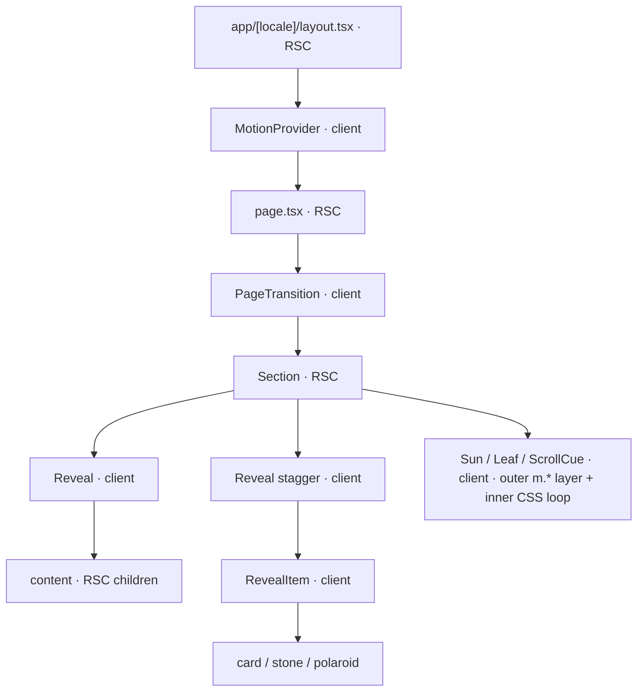

# 05 · Animation system

**Purpose.** This document fixes how every motion on the Green Pastures site is built: the single JavaScript
animation runtime (Motion), the one `Reveal` primitive and its variant catalogue (one named variant per design
entrance, with the exact keyframes lifted from the reference files), the ambient loops, the Yelp count-up, the
text swaps (menu day chip, EN ↔ 中文), the subpage slide between real routes, the scroll-snap / smooth-scroll
interplay, the reduced-motion policy, the performance and "animation-ready" invariants, and what must be tested.
It turns the "⚠ Animation-ready architecture", "Motion system" and "Interactions & state" sections of
`docs/design/README.md` into rules an implementer can follow without re-deriving numbers, and it keeps the door
open for the client's planned future scroll animations (parallax, pinning, scrubbing) without a refactor.

Status: draft · seat writer-animation · 2026-08-22 · revised 2026-08-23 against the shipped motion core
(PR-4.3a), which settled §5.6's locale-cascade rule the two readings of this document disagreed on — D-05.9,
§5.1, §5.6, §5.9 and §5.14 now describe what runs · revised again 2026-08-23 against the View Transitions
spike (PR-4.4), which found §5.7's CSS shipped a blank outgoing page when implemented literally — §5.7 and
OQ-05.2 now describe what runs · revised 2026-08-24 against `main` at #73: §5.1's module map carries the
shipped paths and `AmbientScope`, §5.1's `id` row and §5.5 carry the registry keys that actually exist
(`subpage.<page>.header`, `testimonials.header`), and §5.4 replaces the `useInView` it prescribed with the
observer that ships

## Decisions

- **D-05.1 Runtime.** Motion (`motion` package — the renamed framer-motion — imported from `motion/react`,
  version pinned by `01-stack-decisions.md`) is the only JavaScript animation runtime. CSS `@keyframes` and
  transitions are used for exactly four things: infinite ambient loops (§5.4), hover micro-interactions (§5.10),
  route View Transitions (§5.7) and colour/shadow state transitions on small controls (day chip, §5.6). No GSAP
  in launch scope (§5.12 states the adoption trigger).
- **D-05.2 One primitive.** All entrance animations go through `Reveal` (container) and `RevealItem`
  (staggered child). Sections never call Motion directly for an entrance and never use one-off CSS entrances.
- **D-05.3 Catalogue.** `src/components/motion/variants.ts` holds one named variant per design entrance.
  The values in §5.2 are the contract; a variant that is not in the table does not exist.
- **D-05.4 Tokens.** Motion timing/easing tokens are CSS custom properties declared by
  `03-design-system-tokens.md` (`--dur-*` are plain custom properties next to `@theme`; `--ease-*` is a Tailwind
  v4 theme namespace — memo ADJ-5). Motion code reads them through one TypeScript mirror `src/design/tokens.ts`
  whose parity with the CSS is enforced by a test (§5.14). `--reveal-threshold` exists only as the JS constant
  `REVEAL_THRESHOLD = 0.16`. 05 never redefines a token value.
- **D-05.5 Provider.** `MotionProvider` (client) wraps the root layout body: `LazyMotion features={domAnimation}
  strict` and `MotionConfig reducedMotion="user"`. All motion components are `m.*` from `motion/react-m`.
- **D-05.6 Reveal defaults.** `once: true`, `amount: 0.16`, `margin: "0px"`, `staggerChildren: 0.11` (110 ms),
  root scroller = the viewport. A session reveal registry keyed by `id` prevents replay when the homepage is
  re-mounted by a client navigation (return from a subpage, locale switch).
- **D-05.7 Ambient loops** are CSS keyframes on the inner layer of the decorative components (`Sun`, `Leaf`,
  `ScrollCue`), `ease-in-out infinite`, transform-only, paused while their section is off-screen, removed under
  reduced motion, fewer and smaller on mobile exactly as the mobile reference.
- **D-05.8 Count-up** uses Motion's standalone `animate(0, target, …)` over `--dur-countup` (1000 ms) with
  ease-out cubic, fired once by the Reviews header reveal; reduced motion renders the final value.
- **D-05.9 Text swaps.** State-driven swaps (menu day chip → sample line) use `WordSwap` = `AnimatePresence
  mode="wait"` keyed by the value, 200 ms (`--dur-word-swap`) fade + 6 px rise. The EN ↔ 中文 toggle is a URL
  navigation that remounts the `[locale]` subtree (memo ADJ-4), so it animates as an **enter-only cascade** on the
  new tree: every `Reveal` that had already played this session plays `variant="swap"` with a 14 ms/element
  delay capped at 300 ms, under a 200 ms root View-Transition crossfade (type `locale-swap`; browsers without
  View Transitions get the cascade alone). One that had never played keeps its own variant and waits for
  scroll — §5.6 states the rule and its reason. The locale cascade is `Reveal variant="swap"` — `WordSwap` is
  only the keyed menu-line swap — and under reduced motion it is an opacity-only cascade (the `y` track
  dropped), never a no-cascade instant swap.
  02 owns the locale mechanism; this doc owns the motion.
- **D-05.10 Subpage slide.** Production subpages are real routes. The slide is implemented with the **View
  Transitions API through React's `ViewTransition` component** (no config in the Next 16.x App Router; `Link`
  and `router.push/replace` carry `transitionTypes` — Next 16.2+). Forward navigation (type `subpage-enter`)
  slides the new page in `translateX(103%) → 0` over `--dur-subpage` (500 ms) `--ease-soft`; the in-app
  "← Back" (type `subpage-exit`) slides the old page out to `103%`. Browser back/forward, unsupported browsers
  and reduced motion get an instant swap. Motion `AnimatePresence` is **not** used across routes (App Router
  swaps route children immediately; exit animations across segments are unsupported — memo ADJ-3).
- **D-05.11 Scrolling.** The document (viewport) is the only scroll container. The homepage sets
  `scroll-snap-type: y proximity` on the root; sections are `scroll-snap-align: start` with
  `scroll-margin-top` = sticky-nav height. In-page nav links are plain hash anchors; smooth scrolling is CSS
  `scroll-behavior: smooth` on the `html` element together with `data-scroll-behavior="smooth"` (Next 16
  disables it during router navigations — memo ADJ-1); `auto` under reduced motion.
- **D-05.12 Hover micro-interactions** are CSS transitions gated by `@media (hover: hover) and (pointer: fine)`
  using `--dur-word-swap` / `--ease-soft`; an element whose transform Motion owns never receives a CSS transform
  (hover goes on an inner layer).
- **D-05.13 Future scroll work** uses Motion `useScroll` + `useTransform` on the decorative components' outer
  layer. GSAP ScrollTrigger is adopted only through a new ADR in `01-stack-decisions.md` when the trigger
  condition in §5.12 is met.

## Design

### 5.1 Architecture

Module map. The names are 05's and binding; the locations were 05's proposals and are now
`04-components-sections.md` §2's answer — every `src/motion/*` path this table used to spell resolves to
`src/components/motion/*`, and `src/design/tokens.ts` is 03's, fixed by memo ADJ-8.

| Module | Kind | Responsibility |
|---|---|---|
| `src/design/tokens.ts` | TS | 03's mirror of the motion tokens in Motion units (seconds, bezier arrays) — `ease`, `dur`, `stagger`, `rise`, `REVEAL_THRESHOLD`, `breakpoints`. Declared by `03-design-system-tokens.md` §7; never restated here. The only place Motion code reads numbers. |
| `src/components/motion/variants.ts` | TS | The catalogue (§5.2): `variants[name] = { hidden, visible, transition, reduced }`, dynamic by `custom` (index / side / tail). |
| `src/components/motion/MotionProvider.tsx` | client | `LazyMotion` + `MotionConfig reducedMotion="user"`; optional `reducedMotion` override prop for tests. Mounted once, in `app/[locale]/layout.tsx`, above `SiteHeader` rather than merely above `{children}` (D-05.5, 04 §1). |
| `src/components/motion/Reveal.tsx` | client | `Reveal`, `RevealItem`, `useRevealed()`; registry; locale-swap cascade. |
| `src/components/motion/registry.ts` | TS | `revealedIds` (a `Set` of reveal ids), `markLocaleSwap()`, cascade counter. Module scope = survives client navigations, resets on full load. |
| `src/components/motion/WordSwap.tsx` | client | `AnimatePresence mode="wait"` keyed text/element swap. |
| `src/components/motion/CountUp.tsx` | client | Count-up with `animate()`; reads `useRevealed()`. |
| `src/components/motion/PageTransition.tsx` | client | The only place that touches React `ViewTransition`; used by every `page.tsx`. Imports `view-transitions.css`, so the stylesheet travels with it. |
| `src/components/motion/AmbientScope.tsx` | client | 04 §3.3's name for the off-screen half of D-05.7: the one observer that sets `data-ambient="paused"` on a looping section (§5.4). Renders a hidden `span` and nothing visible. |
| `src/components/motion/view-transitions.css` | CSS | Route slide / crossfade rules on `::view-transition-*`, token-driven. |
| `src/components/motion/ambient.css` | CSS | `gpfloat`, `gpfloat2`, `gpsun`, `gpbounce` keyframes and the `[data-ambient]` rules. Imported by each decoration that can carry a loop, not by `globals.css`. |

Composition (server/client boundary):



Rules: sections stay server components; `Reveal` is a thin client component that receives server-rendered
children, and so are the decorative components (`Sun`, `Leaf`, `ScrollCue`, … — **client from day one**,
04 D-04.15, because an RSC cannot render the outer `m.*` layer INV-05.5 requires; they are stateless and
receive server-rendered children, so the "sections are server" rule holds around them).
Props crossing the boundary are strings/numbers only (variant names, indices, ids) — no callbacks.
Count-up and other reveal-dependent behaviour read `useRevealed()` from the `Reveal` context instead of
receiving a callback.

`Reveal` API:

| Prop | Type · default | Meaning |
|---|---|---|
| `variant` | `VariantName` · `'rise'` | Catalogue entry (§5.2). `'none'` = no entrance (used by nav items so they still join the locale cascade). |
| `stagger` | `boolean` · `false` | Children are `RevealItem`s; container transition `staggerChildren: stagger.child` (0.11 s = `--stagger-child`). |
| `delay` | seconds · `0` | `delayChildren` (stagger) or `delay`. |
| `once` | `boolean` · `true` | `viewport.once`. Test-only override; production always `true` (INV-05.9). |
| `amount` | `number \| 'some' \| 'all'` · `REVEAL_THRESHOLD` (0.16) | `viewport.amount`. Test-only override; production always `0.16`. |
| `margin` | string · `"0px"` | `viewport.margin`. Test-only override; production always `"0px"`. |
| `as` | `'div' \| 'section' \| 'ul' \| 'li' \| 'figure' \| 'p' \| 'span' \| 'h2' \| 'h3'` · `'div'` | Element, rendered as `m[as]`. |
| `id` | string · required when `once` | Registry key, and **unique across the site rather than per page** — the registry is one `Set` for the session (D-05.6), so two blocks on two routes sharing an id share one entrance and the second never plays. A home section's blocks are `<section>.<slot>` (`programs.header`, `programs.stones`); a subpage composite's are `<page>.<slot>` (`reviews.count`); the header the six detail pages share is **`subpage.<page>.header`**, prefixed because `gallery`, `programs` and `menu` are page namespaces *and* home section ids — unprefixed, a reader who had scrolled past the home Gallery section reached `/gallery` at opacity 1 with no transform, its rise already spent. `SubpageHeader` derives the key rather than taking it as a prop (04 §3.1). |
| `opaque` | `boolean` · `false` | Drops the opacity track (transform only). Used for the LCP candidate (hero photo). |
| reduced motion | — | Not a prop. `MotionConfig reducedMotion="user"` disables transform/layout animation globally; the catalogue's `reduced` entry supplies the per-variant fallback (§5.9). |

`RevealItem` props: `variant` (required), `index` (drives alternation), `side: 'left' \| 'right'` (polaroids),
`tail: 'left' \| 'right'` (bubbles), `as`. Both components add `data-reveal` so a `noscript` stylesheet
(`[data-reveal] { opacity: 1 !important; transform: none !important; filter: none !important }`) shows content
when JavaScript is unavailable; that stylesheet is emitted inline by `MotionProvider` as a `<noscript>` element,
not by a stylesheet file (04 §2). `Reveal` additionally carries `data-reveal-id` = its registry key, which is
the attribute a DOM or end-to-end test addresses a single block by; `RevealItem` carries neither an id nor an
index, because the cascade and the registry work on the block, not on its parts (§5.6). The hidden state is
`opacity`/`transform` only, so nothing leaves the accessibility tree and no space is reserved late (INV-05.7).

Illustrative usage (Programs section, RSC):

```tsx
<Reveal id="programs.header" variant="rise" as="div">
  <Eyebrow>{t('programs.eyebrow')}</Eyebrow><H2>{t('programs.title')}</H2>
</Reveal>
<Reveal id="programs.stones" stagger as="ul">
  {stones.map((s, i) => (
    <RevealItem key={s.id} as="li" variant="sprout" index={i}>
      <SteppingStone {...s} />
    </RevealItem>
  ))}
</Reveal>
```

Internals: `Reveal` renders `m[as]` with `initial="hidden" whileInView="visible"
viewport={{ once, amount, margin }}` and container variants `{ hidden: {}, visible: { transition: {
staggerChildren, delayChildren } } }`; `RevealItem` renders `m[as]` with `variants={variants[variant]}` and
`custom={{ index, side, tail }}` so Motion's variant propagation drives the children. Motion pools
IntersectionObservers per options set; production `Reveal`s all use the frozen options (`once: true`,
`amount: 0.16`, `margin: "0px"`), so all reveals share one pooled observer; `AmbientScope`'s ambient-pause
observer (§5.4) is the page's second and last.
If `registry.revealedIds.has(id)`, `Reveal` renders `initial={false}` (final state, no animation) — unless a
locale swap is in flight, in which case that same registry hit is exactly what makes it play `swap` instead
(§5.6). Above-the-fold reveals fire at hydration; the prototype's `checkInView()` rAF fallback is not needed
(no iframe root).

Token mirror: `src/design/tokens.ts` is declared by `03-design-system-tokens.md` §7 (memo ADJ-8) and is not
restated here — 05 owns no token value and no export name. Motion code reads that module's exports: `ease.*`
(bezier arrays), `dur.*` (seconds), `stagger.*` (seconds), `rise.*` (px), `REVEAL_THRESHOLD` and `breakpoints`.
The mapping from token to variant is §5.13; the CSS ↔ TS parity test is §5.14.

### 5.2 Variant catalogue

Every entrance in `docs/design/README.md` ("Motion system") maps to one variant. Values are copied from the
prototype logic (`docs/design/desktop/Green Pastures - Homepage.dc.html`, `getFX`, lines 600–613; identical in
the mobile file, lines 491–504). "std" = CSS `ease`; SOFT/SPRING = `--ease-soft` / `--ease-spring`.

| Variant | Design entrance | `hidden` → `visible` | Transition (tokens) | Motion `times` | Origin | Reduced motion |
|---|---|---|---|---|---|---|
| `rise` | Section headers/blocks; Hero text column and hero photo (hero is plain rise, not a special variant) | `opacity 0, y 26` → `opacity 1, y 0` (mobile y 18, §5.3) | `y`: `--dur-rise` 750 ms SOFT · `opacity`: `--dur-rise` 750 ms std (prototype .7 s/.8 s, unified by the token) | — | — | opacity only |
| `riseChild` | Default staggered child (sections without a bespoke variant; subpage lists) | `opacity 0, y 22` → `opacity 1, y 0` | as `rise` | — | — | opacity only |
| `ink` | Philosophy quote block + badges "ink in" | `opacity 0, scale .97, filter blur(14px)` → `opacity 1, scale 1, blur(0px)` | all tracks `--dur-ink` 950 ms; `scale` SOFT, `opacity`/`filter` std | — | — | opacity only (no blur, no scale) |
| `fade` | Visit — 3 blocks, slow fade | `opacity 0` → `opacity 1` | `--dur-visit-fade` 1100 ms std | — | — | opacity 1100 ms (already motion-free) |
| `sprout` | Programs stones (`gpsprout`) | `opacity [0, 1, 1, 1]`, `scale [.6, 1.05, .985, 1]`, `scaleY [.25, 1.07, 1, 1]` | 900 ms SPRING (token requested: `--dur-sprout`) | `[0, .6, .8, 1]` | `50% 100%` | opacity only |
| `roll` | Menu plate (`gproll`, stagger child 0) | `opacity [0, 1, 1]`, `x [-90, 10, 0]`, `rotate [-150, 8, 0]` | 850 ms SOFT (requested: `--dur-roll`) | `[0, .6, 1]` | centre | opacity only |
| `drop` | Menu day-chip row and sample line (`gpdrop`, children ≥ 1) | `opacity [0, 1, 1, 1]`, `y [-34, 7, -4, 0]` | 700 ms std (requested: `--dur-drop`) | `[0, .55, .75, 1]` | — | opacity only |
| `polaroid` | Gallery polaroids fly in from alternating sides | `opacity 0, x ±150, rotate ±10, scale .9` → `opacity 1, x 0, rotate 0, scale 1`; even index = left (−150 px, −10°), odd = right (+150 px, +10°) | `x/rotate/scale`: `--dur-polaroid` 800 ms SPRING · `opacity`: 500 ms std (requested: `--dur-polaroid-fade`) | — | centre (entrance rotation is separate from the resting ±2–6° tilt, which lives on the inner frame) | opacity only |
| `bubble` | Reviews speech bubbles inflate from the tail — the only "pop" | `opacity 0, scale .3` → `opacity 1, scale 1` | `scale`: 650 ms SPRING (requested: `--dur-bubble`) · `opacity`: 450 ms std (requested: `--dur-bubble-fade`) | — | tail left `12% 100%`, tail right `88% 100%` (desktop: cards 1 and 3 left, card 2 right; mobile: alternating) | opacity only |
| `swing` | Teachers frames swing & settle (`gpswing`) | `opacity [0, 1, 1, 1, 1]`, `rotate [-9, 5, -2.5, 1, 0]`, `y [-12, 0, 0, 0, 0]` | 1000 ms std (requested: `--dur-swing`) | `[0, .35, .6, .8, 1]` | `50% 0%` | opacity only |
| `swap` | Locale cascade (§5.6) and `WordSwap` enter | `opacity 0, y 6` → `opacity 1, y 0` | `--dur-word-swap` 200 ms std; delay `min(index × 14 ms, 300 ms)` | — | — | opacity only |
| `none` | Nav items | — | — | — | — | — |

Variants with multi-stop keyframes (`sprout`, `roll`, `drop`, `swing`) need Motion keyframe arrays with
`times` (same length as the keyframe array). Two-state variants use per-property transitions. The four prototype
keyframes, verbatim from the desktop reference (lines 23–27; mobile file lines 23–27 are identical):

| Keyframe | Stops | Prototype use |
|---|---|---|
| `gpsprout` | `0% {opacity:0; transform:scale(.6) scaleY(.25)}` · `60% {opacity:1; transform:scale(1.05) scaleY(1.07)}` · `80% {transform:scale(.985)}` · `100% {opacity:1; transform:none}` | `.9s SPRING both`, origin `50% 100%` |
| `gproll` | `0% {opacity:0; transform:translateX(-90px) rotate(-150deg)}` · `60% {opacity:1; transform:translateX(10px) rotate(8deg)}` · `100% {opacity:1; transform:none}` | `.85s SOFT both` |
| `gpdrop` | `0% {opacity:0; transform:translateY(-34px)}` · `55% {opacity:1; transform:translateY(7px)}` · `75% {transform:translateY(-4px)}` · `100% {opacity:1; transform:none}` | `.7s ease both` |
| `gpswing` | `0% {opacity:0; transform:rotate(-9deg) translateY(-12px)}` · `35% {opacity:1; transform:rotate(5deg)}` · `60% {transform:rotate(-2.5deg)}` · `80% {transform:rotate(1deg)}` · `100% {opacity:1; transform:none}` | `1s ease both`, origin `50% 0%` |

`gpdevelop` (a brightness/contrast/saturate/blur "photo develop" filter) is defined in both reference files but
used by nothing; it is not in the catalogue (OQ-05.3). `scale` + `scaleY` compose multiplicatively in Motion,
matching the CSS `scale(1.05) scaleY(1.07)` stop. A single `ease` applies per keyframe segment in both CSS and
Motion, so the SPRING overshoot of `sprout` plays on each segment as in the prototype. Transform order: Motion
composes `translate → scale → rotate`, whereas `gpswing` is `rotate(-9deg) translateY(-12px)` (the 12 px lift is
rotated by 9°, ≈2 px of horizontal difference); `swing` therefore sets `transformTemplate` to emit
`rotate() translateY()` so the motion matches verbatim. `gproll` (`translateX() rotate()`) matches the default.

### 5.3 How sections compose Reveal

| Section | `Reveal` (variant) | Stagger container → `RevealItem` | Decorations / other |
|---|---|---|---|
| Hero | text column `rise`; photo block `rise` + `opaque` — **labelled deviation**: the prototype's default rise fades the photo too; we keep it transform-only so the LCP candidate is never at opacity 0 (OQ-05.8) | — | `Sun`, `Leaf` ×3 (desktop) / `Leaf` ×1 (mobile), `ScrollCue` |
| Philosophy | quote block `ink`; badges row `ink`; mobile only: photo block `ink` (mobile reference L86; the desktop photo is static) | — | mobile: `Leaf` ×1 |
| Programs | header `rise`; link `rise` | 3 stones → `sprout` | stones are `SteppingStone` components |
| Menu | header `rise`; benefit chips + link row `rise` | plate (index 0) → `roll`; day-chip row, sample line → `drop` | `Plate` component; `WordSwap` on the sample line |
| Gallery | header `rise`; link `rise` | 7 polaroids (desktop) / 5 (mobile) → `polaroid`, side by index parity | `Polaroid` component (inner frame holds resting tilt) |
| Reviews (section id `testimonials`) | header `rise` (contains the two `CountUp`s); link `rise` | 3 bubbles (desktop) / 2 (mobile) → `bubble`, origin by tail side | `Bubble` component. The design's name for this section is Reviews and its id is `testimonials`, so its reveal keys read `testimonials.*` (§5.1) — `reviews.*` belongs to the subpage |
| Teachers | header `rise`; link `rise` | 3 frames → `swing` | `TeacherFrame` component |
| Visit | title block, form card, info column (photo + panel) → `fade`; footer row static (not animated in the prototype) | — | — |

Mobile (`docs/design/mobile/README.md`): keyframes, easings and tokens are identical; reveal distance for
`rise` is 18 px (the design's "16–20 px" range; OQ-05.6 ratifies), delivered by the variant factory reading
`rise.sm` from `src/design/tokens.ts` under the mobile breakpoint hook (CSS tokens `--reveal-rise: 26px` /
`--reveal-rise-sm: 18px` are requested from 03, §5.13); `riseChild` stays 22 px. Entrances are otherwise
identical; hover states are absent on touch (§5.10).

Stagger: `staggerChildren: 0.11` per child, index order = DOM order, one container per group (never nested
staggers). Reveal once: the container registers its `id` on the first `visible`; `once: true` on the viewport.

### 5.4 Ambient loops

| Loop | Element | Keyframes (`ease-in-out infinite`, transform-only) | Duration | Desktop | Mobile |
|---|---|---|---|---|---|
| `gpfloat` | `Leaf` | `0%,100% translateY(0) rotate(0deg)` · `50% translateY(-12px) rotate(10deg)` (mobile `translateY(-10px) rotate(10deg)`) | `--dur-leaf` 8 s base; instances 7 s / 9 s (requested `--dur-leaf-fast` / `--dur-leaf-slow`) | hero leaves 40/28/22 px at 7 s, 8 s (`gpfloat2`), 9 s | hero leaf 26 px 7 s; philosophy leaf 24 px 8 s |
| `gpfloat2` | `Leaf variant="b"` | `50% translateY(10px) rotate(-8deg)` | 8 s | desktop only (28 px leaf) | — |
| `gpsun` | `Sun` | `0%,100% rotate(0deg)` · `50% rotate(22deg)`; `transform-origin: 60px 60px` (centre of the 120 viewBox) | `--dur-sun` 9 s | 118 px | 72 px |
| `gpbounce` | `ScrollCue` | `0%,100% translateY(0)` · `50% translateY(6px)` | `--dur-cue` 2 s | "scroll to come inside ⌄" | same, 12 px text |

Decision: CSS keyframes, not a Motion `animate` loop. They run on the compositor with no JS driver, are trivially
disabled by the reduced-motion media query, and the element is still Motion-addressable later because every
decorative component has two layers: an **outer** positioning layer (a `m.*` element with a stable `id` and
forwarded `ref` — the future parallax/scrub target) and an **inner** layer that carries the CSS loop. Two nested
elements mean the two transforms compose and never fight (INV-05.5) — and the outer layer is why these are
client components from day one (04 D-04.15). Component props: `Leaf` `size`, `speed: 'fast' | 'base' | 'slow'`
(7/8/9 s), `variant: 'a' | 'b'`, `tint`, `loop?: boolean` (default `true`); `Sun` `size` (118 / 72),
`loop?: boolean` (default `true`); `ScrollCue` `href`. Only the hero decorations (plus the mobile philosophy
leaf) loop in the references; the seven static section leaves and the two static suns are the same components
with `loop={false}`, which drops the `.loop` class so no keyframes attach (04 §3.4 owns the per-instance
placement and counts; the table above covers only the looping instances).

**`ambient.css` sits in `@layer components`** (`gp-dln.304`). It is imported by `Leaf` / `Sun` / `ScrollCue`
rather than by `globals.css`, so it ships as its own chunk, and a chunk naming no layer is *unlayered* — which
in the cascade beats every layered declaration outright, specificity irrelevant. That made the loops
unreachable from Tailwind: `.md\:[&>svg]\:animate-none>svg` (0,1,1) in `@layer utilities` lost to
`.loop[data-loop="leaf"]` (0,2,0) on both counts, and only `animate-none!` won. `components` is the layer
Tailwind v4 declares immediately before `utilities`, so wrapping the file there makes **any** utility outrank
the loops on layer order alone. What that buys is the case `loop?: boolean` cannot express — a loop on at one
breakpoint and off at another, written `md:[&>svg]:animate-none` on the caller's `className` with no `!` and
no duplicate element (`sections/philosophy/layout.ts` is the instance that had to route around its absence).
Two things are unchanged by design: within the layer the cascade is as before, so `data-speed` still overrides
`data-loop` on source order; and §5.9's `animation: none !important` still wins over every utility, because
`!important` reverses layer order and an important declaration in `components` beats one in `utilities`.

Pausing: one observer per looping section — `AmbientScope`, 04 §3.3's name for it and this document's too —
toggles `data-ambient="paused"` on the hero (and on philosophy at the mobile breakpoint), against
`[data-ambient="paused"] .loop { animation-play-state: paused }`. It is dropped into the section's `decor`
slot, renders a hidden `span` as its foothold, and takes the nearest `[data-section]` ancestor as its scope —
`Section` (04 D-04.3) is the only thing that writes that attribute, so the scope needs no id and no agreement
with its parent about a name that could drift.

**A plain `IntersectionObserver`, not Motion's `useInView`,** which is what this paragraph and 04 §3.3 used to
specify. `useInView` takes a ref to an element React rendered, and the element that must carry `data-ambient`
is a `<section>` a *server* component renders several layers up; priming a ref for it from a layout effect
works only for as long as the hook keeps reading `ref.current` from a passive effect. The count is unchanged —
this is the one observer beyond the frozen `Reveal` pool that INV-05.9 allows, the same reading `Turnstile`
already takes for its own viewport trigger — so what moves is where the contract is written, out of Motion's
internals and into a file that states it. The pause fails **open** in all three directions, because the two
are not symmetric (an unpaused loop is a wasted frame; a paused-but-never-resumed one is a bug): the attribute
is absent until the observer speaks, absent when no scope is found, and removed on cleanup, since a section
can outlive a scope that only one breakpoint mounts.

Hidden tabs: browsers stop painting, so no work is done. Mobile keeps exactly the reference's set (sun + 2
leaves + cue): fewer, smaller, transform-only. Under `@media (prefers-reduced-motion: reduce)` the loops are
`animation: none`.

### 5.5 Count-up (Yelp 5.0 / 47)

`CountUp` (client) renders `value` with `decimals` (5.0 → 1, 47 → 0; both come from the shared config, not
literals — `02-i18n-content-contract.md`). The server HTML contains the **final** formatted value (SEO, no-JS).
After hydration, while its `Reveal` is still hidden, it swaps to 0; when `useRevealed()` flips it runs
`animate(0, value, { duration: dur.countup, ease: ease.outCubic, onUpdate })` — 1000 ms, ease-out cubic
(`1 − (1 − p)^3`), formatted each frame, final value snapped on complete. Formatting goes through the locale
number formatter that 02 specifies (`Intl.NumberFormat(locale, { minimumFractionDigits: decimals,
maximumFractionDigits: decimals })` unless 02 says otherwise). `font-variant-numeric: tabular-nums` and a
`min-width` in `ch` keep the width stable while digits change (INV-05.7). Reduced motion (`useReducedMotion()`
or `MotionConfig` override): never swaps to 0, shows the final value.

Runs once per session, off the registry id **`testimonials.header`** — the home section's id, since the
section this header belongs to is `testimonials` in `site.routes[]` even though the design calls it Reviews
(§5.3). `reviews.header` was never this block's key: it was the Reviews *subpage*'s, and that one is
`subpage.reviews.header` now (§5.1). The distinction is not academic — the subpage draws no count-up at all,
because neither subpage reference carries the `data-count` the home reference puts on its count line, so the
page's two numbers are printed and only the home section's are counted.

### 5.6 Text swaps: menu day chip and EN ↔ 中文

**Menu day chip.** State `selectedMenuDay` (owned by the Menu section component, 04; default = current weekday
computed on the server in 02's fixed `timeZone` (`America/Los_Angeles`, shared config) — deterministic, so no
hydration mismatch; Saturday / Sunday default to Monday is 04's call). Selected chip: background `#e0a93a`, padding `8px 20px` (unselected
`8px 16px`) on desktop, `9px 16px` (`9px 13px`) on mobile — a CSS transition on `background-color` only, over
`--dur-word-swap` `--ease-soft`; the padding change is instant (`padding` is layout, INV-05.1). The sample-meals line is wrapped in `WordSwap` keyed by `day`:
`AnimatePresence mode="wait"`, exit `opacity 0` (200 ms std), enter = `swap` variant (200 ms fade + 6 px rise).
The design specifies no animation for this swap; the `WordSwap` micro-transition is a conscious addition and is
removable without touching anything else (OQ-05.3).

**Language toggle.** Locale lives in the URL (`/en/…` ↔ `/zh/…`, ADR-001). The toggle is a same-path
`router.replace(pathname, { locale, scroll: false })` (02/06 own the call) which remounts the `[locale]`
subtree — so the prototype's per-string "fade out, swap text, fade back" cannot be ported literally (memo
ADJ-4). The motion we specify:

- Before navigating, the toggle calls `registry.markLocaleSwap()` (timestamp) and, where View Transitions are
  available, passes `transitionTypes: ['locale-swap']` so the root crossfades over `--dur-word-swap` 200 ms
  (this stands in for the prototype's out-phase: `opacity .2s ease, transform .2s ease` to `opacity 0;
  translateY(6px)`, text swapped at `210 + min(i × 14, 300)` ms, then back to `opacity 1`).
- **Already-revealed is the whole gate.** A `Reveal` that mounts within 1000 ms of the mark plays `swap` instead
  of its section variant **if and only if it was already in the registry when it mounted** — it played earlier in
  this session, or it is a `variant="none"` nav item, which counts as revealed by definition because it has no
  entrance to wait for. A `Reveal` that had never played keeps its own section variant and waits for scroll,
  exactly as on a first load. **Where the block sits relative to the fold is never consulted**, on either side of
  the rule: the only question is whether the reader has already seen this text, which is what the cascade is
  signalling — the words they were looking at have changed language. The cascade is `Reveal variant="swap"`, not
  `WordSwap`: opacity 0→1, y 6→0, 200 ms std, delay `min(i × 14 ms, 300 ms)` where `i` is the mount-order counter
  (nav items first — they are `Reveal variant="none"` — then hero, then the rest in DOM order, like the
  prototype's `[data-i18n]` order). A cascading container carries the swap by itself; its `RevealItem` children
  render their final state rather than replaying their own entrance, which is the block granularity the next
  bullet records.
- The cascade granularity is the text **block** (`Reveal`), not the individual string. This is a deliberate
  deviation from `docs/design/README.md` L73 ("each tagged string"), recorded as OQ-05.4 for design sign-off.
- Mobile: the toggle lives in the hamburger menu (`docs/design/mobile/README.md`); the same cascade runs after
  the sheet closes. Reduced motion: opacity-only cascade (Motion drops the `y` track), VT crossfade instant.

Requirements stated to 02/06: the locale switch must be a same-path client navigation with `scroll: false`, must
support `transitionTypes`, and `NextIntlClientProvider` must reach `WordSwap`/`CountUp` (ADJ-4/ADJ-7).

### 5.7 Subpage slide transition (real routes)

Design: "learn more →" slides a full detail page in from the right, `translateX(103%) → 0`, `.5s SOFT`; "← Back"
slides it out; in production these are real routes with the same transition (`docs/design/README.md` L72). The
desktop reference's inline `.55s` is prototype drift; the token is `--dur-subpage: 500ms` (README value).

Options evaluated (all against Next 16.x App Router, React 19.2):

| Option | Verdict | Why |
|---|---|---|
| Motion `AnimatePresence` around route children / `template.tsx` | **Rejected** | The App Router swaps route children immediately, so exit animations across segments never run without relying on internal router context ("frozen router" hacks); `template.tsx` remounts per navigation and gives enter only (memo ADJ-3). |
| Imperative exit-then-navigate with Motion | Rejected as primary, kept as **F1 fallback** | Deterministic everywhere, but delays the URL change by up to 500 ms, gives no exit for browser Back, and duplicates what the browser can do natively. |
| Parallel + intercepting route overlay | Rejected | Overlay semantics would preserve the home page under the panel, but intercepting routes behave differently on hard load / refresh / history, need `default.js` per slot (ADJ-1), and still cannot animate the slot's exit. |
| **View Transitions API via React `ViewTransition` + `Link transitionTypes`** | **Chosen** | Enter and exit in both directions, CSS-declared with our tokens, no JS runtime, viewport-level snapshots, works with no config in Next 16.2+ (`nextjs.org/docs/app/guides/view-transitions`, 16.3.2). Silent fallback = instant swap. Same-document support: Chromium 111+, Safari 18+, Firefox 144+ (transition types: Chromium 125+, recent Safari/Firefox) `[assumed — confirm]` (memo ADJ-19). No global support share is asserted: the fallback is a silent instant swap, so the exact share is not load-bearing for this decision. |

Mechanism:

- Every `page.tsx` (home and the six detail pages) wraps its content in `PageTransition`, which renders React
  `ViewTransition` with `enter={{ 'subpage-enter': 'gp-page', default: 'none' }}`,
  `exit={{ 'subpage-exit': 'gp-page', default: 'none' }}`, `default="none"` — the Next guide's "wrap every
  participating page" pattern. Untyped navigations (browser back/forward, refresh, nav links, other `Link`s)
  animate nothing: instant swap.
- "learn more →" links are `Link href={detailHref} transitionTypes={['subpage-enter']}` (next-intl's `Link`
  wrapper must pass `transitionTypes` through — requirement to 06).
- "← Back" on a detail page calls `router.replace(`${home}#${sectionId}`, { transitionTypes: ['subpage-exit'] })`
  where `sectionId` is the static detail ↔ home-section mapping (06). Trade-off: typed `replace` leaves history
  as [home, home#section] and lands on the section's snap point (not the exact prior scroll offset), whereas
  `router.back()` restores the exact offset and keeps history minimal but cannot carry `transitionTypes` — no
  slide-out. Decision: typed `replace`; the design's slide-out wins, and the hash + `scroll-margin-top` puts the
  user at the section they left. 06 confirms in D-06.8 (OQ-05.5 closed).
- The CSS (tokens from 03). This is `src/components/motion/view-transitions.css` as it ships, with its comments
  stripped, plus the one declaration a lint gate was blocking when it shipped (`pointer-events`, second note
  below). Take it literally: the version of this block that stood here before the OQ-05.2 spike was written as
  a set of *absences* — "animate nothing" — and a literal implementation of it shipped a blank outgoing page.
  The notes after the fence say which declarations are load-bearing and why.

```css
/* src/components/motion/view-transitions.css — imported by PageTransition.tsx, not by globals.css */

/* The floor. It is stated as a picture — old snapshot hidden, new snapshot visible, nothing running — rather
   than as "no animation", because "no animation" is what produced the blank page. Every untyped navigation
   (browser Back/Forward, refresh, a nav link, a Suspense reveal) lands here, and so does a typed navigation in
   a browser that has View Transitions but not transition *types*: it degrades to the instant swap rather than
   to a broken half-slide. Hiding the old snapshot matters as much as stopping the animation — the UA
   composites the two images with `mix-blend-mode: plus-lighter` on the assumption that their opacities
   cross-fade and sum to one, so two snapshots left at full opacity add together into a white flash. */
::view-transition-group(root) { animation: none; opacity: 1 !important; }
::view-transition-old(root) { animation: none; opacity: 0; }
::view-transition-new(root) { animation: none; opacity: 1; }

/* The snapshot overlay covers the viewport for the whole 500 ms of a slide; without this it eats every click
   in that window. Measured, in all three engine/viewport combinations the spike ran. */
::view-transition { pointer-events: none; }

/* Forward — the one direction that has to invert the floor: the page the visitor is looking at is the *old*
   snapshot, and the destination's own background must stay hidden until the panel has finished travelling, or
   it appears beside the panel as a growing blank margin. */
html:active-view-transition-type(subpage-enter)::view-transition-old(root) { opacity: 1; }
html:active-view-transition-type(subpage-enter)::view-transition-new(root) { opacity: 0; }
html:active-view-transition-type(subpage-enter)::view-transition-new(.gp-page) {
  animation: gp-slide-in var(--dur-subpage) var(--ease-soft) both;
}

/* Back — one rule, because the floor's picture is already the right one here: the home page is visible from
   the first frame and the page being left slides off above it. */
html:active-view-transition-type(subpage-exit)::view-transition-old(.gp-page) {
  animation: gp-slide-out var(--dur-subpage) var(--ease-soft) both;
}

/* Locale switch: a root cross-fade at word-swap speed. It has to name its own keyframes — the floor set
   `animation: none` on `root`, so restoring a duration alone would restore nothing, there being no
   `animation-name` left to time. `both` fill is what lets the two tracks override the floor's static
   opacities for the length of the fade and hand them back afterwards. */
html:active-view-transition-type(locale-swap)::view-transition-old(root) {
  animation: gp-fade-out var(--dur-word-swap) var(--ease-std) both;
}
html:active-view-transition-type(locale-swap)::view-transition-new(root) {
  animation: gp-fade-in var(--dur-word-swap) var(--ease-std) both;
}

/* `translate`, not `transform: translateX()`: it is the independent transform property, so nothing a page
   sets on `transform` can clobber it. `103%` is the design's figure — the extra 3% keeps the panel's shadow
   off-screen at rest. */
@keyframes gp-slide-in { from { translate: 103% 0; } to { translate: 0 0; } }
@keyframes gp-slide-out { from { translate: 0 0; } to { translate: 103% 0; } }
@keyframes gp-fade-in { from { opacity: 0; } to { opacity: 1; } }
@keyframes gp-fade-out { from { opacity: 1; } to { opacity: 0; } }

/* Reduced motion (§5.9): removed outright, not shortened — a full-viewport horizontal slide is the likeliest
   thing on this site to make a motion-sensitive visitor unwell. `animation: none` rather than a `0s`
   duration, because INV-03.2 bans a raw `s` in this file and there is no zero-duration token to spell it
   with; a removed animation is also the truer "instant", since it ends the snapshot overlay on the next frame
   instead of holding a frozen picture of the page over it. The opacities repeat the floor across *every*
   group, not `root` alone, because the `.gp-page` groups exist under reduced motion too and must resolve to
   the same destination-only picture. */
@media (prefers-reduced-motion: reduce) {
  ::view-transition-group(*) { animation: none !important; opacity: 1 !important; }
  ::view-transition-old(*) { animation: none !important; opacity: 0 !important; }
  ::view-transition-new(*) { animation: none !important; opacity: 1 !important; }
}
```

- **`opacity: 1 !important` on the root group is load-bearing. Do not tidy it away as redundant.** With
  `animation: none` alone — which is how this block read before the OQ-05.2 spike — the root group computes to
  `opacity: 0`, so *nothing in it paints*: a forward navigation shows white where the outgoing page should be
  and the panel slides in over blank paper. The value being overridden is not in any stylesheet. It comes from
  a UA **animation** on the group, which appears in `getAnimations()` with a null `animationName` — that is
  precisely why `animation: none` cannot cancel it, there being no name for the shorthand to match — and the
  cascade puts animations above normal author declarations, so only an important declaration outranks one. The
  spike isolated seven variants of this block; six were pixel-identical to the broken original, and this
  declaration was the difference. It costs one line, it is invisible in code review, and deleting it re-ships a
  blank page.
- **`pointer-events` needed a gate change, and got one.** It is not an animated property, so
  `.stylelintrc.mjs`'s `property-allowed-list` for the two motion stylesheets did not carry it and the first
  implementation left the declaration out rather than bypass a gate it did not own; the measured consequence
  was swallowed clicks for the length of every slide. The allow-list constrains what these files *animate*, not
  the static declaration that makes an animation usable, so `pointer-events` is now allowed — for
  `src/components/motion/view-transitions.css` and `src/components/motion/ambient.css` only, never globally.
- **The locale-swap rules are correct and, today, never fire.** A locale switch starts no view transition at
  all. The spike drove it both ways — `router.replace(pathname, { locale, scroll: false, transitionTypes:
  ['locale-swap'] })` per D-06.9, and a plain different-locale `Link` — and neither called
  `startViewTransition`: no snapshot pseudo-elements existed at any point, and the document did not reload
  either, so this is a client navigation that simply declines to animate rather than a full page load in
  disguise. The rules stay, because they are the right rules the day the navigation does start one and they
  cost nothing while it does not. What must not happen is code written against an assumption they hold:
  **PR-4.5 cannot assume the 200 ms root cross-fade plays**, so under today's stack the locale cascade of §5.6
  (`Reveal variant="swap"`) is the whole of the visible motion, and it is enough on its own — the cross-fade
  was always the out-phase stand-in, not the signal. Why the transition does not start was not established;
  nothing is blocked on the answer.
- Scroll: forward navigation scrolls to top (Next default, = prototype `scrollTop = 0`); Back lands on the
  origin section via the hash; browser Back restores position (Next). During router navigations Next switches
  `scroll-behavior` to `auto` because the `html` element carries `data-scroll-behavior="smooth"` (ADJ-1), so
  neither scroll is animated under the slide.
- **Focus: required, not optional.** OQ-05.2 (e) asked whether Next's own navigation handling already focuses
  the arriving page and so makes this paragraph redundant. Measured, it does not: after a typed forward
  navigation, after typed Back and after browser Back, `document.activeElement` is `<body>` in every case — the
  router moves focus nowhere at all. So 04 implements it. After the transition the detail page's `h1`
  (`tabIndex={-1}`) receives focus with `preventScroll`; on Back, the origin section heading receives focus.
  Skipped, a keyboard visitor's next Tab restarts from the top of the document on every navigation.
- Direct URL load of a detail page: no transition (View Transitions only run on client navigations); the SSR
  HTML is the final layout; in-page `Reveal`s behave as on the home page.
- **The slide is best-effort for un-prefetched routes.** If the destination suspends before it has rendered,
  the old and new sides never form a pair, so there is no `.gp-page` enter to animate and the navigation is
  instant with no animation — observed, not inferred. This is not a CSS bug and there is nothing to fix in this
  file: it is a fourth silent-fallback path alongside untyped navigation, reduced motion and an unsupporting
  browser, and it is a concrete reason to leave `Link` prefetching on for the six detail routes. A visitor who
  clicks faster than the route loads gets the destination, just without the 500 ms.
- In-page reveals keep working during a transition: the new snapshot is live, so `whileInView` entrances play
  while the page slides; the registry stops the home page replaying on Back.
- The sticky nav is layout chrome shared by both pages; it does not slide (unnamed → part of the root, visually
  static). The prototype's overlay covered the nav; this is a conscious production choice (OQ-05.4).
- Reduced motion and unsupported browsers: instant swap, URL and scroll behaviour identical.
- **F1 fallback** (only if 01 withdraws View Transitions): `PageTransition` becomes a Motion `m.div`
  `initial={{ x: '103%' }} animate={{ x: 0 }}` (500 ms SOFT) on the detail route group, and "← Back" animates
  the wrapper to `x: '103%'` then navigates; browser Back is instant. `PageTransition` is the single place to
  swap, so nothing else changes.

### 5.8 Scroll-snap, smooth scroll, sticky nav and reveals

- Scroller: the document. No nested scroll container (the prototype's `[data-gp-scroll]` exists only because
  it is a canvas frame). The homepage opts in with `html:has([data-snap-root]) { scroll-snap-type: y proximity }`
  so detail pages and the subpage slide are never inside a snapping scroller.
- Sections: `scroll-snap-align: start; scroll-margin-top: var(--nav-h)` (`--nav-h` is 03's sticky-nav height
  token: `58px` below `md`, `86px` at `md` and up — memo ADJ-8). `proximity` (not `mandatory`) keeps tall mobile sections and the Visit form
  scrollable without fighting the keyboard.
- Smooth scroll: `html { scroll-behavior: smooth }` + `data-scroll-behavior="smooth"` on the `html` element; nav
  links, hero CTAs, the scroll cue and footer links are hash anchors (`#programs`, …) so URL semantics and
  keyboard work without JS; `scroll-margin-top` supplies the nav offset. `next/link` hash navigation from a
  detail page (`/en#programs`) is a router navigation → instant (Next sets `auto`), landing on the snap point.
  Reduced motion: `@media (prefers-reduced-motion: reduce) { html { scroll-behavior: auto } }`.
- Reveals: snapping settles a section at its start, so its header is fully in view and `amount: 0.16` has
  fired; a smooth scroll that passes through sections fires their `once` reveals on the way (as in the
  prototype) — skipped sections stay un-revealed until the user scrolls back. One pooled IntersectionObserver;
  snap and smooth scroll are compositor work; nothing reads layout on scroll.
- Overflow: `html { overflow-x: clip }` (not `hidden`, so `position: sticky` and root snapping keep working)
  absorbs the gallery fly-in bleed (+150 px from the right edge on 390 px screens); sections never clip.
- **Where each half is written.** The root declarations — the `:has()` snap rule, `scroll-behavior: smooth`
  and its reduced-motion override — are all in `src/app/globals.css`, beside the `overflow-x: clip` they
  depend on. The section half is `Section.tsx`'s `snap-start scroll-mt-(--nav-h)`, and the opt-in is
  `data-snap-root` on the home `<main>` in `[locale]/page.tsx`. The three shipped in different waves and the
  root half arrived last (`gp-dln.304`), so for several waves every `snap-start` on the site was inert:
  `scroll-snap-align` does nothing until an ancestor declares `scroll-snap-type`, and nothing under `src/`
  did. Neither half is a defect on its own, which is why nothing failed — treat them as one declaration in
  three files, and note that `data-scroll-behavior="smooth"` on `<html>` is **not** the third: that is Next's
  router opt-in and it makes no scroll smooth by itself.

### 5.9 Reduced-motion policy

Global: `MotionConfig reducedMotion="user"` (transform and layout animations off, opacity kept — Motion docs),
and the CSS media query for loops / View Transitions / scroll-behavior / hover. Motion's own gate is not the
whole story: it leaves `filter` animating (the `ink` blur) and leaves the *hidden* transform on the element, so
`Reveal` reads the config through `useReducedMotionConfig()` and renders the catalogue's `reduced` form in place
of the row's own — opacity-only by construction, for every variant, not just the two paths Motion misses. The
count-up gates itself the same way. `MotionProvider` also emits an inline
`@media (prefers-reduced-motion: reduce)` rule zeroing `transform` and `filter` on `[data-reveal]`: belt and
braces once the bundle has run, and the only half that works in the frame before hydration. In launch scope, not
a later phase.

| Feature | Under `prefers-reduced-motion: reduce` |
|---|---|
| E1 `rise`, E10 `riseChild` | opacity 0→1 over the same duration, no `y` |
| E2 `ink` | opacity only — no blur, no scale (explicit gate, Motion would otherwise still animate `filter`) |
| E3 `fade` | unchanged (opacity only) |
| E4 `sprout`, E5 `roll`, E6 `drop`, E9 `swing` | opacity 0→1 (keyframe transforms dropped) |
| E7 `polaroid` | opacity 0→1; resting tilt kept (static) |
| E8 `bubble` | opacity 0→1, no scale |
| L1–L3 ambient loops | `animation: none` |
| Count-up | final value rendered, no animation |
| Subpage slide | instant swap (VT durations 0 s) |
| Locale cascade (`Reveal variant="swap"`) | opacity-only cascade (`y` track dropped, 14 ms delays kept); root crossfade instant |
| `WordSwap` (day chip) | opacity-only swap |
| Smooth scroll / snap | `scroll-behavior: auto`; snap kept (not motion) |
| Hover lift / straighten | colour changes only; no transform |

Testing hook: `MotionProvider` accepts `reducedMotion="always"` (used by Storybook/Vitest stories) and Playwright
emulates the media query (`08-testing-quality.md` owns the how).

### 5.10 Hover micro-interactions (desktop only)

Gated by `@media (hover: hover) and (pointer: fine)` (`docs/design/desktop/README.md`, "Desktop-only behaviors"):

| Target | Hover state | Transition |
|---|---|---|
| Nav links | `color: #3f5538` | `color --dur-word-swap --ease-soft` |
| Primary buttons (`Book a tour`, `Request a tour →`) | `translateY(-1px)` + deeper shadow | `transform, box-shadow --dur-word-swap --ease-soft` |
| Polaroids (optional, "tasteful") | inner frame `rotate(0) scale(1.03)` (from the resting ±2–6° tilt) | `transform --dur-word-swap --ease-soft` |

Rules: buttons sit inside `Reveal` wrappers (the wrapper owns the entrance transform), so their CSS hover
transform is safe; the polaroid's outer layer is Motion's (`polaroid` variant), so the hover transform is on the
inner frame (D-05.12). The design gives no hover duration; we reuse `--dur-word-swap` (200 ms) rather than mint
a number (03 may later mint a dedicated hover-duration token). Reduced motion: colour/shadow only.

### 5.11 Performance and "animation-ready" invariants

- **INV-05.1 Transform/opacity only.** Reveals, loops, slides and swaps animate `transform` (x, y, rotate,
  scale) and `opacity` only. Single exception: `filter: blur(14px→0)` in `ink`, once, on one text block, gated
  off under reduced motion; its cost (blur is not compositor-only everywhere) is accepted for one element.
  Hover and selected-state changes on small controls (nav links, buttons, day chips) may transition `color`,
  `background-color`, `box-shadow`; never `padding`, size or position.
- **INV-05.2 No clipping around translating elements.** No `overflow: hidden | clip | auto` and no
  `contain: paint` / `content-visibility: auto` on a section shell, on a stagger container, or on any ancestor of
  a Motion-transformed element below `html`. The prototype's hero `overflow:hidden` (desktop reference L109) is
  **not** carried over; horizontal bleed is clipped once at `html { overflow-x: clip }`. Decorations sit in an
  unclipped, absolutely positioned layer of the section.
- **INV-05.3 `will-change` discipline.** No static `will-change` anywhere in CSS or inline styles; the
  prototype's permanent `el.style.willChange = 'opacity, transform, filter'` on every revealed element
  (desktop reference L623) is **rejected**. Motion promotes layers for the duration of an animation; where a
  hint is needed it is added and removed by Motion's `useWillChange()`, never by hand.
- **INV-05.4 Transforms off layout-critical wrappers.** The sticky nav, section shells, the scroll container and
  any element that is a containing block for `position: fixed`/`sticky` descendants are never transformed. A
  `Reveal` wraps leaf content; a stagger container is never itself transformed (only its items are).
- **INV-05.5 Discrete, addressable decorations.** `Sun`, `Leaf`, `ScrollCue`, `Polaroid`, `Plate`,
  `SteppingStone`, `Bubble`, `TeacherFrame` are components with a stable `id` (`deco-hero-sun`, `deco-leaf-1`,
  …), forwarded `ref`, and the two-layer structure (outer `m.*` positioning layer, inner CSS/loop layer) so any
  of them can be parallaxed, pinned or scrubbed later by attaching to the outer layer without a refactor.
- **INV-05.6 Tokens only.** Every duration, delay, easing, stagger and distance in motion code comes from
  `src/design/tokens.ts`; CSS motion rules use the 03 custom properties. No literal numbers in components
  (lint, §5.14).
- **INV-05.7 No layout shift from animation.** Hidden states use `opacity`/`transform` only (space is reserved
  at SSR); count-up digits are `tabular-nums` with a fixed `min-width`; the LCP candidate is never at opacity 0.
  Animations contribute 0 to CLS.
- **INV-05.8 Reduced motion everywhere.** Global provider + media query + explicit gates (§5.9); no feature
  ships without its fallback row.
- **INV-05.9 Two observers, no scroll listeners.** Production `Reveal`s use one frozen viewport-options set
  (`once: true, amount: 0.16, margin: "0px"`; the props are test-only overrides — any variance splits Motion's
  pool and fails the perf test), so all reveals share one pooled observer; `AmbientScope`'s ambient-pause
  observer is the second (§5.4). Nothing subscribes to `scroll` or reads layout per frame; ambient loops pause
  off-screen.
- **INV-05.10 No-JS and pre-hydration safety.** `noscript` stylesheet shows `[data-reveal]`; server HTML carries
  final text/values (count-up); nothing depends on JS for content to exist.
- **INV-05.11 Single runtime.** Motion is the only JS animation dependency; CSS `@keyframes` exist only in
  `ambient.css` and `view-transitions.css`; no GSAP without an ADR (§5.12).

### 5.12 Future scroll work and the GSAP trigger

The client will add more scroll/interaction animations. Plan: Motion `useScroll({ target, offset })` +
`useTransform` bound to the decorative components' outer layer for parallax, progress-linked rotation/scale of
the sun, leaves and polaroids, and simple section-progress scrubs; `position: sticky` + `useScroll` for light
pinning. `useScroll` + `useTransform` motion values are JS-driven per frame (transform/opacity writes only, so
still cheap); only Motion's `scroll(animate(...))` API rides the native `ScrollTimeline` where available — we
reserve it for pure progress-linked tweens (e.g. sun rotation) and use `useScroll`/`useTransform` where values
feed React.

GSAP ScrollTrigger (and GSAP as a second runtime) is adopted only when a concrete, approved feature needs one of:
(a) pinned sequences with pin-spacing spanning several sections, (b) timeline-sequenced scrubs with labels /
snapping across many coordinated tweens, or (c) horizontal-scroll sections — i.e. behaviour that `useScroll` +
`useTransform` cannot express without hand-rolled orchestration. Proposed ADR text for 01 ("ADR-00n — GSAP
ScrollTrigger for scroll-scrubbed sequences"): *Context:* feature X requires (a)/(b)/(c). *Decision:* add
`gsap` + `ScrollTrigger` (free since 2025) for that feature only, registered in one module, tokens shared via
`tokens.ts`, reduced motion = `ScrollTrigger` disabled. *Consequences:* +~30 kB gz, two runtimes, the
two-layer decoration contract (INV-05.5) is what makes this additive. No GSAP is in launch scope.

### 5.13 Tokens requested from 03

Design values used above that had no orchestrator token. 03 has adopted every name and value below (03 §7,
memo ADJ-8); the table stays here so the mapping from token to variant is explicit. 05 still owns no value.

| Proposed token | Value | Used by |
|---|---|---|
| `--dur-sprout` | `900ms` | `sprout` (gpsprout .9s) |
| `--dur-roll` | `850ms` | `roll` (gproll .85s) |
| `--dur-drop` | `700ms` | `drop` (gpdrop .7s) |
| `--dur-swing` | `1000ms` | `swing` (gpswing 1s) |
| `--dur-bubble` / `--dur-bubble-fade` | `650ms` / `450ms` | `bubble` transform / opacity |
| `--dur-polaroid-fade` | `500ms` | `polaroid` opacity track |
| `--dur-leaf-fast` / `--dur-leaf-slow` | `7s` / `9s` | leaf instances around `--dur-leaf` 8 s |
| `--ease-std` | `cubic-bezier(.25,.1,.25,1)` (CSS `ease`) | opacity tracks, `drop`, `swing`, `swap` |
| `--ease-out-cubic` | `cubic-bezier(.33,1,.68,1)` | count-up |
| `--reveal-rise` / `--reveal-rise-sm` / `--reveal-rise-child` | `26px` / `18px` / `22px` | `rise` desktop / mobile, `riseChild` |
| `--stagger-word` / `--stagger-word-cap` | `14ms` / `300ms` | locale cascade |
| `--nav-h` (layout) | `58px` below `md` / `86px` at `md` and up (03) | `scroll-margin-top` |

### 5.14 What must be tested (08 owns the how)

- Reduced-motion parity: with the media query emulated, the settled DOM/styles of every section equal the
  post-animation state of the default run; no transform/filter animations, no loops, count-up shows final values.
- Reveal once: scrolling away and back does not replay; navigating to a subpage and back (typed Back and browser
  Back) does not replay; a locale switch plays the `swap` cascade over exactly those `Reveal`s that had already
  played, leaves every `Reveal` that had not on its own variant awaiting scroll (§5.6), and plays nothing else.
- Stagger timing: children start 110 ms apart; alternation (polaroid side, bubble origin) follows index/tail.
- Catalogue fidelity: each variant's keyframes, `times`, durations, easings and origins equal §5.2 (unit test on
  `variants.ts`); CSS ↔ TS token parity (`tokens.ts` vs the 03 custom properties).
- Token lint: no literal durations/easings/distances in motion code or CSS motion rules outside the token files.
- No layout shift: `layout-shift` entries during reveals, count-up and loops are 0; LCP element is not
  opacity-animated.
- Subpage slide: typed forward/back apply `103%`, 500 ms, `--ease-soft`; untyped, reduced-motion and
  unsupported-browser paths swap instantly; URL, scroll-to-top on enter, hash landing on Back, focus on the
  `h1`. Two of these are regression tests for §5.7 rather than feature tests, and both need the transition
  frozen mid-slide to see anything: the outgoing page is **still painted** beside the arriving panel (delete
  `opacity: 1 !important` and it is blank), and a click landing on the panel's own control during the slide
  reaches it rather than the overlay. Focus is asserted after all three navigations — typed forward, typed
  Back, browser Back — because the router supplies none of them.
- Count-up end values and decimals per locale; `WordSwap` on day change; default day rule.
- Hover gating: no hover styles under `(hover: none)`; colour-only under reduced motion.
- Performance: exactly two IntersectionObservers on the home page (reveal pool + ambient pause); loops paused
  when the hero is off-screen; Motion
  bundle via `LazyMotion` (`m` only — `strict`).

## Open questions

- **OQ-05.1 (01 · check-stack)** Confirm Next 16.3 / React 19.2 and that `ViewTransition` from `react` plus
  `Link transitionTypes` are available without flags at the pinned version; if 01 ever withdraws View
  Transitions, F1 (§5.7) becomes the decision.
- **OQ-05.2 (04 implementer, spike in 10) — answered; two residuals.** The spike ran a throwaway Next app
  outside `src/` against the real `PageTransition` and stylesheet, driven by Playwright with each transition
  paused at `currentTime = 150ms` so screenshots are deterministic, then sampled by pixel. **Verdict: View
  Transitions.** D-05.10 stands and 01 needs no amendment. (a) yes — React starts a transition for both typed
  navigations with the `PageTransition` props above. (b) named groups are captured after the document element,
  so a `.gp-page` group always paints above `root`: frozen mid-slide, the pixels left of the panel edge are the
  other page's, in both directions and both engines. (e) **no** — the router focuses nothing; `activeElement`
  stays `<body>`, so §5.7's focus paragraph is required (recorded there). The spike also produced three
  findings §5.7 now carries: the `opacity: 1 !important` that stops the outgoing page going blank, the
  `pointer-events` gate change, and the fact that a locale switch starts no view transition at all. Residuals,
  both for the Phase 4 gate rather than for this document: **(c) not settled** — Firefox was untested (no
  binary, and the sandbox has no route to fetch one) and the Safari cells are inferred from Playwright's
  WebKit, which is a proxy and not Safari, so a real Safari pass is still owed; **(d) and (f) unmeasured** —
  mobile snapshot size of a tall page group, and whether next-intl's `useRouter` carries `transitionTypes`
  through (the locale-swap finding is consistent with either answer and does not decide it).
- **OQ-05.3 (design / owner)** Three prototype gaps: `gpdevelop` is defined but unused — implement or drop;
  the day-chip sample-line swap has no specified animation — keep `WordSwap` or none; the hamburger sheet
  open/close has no specified motion — default is `fade` + `rise` with existing tokens.
- **OQ-05.4 (design / owner)** Sign off two conscious deviations: the locale cascade runs per text block
  (`Reveal`) as an enter-only entrance instead of per string with an out-phase; the sticky nav stays anchored
  while the subpage content slides.
- **OQ-05.5 (02 · 06) — closed.** `06-routing-pages-seo.md` D-06.8 answers it ("**This closes `OQ-05.5`**"):
  06 confirms the detail ↔ home-section id mapping and accepts typed `router.replace` for "← Back" with 05's
  stated trade-off; D-06.9 fixes the locale switch as a same-path `router.replace(pathname + search + hash,
  { locale, scroll: false, transitionTypes: ['locale-swap'] })`. `NextIntlClientProvider` coverage is
  `02-i18n-content-contract.md` D-02.16 — it names `Reveal` (swap variant) and `CountUp` as client components
  that get the provider, while the menu day chips and the `WordSwap` sample line receive **props**, not
  messages. Nothing remains to answer.
- **OQ-05.6 (design / owner)** Mobile rise distance: 18 px chosen from the design's 16–20 px (03 §7 already
  declares `--reveal-rise-sm: 18px`); owner ratifies or changes — a change flows to 03 §7.
- **OQ-05.7 (03) — closed/retired.** 03 §7 has adopted all 17 §5.13 token names and values verbatim (memo
  ADJ-8); nothing remains to answer.
- **OQ-05.8 (09 · owner)** LCP: the hero photo is `opaque` (transform-only rise) so it is never at opacity 0;
  confirm this is acceptable visually, or accept the LCP cost of a full fade.

## Cross-references

- `docs/design/README.md` — Animation-ready architecture, Design tokens, Motion system, Interactions & state.
- `docs/design/desktop/README.md` — hover states, desktop sizes; `docs/design/mobile/README.md` — reveal
  distances, ambient loop reductions, hamburger.
- `docs/design/desktop/Green Pastures - Homepage.dc.html` (keyframes L19–27, `getFX` L600–613, count-up
  L639–650, snap/scroll L692–704, subpage L706–714, i18n cascade L753–767) and
  `docs/design/mobile/Green Pastures - Homepage Mobile.dc.html` (L20–27, L491–504).
- `docs/technical/01-stack-decisions.md` — ADR-001, versions, GSAP ADR slot.
- `docs/technical/02-i18n-content-contract.md` — messages, shared config (Yelp counts, timezone), locale switch.
- `docs/technical/03-design-system-tokens.md` — token declarations consumed here; requests in §5.13.
- `docs/technical/04-components-sections.md` — section components, decorative components, Reveal placement.
- `docs/technical/06-routing-pages-seo.md` — routes, `Link`/`router` wrappers, section ids, hash navigation.
- `docs/technical/08-testing-quality.md` — tests for §5.14. `docs/technical/09-deployment-operations.md` —
  performance budgets (LCP/CLS). `docs/technical/10-work-breakdown.md` — the View Transitions spike (OQ-05.2).
- `docs/technical/12-open-questions.md` — OQ-05.n roll-up.
