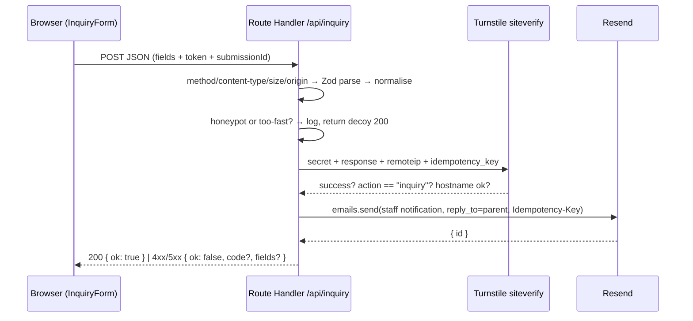

# 07 · Forms & integrations

**Purpose.** This document specifies the one form on the site — the "Request a tour" inquiry in the Visit /
Enroll section (`docs/design/README.md` §8; wireframe "Enrollment / contact" page) — end to end: fields and
validation, client behaviour, the server path that emails the daycare, spam and abuse controls, privacy and
data handling, environment configuration, and the site's other third-party touch points (Yelp, map, analytics,
error monitoring, fonts). It fixes the contract other docs build on: 02 names the strings, 04 builds the
components, 06 wires the routes and anchors, 08 tests it, 09 provisions secrets and firewall rules. Claims
about vendors are labelled `[verified: source, 2026-08-22]` or `[assumed — confirm]`. Since the Phase 1 gate it
also records three facts that change how the form ships: the sending identity and every owner fact are
**content with sample defaults** rather than invented constants or `TODO` sentinels (HD-4 / HD-7, mechanism in
02 D-02.20), the site runs in **three locales** (`en`, `zh-Hans`, `zh-Hant` — HD-10), and Vercel starts on the
**free Hobby plan**, which the one WAF rate-limit rule here fills to its limit (HD-3).

Status: draft · seat writer-forms · 2026-08-22 · revised 2026-08-22 (HD-3, HD-4, HD-7, HD-10, HD-13, ADJ-21,
no-analytics-tag)

## Decisions

- **D-07.1 — Route Handler, not Server Action.** Submissions go to `POST /api/inquiry` (App Router Route
  Handler, Node.js runtime), as ADR-006 in `01-stack-decisions.md` records. Reasons, in order: (1) a fixed,
  non-localised path lets the Vercel WAF rate-limit rule and the logs target the endpoint by path; (2) the
  handler is a pure `Request → Response` function, unit-testable under Vitest with no React rendering; (3) the
  same endpoint serves the home Visit section and the Enrollment page, and later a CRM webhook, without
  coupling to a page. Server Actions would give free progressive enhancement and a built-in Origin check, but
  the enhancement is moot (D-07.5: Turnstile needs JavaScript) and the Origin check is a few lines (D-07.7).
  No dissent from ADR-001.
- **D-07.2 — Field set and constraints** as in Design §1. The homepage design gives five labels and the
  required set (name, email, age) but **no option list for Child's age and no input type for Desired start**;
  this doc chooses both. The lo-fi Enrollment / contact wireframe shows four fields (no Desired start); we use
  **one `InquiryForm` with the homepage's five fields on both placements** — a plan decision (superset), owner
  may trim (OQ-07.10). Child's age is a native `<select>` whose values are 02's contract default — the three
  program ids plus `expecting` and `other`; desired start is a native `<select>` of the next 12 months plus
  `asap` and `flexible` (not `<input type="month">`, which Firefox and desktop Safari render as a plain text
  box [browser behaviour — assumed; 08's cross-browser run confirms]); message is optional, ≤ 1000 characters.
- **D-07.3 — One Zod schema, shared by client and server** (`src/lib/inquiry/schema.ts`). The client imports
  it for inline validation and has no second rule set; the server re-parses the body with the same schema
  before anything else happens (INV-07.2); TypeScript types are inferred from it. Issue messages are **machine
  codes** (`required`, `too_short`, `too_long`, `invalid_email`, `invalid_option`, `out_of_range`), never
  copy; UI and API map codes to locale-JSON strings (INV-07.1).
- **D-07.4 — Client UX.** Validate a field on blur once touched, all fields on submit; inline error text
  under the field bound with `aria-describedby`, `aria-invalid="true"` on the control; on a failed submit,
  focus moves to the first invalid control and a polite live region announces the outcome (no separate
  error-summary list — five fields do not earn one). Pending: the button keeps its accessible name, gets
  `aria-disabled="true"` + `aria-busy="true"`, label swaps to the pending copy, clicks are ignored; it is never
  `disabled` (that drops keyboard focus). Success: the form is **replaced inside the same card** by a success
  panel; focus moves to the panel heading; the panel offers one text link that resets the form for another
  inquiry (content of the success panel is not designed — 04 lays it out). Failure: an inline `role="alert"`
  banner above the submit, typed values preserved, retry allowed. No toasts. No form library at launch; 04
  may adopt `react-hook-form` only if every behaviour here is kept.
- **D-07.5 — Progressive-enhancement stance.** The form server-renders with visible labels and native
  constraints (`required`, `type="email"`, `maxlength`), so it reads and validates without JavaScript. A
  successful submission **requires** JavaScript because Cloudflare Turnstile is a script. Without JS a
  `<noscript>` block replaces the submit button with the direct-contact fallback: copy from `visit.form.noscript`
  + `visit.form.directContact`, whose `{email}` is `contact.email` and whose `{phone}` is `contact.phoneDisplay`
  with a `tel:` href built from `contact.phone` (02's *Forms and email*). Both are **required** fields in the
  site schema shipping as sample defaults (D-07.10), so the fallback always renders a real pair of contacts —
  the earlier "phone only if the owner supplies one" branch is gone. The handler
  still answers a URL-encoded POST defensively with a 303 back to the section so no field value can ever end up
  in a URL.
- **D-07.6 — Email transport: Resend**, one notification to the daycare inbox per submission, `reply_to` = the
  parent's validated address, plain-text plus minimal HTML rendered from locale-JSON templates. Staff
  notification language: the site default locale (English) with a prominent "preferred language" line, one
  template, one inbox language (reason: staff triage one inbox; the parent's locale travels with the request so
  the reply is in their language) — owner confirms in OQ-07.1. With three locales the line is not decorative:
  `email.inquiry.fields.preferredLanguage` prints `LOCALE_META[locale].nativeName`, so it reads *English*,
  *简体中文* or *繁體中文* and never the raw id (02 *Locales*). Auto-acknowledgement to the
  parent is built behind `INQUIRY_AUTOACK` and **off at launch** (backscatter and deliverability risk of
  mailing unverified addresses; the on-page success panel already confirms) — OQ-07.2.
- **D-07.7 — Abuse controls at launch:** hidden honeypot field + time-to-submit floor, Cloudflare Turnstile
  (managed mode, `appearance: "interaction-only"`, `execution: "execute"`), one Vercel WAF rate-limit rule on
  `POST /api/inquiry` keyed by IP (5 requests / 10 minutes → 429), explicit same-origin check, 16 KB body cap.
  Upgrade path (not launch): Upstash Redis token bucket via `@upstash/ratelimit` inside the handler if the WAF
  rule proves too coarse. No in-memory counter anywhere — function instances do not share memory. On the free
  Hobby plan this single rule is the project's **entire** custom-rule budget (D-07.12).
- **D-07.8 — No database at launch.** The inbox is the system of record; the site stores nothing. Logs carry
  no PII (INV-07.5). CRM is a future integration behind the same handler (OQ-07.3).
- **D-07.9 — Other integrations:** Yelp rating and count are static values in the shared config (02), edited
  by hand and shipping as provisional sample defaults (D-07.11); map is a static image plus an external
  "open in Maps" link, no embed; analytics is Vercel Web Analytics + Speed Insights (cookieless, no consent
  banner — A-07.1) and nothing else (D-07.13); error monitoring is Vercel runtime logs at launch; fonts are
  Google Fonts via `next/font/google`, self-hosted at build.
- **D-07.10 — The sending identity is content, and it ships as a sample default (HD-4 · HD-13, 2026-08-22).**
  The from-address, the sending domain and the inquiry inbox are **owner facts in `content/site.json`**, not
  constants invented here and not `"TODO"`: `email.sendingDomain` = `mail.greenpasturesdaycare.com`,
  `email.fromAddress` = `no-reply@mail.greenpasturesdaycare.com`, `contact.email` =
  `hello@greenpasturesdaycare.com`, optional `email.notifyTo` overriding the recipient (02 D-02.20,
  *Provisional values*). The samples are written against the domain HD-13 names, `greenpasturesdaycare.com`,
  so the owner opens `site.json` and sees the address they will actually keep rather than a `.example`
  stand-in. They are still **provisional**, and marked exactly as 02 marks everything else — dotted paths in
  `site.json.provisional`, no value prefix (D-02.20) — because a known domain settles neither the mailbox
  names (`hello@`, `no-reply@mail.`) nor the one thing that makes them send: DKIM/SPF on the sending
  subdomain and its verification in Resend, which is 09's DNS work. `INQUIRY_FROM_EMAIL`
  and `INQUIRY_TO_EMAIL` survive as **environment overrides with content defaults** — unset, they resolve from
  those fields; set, they win, which is the only way Preview can point at a test inbox while the content says
  the real one (§5). The human edits them in one place, `content/site.json`, per 02 D-02.18's map; nobody edits
  an address in `src/`, and the values are not duplicated per locale. All three paths are in `site.json`'s
  `provisional` array, so `pnpm validate:content --release` **fails** while they remain (INV-02.10) — the
  launch requirement is untouched, and OQ-07.6 is answered only for build purposes. Detail and the preview
  consequence: §5.
- **D-07.11 — Yelp figures and the other owner facts are provisional defaults too (HD-7, 2026-08-22).**
  `yelp.rating` 5.0, `yelp.reviewCount` 47 and `yelp.url` (a plausible business URL), plus `contact.phone` /
  `contact.phoneDisplay`, `contact.address.street` / `postalCode` and `contact.mapsUrl`, ship as editable
  sample defaults in `content/site.json` and are registered in `provisional`. Consequences for this doc: the
  trust row, the count-up, the Reviews CTA, the map link and the no-JS direct-contact fallback are all built
  against **required, present** fields — no `if the owner supplied one` branch anywhere (§6, D-07.5) — and
  `--release` blocks launch until every entry is replaced (or the whole `yelp` block deleted with its three
  markers). OQ-07.7 and OQ-07.8 are answered for build purposes, not for launch.
- **D-07.12 — Vercel starts on the free Hobby plan (HD-3, 2026-08-22): two consequences this doc owns, and one
  it flags.**
  (1) **The rate-limit rule fills the Hobby budget.** Hobby allows one WAF custom rule per project [verified:
  Vercel WAF docs, 2026-08-22]; D-07.7's rule is that one rule. Anything a second rule would do — blocking a
  bad ASN, a geo condition, a separate rule for previews — must instead become another condition inside the
  same rule, or wait for Pro. 09 scopes the rule to production with a condition on `environment`, not with a
  second rule. (2) **Hobby's terms are non-commercial and this site is commercial.** Vercel restricts Hobby to
  non-commercial, personal use [verified: Vercel Hobby plan docs, 2026-08-22, via 09 D-09.2]; a licensed
  daycare's marketing site with an inquiry form is commercial use, so **the launch checklist must carry
  "upgrade to Pro or confirm eligibility" as a blocking item before the DNS cutover** (09 §5.1; budget in
  OQ-09.1). Building, previewing and testing on Hobby is fine; pointing the daycare's domain at it is the
  moment the terms bite. Third, smaller, and this doc's to flag rather than fix: Hobby has no custom Web
  Analytics events [verified: Vercel plan limits, 2026-08-22, via 09 D-09.2], so §4's `inquiry_submitted` /
  `inquiry_failed` / `cta_book_tour` calls are no-ops until the upgrade — the code stays, the data starts on Pro.
- **D-07.13 — No third-party analytics tag, ever, without an ADR (human, 2026-08-22).** The site embeds Vercel
  Web Analytics and Speed Insights and **nothing else**: no GA4 / `gtag.js`, no Google Tag Manager container,
  no Plausible or Fathom snippet, no Meta pixel, no Hotjar or session recorder, no marketing tag of any kind —
  neither at launch nor added quietly afterwards. The human's answer at the Phase 1 gate was "no tag is
  necessary" (read as: no third-party analytics tag; flagged back for confirmation in OQ-07.9). This is a
  decision rather than a default because it is the kind of line that erodes one snippet at a time: adding one
  needs a new ADR in 01, a consent story (any cookie-setting tag brings a banner in all three locales) and an
  update to INV-07.8, which 08 enforces by asserting the shipped script list. Closes OQ-07.9.

## Design

### 1. Inquiry form ("Request a tour →")

Placement and geometry come from the design and are not restated here: `docs/design/desktop/README.md` §8
(form card radius 20, inputs 44px / radius 11, two-column grid), `docs/design/mobile/README.md` Layout + §8
(fields full-width stacked, age/start share a 2-col row, full-width submit, inputs 46px, touch targets ≥ 44px),
and the Enrollment / contact page in `docs/design/Wireframes.dc.html` (lo-fi, four fields — we render the
same five-field form there, D-07.2). One component, `InquiryForm` (04), rendered in both places with a
`source` prop. Every visible string — labels, the `Select…` placeholder, required marker, option labels,
validation messages, pending/success/error copy, privacy line, link text, email subject and body — lives in
the locale JSON under 02's `visit.form.*` (form copy), `email.inquiry.*` (staff notification) and
`email.autoReply.*` (parent acknowledgement) namespaces; this doc defines no keys (requirements list in §9).

Design fields (labels as in both prototypes):

| Design label | Field name | Control | Required | Constraint after normalisation | Hints |
| --- | --- | --- | --- | --- | --- |
| Parent name | `parentName` | `<input type="text">` | yes | trim, 2–80 chars, any script (CJK names pass), no control chars | `autocomplete="name"`, `autocapitalize="words"` |
| Email | `email` | `<input type="email">` | yes | trim, lower-case, RFC-shaped (`z.email()`), ≤ 254 chars | `autocomplete="email"`, `inputmode="email"` |
| Child's age | `childAge` | `<select>` | yes | enum `infant` (6–18 mo) · `toddler` (1.5–3 y) · `preschool` (3–4½ y) · `expecting` · `other`; placeholder option disabled | 02's default option ids (D-07.2) |
| Desired start | `desiredStart` | `<select>` | no | `asap` · `flexible` · `YYYY-MM` within [current month −1, +24] | 12 months offered; labels via formatter |
| Anything you'd like us to know? | `message` | `<textarea>` | no | trim, ≤ 1000 chars, control chars stripped (newlines kept) | — |
| Request a tour → | — | `<button type="submit">` | — | — | pending label swaps (JSON) |

Technical fields (not in the design; hidden; listed so nothing is silent):

| Field name | Purpose | Constraint |
| --- | --- | --- |
| `locale` | parent's locale, set from the `[locale]` route segment; drives reply language and templates | `z.enum(routing.locales)` — `en`, `zh-Hans`, `zh-Hant` (02 D-02.1) |
| `source` | which placement submitted | enum `home` · `enroll` |
| `submissionId` | idempotency; generated per form instance, regenerated only after success | UUID v4 |
| `startedAt` | time-to-submit floor (bot signal) | epoch ms; submit ≥ 3 s after mount |
| `website` | honeypot; must be empty | visually hidden off-screen (not `display:none`, so naive bots still fill it), `tabindex="-1"`, `autocomplete="off"`, `aria-hidden="true"` |
| `cf-turnstile-response` | Turnstile token | 1–2048 chars, single use |

Age-band labels (e.g. "Toddler (1.5–3 years)") are 02's keys; 02 may alias them to the programs collection so
the bands are written once. Month option labels are the one string on the form not stored in JSON: they come
from `Intl.DateTimeFormat` through next-intl's formatter (`{ month: "long", year: "numeric" }`, e.g. `en`
"October 2026", `zh-Hans` and `zh-Hant` "2026年10月") — 02's formatter rule covers them, and it is why adding a
locale never touches this list. The month list is computed at render; the server tolerates −1…+24 months so a
statically rendered page a few weeks old still validates.

Schema sketch (illustrative; messages are codes, see D-07.3):

```ts
export const inquirySchema = z.object({
  parentName: z.string().trim().min(2, "too_short").max(80, "too_long"),
  email: z.string().trim().toLowerCase().max(254, "too_long").pipe(z.email("invalid_email")),
  childAge: z.enum(["infant", "toddler", "preschool", "expecting", "other"], { message: "invalid_option" }),
  desiredStart: z.union([z.literal("asap"), z.literal("flexible"), yearMonth]).optional(),
  message: z.string().trim().max(1000, "too_long").optional(),
  locale: z.enum(routing.locales),              // en · zh-Hans · zh-Hant
  source: z.enum(["home", "enroll"]),
  submissionId: z.uuid(), startedAt: z.coerce.number().int(),
  website: z.literal(""),                       // honeypot
  "cf-turnstile-response": z.string().min(1, "required").max(2048),
});
export type Inquiry = z.infer<typeof inquirySchema>;
```

07 requires Zod ≥ 4 (`z.email()`, `z.uuid()` are Zod 4 APIs); 01 is asked to pin it in ADR-006 (§9).

The locale enum is `routing.locales` itself, never a hand-written list. Two things follow, both free: a locale
that 02 INV-02.11 holds back (`zh-Hant` before its review) is rejected by the schema for as long as it is out
of `routing.locales`, and enabling it later changes no code in this doc's scope — the enum, the e-mail
templates, the Turnstile language map and the Playwright matrix all widen from the same list.

Accessibility contract (04 implements, 08 checks): every control has a visible `<label htmlFor>` bound by id
(no placeholder-as-label; the `Select…` placeholder is a disabled first option from JSON); required controls
carry `required`/`aria-required` and a visible marker whose text is a JSON key; error text is a sibling element
referenced by `aria-describedby`, not a tooltip, not colour-only; a polite `aria-live` region announces submit
outcomes; focus moves to the first invalid control on failure and to the success heading (`tabIndex={-1}`) on
success; every control ≥ 44px tall (46px on mobile per design); native `<select>`s; `lang` on the form follows
the page locale so IMEs and screen readers behave; the Turnstile widget area reserves height so a challenge
never shifts the submit. Turnstile itself is presented by Cloudflare as accessible and puzzle-free in managed
mode [Cloudflare claim — assumed; 08 runs axe on the widget states].

Turnstile on the client: the script (`challenges.cloudflare.com/turnstile/v0/api.js`) loads lazily when the
Visit section enters the viewport or the form receives focus — never in the initial document. The widget is
rendered explicitly with the public site key, `action: "inquiry"`, `language` mapped from the site locale
(`en` → `en`, `zh-Hans` → `zh-cn`, `zh-Hant` → `zh-tw` [assumed — confirm `zh-tw` is in Cloudflare's
supported-language list before `zh-Hant` is enabled; A-07.7]), and `execution: "execute"`: the challenge runs
on first interaction with the form, not on page load, so the token lifetime (300 s, single use
[verified: Cloudflare Turnstile docs, 2026-08-22]) is not wasted while a parent reads. On `expired-callback` the
widget re-executes silently; on submit with no token yet, the client waits (bounded) in the pending state.
After any failed server attempt the client re-executes Turnstile before allowing a retry. The language map is
the one place in this doc where a locale id meets a vendor's own code list, so it is a `Record<Locale, string>`
in `src/lib/inquiry/turnstile.ts` — a lookup keyed by locale id, never a `locale === 'zh-Hans'` comparison
(02 INV-02.9 forbids the comparison; a missing entry is a TypeScript error, which is how adding a locale is
caught here).

Client state machine and error mapping (copy keys are 02's, one family per code):

| State / error kind | Trigger | HTTP | Code returned | Form data | Next action |
| --- | --- | --- | --- | --- | --- |
| idle → submitting | valid on client, token present | — | — | locked, `aria-busy` | wait (client `AbortController` 15 s) |
| field validation | schema fails on server | 400 | `fields{name: code}`, no form-level code | kept | fix fields; focus first invalid |
| bot check failed | siteverify false | 400 | `turnstile_failed` | kept | widget re-executes; retry |
| bot check unavailable | Cloudflare unreachable | 503 | `turnstile_unavailable` | kept | retry later; direct-contact fallback shown |
| rate limited | WAF rule | 429 (platform body) | client maps to `rate_limited` | kept | wait; distinct copy |
| forbidden | origin mismatch / 405 / 415 | 403 / 405 / 415 | `forbidden` | kept | generic banner |
| too large | body > 16 KB | 413 | `payload_too_large` | kept | shorten message |
| provider failure | Resend error / timeout | 502 | `email_failed` | kept | retry; direct-contact fallback shown |
| network failure | fetch throws / aborts | — | client `network` | kept | retry |
| success | email accepted | 200 | `{ ok: true }` (no provider id — identical to the decoy) | cleared; panel replaces form | "send another" link resets |

### 2. Server path — `POST /api/inquiry`

Runtime: Node.js (the Resend SDK and `crypto` are plain Node; nothing here needs the Edge runtime, and a
store-backed limiter later would also be Node). Accepted content types: `application/json` (the form's fetch)
and `application/x-www-form-urlencoded` (no-JS / curl). The path is excluded from the next-intl proxy matcher
(`proxy.ts`, 06) so it is never locale-redirected.



Steps, in order; every early exit returns a machine `code` (table above), except the validation 400, which
returns per-field codes only:

1. **Guards.** `POST` only (405). Content type allow-list (415). `Content-Length` and the actual read capped at
   16 KB (413) — far under Vercel's 4.5 MB function body limit [verified: Vercel Functions limits, 2026-08-22]
   and ample for a 1000-char CJK message. Same-origin: the host of `Origin` (or of `Referer` when `Origin` is
   absent) must equal the host the request arrived on (`x-forwarded-host`, falling back to `Host`) **or** one
   of the allow-listed hosts derived from `NEXT_PUBLIC_SITE_URL`, `VERCEL_PROJECT_PRODUCTION_URL`,
   `VERCEL_URL`, `VERCEL_BRANCH_URL`, and `localhost` in dev → otherwise 403. This keeps Git-branch aliases
   and custom preview domains working. `Sec-Fetch-Site`, when present, must be `same-origin`. Route Handlers
   have no built-in CSRF check, hence the explicit one.
2. **Parse and normalise** with `inquirySchema` (400 with per-field codes in `fields` and no form-level code —
   `invalid` is field-scoped in 02). Normalisation: trim, NFC-normalise, collapse whitespace runs in the name,
   strip C0/C1 control characters (CR/LF included) from name and email, lower-case the email. `reply_to` is
   set only from the email that passed validation.
3. **Decoy path.** Honeypot non-empty, or `now − startedAt < 3000` ms: log `inquiry.spam` (no PII), respond
   `200 { ok: true }` exactly like success, send nothing. Bots learn nothing from the response.
4. **Rate limit.** The WAF rule (§3) acts before the function runs and returns 429; the client maps any 429
   to `rate_limited`. The handler keeps one seam where a store-backed limiter (Upstash) plugs in later.
5. **Turnstile siteverify.** `POST https://challenges.cloudflare.com/turnstile/v0/siteverify` with `secret`,
   `response`, `remoteip` (Vercel's `x-real-ip`), and a fresh UUID `idempotency_key`
   [verified: Cloudflare docs, 2026-08-22]; 5 s timeout. Accept only if `success === true`,
   `action === "inquiry"`, and `hostname` is one of our hosts → otherwise 400 `turnstile_failed`. Network
   failure or non-2xx from Cloudflare → **fail closed**, 503 `turnstile_unavailable`, error-level log; spam
   protection must not silently switch off during an outage.
6. **Render emails** from locale JSON on the server (next-intl `getTranslations({ locale, namespace })` works
   in Route Handlers). Staff notification: default-locale template (D-07.6) with every field and the
   preferred-language line. **No user-entered text enters any header**: the subject is built from template +
   age band + source only; `reply_to` is the validated email; user text appears only in the text and HTML
   bodies, HTML-escaped in the HTML part. Plain text is primary; the HTML part is a minimal inline-styled
   wrapper of the same content.
7. **Send via Resend** (`resend.emails.send`): `from` = the resolved sending identity (§5 — `INQUIRY_FROM_EMAIL`
   if set, otherwise `site.email.fromAddress`; display name = `brand.name[<locale the message is rendered in>]`,
   so `en` for the staff notification and the submitter's locale for the auto-ack, never a second copy of the
   name in env or code), `to` = the resolved recipient list (`INQUIRY_TO_EMAIL`, else `site.email.notifyTo`,
   else `site.contact.email`), `reply_to` = parent, `text` + `html`, `tags` = `{ source, locale }`, `idempotencyKey` =
   `sha256(submissionId + canonical payload)` truncated to 64 chars. Resend keeps keys 24 h, caps them at 256
   chars, and rejects a reused key with a different payload [verified: Resend docs, 2026-08-22], so an identical
   retry is de-duplicated and an edited re-submission gets a new key. Resend 4xx/5xx or 8 s timeout → 502
   `email_failed`. Resend's default ceiling is 10 requests/s per team [verified: Resend docs, 2026-08-22] — not a
   constraint at this volume. **While the sending domain is still the sample default, this step fails and is
   meant to:** Resend refuses to send from a domain that is not verified in the account, and
   `mail.greenpasturesdaycare.com` is unverified until the owner publishes its DKIM/SPF records and Resend
   confirms them (09). Since HD-13 the sample names the real domain, so what stops a stray send is
   **verification state, not a reserved TLD** — the same guard, arrived at by DNS rather than by RFC 2606: a
   provisional sending identity produces a loud 502 and a log line, never a quiet delivery from a wrong
   address. The recipient side is not protected by that guard — `hello@greenpasturesdaycare.com` becomes a
   real mailbox the day the owner creates it — which is why Preview overrides `INQUIRY_TO_EMAIL` instead of
   trusting the sample (§5). §5 says what dev and preview do until the domain is verified.
8. **Auto-acknowledgement** (only if `INQUIRY_AUTOACK=1`): after step 7 succeeds, rendered in the parent's
   locale, fixed template text only — typed fields are **not** echoed (prevents using the ack as a spam relay);
   it is therefore gated behind validation + Turnstile by construction; failure is logged, not surfaced.
9. **Respond.** JSON `200 { ok: true }` or `{ ok: false, code, fields? }` with the status from the table. The
   success body carries no provider id, so it is byte-identical to the decoy response in step 3; the Resend id
   goes to the log only. URL-encoded body → `303` to `/{locale}#visit` regardless of outcome (D-07.5) — the
   `homeHref` form, **no slash before the `#`**, so the fallback does not spend a `trailingSlash` 308 hop
   before it lands (06 D-06.6, which cites this redirect as its reason; ADJ-21).

Double-submit guard, layered: the client ignores clicks while pending and regenerates `submissionId` only
after success; Turnstile tokens are single-use, so a replayed request fails at step 5; Resend's idempotency
key collapses an identical retry that got past both (e.g. a retry after a dropped response).

Logging: one structured line per request (`console.info` JSON) with `event`, `requestId`, `outcome`/`code`,
`locale`, `source`, `childAge`, `desiredStart`, `durationMs`, `resendId`, `turnstileErrorCodes`. Never name,
email, message, IP, or the Turnstile token (INV-07.5). Runtime-log retention is plan-dependent on Vercel — 09
decides on a log drain; Resend's dashboard retains sent-message content [assumed — confirm setting; OQ-07.4].

### 3. Spam and abuse

| Layer | Launch choice | Notes / upgrade path |
| --- | --- | --- |
| Honeypot + timing | `website` must be empty; submit ≥ 3 s after mount | Decoy 200; logged `inquiry.spam` |
| Turnstile | Managed widget, `interaction-only`, explicit execute; server siteverify with `action` + `hostname` checks | Free [verified: Cloudflare, 2026-08-22]; tokens 300 s, single use; test keys in dev/preview (§5) |
| Rate limit | Vercel WAF rule: path `/api/inquiry`, method POST, key IP, fixed window 10 min, limit 5, action 429 | Available on all plans — Hobby 1 rule/project, Pro 40, windows 10 s–10 min [verified: Vercel WAF docs, 2026-08-22]; counters are per region, so the number is approximate. Production only (§5). **We start on Hobby, so this is the project's one and only custom rule** (D-07.12). Upgrade: `@upstash/ratelimit` on Vercel Marketplace Upstash Redis, inside the handler |
| Size / shape | 16 KB body cap, content-type allow-list, Zod length limits | — |
| CSRF | Origin/Referer host check, `Sec-Fetch-Site` | Route Handlers have no built-in check |
| Sender abuse | Auto-ack off by default; when on, no user text in the ack | OQ-07.2 |

The WAF rule is dashboard/CLI configuration, not code — 09 provisions it in production and records the
values; the handler behaves correctly with or without it (§8 covers the 429 mapping). On the Hobby plan the
one-rule limit is a design constraint, not a footnote (D-07.12): restricting the rule to production is an
`environment` **condition inside this rule**, never a second rule, and any future firewall need — an ASN block
during a spam wave, a geo condition, a separate limit for a second endpoint — is either folded into the same
rule or waits for Pro. Vercel's managed DDoS mitigation and Attack Challenge Mode are not custom rules and so
should remain available as the emergency lever on Hobby [assumed — 09 confirms on the plan comparison at
project setup].

### 4. Privacy and data handling

- **Data collected:** parent name, email, child's age band, desired start month, free-text message, locale,
  source, coarse timing. IP is seen by the WAF and by Turnstile (`remoteip`) for bot checks and is never
  stored or logged by us. No child's name is asked. The site keeps no copy; the daycare inbox is the record,
  under the daycare's own retention (OQ-07.4 covers Resend's copy).
- **Third parties that see data:** Resend (email content, in transit and in its dashboard [assumed —
  confirm retention]); Cloudflare (Turnstile: IP and browser signals, not form fields); Vercel (runtime logs
  without PII; analytics without PII). Vercel Web Analytics uses no cookies, identifies visitors by a request
  hash discarded after 24 h, and stores aggregate page/referrer/device/geo data; Speed Insights stores route,
  vitals, device and country [verified: Vercel privacy pages, 2026-08-22].
- **Notices:** a one-line privacy statement under the submit button (JSON key, 02) and a mention of
  Turnstile — Cloudflare asks sites to reference its Turnstile privacy terms [verified: Cloudflare widget
  docs, 2026-08-22]. A privacy page is not in the design; CalOPPA appears to require a privacy policy on a
  commercial site collecting PII from California residents [assumed — counsel to confirm; OQ-07.5]. If
  required, 06 decides the route and 02 the strings; this doc only needs a link target for the notice.
- **Children's data:** information is collected from parents about a child's age band only; nothing is
  collected from children. Whether COPPA has any bearing is a question for counsel, not a claim here.
- **Analytics events** (`@vercel/analytics` `track`): `inquiry_submitted { locale, source, childAge }`,
  `inquiry_failed { code }`, `cta_book_tour { placement }`, `yelp_click`, `locale_toggle { to }`. No email,
  no free text, no names — ever (INV-07.5). `locale` and `to` carry a locale id (`en` · `zh-Hans` · `zh-Hant`),
  which is not personal data. Custom events need a paid plan, so on Hobby these calls are no-ops and only the
  automatic page views arrive (D-07.12) — the instrumentation ships anyway, so the first day on Pro has data.
- **No other tag is embedded** (D-07.13). Nothing on this page is consent-relevant, and that is a property to
  keep, not a coincidence: the moment a GA4 or Tag Manager snippet lands, the site needs a cookie banner in all
  three locales, a strings namespace to hold it, and a privacy-policy paragraph that says so.

### 5. Environment and configuration

| Variable | Scope | Required in | Set where | Purpose |
| --- | --- | --- | --- | --- |
| `RESEND_API_KEY` | server secret | preview, prod | Vercel env (scoped) | Resend key with **sending-only** permission, restricted to the sending domain |
| `INQUIRY_FROM_EMAIL` | server | **optional** | Vercel env | Override for the sender address. Unset → `content/site.json` → `email.fromAddress` (sample `no-reply@mail.greenpasturesdaycare.com`). Display name is never set here — it is `brand.name[locale]` (D-07.10) |
| `INQUIRY_TO_EMAIL` | server | **preview** (required), prod optional | Vercel env | Override for the recipient(s), comma-separated. Unset → `email.notifyTo`, else `contact.email` (sample `hello@greenpasturesdaycare.com`). **Preview scope = test inbox, never the real inbox** — the content default is the real one, so Preview must override it |
| `INQUIRY_AUTOACK` | server | optional | Vercel env | `0` (default) / `1` |
| `INQUIRY_TRANSPORT` | server | dev | `.env.example` ships `INQUIRY_TRANSPORT=log` | `resend` (default when unset — preview, prod) / `log` (local) |
| `NEXT_PUBLIC_TURNSTILE_SITE_KEY` | public | all | Vercel env / `.env.local` | Widget site key — the only `NEXT_PUBLIC_` value this doc adds |
| `TURNSTILE_SECRET_KEY` | server secret | all | Vercel env / `.env.local` | siteverify secret |
| `NEXT_PUBLIC_SITE_URL` | public | prod | owned by 06/09 | Canonical origin; consumed by the origin check |

**Sending identity: content first, environment as override (D-07.10).** The two address variables used to be
the only home of a fact the owner cares about, which meant the owner could not change it and a `TODO` in a
Vercel dashboard was invisible to every gate. They now resolve in a fixed order, evaluated once per request:

| What the handler needs | Resolution order | Sample default shipped in `content/site.json` | Marked provisional |
| --- | --- | --- | --- |
| `from` address | `INQUIRY_FROM_EMAIL` → `email.fromAddress` | `no-reply@mail.greenpasturesdaycare.com` | yes — `email.fromAddress` |
| `from` display name | `brand.name[<render locale>]` — no env, no literal | English / 优朵幼儿园 / 優朵幼兒園 | via `brand.name.*` entries |
| sending domain (Resend verification, DNS) | `email.sendingDomain` — no env form | `mail.greenpasturesdaycare.com` | yes — `email.sendingDomain` |
| `to` recipient(s) | `INQUIRY_TO_EMAIL` → `email.notifyTo` → `contact.email` | `hello@greenpasturesdaycare.com` | yes — `contact.email` |

Where the human edits them: `content/site.json`, once, for all three locales (02 D-02.18 *Where the owner
edits*). Not in `src/`, not in the Vercel dashboard — the dashboard variables exist for the per-environment
override only, and 09's editor guide should not send the owner there. A non-ASCII display name (优朵幼儿园) goes
out as an RFC 2047 encoded word [assumed — the Resend SDK encodes it; confirm on the first real send, A-07.6].

Launch requirement, unchanged by any of this: `email.sendingDomain`, `email.fromAddress` and `contact.email`
sit in `site.json`'s `provisional` array, so `pnpm validate:content --release` fails while they are samples
(02 INV-02.10), and Resend cannot send from an unverified domain in any case — the sample sending subdomain
has no DKIM/SPF records until 09 publishes them (§2 step 7). Reading against the real domain (HD-13) makes the
sample recognisable, not real: it buys honest previews and a value the owner edits instead of invents, and
**no** relaxation of the gate. OQ-07.6 is answered for build purposes only.

`brand.url` (02, the same provisional sample origin — `https://greenpasturesdaycare.com` under HD-13) and
`NEXT_PUBLIC_SITE_URL` are the same fact in two places; the origin check reads the env value. Which one is
canonical is OQ-09.10 in 09's register (answered by 02 on 06's requirement), and it now interacts with
`brand.url` being a provisional sample — whichever wins, the other must not survive as a second editable copy
of the origin.

Files: `.env.example` committed with every name — values empty except the two safe local defaults
(`INQUIRY_TRANSPORT=log` and the Turnstile test site key); `.env.local` gitignored. Secrets live only in
Vercel environment variables (Production / Preview / Development scopes) and never in git; rotation, account
ownership (Resend, Cloudflare), sending-domain DNS (SPF, DKIM, DMARC) and Turnstile widget hostnames are 09's
mechanics. No secret is read in client code (INV-07.3); 08 verifies that the client bundle contains no secret
names.

Behaviour by environment:

- **Local dev:** `INQUIRY_TRANSPORT=log` prints the rendered subject, text and HTML to the terminal instead of
  calling Resend, so templates can be reviewed in all three locales without a key — and so the provisional
  sending identity is harmless locally by default. Turnstile uses Cloudflare's published test pair — site key
  `1x00000000000000000000AA` (always passes) with secret `1x0000000000000000000000000000000AA` (always passes
  validation); the `2x…` pair exercises the failure path [verified: Cloudflare testing docs, 2026-08-22]. No
  rate limit locally.
- **Preview deployments:** real transport, but Preview-scoped `INQUIRY_TO_EMAIL` is a test inbox — or
  Resend's `delivered@resend.dev` sink [assumed — confirm it accepts production keys]. Turnstile uses the
  test keys on previews — our decision, to keep the production widget's hostname list limited to the
  production domains rather than adding `*.vercel.app` [Turnstile hostname lists are editable — assumed];
  consequence: the real Turnstile path is first exercised in production, so 09's launch checklist includes one
  manual real-key submission. WAF rule scope (production-only vs all deployments) and preview exposure
  (Deployment Protection on or off) are 09's to confirm [assumed here: rule on production; previews
  protected].
- **Preview, while the sending domain is still a sample (the state the repository ships in).** Real transport
  cannot work: Resend rejects an unverified `from` domain, so every preview submission would return 502
  `email_failed` and the form's happy path would be untestable on a preview. Three ways out, and 09 picks one
  (OQ-07.11): (a) set `INQUIRY_TRANSPORT=log` in the Preview scope too and read the rendered mail in the
  function logs; (b) set Preview's `INQUIRY_FROM_EMAIL` to Resend's shared `onboarding@resend.dev` sender,
  which delivers only to the account owner's own address [assumed — confirm in the dashboard, A-07.6] — and
  keep Preview's `INQUIRY_TO_EMAIL` set, because the content default now names a mailbox on the daycare's own
  domain rather than an unreachable `.example` one (HD-13); (c) verify the real sending domain early, before
  the site launches, which also retires two provisional entries.
  Default until 09 answers: (a) — it needs no account state and cannot mail a stranger.
- **Production:** real keys; Turnstile hostnames = production domains; WAF rule live; real inbox — and by then
  the sending identity is real, because `--release` will not pass otherwise (02 INV-02.10).

### 6. Other integrations

- **Yelp rating and count** (`docs/design/README.md` §1 trust row; §6 "5.0", "47 reviews", Yelp badge, "Read
  all reviews on Yelp →" new tab; Reviews subpage "Open our Yelp page ↗"): static values in the shared
  locale-agnostic config that 02 defines (`yelp.rating`, `yelp.reviewCount`, `yelp.url`), edited by hand.
  They ship as **sample defaults** — the design's `5.0` and `47` plus a plausible business URL — registered in
  `site.json`'s `provisional` array, so the trust row and the Reviews CTA render honestly from day one and
  `--release` fails until the owner replaces all three or deletes the whole `yelp` block with its markers
  (D-07.11; 02 *Provisional values*). The rating is a number, which is precisely why 02 chose a path registry
  over a `PROVISIONAL:` string prefix. Link text is
  a JSON key; links use `target="_blank" rel="noopener noreferrer"`; the count-up (05) reads the same config.
  Not at launch: Yelp Fusion (`GET /v3/businesses/{id}` exposes `rating` and `review_count`) as a build-time /
  ISR fetch with a server-only key and the static values as fallback — it needs a developer account, has plan
  limits, and its display terms constrain caching and attribution [assumed — confirm before any wiring].
- **"Book a tour" CTA** (sticky-nav pill, hero CTA, mobile hamburger): an in-page link to the Visit section
  anchor (`#visit`; id and scroll behaviour owned by 06 — Next 16 dropped default smooth scroll, 06 sets
  `data-scroll-behavior`), from subpages `/{locale}#visit` — no slash before the `#` (06 D-06.6, ADJ-21), the
  same form the 303 fallback uses. No auto-focus of the first input on arrival (a mobile keyboard popping up
  uninvited is worse than one tap); the browser's focus start point moves to the section.
  `track("cta_book_tour", { placement })` on click.
- **Map / building photo** (design slot "Drop map / building photo", 150px desktop / 120px mobile — a photo
  drop slot, not an embed): a static image through `next/image` plus an "open in Maps" link from the shared
  config (`contact.mapsUrl` as 02 names it) opening in a new tab. No Google Maps / Mapbox embed: it would load
  third-party scripts and cookies for every visitor and be the only consent-relevant asset on the page, and
  it departs from the design's photo. The street address and the Maps URL are content (`contact.address.*`,
  `contact.mapsUrl`) and are **required fields with sample defaults** (D-07.11), not optional extras the
  components have to branch on; the design shows only "Fremont, California", so what the page prints where is
  04's composition. Open at launch is only whether the owner publishes the real street (OQ-07.8).
- **Analytics:** `@vercel/analytics/next` and `@vercel/speed-insights/next` in the root layout; cookieless,
  first-party intake, so no consent banner [A-07.1 — assumed for a California site; counsel to confirm].
  Events as in §4; nothing PII is ever passed to `track`; `beforeSend` is unnecessary because no route carries
  personal data in the URL. Runs on previews too (Vercel separates environments). **These two are the whole of
  the analytics stack (D-07.13):** no GA4, no Tag Manager, no Plausible, no pixel — the human's answer at the
  Phase 1 gate. If the owner ever wants richer reporting, the candidates are still Plausible (cookieless, paid)
  or GA4 (cookies → a consent UI plus copy in all three locales, and a privacy-policy paragraph), and either
  one needs a new ADR in 01 and an amendment to INV-07.8 before a single script tag is added. Custom-event
  support and event quotas differ by Vercel plan — nothing custom on Hobby (D-07.12); details are 09's.
- **Error monitoring:** server side, the structured handler log + Vercel runtime logs; client side, nothing
  captured at launch (no error SDK, no script). If client capture is later wanted: Sentry (`@sentry/nextjs`)
  with `beforeSend` scrubbing and form payloads never attached, a DSN env var, enabled on previews — a later
  decision, not launch.
- **Fonts:** Fredoka and Nunito via `next/font/google`: "CSS and font files are downloaded at build time and
  self-hosted with the rest of your static assets. No requests are sent to Google by the browser."
  [verified: Next.js font docs, 2026-08-22]. Fonts therefore add no third-party request and no notice item.
  Neither family has CJK glyphs; the CJK fallback stack is 03's `--font-cjk`, selected by `:lang(zh)`, which
  matches `zh-Hans` and `zh-Hant` alike (ADJ-6; 02 D-02.15). The design names no CJK typeface (HD-11), so the
  system stack stands and no webfont request is added for the Chinese locales.
- **Third-party runtime scripts, complete list:** Turnstile (lazy, form only) and Vercel Analytics / Speed
  Insights. Nothing else, now or later without an ADR (INV-07.8, D-07.13).

### 7. Invariants

- **INV-07.1** No user-visible string exists in form, handler, or email code. Code carries keys and machine
  codes only; copy resolves through the locale JSON per 02. The ESLint literal-text rule (01/08) covers the
  components; email templates are JSON with placeholders, never template literals.
- **INV-07.2** The server re-validates every request with the shared schema; client validation is UX only and
  may be bypassed without weakening anything.
- **INV-07.3** Secrets (`RESEND_API_KEY`, `TURNSTILE_SECRET_KEY`) are never in the client bundle, logs,
  analytics, or git. The only public value is the Turnstile site key. No address is a literal in code: the
  inbox and the sender resolve from `content/site.json` with an optional environment override (D-07.10).
- **INV-07.4** The form works end to end in **every locale in `routing.locales`** — labels, options, errors,
  success panel, staff notification and auto-reply — and adding or enabling a locale touches JSON and that list
  only, never form, handler or e-mail code. Today the list is `en`, `zh-Hans` and `zh-Hant`.
- **INV-07.5** PII (name, email, message, IP, token) never enters logs or analytics.
- **INV-07.6** Every accepted submission passed honeypot, timing, and a single-use Turnstile token verified
  server-side against Cloudflare; there is no production bypass flag.
- **INV-07.7** The handler is idempotent per submission: replay fails at Turnstile; identical retries are
  collapsed by Resend's idempotency key.
- **INV-07.8** The only third-party runtime scripts on the site are Turnstile and Vercel Analytics / Speed
  Insights. No analytics, tag-manager, pixel or session-recording script is added without a new ADR in 01 and
  an amendment to this invariant (D-07.13); 08 asserts the shipped script list, so a stray snippet fails CI.
- **INV-07.9** No address, phone number, licence number or Yelp figure is a literal in code or an invention of
  this doc: each is a value in `content/site.json`, and each one that is not yet real is a path in that file's
  `provisional` array, which `pnpm validate:content --release` refuses to launch with (02 INV-02.10). 07
  supplies the sample defaults to 02 and keeps no second copy of any of them.

### 8. Testing requirements (what; 08 owns how)

- **Schema:** each field's valid/invalid boundaries; normalisation (trim, NFC, case, control chars); CJK
  names; month window edges; honeypot literal; `locale` and `source` enums.
- **Handler** (`Request` in → `Response` out, no real provider calls): happy path proves the resolved `to` and
  `from` (env override wins; unset falls back to `email.notifyTo` → `contact.email` and to `email.fromAddress`,
  with the display name from `brand.name[locale]`),
  `reply_to` = parent, idempotency key, tags, both bodies, subject contains no user text; the validation 400
  carries per-field codes and no form-level code; decoy 200 on honeypot and on too-fast with no send and a
  body identical to success; `turnstile_failed`; `turnstile_unavailable` fails closed; provider failure → 502;
  415 / 413 / 405 / 403 guards (incl. branch-alias origin accepted); URL-encoded → 303; log lines contain no
  PII; `INQUIRY_AUTOACK` on/off; CR/LF in name cannot reach headers.
- **Email templates:** render the staff notification and the auto-reply in **every locale in
  `routing.locales`** (`en`, `zh-Hans`, `zh-Hant`) — the suite iterates the list, it does not name locales — and
  assert the preferred-language line prints the endonym, not the id; no unresolved placeholders; HTML escaping
  of `<`, `&`, quotes; plain-text part present; a non-ASCII `from` display name survives the round trip.
- **E2E per locale (Playwright, one run per id in `routing.locales` — `en`, `zh-Hans`, `zh-Hant`):** fill →
  submit → success panel with focus on its heading; blank required fields → inline errors, focus on first
  invalid; error banner on a forced 502; 429 mapping; honeypot path shows success and no email is sent; mobile
  viewport 390px: full-width submit, controls ≥ 44px; keyboard-only completion; axe on idle, error and success
  states; no-JS: native validation and the `<noscript>` fallback showing both the e-mail and the phone. The
  Chinese runs are the ones that catch a CJK-width overflow in the two-column age/start row, so `zh-Hant` is a
  row in the matrix from the day it enters `routing.locales`, not an afterthought.
- **Static checks:** key parity for the `visit.form.*`, `email.inquiry.*` and `email.autoReply.*` namespaces
  (02's script); client bundle contains no secret names; `.env.example` lists every variable in §5; ESLint
  literal-text rule passes on the form components; the shipped HTML loads no script host beyond Turnstile and
  Vercel's own (INV-07.8); no e-mail address, phone number or Yelp figure appears as a literal in `src/`
  (INV-07.9).

### 9. Requirements this doc places on other docs

- **01** — pin Zod ≥ 4 (`z.email()`, `z.uuid()`); ADR-006 = Route Handler + Zod + Resend + honeypot +
  Turnstile, Node runtime.
- **02** — host under its `visit.form.*`: labels, `Select…` placeholder, required marker, age option labels
  for the five ids (`infant`, `toddler`, `preschool`, `expecting`, `other`), `asap`/`flexible` labels, pending
  label, success panel heading/body/reset link, error banner copy, privacy line, `<noscript>` fallback text,
  "open in Maps" and Yelp link text; **02 must define a message for each of the fourteen codes this doc
  emits**, at the scope its *Forms and email* table gives them — field-scoped: `required`, `too_short`,
  `too_long`, `invalid`, `invalid_email`, `invalid_option`, `out_of_range`; form-scoped: `turnstile_failed`,
  `turnstile_unavailable`, `rate_limited`, `forbidden`, `payload_too_large`, `email_failed`, `network`.
  That table is authoritative for the key each code resolves to: wire codes are 07's snake_case spellings, key
  segments are their camelCase forms (D-02.4, machine-checked by INV-02.2); field-scoped codes try
  `visit.form.fields.<field>.errors.<code>` first and fall back to `visit.form.errors.<code>`, form-scoped
  codes render as banners from `visit.form.errors.<code>`, and `invalid_email` resolves to
  `visit.form.fields.email.errors.invalid` (there is no form-level key for it). 07 keeps the wire names; 02
  adds the entries. Under 02's
  `email.inquiry.*` (staff notification): subject, heading, intro, per-field lines, the preferred-language
  line, footer; under `email.autoReply.*`: the fixed acknowledgement text — and the preferred-language line
  must render `LOCALE_META[locale].nativeName`, so it names one of three endonyms. Shared config (all present
  in 02 as of 2026-08-22, nothing new requested): `yelp.rating|reviewCount|url`, `contact.email`,
  `contact.phone` + `contact.phoneDisplay` (both required now, which is what lets D-07.5 drop its branch),
  `contact.mapsUrl`, `email.sendingDomain`, `email.fromAddress`, optional `email.notifyTo`, and the
  `provisional` registry that covers them. One value change follows HD-13: the three e-mail samples (and
  `brand.url`) read against `greenpasturesdaycare.com`, not `.example`, so 02's *Provisional values* table and
  its `site.json` excerpt need the same edit — 07 keeps no second copy (INV-07.9), and the owner must not meet
  two different sample inboxes. 02 also owns the consequence for its own rationale: the reserved-TLD argument
  for `.example` no longer applies, and what keeps a provisional identity from sending is Resend verification
  (§2 step 7). `visit.form.directContact` keeps its `{email}` and `{phone}`
  arguments; the formatter rule that blesses `Intl` month/date output; and — per ADJ-4 — the `visit.form.*`
  namespace must reach the client through `NextIntlClientProvider` because `InquiryForm` is a client component.
- **03** — the CJK fallback stack (`--font-cjk` under `:lang(zh)`) must name Traditional faces beside the
  Simplified ones, or `zh-Hant` renders Simplified glyph forms (ADJ-6; 02 D-02.15); input/button tokens.
- **04** — `InquiryForm`, `Turnstile` wrapper (lazy script, explicit render), success panel and banner,
  Visit section and Enrollment page composition.
- **06** — `#visit` anchor and scroll behaviour; `/api/inquiry` excluded from the `proxy.ts` matcher and the
  sitemap; `robots` `Disallow: /api/`; a privacy route if OQ-07.5 says yes.
- **08** — §8 as gates; axe; bundle secret grep; the e2e and email-template matrices iterate `routing.locales`
  (three rows, `zh-Hant` included the day it is enabled), and the script-host assertion that keeps INV-07.8
  honest.
- **09** — env scopes per §5, including which of the three preview options in §5 is taken while the sending
  domain is provisional (OQ-07.11); Resend domain verification and DNS; Turnstile widget hostnames; WAF rule
  values **and the fact that on Hobby it is the project's only custom rule, scoped by a condition rather than a
  second rule** (D-07.12); log drain/retention; analytics quotas; secret rotation. Two launch-checklist items
  this doc requires: **"upgrade to Pro or confirm Hobby eligibility" as a blocking item before the DNS
  cutover** (Hobby is non-commercial; this site is commercial — HD-3), and `pnpm validate:content --release`
  green, which is what proves the sending identity, the inbox and the Yelp figures are no longer samples.

## Open questions

- **OQ-07.1** (owner) Staff notification language: English with a "preferred language" line (D-07.6), or
  rendered in the parent's locale?
- **OQ-07.2** (owner) Enable the parent auto-acknowledgement at launch? Default off (D-07.6).
- **OQ-07.3** (owner) Which CRM, if any, should receive inquiries later (HubSpot, a Google Sheet, a
  daycare-specific tool)? Decides whether the upgrade is a webhook, an API call, or an email rule.
- **OQ-07.4** (09 + owner) Resend message-content retention setting and account ownership; inbox retention
  policy for inquiry emails.
- **OQ-07.5** (owner with counsel; then 06 + 02) Is a privacy-policy page required (A-07.3)? If yes: route,
  strings, footer link.
- **OQ-07.6** (owner / 09) · **ANSWERED FOR BUILD PURPOSES 2026-08-22 (human, HD-4); the domain half ANSWERED
  2026-08-22 (human, HD-13 — `greenpasturesdaycare.com`); still a launch blocker.**
  Sending domain and mailbox. Build answer: they are content with sample defaults — `email.sendingDomain`
  `mail.greenpasturesdaycare.com`, `email.fromAddress` `no-reply@mail.greenpasturesdaycare.com`, `contact.email`
  `hello@greenpasturesdaycare.com` — now written against the domain HD-13 names, edited by the owner in
  `content/site.json`, with `INQUIRY_FROM_EMAIL` / `INQUIRY_TO_EMAIL` reduced to per-environment overrides
  (D-07.10, §5). **Still open and still blocking:** whether `mail.` is the sending subdomain the owner wants,
  which mailbox the daycare actually reads, and the Resend verification itself. A recognisable sample is not a
  working one — Resend cannot send from a domain that is not verified in the account, so the form delivers no
  real e-mail until that DNS exists; the three `provisional` entries make `pnpm validate:content --release`
  say so (02 INV-02.10) and 09's launch checklist item 6 does the DNS work. Follow-up: OQ-07.11.
- **OQ-07.7** (owner) · **ANSWERED FOR BUILD PURPOSES 2026-08-22 (human, HD-7); still a launch blocker.** Yelp
  figures and URL. Build answer: `5.0` / `47` / a plausible business URL ship as provisional sample defaults in
  `content/site.json` and stay **hand-edited** — Yelp Fusion is not wired (D-07.9, D-07.11). **Still open:** the
  real rating, count and page URL, or the decision to delete the `yelp` block entirely; `--release` fails while
  the three markers remain. Wiring Fusion later would be a new decision (developer account, display terms).
- **OQ-07.8** (owner) · **ANSWERED FOR BUILD PURPOSES 2026-08-22 (human, HD-7); still a launch blocker.**
  Publish the street address and a Maps link? Build answer: yes — `contact.address.*` and `contact.mapsUrl` are
  required fields with sample defaults (`1234 Sample Way`, `94538`, a Maps query URL), so components never
  branch on their absence and the design's "Fremont, California" stays what the page prints where the design
  says so. **Still open:** the real street and Maps link, and whether the owner wants the street published at
  all. If the answer is "do not publish a street", that is a 02 schema change (make `contact.address.street`
  optional) plus a 04 composition change — not a 07 change; 07 only needs the Maps URL for the link.
- **OQ-07.9** (owner) · **ANSWERED 2026-08-22 (human).** Analytics provider: Vercel Web Analytics + Speed
  Insights only, cookieless, **no third-party tag** — no GA4, no Tag Manager, no Plausible, no pixel (D-07.13,
  INV-07.8). The human's words were "no tag is necessary"; the orchestrator's reading is *no third-party
  analytics tag*, flagged back for confirmation — if they meant a git release tag instead, the answer here is
  unchanged, because no third-party tag was proposed either way. Revisiting means a new ADR in 01, a consent
  banner in all three locales, and an amendment to INV-07.8.
- **OQ-07.10** (owner) The shipped option sets are decided (D-07.2, schema, §9): Child's age = 02's canonical
  five ids (`infant`, `toddler`, `preschool`, `expecting`, `other`); Desired start = next 12 months + `asap` +
  `flexible`; five-field superset on the Enrollment page. Open only: the owner may **trim or relabel** the
  shipped canonical set — trimming is JSON + enum only, nothing else in the plan moves.
- **OQ-07.11** (09; owner only if option (c)) Preview sending while the sending domain is still a provisional
  sample: (a) `INQUIRY_TRANSPORT=log` in the Preview scope, (b) Preview `INQUIRY_FROM_EMAIL` =
  `onboarding@resend.dev` (delivers only to the Resend account owner, A-07.6), or (c) verify the real sending
  domain early? Raised by HD-4: real transport on a preview cannot succeed from an unverified sending domain,
  which `mail.greenpasturesdaycare.com` remains until 09 publishes its DKIM/SPF records (§5). Option (b) also
  needs Preview's `INQUIRY_TO_EMAIL` kept, since the content default is now a mailbox on the real domain
  (HD-13). Default until answered: (a).

Assumptions carried — `A-07.n` is a **local id family of this doc** (not one of the memo's D/INV/OQ families);
12 rolls them up alongside the OQs; each is also labelled at its claim site: **A-07.1** cookieless aggregate
analytics needs no consent banner for a California site; **A-07.2** English is the daycare's working inbox
language; **A-07.3** CalOPPA applies and a privacy policy is required; **A-07.4** Resend's
`delivered@resend.dev` sink is acceptable for previews; **A-07.5** Yelp Fusion terms and limits as
summarised in §6; **A-07.6** Resend's shared `onboarding@resend.dev` sender is usable before the daycare's own
domain is verified, delivering only to the account owner's address, and the SDK RFC 2047-encodes a non-ASCII
`from` display name (§5, OQ-07.11); **A-07.7** Cloudflare Turnstile supports `zh-tw` as a widget language, as
it does `zh-cn` (§1) — confirm before `zh-Hant` is enabled.

## Cross-references

- `docs/design/README.md` — §8 Visit / Enroll (fields, CTA, "success + error states", "submissions to daycare
  email/CRM (backend open)"), §6 Testimonials (Yelp), Interactions & state ("Form: required name/email/age,
  email validation, success + error states"), Fidelity note (Yelp counts are placeholders).
- `docs/design/desktop/README.md` §8 and `docs/design/mobile/README.md` Layout + §8 — form geometry,
  44/46px inputs, full-width mobile submit, photo sizes. `docs/design/Wireframes.dc.html` — Enrollment page.
- `docs/technical/01-stack-decisions.md` — ADR-001, ADR-006 (Route Handler + Resend + honeypot + Turnstile).
- `docs/technical/02-i18n-content-contract.md` — namespaces, shared config, formatter rule, client namespaces;
  D-02.1 and *Locales* (the three ids and `LOCALE_META`), D-02.18 *Where the owner edits*, D-02.20 and
  *Provisional values* (the registry, the sample defaults and the 23-entry Phase 3 set), INV-02.9 (no locale
  branching), INV-02.10 (the release gate), INV-02.11 (a locale is complete before it launches).
- `docs/technical/03-design-system-tokens.md` — input/button tokens; CJK fallback stack for both Chinese
  locales.
- `docs/technical/04-components-sections.md` — `InquiryForm`, `Turnstile`, success panel, Visit section.
- `docs/technical/05-animation-system.md` — Visit section fade; count-up reading the Yelp config.
- `docs/technical/06-routing-pages-seo.md` — `#visit`, `proxy.ts` matcher exclusion, sitemap/robots, privacy
  route decision.
- `docs/technical/08-testing-quality.md` — how §8 is implemented and gated.
- `docs/technical/09-deployment-operations.md` — env scopes, secrets, WAF rule, DNS, Turnstile hostnames,
  log drain, analytics quotas; the Vercel plan (D-09.2 / OQ-09.1 — Hobby at start per HD-3, upgrade before the
  DNS cutover), the launch checklist (§5.1) and OQ-09.10 (`brand.url` vs `NEXT_PUBLIC_SITE_URL`).
- `docs/technical/12-open-questions.md` — OQ-07.1…11 roll-up, including the three answered-for-build-purposes
  entries (OQ-07.6, OQ-07.7, OQ-07.8) whose launch requirement stands and OQ-07.9's closure.
