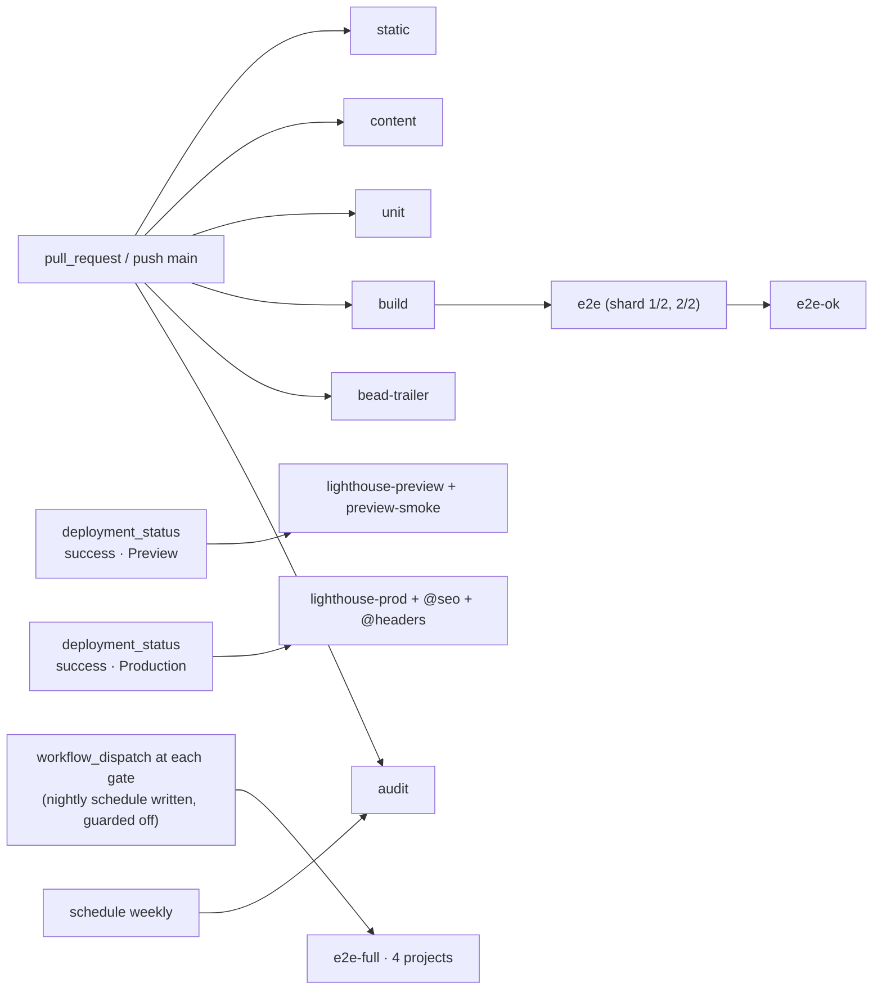

# 08 · Testing & quality gates

## Purpose

This document is the *how* behind every invariant the other plan documents declare: which check enforces it,
where that check runs (editor, `pnpm verify`, GitHub Actions, a Vercel preview, production), and what "green"
means per PR, per phase and at launch. It defines the test pyramid for this specific site — a three-locale
(`en`, `zh-Hans`, `zh-Hant`), heavily animated content site with one form — the CI pipeline, the local quality
loop, the flake policy, the coverage policy and the Definition of Done. It also owns the wiring of the content
gate that stops a plausible sample default from shipping as if it were the owner's real phone number (§3). It
restates no contract: `INV-02.n`, `INV-03.n`, `INV-05.n`, `INV-07.n` and `INV-11.n` are cited and mapped to
named checks in §9; their meaning lives in 02/03/05/07/11.

Status: draft · seat writer-testing · 2026-08-22 · revised 2026-08-22 for HD-2 (repo protection), HD-9
(provisional-value gate) and HD-10 (three locales); revised 2026-08-23 for ADJ-24 — the sending-identity
samples moved onto the real domain, which the release gate did not see (§3 R4, D-08.17); corrected
2026-08-23 — §2's TODO gate was specified with a glibc-only `\b`, which matches nothing under Apple git and
so failed open; it now reads `-nwE`, matching the shipped workflow; **reconciled with the repository
2026-08-23** — §10 and §11 described a toolchain that is largely still plan (`check:tokens`, `check:secrets`,
`check:env`, the flaky-tag lint, the dependency allowlist and `lhci` are not in
`package.json`, and four jobs are not in `.github/workflows/**`), and gave `pnpm verify` a formula that was
neither what the script runs nor honest about the `--warn-locale` flags it carries. Both tables now carry a
build-status column, the future rows keep their place with the PR that brings them, `pnpm verify` is quoted
verbatim from `package.json`, and the stale "the build has never passed" note is retired; **ruleset ground
truth re-verified against the GitHub API 2026-08-23** — the include list *does* name the default branch, so
push, force-push and non-squash-merge protection on `main` is live; what is missing is any
`required_status_checks` rule, so none of the six checks is required (D-08.19, INV-08.2, §12.3);
**INV-08.6's open divergence closed 2026-08-24** — §2's two greps moved out of `ci.yml` into
`scripts/ci/todo-grep.sh`, which `static` and `pnpm verify` both call, they now search `--untracked`, and §2
records what two files had each worked out on their own: prose *about* a marker is source text and trips the
gate (`gp-dln.206`–`.208`)

## Decisions

- **D-08.1 Pyramid and gates.** Seven layers: static checks → content gates → unit (Vitest + RTL) → end-to-end
  (Playwright, per locale) → accessibility (axe + keyboard scripts inside Playwright) → performance (Lighthouse
  CI) → visual regression (Playwright screenshots). Plus security and process gates. Every invariant declared
  by the contract documents 02, 03, 05, 07 and 11 maps to one named check and one CI job (§9, INV-08.1);
  04/06/09/10's invariants are mapped as their phases land (§9 closing note). Six required checks protect
  `main` (D-08.12) — once the ruleset lists them as required status checks, which it does not (D-08.19).
- **D-08.2 Literal-text rule, corrected configuration.** INV-02.1 is enforced with `react/jsx-no-literals`
  (eslint-plugin-react ≥ 7.37.0) configured `noStrings: true`, `ignoreProps: true`,
  `restrictedAttributes: ['alt','aria-label','aria-description','aria-roledescription','aria-valuetext','title',
  'placeholder','label']`, and an **enumerated** `allowedStrings` list. Verified 2026-08-22 against the rule's
  source: `allowedStrings` is trimmed exact-match (no patterns); `noStrings` with `ignoreProps: false` reports
  *every* plain attribute string (`className`, `href`, `type` …), so 02's phrase "`noAttributeStrings: true`
  for `alt`, `aria-label`, `title`, `placeholder`" must read `restrictedAttributes: [...]` — a one-line fix
  requested of 02 (OQ-08.8). The allowlist is closed: the design's separators and symbols (`·`, `—`, `–`, `→`,
  `↗`, `←`, `⌄`, `★`, `½`, `*`, `/`, `:`, `|`, `%`, `(`, `)`, `,`, `.`, `&`), the ten single digits, and the
  design's emoji (🌿 🌱 🍎 🥦 🌾 🧸 🎨 🏡 🌟 ✋ 🍚 📚). Anything else is a lint error; a runtime twin
  (the DOM-literal unit test, §4) catches concatenated or computed literals the parser cannot see.
- **D-08.3 ESLint.** Flat config (`eslint.config.mjs`, ESLint 9; Next 16 removed `next lint`, so `pnpm lint`
  runs `eslint . --max-warnings 0`). Plugins: `@eslint/js`, `typescript-eslint` (type-aware),
  `eslint-plugin-react`, `eslint-plugin-react-hooks`, `eslint-plugin-jsx-a11y`, `@next/eslint-plugin-next`,
  `eslint-plugin-playwright` (`e2e/**` + `playwright.config.ts`), `@vitest/eslint-plugin` (`tests/**`),
  `eslint-config-prettier`.
  Project bans are `no-restricted-imports` and `no-restricted-syntax` selectors (§2); no custom plugin.
- **D-08.4 Stylelint** (`stylelint-config-standard` + `stylelint-config-tailwindcss` for `@theme`/`@apply`/
  `@variant`) on `src/**/*.css`; `src/styles/tokens.css` is the **only** file exempt from the colour/px/ms
  bans, by an `overrides` block, because it *declares* the tokens.
- **D-08.5 Content gates are one script.** `pnpm validate:content` (`scripts/validate-content.ts`, D-02.7/
  D-02.8) with three flags: `--report` (writes `reports/content-coverage.md`, INV-02.6), `--warn-locale <id>`
  (demotes one locale's parity failures to warnings while it is being translated — `--warn-locale zh-Hans`,
  `--warn-locale zh-Hant`) and `--release` (the launch gate; `--accept-sample <path>` is a `--release`-only
  modifier of it, not a fourth mode — §3 R4). The same checks run in the message loader so
  `next build` fails on invalid content; the script exists so the failure is readable and two minutes earlier.
  What `--release` actually asserts is D-08.17 (it is no longer a `"TODO"` grep).
- **D-08.6 Unit.** Vitest (jsdom, `@testing-library/react`, `@testing-library/jest-dom`,
  `@testing-library/user-event`). Network is mocked at the fetch layer with MSW (`msw/node`) — Turnstile
  `siteverify` and the Resend API — so the inquiry handler is tested through its real SDK path with no
  injected transport seam. Coverage (`@vitest/coverage-v8`) is reported always and gated only by glob floors
  (D-08.16).
- **D-08.7 End-to-end.** Playwright. PR projects: `chromium-desktop` (1280×800) and `webkit-mobile`
  (`devices['iPhone 14']`, 390 wide); `firefox-desktop` and `chromium-mobile` (`devices['Pixel 7']`) run on
  push to `main` and nightly. The matrix is data: locales from `src/i18n/routing.ts`, routes from
  `content/site.json` `routes[]` plus `/` and a not-found URL. E2E runs against a **local production build**
  (the `build` job's `.next` artifact + `next start`), never against the Vercel preview, so the required check
  is deterministic and independent of Vercel timing; the preview gets an advisory smoke + Lighthouse run.
- **D-08.8 Accessibility.** `@axe-core/playwright` (tags `wcag2a`, `wcag2aa`, `wcag21aa`, `wcag22aa`) per
  route × locale × interactive state, **0 violations**; keyboard scripts for nav, hamburger, lightbox, form,
  skip link. `color-contrast` gates as well, with one **allowlist** rather than a blanket exemption: each pair
  03 §10 computes as failing by the design's own values (D-03.12) gets an entry in
  `e2e/axe-exceptions.json` — `{ selector, fg, bg, ratio, reason: '03 §10 / D-03.12', expires }`, where
  `expires` is the phase gate that answers OQ-03.2. A contrast violation on any pair *not* in that file fails
  the job, and so does an entry past its expiry. A new contrast regression is therefore blocked from day one
  while the known design debt is visible, enumerated and dated.
- **D-08.9 Performance.** Lighthouse CI (`@lhci/cli`) runs on the Vercel **preview URL** as an advisory PR
  check, and on the production URL after promotion as a launch/regression gate. Trigger: GitHub's native
  **`deployment_status`** event, which Vercel's Git integration emits for every deployment once 09 turns
  `deployment_status` events on (09, Vercel Git settings). No relay, no webhook receiver, no PAT: a relay
  Route Handler in this project was considered and is **rejected**, because it would be a third Function and
  06's `D-06.1` / `INV-06.7` / §6.10 allowlist ("only the proxy and `/api/inquiry`" — "a second dynamic page
  or a third function fails the gate") rejects it mechanically in the `build` gate (memo ADJ-14). The
  workflows filter on `github.event.deployment_status.state == 'success'`, read the URL from
  `github.event.deployment_status.target_url` and the commit from `github.event.deployment.sha`, and tell
  preview from production by `github.event.deployment_status.environment` (Vercel writes `Preview` /
  `Production`, possibly suffixed with the project name [assumed — confirm the exact string at setup]), with
  `github.event.deployment.ref == 'main'` as the production cross-check. Thresholds in §7 are ours (OQ-08.2).
  INP has no lab measurement: TBT ≤ 200 ms is the lab proxy; field INP comes from Speed Insights (09).
- **D-08.10 Visual regression: adopted, narrowly.** Playwright `toHaveScreenshot` on `chromium-desktop`
  only, viewports 1280 and 390 (via `test.use`), per locale, per home section and per subpage top fold,
  `maxDiffPixelRatio: 0.01`, `threshold: 0.2`, animations disabled and reduced motion emulated, fonts settled
  (`document.fonts.ready`). Baselines live in `tests/e2e/__screenshots__/` and are generated **only inside the
  Playwright Linux image** (`mcr.microsoft.com/playwright:v<version>-noble`, which ships WenQuanYi Zen Hei /
  IPA Gothic / Noto Color Emoji) — macOS renders CJK and emoji differently, so local baselines are invalid.
  **The `e2e` and `e2e-full` jobs run in that same image via `container:`** (§10): a bare GitHub runner has a
  different font set, so baselines generated in the image could never match screenshots taken on the runner.
  The spec is `e2e/visual*`, which 10 schedules at **PR-8.6** — 04's phase is when the sections the baselines
  capture first exist, not when the spec that captures them is written, so §12.2's `@visual` clause binds from
  the **Phase 8** gate and the suite does not exist to be run or skipped before it. No Percy/Chromatic: the suite is ~60 images and the cost is not justified at launch. This snapshot
  proves *our* rendering on one Linux font stack; it says nothing about how `→ ★ ↗` fall back on a user's
  macOS or Windows machine (03 §5), so it is complemented by the manual per-OS glyph check in §12.2.
- **D-08.11 Security checks.** `scripts/ci/bundle-secrets.sh` greps the **client** output of `next build` —
  `.next/static/**/*.js` and `.next/static/**/*.map` only, never `.next/server/**` (server chunks read
  `process.env.RESEND_API_KEY` legitimately) — for `grep -rEl 'RESEND_|TURNSTILE_SECRET|re_[A-Za-z0-9]{16,}'`;
  any hit fails `build`. `scripts/ci/env-example.ts` checks `.env.example` completeness;
  `pnpm audit --prod --audit-level=high` and gitleaks run
  in an advisory `audit` job (a new advisory must not block an unrelated PR) with Renovate weekly (09 D-09.17 —
  Dependabot cannot write a commit body and so could never pass `bead-trailer`, memo ADJ-17); response
  headers and the third-party request allowlist are asserted by e2e (`@headers`, `@thirdparty`).
- **D-08.12 CI.** GitHub Actions, Node 24, pnpm (version from `packageManager`). Required checks on `main`:
  **`static`, `content`, `unit`, `build`, `e2e-ok`, `bead-trailer`** — exactly these names (09 sets branch
  protection; OQ-11.3), and they stand unchanged after HD-2; when they start *enforcing* is D-08.19.
  PR workflows receive **no secrets** (only `GITHUB_TOKEN`): Turnstile test keys and
  `INQUIRY_TRANSPORT=log` are enough (INV-08.7).
- **D-08.13 Flake policy.** `retries: 0`. A test may carry `@flaky-known(gp-<id>)` naming an **open** bead;
  only those run in the `flaky-known` project with `retries: 1`; a lint step fails the PR if the tag lacks an
  id or the bead is closed in `.beads/issues.jsonl`. A flake is fixed by synchronisation (locators, `expect`
  polling, `waitForResponse`, `document.fonts.ready`), never by timeouts: `playwright/no-wait-for-timeout`,
  `playwright/no-networkidle` and a `no-restricted-syntax` ban on `test.setTimeout`/`test.slow()` are errors.
- **D-08.14 Local loop, no git hooks.** `pnpm verify` runs the same scripts CI runs (INV-08.6). No Husky/lefthook:
  11 decided enforcement is CI, not hooks (D-11.7, TRAP-11.5 — hooks do not work in worktrees), and a
  pre-commit hook that runs Playwright is a hook people bypass. Editor: `.editorconfig`, `.vscode/settings.json`
  (format on save, ESLint + Stylelint fix on save), `.vscode/extensions.json`.
- **D-08.15 Definition of Done** is layered: per PR (§12.1), per phase gate (§12.2, the gates 10 schedules and
  11 closes), at launch (§12.3).
- **D-08.16 Coverage policy.** No global percentage. The meaningful coverage is the content gate (every key,
  every locale) and the e2e matrix (every route × locale × browser). Unit floors by glob only where code is
  pure logic: `src/i18n/**`, `src/content/**`, `src/lib/**`, `src/design/**`, `scripts/validate-content.ts`
  (the gate in §3 is only as good as its own tests) and the pure modules of `src/components/motion/**` —
  `variants.ts` and the reveal registry, both asserted in §4 — at 90 % statements / 85 % branches;
  the `src/components/motion` **components** (`MotionProvider`, `Reveal`, `CountUp`, `WordSwap`), other
  components and `src/app/**` have no floor (they are covered by RTL render tests and e2e).
- **D-08.17 The release gate is the provisional registry, not a `TODO` grep (HD-9, 2026-08-22; R4 added
  2026-08-23 for ADJ-24).** HD-4/HD-7 ship the sending domain, the inbox, the address, the phone, the licence
  number, the Yelp figures and the teacher names as plausible **sample defaults** — precisely the thing a
  `TODO` scan cannot see. 02 answered with a registry: `content/site.json` carries `provisional: string[]`,
  dotted paths naming every sample default (D-02.20, INV-02.10). `pnpm validate:content` resolves the registry
  and *reports* it, exit 0; `pnpm validate:content --release` **fails while the array is non-empty**. **Four**
  release checks run independently, specified to the character in §3: **R1** registry non-empty; **R2** a
  literal `TODO`/`TBD`/`FIXME`/`XXX` string *value* under `content/`; **R3** a value from a range that can
  never be real (`.example` host, `555-01xx` number, licence `000000000`) surviving the deletion of its
  marker; **R4** one of the three ADJ-24 sending-identity samples — `mail.greenpasturesdaycare.com`,
  `no-reply@mail.greenpasturesdaycare.com`, `hello@greenpasturesdaycare.com` — surviving the deletion of its
  marker, matched as exact strings. R1 trusts the owner's assertion that a value is now real — 02 is right
  that nothing can verify that in general — and R3/R4 are the backstop for that assertion being wrong about
  the values *we* invented. They are two rules and not one because ADJ-24 split those values into two kinds:
  R3's cannot be real, so it has no false positives and needs no override; R4's are ordinary addresses on the
  domain the owner holds, so it has one of each (§3). Before R4 the sending domain and the inbox — the two
  values this decision's own first sentence names — were covered by R1 alone, which is the regression ADJ-24
  introduced and this bullet closes. The old rule (`--release` greps five required `site.json` fields for
  `"TODO"`) is **deleted**: it would have passed the entire Phase 3 seed, licence `000000000` included
  (09 §4.11 already said so).
- **D-08.18 Every matrix is three locales, and the bill steps when `zh-Hant` is enabled (HD-10, 2026-08-22).**
  Smoke, a11y, visual regression, Lighthouse, the unit render loop and the section-height snapshot all read
  `routing.locales` (INV-08.4), so HD-10 changes no test code — it changes the width of every loop, from 2 to
  3, and the runner bill with it (§10: 30 → 35–38 runner-minutes per PR; §8: 68 → 102 baseline images;
  §7: the production Lighthouse matrix no longer fits its timeout and is re-cut). The step happens on the
  commit that adds `zh-Hant` to `routing.locales`, **not** on the commit that creates `content/zh-Hant/`:
  INV-02.11 lets an unreviewed locale sit in the tree outside `routing.locales`, and while it does, every
  matrix here is still two wide. That commit is also the named reason INV-08.8 requires for regenerating the
  34 new `zh-Hant` baselines — it is a locale launch, not a flake.
- **D-08.19 Required-check names are fixed; enforcement waits on a required-checks rule (HD-2, 2026-08-22;
  ground truth re-verified 2026-08-23).** The six names in D-08.12 do not change. Ground truth, read from the
  GitHub API on 2026-08-23 rather than inferred: the repository's "Main Protection" ruleset (id 21223922) is
  active and its `conditions.ref_name.include` list **does** name the default branch (`~DEFAULT_BRANCH`), so
  its `deletion`, `non_fast_forward` and `pull_request` (squash-only) rules are live — `main` rejects a direct
  push, a force-push and a non-squash merge today. What the ruleset does **not** carry is a
  `required_status_checks` rule: **zero** required checks, so *none* of the six blocks a merge and a red
  `content` stops nothing. The names take effect when the human adds that rule and lists the six in it; repo
  settings are the human's (HD-2, OQ-11.3, 09).
  Ordering matters for one of them: `bead-trailer` can only be listed once its workflow has reported that
  check name at least once on the default branch, because GitHub's required-checks picker searches names it
  has already seen [assumed — confirm at setup]. That is Phase 2's scaffold PR, which is why the Phase 2 gate
  (§12.2) owns the item and INV-08.2 is documented intent until then.
- **D-08.20 `reports/content-coverage.md` is CI output, not a tracked file (`gp-dln.224`, 2026-08-24).** It
  was tracked, and it lied. Ground truth, read from the log rather than inferred: **two** commits have ever
  touched the report against **eight** that touched `content/` — PRs #41, #60, #64 and #65 each added `en`
  keys and each left the committed counts behind, and on the day this decision was taken the file on `main`
  claimed 323 reference keys and 589 warnings against a true 325 and 593. Six seats in a row watched
  `pnpm verify` rewrite the file under them and reverted it to keep their diff clean. That instinct was right,
  and the reason it was right is arithmetic, not diligence.
  **A three-way merge cannot add.** The report is a derived aggregate over the whole of `content/**`, so two
  branches that each add one `en` key each rewrite `keys present` from 325 to 326 — and git merges two
  identical edits without a conflict. Probed on this repository (the numbers are observed, not reasoned):
  branch A adds a key under `philosophy`, branch B one under `team`, A squash-merges, B merges clean at exit
  0, and the file that lands says **326 keys · 595 warnings** where the merged tree has **327 · 597**, with
  `<details><summary>291 missing key(s)</summary>` sitting directly above 292 bullets. Where the two branches
  touch the same region of the key list it conflicts instead — the outcome the reverting seats hit, and the
  kinder of the two. There is no third behaviour available: **conflict, or merge to a number that is wrong.**
  So a CI drift check — regenerate, `git diff --exit-code` — was rejected even though it works, because what
  it buys is a guaranteed conflict on every pair of parallel content pull requests, and its only reliable
  trigger point for the silent case is `push: main`, which turns a quiet lie into a red default branch. That
  is the failure INV-08.6 exists to prevent, arriving by a different door.
  The file is therefore generated and published, never stored: `.gitignore` ignores it, the `content` job
  writes it to the job summary, posts it as the sticky pull-request comment and uploads it as an artifact
  (§3, §10), and `pnpm verify` regenerates it locally in about two seconds. Each of those copies is generated
  from the commit under test and none of them can be stale; what is gone is the fourth copy, the one on
  `main`, which was the only one that could ever be wrong. §9's INV-02.6 row already read "artifact + sticky
  comment" and never named a tracked file — the `.gitignore` note that claimed §12 required one was the half
  that was wrong. `pnpm check:coverage-report` (`scripts/ci/coverage-report.sh`, §3) holds the decision open:
  it fires on a report that is missing, empty or truncated, on one that is not ignored, and on one that is
  tracked again.
  **`reports/section-heights.json` stays tracked and is not a counter-example.** A *baseline* is an
  expectation a human reviews when it moves (INV-08.8); a *report* describes the tree it was generated from.
  The first belongs in the repository, the second is output, and `reports/` holds one of each.

## Design

### 1 · The pyramid for this site

| Layer | Tool | What it proves here | Where it runs | Gate |
|---|---|---|---|---|
| Static | `tsc --noEmit` (strict), ESLint, Stylelint, Prettier | no literal copy in JSX (INV-02.1), no locale branching (INV-02.9), i18n navigation only (INV-02.7), token discipline (INV-03.1–3, INV-05.3/6/11) | editor · `pnpm verify` · `static` | required |
| Content | `pnpm validate:content` | three-way parity, ICU args (subset) / tags / arrays, empty/HTML, data-in-locale, Zod, ids, images, alt (INV-02.2/3/4/8), provisional registry (INV-02.10), coverage report (INV-02.6) | `pnpm verify` · `content` · loader in `build` | required |
| Unit | Vitest + RTL + MSW | components render in every locale in `routing.locales` with no DOM literal; CSS↔TS token parity (INV-03.4); variants catalogue; schemas; inquiry handler; templates; utilities | `pnpm test` · `unit` | required |
| E2E | Playwright (2 PR projects, 4 on `main`) | every route × locale (INV-02.5), switcher, slide, form (INV-07.4), reduced motion (INV-05.8), CLS, fonts, no-JS (INV-05.10), SEO, headers | `e2e` (shards) · `e2e-full` | required (`e2e-ok`) |
| A11y | axe-core + keyboard scripts | 0 WCAG 2.2 AA violations per route × locale × state; focus order/trap/return | inside `e2e` (`@a11y`) | required |
| Performance | Lighthouse CI | budgets on preview (advisory) and production (gate) | `lighthouse-preview` · `lighthouse-prod` | advisory / launch |
| Visual | Playwright screenshots | sections look like the design at 390/1280 in every enabled locale | inside `e2e` (`@visual`) | required from the Phase 8 gate (`e2e/visual*` is PR-8.6, §12.2) |
| Security | grep, audit, gitleaks, headers | no secret in client output (INV-07.3), env documented, deps, headers | `build` · `audit` · `e2e` | `build` required; `audit` advisory |
| Process | `bead-trailer`, TODO grep, PR template | INV-11.1/11.3, TRAP-11.9, DoD checklist | `bead-trailer` · `static` | required |

### 2 · Static checks

- **TypeScript.** `strict: true`, `noUncheckedIndexedAccess`, `noFallthroughCasesInSwitch`, `isolatedModules`.
  `pnpm typecheck` = `next typegen && tsc --noEmit` — `next typegen` emits Next's route types and next-intl's
  `.d.json.ts` message declarations (git-ignored), so a misspelt key or wrong ICU argument is a type error
  without a build (02 §Loading). Verified against next-intl's TypeScript workflow docs 2026-08-22.
- **ESLint bans** (all `error`; overrides listed; selectors illustrative):

```js
// eslint.config.mjs (excerpt)
'react/jsx-no-literals': ['error', { noStrings: true, ignoreProps: true,
  restrictedAttributes: ['alt','aria-label','aria-description','aria-roledescription','aria-valuetext',
                         'title','placeholder','label'],
  allowedStrings: ['·','—','–','→','↗','←','⌄','★','½','*','/',':','|','%','(',')',',','.','&',
                   '0','1','2','3','4','5','6','7','8','9','🌿','🌱','🍎','🥦','🌾','🧸','🎨','🏡','🌟','✋','🍚','📚'] }],
'no-restricted-imports': ['error', { paths: [
  { name: 'next/link', message: 'use Link from src/i18n/navigation (INV-02.7)' },
  { name: 'next/navigation', message: 'use src/i18n/navigation (INV-02.7)' },
  { name: 'gsap' }, { name: 'framer-motion', message: 'motion/react only (INV-05.11)' } ] }],
'no-restricted-syntax': ['error',
  { selector: "BinaryExpression[operator=/^[!=]==?$/][left.name='locale'][right.value=/^(en|zh)/], " +
              "BinaryExpression[operator=/^[!=]==?$/][right.name='locale'][left.value=/^(en|zh)/], " +
              "SwitchStatement[discriminant.name='locale']", message: 'no locale branching (INV-02.9)' },
  { selector: "JSXAttribute[name.name='className'] Literal[value=/(^|\\s)(sm|2xl|3xl|xs|max-\\w+):/]",
    message: 'only md:/lg:/xl: (INV-03.3)' },
  { selector: "JSXAttribute[name.name='className'] Literal[value=/-\\[#|\\[[0-9.]+(px|ms|rem|s)\\]|cubic-bezier/], " +
              "JSXAttribute[name.name='className'] TemplateElement[value.raw=/-\\[#|\\[[0-9.]+(px|ms|rem|s)\\]/]",
    message: 'arbitrary value — use a token (INV-03.1/2)' },
  { selector: "Property[key.name=/^(duration|delay|staggerChildren|delayChildren|repeatDelay)$/] > Literal, " +
              "Property[key.name='ease'] > ArrayExpression", message: 'motion values from tokens (INV-05.6)' },
  { selector: "Property[key.name='willChange'], JSXAttribute[name.name='style'] Literal[value=/will-change/]",
    message: 'no static will-change (INV-05.3)' },
  { selector: "CallExpression[callee.property.name='addEventListener'][arguments.0.value='scroll']",
    message: 'no scroll listeners outside src/components/motion (INV-05.9)' } ]
```

  Three further entries do not fit the excerpt's 25 lines. (a) **Inline-style colour**, the other half of
  INV-03.1 (03 §11 requires the ban in `style={}` *and* `className`): `no-restricted-syntax` selector
  `JSXAttribute[name.name='style'] Literal[value=/#[0-9a-fA-F]{3,8}\b|rgba?\(|hsla?\(|oklch\(|color-mix\(/]`
  plus the matching `TemplateElement[value.raw=…]`, so `style={{ color: '#fff' }}` and
  ``style={{ background: `rgb(${r} 0 0)` }}`` are errors. (b) **`LazyMotion strict` discipline** (D-05.5 —
  `LazyMotion features={domAnimation} strict`, all motion components `m.*` from `motion/react-m`):
  `no-restricted-imports` with `{ name: 'motion/react', importNames: ['motion', 'AnimatePresence'] }`
  — `m` from `motion/react-m` instead — overridden only for `src/components/motion/MotionProvider.tsx` (which
  imports `LazyMotion`/`domAnimation`) and `src/components/motion/WordSwap.tsx` (which needs `AnimatePresence`,
  D-05.9). Every motion path here is 04 §2's tree — `src/components/motion/**`, not `src/motion/**`, which does
  not exist (memo ADJ-15); a path that matches nothing silently disables the override it was written for.
  (c) **Script-stack utilities**, the check 03 INV-03.6 asks 08 for: `--font-cjk-sc` and `--font-cjk-tc` exist
  only to be selected by the two `:lang()` rules in `src/styles/tokens.css` (03 D-03.14), so a component that
  reaches for either — as the Tailwind utilities `font-cjk-sc` / `font-cjk-tc` or as `var(--font-cjk-tc)` —
  is choosing a script by hand, which is the TypeScript locale branch INV-03.6 forbids wearing a CSS hat.
  `no-restricted-syntax` on `JSXAttribute[name.name='className'] Literal[value=/\bfont-cjk-(sc|tc)\b/]` plus
  the `TemplateElement` twin, and `check-tokens.ts` fails on any `--font-cjk-(sc|tc)` reference in
  `src/**/*.css` outside `src/styles/tokens.css`. Components use `font-display`/`font-body`, which resolve
  through `--font-cjk` per `<html lang>` without knowing which script is in force.
  The locale-comparison selector's `/^(en|zh)/` covers all three ids as written — `'zh-Hans'` and `'zh-Hant'`
  both start `zh` — and it also still catches the retired `'zh'`, which INV-02.9 now forbids outright because
  it names nothing. No edit is needed for HD-10; the one thing that would break the rule is a locale id
  starting with neither `en` nor `zh`, which the add-a-locale checklist (02) is where it gets noticed.
  Overrides: `src/i18n/**` may import `next/navigation` and compare locales; `src/components/motion/**` may
  register scroll listeners (05 §5.12) and is where `ease`/`duration` literals are *defined*, so the
  motion-value ban excludes `src/design/tokens.ts` and `src/components/motion/variants.ts` (the catalogue is
  itself tested, §4);
  `src/app/api/**` and `src/lib/inquiry/server/**` are the only files allowed to read
  `process.env.RESEND_API_KEY|TURNSTILE_SECRET_KEY|INQUIRY_TO_EMAIL` (a third selector, INV-07.3). Also on:
  `@next/next/no-img-element`, `@next/next/no-html-link-for-pages`, `jsx-a11y` strict preset,
  `react-hooks` recommended, `playwright/no-wait-for-timeout`, `playwright/no-networkidle`,
  `playwright/no-force-option`, `playwright/expect-expect`.
- **Stylelint** (`src/**/*.css`): `color-no-hex`, `color-named: never`, `function-disallowed-list:
  [rgb, rgba, hsl, hsla, oklch, color-mix]` (INV-03.1); `declaration-property-value-disallowed-list` for
  `/^(transition|animation|box-shadow|border-radius|padding|margin|gap|width|height|font-size|top|left|
  right|bottom|inset)/`: `/(?<![\d.])(?!(0|1|1\.5)px\b)\d+(\.\d+)?px/`, `/\d+m?s\b/`, `/cubic-bezier/` (INV-03.2);
  `property-disallowed-list: [will-change]` (INV-05.3); `declaration-property-value-disallowed-list`
  `overflow: /hidden|clip|auto/`, `contain: paint`, `content-visibility: auto` in `src/components/**`
  (INV-05.2; `html { overflow-x: clip }` in `globals.css` is the one allowed site); `at-rule-disallowed-list:
  [keyframes]` everywhere except `src/components/motion/ambient.css` and
  `src/components/motion/view-transitions.css` (04 §2, memo ADJ-15)
  (INV-05.11), which in turn get `property-allowed-list: [transform, translate, rotate, scale, opacity,
  animation*, offset*, filter]` (INV-05.1 — `filter` is for `ink` only, reviewed). `src/styles/tokens.css`
  is exempt from the colour/px/ms rules. CSS-side breakpoints: `scripts/ci/check-tokens.ts` fails on any
  `@media` with a numeric width or any `@variant` other than `md`/`lg`/`xl` in `src/**/*.css`, and on a
  `prefers-reduced-motion` media query missing from a file that declares `@keyframes` (INV-05.8).
- **Prettier** with `prettier-plugin-tailwindcss` (class order) over `src`, `tests`, `e2e`, `scripts`,
  `content/**/*.json` and the root config files (02 requires stable JSON formatting so diffs show copy only).
  The shipped script is `prettier --check .` with the scope carved out by `.prettierignore` rather than by an
  argument list, so a new source directory is covered the day it appears instead of on the day someone
  remembers to add it. `pnpm format:check` is part of `static`.
- **TODO grep** (TRAP-11.9), two commands, each of which must produce no output:

```sh
git grep --untracked -nwE 'TODO|FIXME|HACK' -- 'src/**' 'tests/**' 'scripts/**'
git grep --untracked -nE '"(_comment|todo)"[[:space:]]*:' -- 'content/**'
```

  Both live in **`scripts/ci/todo-grep.sh`**, which is the only copy of them, and both callers run that
  script: `static`'s `check:todo` step and `pnpm verify`, each as `pnpm run check:todo` (§10, §11). Shipping
  them inlined in `ci.yml` *was* the INV-08.6 divergence — the gate ran in CI and nowhere else, so
  `pnpm verify` reported clean over a tree the PR was about to go red on, and `main` broke that way on
  2026-08-23. One script and two callers is what makes the two verdicts the same verdict rather than two
  that happen to agree.

  **A gate that cannot run must not report clean.** Every fail-open this check has had came from something
  that *could not scan* reporting what something that scanned and found nothing reports: `\b` compiling to a
  pattern that matched no line, tracked-only greps not seeing an untracked file. Two more doors were open
  until review found them and are shut in the script. `cd "$(git rev-parse --show-toplevel)"` fails open —
  command substitution used as an argument hides its exit status from `set -e`, so outside a repository the
  substitution yields nothing, `cd ""` succeeds, and the script sails on to exit 0 having scanned nothing;
  the path is assigned and checked instead. And `if git grep …; then` cannot tell a failure from a clean
  tree — `git grep` exits 0 on a match, 1 on none and **>1 on a real error** (a broken repository, a pattern
  it cannot compile), and the `if` shape reads all of them as "no match"; the script discriminates, and
  anything above 1 is fatal. Exit codes are 0 clean, 1 fired, **2 could not run**.

  **`--untracked`, deliberately.** `git grep` reads tracked files only. On a CI checkout every file is
  tracked, so the flag costs nothing there; locally it is the difference between catching a marker and
  waiting for someone to `git add`. Without it a brand-new file full of markers passes the local gate
  silently — a local-only fail-open of the same class as the `\b` bug below, and one that defeats the point
  of running the gate locally at all. Ignored files stay out (no `--no-exclude-standard`), so build output
  and `node_modules` are never scanned, and no CI verdict changes.

  **Prose about a marker is source text, and trips the gate.** The rule is *this word does not appear under
  these paths* — textual, trivially checkable, impossible to game — not *this word does not appear as a
  marker*, which would need a reader of intent. So a comment that merely **describes** the rule fires it
  exactly as a real marker would, and the fix is to reword the comment: never a backtick exemption, a prose
  heuristic or an allowlist, each of which is cheaper to abuse than opening a bead is to do (`gp-dln.205`
  proved it by probe — a marker in backticks reads as prose and stands in for real work just as well). The
  repository reached this conclusion twice before writing it down: `scripts/validate-content.ts` spells R2's
  vocabulary lower case on purpose so the file implementing it needs no exemption, and `src/lib/seo/json-ld.ts`
  was reworded rather than exempted. `todo-grep.sh` itself is the third and the cleanest demonstration — it
  stores its own vocabulary lower case and shouts it once at match time, so the file that defines the gate
  states what it forbids in full while containing none of it, and is scanned like every other file under
  `scripts/`.

  **`-w`, never `\b(…)\b` — the `\b` form fails open.** `\b` is a glibc regex extension, not POSIX ERE:
  git's regex engine honours it where glibc supplies it and silently matches nothing everywhere else.
  Verified 2026-08-23 on Apple Git 2.50.1 — against a file holding `// TODO: x`, `FIXME` and `HACK`, the
  `\b` form matched **zero** lines, while `-nwE` matched all three and still skipped `TODOLIST` and
  `TODOS`. What `-w` counts as a boundary is every non-word character, punctuation included, so
  `a-TODO-ish-name`, `(TODO)` and a URL path segment all fire — documented git behaviour, and the behaviour
  wanted here: a marker does not stop being one for being punctuated. Only letters, digits and `_` extend a
  word, which is why an identifier that merely *starts* with a marker word does not fire. A word-boundary gate that matches nothing reports green over a tree full of TODOs, which is the
  one failure this check exists to prevent — so `-w`, which is git's own flag, means the same thing and
  behaves identically on every platform, is not to be "simplified" back to `\b`. (`-P` also works, but
  needs a git built with PCRE2: no more guaranteed than glibc.)

  The second command is separate because `"TODO"` as a JSON *value* is the `--release` gate's business
  (§3 R2, D-08.17), so `content/**` is scanned for comments-in-disguise **keys** only. The two do not
  overlap and neither replaces the other: this grep is a required PR check over source text, R2 runs only
  at release and only over parsed JSON values.

### 3 · Content gates (`content` job, and the loader inside `build`)

`pnpm validate:content --report` performs, for each non-reference locale in `routing.locales` — `zh-Hans`, and
`zh-Hant` once it is enabled (INV-02.11) — the checks 02 lists (§Loading, typing, validation): key-set parity
with `en` for messages and collections; rich-tag set and array lengths equal to `en`'s; key shape (camelCase
segments, depth ≤ 6 — 02 *Key naming* rule 2); no empty string, no `'{`, no HTML tag; no URL / `/images/` / phone / e-mail / license / **brand-name** pattern in
`content/<locale>/**` (INV-02.4 — the brand-name pattern includes the rejected 绿茵园, D-02.19); Zod parse of
`site.json` and every collection, including completeness of every localized value across `routing.locales`;
id cross-references both ways; every `photo`/`image` path exists under `public/` and has an `alt` in every
locale; the **provisional registry** (below); and it writes `reports/content-coverage.md`. CI uploads the
report as an artifact, appends it to the job summary, and posts it as one sticky PR comment
(`marocchino/sticky-pull-request-comment`, pinned by SHA) so an editor sees missing `zh-Hans` / `zh-Hant` keys
and the shrinking provisional list on the PR (INV-02.6; 09 explains it to editors). Exit code is non-zero on
any finding.

**Those three publications are the report, all of it — the file is not in the repository** (D-08.20). It is
ignored, regenerated by every `--report` run, and each published copy is generated from the commit under test,
so none of them can go stale the way the tracked copy did for four merges running. Which makes the three of
them load-bearing, and their fail-open real: a job summary that emits `::warning::` on a missing file, a
sticky comment guarded by `hashFiles(…) != ''` and an upload set to `if-no-files-found: warn` add up, on the
day `--report` stops writing anything, to a **green `content` job that published no report at all**.

`pnpm check:coverage-report` (`scripts/ci/coverage-report.sh`) closes that, and holds D-08.20 open. Run it
after `validate:content --report` — `content`'s last step and `pnpm verify` both do, as the same script and
the same `pnpm run`, which is what INV-08.6 asks for and what §11 (c) argues every gate that can be a script
should be. It asserts three things and fires on each:

1. **the run produced a report** — present, a regular file, non-empty, and beginning with the heading
   `renderReport` writes, so a missing, empty or truncated write fails here rather than as three-way silence;
2. **the report is untracked** — D-08.20 itself, checked directly. Re-committing the file reds the `content`
   job on the pull request that does it, instead of starting the drift over on `main`;
3. **failing that, the report is ignored** — the ignore rule is what stops the next `git add -A` from
   committing it back. Reported only when 2 passes, because `git check-ignore` consults the index: a tracked
   path reads as not-ignored whatever `.gitignore` says, so testing both on a tracked file prints a true
   message beside a misleading one. Tracking is the larger fault and subsumes the other.

Its exit codes are `todo-grep.sh`'s and for the same reason: **0** clean, **1** fired, **2** the gate could
not run. Outside a work tree it exits 2 and says so; `git check-ignore` and `git ls-files --error-unmatch`
both answer 0/1 and use anything above 1 for a real error, and the script discriminates rather than reading
every error as an answer.

**Parity is three-way and ICU arguments are a subset** (02 amended INV-02.2 on 2026-08-22; this is the rule
text 08 owed it). `en` is compared against `zh-Hans` and `zh-Hant` **independently**, so a key missing from
both is two findings, not one. Key sets, rich-tag sets and array lengths stay equalities. ICU arguments do
not: a translation may use only a **subset** of the arguments `en` declares. An argument that appears in a
locale and not in `en` is an **error** (it can only ever render as literal braces); an argument `en` declares
that a locale omits is a **warning**, listed in the coverage report and never a gate failure. The concrete
case is the bilingual footer — `common.footer.copyright` takes `{brandName}` and `{brandNameOther}`, and a
locale that renders one name is legitimate (D-02.19). Under the old equality rule the three-locale footer was
unshippable, which is why the rule changed.

**Lagging locales** use `--warn-locale <id>`: `--warn-locale zh-Hans`, `--warn-locale zh-Hant` (the old
`--warn-locale zh` names nothing). It demotes *that locale's parity findings* to warnings while its tree is
being filled in (HD-12; 10's translation lane), and it affects nothing else — never the Zod checks, never
INV-02.4, never the provisional gate. `--release` **ignores it entirely** and fails on any parity gap in any
locale in `routing.locales` (INV-02.11): a locale that is not finished is removed from `routing.locales`, not
warned through. A `content/<locale>/` directory that is not in `routing.locales` (an unreviewed `zh-Hant`) is
scanned in a **reporting-only** pass — its parity percentage appears in the report so the reviewer has a
number — and nothing in that pass can fail a job.

**The provisional gate (INV-02.10, HD-9, D-08.17).** `content/site.json` carries `provisional: string[]`.
Resolution, in every mode:

1. Entries are unique; a duplicate is an error.
2. First segment decides the form. `collections.<name>.<id>.<field>` → `<id>.<field>` inside
   `content/<locale>/collections/<name>.json`, resolved **in every locale in `routing.locales`** (one entry,
   one value per locale). `messages.<namespace>.<key…>` → the dotted key inside
   `content/<locale>/messages/<namespace>.json`, likewise per locale. Anything else → a dotted path into
   `content/site.json`, where a **final segment that is a locale id** addresses one entry of a localized value
   (`brand.name.zh-Hans`) rather than a nested field.
3. `collections.` and `messages.` are **reserved prefixes**: the validator errors if `site.json` ever grows a
   top-level key with either name, because the grammar would become ambiguous. Neither exists today
   (02 §Shared config) and this check keeps it that way.
4. A path that resolves to nothing — in any locale it addresses — is an **error in every mode**, including the
   `content` job on a PR. This is the rule that stops a deleted value from leaving a stale marker and a
   mistyped path from silently disabling the gate for one field.
5. Values of any JSON type resolve. `yelp.rating` is a number and `yelp.reviewCount` an integer; the report
   prints values with `JSON.stringify`, so `5.0` and `"hello@greenpasturesdaycare.com"` are distinguishable.
6. **Pending-locale entries.** A locale-suffixed path whose locale id is *not* in `routing.locales` —
   `brand.name.zh-Hant` while `zh-Hant` is under review — is neither resolved nor an error: it is listed as
   *pending locale* and it still blocks `--release` under R1. Without this rule 02's 23-entry Phase 3 seed
   reds the `content` job the moment INV-02.11 is used, because INV-02.3 forbids `brand.name` from carrying an
   entry for a locale that is not enabled. One line for 02 to adopt (OQ-08.10).

Reporting is the whole PR-time surface: `validate:content` prints a **provisional values** block and writes
the same table into `reports/content-coverage.md` — one row per entry (per locale where the path is
per-locale) with columns *path · current value · file* — then exits 0. Provisional values are normal during
development; there is no runtime or UI marker, so no component is provisional-aware (02).

`pnpm validate:content --release` adds four independent failures, any of which fails the launch gate:

| Id | Fails on | Detail |
|---|---|---|
| **R1** | `provisional` is non-empty | lists every remaining path with its current value and file, including pending-locale entries |
| **R2** | a literal sentinel *value* | any parsed JSON **string value** under `content/**` matching `/\b(TODO\|TBD\|FIXME\|XXX)\b/i`; keys and raw file text are §2's grep, not this |
| **R3** | an unreal placeholder that outlived its marker | any string value under `content/**` matching `/[a-z0-9-]+\.example\b/i` (RFC 2606 host or e-mail domain), `/\+1\d{3}55501\d{2}\b/` (the E.164 form of `contact.phone`), `/\b555-01\d{2}\b/` (the printed form), or a `license` value of exactly `000000000` |
| **R4** | a **sending-identity sample** that outlived its marker (ADJ-24) | any string value under `content/**` **exactly equal** (trimmed, ASCII-case-insensitive) to `mail.greenpasturesdaycare.com`, `no-reply@mail.greenpasturesdaycare.com` or `hello@greenpasturesdaycare.com` — the three literals 02's *Provisional values* table ships at `email.sendingDomain`, `email.fromAddress` and `contact.email`. Exact equality only: no pattern over `greenpasturesdaycare.com`, which would flag the real inbox the day it is typed. Overridable per path by `--release --accept-sample <path>` (below) |

R3 and R4 exist because R1 believes the owner: deleting a line from `provisional` is an assertion that the
value is now real, and 02 is right that nothing can verify that in general. Neither tries to. They re-check
the handful of values *we* invented, and ADJ-24 split those into two kinds that need two rules.

**R3's kind cannot be real.** `.example` is RFC 2606's reserved TLD and cannot resolve, `555-01xx` is the
reserved fictional range, `000000000` is the design mock's licence number. A real value can never match, so
R3 has no false positives and needs no override. `brand.url`'s `https://greenpastures.example` is the sample
that keeps it load-bearing — ADJ-24 explicitly left that field where it was (OQ-09.10 decides its fate).

**R4's kind is syntactically ordinary, which is exactly why R3 cannot see it.** ADJ-24 moved the sending
identity onto the domain the owner holds: `email.sendingDomain`, `email.fromAddress` and `contact.email` now
ship as `mail.greenpasturesdaycare.com`, `no-reply@mail.greenpasturesdaycare.com` and
`hello@greenpasturesdaycare.com`. None of them matches `.example`, `555-01xx` or `000000000`, so between
ADJ-24 and this revision those three fields were guarded by R1 alone: delete the three paths from
`provisional` without doing the edit they stand for, and `--release` went green with the placeholder live —
the site launching, and mailing parents, from an address nobody had verified. R4 closes that by matching the
three shipped strings exactly. 02 writes of these samples that "what keeps them from shipping silently is the
registry, not their spelling"; R4 does not contradict it — R1 is still the gate, and R4 only checks that the
registry was cleared by an edit rather than by a deletion.

**R4's false positive, and the one override on this page.** An owner may adopt a sample verbatim — `hello@`
on one's own domain is a perfectly reasonable real inbox, and being paste-able is the whole point ADJ-24 was
arguing. R4 is then wrong, and is overridden once, by a human at the launch gate:
`--release --accept-sample contact.email` (repeatable, `--release`-only) exempts that **one path** from R4,
prints the acceptance into the launch summary and `reports/content-coverage.md`, and touches no other rule.
A path, never a rule, is what the flag takes; §12.3 records which paths it was used for.

**R4 is coupled to 02's spelling, and the coupling is mechanical.** R4 hard-codes three literals 02 owns; if
02 respells a sample and nobody updates R4, R4 matches nothing and fails open — the same failure mode in a
new place. So the validator's unit suite carries the one test on this page that reads the real
`content/site.json` instead of a fixture, deliberately: for each of the three paths, **if** it is still
listed in `provisional`, its current value must be one of R4's literals. A respelt sample reds the `unit`
job on the PR that respells it, and a replaced value passes vacuously once its path leaves the registry (§4).

**Residual risk, stated once:** R4 recognises only the exact strings we shipped, so an owner who edits
`email.fromAddress` to a *different* address that is still unverified — a typo, or a mailbox that does not
exist yet — clears R1, R3 and R4 alike, and is caught only downstream, by Resend refusing an unverified
sender, by the Phase 7 gate's DKIM/SPF item (OQ-07.6, 09) and by §12.3's manual real-key submission, which
passes only if the message actually arrives.

`--release` is not in the PR pipeline; it is the launch gate (§12.3) and runs as `lighthouse-prod`'s
preflight.

The validator's functions are unit-tested against fixture trees so the gate itself is trusted: missing key,
extra key, ICU argument undeclared in `en` (error) vs omitted in a locale (warning), tag mismatch, array
length, empty string, HTML, URL in a locale file, brand name in a locale file, `'{`, missing image, missing
alt — and, for the registry: unresolvable path, duplicate entry, a `collections.` path whose id is missing in
one locale only, a number-valued path, a pending-locale path, `--release` with a non-empty registry, and a
`"TBD"` value (R2). The R3/R4 fixtures are deliberately-invalid strings, not assertions about the real tree:
`--release` with an **empty** registry but `brand.url` still `https://greenpastures.example` fails on R3; the
same run with `contact.email` still `hello@greenpasturesdaycare.com` fails on R4; the same again with
`--accept-sample contact.email` exits 0 with the acceptance printed, while `--accept-sample brand.url` does
**not** silence the R3 finding (the flag is R4-only). Beside them sits the spelling-drift test above, which
reads the real `content/site.json`: every one of the three ADJ-24 paths still in `provisional` holds one of
R4's three literals.

### 4 · Unit tests (Vitest + RTL)

| Area | Tests | Enforces |
|---|---|---|
| Components | every section/component renders under `renderWithIntl(ui, { locale })` for each locale in `routing.locales` with `MotionProvider reducedMotion="always"`; no `⟦` marker; headings equal the JSON values; **DOM-literal test**: every non-whitespace text node and every `alt`/`aria-label`/`title`/`placeholder` equals a message value, an `Intl`-derived value (weekday/time/month/rating formats from `src/i18n/formats.ts`) or the D-08.2 allowlist | INV-02.1, INV-07.1 |
| i18n | `LOCALE_META` has an entry for every id in `routing.locales` and no others; for each, `htmlLang` and `hreflang` are **identical to the id** (HD-10's one-string rule — a mapping table is exactly what this test forbids), `nativeName`s are pairwise distinct (简体中文 ≠ 繁體中文 ≠ English), `shortLabel` is non-empty, and `brandPairLocale` names a different enabled locale; `brand.name[locale]` and `brand.name[brandPairLocale]` both resolve, so `common.footer.copyright` gets `{brandName}` + `{brandNameOther}` in every locale with no branch; `loadMessages` deep-merge in prod, marker in dev; named formats; `getPathname`/`Link` keep path+query+hash on locale change | D-02.1/7/8/10/19, INV-02.9 |
| Content | Zod schemas accept fixtures and reject each invalid shape with a readable issue; `collections.ts` joins keep `site.json` order and honour `onHome`/`onMobile`/`featured`; validator functions (§3); **R4 spelling drift** — the one test here that reads the real `content/site.json` rather than a fixture: each of `email.sendingDomain`, `email.fromAddress`, `contact.email` that is still in `provisional` holds one of R4's three literals, so a respelt sample cannot leave the release gate matching nothing (§3) | INV-02.3, D-02.13, INV-02.10 |
| Design tokens | `tokens.css` parsed (postcss) vs `src/design/tokens.ts`: every `dur.*` = `--dur-*`/1000, `ease.*` = bezier numbers, `stagger.*`, `rise.*`, `breakpoints` = rem×16 — and the reverse (every motion custom property has a TS twin; `REVEAL_THRESHOLD` exempt); parsed tokens `toMatchFileSnapshot` so any value change is an explicit diff beside the 03 edit | INV-03.4, INV-03.5 |
| Motion | `variants.ts` catalogue equals 05 §5.2 (keys ⊆ x/y/rotate/scale/opacity/filter(ink only)/transition/transformOrigin, durations/easings reference tokens); **index alternation** is a pure function of `custom`: `polaroid` even index → `x −150, rotate −10`, odd → `+150, +10`; `bubble` `tail: 'left'` → `transformOrigin '12% 100%'`, `'right'` → `'88% 100%'` (05 §5.2); Reveal registry: one pooled observer per options set, reveal-once across remounts; decorations (`Sun`…`TeacherFrame`) expose `id="deco-*"`, forwarded ref, outer/inner layers | INV-05.1/5/6/9/10 |
| Motion runtime | `MotionProvider` renders `LazyMotion features={domAnimation} strict` (D-05.5) — snapshot of the rendered provider props — and under `strict` a `motion.div` from `motion/react` throws while `m.div` from `motion/react-m` renders, so the `m`-only rule has a runtime twin beside the §2 import ban | INV-05.11 |
| Count-up / swap | `CountUp` renders the **final** value server-side, formatted with `Intl.NumberFormat(locale, { minimumFractionDigits: decimals, maximumFractionDigits: decimals })` for every locale in `routing.locales` with `decimals` from the shared config (5.0 → 1 decimal, 47 → 0; 05 §5.5) — asserted per locale, not against an English literal (INV-08.5); `WordSwap` index registry, and a day change re-keys it: the old sample line unmounts and the new one mounts once (`AnimatePresence mode="wait"`, D-05.9) | INV-05.6/10, D-02.6 |
| Inquiry | schema boundaries, normalisation (trim, NFC, control chars, CJK names), month window, honeypot, enums (07 §8); handler via `new Request()` → `POST` with MSW: happy path (`to` from env, `reply_to`, `Idempotency-Key`, tags, both bodies, subject free of user text), per-field `invalid`, decoy 200 on honeypot/too-fast with **no** Resend call and a body identical to success, `turnstile_failed`, `turnstile_unavailable` fails closed (503), Resend failure → 502, 405/415/413/403 guards incl. branch-alias origin, URL-encoded → 303, `INQUIRY_AUTOACK` on/off, CR/LF in name never reaches headers, no production bypass under any env permutation, idempotency key stable for identical payload and different after an edit; `console.info` spy: no submitted name/email/message/IP/token in any log line | INV-07.1–7 |
| Email templates | staff + auto-reply rendered per locale with next-intl's `createTranslator`; no unresolved `{`; HTML escaping of `< & "`; plain-text part present | INV-07.4 |
| Analytics wrapper | `track()` props validated against the 07 §4 allowlist (`locale, source, childAge, code, placement, to`) — a test posts a PII-shaped prop and expects a throw | INV-07.5 |
| Utilities | default menu day in `America/Los_Angeles` (fake timers), `cn`, date helpers | D-02.6 |

### 5 · End-to-end (Playwright)

Config: `playwright.config.ts` **at the repository root**, with `testDir: "./e2e"` — the specs live in `e2e/`
and grow one family per phase (10 §7: `e2e/smoke*` PR-3.6, `e2e/form*` PR-5.10, `e2e/routes*` PR-6.10,
`e2e/a11y*` PR-8.4, `e2e/visual*` PR-8.6). Earlier revisions of this document wrote
`tests/e2e/playwright.config.ts`; that path was never built and `tests/` holds the Vitest suite only. The one
thing that *does* live under `tests/e2e/` is the screenshot baseline directory, which the shipped config pins
there explicitly via `snapshotPathTemplate` because D-08.10 pins it there. `webServer` = `pnpm start -p 3000` over the downloaded `.next`
artifact (locally `pnpm build && pnpm start`), env: `INQUIRY_TRANSPORT=log`, Cloudflare's published
always-pass test pair (07 §5) — site key `1x00000000000000000000AA`, secret
`1x0000000000000000000000000000000AA` — `INQUIRY_TO_EMAIL=inbox@example.test`,
`NEXT_PUBLIC_SITE_URL=http://localhost:3000`. `timeout: 30_000`, `expect.timeout: 5_000`, `retries: 0`,
`trace: 'retain-on-failure'`, `video: off`, `fullyParallel: true`, CI shards `2`. Tests import
`routing.locales` and `site.json` and loop; assertions use values read from `content/<locale>/**` (never
English literals, INV-08.5) or ARIA roles/test-ids.

Three properties of this rig decide what some tags can and cannot prove, so they are stated once here.
**(a) The `⟦` marker is dev-only.** `pnpm start` serves the production loader, where a key missing from
`zh-Hans` or `zh-Hant` deep-merges to the `en` value and renders English (02 §Loading, D-02.8) — it never
emits `⟦namespace.key⟧`. The `@smoke` marker assertion is therefore a check that no key is missing from **`en`
as well**; Chinese gaps are caught earlier and better by `validate:content` three-way key parity in the
`content` job (INV-02.2), which is the required check for that property. This matters more with three locales
than it did with two: an untranslated `zh-Hant` page renders as fluent English and passes every e2e assertion
in this table, so the *only* gate that sees it is the `content` job. We do not add a dev-mode smoke run: it
would duplicate a stronger gate.
**(b) Three tags are Chromium-only, for three different reasons.** The `LayoutShift` interface — and therefore
`PerformanceObserver('layout-shift')` — exists only in Chromium, so a `@perf` run in `webkit-mobile` would
observe nothing at all and report a pass; `@motion-vt` asserts the *typed* View-Transition behaviour 05 §5.7
specifies, whose support 05 states for Chromium; `@visual` is chromium-only by D-08.10's own scope decision.
All three are pinned to `chromium-desktop`, which covers both viewports by `test.use` (1280×800 and 390×844 —
the 390 measurement 03 §3.3 asks for thus runs on every PR, without moving `chromium-mobile` off `main` and
without spending OQ-08.3's budget). The other projects carry
`grepInvert: /@perf|@visual|@motion-vt|@motion-obs/` — the last of those for the different reason in note (c) —
so a silently-observing no-op can never be mistaken for a pass. The instant-swap fallback path carries its own
tag, `@nav-instant` — deliberately not a `@motion-vt` substring — precisely so it *does* run in every project.
**(c) `@motion-obs`'s expected value is viewport-dependent, so it runs at 1280 only.** 04 §3.3 and 05 §5.4 both
mount `AmbientScope` on `HeroSection` **and, at 390, additionally on `PhilosophySection`**. The "exactly two
observers" INV-05.9 states is therefore derivable only at 1280 — the frozen reveal pool plus the hero's
ambient `useInView`. At 390 the count is two only if Motion pools the two identical ambient options sets into
one observer, and three if it does not; 05 states pooling for the reveal options set but says nothing about
two ambient scopes, and a gate whose expected value is unverified is not a gate. So `@motion-obs` is pinned to
`chromium-desktop` and, inside it, to the 1280 viewport by `test.use`. Little is lost: the pause/resume half
of the tag is engine-independent CSS (`animation-play-state`). Extending the count assertion to 390 needs one
sentence from 05 first — whether the hero and philosophy ambient scopes share one pooled observer — and then
the row below states three rather than two.

| Tag | Suite (per locale unless noted) | Asserts |
|---|---|---|
| `@smoke` | every route × locale — `/` plus the six detail pages in `site.json.routes[]`, so **7 routes × 3 locales = 21 page URLs** at launch (14 while `zh-Hant` is out of `routing.locales`, INV-02.11); the reserved `faq` and `enroll` pages are **not** built (HD-5 answered OQ-02.7) and enter the matrix only if a `routes[]` entry ever appears; plus a not-found URL per locale | 200 (404 for not-found, localized `errors.notFound`); `<html lang>` = `LOCALE_META.htmlLang`, which for every locale **equals the URL segment** (`/zh-Hant/…` → `lang="zh-Hant"`); no `⟦` (scope: note (a) above); `hreflang` set = every enabled locale + `x-default`→`en`; canonical = self, in canonical BCP 47 casing; no `Link` header with `hreflang` (D-02.9) |
| `@i18n` | the three-option switcher from `/en/programs?x=1#sectionId`; root `/` with `Accept-Language:` unset, `zh-CN`, `zh-TW` and `en-GB`; the lower-cased path `/zh-hans/programs` | the trigger shows `LOCALE_META[current].shortLabel` (`EN`/`简`/`繁`) and the menu lists the endonyms in `routing.locales` order with `aria-current` on the current one (D-02.10 — a two-name toggle fails); choosing 简体中文 gives URL `/zh-Hans/programs?x=1#sectionId`, `scrollY` unchanged, `NEXT_LOCALE` cookie, `lang` updated; **cascade**: every `[data-reveal]` in the new tree plays `swap` — opacity 0→1 with `min(index × 14 ms, 300 ms)` delays read from `data-reveal-index` (D-05.9; `[data-wordswap]` does not exist — `WordSwap` is only the menu sample line, checked in `@motion`); under reduced motion the cascade **still plays**, opacity-only with the `y` track dropped and the 14 ms delays kept, and only the root View-Transition crossfade is instant (05 §5.9) — a no-cascade instant swap fails; negotiation lands `zh-CN`→`/zh-Hans`, `en-GB` and unset→`/en`, and `zh-TW`→`/zh-Hant` **once `zh-Hant` is in `routing.locales`**; **while it is held back (D-08.18, the plan's default for most of the build) the same `zh-TW` header must land `/zh-Hans` — same language, other script — and never `/en`** (02's table read the way 06 implements it: each row an ordered preference chain filtered by `routing.locales`, first survivor wins — `D-06.15`(a), OQ-08.11 **closed**); `/zh-hans/programs` 308s to `/zh-Hans/programs` |
| `@seo` | `sitemap.xml`, `robots.txt`, `/api/inquiry` | sitemap = every route × locale with alternates, no `/api/`; robots `Disallow: /api/`; `GET /api/inquiry` → 405 |
| `@form` | fill → submit → success panel (focus on its heading); blank required → inline errors, `aria-invalid`, focus on first invalid; `page.route` forces 502 → `emailFailed` banner; forces 429 → `rateLimited`; forces `turnstile_failed` → its banner; honeypot filled → success panel (no-send proven in unit); pending state `aria-busy`, never `disabled`; 390 px: full-width submit, controls ≥ 44 px; keyboard-only completion. A *real* Turnstile rejection needs a different server env, so it is unit-only by design (MSW against `siteverify`, §4); Cloudflare's always-fail pair — site key `2x00000000000000000000AB`, secret `2x0000000000000000000000000000000AA` — is wired into a `workflow_dispatch` variant of `e2e` that boots a second `next start`, kept out of the PR matrix for the runner budget (OQ-08.3) | INV-07.4, D-07.4 |
| `@nojs` | `javaScriptEnabled: false` project on `/` and the form | all section text visible (no opacity 0), count-up final values, `<noscript>` fallback visible, native validation, switcher anchor `href` = other-locale path — INV-05.10, D-07.5 |
| `@motion` | reduced-motion parity (`reducedMotion: 'reduce'` vs default, settle, compare text + computed `transform: none`, `animationName: none` on loops, count-up final); reveal-once (scroll away/back; subpage and back by **typed Back** — the in-page "← Back" control — *and* by **browser Back**, `page.goBack()`, which is a different history path, 05 §5.14); stagger 110 ms (read `transition-delay`/Motion timings via `data-reveal-index`) **and its alternation**: gallery polaroids alternate sign by index (even → negative `x`/`rotate`, odd → positive) and review bubbles take `transform-origin` from tail side (`12% 100%` left, `88% 100%` right), both read from computed style at the first animation frame; `WordSwap` on day change (click another day chip → the old sample line leaves before the new one enters, `mode="wait"`, `--dur-word-swap`; opacity-only under reduced motion); computed-style scan: no transform on nav/section shells/ancestors of fixed/sticky, no `overflow` clip on stagger ancestors, `will-change: auto` at rest | INV-05.2/3/4/7/8, D-05.6/9 |
| `@motion-obs` (chromium-desktop, 1280 only — note (c)) | init script replaces `window.IntersectionObserver` with a counting proxy before any bundle runs; after loading `/` and scrolling the whole page, **exactly two** observers were constructed (the frozen reveal pool + the hero's ambient-pause `useInView`, INV-05.9) and a third fails — at 1280 the hero is the only `AmbientScope` 04 §3.3 mounts, which is what makes two the right number; scroll the hero out of view → its section carries `data-ambient="paused"` and every `.loop` inside computes `animation-play-state: paused`; scroll back → `running` | INV-05.9 |
| `@hover` | pointer gating (D-05.12, 05 §5.10). In the `webkit-mobile` project, `matchMedia('(hover: none) and (pointer: coarse)').matches` is the precondition, then `hover` on every button, nav link, polaroid and card leaves computed `transform`, `translate`, `scale` and `box-shadow` unchanged. In `chromium-desktop` with `reducedMotion: 'reduce'`, the same hovers change only colour/shadow — computed `transform` stays `none` on the inner layer (05 §5.10). If OQ-08.3 moves `webkit-mobile` to `main`-only, the touch half moves with it and the reduced-motion half still runs on every PR | D-05.12 |
| `@motion-vt` (chromium) | init-script spies `document.startViewTransition`; "learn more →" → URL change with type `subpage-enter`, scroll top, `h1` focused; "← Back" → `/en#<homeAnchor>` via replace (history length unchanged), type `subpage-exit`, section heading focused; reduced motion / untyped nav → no typed transition. **Values** (05 §5.7, the numbers 05 fixes): during the transition, `document.getAnimations()` contains `gp-slide-in`/`gp-slide-out` on the `.gp-page` view-transition pseudo-elements with `getTiming().duration === 500`, `easing` equal to the resolved `--ease-soft` bezier, and a keyframe `translate: 103% 0`; the root groups are `animation: none` | D-05.10, OQ-05.2 |
| `@nav-instant` (every project) | the unsupported-browser path 05 §5.7 requires, which a chromium-only suite cannot reach: an init script deletes `document.startViewTransition` before any bundle runs, then "learn more →" and "← Back" are exercised — URL, scroll-to-top, hash landing and `h1` / section-heading focus all still correct, `document.getAnimations()` holds no `::view-transition` animation, and nothing is left mid-slide. Deliberately **not** tagged `@motion-vt`, so the `grepInvert` above does not exclude it: in `firefox-desktop` and `webkit-mobile` the deletion is a no-op and the same assertions then cover engines that genuinely lack the API | D-05.10, 05 §5.7 |
| `@perf` (chromium-desktop, both viewports) | `PerformanceObserver('layout-shift')` buffered during load + reveals + count-up + loops + locale toggle → CLS ≤ **0.02** per phase, at 1280×800 **and** 390×844 via `test.use` (03 §3.3 asks for 390; the LayoutShift API is Chromium-only, note (b) above, so this tag never runs in `webkit-mobile` where it would observe nothing); LCP element (hero image) has computed `opacity: 1` in SSR HTML; **no** request matching `fonts.gstatic\|_next/static/media/.*\.woff2` during the toggle; section-height snapshot: nav height and each `section[id]` height at 390 and 1280 for **every locale in `routing.locales`** written to `reports/section-heights.json` and compared to the committed baseline — a delta > one line-height of that section fails (04 adds `min-height`, 03 §3.3). Three locales make this snapshot more valuable, not just wider: Traditional glyphs are on average wider than Simplified at the same size, so `zh-Hant` is the locale most likely to overflow a fixed-height section, and it is the row that would otherwise only be caught by eye | INV-05.7, 03 §3.3 |
| `@thirdparty` | all request hosts on `/` ∈ {self, `challenges.cloudflare.com`, `va.vercel-scripts.com`, `vitals.vercel-insights.com`} [last two appear only on Vercel — assumed] | INV-07.8 |
| `@headers` | response headers on `/en` equal the set 06/09 declare (`x-content-type-options`, `referrer-policy`, `permissions-policy`, CSP incl. Turnstile hosts, HSTS on Vercel) | 06/09 |
| `@a11y` | §6 | |
| `@visual` | §8 | |
| `@flaky-known(gp-…)` | quarantine project, `retries: 1` | D-08.13 |

### 6 · Accessibility

axe (`AxeBuilder().withTags([...])`) runs on: every route × locale (idle); `/` with hamburger open (390),
lightbox open, menu day switched; the form idle / error / success; 404. Rules: all WCAG 2.2 AA; 0 violations.
`color-contrast` is **not** blanket-disabled (D-08.8): each violation is matched against
`e2e/axe-exceptions.json`, whose only entries at launch are the pairs 03 §10 already computes as failing
(each with `selector`, the two hex values, the computed ratio, `reason: '03 §10 / D-03.12'` and an `expires`
phase gate). A matched violation is reported into the job summary; an **unmatched** one fails the job, so a
contrast regression introduced by new markup or a token edit is blocked on the PR that introduces it. Entries
leave the file as OQ-03.2's replacements land, and an entry past its `expires` gate fails the job as well. No
other per-rule disables — any further exception needs a bead and its own entry with an expiry. Keyboard
scripts: skip link is first `Tab` and lands on `main`; nav order matches the visual order; hamburger: `Tab`
cycles inside, `Esc` closes and returns focus to the trigger; lightbox: arrows, `Esc`, focus trapped and
returned; form: `Tab` through all controls, `Enter` submits, error focus management (D-07.4); the
`:focus-visible` ring has a computed `outline-width` of `3px` (D-03.11). Colour-scheme and zoom: 200 % zoom
at 1280 — a 640 px CSS viewport — shows no horizontal scroll, **and so does 390 px unzoomed** (INV-05.2's
`overflow-x: clip` on `html`). Both halves of that sentence are corrections, and both were measured in
chromium and webkit on a production build carrying a +150 px bleed, by the row that placed the rule in
`src/app/globals.css`:

- **The viewport.** The bleed the rule exists to absorb is the gallery's, which is +150 px from the right
  edge *on 390 px screens*; at 1280 the wall fits and the overflow is 0. A check that only ever ran wide
  would have passed against a page that scrolled sideways by 126 px on the reference mobile width (03 §3.3),
  which is the width the design is drawn at. Zooming to 200 % happens to reach the `< lg` layout and so
  happens to catch this one — but it is 640 px, not 390 px, and a bleed introduced below `md` would sail
  through it. The narrow viewport is asserted directly, not approached through zoom.
- **The instrument.** `documentElement.scrollWidth - clientWidth` does **not** measure this rule and must not
  be what either assertion reads. The root element propagates its overflow to the viewport and is itself left
  used-value `visible`, so that subtraction reports the bleed identically with the rule and without it — 126
  px both ways in the measurement above, while user-driven horizontal scrolling went from 126 px to 0. The
  assertion is `window.scrollX === 0` after a real horizontal input (`mouse.wheel(500, 0)` and `ArrowRight`),
  which is both what a user experiences and the only reading that changes when the rule is removed.

### 7 · Performance budgets (Lighthouse CI)

`lighthouserc.cjs`: `collect.url` from the event payload (`github.event.deployment_status.target_url`,
D-08.9), mobile preset (LHCI's simulated throttling), `aggregationMethod: median`; preview run = `/en`,
`/zh-Hans`, `/zh-Hans/programs` (CJK-heavy), plus `/zh-Hant` once that locale is in `routing.locales` — four
URLs, `numberOfRuns: 3`, advisory. Production run = every route × locale, mobile **and** desktop presets,
which at three locales is 7 × 3 × 2 = **42 collections**; at `numberOfRuns: 3` that is 126 Lighthouse runs and
does **not** fit the job's 40-minute timeout (it barely fit at two locales). So the production matrix is
re-cut rather than trimmed: `numberOfRuns: 3` on the three home URLs (`/{locale}`), where LCP and CLS are the
numbers that matter and run-to-run variance is worst, `numberOfRuns: 1` on the eighteen detail-page URLs, and
the `lighthouse-prod` timeout goes to **60 min** (§10). Every URL is still measured on both presets; only the
sampling depth differs, and the launch checklist reads the same assertions either way.
Assertions (`error` unless noted; our numbers — OQ-08.2): `categories:performance ≥ 0.90`,
`categories:accessibility = 1`, `categories:best-practices ≥ 0.95`, `categories:seo = 1`;
`largest-contentful-paint ≤ 2500`, `cumulative-layout-shift ≤ 0.05` — this is Lighthouse's whole-page,
cold-load, mobile-emulated CLS and is deliberately looser than the animation budget; the 0.02 that 03 §3 fixes
for reveals, count-up, loops and the locale toggle is asserted separately and per phase by §5 `@perf`, and
neither number relaxes the other. `total-blocking-time ≤ 200` (INP proxy), `speed-index ≤ 3400` (warn).
`resource-summary:*:size` assertions take **`maxNumericValue` in bytes** (only a `budgetsFile` is written in
KiB) [verified: LHCI assertion docs, 2026-08-22], so they read `resource-summary:script:size ≤ 184320`
(180 KiB transfer, home), `resource-summary:image:size ≤ 512000` (500 KiB, mobile home),
`resource-summary:font:size ≤ 122880` (120 KiB — Fredoka 2 + Nunito 3 latin subsets),
`resource-summary:third-party:count ≤ 3`; `unsized-images`,
`modern-image-formats`, `uses-responsive-images`, `offscreen-images` error; `third-party-summary` warn.
Image policy is lint + Lighthouse: `@next/next/no-img-element`, `next/image` with `width/height` from
`site.json`, hero `priority`, everything else lazy. Upload target `filesystem` → artifact + job summary (no
`temporary-public-storage`: reports would be public). Bundle weight is measured where it is real — the
preview's transfer sizes — not re-implemented locally; the route summary goes into the job summary for
eyeballing. Field vitals (INP, p75) are read in Speed Insights after launch (09; OQ-01.1).

**The half a build directory can decide, and the half it cannot** (PR-8.5). The paragraph above draws the
line and `scripts/ci/build-budget.ts` sits on the near side of it. Four of the numbers on this page do not
need a CDN to be true, because the asset is already compressed or the thing being counted is not bytes at
all: `resource-summary:font:size` (`woff2` on disk **is** `woff2` on the wire), `resource-summary:image:size`
and 09 §4.9's 400 KB-per-file rule (same argument for JPEG/WebP/PNG), and
`resource-summary:third-party:count`, which is a count of origins in the emitted HTML. Those four are
asserted by `pnpm check:budget` on every pull request, against the same constants `lighthouserc.cjs` sends to
Lighthouse, so a regression is caught at the pull request rather than at the next deployment. The transfer
budgets — `resource-summary:script:size`, the three Core Web Vitals and the four category scores — are **not**
re-implemented there; `check:budget` prints the measured gzip figure beside `184320` and leaves the assertion
to `lighthouse-preview`. What it adds on its own account is a **first-load ratchet**: Next writes
`firstLoadUncompressedJsBytes` per route into `.next/diagnostics/route-bundle-stats.json`, the script holds a
whole-KiB ceiling per route, and growth past it reds the job. That number is a baseline in D-08.20's sense —
an expectation a human reviews when it moves, like `reports/section-heights.json` — not a budget, and the
file says so in as many words. The route table it prints into `$GITHUB_STEP_SUMMARY` is the route summary
this section asks for; it is in `budget` rather than `build` because 10 §10's `ci.yml` rule makes additions
new jobs and never edits to an existing one, and a step inside `build` would have been the edit.

**Measured on 2026-08-24 against `origin/main` at 947bdf6, and the site does not meet this section yet.**
Recorded here because a budget nobody has stated today's number against is a guess, and left alone rather
than adjusted to fit. Home first-load JS is **968,434 bytes** uncompressed / 279,819 gzip / **239,705
brotli-11**, so `resource-summary:script:size` is over `184320` by ≈ 55 KB even read at brotli's most
favourable setting; Lighthouse's own figure against a local `next start`, which serves gzip, is 302,462.
The same run (mobile preset, `lighthouserc.cjs`'s own preview matrix) put `/en` at
`categories:performance` **0.81** against `≥ 0.90`, `largest-contentful-paint` **4,081 ms** against
`≤ 2500`, and `total-blocking-time` **272 ms** against `≤ 200`. Those three are one finding with one cause:
the client graph is about 55 KB of transfer too heavy, and the parse cost of it is the blocking time.

What is already inside its budget: `cumulative-layout-shift` is **0** against `≤ 0.05`; fonts are **68,856
bytes** in two preloaded `woff2` against `122880` — the "Fredoka 2 + Nunito 3 latin subsets" arithmetic
predates both faces shipping as single variable files, so the real figure is a little over half the budget;
third-party count is **0** against `≤ 3`; and `unsized-images`, `modern-image-formats`,
`uses-responsive-images` and `offscreen-images` all pass, on a site that has no photography in it yet.
`categories:accessibility` medians **0.97** against `= 1`, which is PR-8.4's row and not this one's.

None of those numbers moved a threshold on this page. They are the distance PR-8.3's LCP work and the
Phase 8 gate have to close, and `lighthouse-preview` is advisory precisely so the distance is visible on
every preview without blocking a merge.

### 8 · Visual regression

`e2e/visual.spec.ts` (`@visual`, chromium-desktop only, D-08.10): for each locale and each viewport
(1280×800, 390×844 via `test.use`), `/` scrolled section by section (`section[id]` → `toHaveScreenshot`,
`animations: 'disabled'`, reduced motion on, `mask` for the count-up and the menu's "today" chip, wait
`document.fonts.ready`), the top fold of each detail page in `site.json.routes[]` (six — `faq` and `enroll`
are reserved and not built, HD-5), the hamburger sheet (390), the lightbox, the form
success panel. That is 2 viewports × L locales × (8 + 6 + 3) shots: **68 images at two locales, 102 at
three**. The 34 `zh-Hant` images are generated by the PR that adds `zh-Hant` to `routing.locales` and nowhere
else — that commit is the named reason INV-08.8 demands (D-08.18), and the Traditional glyph forms it pins are
the whole point of having the row. The `e2e` job runs inside
`mcr.microsoft.com/playwright:v<version>-noble` (§10), the same image `pnpm test:e2e:update` uses, so the
screenshots under comparison and the baselines share one font set. Baselines are regenerated only with
`pnpm test:e2e:update` (runs the same command inside the Playwright image with the repo mounted) in a PR that
names the design change or OQ answer that justifies it (INV-08.8); a baseline diff in an unrelated PR is a
regression, not a "flake". Placeholder photos are stable assets in `public/`; when real photography lands the
baselines are regenerated once.

**Per-OS glyph check (manual, named).** The automated baseline pins one Linux font stack, which is exactly the
stack no visitor has. 03 §5 accepts that `→` `↗` `←` `★` fall out of the `latin` subset and render from the
next face in the stack, differing per OS. That is not machine-checkable on GitHub's runners, so it is a
**named manual check, `MC-08.1 per-OS glyph render`**, run at the phase gate that ships the sections and again
at launch: open `/en`, `/zh-Hans` and `/zh-Hant` at 390 and 1280 on **macOS** (Safari + Chrome) and
**Windows 11** (Edge + Chrome) and confirm, in the "learn more →" links, the hero CTA, the Yelp button and the
star rows, that `→ ★ ↗` render as glyphs (no tofu, no emoji-style colour substitution) and sit on the text
baseline at the same size. HD-10 adds a second thing to look at on the Chinese pages, and it is the reason
`zh-Hant` cannot be waved through as "same as `zh-Hans` with different characters": confirm the CJK text
renders in a **Traditional** face and not in Simplified glyph forms. 03 D-03.14 answers this with two script
stacks (`--font-cjk-sc` / `--font-cjk-tc`) selected by `:root:lang(zh-Hans)` / `:root:lang(zh-Hant)`; what no
runner can confirm is that the TC stack actually resolves to a Traditional face on a real macOS and a real
Windows box, and a machine that falls through to an SC face renders `zh-Hant` in Simplified glyph forms while
passing every automated check on this page. Owner: the 04 implementer, with the design owner; evidence is
four screenshots attached to the phase-gate bead (11 W-11.6). It is a §12.2 gate item, not a CI job — no
runner can produce it.

### 9 · Invariant → check → job mapping

| INV | Check (named) | Job | Mode |
|---|---|---|---|
| INV-02.1 | `react/jsx-no-literals` (D-08.2) · DOM-literal unit test | `static` · `unit` | CI |
| INV-02.2 | `validate:content` three-way parity · ICU arguments as a **subset** (undeclared-in-`en` = error, omitted-in-locale = warning) · tags/arrays as equalities (§3) | `content` | CI |
| INV-02.3 | `validate:content` Zod + ids + images + alt · loader in `next build` · schema unit tests | `content` · `build` · `unit` | CI |
| INV-02.4 | `validate:content` data-pattern scan | `content` | CI |
| INV-02.5 | `@smoke` route × locale — 21 page URLs at three locales, read from `routing.locales` × `routes[]` | `e2e` | CI |
| INV-02.6 | `validate:content --report` → artifact + sticky comment + job summary, and never a tracked file (D-08.20); one column per locale plus the provisional-values block · `check:coverage-report` asserts the report was produced and stayed CI output | `content` · `pnpm verify` | CI / local |
| INV-02.7 | `no-restricted-imports` next/link, next/navigation · `@i18n` switcher/URL tests | `static` · `e2e` | CI |
| INV-02.8 | `validate:content` empty/HTML | `content` | CI |
| INV-02.9 | `no-restricted-syntax` locale comparisons/switch (the `/^(en\|zh)/` selector covers all three ids and the retired `'zh'`, §2) | `static` | CI |
| INV-02.10 | `validate:content` registry resolution — unresolvable/duplicate path fails in **every** mode · `--release` R1 (registry non-empty), R2 (`TODO`/`TBD`/`FIXME`/`XXX` values), R3 (can-never-be-real backstop), R4 (the three ADJ-24 sending-identity literals, exact match) · registry fixtures **and** the R4 spelling-drift test in the validator's own unit tests (§3, §4) | `content` · `lighthouse-prod` preflight · `unit` | CI / launch |
| INV-02.11 | `validate:content --release` requires every locale in `routing.locales` complete and **ignores** `--warn-locale`; a held-out locale's tree is scanned reporting-only (§3) | `lighthouse-prod` preflight · `content` | launch / CI |
| INV-03.1 | Stylelint `color-no-hex` + function list · ESLint hex/rgb regex on `className` **and** on `style={}` (both selectors, §2) | `static` | CI |
| INV-03.2 | Stylelint px/ms/bezier disallowed values · ESLint arbitrary-value regex | `static` | CI |
| INV-03.3 | ESLint breakpoint-variant regex · `check-tokens.ts` CSS `@media`/`@variant` scan | `static` | CI |
| INV-03.4 | tokens parity test (both directions) | `unit` | CI |
| INV-03.5 | tokens file-snapshot test · PR template "03 updated" box | `unit` · process | both |
| INV-03.6 | ESLint `font-cjk-(sc\|tc)` className ban · `check-tokens.ts` `--font-cjk-(sc\|tc)` scan outside `src/styles/tokens.css` (§2 (c)) · INV-02.9's locale-comparison rule covers the TypeScript half · `MC-08.1` confirms the TC stack resolves on real machines | `static` · phase gate | CI + manual |
| INV-05.1 | Stylelint `property-allowed-list` on keyframe files · variants catalogue test | `static` · `unit` | CI |
| INV-05.2 | Stylelint overflow/contain/content-visibility ban · `@motion` computed-style scan · `@a11y` no-horizontal-scroll at 390 **and** at 1280/200 % (§6 — `window.scrollX` after a horizontal input, never `scrollWidth - clientWidth`) | `static` · `e2e` | CI |
| INV-05.3 | Stylelint `will-change` ban · ESLint `willChange` ban · `@motion` rest scan | `static` · `e2e` | CI |
| INV-05.4 | `@motion` computed-style scan (nav, shells, fixed/sticky containers) | `e2e` | CI |
| INV-05.5 | decoration component tests (id, ref, two layers) · `@smoke` unique `deco-*` ids | `unit` · `e2e` | CI |
| INV-05.6 | ESLint motion-literal ban · Stylelint duration/easing values · catalogue test | `static` · `unit` | CI |
| INV-05.7 | `@perf` CLS ≤ 0.02 phases · LCP opacity · Lighthouse CLS ≤ 0.05 | `e2e` · `lighthouse-*` | CI / advisory |
| INV-05.8 | `@motion` reduced-motion parity · `@hover` colour-only hover under reduced motion · `@i18n` opacity-only cascade (not instant) · `check-tokens.ts` reduced-motion media presence | `e2e` · `static` | CI |
| INV-05.9 | Reveal registry unit test · `@motion-obs` observer count = 2 at 1280 (§5 note (c)) and ambient loops paused off-screen · ESLint scroll-listener ban | `unit` · `e2e` · `static` | CI |
| INV-05.10 | `@nojs` project | `e2e` | CI |
| INV-05.11 | `no-restricted-imports` gsap/framer-motion **and** `motion` from `motion/react` (`m`-only, §2) · `LazyMotion strict` provider unit test · Stylelint keyframes file list · `scripts/ci/deps-allowlist.sh` | `static` · `unit` | CI |
| D-05.12 (no INV in 05; 05 §5.14 requires the check) | `@hover` pointer gating: no hover transform under `(hover: none)` | `e2e` | CI |
| 03 §5 glyph fallback (no INV; 03 defers to 08) | `MC-08.1 per-OS glyph render` — manual, §8 · Linux baselines by `@visual` | phase gate · `e2e` | manual + CI |
| INV-07.1 | `react/jsx-no-literals` on form · DOM-literal test · template tests · handler response-shape test | `static` · `unit` | CI |
| INV-07.2 | handler tests bypassing the client | `unit` | CI |
| INV-07.3 | `bundle-secrets.sh` · `env-example.ts` · ESLint `process.env` secret-name selector · gitleaks | `build` · `static` · `audit` | CI / advisory |
| INV-07.4 | `@form` per locale · template tests per locale · parity of `visit`/`email` namespaces | `e2e` · `unit` · `content` | CI |
| INV-07.5 | handler log spy · analytics wrapper test | `unit` | CI |
| INV-07.6 | handler decoy/turnstile/fail-closed/no-bypass tests · `@form` honeypot | `unit` · `e2e` | CI |
| INV-07.7 | idempotency-key tests (MSW asserts header) | `unit` | CI |
| INV-07.8 | `@thirdparty` host allowlist · Lighthouse `third-party-summary` | `e2e` · `lighthouse-*` | CI / advisory |
| INV-07.9 | `validate:content` INV-02.4 data-pattern scan (no address/phone/licence/Yelp literal in a locale file) · `react/jsx-no-literals` + the DOM-literal unit test (none in code) · `--release` R1/R3/**R4** (none still a sample default at launch — R4 is the rule that covers the sending domain, the from-address and the inbox, which R3's ranges do not reach, §3) | `content` · `static` · `unit` · `lighthouse-prod` preflight | CI / launch |
| INV-11.1 | `bead-trailer` gate (11 §6, items 1–3) | `bead-trailer` | CI |
| INV-11.2 | `bead-trailer` item 2 (commit ↔ committed projection agree) · W-11.10 review | `bead-trailer` · process | both |
| INV-11.3 | `bead-trailer` item 2 (assignee ∉ ORCH_WORD) · PR template names verifier ≠ implementer | `bead-trailer` · process | both |
| INV-11.4 | process only (seats never run `bd`); no CI surface | — | process |
| INV-11.5 | branch protection: no force-push, admins included, required checks (09) | settings | process |

**42** invariants from the five contract documents (02: 11, 03: 6, 05: 11, 07: 9, 11: 5): 38 fully mechanical,
3 mechanical-plus-process (INV-03.5, INV-11.2, INV-11.3), 1 process-only (INV-11.4). The count was 38 before
2026-08-22; the four added by the HD-4…HD-10 round — INV-02.10 (provisional registry), INV-02.11 (a locale is
complete before it launches), INV-03.6 (typography never branches on locale) and INV-07.9 (no owner fact is a
literal or an invention) — are mapped above in the same pass that created them, which is what INV-08.1
requires. Two rows — `D-05.12` and
`03 §5 glyph fallback` — are keyed on a decision rather than an invariant, because 05 §5.14 and 03 §5 each
require a check their own document declares no `INV-*` for; the table is a coverage list, so they belong here.

**Scope, stated honestly.** The wave-2 documents declare 37 further invariants — `INV-04.1…12`, `INV-06.1…10`,
`INV-09.1…7`, `INV-10.1…8` — and they are **not** mapped above. Several are in fact already enforced by
checks on this page (INV-04.7's 44 px hit areas by `@form` and `@a11y`; INV-06.4's sitemap completeness by
`@seo`; INV-09.x by `@headers`), they simply have no row yet. Each is mapped in the phase that first
implements it, as a §12.2 gate item; INV-08.1 is scoped to the five contract documents until then, and
adding an invariant to any of those five adds a row here in the same PR.

**This table names the check, not its build status.** Most of the checks above are specified against code
that does not exist yet — there is no motion tree, no form and no section component to lint or render — so a
row here means "this is the named check that enforces the invariant", never "this ran on the last PR".
Which of them exist today is §10's `Built?` column and §11's `In package.json?` column, and those two are
the only places in this document to read a build status from.

### 10 · CI pipeline (GitHub Actions)



**Reading this table: `Built?` separates what runs today from what is specified.** The table is the whole
pipeline, plan included — a job table that showed only today's jobs would stop being a plan and the phases
would have nothing to build against. So every row stays, and the `Built?` column says whether the row is
running in `.github/workflows/**` right now (`yes`), running with named steps still missing (`partly`), or
purely specified (`no`, with the PR or phase that brings it). `ci.yml`'s own header comment keeps the same
distinction from the other side, and the two are to be edited together: **the PR that builds a row flips its
`Built?` cell in the same PR.** The convention is the one `ci.yml` already applies to the `content` job: while
the job did not exist its header comment said so and named the PR that would create it ("`content` arrives
with PR-3.4, which is the PR that creates the `pnpm validate:content` script the job would run"), and PR-3.4
rewrote that sentence in the past tense on the day it landed. The `Built?` column is that sentence, per row.

| Job | Built? | Trigger | Needs | Steps (abridged) | Timeout | Artifacts | Required |
|---|---|---|---|---|---|---|---|
| `static` | **partly** | PR, push `main` | — | **Running today:** checkout · `pnpm/action-setup` → `setup-node` (cache) · `install --frozen-lockfile` · `typecheck` · `lint` · `lint:css` · `format:check` · `check:todo`, the §2 marker gate, now a one-line call to `scripts/ci/todo-grep.sh` that `pnpm verify` makes too (INV-08.6 — the greps were inlined shell here until `gp-dln.206`). **Specified, not built:** `check:tokens` (PR-4.x — `check-tokens.ts` has no `tokens.css` to scan until the tokens PR lands), `check:env` (`env-example.ts`), the `@flaky-known` tag lint (D-08.13 — it reads `.beads/issues.jsonl`, and it has no tagged test to lint yet) and the dependency allowlist (`deps-allowlist.sh`, INV-05.11). A step that calls a script `package.json` does not define fails on every PR, which is why each one waits for the PR that writes its script | 10 min | — | yes |
| `content` | yes | PR, push | — | `validate:content --report` plus one `--warn-locale` per lagging locale — the same flag list `pnpm verify` carries and never a different one (§11 (b)) — run under `continue-on-error` · job summary · sticky comment · upload report (`if-no-files-found: error`, because the artifact is one of the report's three copies and not a convenience) · a step that re-raises the validator's exit code (the earlier steps have to run even on a red gate — a red run is when the editor most needs the report) · `check:coverage-report`, last and `if: always()`, which reaches a verdict on a red gate too (D-08.20, §3) | 5 min | `content-coverage.md` | yes |
| `unit` | yes | PR, push | — | `pnpm test:coverage` (= `vitest run --coverage`) · upload `coverage/` | 10 min | `coverage/` | yes |
| `build` | **partly** | PR, push | — | **Running today:** restore `.next/cache` · `next build` · upload `.next` (minus cache, `include-hidden-files: true`). **Specified, not built:** the route summary into `$GITHUB_STEP_SUMMARY` (§7) and `bundle-secrets.sh` (D-08.11) — both arrive with the PR that writes `scripts/ci/bundle-secrets.sh` | 15 min | `next-build` | yes |
| `e2e` | yes | PR, push | `build` | **`container: mcr.microsoft.com/playwright:v<version>-noble`** — browsers and their OS deps ship in the image, so no `install-deps` and no browser cache, and the fonts match the `@visual` baselines exactly (D-08.10); on a bare runner the font set differs and every CJK/emoji screenshot would diff forever · download `next-build` · `pnpm/action-setup` + `setup-node` · `playwright test --shard` (PR: 2 projects; push `main`: same) | 25 min | `playwright-report/`, `blob-report/`, `test-results/`; `section-heights.json` and screenshot diffs once `@perf` and `@visual` exist | via `e2e-ok` |
| `e2e-ok` | yes | — | `e2e` | `if: always()` — fails unless every shard succeeded (single name for branch protection) | 2 min | — | **yes** |
| `bead-trailer` | yes | PR (opened, synchronize, reopened, edited) | — | `scripts/ci/bead-trailer.sh origin/$base $head` with `PR_BODY`, `jq` (11 §6). Its own workflow, `bead-trailer.yml` | — (no `timeout-minutes`) | — | yes |
| `lighthouse-preview` | **partly** · `lighthouse.yml` | `deployment_status` (state `success`, preview environment) · `workflow_dispatch` | — | `lhci autorun --collect.url=$URL/en …` · `@smoke` + `@form` subset against `$URL` (with `x-vercel-protection-bypass` — previews are protected, 09 D-09.4) · check-run on `github.event.deployment.sha` via `actions/github-script` · summary | 15 min | `lhci/` | advisory |
| `lighthouse-prod` | **partly** · `lighthouse.yml` | `deployment_status` (state `success`, production environment) · `workflow_dispatch` | — | `validate:content --release` (R1–R4 + locale completeness, §3) · full LHCI matrix, 42 collections at three locales · the `@seo` and `@headers` tags (§5) against the production base URL — sitemap/`hreflang`/canonical/robots and the 06/09 header set. Both tags live in `e2e/routes*` (PR-6.10, whose own assertions and PR-6.11's headers are the substance), so this job re-runs an existing spec against a different base URL and needs no spec file of its own | **60 min** (was 40; §7's re-cut matrix still needs the headroom at three locales) | `lhci/` | launch gate (§12.3) |
| `budget` | yes · PR-8.5 | PR, push | `build` | download `next-build` · `pnpm check:budget` (`scripts/ci/build-budget.ts`) — 08 §7's font, image and third-party byte counts, 09 §4.9's per-file image rule, and the first-load ratchet; writes the route table into the job summary. Advisory: it is none of D-08.12's six. Green today — every budget it asserts is met; the one this page names that is *not* met, `resource-summary:script:size`, is `lighthouse-preview`'s to assert and §7 records the measurement | 10 min | job summary | advisory |
| `e2e-full` | yes · PR-5.11, in `nightly.yml` | `workflow_dispatch` (the live trigger — the orchestrator dispatches it when it opens a gate bead) · `push` `main` and nightly `schedule` written but job-level guarded on a repository variable defaulting to **off** until OQ-08.3 closes, because neither fits the free tier as costed (D-10.15 (c)) | `build` | same `container:` as `e2e`; all 4 projects (`playwright.config.ts` already switches them on `E2E_FULL=1`, so the config half is done and only the workflow is missing), `retries: 0`; failure opens a bead via the orchestrator (no auto-issue) | 40 min | report | advisory |
| `audit` | **no** · PR-2.10 | PR · weekly `schedule` | — | `pnpm audit --prod --audit-level=high` · `gitleaks` (PR diff) [gitleaks-action licence for orgs — assumed free for a personal repo] | 10 min | — | advisory |

**The two rows that read `no · unscheduled` are scheduled now; three scripts still are not.** 10's D-10.15
answered what this paragraph used to report: `audit.yml` is **PR-2.10** in Phase 2 and `nightly.yml` is
**PR-5.11** in Phase 5, each its own file rather than a job inside `ci.yml` because each carries a `schedule`
trigger `ci.yml` has no `on:` block for, and each flips its own `Built?` cell above in the same PR. §12.2's
`e2e-full` clause is scoped to the Phase 5 gate to match, and three of its neighbours were scoped in the same
pass. `lighthouse-preview` and `lighthouse-prod` were never the gap — PR-8.5 has named them, with the
workflow file, `lighthouserc*` and the `package.json` line that adds `@lhci/cli` — but they are Phase 8, which
is why §12.2's Lighthouse clause is now scoped too.

**PR-8.5 has landed, in two files rather than one, and the second is owed a line in 10.** The `budget` row
above is an *addition* to `ci.yml`, exactly as 10 §10's rule requires. The two Lighthouse rows are not, and
could not be: both fire on `deployment_status`, an `on:` trigger `ci.yml` does not have, and adding it there
would start `static`, `content`, `unit`, `build` and `e2e` on every deployment event unless all five grew an
`if:` guard — five edits to existing jobs, taken to avoid one new file. That is the shape D-10.15 already
settled for `audit.yml` and `nightly.yml` ("each carries a `schedule`/`workflow_dispatch` trigger `ci.yml`
does not have, and a single-owner file needs no serialisation rule at all"), so the rows live in
`.github/workflows/lighthouse.yml`. **10 §10 is owed the matching entry** — its lane table lists one owning
pull request per workflow file and names four; there are five, and the fifth is `lighthouse.yml` PR-8.5.
That file is another lane's and out of this pull request's set, so the pointer is here rather than the edit
there — the same move this section made when it asked 10 for the `check:todo` line.

Both Lighthouse rows read `partly` rather than `yes` and each names what is missing. `lighthouse-preview`
lacks the `@smoke` + `@form` subset the row specifies: `e2e/form*` belongs to another lane, D-08.7 points the
whole end-to-end suite at a local production build rather than a preview, and a `@form` run against a live
preview posts real inquiries — the step arrives with the pull request that reconciles those three facts.
`lighthouse-prod` lacks the `@seo` and `@headers` tags run against the production base URL, whose specs are
PR-6.10's and PR-6.11's. Neither job has ever fired: no Vercel project is connected (OPS-2.1), so there is no
`deployment_status` event and no `VERCEL_AUTOMATION_BYPASS_SECRET` to send, which is why both carry a
`workflow_dispatch` with an explicit URL — the first real run is something a human starts and watches.

**What remains unscheduled is two scripts, and it is a gap in 10's tables rather than in this section.**
`scripts/ci/bundle-secrets.sh` and `scripts/ci/env-example.ts` (D-08.11, INV-07.3): the `build` and `static`
rows above each wait on "the PR that writes" them, D-08.11 sits in 10's Phase 2 *Scope* line, and no row's
*Files* column carries either path. For both, everything a row needs is already fixed on this page: the file
path, the job it runs in, the `package.json` script that calls it (§11) and the invariant it serves. The only
missing thing is a PR number, which is 10's to mint, so 08 re-specifying them would produce nothing. One
wrinkle is worth naming before the rows are written: `bundle-secrets.sh` adds a *step* to `ci.yml`'s existing
`build` job, and 10 §7's rule for that file is that additions are new jobs and never edits to an existing one
— so either that rule takes a named exception for it (as it already does for the `--warn-locale` flags) or
the grep runs as its own job that downloads the `next-build` artifact, and the row should say which.

**`scripts/ci/todo-grep.sh` is written, and 10's rule took the named exception rather than a new job.**
The third script on that list shipped with `gp-dln.206`. The same wrinkle applied and harder: the greps were
an inlined body *inside* `static`'s `check:todo` step, so extraction is unavoidably an edit to an existing
job. **The exception is taken, and it is narrow: `check:todo`'s step body, once.** Two reasons, in order of
weight.

1. **The alternative silently demotes a required check.** `static` is required on `main` by D-08.12;
   a new job is not, until a human adds its name to the ruleset. Moving the marker gate into its own job
   would take a gate that blocks merges today and make it advisory for as long as it took someone to notice
   — the same shape of failure as the `\b` bug and this PR's own divergence, arriving by a different door.
   §10's `static` row also names `check:todo` as a step of `static`, so a separate job contradicts this page.
2. **The rule's stated purpose is not engaged.** 10 gives it in one clause — "so two lanes never touch the
   same lines". No scheduled PR touches these lines: PR-3.4's `content` job has landed, PR-8.5 appends the
   Lighthouse job, and this is the only work that has ever had reason to edit `check:todo`. The rule guards
   against merge conflicts between parallel lanes, not against improving a step; enforcing it here would
   trade a real gate for a conflict that cannot occur.

The exception is recorded in `ci.yml`'s header alongside the `--warn-locale` one. **10 is owed the matching
line in its own `ci.yml` rule** — that file is another lane's and out of this PR's set, so the pointer is
here rather than the edit there.

**`seo-smoke.ts` is retired as a file name.** Earlier revisions of the `lighthouse-prod` row and of §12.3
named a script by that path, which no PR writes and which duplicated checks §5 already has tags for. The
launch checks it stood for are the `@seo` and `@headers` tags run against the production base URL; the
assertions are PR-6.10's and PR-6.11's, both scheduled, and the spelling here now matches theirs. No new row
is owed for it.

Conventions: `concurrency: { group: ci-${{ github.ref }}, cancel-in-progress: true }` on PR workflows;
`permissions: contents: read` by default, `pull-requests: write` only on `content`, `checks: write` only on
`lighthouse-preview`; `actions/*` pinned to a major, third-party actions pinned to a commit SHA;
`pnpm install --frozen-lockfile`. Every job is `runs-on: ubuntu-latest` (the `e2e` jobs additionally declare
the `container:` above). Setup order is fixed: **`pnpm/action-setup` first, then `actions/setup-node`** —
`setup-node`'s `cache: pnpm` resolves the store by shelling out to `pnpm store path`, so it fails outright if
pnpm is not on `PATH` yet [verified: `actions/setup-node` caching docs, 2026-08-22]. `pnpm/action-setup` takes
its version from `packageManager`; `setup-node` takes Node from `.nvmrc` = `24`. Caching: pnpm
store (`setup-node` `cache: pnpm`), Next (`.next/cache` keyed on lockfile + hash of `src/** content/**
public/**`, restore-keys on the lockfile). No Playwright browser cache: the image carries them, and its tag
is bumped with `@playwright/test` in the same Renovate PR (a mismatch between image and package is a
`playwright test` startup error, not a silent skew).

**What three locales cost (HD-10; the figure OQ-08.3 asks about).** Nothing in the matrix is hard-coded
(INV-08.4), so HD-10 buys no test edits — it widens every loop from two locales to three and the bill with it.
Per PR, per job, rounded to the minute GitHub bills:

| Job | Two locales | Three locales | Why it moves |
|---|---|---|---|
| `static` | 4 | 4 | source-only; locale-independent |
| `content` | 1 | 1–2 | one more tree to parse and diff against `en` |
| `unit` | 3 | 3–4 | the render loop and `CountUp`/template tests run once per locale |
| `build` | 6 | 6–7 | `generateStaticParams` emits 21 pages instead of 14; compile dominates |
| `e2e` (2 shards) | 14 | 19 | ≈ 75 % of the suite is per-locale (`@smoke`, `@a11y`, `@visual`, `@form`, `@nojs`); `@headers`, `@thirdparty`, `@motion-obs`, `@nav-instant` are not |
| `bead-trailer` · `audit` | 2 | 2 | unchanged |
| **total** (sum of the rows above) | **30** | **35–38** | wall time ≈ 12–15 min → **≈ 15–18 min** (critical path `build` + one `e2e` shard) |

At the build's PR rate (≈ 33–50 PRs/month, the rate the two-locale figures imply) that moves the monthly
estimate from ≈ 1,000–1,500 to **≈ 1,200–1,900 runner-minutes**, which comes within about a hundred minutes of
the 2,000 free minutes a private repo gets — the reason OQ-08.3 stays open with a sharper
number rather than being closed. Two levers are already costed: moving `webkit-mobile` from PR to `main`-only
returns ≈ 6 min/PR, and holding `@visual` at `en` + `zh-Hans` returns ≈ 2 min/PR and 34 baseline images.
Neither is taken unilaterally. The step is the commit that adds `zh-Hant` to `routing.locales` (D-08.18):
until then every number in the middle column still applies, however much Traditional content sits in the tree.
The four-project `e2e-full` (≈ 35–40 min a run, which is why PR-5.11 ships it dispatch-only rather than
nightly until OQ-08.3 closes — D-10.15 (c)) and `lighthouse-prod` grow on the same ratio; `lighthouse-prod` is the one
job where the growth broke a limit rather than a budget, and §7 re-cuts its sampling depth to fit 60 minutes.

`deployment_status` workflows, like `repository_dispatch` ones, exist only on the
default branch and run on the default branch's SHA [verified: GitHub Actions "Events that trigger workflows",
2026-08-22]: they attach to the PR by creating a check run on `github.event.deployment.sha`;
until that workflow is on `main` (10 schedules it with the scaffold PR) the preview run is manual. Nothing
else has to be deployed first — D-08.9 has no relay to stand up. Flake policy is
D-08.13; **a failing required check is never re-run to green** — the PR gets the fix or a `@flaky-known`
bead. `e2e` retries at the *job* level are disabled (`fail-fast: false`, no `re-run` culture; the orchestrator
may re-run once only for an infrastructure failure — runner lost, cache 5xx — and says so on the PR).

### 11 · Local development loop

Same convention as §10: **the second column says whether the script exists in `package.json` today.** A row
marked `no` is plan — the script is specified here and written by the PR named in the row, which flips the
cell in the same PR. Rows marked `yes` are the shipped entries, read off `package.json` on 2026-08-23.

| Script | In `package.json`? | Runs | Notes |
|---|---|---|---|
| `pnpm dev` / `build` / `start` | yes | Next | `.env.local` from `.env.example` (07 §5); `INQUIRY_TRANSPORT=log` prints emails |
| `pnpm typecheck` | yes | `next typegen && tsc --noEmit` | §2 |
| `pnpm lint` / `lint:css` / `format` / `format:check` | yes | ESLint · Stylelint · Prettier | `lint:fix` and `lint:css:fix` exist; `format:check` is `prettier --check .` scoped by `.prettierignore` |
| `pnpm validate:content [--report] [--warn-locale <id>] [--release [--accept-sample <path>]]` | yes | `tsx scripts/validate-content.ts` | §3. `--warn-locale zh-Hans` / `zh-Hant` while a tree is being translated; `--release` is the launch gate and ignores it. `--accept-sample` is R4-only, repeatable, names one path, and is typed by a human at the launch gate — never baked into a workflow without §12.3 recording why |
| `pnpm test` / `test:watch` / `test:coverage` | yes | Vitest | |
| `pnpm test:e2e [--project …] [--grep @tag]` / `test:e2e:ui` | yes | Playwright, host-native, with `--grep-invert @visual` baked in | `--grep @smoke` is the 2-minute local check. `@visual` is excluded because a macOS host cannot reproduce the container's fonts (D-08.10) — this is the one *intended* gap in INV-08.6, and now the only one: the missing `check:todo` script two rows down was the unintended one and it is written. `pnpm test:e2e:docker` closes this one |
| `pnpm test:e2e:docker` / `test:e2e:update` | yes | the same `playwright test` inside `mcr.microsoft.com/playwright:v<version>-noble` with the repo mounted; `:update` adds `--grep @visual --update-snapshots` | D-08.10; Docker required. `:docker` is what to run before touching anything the baselines cover |
| `pnpm verify` / `verify:e2e` | yes | the formula below | the local twin of `static`+`content`+`unit`+`build`; `verify:e2e` is `verify && test:e2e`. Not `ci`: `pnpm ci` is a reserved pnpm command — an undocumented alias for `clean-install` (`pnpm clean` + `pnpm install --frozen-lockfile`) — so `pnpm ci` would wipe and reinstall instead of running the gate. It is absent from `pnpm help -a`, so scanning the command list does not catch the collision; do not rename this script back |
| `pnpm check:tokens` | **no** · PR-4.x | `tsx scripts/ci/check-tokens.ts` + `vitest run tests/unit/design` | CSS scans + parity/snapshot. Nothing to scan until `src/styles/tokens.css` and `src/design/tokens.ts` exist, which is the tokens PR |
| `pnpm check:secrets` / `check:env` | **no** · with their scripts | `scripts/ci/bundle-secrets.sh` (needs a build) · `env-example.ts` | `scripts/ci/` holds only `bead-trailer.sh` today; each arrives with the PR that writes it, and joins `verify` and `static` in that same PR |
| `pnpm check:coverage-report` | yes | `scripts/ci/coverage-report.sh` | §3, D-08.20. Run straight after `validate:content --report`: asserts the run produced a report, and that the report is still ignored and untracked. `content`'s last step and `pnpm verify` both call it — the same shape as `check:todo` below and for the same INV-08.6 reason. Exit 0 clean, 1 fired, 2 could not run |
| `pnpm check:todo` | yes | `scripts/ci/todo-grep.sh` | §2. The two greps, in the one file that holds them; `static`'s step and `pnpm verify` both call it. Closing the INV-08.6 divergence *was* this row — the gate used to be an inlined body in `ci.yml`, so it ran in CI and not locally, which is how `main` went red on a violation the author's `pnpm verify` had reported clean. `--untracked`, so a marker in a not-yet-added file fails now rather than after `git add` |
| `pnpm lhci` | **no** · PR-8.5 | `lhci autorun --collect.url=http://localhost:3000/en` | local sanity only; numbers differ from the preview. `@lhci/cli` is not a dependency yet — PR-8.5 adds it with the Lighthouse jobs (§10) |

**`pnpm verify`, exactly** (`package.json`, verified 2026-08-24):

```sh
pnpm run typecheck && pnpm run lint && pnpm run lint:css && pnpm run format:check \
  && pnpm run check:todo \
  && pnpm run validate:content --report --warn-locale zh-Hans --warn-locale zh-Hant \
  && pnpm run check:coverage-report \
  && pnpm run test && pnpm run build
```

`check:todo` sits where it does because `static` runs it last, after `prettier` — this line reads as that
job's steps in that job's order, which is what makes a drift between the two visible on sight. It is also by
far the cheapest link in the chain, so nothing is bought by moving it earlier. `check:coverage-report` sits
directly after `validate:content` for the harder reason: it has nothing to look at until that run has written
the report, and `content` runs it in the same relative position (D-08.20, §3).

Four things about that line are load-bearing and none is obvious from reading it.

**(a) The `--warn-locale` flags are deliberate, and deleting them reds the gate.** They are §3's phased-
translation mechanism (D-08.5, HD-12): each one demotes *that locale's parity findings* to warnings while its
tree is being filled in, and touches nothing else — never the Zod checks, never INV-02.4, never the provisional
registry. The Chinese trees are **knowingly incomplete during this phase**: `zh-Hans` is finished by PR-8.1 and
`zh-Hant`, seeded by PR-3.9 as an OpenCC conversion, by PR-8.8. The gap is not small and not a rounding error
— a `--report` run on `main` on 2026-08-24 puts `zh-Hans` at **10.8 % key coverage, 290 of 325 keys missing**
(0 errors, 593 warnings), which without the flag is 290 parity errors and a non-zero exit. Read the current
figure off a run rather than off this paragraph; the report itself is no longer in the repository (D-08.20),
and this sentence is a dated observation, which is the only form a count of derived numbers can safely take
in prose. So a reader who strikes these flags as noise
turns the local gate red on purpose and learns nothing the coverage report was not already printing. They
come **out** one at a time, by the PR that finishes the locale —
PR-8.1 drops `zh-Hans`, PR-8.8 drops `zh-Hant` — and on the day the last one goes, `verify` is the launch-
strength parity check. `--release` ignores the flags entirely in every mode (§3, INV-02.11), so they can never
warn a locale through the launch gate.

**(b) The flag list is duplicated in `ci.yml`'s `content` job and the two must not drift.** INV-08.6 is one
command set: the flags in `verify` and the flags in `content` are the same string, and a PR that changes one
changes the other. Neither is the source of truth over the other; the pair is. The list holds one entry per
locale that is **both** in `routing.locales` and still being translated, so it grows when a locale is enabled
(PR-3.9) and shrinks when one is finished (PR-8.1, PR-8.8) or taken back out (D-10.12) — read it off
`package.json` rather than from this page if the two ever disagree, and then fix this page.

**(c) `check:todo` is not duplicated — it is the same file run twice, and that is the stronger form.** (b)'s
discipline is two copies of a string that a reviewer has to keep equal; `check:todo` has no second copy to
drift from, because `static`'s step and this line both run `scripts/ci/todo-grep.sh`. Every gate that can be
a script rather than a workflow body should be, for exactly this reason: what INV-08.6 asks for is one
command set, and a shared script is the only way to get it without asking anyone to remember. The gate was
inlined in `ci.yml` until `gp-dln.206`, and the cost of that was not hypothetical — `main` went red on a
marker while the author's own `pnpm verify` reported clean, because the check the PR needed did not exist on
their machine.

**(d) `check:coverage-report` is (c) applied a second time, to the artifact this line writes.** The step that
regenerates `reports/content-coverage.md` is also the step that makes it stale-able, and the answer to that
was not a diff check but D-08.20: the file is CI output and lives outside the repository, because a derived
aggregate cannot survive a three-way merge in either direction — two content branches conflict on it, or
merge it to a total that is wrong with nothing to warn anyone. `scripts/ci/coverage-report.sh` is the one copy
of that rule; `content`'s last step and this line both run it. A seat that commits the report again learns it
from their own `pnpm verify`, which is the whole of what (c) is about.

Earlier revisions of this section gave `verify` a formula built on `check:tokens`, `check:todo`, `check:env`
and `check:secrets`, and left the `--warn-locale` flags out. Three of those four scripts still do not exist
(`check:todo` is the one that since has been written, and it is in the formula above); the flags have been in
the script since PR-3.4 put `validate:content` into it. So the formula named four checks of which none could
run and hid the one flag that changes what the gate asserts. The formula above is the script.

**Status, 2026-08-23 — `pnpm build` now completes locally; the earlier blocker is closed.** An earlier
revision of this section recorded that the `build` step of `pnpm verify` had never passed in this worktree,
Turbopack exiting on a port-binding error before finishing. That is no longer true and the note is retired:
`gp-dln.16` closed with "build verified after the Turbopack cache diagnosis", and the worktree carries a
completed build — `.next/BUILD_ID` and a `prerender-manifest.json` listing the prerendered locale routes,
both written 2026-08-23. `build` is therefore observed behaviour, not intent.

What is still intent, and is the reason this note stays rather than being deleted: **`pnpm verify`'s tail is
shorter than the gate this document describes.** The chain ends at `build`, so D-08.11's client-output secret
grep — the thing that reads `.next/static/**` *after* a successful build — runs nowhere yet, locally or in CI
(§10's `build` row). A green `pnpm verify` today means typecheck, three linters, the content gate under its
`--warn-locale` flags, the unit suite and a build; it does not mean the six required checks, because `e2e`
and `bead-trailer` are not in it by design (`verify:e2e` adds the first) and `check:secrets` is not in it yet.

Hooks: none (D-08.14) — and that one is observed, not just decided: the repository has no Husky or lefthook
config and no `.git/hooks` the repo installs. Habit, written in `00-README.md`/CONTRIBUTING: run `pnpm verify`
before pushing; run `pnpm test:e2e --grep @smoke` before requesting review.

Editor, same convention as the tables above. **Shipped:** `.editorconfig` (LF, 2 spaces, final newline,
UTF-8), `.nvmrc` = `24`, `engines.node = "24.x"`, `packageManager = "pnpm@11.4.0"`. **Specified, not built:**
`.vscode/settings.json` (`editor.formatOnSave`, `eslint.useFlatConfig`, ESLint/Stylelint `fixAll` on save,
Tailwind IntelliSense pointed at `src/app/globals.css`, `files.associations` for `content/**/*.json`) and
`.vscode/extensions.json` (ESLint, Stylelint, Prettier, Tailwind CSS, Playwright, Vitest) — there is no
`.vscode/` directory in the repository today. Nothing gates on them: they are convenience, and the checks
that matter run in `pnpm verify` and CI either way (D-08.14's whole point). Whoever adds the directory adds
it here as shipped in the same PR.

### 12 · Definition of Done

**Where the coverage report comes from, for every clause below that reads one.** `reports/content-coverage.md`
is generated, never stored (D-08.20): `pnpm validate:content --report` writes it, `pnpm verify` runs that, and
CI publishes it as the job summary, the sticky pull-request comment and an artifact. **No clause here asks for
the copy on `main`, because there is not one** — the file was tracked until `gp-dln.224` and spent four merges
reporting counts that were two keys and four warnings short of the tree it described. A phase-gate reviewer
(§12.2) or a launch reviewer (§12.3) reads the report the gate's own run produced, or types the one command
that produces it. An earlier revision of `.gitignore` cited this section as requiring the file to be tracked;
this section never said so, and §9's INV-02.6 row has always read "artifact + sticky comment".

**12.1 Per PR** (all mechanical unless marked ☐ = PR-template checkbox, verified by the verifier seat, W-11.11):
the six required checks green — green *and required*, which as of 2026-08-23 they are not yet (D-08.19);
no new `@flaky-known` without an open bead; coverage report shows no missing
key in any enabled locale (or the PR names the `--warn-locale` it is running under); a PR that adds a
provisional sample default adds its path to `site.json.provisional` in the same PR, and a PR that replaces a
real value deletes the path (§3, INV-02.10); a PR that **respells** one of the three ADJ-24 sending-identity
samples updates R4's literal list in the same PR — the §4 spelling-drift test reds `unit` if it does not;
☐ visual change → Playwright diff images attached and the design file/line cited; ☐ token change → 03
edited in the same PR (INV-03.5); ☐ new/changed INV in
02/03/05/07/11, or in a wave-2 document already mapped → row in §9 (INV-08.1);
☐ new env var → `.env.example` + 07 §5/09; ☐ PR body ends with the single `Bead:` trailer (11 §5);
☐ implementer and verifier named and different (INV-11.3). `.github/PULL_REQUEST_TEMPLATE.md` carries the
boxes and ends with the `Bead:` placeholder paragraph.

**12.2 Per phase gate** (10 schedules, 11 W-11.6 closes). **Four of the clauses below named a runner no PR
builds until a late phase, so each now carries the gate it starts at** — the scope `MC-08.1` already carried,
applied to its neighbours after the 2026-08-23 gate-condition sweep (10 §14). A condition whose workflow does
not exist is not a gate, and Phases 2–7 were carrying four of them. The list: every bead of the phase has a
verifier report; **from the Phase 5 gate onward**, `e2e-full` green on the gate's `main` SHA (4 projects),
dispatched at the gate with its run linked from the gate bead — PR-5.11 ships `nightly.yml` with
`workflow_dispatch` live and its `schedule` / `push: main` triggers written but guarded off (D-10.15 (c)), so
the dispatch *is* the trigger here and not a shortcut round one; **from the Phase 8 gate onward**, `@a11y`
0 violations across the route × locale × viewport matrix (`e2e/a11y*` is PR-8.4) — at every earlier gate the
clause reads instead *every axe assertion the phase's own PRs ship is clean*, which is the form's from Phase 5
(PR-5.10) and the gallery's from Phase 6 (PR-6.5), and is knowingly narrower than the matrix; **from the
Phase 8 gate onward**, `lighthouse-preview` meets §7 on the phase's last preview (PR-8.5 builds that
workflow), so §7's budgets bind at one gate and then again at launch through `lighthouse-prod` (§12.3) —
before Phase 8 no §7 number is measured anywhere, and the gate states that rather than implying otherwise;
**from the Phase 8 gate onward**, `@visual` baselines current (`e2e/visual*` is PR-8.6 — an earlier revision
of this clause read "from 04's phase", which is when the sections the baselines capture first exist, not when
the spec that captures them is written; D-08.10 is reworded to match); content coverage 100 % in
every locale in `routing.locales` for the namespaces the phase shipped — a locale that is not there yet is
either finished or removed from `routing.locales`, never warned through the gate (INV-02.11); the phase's
provisional block in `reports/content-coverage.md` reviewed, so the list the owner has to clear at launch is
never a surprise; no open `@flaky-known` older than one phase; **`MC-08.1`
per-OS glyph render run and its four screenshots attached to the phase-gate bead** (§8 — macOS Safari/Chrome
and Windows 11 Edge/Chrome, `/en`, `/zh-Hans` and `/zh-Hant` at 390 and 1280, `→ ★ ↗` present and
baseline-aligned and the Traditional pages rendering in a TC face; owner: the
04 implementer with the design owner) — from the phase that ships the sections onward, because 03 §5 hands
this glyph question to 08 and no runner can answer it; **every invariant the phase's documents declare has a
§9 row** (the wave-2 backlog named in §9's scope note — INV-04.*, INV-06.*, INV-09.*, INV-10.* — is drained
this way rather than in one sweep); any `axe-exceptions.json` entry whose `expires` is this gate is either
removed or re-dated with the design owner (§6, OQ-03.2). **At the Phase 2 gate specifically** (D-08.19,
HD-2): the repository ruleset's ref-name include list names the default branch and the six check names of
D-08.12 are listed as required — until it does, "the required checks are green" is a habit, not a gate, and
nothing mechanically prevents a merge with `content` red (OQ-11.3, 09).

**12.3 Launch checklist** (the `lighthouse-prod` workflow runs the mechanical part; 09 owns the operational
items): **`pnpm validate:content --release` passes** — which now means all five of: `site.json.provisional`
is empty (R1), no `TODO`/`TBD`/`FIXME`/`XXX` value survives anywhere under `content/` (R2), no unreal
placeholder survives its deleted marker — no `.example` host, no `555-01xx` number, no licence `000000000`
(R3) — **no ADJ-24 sending-identity sample survives its deleted marker** — not
`mail.greenpasturesdaycare.com`, `no-reply@mail.greenpasturesdaycare.com` or
`hello@greenpasturesdaycare.com` (R4), and if the owner has genuinely adopted one of those addresses, the
run carries `--accept-sample <path>` for it and **this checklist names the path and who accepted it**, so an
override is a recorded decision and not a quiet flag — and every locale in `routing.locales` has full parity
with `--warn-locale` ignored (INV-02.11); the
23 Phase 3 paths (02 *Provisional values*) are the list the owner works down, and 09's launch checklist reads
the same block out of `reports/content-coverage.md`; LHCI on the production domain,
every route × locale — 21 URLs at three locales — mobile + desktop, meets §7; `@a11y` matrix against production = 0; the `@seo` and
`@headers` tags (§5) run against the real domain — sitemap, `hreflang`, canonical, robots and a 404 per
locale, plus the header set 06/09 declare; **one manual
real-key Turnstile submission in production** reaches the inbox (07 §5 — previews use test keys), then
`INQUIRY_TO_EMAIL` production scope is confirmed — this is the item that catches the residual risk R4 cannot
(§3: a sending address edited to something *different* and still unverified), so "the mail was accepted" is
not evidence, only "the mail arrived" is; **`MC-08.1` re-run against the production domain** (§8 —
the glyph fallback is the one rendering question no runner answers); WAF rule live (09); **the ruleset
targets the default branch** and shows exactly the six required checks, squash-only, "PR title and
description" (D-08.19, OQ-11.3 — verified against the GitHub API 2026-08-23: the include list already names
the default branch and squash-only is live, but the ruleset carries no `required_status_checks` rule at all,
so the required-checks half is a real line item and not a formality); `e2e-full` green on the release SHA;
Renovate enabled (09 D-09.17); Speed Insights receiving data (INP read in the first week).

### 13 · Invariants

- **INV-08.1 Complete mapping of the contract documents.** Every `INV-*` declared by 02, 03, 05, 07 and 11 has
  a row in §9 naming a check and a job, and a PR that adds or changes one of those invariants changes §9 in
  the same PR — the four added on 2026-08-22 (INV-02.10, INV-02.11, INV-03.6, INV-07.9) were mapped in this
  same revision, which is the rule applied to itself. The 32 wave-2 invariants (04, 06, 09, 10) are outside this invariant today and are mapped at
  the phase gate that implements them (§9 scope note, §12.2); once a wave-2 document's invariants are mapped,
  the same same-PR rule applies to them. Scoping it this way keeps the invariant true as written — the earlier
  unrestricted wording was false on the day it was written, and an invariant nobody can satisfy gates nothing.
- **INV-08.2 Exactly six required checks** on `main` — `static`, `content`, `unit`, `build`, `e2e-ok`,
  `bead-trailer`; nothing merges with one red; admins are not exempt; only the human may change the set
  (09, INV-11.5). **Not yet enforced, and knowingly so:** verified against the GitHub API on 2026-08-23, the
  repository's ruleset *does* target the default branch — `main` rejects a direct push, a force-push and a
  non-squash merge — but it carries no `required_status_checks` rule, so none of the six is required
  (HD-2, D-08.19). The names are unaffected — the workflows are written to them and this document does not
  restate them conditionally — but until the human adds that rule and lists the six in it, this invariant
  describes an intent rather than a setting. The Phase 2 gate (§12.2) is where it becomes true.
- **INV-08.3 No retries by default.** `retries: 0`; the only retried tests carry `@flaky-known(gp-<id>)` with
  an open bead; raising timeouts, `waitForTimeout`, `networkidle` and `force` are lint errors.
- **INV-08.4 Matrix is data.** E2E, a11y, visual, Lighthouse, the unit render loop and the section-height
  snapshot read `routing.locales` and `site.json.routes[]`; no test hard-codes a locale array
  (`['en', 'zh-Hans']` is as wrong as the retired `['en', 'zh']`) or a route list; adding a locale (02
  checklist) extends every matrix with no test change, and *removing* one — which INV-02.11 does to an
  unfinished locale — narrows every matrix the same way. The corollary is a budget fact, not just a coding
  rule: the runner bill steps when a locale enters `routing.locales`, so §10's two-column table is the whole
  story and no PR needs to be re-costed by hand.
- **INV-08.5 Tests carry no copy.** Assertions compare against values loaded from `content/<locale>/**` or
  use roles/test-ids; a translator's edit never breaks a test and a test never documents English.
- **INV-08.6 One command set.** `pnpm verify` runs the same scripts, versions and flags as CI (`--frozen-lockfile`,
  `packageManager` pin, `.nvmrc`); a check that exists only in CI, or only locally, is a bug. One named
  exception: `@visual` is font-dependent and runs in the Playwright container both in CI and locally
  (`pnpm test:e2e:docker`), so the host-native `pnpm test:e2e` excludes it rather than fail it (§11, D-08.10).
  **The one known open divergence is closed, 2026-08-24 (`gp-dln.206`).** The §2 TODO grep used to run in CI
  only, as an inlined shell body in `static`, with no `scripts/ci/todo-grep.sh` for `pnpm verify` to call —
  and it cost what this invariant exists to prevent: `main` went red on a marker the author's own
  `pnpm verify` had reported clean, because that gate did not exist on their machine. The script is written,
  both callers run it as `pnpm run check:todo`, and there is now no second copy to drift from (§11 (c)).
  Two flags are checked the other way round and *do* agree today — `validate:content`'s `--warn-locale` list
  is the same string in `verify` and in the `content` job, and §11 (b) says a PR changing one changes the
  other. `check:coverage-report` was written in the closed shape from the start (`gp-dln.224`, D-08.20): one
  script, `content`'s last step and `pnpm verify` both calling `pnpm run check:coverage-report`, no second
  copy — §11 (d).
- **INV-08.7 No secrets in PR CI.** PR workflows use only `GITHUB_TOKEN`, Cloudflare's published test keys
  and `INQUIRY_TRANSPORT=log`; no real key is ever a repository secret for PR runs; artifacts contain no env.
- **INV-08.8 Baselines and thresholds move with a reason.** Screenshot baselines, section-height baselines,
  the tokens snapshot and Lighthouse thresholds change only in a PR that names the design change, OQ answer
  or calibration run that justifies it — never in the PR that happened to break them.

## Open questions

- **OQ-08.1** · answerer: 04 implementer with the design owner, at the first sections PR — Visual regression
  tolerance (`maxDiffPixelRatio 0.01`, `threshold 0.2`) and chromium-only scope: accept, or widen to webkit
  (iOS-heavy audience) at ~2× CI time? The locale dimension is part of the same answer now: three locales make
  the suite 102 images rather than 68 (§8), and `zh-Hant` differs from `zh-Hans` only in glyph forms and line
  wrapping — which is either exactly what a screenshot is for or 34 images of near-duplicate, depending on how
  much the TC font stack is trusted. Default: all three locales in, per INV-08.4.
- **OQ-08.2** · answerer: human (Hanyi) with 09, calibrated at the first preview with real photography —
  Lighthouse thresholds and resource budgets in §7 are plan values; confirm or reset after the calibration run.
- **OQ-08.3** · answerer: human (Hanyi) — **restated 2026-08-22 for HD-10, still open.** CI minutes: is the
  repo private (2,000 free GitHub minutes/month), and is the three-locale figure acceptable? The number the
  question originally carried — ≈ 30 runner-minutes per PR, ≈ 1,000–1,500/month during the build — was for two
  locales. With `zh-Hant` in `routing.locales` the same pipeline is **35–38 runner-minutes per PR and
  ≈ 15–18 min wall**, i.e. **≈ 1,200–1,900 minutes/month**, which runs up against the free ceiling instead of
  sitting comfortably under it (§10 breaks the increase down job by job, and its total is the sum of those
  rows — restate it from there, never from memory). Levers, costed: `webkit-mobile` from PR to `main`-only
  returns ≈ 6 min/PR; holding `@visual` at `en` + `zh-Hans` returns ≈ 2 min/PR and 34 baseline images;
  dropping the third locale from the *PR* e2e matrix and running it only in `e2e-full` returns ≈ 5 min/PR but
  lets a `zh-Hant` regression reach `main`. Default until answered: change nothing — the estimate is an
  estimate, and the honest first measurement is the scaffold PR's own run. Timing note: nothing needs deciding
  until `zh-Hant` joins `routing.locales` (D-08.18); while it is held out for review the bill stays at ≈ 30.
- **OQ-08.4** · **closed** — answered by 09 `D-09.4`: previews are behind Standard Protection with Vercel
  Authentication, production is public. So `lighthouse-preview` gets Protection Bypass for Automation —
  `VERCEL_AUTOMATION_BYPASS_SECRET` as a repository secret (the one exception to INV-08.7, scoped to that
  workflow) — and sends `x-vercel-protection-bypass`. The id is kept, not renumbered; 12 §5 records it.
- **OQ-08.5** · answerer: scaffold PR implementer (verify) — `eslint-plugin-react` ≥ 7.37 with ESLint 9 flat
  config and React 19.2; `next typegen` emitting next-intl declarations before `tsc` (docs say yes); esquery
  regex matching on `Literal[value=…]` for the selectors in §2. If any fails, the fallback is a 20-line local
  rule in `eslint.config.mjs` (flat config allows inline plugins) — no change to the gates.
- **OQ-08.6** · answerer: design owner (OQ-03.2) — `color-contrast` already gates everywhere except the
  enumerated 03 §10 pairs in `axe-exceptions.json` (D-08.8, §6). Which replacements are approved, and by which
  phase gate does each entry expire? Decide before the phase gate that ships the sections.
- **OQ-08.7** · answerer: human (Hanyi) — Should `pnpm audit` high/critical block PRs after launch (with a
  weekly Renovate cadence, 09 D-09.17, it is advisory here)?
- **OQ-08.8** · answerer: 02 (writer-contracts) — Apply the one-line wording fix to INV-02.1
  (`restrictedAttributes` instead of `noAttributeStrings: true`; the allowlist is an enumerated list).
- **OQ-08.9** · answerer: 03 (writer-design-system) — 03 §5 says "08's **per-OS visual snapshot** at 390/1280
  covers these glyphs". 08 has no per-OS snapshot and cannot have one: `toHaveScreenshot` baselines are pinned
  to one Linux font stack (D-08.10), and GitHub's hosted macOS/Windows runners would each need their own
  baseline set. What 08 provides instead is `MC-08.1`, the named manual per-OS glyph check (§8, gated in
  §12.2). Reword 03 §5 to point at `MC-08.1` — one line, no change to 03's glyph decision itself.
- **OQ-08.10** · answerer: 02 (writer-contracts) — **pending-locale provisional paths.** 02's 23-entry Phase 3
  seed contains `brand.name.zh-Hant` and `brand.shortName.zh-Hant`; INV-02.3 says a localized value carries an
  entry for every id in `routing.locales` **and no others**; INV-02.11 and OQ-02.8's stated default keep
  `zh-Hant` out of `routing.locales` until a human has reviewed it. Those three together make two seeded paths
  unresolvable, and 02 says an unresolvable path fails `validate:content` **in every mode** — so the `content`
  job goes red on the day the escape hatch is used. §3 rule 6 is 08's resolution (a locale-suffixed path whose
  locale is not enabled is *pending locale*: reported, still blocking `--release` under R1, never an error).
  Confirm it as one line in 02's *Provisional values* rules, or name a different fix — dropping the two paths
  from the seed until the locale is enabled would also work and is 02's call, not 08's.
- **OQ-08.11** · **closed** 2026-08-23 — **negotiation with a disabled locale.** 02's Accept-Language table
  maps `zh-TW`/`zh-HK`/`zh-MO`/`zh-Hant-*` → `zh-Hant` unconditionally, but INV-02.11 allows `zh-Hant` to be
  absent from `routing.locales`; the question was what the proxy then does with a `zh-TW` visitor. Answered by
  06 `D-06.15`(a) (`docs/technical/06-routing-pages-seo.md` §6.10 / D-06.15): each row of the table is an
  ordered **preference chain filtered by `routing.locales`, first survivor wins**, so while `zh-Hant` is held
  back a `zh-TW` reader gets `zh-Hans` — the same language in the other script — and **never** English. 08
  asserts both halves: the `@i18n` row above (`zh-TW` → `/zh-Hans` in the held-back window, `zh-TW` →
  `/zh-Hant` once the locale is enabled), and 06 §6.10 already specifies the matching pure unit test — with
  `routing.locales` = `['en','zh-Hans']` a `zh-TW` header must resolve to `zh-Hans`, not `en`. The id is
  kept, not renumbered.

## Cross-references

- `docs/design/README.md` — motion system, section inventory, "recreate pixel-perfectly" (visual scope);
  `docs/design/desktop/README.md`, `docs/design/mobile/README.md` — viewports 1280 / 390, 44 px targets.
- `docs/technical/01-stack-decisions.md` — ADR-001 (Next 16, Node 24, no `next lint`), ADR-007 (Vercel).
- `docs/technical/02-i18n-content-contract.md` — INV-02.1…11 (INV-02.2 three-way parity with ICU arguments as
  a subset; INV-02.10 the provisional registry; INV-02.11 a locale is complete before it launches),
  D-02.1 (the three locale ids), D-02.7/D-02.8/D-02.9 (root redirect, `<html lang>`, negotiation table),
  D-02.10 (three-option switcher), D-02.17 (six subpages, `faq`/`enroll` reserved), D-02.19 (brand names),
  D-02.20 + §Provisional values (the registry, the path grammar, the 23-entry Phase 3 set, and the ADJ-24
  note whose three sending-identity samples §3 R4 hard-codes — respelling one there changes R4 here), D-02.21
  (`zh-Hant` seeded then reviewed); §Loading (production deep-merge, so the `⟦` marker is dev-only),
  the `--report` / `--warn-locale <id>` / `--release` flags, `routing.locales`, `site.json.routes[]`,
  §Retiring the `zh` identifier, OQ-02.2, OQ-02.8.
- `docs/technical/03-design-system-tokens.md` — INV-03.1…6 (INV-03.6 asks 08 for the `font-cjk-sc`/`-tc`
  utility check, §2 (c)), D-03.14 (`--font-cjk` resolves per script), D-03.3, D-03.12, §3.3 toggle measurements,
  §5 glyph fallback (→ `MC-08.1`, OQ-08.9), §10 AA list, OQ-03.2; `src/styles/tokens.css`,
  `src/design/tokens.ts` (memo ADJ-8).
- `docs/technical/04-components-sections.md` — §2 the source tree (`src/components/motion/**`, memo ADJ-15),
  §3.3 where `AmbientScope` mounts (hero, plus philosophy at 390 — §5 note (c)).
- `docs/technical/05-animation-system.md` — INV-05.1…11, D-05.5 (`LazyMotion strict`), D-05.9 (locale cascade
  is `Reveal variant="swap"`; `WordSwap` is the menu line), D-05.12 (hover gating), §5.7 slide values,
  §5.9 reduced motion, §5.14 test list, OQ-05.2.
- `docs/technical/07-forms-integrations.md` — INV-07.1…9 (INV-07.9: owner facts are content, never literals,
  and the unreal ones are provisional paths), D-07.10 (the sending identity and its three samples — ADJ-24's
  spelling, which §3 R4 matches literally), §5 env and test keys, §8 testing requirements, OQ-07.6 (a named
  sending domain is not a verified one — the downstream half of R4's residual risk).
- `docs/technical/11-work-tracking.md` — INV-11.1…5, W-11.3/W-11.6/W-11.11, §6 `bead-trailer`, TRAP-11.5/11.9.
- `docs/technical/06-routing-pages-seo.md` — route list, `hreflang`, sitemap, headers asserted by `@headers`.
- `docs/technical/09-deployment-operations.md` — branch protection, secrets scopes, WAF, Speed Insights, editor
  workflow for the coverage comment; D-09.4 (previews protected — the answer to OQ-08.4), D-09.17 (Renovate,
  memo ADJ-17), Vercel Git settings (`deployment_status` events on — the D-08.9 trigger).
  `docs/technical/10-work-breakdown.md` — phase gates, scaffold PR (CI
  workflows, `.github/PULL_REQUEST_TEMPLATE.md`, `renovate.json`), View Transitions spike.
- `docs/technical/12-open-questions.md` — OQ-08.1…11 roll-up (OQ-08.3 restated, OQ-08.10 new; OQ-08.11 was
  new and is now **closed** here by 06 `D-06.15`(a), so 12's row for it needs the same closure).
- Files this document names, split the same way §10 and §11 split their tables — **shipped** (present in the
  repository, verified 2026-08-23): `eslint.config.mjs`, `.stylelintrc.mjs`, `.prettierrc.json`,
  `.prettierignore`, `vitest.config.ts`, `playwright.config.ts` (root), `tests/unit/**`, `e2e/**`,
  `scripts/validate-content.ts`, `scripts/ci/{bead-trailer.sh, todo-grep.sh, coverage-report.sh}`,
  `.github/workflows/{ci.yml, bead-trailer.yml}`, `.github/PULL_REQUEST_TEMPLATE.md`, `renovate.json`
  (09 D-09.17, shipped by 10's PR-2.9), `.editorconfig`, `.nvmrc`. **Generated, never in the repository:**
  `reports/content-coverage.md` — earlier revisions listed it as shipped, and it was, until D-08.20 made it
  CI output; it exists in a work tree after `pnpm validate:content --report` and nowhere else.
  **Specified, not built:** `e2e/visual.spec.ts`, `e2e/axe-exceptions.json`, `tests/e2e/__screenshots__/`
  (the one path deliberately outside `e2e/` — the shipped config's `snapshotPathTemplate` already points
  there, D-08.10), `lighthouserc.cjs`, `scripts/ci/{bundle-secrets.sh, env-example.ts,
  check-tokens.ts, deps-allowlist.sh}` — the first two of those four are the ones no PR schedules (§10);
  an earlier revision listed a sixth, `seo-smoke.ts`, which is retired: the launch SEO and header checks are
  the `@seo` and `@headers` tags of §5, not a script,
  `.github/workflows/{preview.yml, production.yml, nightly.yml, audit.yml}`, `.vscode/{settings,extensions}.json`,
  `reports/section-heights.json`. Earlier revisions listed `stylelint.config.mjs`,
  `prettier.config.mjs` and `tests/e2e/playwright.config.ts`, none of which is the name the repository uses.
  Content files it reads but never owns:
  `content/site.json` (`routes[]`, `provisional`, the localized `brand.*` values) and `content/<locale>/**`
  for `en`, `zh-Hans` and `zh-Hant` — every assertion's expected text comes from there (INV-08.5).
