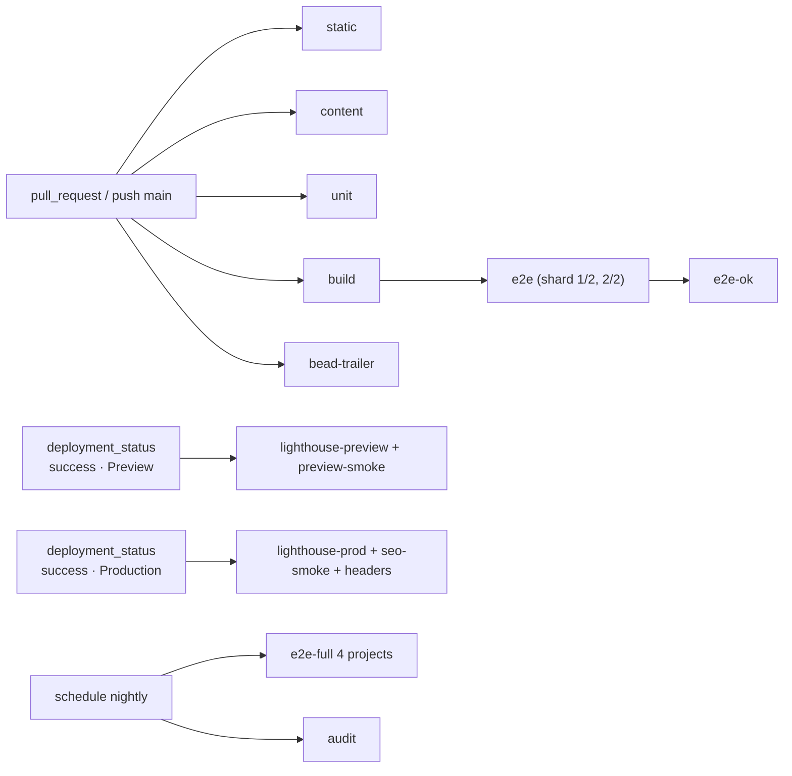

# 08 · Testing & quality gates

## Purpose

This document is the *how* behind every invariant the other plan documents declare: which check enforces it,
where that check runs (editor, `pnpm ci`, GitHub Actions, a Vercel preview, production), and what "green"
means per PR, per phase and at launch. It defines the test pyramid for this specific site — a bilingual,
heavily animated content site with one form — the CI pipeline, the local quality loop, the flake policy, the
coverage policy and the Definition of Done. It restates no contract: `INV-02.n`, `INV-03.n`, `INV-05.n`,
`INV-07.n` and `INV-11.n` are cited and mapped to named checks in §9; their meaning lives in 02/03/05/07/11.

Status: draft · seat writer-testing · 2026-08-22

## Decisions

- **D-08.1 Pyramid and gates.** Seven layers: static checks → content gates → unit (Vitest + RTL) → end-to-end
  (Playwright, per locale) → accessibility (axe + keyboard scripts inside Playwright) → performance (Lighthouse
  CI) → visual regression (Playwright screenshots). Plus security and process gates. Every invariant declared
  by the contract documents 02, 03, 05, 07 and 11 maps to one named check and one CI job (§9, INV-08.1);
  04/06/09/10's invariants are mapped as their phases land (§9 closing note). Six required checks protect
  `main` (D-08.12).
- **D-08.2 Literal-text rule, corrected configuration.** INV-02.1 is enforced with `react/jsx-no-literals`
  (eslint-plugin-react ≥ 7.37.0) configured `noStrings: true`, `ignoreProps: true`,
  `restrictedAttributes: ['alt','aria-label','aria-description','aria-roledescription','aria-valuetext','title',
  'placeholder','label']`, and an **enumerated** `allowedStrings` list. Verified 2026-08-22 against the rule's
  source: `allowedStrings` is trimmed exact-match (no patterns); `noStrings` with `ignoreProps: false` reports
  *every* plain attribute string (`className`, `href`, `type` …), so 02's phrase "`noAttributeStrings: true`
  for `alt`, `aria-label`, `title`, `placeholder`" must read `restrictedAttributes: [...]` — a one-line fix
  requested of 02 (§10). The allowlist is closed: the design's separators and symbols (`·`, `—`, `–`, `→`,
  `↗`, `←`, `⌄`, `★`, `½`, `*`, `/`, `:`, `|`, `%`, `(`, `)`, `,`, `.`, `&`), the ten single digits, and the
  design's emoji (🌿 🌱 🍎 🥦 🌾 🧸 🎨 🏡 🌟 ✋ 🍚 📚). Anything else is a lint error; a runtime twin
  (the DOM-literal unit test, §4) catches concatenated or computed literals the parser cannot see.
- **D-08.3 ESLint.** Flat config (`eslint.config.mjs`, ESLint 9; Next 16 removed `next lint`, so `pnpm lint`
  runs `eslint . --max-warnings 0`). Plugins: `@eslint/js`, `typescript-eslint` (type-aware),
  `eslint-plugin-react`, `eslint-plugin-react-hooks`, `eslint-plugin-jsx-a11y`, `@next/eslint-plugin-next`,
  `eslint-plugin-playwright` (tests/e2e), `@vitest/eslint-plugin` (tests/unit), `eslint-config-prettier`.
  Project bans are `no-restricted-imports` and `no-restricted-syntax` selectors (§2); no custom plugin.
- **D-08.4 Stylelint** (`stylelint-config-standard` + `stylelint-config-tailwindcss` for `@theme`/`@apply`/
  `@variant`) on `src/**/*.css`; `src/styles/tokens.css` is the **only** file exempt from the colour/px/ms
  bans, by an `overrides` block, because it *declares* the tokens.
- **D-08.5 Content gates are one script.** `pnpm validate:content` (`scripts/validate-content.ts`, D-02.7/
  D-02.8) with flags `--report` (writes `reports/content-coverage.md`, INV-02.6) and `--release` (fails on any
  `"TODO"` owner value, 02 §Shared config). The same checks run in the message loader so `next build` fails on
  invalid content; the script exists so the failure is readable and two minutes earlier.
- **D-08.6 Unit.** Vitest (jsdom, `@testing-library/react`, `@testing-library/jest-dom`,
  `@testing-library/user-event`). Network is mocked at the fetch layer with MSW (`msw/node`) — Turnstile
  `siteverify` and the Resend API — so the inquiry handler is tested through its real SDK path with no
  injected transport seam. Coverage (`@vitest/coverage-v8`) is reported always and gated only by glob floors
  (D-08.16).
- **D-08.7 End-to-end.** Playwright. PR projects: `chromium-desktop` (1280×800) and `webkit-mobile`
  (`devices['iPhone 14']`, 390 wide); `firefox-desktop` and `chromium-mobile` (`devices['Pixel 7']`) run on
  push to `main` and nightly. The matrix is data: locales from `src/i18n/routing.ts`, routes from
  `content/site.json` `routes[]` plus `/` and a not-found URL. E2E runs against a **local production build**
  (the `build` job's `.next` artifact + `next start`), never against the Vercel preview, so the required check
  is deterministic and independent of Vercel timing; the preview gets an advisory smoke + Lighthouse run.
- **D-08.8 Accessibility.** `@axe-core/playwright` (tags `wcag2a`, `wcag2aa`, `wcag21aa`, `wcag22aa`) per
  route × locale × interactive state, **0 violations**; keyboard scripts for nav, hamburger, lightbox, form,
  skip link. `color-contrast` gates as well, with one **allowlist** rather than a blanket exemption: each pair
  03 §10 computes as failing by the design's own values (D-03.12) gets an entry in
  `tests/e2e/axe-exceptions.json` — `{ selector, fg, bg, ratio, reason: '03 §10 / D-03.12', expires }`, where
  `expires` is the phase gate that answers OQ-03.2. A contrast violation on any pair *not* in that file fails
  the job, and so does an entry past its expiry. A new contrast regression is therefore blocked from day one
  while the known design debt is visible, enumerated and dated.
- **D-08.9 Performance.** Lighthouse CI (`@lhci/cli`) runs on the Vercel **preview URL** as an advisory PR
  check, and on the production URL after promotion as a launch/regression gate. Trigger: GitHub's native
  **`deployment_status`** event, which Vercel's Git integration emits for every deployment once 09 turns
  `deployment_status` events on (09, Vercel Git settings). No relay, no webhook receiver, no PAT: a relay
  Route Handler in this project was considered and is **rejected**, because it would be a third Function and
  06's `D-06.1` / `INV-06.7` / §6.10 allowlist ("only the proxy and `/api/inquiry`" — "a second dynamic page
  or a third function fails the gate") rejects it mechanically in the `build` gate (memo ADJ-14). The
  workflows filter on `github.event.deployment_status.state == 'success'`, read the URL from
  `github.event.deployment_status.target_url` and the commit from `github.event.deployment.sha`, and tell
  preview from production by `github.event.deployment_status.environment` (Vercel writes `Preview` /
  `Production`, possibly suffixed with the project name [assumed — confirm the exact string at setup]), with
  `github.event.deployment.ref == 'main'` as the production cross-check. Thresholds in §7 are ours (OQ-08.2).
  INP has no lab measurement: TBT ≤ 200 ms is the lab proxy; field INP comes from Speed Insights (09).
- **D-08.10 Visual regression: adopted, narrowly.** Playwright `toHaveScreenshot` on `chromium-desktop`
  only, viewports 1280 and 390 (via `test.use`), per locale, per home section and per subpage top fold,
  `maxDiffPixelRatio: 0.01`, `threshold: 0.2`, animations disabled and reduced motion emulated, fonts settled
  (`document.fonts.ready`). Baselines live in `tests/e2e/__screenshots__/` and are generated **only inside the
  Playwright Linux image** (`mcr.microsoft.com/playwright:v<version>-noble`, which ships WenQuanYi Zen Hei /
  IPA Gothic / Noto Color Emoji) — macOS renders CJK and emoji differently, so local baselines are invalid.
  **The `e2e` and `e2e-full` jobs run in that same image via `container:`** (§10): a bare GitHub runner has a
  different font set, so baselines generated in the image could never match screenshots taken on the runner.
  Gated from the phase in which 04's section components land (10); before that the suite is `@visual` and
  skipped. No Percy/Chromatic: the suite is ~60 images and the cost is not justified at launch. This snapshot
  proves *our* rendering on one Linux font stack; it says nothing about how `→ ★ ↗` fall back on a user's
  macOS or Windows machine (03 §5), so it is complemented by the manual per-OS glyph check in §12.2.
- **D-08.11 Security checks.** `scripts/ci/bundle-secrets.sh` greps the **client** output of `next build` —
  `.next/static/**/*.js` and `.next/static/**/*.map` only, never `.next/server/**` (server chunks read
  `process.env.RESEND_API_KEY` legitimately) — for `grep -rEl 'RESEND_|TURNSTILE_SECRET|re_[A-Za-z0-9]{16,}'`;
  any hit fails `build`. `scripts/ci/env-example.ts` checks `.env.example` completeness;
  `pnpm audit --prod --audit-level=high` and gitleaks run
  in an advisory `audit` job (a new advisory must not block an unrelated PR) with Renovate weekly (09 D-09.17 —
  Dependabot cannot write a commit body and so could never pass `bead-trailer`, memo ADJ-17); response
  headers and the third-party request allowlist are asserted by e2e (`@headers`, `@thirdparty`).
- **D-08.12 CI.** GitHub Actions, Node 24, pnpm (version from `packageManager`). Required checks on `main`:
  **`static`, `content`, `unit`, `build`, `e2e-ok`, `bead-trailer`** — exactly these names (09 sets branch
  protection; OQ-11.3). PR workflows receive **no secrets** (only `GITHUB_TOKEN`): Turnstile test keys and
  `INQUIRY_TRANSPORT=log` are enough (INV-08.7).
- **D-08.13 Flake policy.** `retries: 0`. A test may carry `@flaky-known(gp-<id>)` naming an **open** bead;
  only those run in the `flaky-known` project with `retries: 1`; a lint step fails the PR if the tag lacks an
  id or the bead is closed in `.beads/issues.jsonl`. A flake is fixed by synchronisation (locators, `expect`
  polling, `waitForResponse`, `document.fonts.ready`), never by timeouts: `playwright/no-wait-for-timeout`,
  `playwright/no-networkidle` and a `no-restricted-syntax` ban on `test.setTimeout`/`test.slow()` are errors.
- **D-08.14 Local loop, no git hooks.** `pnpm ci` runs the same scripts CI runs (INV-08.6). No Husky/lefthook:
  11 decided enforcement is CI, not hooks (D-11.7, TRAP-11.5 — hooks do not work in worktrees), and a
  pre-commit hook that runs Playwright is a hook people bypass. Editor: `.editorconfig`, `.vscode/settings.json`
  (format on save, ESLint + Stylelint fix on save), `.vscode/extensions.json`.
- **D-08.15 Definition of Done** is layered: per PR (§12.1), per phase gate (§12.2, the gates 10 schedules and
  11 closes), at launch (§12.3).
- **D-08.16 Coverage policy.** No global percentage. The meaningful coverage is the content gate (every key,
  every locale) and the e2e matrix (every route × locale × browser). Unit floors by glob only where code is
  pure logic: `src/i18n/**`, `src/content/**`, `src/lib/**`, `src/design/**`, `scripts/validate-content.ts`
  (the gate in §3 is only as good as its own tests) and the pure modules of `src/components/motion/**` —
  `variants.ts` and the reveal registry, both asserted in §4 — at 90 % statements / 85 % branches;
  the `src/components/motion` **components** (`MotionProvider`, `Reveal`, `CountUp`, `WordSwap`), other
  components and `src/app/**` have no floor (they are covered by RTL render tests and e2e).

## Design

### 1 · The pyramid for this site

| Layer | Tool | What it proves here | Where it runs | Gate |
|---|---|---|---|---|
| Static | `tsc --noEmit` (strict), ESLint, Stylelint, Prettier | no literal copy in JSX (INV-02.1), no locale branching (INV-02.9), i18n navigation only (INV-02.7), token discipline (INV-03.1–3, INV-05.3/6/11) | editor · `pnpm ci` · `static` | required |
| Content | `pnpm validate:content` | parity, ICU args/tags, arrays, empty/HTML, data-in-locale, Zod, ids, images, alt (INV-02.2/3/4/8), coverage report (INV-02.6) | `pnpm ci` · `content` · loader in `build` | required |
| Unit | Vitest + RTL + MSW | components render in `en` and `zh` with no DOM literal; CSS↔TS token parity (INV-03.4); variants catalogue; schemas; inquiry handler; templates; utilities | `pnpm test` · `unit` | required |
| E2E | Playwright (2 PR projects, 4 on `main`) | every route × locale (INV-02.5), switcher, slide, form (INV-07.4), reduced motion (INV-05.8), CLS, fonts, no-JS (INV-05.10), SEO, headers | `e2e` (shards) · `e2e-full` | required (`e2e-ok`) |
| A11y | axe-core + keyboard scripts | 0 WCAG 2.2 AA violations per route × locale × state; focus order/trap/return | inside `e2e` (`@a11y`) | required |
| Performance | Lighthouse CI | budgets on preview (advisory) and production (gate) | `lighthouse-preview` · `lighthouse-prod` | advisory / launch |
| Visual | Playwright screenshots | sections look like the design at 390/1280 in both locales | inside `e2e` (`@visual`) | required from 04's phase |
| Security | grep, audit, gitleaks, headers | no secret in client output (INV-07.3), env documented, deps, headers | `build` · `audit` · `e2e` | `build` required; `audit` advisory |
| Process | `bead-trailer`, TODO grep, PR template | INV-11.1/11.3, TRAP-11.9, DoD checklist | `bead-trailer` · `static` | required |

### 2 · Static checks

- **TypeScript.** `strict: true`, `noUncheckedIndexedAccess`, `noFallthroughCasesInSwitch`, `isolatedModules`.
  `pnpm typecheck` = `next typegen && tsc --noEmit` — `next typegen` emits Next's route types and next-intl's
  `.d.json.ts` message declarations (git-ignored), so a misspelt key or wrong ICU argument is a type error
  without a build (02 §Loading). Verified against next-intl's TypeScript workflow docs 2026-08-22.
- **ESLint bans** (all `error`; overrides listed; selectors illustrative):

```js
// eslint.config.mjs (excerpt)
'react/jsx-no-literals': ['error', { noStrings: true, ignoreProps: true,
  restrictedAttributes: ['alt','aria-label','aria-description','aria-roledescription','aria-valuetext',
                         'title','placeholder','label'],
  allowedStrings: ['·','—','–','→','↗','←','⌄','★','½','*','/',':','|','%','(',')',',','.','&',
                   '0','1','2','3','4','5','6','7','8','9','🌿','🌱','🍎','🥦','🌾','🧸','🎨','🏡','🌟','✋','🍚','📚'] }],
'no-restricted-imports': ['error', { paths: [
  { name: 'next/link', message: 'use Link from src/i18n/navigation (INV-02.7)' },
  { name: 'next/navigation', message: 'use src/i18n/navigation (INV-02.7)' },
  { name: 'gsap' }, { name: 'framer-motion', message: 'motion/react only (INV-05.11)' } ] }],
'no-restricted-syntax': ['error',
  { selector: "BinaryExpression[operator=/^[!=]==?$/][left.name='locale'][right.value=/^(en|zh)/], " +
              "BinaryExpression[operator=/^[!=]==?$/][right.name='locale'][left.value=/^(en|zh)/], " +
              "SwitchStatement[discriminant.name='locale']", message: 'no locale branching (INV-02.9)' },
  { selector: "JSXAttribute[name.name='className'] Literal[value=/(^|\\s)(sm|2xl|3xl|xs|max-\\w+):/]",
    message: 'only md:/lg:/xl: (INV-03.3)' },
  { selector: "JSXAttribute[name.name='className'] Literal[value=/-\\[#|\\[[0-9.]+(px|ms|rem|s)\\]|cubic-bezier/], " +
              "JSXAttribute[name.name='className'] TemplateElement[value.raw=/-\\[#|\\[[0-9.]+(px|ms|rem|s)\\]/]",
    message: 'arbitrary value — use a token (INV-03.1/2)' },
  { selector: "Property[key.name=/^(duration|delay|staggerChildren|delayChildren|repeatDelay)$/] > Literal, " +
              "Property[key.name='ease'] > ArrayExpression", message: 'motion values from tokens (INV-05.6)' },
  { selector: "Property[key.name='willChange'], JSXAttribute[name.name='style'] Literal[value=/will-change/]",
    message: 'no static will-change (INV-05.3)' },
  { selector: "CallExpression[callee.property.name='addEventListener'][arguments.0.value='scroll']",
    message: 'no scroll listeners outside src/components/motion (INV-05.9)' } ]
```

  Two further entries do not fit the excerpt's 25 lines. (a) **Inline-style colour**, the other half of
  INV-03.1 (03 §11 requires the ban in `style={}` *and* `className`): `no-restricted-syntax` selector
  `JSXAttribute[name.name='style'] Literal[value=/#[0-9a-fA-F]{3,8}\b|rgba?\(|hsla?\(|oklch\(|color-mix\(/]`
  plus the matching `TemplateElement[value.raw=…]`, so `style={{ color: '#fff' }}` and
  ``style={{ background: `rgb(${r} 0 0)` }}`` are errors. (b) **`LazyMotion strict` discipline** (D-05.5 —
  `LazyMotion features={domAnimation} strict`, all motion components `m.*` from `motion/react-m`):
  `no-restricted-imports` with `{ name: 'motion/react', importNames: ['motion', 'AnimatePresence'] }`
  — `m` from `motion/react-m` instead — overridden only for `src/components/motion/MotionProvider.tsx` (which
  imports `LazyMotion`/`domAnimation`) and `src/components/motion/WordSwap.tsx` (which needs `AnimatePresence`,
  D-05.9). Every motion path here is 04 §2's tree — `src/components/motion/**`, not `src/motion/**`, which does
  not exist (memo ADJ-15); a path that matches nothing silently disables the override it was written for.
  Overrides: `src/i18n/**` may import `next/navigation` and compare locales; `src/components/motion/**` may
  register scroll listeners (05 §5.12) and is where `ease`/`duration` literals are *defined*, so the
  motion-value ban excludes `src/design/tokens.ts` and `src/components/motion/variants.ts` (the catalogue is
  itself tested, §4);
  `src/app/api/**` and `src/lib/inquiry/server/**` are the only files allowed to read
  `process.env.RESEND_API_KEY|TURNSTILE_SECRET_KEY|INQUIRY_TO_EMAIL` (a third selector, INV-07.3). Also on:
  `@next/next/no-img-element`, `@next/next/no-html-link-for-pages`, `jsx-a11y` strict preset,
  `react-hooks` recommended, `playwright/no-wait-for-timeout`, `playwright/no-networkidle`,
  `playwright/no-force-option`, `playwright/expect-expect`.
- **Stylelint** (`src/**/*.css`): `color-no-hex`, `color-named: never`, `function-disallowed-list:
  [rgb, rgba, hsl, hsla, oklch, color-mix]` (INV-03.1); `declaration-property-value-disallowed-list` for
  `/^(transition|animation|box-shadow|border-radius|padding|margin|gap|width|height|font-size|top|left|
  right|bottom|inset)/`: `/(?<![\d.])(?!(0|1|1\.5)px\b)\d+(\.\d+)?px/`, `/\d+m?s\b/`, `/cubic-bezier/` (INV-03.2);
  `property-disallowed-list: [will-change]` (INV-05.3); `declaration-property-value-disallowed-list`
  `overflow: /hidden|clip|auto/`, `contain: paint`, `content-visibility: auto` in `src/components/**`
  (INV-05.2; `html { overflow-x: clip }` in `globals.css` is the one allowed site); `at-rule-disallowed-list:
  [keyframes]` everywhere except `src/components/motion/ambient.css` and
  `src/components/motion/view-transitions.css` (04 §2, memo ADJ-15)
  (INV-05.11), which in turn get `property-allowed-list: [transform, translate, rotate, scale, opacity,
  animation*, offset*, filter]` (INV-05.1 — `filter` is for `ink` only, reviewed). `src/styles/tokens.css`
  is exempt from the colour/px/ms rules. CSS-side breakpoints: `scripts/ci/check-tokens.ts` fails on any
  `@media` with a numeric width or any `@variant` other than `md`/`lg`/`xl` in `src/**/*.css`, and on a
  `prefers-reduced-motion` media query missing from a file that declares `@keyframes` (INV-05.8).
- **Prettier** with `prettier-plugin-tailwindcss` (class order) over `src`, `tests`, `scripts`, `content/**/*.json`
  (02 requires stable JSON formatting so diffs show copy only). `pnpm format:check` is part of `static`.
- **TODO grep** (TRAP-11.9): `git grep -nE '\b(TODO|FIXME|HACK)\b' -- 'src/**' 'tests/**' 'scripts/**'
  'content/**'` must be empty (`"TODO"` as a JSON *value* is the `--release` gate's business, D-08.5, so
  `content/**` is grepped for comments-in-disguise keys only: any key named `_comment|todo`).

### 3 · Content gates (`content` job, and the loader inside `build`)

`pnpm validate:content --report` performs, per locale, the checks 02 lists (§Loading, typing, validation):
key-set parity with `en` for messages and collections; ICU argument set and rich-tag set per key; equal
array lengths; no empty string, no `'{`, no HTML tag; no URL / `/images/` / phone / e-mail / license pattern in
`content/<locale>/**` (INV-02.4); Zod parse of `site.json` and every collection; id cross-references both
ways; every `photo`/`image` path exists under `public/` and has an `alt` in every locale; and it writes
`reports/content-coverage.md`. CI uploads the report as an artifact, appends it to the job summary, and
posts it as one sticky PR comment (`marocchino/sticky-pull-request-comment`, pinned by SHA) so an editor
sees missing `zh` keys on the PR (INV-02.6; 09 explains it to editors). Exit code is non-zero on any finding
(OQ-02.2 may later flip `zh` gaps from fail to warn — that is one flag in the script, `--warn-locale zh`).
`--release` additionally fails on any `"TODO"` value in `site.json` required owner fields; it is not in the PR
pipeline — it is the launch gate (§12.3) and runs in `lighthouse-prod`'s preflight. The validator's functions
are unit-tested against fixture trees (missing key, extra key, ICU mismatch, tag mismatch, array length,
empty string, HTML, URL in a locale file, `'{`, missing image, missing alt) so the gate itself is trusted.

### 4 · Unit tests (Vitest + RTL)

| Area | Tests | Enforces |
|---|---|---|
| Components | every section/component renders under `renderWithIntl(ui, { locale })` for each locale in `routing.locales` with `MotionProvider reducedMotion="always"`; no `⟦` marker; headings equal the JSON values; **DOM-literal test**: every non-whitespace text node and every `alt`/`aria-label`/`title`/`placeholder` equals a message value, an `Intl`-derived value (weekday/time/month/rating formats from `src/i18n/formats.ts`) or the D-08.2 allowlist | INV-02.1, INV-07.1 |
| i18n | `LOCALE_META` complete per locale; `loadMessages` deep-merge in prod, marker in dev; named formats; `getPathname`/`Link` keep path+query+hash on locale change | D-02.1/7/8/10 |
| Content | Zod schemas accept fixtures and reject each invalid shape with a readable issue; `collections.ts` joins keep `site.json` order and honour `onHome`/`onMobile`/`featured`; validator functions (§3) | INV-02.3, D-02.13 |
| Design tokens | `tokens.css` parsed (postcss) vs `src/design/tokens.ts`: every `dur.*` = `--dur-*`/1000, `ease.*` = bezier numbers, `stagger.*`, `rise.*`, `breakpoints` = rem×16 — and the reverse (every motion custom property has a TS twin; `REVEAL_THRESHOLD` exempt); parsed tokens `toMatchFileSnapshot` so any value change is an explicit diff beside the 03 edit | INV-03.4, INV-03.5 |
| Motion | `variants.ts` catalogue equals 05 §5.2 (keys ⊆ x/y/rotate/scale/opacity/filter(ink only)/transition/transformOrigin, durations/easings reference tokens); **index alternation** is a pure function of `custom`: `polaroid` even index → `x −150, rotate −10`, odd → `+150, +10`; `bubble` `tail: 'left'` → `transformOrigin '12% 100%'`, `'right'` → `'88% 100%'` (05 §5.2); Reveal registry: one pooled observer per options set, reveal-once across remounts; decorations (`Sun`…`TeacherFrame`) expose `id="deco-*"`, forwarded ref, outer/inner layers | INV-05.1/5/6/9/10 |
| Motion runtime | `MotionProvider` renders `LazyMotion features={domAnimation} strict` (D-05.5) — snapshot of the rendered provider props — and under `strict` a `motion.div` from `motion/react` throws while `m.div` from `motion/react-m` renders, so the `m`-only rule has a runtime twin beside the §2 import ban | INV-05.11 |
| Count-up / swap | `CountUp` renders the **final** value server-side, formatted with `Intl.NumberFormat(locale, { minimumFractionDigits: decimals, maximumFractionDigits: decimals })` for every locale in `routing.locales` with `decimals` from the shared config (5.0 → 1 decimal, 47 → 0; 05 §5.5) — asserted per locale, not against an English literal (INV-08.5); `WordSwap` index registry, and a day change re-keys it: the old sample line unmounts and the new one mounts once (`AnimatePresence mode="wait"`, D-05.9) | INV-05.6/10, D-02.6 |
| Inquiry | schema boundaries, normalisation (trim, NFC, control chars, CJK names), month window, honeypot, enums (07 §8); handler via `new Request()` → `POST` with MSW: happy path (`to` from env, `reply_to`, `Idempotency-Key`, tags, both bodies, subject free of user text), per-field `invalid`, decoy 200 on honeypot/too-fast with **no** Resend call and a body identical to success, `turnstile_failed`, `turnstile_unavailable` fails closed (503), Resend failure → 502, 405/415/413/403 guards incl. branch-alias origin, URL-encoded → 303, `INQUIRY_AUTOACK` on/off, CR/LF in name never reaches headers, no production bypass under any env permutation, idempotency key stable for identical payload and different after an edit; `console.info` spy: no submitted name/email/message/IP/token in any log line | INV-07.1–7 |
| Email templates | staff + auto-reply rendered per locale with next-intl's `createTranslator`; no unresolved `{`; HTML escaping of `< & "`; plain-text part present | INV-07.4 |
| Analytics wrapper | `track()` props validated against the 07 §4 allowlist (`locale, source, childAge, code, placement, to`) — a test posts a PII-shaped prop and expects a throw | INV-07.5 |
| Utilities | default menu day in `America/Los_Angeles` (fake timers), `cn`, date helpers | D-02.6 |

### 5 · End-to-end (Playwright)

Config: `tests/e2e/playwright.config.ts`; `webServer` = `pnpm start -p 3000` over the downloaded `.next`
artifact (locally `pnpm build && pnpm start`), env: `INQUIRY_TRANSPORT=log`, Cloudflare's published
always-pass test pair (07 §5) — site key `1x00000000000000000000AA`, secret
`1x0000000000000000000000000000000AA` — `INQUIRY_TO_EMAIL=inbox@example.test`,
`NEXT_PUBLIC_SITE_URL=http://localhost:3000`. `timeout: 30_000`, `expect.timeout: 5_000`, `retries: 0`,
`trace: 'retain-on-failure'`, `video: off`, `fullyParallel: true`, CI shards `2`. Tests import
`routing.locales` and `site.json` and loop; assertions use values read from `content/<locale>/**` (never
English literals, INV-08.5) or ARIA roles/test-ids.

Three properties of this rig decide what some tags can and cannot prove, so they are stated once here.
**(a) The `⟦` marker is dev-only.** `pnpm start` serves the production loader, where a missing `zh` key
deep-merges to the `en` value and renders English (02 §Loading, D-02.8) — it never emits `⟦namespace.key⟧`.
The `@smoke` marker assertion is therefore a check that no key is missing from **`en` as well**; `zh` gaps are
caught earlier and better by `validate:content` key parity in the `content` job (INV-02.2), which is the
required check for that property. We do not add a dev-mode smoke run: it would duplicate a stronger gate.
**(b) Three tags are Chromium-only, for three different reasons.** The `LayoutShift` interface — and therefore
`PerformanceObserver('layout-shift')` — exists only in Chromium, so a `@perf` run in `webkit-mobile` would
observe nothing at all and report a pass; `@motion-vt` asserts the *typed* View-Transition behaviour 05 §5.7
specifies, whose support 05 states for Chromium; `@visual` is chromium-only by D-08.10's own scope decision.
All three are pinned to `chromium-desktop`, which covers both viewports by `test.use` (1280×800 and 390×844 —
the 390 measurement 03 §3.3 asks for thus runs on every PR, without moving `chromium-mobile` off `main` and
without spending OQ-08.3's budget). The other projects carry
`grepInvert: /@perf|@visual|@motion-vt|@motion-obs/` — the last of those for the different reason in note (c) —
so a silently-observing no-op can never be mistaken for a pass. The instant-swap fallback path carries its own
tag, `@nav-instant` — deliberately not a `@motion-vt` substring — precisely so it *does* run in every project.
**(c) `@motion-obs`'s expected value is viewport-dependent, so it runs at 1280 only.** 04 §3.3 and 05 §5.4 both
mount `AmbientScope` on `HeroSection` **and, at 390, additionally on `PhilosophySection`**. The "exactly two
observers" INV-05.9 states is therefore derivable only at 1280 — the frozen reveal pool plus the hero's
ambient `useInView`. At 390 the count is two only if Motion pools the two identical ambient options sets into
one observer, and three if it does not; 05 states pooling for the reveal options set but says nothing about
two ambient scopes, and a gate whose expected value is unverified is not a gate. So `@motion-obs` is pinned to
`chromium-desktop` and, inside it, to the 1280 viewport by `test.use`. Little is lost: the pause/resume half
of the tag is engine-independent CSS (`animation-play-state`). Extending the count assertion to 390 needs one
sentence from 05 first — whether the hero and philosophy ambient scopes share one pooled observer — and then
the row below states three rather than two.

| Tag | Suite (per locale unless noted) | Asserts |
|---|---|---|
| `@smoke` | every route (`/`, `routes[].path` — six detail pages at launch, plus the optional `faq` when OQ-02.7 adds it; `visit`) × locale; not-found URL | 200 (404 for not-found, localized `errors.notFound`); `<html lang>` = `LOCALE_META.htmlLang`; no `⟦` (scope: note (a) above); `hreflang` set = locales + `x-default`→`en`; canonical = self; no `Link` header with `hreflang` (D-02.9) |
| `@i18n` | switcher from `/en/programs?x=1#sectionId`; root `/` with and without `Accept-Language: zh-CN` | URL `/zh/programs?x=1#sectionId`, `scrollY` unchanged, `NEXT_LOCALE` cookie, `lang` updated; **cascade**: every `[data-reveal]` in the new tree plays `swap` — opacity 0→1 with `min(index × 14 ms, 300 ms)` delays read from `data-reveal-index` (D-05.9; `[data-wordswap]` does not exist — `WordSwap` is only the menu sample line, checked in `@motion`); under reduced motion the cascade **still plays**, opacity-only with the `y` track dropped and the 14 ms delays kept, and only the root View-Transition crossfade is instant (05 §5.9) — a no-cascade instant swap fails; root redirects to `/zh` / `/en` (D-02.9) |
| `@seo` | `sitemap.xml`, `robots.txt`, `/api/inquiry` | sitemap = every route × locale with alternates, no `/api/`; robots `Disallow: /api/`; `GET /api/inquiry` → 405 |
| `@form` | fill → submit → success panel (focus on its heading); blank required → inline errors, `aria-invalid`, focus on first invalid; `page.route` forces 502 → `emailFailed` banner; forces 429 → `rateLimited`; forces `turnstile_failed` → its banner; honeypot filled → success panel (no-send proven in unit); pending state `aria-busy`, never `disabled`; 390 px: full-width submit, controls ≥ 44 px; keyboard-only completion. A *real* Turnstile rejection needs a different server env, so it is unit-only by design (MSW against `siteverify`, §4); Cloudflare's always-fail pair — site key `2x00000000000000000000AB`, secret `2x0000000000000000000000000000000AA` — is wired into a `workflow_dispatch` variant of `e2e` that boots a second `next start`, kept out of the PR matrix for the runner budget (OQ-08.3) | INV-07.4, D-07.4 |
| `@nojs` | `javaScriptEnabled: false` project on `/` and the form | all section text visible (no opacity 0), count-up final values, `<noscript>` fallback visible, native validation, switcher anchor `href` = other-locale path | INV-05.10, D-07.5 |
| `@motion` | reduced-motion parity (`reducedMotion: 'reduce'` vs default, settle, compare text + computed `transform: none`, `animationName: none` on loops, count-up final); reveal-once (scroll away/back; subpage and back by **typed Back** — the in-page "← Back" control — *and* by **browser Back**, `page.goBack()`, which is a different history path, 05 §5.14); stagger 110 ms (read `transition-delay`/Motion timings via `data-reveal-index`) **and its alternation**: gallery polaroids alternate sign by index (even → negative `x`/`rotate`, odd → positive) and review bubbles take `transform-origin` from tail side (`12% 100%` left, `88% 100%` right), both read from computed style at the first animation frame; `WordSwap` on day change (click another day chip → the old sample line leaves before the new one enters, `mode="wait"`, `--dur-word-swap`; opacity-only under reduced motion); computed-style scan: no transform on nav/section shells/ancestors of fixed/sticky, no `overflow` clip on stagger ancestors, `will-change: auto` at rest | INV-05.2/3/4/7/8, D-05.6/9 |
| `@motion-obs` (chromium-desktop, 1280 only — note (c)) | init script replaces `window.IntersectionObserver` with a counting proxy before any bundle runs; after loading `/` and scrolling the whole page, **exactly two** observers were constructed (the frozen reveal pool + the hero's ambient-pause `useInView`, INV-05.9) and a third fails — at 1280 the hero is the only `AmbientScope` 04 §3.3 mounts, which is what makes two the right number; scroll the hero out of view → its section carries `data-ambient="paused"` and every `.loop` inside computes `animation-play-state: paused`; scroll back → `running` | INV-05.9 |
| `@hover` | pointer gating (D-05.12, 05 §5.10). In the `webkit-mobile` project, `matchMedia('(hover: none) and (pointer: coarse)').matches` is the precondition, then `hover` on every button, nav link, polaroid and card leaves computed `transform`, `translate`, `scale` and `box-shadow` unchanged. In `chromium-desktop` with `reducedMotion: 'reduce'`, the same hovers change only colour/shadow — computed `transform` stays `none` on the inner layer (05 §5.10). If OQ-08.3 moves `webkit-mobile` to `main`-only, the touch half moves with it and the reduced-motion half still runs on every PR | D-05.12 |
| `@motion-vt` (chromium) | init-script spies `document.startViewTransition`; "learn more →" → URL change with type `subpage-enter`, scroll top, `h1` focused; "← Back" → `/en#<homeAnchor>` via replace (history length unchanged), type `subpage-exit`, section heading focused; reduced motion / untyped nav → no typed transition. **Values** (05 §5.7, the numbers 05 fixes): during the transition, `document.getAnimations()` contains `gp-slide-in`/`gp-slide-out` on the `.gp-page` view-transition pseudo-elements with `getTiming().duration === 500`, `easing` equal to the resolved `--ease-soft` bezier, and a keyframe `translate: 103% 0`; the root groups are `animation: none` | D-05.10, OQ-05.2 |
| `@nav-instant` (every project) | the unsupported-browser path 05 §5.7 requires, which a chromium-only suite cannot reach: an init script deletes `document.startViewTransition` before any bundle runs, then "learn more →" and "← Back" are exercised — URL, scroll-to-top, hash landing and `h1` / section-heading focus all still correct, `document.getAnimations()` holds no `::view-transition` animation, and nothing is left mid-slide. Deliberately **not** tagged `@motion-vt`, so the `grepInvert` above does not exclude it: in `firefox-desktop` and `webkit-mobile` the deletion is a no-op and the same assertions then cover engines that genuinely lack the API | D-05.10, 05 §5.7 |
| `@perf` (chromium-desktop, both viewports) | `PerformanceObserver('layout-shift')` buffered during load + reveals + count-up + loops + locale toggle → CLS ≤ **0.02** per phase, at 1280×800 **and** 390×844 via `test.use` (03 §3.3 asks for 390; the LayoutShift API is Chromium-only, note (b) above, so this tag never runs in `webkit-mobile` where it would observe nothing); LCP element (hero image) has computed `opacity: 1` in SSR HTML; **no** request matching `fonts.gstatic\|_next/static/media/.*\.woff2` during the toggle; section-height snapshot: nav height and each `section[id]` height at 390 and 1280 in `en` vs `zh` written to `reports/section-heights.json` and compared to the committed baseline — a delta > one line-height of that section fails (04 adds `min-height`, 03 §3.3) | INV-05.7, 03 §3.3 |
| `@thirdparty` | all request hosts on `/` ∈ {self, `challenges.cloudflare.com`, `va.vercel-scripts.com`, `vitals.vercel-insights.com`} [last two appear only on Vercel — assumed] | INV-07.8 |
| `@headers` | response headers on `/en` equal the set 06/09 declare (`x-content-type-options`, `referrer-policy`, `permissions-policy`, CSP incl. Turnstile hosts, HSTS on Vercel) | 06/09 |
| `@a11y` | §6 | |
| `@visual` | §8 | |
| `@flaky-known(gp-…)` | quarantine project, `retries: 1` | D-08.13 |

### 6 · Accessibility

axe (`AxeBuilder().withTags([...])`) runs on: every route × locale (idle); `/` with hamburger open (390),
lightbox open, menu day switched; the form idle / error / success; 404. Rules: all WCAG 2.2 AA; 0 violations.
`color-contrast` is **not** blanket-disabled (D-08.8): each violation is matched against
`tests/e2e/axe-exceptions.json`, whose only entries at launch are the pairs 03 §10 already computes as failing
(each with `selector`, the two hex values, the computed ratio, `reason: '03 §10 / D-03.12'` and an `expires`
phase gate). A matched violation is reported into the job summary; an **unmatched** one fails the job, so a
contrast regression introduced by new markup or a token edit is blocked on the PR that introduces it. Entries
leave the file as OQ-03.2's replacements land, and an entry past its `expires` gate fails the job as well. No
other per-rule disables — any further exception needs a bead and its own entry with an expiry. Keyboard
scripts: skip link is first `Tab` and lands on `main`; nav order matches the visual order; hamburger: `Tab`
cycles inside, `Esc` closes and returns focus to the trigger; lightbox: arrows, `Esc`, focus trapped and
returned; form: `Tab` through all controls, `Enter` submits, error focus management (D-07.4); the
`:focus-visible` ring has a computed `outline-width` of `3px` (D-03.11). Colour-scheme and zoom: 200 % zoom
at 1280 shows no horizontal scroll (INV-05.2's `overflow-x: clip` on `html`).

### 7 · Performance budgets (Lighthouse CI)

`lighthouserc.cjs`: `collect.url` from the event payload (`github.event.deployment_status.target_url`,
D-08.9), mobile preset (LHCI's
simulated throttling), `numberOfRuns: 3`, `aggregationMethod: median`; preview run = `/en`, `/zh`,
`/zh/programs` (CJK-heavy); production run = every route × locale, mobile **and** desktop presets.
Assertions (`error` unless noted; our numbers — OQ-08.2): `categories:performance ≥ 0.90`,
`categories:accessibility = 1`, `categories:best-practices ≥ 0.95`, `categories:seo = 1`;
`largest-contentful-paint ≤ 2500`, `cumulative-layout-shift ≤ 0.05` — this is Lighthouse's whole-page,
cold-load, mobile-emulated CLS and is deliberately looser than the animation budget; the 0.02 that 03 §3 fixes
for reveals, count-up, loops and the locale toggle is asserted separately and per phase by §5 `@perf`, and
neither number relaxes the other. `total-blocking-time ≤ 200` (INP proxy), `speed-index ≤ 3400` (warn).
`resource-summary:*:size` assertions take **`maxNumericValue` in bytes** (only a `budgetsFile` is written in
KiB) [verified: LHCI assertion docs, 2026-08-22], so they read `resource-summary:script:size ≤ 184320`
(180 KiB transfer, home), `resource-summary:image:size ≤ 512000` (500 KiB, mobile home),
`resource-summary:font:size ≤ 122880` (120 KiB — Fredoka 2 + Nunito 3 latin subsets),
`resource-summary:third-party:count ≤ 3`; `unsized-images`,
`modern-image-formats`, `uses-responsive-images`, `offscreen-images` error; `third-party-summary` warn.
Image policy is lint + Lighthouse: `@next/next/no-img-element`, `next/image` with `width/height` from
`site.json`, hero `priority`, everything else lazy. Upload target `filesystem` → artifact + job summary (no
`temporary-public-storage`: reports would be public). Bundle weight is measured where it is real — the
preview's transfer sizes — not re-implemented locally; `build` prints Next's route summary into the job
summary for eyeballing. Field vitals (INP, p75) are read in Speed Insights after launch (09; OQ-01.1).

### 8 · Visual regression

`tests/e2e/visual.spec.ts` (`@visual`, chromium-desktop only, D-08.10): for each locale and each viewport
(1280×800, 390×844 via `test.use`), `/` scrolled section by section (`section[id]` → `toHaveScreenshot`,
`animations: 'disabled'`, reduced motion on, `mask` for the count-up and the menu's "today" chip, wait
`document.fonts.ready`), the top fold of each detail page in `site.json.routes[]` (six at launch; a seventh
if OQ-02.7 adds `faq`), the hamburger sheet (390), the lightbox, the form
success panel. ≈ 2 × 2 × (8 + 6 + 3) = 68 images. The `e2e` job runs inside
`mcr.microsoft.com/playwright:v<version>-noble` (§10), the same image `pnpm test:e2e:update` uses, so the
screenshots under comparison and the baselines share one font set. Baselines are regenerated only with
`pnpm test:e2e:update` (runs the same command inside the Playwright image with the repo mounted) in a PR that
names the design change or OQ answer that justifies it (INV-08.8); a baseline diff in an unrelated PR is a
regression, not a "flake". Placeholder photos are stable assets in `public/`; when real photography lands the
baselines are regenerated once.

**Per-OS glyph check (manual, named).** The automated baseline pins one Linux font stack, which is exactly the
stack no visitor has. 03 §5 accepts that `→` `↗` `←` `★` fall out of the `latin` subset and render from the
next face in the stack, differing per OS. That is not machine-checkable on GitHub's runners, so it is a
**named manual check, `MC-08.1 per-OS glyph render`**, run at the phase gate that ships the sections and again
at launch: open `/en` and `/zh` at 390 and 1280 on **macOS** (Safari + Chrome) and **Windows 11** (Edge +
Chrome) and confirm, in the "learn more →" links, the hero CTA, the Yelp button and the star rows, that
`→ ★ ↗` render as glyphs (no tofu, no emoji-style colour substitution) and sit on the text baseline at the
same size. Owner: the 04 implementer, with the design owner; evidence is four screenshots attached to the
phase-gate bead (11 W-11.6). It is a §12.2 gate item, not a CI job — no runner can produce it.

### 9 · Invariant → check → job mapping

| INV | Check (named) | Job | Mode |
|---|---|---|---|
| INV-02.1 | `react/jsx-no-literals` (D-08.2) · DOM-literal unit test | `static` · `unit` | CI |
| INV-02.2 | `validate:content` parity/ICU/tags/arrays | `content` | CI |
| INV-02.3 | `validate:content` Zod + ids + images + alt · loader in `next build` · schema unit tests | `content` · `build` · `unit` | CI |
| INV-02.4 | `validate:content` data-pattern scan | `content` | CI |
| INV-02.5 | `@smoke` route × locale | `e2e` | CI |
| INV-02.6 | `validate:content --report` → artifact + sticky comment | `content` | CI |
| INV-02.7 | `no-restricted-imports` next/link, next/navigation · `@i18n` switcher/URL tests | `static` · `e2e` | CI |
| INV-02.8 | `validate:content` empty/HTML | `content` | CI |
| INV-02.9 | `no-restricted-syntax` locale comparisons/switch | `static` | CI |
| INV-03.1 | Stylelint `color-no-hex` + function list · ESLint hex/rgb regex on `className` **and** on `style={}` (both selectors, §2) | `static` | CI |
| INV-03.2 | Stylelint px/ms/bezier disallowed values · ESLint arbitrary-value regex | `static` | CI |
| INV-03.3 | ESLint breakpoint-variant regex · `check-tokens.ts` CSS `@media`/`@variant` scan | `static` | CI |
| INV-03.4 | tokens parity test (both directions) | `unit` | CI |
| INV-03.5 | tokens file-snapshot test · PR template "03 updated" box | `unit` · process | both |
| INV-05.1 | Stylelint `property-allowed-list` on keyframe files · variants catalogue test | `static` · `unit` | CI |
| INV-05.2 | Stylelint overflow/contain/content-visibility ban · `@motion` computed-style scan | `static` · `e2e` | CI |
| INV-05.3 | Stylelint `will-change` ban · ESLint `willChange` ban · `@motion` rest scan | `static` · `e2e` | CI |
| INV-05.4 | `@motion` computed-style scan (nav, shells, fixed/sticky containers) | `e2e` | CI |
| INV-05.5 | decoration component tests (id, ref, two layers) · `@smoke` unique `deco-*` ids | `unit` · `e2e` | CI |
| INV-05.6 | ESLint motion-literal ban · Stylelint duration/easing values · catalogue test | `static` · `unit` | CI |
| INV-05.7 | `@perf` CLS ≤ 0.02 phases · LCP opacity · Lighthouse CLS ≤ 0.05 | `e2e` · `lighthouse-*` | CI / advisory |
| INV-05.8 | `@motion` reduced-motion parity · `@hover` colour-only hover under reduced motion · `@i18n` opacity-only cascade (not instant) · `check-tokens.ts` reduced-motion media presence | `e2e` · `static` | CI |
| INV-05.9 | Reveal registry unit test · `@motion-obs` observer count = 2 at 1280 (§5 note (c)) and ambient loops paused off-screen · ESLint scroll-listener ban | `unit` · `e2e` · `static` | CI |
| INV-05.10 | `@nojs` project | `e2e` | CI |
| INV-05.11 | `no-restricted-imports` gsap/framer-motion **and** `motion` from `motion/react` (`m`-only, §2) · `LazyMotion strict` provider unit test · Stylelint keyframes file list · `scripts/ci/deps-allowlist.sh` | `static` · `unit` | CI |
| D-05.12 (no INV in 05; 05 §5.14 requires the check) | `@hover` pointer gating: no hover transform under `(hover: none)` | `e2e` | CI |
| 03 §5 glyph fallback (no INV; 03 defers to 08) | `MC-08.1 per-OS glyph render` — manual, §8 · Linux baselines by `@visual` | phase gate · `e2e` | manual + CI |
| INV-07.1 | `react/jsx-no-literals` on form · DOM-literal test · template tests · handler response-shape test | `static` · `unit` | CI |
| INV-07.2 | handler tests bypassing the client | `unit` | CI |
| INV-07.3 | `bundle-secrets.sh` · `env-example.ts` · ESLint `process.env` secret-name selector · gitleaks | `build` · `static` · `audit` | CI / advisory |
| INV-07.4 | `@form` per locale · template tests per locale · parity of `visit`/`email` namespaces | `e2e` · `unit` · `content` | CI |
| INV-07.5 | handler log spy · analytics wrapper test | `unit` | CI |
| INV-07.6 | handler decoy/turnstile/fail-closed/no-bypass tests · `@form` honeypot | `unit` · `e2e` | CI |
| INV-07.7 | idempotency-key tests (MSW asserts header) | `unit` | CI |
| INV-07.8 | `@thirdparty` host allowlist · Lighthouse `third-party-summary` | `e2e` · `lighthouse-*` | CI / advisory |
| INV-11.1 | `bead-trailer` gate (11 §6, items 1–3) | `bead-trailer` | CI |
| INV-11.2 | `bead-trailer` item 2 (commit ↔ committed projection agree) · W-11.10 review | `bead-trailer` · process | both |
| INV-11.3 | `bead-trailer` item 2 (assignee ∉ ORCH_WORD) · PR template names verifier ≠ implementer | `bead-trailer` · process | both |
| INV-11.4 | process only (seats never run `bd`); no CI surface | — | process |
| INV-11.5 | branch protection: no force-push, admins included, required checks (09) | settings | process |

38 invariants from the five contract documents (02, 03, 05, 07, 11): 34 fully mechanical,
3 mechanical-plus-process (INV-03.5, INV-11.2, INV-11.3), 1 process-only (INV-11.4). Two rows — `D-05.12` and
`03 §5 glyph fallback` — are keyed on a decision rather than an invariant, because 05 §5.14 and 03 §5 each
require a check their own document declares no `INV-*` for; the table is a coverage list, so they belong here.

**Scope, stated honestly.** The wave-2 documents declare 32 further invariants — `INV-04.1…10`, `INV-06.1…9`,
`INV-09.1…6`, `INV-10.1…7` — and they are **not** mapped above. Several are in fact already enforced by
checks on this page (INV-04.7's 44 px hit areas by `@form` and `@a11y`; INV-06.4's sitemap completeness by
`@seo`; INV-09.x by `@headers`), they simply have no row yet. Each is mapped in the phase that first
implements it, as a §12.2 gate item; INV-08.1 is scoped to the five contract documents until then, and
adding an invariant to any of those five adds a row here in the same PR.

### 10 · CI pipeline (GitHub Actions)



| Job | Trigger | Needs | Steps (abridged) | Timeout | Artifacts | Required |
|---|---|---|---|---|---|---|
| `static` | PR, push `main` | — | checkout · `pnpm/action-setup` → `setup-node` (cache) · `typecheck` · `lint` · `lint:css` · `format:check` · `check:tokens` · `check:todo` · `check:env` · flaky-tag lint · deps allowlist | 10 min | — | yes |
| `content` | PR, push | — | `validate:content --report` · summary · sticky comment · upload report | 5 min | `content-coverage.md` | yes |
| `unit` | PR, push | — | `vitest run --coverage` · summary | 10 min | `coverage/` | yes |
| `build` | PR, push | — | restore `.next/cache` · `next build` · route summary · `bundle-secrets.sh` · upload `.next` (minus cache) | 15 min | `next-build` | yes |
| `e2e` | PR, push | `build` | **`container: mcr.microsoft.com/playwright:v<version>-noble`** — browsers and their OS deps ship in the image, so no `install-deps` and no browser cache, and the fonts match the `@visual` baselines exactly (D-08.10); on a bare runner the font set differs and every CJK/emoji screenshot would diff forever · download `next-build` · `pnpm/action-setup` + `setup-node` · `playwright test --shard` (PR: 2 projects; push `main`: same) | 25 min | `playwright-report/`, traces, `section-heights.json`, screenshot diffs | via `e2e-ok` |
| `e2e-ok` | — | `e2e` | `if: always()` — fails unless every shard succeeded (single name for branch protection) | 2 min | — | **yes** |
| `bead-trailer` | PR (opened, synchronize, reopened, edited) | — | `scripts/ci/bead-trailer.sh origin/$base $head` with `PR_BODY`, `jq` (11 §6) | 5 min | — | yes |
| `lighthouse-preview` | `deployment_status` (state `success`, preview environment) | — | `lhci autorun --collect.url=$URL/en …` · `@smoke` + `@form` subset against `$URL` (with `x-vercel-protection-bypass` — previews are protected, 09 D-09.4) · check-run on `github.event.deployment.sha` via `actions/github-script` · summary | 15 min | `lhci/` | advisory |
| `lighthouse-prod` | `deployment_status` (state `success`, production environment) · `workflow_dispatch` | — | `validate:content --release` · full LHCI matrix · `seo-smoke.ts` (sitemap/hreflang/robots on the real domain) · `@headers` | 40 min | `lhci/` | launch gate (§12.3) |
| `e2e-full` | push `main` · nightly `schedule` · `workflow_dispatch` | `build` | same `container:` as `e2e`; all 4 projects, `retries: 0`; failure opens a bead via the orchestrator (no auto-issue) | 40 min | report | advisory |
| `audit` | PR · weekly `schedule` | — | `pnpm audit --prod --audit-level=high` · `gitleaks` (PR diff) [gitleaks-action licence for orgs — assumed free for a personal repo] | 10 min | — | advisory |

Conventions: `concurrency: { group: ci-${{ github.ref }}, cancel-in-progress: true }` on PR workflows;
`permissions: contents: read` by default, `pull-requests: write` only on `content`, `checks: write` only on
`lighthouse-preview`; `actions/*` pinned to a major, third-party actions pinned to a commit SHA;
`pnpm install --frozen-lockfile`. Every job is `runs-on: ubuntu-latest` (the `e2e` jobs additionally declare
the `container:` above). Setup order is fixed: **`pnpm/action-setup` first, then `actions/setup-node`** —
`setup-node`'s `cache: pnpm` resolves the store by shelling out to `pnpm store path`, so it fails outright if
pnpm is not on `PATH` yet [verified: `actions/setup-node` caching docs, 2026-08-22]. `pnpm/action-setup` takes
its version from `packageManager`; `setup-node` takes Node from `.nvmrc` = `24`. Caching: pnpm
store (`setup-node` `cache: pnpm`), Next (`.next/cache` keyed on lockfile + hash of `src/** content/**
public/**`, restore-keys on the lockfile). No Playwright browser cache: the image carries them, and its tag
is bumped with `@playwright/test` in the same Renovate PR (a mismatch between image and package is a
`playwright test` startup error, not a silent skew). Estimated wall time per PR ≈ 12–15 min, ≈ 30
runner-minutes (OQ-08.3). `deployment_status` workflows, like `repository_dispatch` ones, exist only on the
default branch and run on the default branch's SHA [verified: GitHub Actions "Events that trigger workflows",
2026-08-22]: they attach to the PR by creating a check run on `github.event.deployment.sha`;
until that workflow is on `main` (10 schedules it with the scaffold PR) the preview run is manual. Nothing
else has to be deployed first — D-08.9 has no relay to stand up. Flake policy is
D-08.13; **a failing required check is never re-run to green** — the PR gets the fix or a `@flaky-known`
bead. `e2e` retries at the *job* level are disabled (`fail-fast: false`, no `re-run` culture; the orchestrator
may re-run once only for an infrastructure failure — runner lost, cache 5xx — and says so on the PR).

### 11 · Local development loop

| Script | Runs | Notes |
|---|---|---|
| `pnpm dev` / `build` / `start` | Next | `.env.local` from `.env.example` (07 §5); `INQUIRY_TRANSPORT=log` prints emails |
| `pnpm typecheck` | `next typegen && tsc --noEmit` | §2 |
| `pnpm lint` / `lint:css` / `format` / `format:check` | ESLint · Stylelint · Prettier | `lint:fix` variants exist |
| `pnpm validate:content [--report] [--release]` | `tsx scripts/validate-content.ts` | §3 |
| `pnpm check:tokens` | `tsx scripts/ci/check-tokens.ts` + `vitest run tests/unit/design` | CSS scans + parity/snapshot |
| `pnpm check:secrets` / `check:env` / `check:todo` | `scripts/ci/bundle-secrets.sh` (needs a build) · `env-example.ts` · `todo-grep.sh` | |
| `pnpm test` / `test:watch` / `test:coverage` | Vitest | |
| `pnpm test:e2e [--project …] [--grep @tag]` / `test:e2e:ui` | Playwright, host-native, with `--grep-invert @visual` baked in | `--grep @smoke` is the 2-minute local check. `@visual` is excluded because a macOS host cannot reproduce the container's fonts (D-08.10) — this is the one intended gap in INV-08.6, and `pnpm test:e2e:docker` closes it |
| `pnpm test:e2e:docker` / `test:e2e:update` | the same `playwright test` inside `mcr.microsoft.com/playwright:v<version>-noble` with the repo mounted; `:update` adds `--grep @visual --update-snapshots` | D-08.10; Docker required. `:docker` is what to run before touching anything the baselines cover |
| `pnpm ci` | `typecheck && lint && lint:css && format:check && check:tokens && check:todo && check:env && validate:content --report && test && build && check:secrets` | what `static`+`content`+`unit`+`build` run; `pnpm ci:e2e` adds `test:e2e` |
| `pnpm lhci` | `lhci autorun --collect.url=http://localhost:3000/en` | local sanity only; numbers differ from the preview |

Hooks: none (D-08.14). Habit, written in `00-README.md`/CONTRIBUTING: run `pnpm ci` before pushing; run
`pnpm test:e2e --grep @smoke` before requesting review. Editor: `.editorconfig` (LF, 2 spaces, final
newline, UTF-8), `.vscode/settings.json` (`editor.formatOnSave`, `eslint.useFlatConfig`, ESLint/Stylelint
`fixAll` on save, Tailwind IntelliSense pointed at `src/app/globals.css`, `files.associations` for
`content/**/*.json`), `.vscode/extensions.json` (ESLint, Stylelint, Prettier, Tailwind CSS, Playwright,
Vitest). `.nvmrc` = `24`; `engines.node = "24.x"`; `packageManager = "pnpm@<pinned>"`.

### 12 · Definition of Done

**12.1 Per PR** (all mechanical unless marked ☐ = PR-template checkbox, verified by the verifier seat, W-11.11):
the six required checks green; no new `@flaky-known` without an open bead; coverage report shows no missing
key in any locale (or OQ-02.2 has been answered); ☐ visual change → Playwright diff images attached and the
design file/line cited; ☐ token change → 03 edited in the same PR (INV-03.5); ☐ new/changed INV in
02/03/05/07/11, or in a wave-2 document already mapped → row in §9 (INV-08.1);
☐ new env var → `.env.example` + 07 §5/09; ☐ PR body ends with the single `Bead:` trailer (11 §5);
☐ implementer and verifier named and different (INV-11.3). `.github/PULL_REQUEST_TEMPLATE.md` carries the
boxes and ends with the `Bead:` placeholder paragraph.

**12.2 Per phase gate** (10 schedules, 11 W-11.6 closes): every bead of the phase has a verifier report;
`e2e-full` green on `main` (4 projects); `@a11y` 0 violations across the matrix; `lighthouse-preview` meets
§7 on the phase's last preview; `@visual` baselines current (from 04's phase); content coverage 100 % in
both locales for the namespaces the phase shipped; no open `@flaky-known` older than one phase; **`MC-08.1`
per-OS glyph render run and its four screenshots attached to the phase-gate bead** (§8 — macOS Safari/Chrome
and Windows 11 Edge/Chrome, `/en` and `/zh` at 390 and 1280, `→ ★ ↗` present and baseline-aligned; owner: the
04 implementer with the design owner) — from the phase that ships the sections onward, because 03 §5 hands
this glyph question to 08 and no runner can answer it; **every invariant the phase's documents declare has a
§9 row** (the wave-2 backlog named in §9's scope note — INV-04.*, INV-06.*, INV-09.*, INV-10.* — is drained
this way rather than in one sweep); any `axe-exceptions.json` entry whose `expires` is this gate is either
removed or re-dated with the design owner (§6, OQ-03.2).

**12.3 Launch checklist** (the `lighthouse-prod` workflow runs the mechanical part; 09 owns the operational
items): `pnpm validate:content --release` passes (no `"TODO"` owner value); LHCI on the production domain,
every route × locale, mobile + desktop, meets §7; `@a11y` matrix against production = 0; `@headers`,
`seo-smoke.ts` (sitemap, `hreflang`, canonical, robots, 404 per locale) on the real domain; **one manual
real-key Turnstile submission in production** reaches the inbox (07 §5 — previews use test keys), then
`INQUIRY_TO_EMAIL` production scope is confirmed; **`MC-08.1` re-run against the production domain** (§8 —
the glyph fallback is the one rendering question no runner answers); WAF rule live (09); branch protection
shows exactly the six
required checks, squash-only, "PR title and description" (OQ-11.3); `e2e-full` green on the release SHA;
Renovate enabled (09 D-09.17); Speed Insights receiving data (INP read in the first week).

### 13 · Invariants

- **INV-08.1 Complete mapping of the contract documents.** Every `INV-*` declared by 02, 03, 05, 07 and 11 has
  a row in §9 naming a check and a job, and a PR that adds or changes one of those invariants changes §9 in
  the same PR. The 32 wave-2 invariants (04, 06, 09, 10) are outside this invariant today and are mapped at
  the phase gate that implements them (§9 scope note, §12.2); once a wave-2 document's invariants are mapped,
  the same same-PR rule applies to them. Scoping it this way keeps the invariant true as written — the earlier
  unrestricted wording was false on the day it was written, and an invariant nobody can satisfy gates nothing.
- **INV-08.2 Exactly six required checks** on `main` — `static`, `content`, `unit`, `build`, `e2e-ok`,
  `bead-trailer`; nothing merges with one red; admins are not exempt; only the human may change the set
  (09, INV-11.5).
- **INV-08.3 No retries by default.** `retries: 0`; the only retried tests carry `@flaky-known(gp-<id>)` with
  an open bead; raising timeouts, `waitForTimeout`, `networkidle` and `force` are lint errors.
- **INV-08.4 Matrix is data.** E2E, a11y, visual and Lighthouse loops read `routing.locales` and
  `site.json.routes[]`; no test hard-codes `['en', 'zh']` or a route list; adding a locale (02 checklist)
  extends every matrix with no test change.
- **INV-08.5 Tests carry no copy.** Assertions compare against values loaded from `content/<locale>/**` or
  use roles/test-ids; a translator's edit never breaks a test and a test never documents English.
- **INV-08.6 One command set.** `pnpm ci` runs the same scripts, versions and flags as CI (`--frozen-lockfile`,
  `packageManager` pin, `.nvmrc`); a check that exists only in CI, or only locally, is a bug. One named
  exception: `@visual` is font-dependent and runs in the Playwright container both in CI and locally
  (`pnpm test:e2e:docker`), so the host-native `pnpm test:e2e` excludes it rather than fail it (§11, D-08.10).
- **INV-08.7 No secrets in PR CI.** PR workflows use only `GITHUB_TOKEN`, Cloudflare's published test keys
  and `INQUIRY_TRANSPORT=log`; no real key is ever a repository secret for PR runs; artifacts contain no env.
- **INV-08.8 Baselines and thresholds move with a reason.** Screenshot baselines, section-height baselines,
  the tokens snapshot and Lighthouse thresholds change only in a PR that names the design change, OQ answer
  or calibration run that justifies it — never in the PR that happened to break them.

## Open questions

- **OQ-08.1** · answerer: 04 implementer with the design owner, at the first sections PR — Visual regression
  tolerance (`maxDiffPixelRatio 0.01`, `threshold 0.2`) and chromium-only scope: accept, or widen to webkit
  (iOS-heavy audience) at ~2× CI time?
- **OQ-08.2** · answerer: human (Hanyi) with 09, calibrated at the first preview with real photography —
  Lighthouse thresholds and resource budgets in §7 are plan values; confirm or reset after the calibration run.
- **OQ-08.3** · answerer: human (Hanyi) — CI minutes: is the repo private (2,000 free GitHub minutes/month)
  and is ≈ 30 runner-minutes per PR (≈ 1,000–1,500/month during the build) acceptable, or should `webkit-mobile`
  move from PR to `main`-only?
- **OQ-08.4** · **closed** — answered by 09 `D-09.4`: previews are behind Standard Protection with Vercel
  Authentication, production is public. So `lighthouse-preview` gets Protection Bypass for Automation —
  `VERCEL_AUTOMATION_BYPASS_SECRET` as a repository secret (the one exception to INV-08.7, scoped to that
  workflow) — and sends `x-vercel-protection-bypass`. The id is kept, not renumbered; 12 §5 records it.
- **OQ-08.5** · answerer: scaffold PR implementer (verify) — `eslint-plugin-react` ≥ 7.37 with ESLint 9 flat
  config and React 19.2; `next typegen` emitting next-intl declarations before `tsc` (docs say yes); esquery
  regex matching on `Literal[value=…]` for the selectors in §2. If any fails, the fallback is a 20-line local
  rule in `eslint.config.mjs` (flat config allows inline plugins) — no change to the gates.
- **OQ-08.6** · answerer: design owner (OQ-03.2) — `color-contrast` already gates everywhere except the
  enumerated 03 §10 pairs in `axe-exceptions.json` (D-08.8, §6). Which replacements are approved, and by which
  phase gate does each entry expire? Decide before the phase gate that ships the sections.
- **OQ-08.7** · answerer: human (Hanyi) — Should `pnpm audit` high/critical block PRs after launch (with a
  weekly Renovate cadence, 09 D-09.17, it is advisory here)?
- **OQ-08.8** · answerer: 02 (writer-contracts) — Apply the one-line wording fix to INV-02.1
  (`restrictedAttributes` instead of `noAttributeStrings: true`; the allowlist is an enumerated list).
- **OQ-08.9** · answerer: 03 (writer-design-system) — 03 §5 says "08's **per-OS visual snapshot** at 390/1280
  covers these glyphs". 08 has no per-OS snapshot and cannot have one: `toHaveScreenshot` baselines are pinned
  to one Linux font stack (D-08.10), and GitHub's hosted macOS/Windows runners would each need their own
  baseline set. What 08 provides instead is `MC-08.1`, the named manual per-OS glyph check (§8, gated in
  §12.2). Reword 03 §5 to point at `MC-08.1` — one line, no change to 03's glyph decision itself.

## Cross-references

- `docs/design/README.md` — motion system, section inventory, "recreate pixel-perfectly" (visual scope);
  `docs/design/desktop/README.md`, `docs/design/mobile/README.md` — viewports 1280 / 390, 44 px targets.
- `docs/technical/01-stack-decisions.md` — ADR-001 (Next 16, Node 24, no `next lint`), ADR-007 (Vercel).
- `docs/technical/02-i18n-content-contract.md` — INV-02.1…9, D-02.7/D-02.8/D-02.9 (root redirect, `<html lang>`),
  §Loading (production deep-merge, so the `⟦` marker is dev-only), `--release`, `routing.locales`,
  `site.json.routes[]`, OQ-02.2, OQ-02.7 (optional `faq`).
- `docs/technical/03-design-system-tokens.md` — INV-03.1…5, D-03.3, D-03.12, §3.3 toggle measurements,
  §5 glyph fallback (→ `MC-08.1`, OQ-08.9), §10 AA list, OQ-03.2; `src/styles/tokens.css`,
  `src/design/tokens.ts` (memo ADJ-8).
- `docs/technical/04-components-sections.md` — §2 the source tree (`src/components/motion/**`, memo ADJ-15),
  §3.3 where `AmbientScope` mounts (hero, plus philosophy at 390 — §5 note (c)).
- `docs/technical/05-animation-system.md` — INV-05.1…11, D-05.5 (`LazyMotion strict`), D-05.9 (locale cascade
  is `Reveal variant="swap"`; `WordSwap` is the menu line), D-05.12 (hover gating), §5.7 slide values,
  §5.9 reduced motion, §5.14 test list, OQ-05.2.
- `docs/technical/07-forms-integrations.md` — INV-07.1…8, §5 env and test keys, §8 testing requirements.
- `docs/technical/11-work-tracking.md` — INV-11.1…5, W-11.3/W-11.6/W-11.11, §6 `bead-trailer`, TRAP-11.5/11.9.
- `docs/technical/06-routing-pages-seo.md` — route list, `hreflang`, sitemap, headers asserted by `@headers`.
- `docs/technical/09-deployment-operations.md` — branch protection, secrets scopes, WAF, Speed Insights, editor
  workflow for the coverage comment; D-09.4 (previews protected — the answer to OQ-08.4), D-09.17 (Renovate,
  memo ADJ-17), Vercel Git settings (`deployment_status` events on — the D-08.9 trigger).
  `docs/technical/10-work-breakdown.md` — phase gates, scaffold PR (CI
  workflows, `.github/PULL_REQUEST_TEMPLATE.md`, `renovate.json`), View Transitions spike.
- `docs/technical/12-open-questions.md` — OQ-08.1…9 roll-up.
- Files this document names: `eslint.config.mjs`, `stylelint.config.mjs`, `prettier.config.mjs`,
  `vitest.config.ts`, `tests/unit/**`, `tests/e2e/playwright.config.ts`, `tests/e2e/**`,
  `tests/e2e/__screenshots__/`, `tests/e2e/visual.spec.ts`, `tests/e2e/axe-exceptions.json`,
  `lighthouserc.cjs`, `scripts/validate-content.ts`, `scripts/ci/{bead-trailer.sh,
  todo-grep.sh, bundle-secrets.sh, env-example.ts, check-tokens.ts, deps-allowlist.sh, seo-smoke.ts}`,
  `.github/workflows/{ci.yml, bead-trailer.yml, preview.yml, production.yml, nightly.yml, audit.yml}`,
  `.github/PULL_REQUEST_TEMPLATE.md`, `renovate.json` (09 D-09.17, shipped by 10's PR-2.9),
  `reports/content-coverage.md`, `reports/section-heights.json`.
