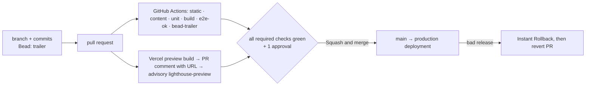

# 09 · Deployment, operations & content-editing workflow

## Purpose

This document says how the Green Pastures site gets from a pull request to parents' browsers and how it stays
there: the three environments and the Vercel project that hosts them, every environment variable and secret and
where each lives, the CI/CD path with its branch protection and rollback, and — the part a non-developer will
read — how the daycare owner or a translator changes text on the site by editing one JSON file in the browser,
seeing the change on a preview in both languages, and getting it merged. It also covers monitoring, incidents,
backups, dependency updates, security, access, cost, the launch checklist and the post-launch runbook. It builds
on 02 (the content contract: `D-02.2`, `D-02.14`, `INV-02.6`), 07 (§5 environment table, §3 WAF rule, §2 logs),
11 (`D-11.4`, `D-11.5`, `OQ-11.3`) and 01 (ADR-007 hosting). Vendor claims are labelled
`[verified: source, 2026-08-22]` or `[assumed — confirm]`.

Status: draft · seat writer-ops · 2026-08-22

## Decisions

- **D-09.1 Three environments, one mapping.** *Local* (`pnpm dev`), *Preview* (one Vercel deployment per
  pull request, built by the Vercel GitHub integration) and *Production* (the deployment of `main` behind the
  custom domain). Any branch that is not `main` is a preview; `main` is production; there is no staging branch
  and no Vercel custom environment. `main` only receives squash merges of reviewed PRs (`INV-09.4`).
- **D-09.2 Vercel plan: Pro.** The Hobby plan "restricts users to non-commercial, personal use only"
  [verified: Vercel Hobby plan docs, 2026-08-22]; a daycare's marketing site is commercial use, so the project
  lives in a Pro team (one paid seat minimum — Developer/Owner seats are $20 per user per month
  [verified: same page]; Viewer seats are free [assumed — confirm on the pricing page at setup], and D-09.4's
  whole reviewer flow rests on it). What staying on Hobby would cost operationally, which is the evidence
  OQ-09.1 needs: no custom analytics events, so 07 §4's `inquiry_submitted` / `inquiry_failed` never arrive;
  runtime logs kept 1 hour instead of 1 day and no log drains, so D-09.15's monitoring shrinks to what is on
  screen; one WAF rule per project (07 §3 uses exactly one, so this is a tight fit rather than a break);
  Instant Rollback only to the immediately previous production deployment, not to any earlier one; and no
  second team member, which removes the owner's and the translator's Viewer access to previews
  [verified: Vercel plan limits, 2026-08-22]. Budget and who pays are OQ-09.1 (01's OQ-01.4 assumed Pro;
  confirmed here).
- **D-09.3 Vercel project settings.** Framework preset Next.js; Node.js 24.x (Vercel's default for new projects
  and pinned again by `engines.node` [verified: Vercel Node.js versions, 2026-08-22]); pnpm from the committed
  `pnpm-lock.yaml` and the `packageManager` field; install `pnpm install --frozen-lockfile`; build `pnpm build`
  (= `next build`); output directory default; Fluid compute on (default for new projects since 2025-04-23
  [verified: Vercel Fluid compute docs, 2026-08-22]); Function region `sfo1` (San Francisco — the one closest to
  Fremont; default would be `iad1` [verified: Vercel regions docs, 2026-08-22]) for the inquiry Route Handler;
  the next-intl proxy is Routing Middleware and Vercel places it in all regions regardless of that setting
  [verified: same page]; an Ignored Build Step skips commits that touch only `docs/**`, `.beads/**` and root
  `*.md` (which is why Vercel's deployment status is **not** a required check — §3). Never `output: 'export'`
  (memo ADJ-2, ADR-007).
- **D-09.4 Deployment Protection: previews are private, production is public.** *Standard Protection* with
  *Vercel Authentication* (available on all plans; protects every URL except production domains
  [verified: Vercel Deployment Protection docs, 2026-08-22]). Reason: previews run the real Resend transport to
  the test inbox and have no WAF rate-limit rule (07 §5), so they must not be open to the internet. Reviewers
  (owner, translator) are Vercel team members with the free Viewer role, which is enough to open protected
  previews [verified: Vercel Authentication docs, 2026-08-22]; a one-off reviewer gets a Shareable Link
  [assumed — confirm the feature and its plan at setup]. This is 09's answer to 08's `OQ-08.4`: yes, previews
  are protected, so the `lighthouse-preview` job — the only CI job that touches a preview URL (08 `D-08.7`) —
  gets *Protection Bypass for Automation* (`VERCEL_AUTOMATION_BYPASS_SECRET`) and sends
  `x-vercel-protection-bypass`. Previews also carry `X-Robots-Tag: noindex` automatically
  [verified: Vercel KB, 2026-08-22]. Owner confirms in OQ-09.3.
- **D-09.5 Domains.** Apex and `www` are both attached to the project; **the apex is the canonical host** and
  `www` 308-redirects to it. That is 06's default (`D-06.11`, `OQ-06.2` — "apex canonical, `www` → apex at the
  Vercel domain level"), and 09 implements rather than re-decides it; the counter-argument is Vercel's own
  recommendation to prefer `www` (a CNAME on `www` gives the CDN more control; the apex cannot carry a CNAME
  and needs an A record) [verified: Vercel domains docs, 2026-08-22], which is why flipping is worth keeping
  cheap — it is one Vercel setting plus one environment value. The production origin is
  `NEXT_PUBLIC_SITE_URL` (07 §5), owned by 06 (`D-06.11`, parsed once in `src/config/site-url.ts`); 09 only
  sets it, in the Production scope, and holds no competing source of truth (`INV-09.6`). TLS is automatic
  (Let's Encrypt, HTTP → HTTPS 308, HSTS `max-age=63072000` on custom domains
  [verified: Vercel encryption docs, 2026-08-22]). The domain name, registrar and DNS host are OQ-09.2; the
  host form is 06's `OQ-06.2`; the fate of `site.json.brand.url` is OQ-09.10.
- **D-09.6 Secrets live in Vercel only.** Every variable in §2 is set in the Vercel project (Production /
  Preview / Development scopes), pulled locally with `vercel env pull`, and listed by name in a committed
  `.env.example`; secrets are never in git, never in the Development scope, never in CI variables except the
  bypass secret (`INV-09.1`, `INV-09.2`). Changing a variable takes effect on the next deployment only
  [verified: Vercel env docs, 2026-08-22], so every rotation ends with a redeploy.
- **D-09.7 CI is GitHub Actions; Vercel builds.** Actions runs 08's gates on every PR — job names are 08's
  (`static`, `content`, `unit`, `build`, `e2e` behind the roll-up `e2e-ok`, and the advisory
  `lighthouse-preview`), plus 11's `bead-trailer`. Actions also produces the artifact the end-to-end tests run
  against: 08 `D-08.7` runs Playwright on a local production build, never on the preview. The Vercel GitHub
  integration builds the preview and posts the URL as a PR comment. No Actions workflow deploys anything
  (confirms `OQ-11.3`'s assumption of GitHub Actions).
- **D-09.8 Branch protection on `main`** (a ruleset the human applies — the concrete list is §3): PR required,
  one approving review, code-owner review, required checks = 08's required job names + `bead-trailer` and
  **not** the Vercel deployment status (D-09.3's Ignored Build Step means a docs-only PR never produces one;
  08's required `build` job is what keeps a broken build unmergeable), branches up to date before merge,
  linear history, squash-only with squash message source
  "Pull request title and description" (answers `OQ-11.3`; `D-11.5`, TRAP-11.14), no force-push, no deletion,
  no bypass for admins, head branches auto-deleted.
- **D-09.9 Release, rollback, hotfix.** A release *is* a squash merge to `main` — nothing else. Rollback is
  Vercel **Instant Rollback** to any earlier production deployment (Pro [verified: Vercel rollback docs,
  2026-08-22]) first, then a revert PR so `main` and production agree again. A hotfix takes the normal PR path
  with expedited review; there is no direct-push exception (`INV-09.4`). Production promotion stays automatic
  (every `main` deployment is promoted); after a rollback it is re-enabled with "Undo Rollback".
- **D-09.10 Non-developers edit content through GitHub's web editor and a pull request.** No CMS at launch
  (`D-02.14`, ADR-003). The repository ships `content/README.md` (the editor guide, §4.2), a default pull-request
  template whose last line is the `Bead:` trailer, and a `CODEOWNERS` file that makes the owner and the
  developer co-owners of `content/**` and `public/images/**`. Every content change is a PR with green gates and
  a reviewed preview (`INV-09.3`); the developer merges, or the owner merges when the developer authored.
- **D-09.11 Bead trailer for content and bot PRs.** A standing, human-assigned bead "content edits" (and a
  second one for dependency updates) satisfies 11's gate without the editor learning the tracker: the editor
  pastes one line (`Bead: <id>`) into the commit's extended description and the PR template supplies the same
  line in the body (`D-11.4`, W-11.8: a bead assigned `human` is a valid target while open). Ids are recorded
  in `content/README.md` once 11 creates them (OQ-09.5). Both standing beads must be created, **claimed, and
  exported into `.beads/issues.jsonl` on `main`** before the first editor or Renovate PR: 11 §6 item 2
  resolves the trailer against `git show <head>:.beads/issues.jsonl`, and 11 §5 would otherwise force a
  `chore(beads): sync tracker snapshot` commit into a PR a non-developer cannot make. Launch item 10 carries
  this.
- **D-09.12 Translation workflow.** English is edited first; the `content` gate's coverage report
  (`INV-02.6`) is the translator's to-do list; zh is added in the same PR (CI fails on missing keys, `D-02.8`)
  or in a follow-up PR that the owner opens from the report; a committed `content/GLOSSARY.md` fixes brand and
  recurring terms in both languages (OQ-02.4 decides the brand rendering). Machine translation is never
  committed without a bilingual human reading it (rule in the guide; not mechanically enforceable).
- **D-09.13 Menu cadence.** At launch the menu collection is a **rotating sample week** (the design labels it
  "Sample menu" and `menu.note` says the live menu is posted each Monday — at the daycare, not on the site),
  refreshed when the kitchen's rotation changes. A true weekly menu is one 15-cell JSON edit per week and is
  feasible; the owner decides in OQ-09.6.
- **D-09.14 CMS later, by ADR.** A git-backed CMS (first candidate to evaluate: Keystatic — reads and writes
  the same JSON files in the repository, runs as a route in the Next.js app, authenticates with GitHub; fallback
  Decap) is adopted by a new ADR in 01 when one of these happens: a second regular non-developer editor,
  editing cadence of weekly or more, or the owner answers `OQ-02.3` with "yes, in-browser editing". Schemas
  stay 02's; the CMS maps onto them (ADR-003).
- **D-09.15 Monitoring and alerting at launch.** Vercel runtime logs (1 day on Pro [verified: Vercel runtime
  logs docs, 2026-08-22]) carry the inquiry handler's structured lines (07 §2) and next-intl `MISSING_MESSAGE`
  reports (`D-02.8`); Vercel Web Analytics is on (Pro bills $0.03 per 1,000 events against the monthly usage
  credit [verified: Vercel analytics pricing, 2026-08-22]); Speed Insights is on for the first 90 days
  ($10 per project per month on Pro [verified: Vercel Speed Insights pricing, 2026-08-22]) and reviewed then;
  an external HTTPS uptime check runs every 5 minutes against `/en` and alerts the developer. No log drain and
  no client error SDK at launch (07 D-07.9); the upgrade path is OQ-09.7.
  The **provider** is not 09's to pick: Vercel Web Analytics + Speed Insights is the launch default (07
  `D-07.9`, memo ADJ-10) and the human answers `OQ-01.1` / `OQ-07.9`, with 09 wiring whatever comes back. Both
  defaults are cookieless, so nothing is required of the pages. An answer of GA4 adds work to 09 and to the
  content contract: a consent banner in **both** locales (new keys in 02's `common.*`), consent-gated script
  loading, and a privacy-page section (OQ-07.5) — budget a bead for it rather than treating it as a settings
  toggle.
- **D-09.16 Backups.** Git on GitHub is the backup of the site and of all content; the inquiry inbox is the
  record of submissions (07 D-07.8); the tracker is backed up per 11 (`D-11.6`: committed `issues.jsonl`,
  `bd dolt push` once `OQ-11.1` is yes). No database exists to back up.
- **D-09.17 Dependency updates with Renovate.** Weekly grouped minor/patch PRs, majors one PR each, automerge
  off, `commitTrailers` and `prFooter` carrying the dependency bead's `Bead:` line so 11's gate passes
  (Dependabot cannot write a commit body, so it is not used). Next.js majors are upgraded by the developer
  with the official codemods when the pinned major leaves Active LTS (01 ADR-001). Security advisories are
  merged out of cycle.
- **D-09.18 Security headers.** Shipped from `next.config.ts` on every route: `Strict-Transport-Security`
  (Vercel's default, kept), `X-Content-Type-Options: nosniff`, `Referrer-Policy: strict-origin-when-cross-origin`,
  `Permissions-Policy: camera=(), microphone=(), geolocation=()`, and
  `Content-Security-Policy: frame-ancestors 'none'`. A full CSP is **not** shipped at launch: Next.js inline
  hydration scripts need nonces, nonces need per-request rendering, and every page is statically generated
  (`D-02.9`); a `Content-Security-Policy-Report-Only` allowlist (self, `challenges.cloudflare.com`, Vercel
  analytics hosts) is a post-launch task once a report endpoint exists.
- **D-09.19 Access control.** GitHub: owner = admin, developer = admin, translator = write (branches and PRs
  only; `main` is protected for everyone); Vercel: owner = Owner, developer = Member, translator = Viewer;
  Resend and Cloudflare accounts belong to the daycare (owner's email) with the developer invited, never the
  reverse (07 §5, OQ-07.4). Two-factor authentication is required on all four.
- **D-09.20 Cost model** (monthly, before tax): Vercel Pro $20 per paid seat (1–2 seats) + Speed Insights $10
  while on + analytics pennies at this traffic; Resend free tier (3,000 emails per month, 100 per day
  [verified: Resend pricing, 2026-08-22]); Turnstile free; domain registration ≈ $10–20 per year [assumed];
  uptime check free tier [assumed]. Roughly $30–50 per month for the first quarter, $20–40 after. OQ-09.1.

## Design

### 1 · Environments

| | Local | Preview | Production |
|---|---|---|---|
| Trigger | `pnpm dev` | every push to a PR branch (Vercel GitHub integration) | squash merge to `main` |
| URL | `http://localhost:3000` | `<project>-git-<branch>-<team>.vercel.app` + per-commit URL, in the PR comment | `https://<domain>` (`www` redirects to the apex — D-09.5) |
| Access | developer's machine | Vercel Authentication (team Viewers and up; Shareable Link for others; bypass header for CI) | public |
| Indexing | n/a | `X-Robots-Tag: noindex` set by Vercel | indexable; sitemap + `hreflang` per 06 |
| Env scope | `.env.local` from `vercel env pull` (Development scope) | Preview scope | Production scope |
| Inquiry form | `INQUIRY_TRANSPORT=log` prints the email to the terminal; Turnstile test pair | real Resend transport → **test inbox**; Turnstile test pair; no WAF rule | real inbox; real Turnstile keys; WAF rate-limit rule |
| Logs | terminal | Vercel runtime logs (filter `environment: preview`) | Vercel runtime logs, 1 day |

Local setup (developer): `pnpm install`, `vercel link` (once), `vercel env pull .env.local` — which brings the
Development scope, i.e. the Turnstile test pair and nothing secret — then copy the single line
`INQUIRY_TRANSPORT=log` out of `.env.example` into `.env.local` by hand, because that variable is deliberately
never set in Vercel (§2) and therefore cannot arrive in a pull; then
`pnpm dev`. `.env.example` is the checklist of names; `.env.local` is git-ignored. `BEADS_DIR` is not an
application variable: it is exported in a shell that runs `bd` inside a worktree (11 W-11.12) and never
appears in `.env.*`.

Branch → environment mapping is the whole of D-09.1: `main` → production; everything else → preview. Vercel's
first deployment of a new project is always production [verified: Vercel environments docs, 2026-08-22], so
the project is created from a throwaway `main` state before the domain is attached (launch checklist).

Preview WAF scope: the one rate-limit rule (07 §3: `POST /api/inquiry`, key IP, fixed window 10 min, limit 5,
action 429) is published for production. Rate-limit counters are **per region**, so 5 per 10 minutes is
approximate — a visitor routed through two regions can exceed it (07 §3); the number is an anti-abuse floor,
not an accounting figure, and the handler behaves correctly with or without the rule. WAF custom rules are
project-wide and take effect without a redeploy [verified: Vercel WAF custom rules docs, 2026-08-22], so the
rule carries an `environment` condition set to `production` — a documented rule parameter
(`environment (preview | production)`) [verified: Vercel WAF custom rules docs, 2026-08-22] — with a
host-name condition as the fallback if the dashboard's rule builder does not expose it. Previews are
protected by Deployment Protection instead.

### 2 · Environment variables and secrets

| Name | Kind | Development | Preview | Production | Owner | Set where | Rotation |
|---|---|---|---|---|---|---|---|
| `RESEND_API_KEY` | server secret | — (transport is `log`) | sending-only key, restricted to the sending domain | same, separate key | developer (Resend account = owner) | Vercel env, *Sensitive* | yearly; on leak; on offboarding |
| `INQUIRY_FROM_EMAIL` | server | — | verified sender | verified sender | owner (OQ-07.6) | Vercel env | when the mailbox changes |
| `INQUIRY_TO_EMAIL` | server | — | **test inbox only** | daycare inbox(es), comma-separated | owner | Vercel env | on staff change |
| `INQUIRY_AUTOACK` | server flag | unset | `0` | `0` until OQ-07.2 says `1` | owner | Vercel env | n/a |
| `INQUIRY_TRANSPORT` | server | `log` (shipped in `.env.example`) | unset (= `resend`) | unset (= `resend`) | developer | `.env.example` only — never set in Vercel | n/a |
| `NEXT_PUBLIC_TURNSTILE_SITE_KEY` | public | test `1x00000000000000000000AA` (in `.env.example`) | test key | real site key | developer (Cloudflare account = owner) | Vercel env | with the secret |
| `TURNSTILE_SECRET_KEY` | server secret | test `1x0000000000000000000000000000000AA` | test secret | real secret | developer | Vercel env, *Sensitive* | yearly; on leak |
| `NEXT_PUBLIC_SITE_URL` | public | unset | unset (07 §2's origin check falls back to `VERCEL_*`; what `metadataBase` uses on a preview is 06's call — OQ-09.10) | `https://<domain>` — the one production origin, 06 `D-06.11` | developer | Vercel env | when the domain changes |
| `VERCEL_AUTOMATION_BYPASS_SECRET` | system secret | — | set by Vercel on deployments; copied to a GitHub Actions secret for `lighthouse-preview` (08 OQ-08.4 — the only job that hits a preview URL) | — | developer | Vercel Deployment Protection settings | yearly; on leak |
| `VERCEL_ENV`, `VERCEL_URL`, `VERCEL_BRANCH_URL`, `VERCEL_PROJECT_PRODUCTION_URL` | system | — | set by Vercel | set by Vercel | — | automatic | — |

Rules: the table is the complete list at launch (06 and 08 add nothing that reaches Vercel; CI-only values 08
needs are GitHub Actions secrets or variables and are listed in 08). `.env.example` carries every name with an
empty value except the two safe local defaults (07 §5); 08's `.env.example` completeness gate fails when a
`process.env.X` read in `src/**` has no line in `.env.example`. Rotation procedure (any secret): create the new
credential at the vendor → paste into the Vercel scope → redeploy production (env changes apply to new
deployments only) → send one real inquiry and see it arrive → revoke the old credential → note the date in the
runbook log (a dated list in `content/README.md`'s operations appendix is enough; no tool).

### 3 · CI/CD, branch protection, release

**Required checks on `main`** (08 §CI owns the list and the names; 09 lists the roles): `static` (types, lint,
CSS lint, formatting, token/TODO/env scripts), `content` (`pnpm validate:content`, INV-02.2/3/4/8, with the
coverage report attached to the PR), `unit`, `build` (`next build` plus the bundle secret grep — this is what
makes a broken build unmergeable), `e2e-ok` (the roll-up over the sharded `e2e` job; Playwright per locale
against the **local production build** from `build`'s artifact, never the preview — 08 `D-08.7` — including
the not-found URL per locale, INV-02.5), and `bead-trailer` (11 §6).

Not required: `lighthouse-preview` is **advisory** on PRs (08's table) and becomes a gate only at launch as
`lighthouse-prod`; and Vercel's deployment commit status is deliberately left out, because D-09.3's Ignored
Build Step skips docs-only and `.beads/`-only commits and such a PR would then wait forever for a status
Vercel will never post. Build health is covered by the required `build` job instead. If the human wants the
Vercel status required anyway, the Ignored Build Step has to go with it — the two cannot both stand.

**Ruleset for `main`** (repository settings, applied by the human — OQ-11.3's action list): require a pull
request before merging · required approving reviews: 1 · dismiss stale approvals on new commits · require review
from code owners (`CODEOWNERS`: `content/** public/images/**` → owner + developer; everything else → developer)
· require status checks to pass with "require branches to be up to date" · require linear history · block
force pushes · restrict deletions · do not allow bypassing (admins included). Repository settings: allow
**squash merging only** (merge commits and rebase merging off); default squash message "Pull request title and
description" (one of GitHub's four options [verified: GitHub docs, 2026-08-22]); automatically delete head
branches. The bead-trailer gate's PR-body check (11 §6 item 3) is what keeps INV-11.1 true on `main`.

**Vercel Git settings:** production branch `main`; preview deployments for all branches; PR comments on;
GitHub Deployments on — the Vercel GitHub integration posts a GitHub deployment and its statuses for every
Vercel deployment [verified: Vercel for GitHub docs, 2026-08-22], so 08's `lighthouse-preview` job triggers on
GitHub's native `deployment_status` event, filters it to a Vercel **preview** deployment, and reads the URL
from `deployment_status.target_url`. There is **no relay endpoint**: no `src/app/api/vercel-dispatch/route.ts`,
no `repository_dispatch` hop, no PAT and no third Function — the only functions are the proxy and
`/api/inquiry`, which is what 06 `INV-06.7` / `D-06.1` require (memo ADJ-14).
Git fork protection on; Ignored Build Step
`git diff --quiet HEAD^ HEAD -- ':!docs/**' ':!.beads/**' ':(exclude,glob)*.md'` (exit 0 = skip). The `glob`
magic is what root-anchors the third pathspec: without it `*` matches `/` and `content/README.md` would be
excluded too.

**Release.** Merge = release. No tags, no release branches, no manual promotion. Every production deployment
therefore maps to exactly one squash commit, one PR and one `Bead:` id (`INV-09.5`); the Vercel deployment
shows the commit message, the PR number and the author.

**Rollback.** Production misbehaves → Vercel project → Instant Rollback → pick the last known-good production
deployment → Confirm (seconds; environment variables stay as they were at that build [verified: Vercel
rollback docs, 2026-08-22]). Then open a revert PR (`git revert` of the squash commit, normal gates) so `main`
matches production, merge it, and press "Undo Rollback" (or let the revert's deployment be promoted via
`vercel promote`) to restore automatic promotion. Content-only mistakes (a wrong sentence) are fixed forward
with a new content PR, not rolled back. A **bad firewall rule** is the third case and does not involve a
deployment at all: WAF configuration is versioned separately, so Firewall tab → audit log → pick the previous
configuration version → **Restore**, and it applies without a redeploy [verified: Vercel WAF docs,
2026-08-22]. Use this when a rate-limit change starts 429-ing real parents; then re-publish the corrected rule
in log mode first (launch item 8).

**Hotfix.** A bug bead (11 W-11.4), a branch from `main`, a PR reviewed within the hour, squash merge. The
only shortcut is the rollback above. Nobody pushes to `main`, including admins (`INV-09.4`).

### 4 · Content-editing workflow for non-developers

This is the section the daycare owner reads. It assumes a GitHub account (free), the Viewer role on the
Vercel team (no paid seat expected — D-09.2), and nothing installed. Technical background is in 02; this
section never restates its schema, it points at files.

#### 4.1 Who edits what

| Person | Edits | Does not edit |
|---|---|---|
| Owner (daycare) | English text in `content/en/**`; facts in `content/site.json` (hours, phone, Yelp count, license, order of teachers); photos in `public/images/**` | anything under `src/`, config files, `.github/`, `docs/` |
| Translator | Chinese text in `content/zh/**`; `content/GLOSSARY.md` | `content/site.json` (no text lives there), English files except to flag a problem |
| Developer | everything; reviews every content PR; fixes formatting or structure problems on the editor's branch | — |

Rule of thumb (02 `D-02.3`): if it is words, it is in a locale folder; if it is a number, a date, a URL, an image
path or a switch, it is in `content/site.json`; the validator refuses the opposite (`INV-02.4`).

#### 4.2 `content/README.md` — the editor guide the repository ships

A one-page guide at the top of the content tree, maintained by the developer and written for the owner. 10
schedules it with the first content PR. It must contain, in this order:

1. **"Where is the text for…"** — a table from what the owner sees to the file and top-level key, derived from
   02's coverage map (*Per-locale string homes*):

   | Screen / element | File (under `content/en/` or `content/zh/`) | Top-level key |
   |---|---|---|
   | Top bar, menu, footer links, "Book a tour", language switch | `messages/common.json` | `nav`, `footer`, `localeSwitcher` |
   | Home — hero headline, badge, buttons | `messages/home.json` | `hero` |
   | Home — philosophy quote, programs / menu / gallery / teachers intros, reviews line, visit block | `messages/home.json` | `philosophy`, `programs`, `menu`, `gallery`, `testimonials`, `teachers`, `visit` |
   | Philosophy page (principles, daily rhythm) | `messages/philosophy.json` | `principles`, `day` |
   | Programs / Menu / Gallery / Reviews / Team page chrome | `messages/<page>.json` | `kicker`, `heading`, `intro`, `footnote` |
   | Program cards (names, ages, descriptions) | `collections/programs.json` | one entry per program id |
   | Menu dishes and dietary chips | `collections/menu.json` | `week.<day>.<meal>`, `dietary` |
   | Teacher cards | `collections/teachers.json` | one entry per teacher id |
   | Parent reviews | `collections/testimonials.json` | one entry per review id |
   | Photo captions / alt text | `collections/gallery.json` | `photos.<id>` |
   | Inquiry form labels, errors, success message | `messages/visit.json` | `form` |
   | Emails the form sends | `messages/email.json` | `inquiry`, `autoReply` |
   | "Page not found" and "Something went wrong" pages | `messages/errors.json` | `notFound`, `serverError` |
   | Browser-tab titles and the Google search descriptions | `messages/<page>.json` and `messages/common.json` | `meta` in each page file (`meta.title`, `meta.description`); `common.meta` for the site name and title template |
   | FAQ questions and answers, if the FAQ page ships (02 `D-02.17`, OQ-02.7) | `messages/faq.json` (page chrome) and `collections/faq.json` (the questions) | `kicker`, `heading`, `meta`; one entry per question id |
   | Hours, phone, email, address, Yelp rating and count, license number, image files, order of things | `content/site.json` (one file, no language) | `hours`, `contact`, `yelp`, `license`, `images`, `teachers`, … |

   Two things the table cannot show. **A key whose name ends in `Short` is the phone wording of the key next
   to it** (`subtitle` / `subtitleShort`, `intro` / `introShort` — 02 `D-02.13`): both exist in every language,
   the site picks one by screen width, and **changing one without the other leaves the old text on half the
   visitors' screens with no check to warn you**. Always fix the pair. And the footer's year is computed at
   build time, not stored (02: `{year}` in `common.footer.copyright`) — there is nothing to update in January.

2. **Seven rules:** change only the text between the quotes; keep every `{name}` and every `<em>…</em>` exactly
   as in English (they are filled in by the site); `\n` is a line break; every English change needs the same
   key in Chinese (the check tells you which); never put numbers, phone numbers, links or file names in a
   language file — they go in `site.json`; never type HTML; and **JSON files have no comments — never add a
   `_comment` key** (02's rule; the validator rejects it). A note about a change belongs in the pull request,
   or in this guide.
3. **The one line to paste** into the commit's extended description and (already present) at the end of the
   PR: `Bead: <content-edits id>` (D-09.11).
4. **Recipes** 4.5–4.9 below, in the owner's words.
5. **Where to ask:** the developer's contact, and the PR itself (comments on the PR are the conversation).
6. **Operations appendix** (developer-facing, short): rotation log, last dependency review, uptime-check
   location.

#### 4.3 Editing a sentence, step by step (GitHub in the browser)

1. Open the repository on github.com → `content` → `en` → `messages` → the file from the table (say
   `home.json`). Click the **pencil** ("Edit this file").
2. Change the words between the quotes. Do not touch the key on the left of the colon, the quotes, the commas,
   or anything in `{…}` or `<…>`.
3. Click **Commit changes…**. Commit message: what changed in plain words ("Update hero subtitle"). In
   **Extended description** paste the `Bead:` line from `content/README.md`. Choose **Create a new branch for
   this commit and start a pull request**, keep the suggested branch name, click **Propose changes**.
4. On the next screen the PR description is pre-filled from the template (what changed · which screens · which
   languages · the `Bead:` line last). Fill the first three and click **Create pull request**.
5. If the same sentence has a Chinese version (it always does, unless the file is new): switch to your new
   branch (branch selector, top left of the file view), open the same file under `content/zh/messages/`, edit
   the same key, **Commit directly to the branch** — **paste the same `Bead:` line into the extended
   description again**, because every commit is checked, not just the first — and it joins the same PR. If you
   cannot translate it, write the English sentence in the zh file for now and say so in the PR; the translator
   replaces it before merge (OQ-02.2 decides whether English may ship in zh). If the key you changed has a
   `Short` twin, edit that too, in both languages.
6. Within a few minutes the PR shows **checks** and a comment from Vercel with the **preview** link. Open it
   (sign in to Vercel once), look at `/en/…` and `/zh/…` for the screen you changed — desktop and phone.
   Two things to watch for on the preview: text in brackets like `⟦home.hero.title⟧` means that key is missing
   from **both** language files (check the spelling of the key you added), and an English sentence sitting on a
   `/zh/` page means the Chinese key is missing and the site fell back to English (02 `D-02.8`) — add the key.
7. Green checks + the preview looks right → write "ready" in the PR. The developer (or the owner, when the
   developer wrote it) approves and presses **Squash and merge**. The site updates within about two minutes.
8. Red check → click **Details** next to the failed check, scroll to the red lines, and look the message up in
   §4.4. Something looks wrong on the preview → edit again on the same branch (repeat 1–3 choosing the branch,
   `Bead:` line each time); the preview rebuilds.

#### 4.4 What the checks say, in plain language

The `content` check prints one line per problem; the report attached to the PR (`INV-02.6`) lists missing zh
keys as a to-do list. The common ones:

| The check says | It means | What to do |
|---|---|---|
| `missing in zh: home.hero.subtitle` | English has a key Chinese lacks | add the key to the zh file (step 5) |
| `extra key in zh: home.hero.subtitel` | typo or leftover in zh | fix the spelling to match `en`, or delete it |
| `empty string: team.footnote (zh)` | `""` is not allowed anywhere | write the text, or remove the key in **both** languages |
| `ICU arguments differ: reviews.countLine — en {count}, zh none` | a `{…}` placeholder was lost | put `{count}` back exactly |
| `rich tags differ: home.hero.title — en <em>, zh none` | an `<em>…</em>` was lost | wrap the same words in `<em>…</em>` |
| `invalid JSON: content/zh/messages/home.json:12` | a quote or comma is missing near line 12 | compare with the English file; the developer can fix it |
| `illegal escape: programs.footnote — "'{"` | an apostrophe sits directly before a `{`, which the message format reads as "start quoting" and silently eats the placeholder | put a space between them, or reword ("the child's {age}" → "the age of the child: {age}"); apostrophes anywhere else are fine |
| `HTML not allowed in value: home.visit.subtitle` | a tag other than the `<em>…</em>` the English already has was typed (` `, `<b>`, `<a href…>`) | delete the tag; use `\n` for a line break, and ask the developer for a link or bold |
| `array length differs: philosophy.badges — en 3, zh 2` | a list lost or gained an item in one language | the two languages must have the same number of items, in the same order; add the missing one back |
| `teachers.lopez: required field missing — summaryShort, bioShort, photoAlt (zh)` | a collection entry (teacher, program, review, photo) is missing a field the site needs | open §4.6, copy an existing entry of the same kind as the shape to follow, and fill every field it has — including the `Short` ones and `photoAlt` |
| `locale-agnostic value in zh: "/images/…"` or a phone number | data in a language file | move it to `site.json`; keep only words in the language file |
| `unknown id "lopez" in teachers.json (en)` | the id is not in `site.json` | add the entry to `site.json` → `teachers[]` first (§4.6) |
| `image not found: public/images/team/lopez.jpg` | the file name in `site.json` is wrong or the upload is missing | upload the file (§4.9) or fix the name |
| `TODO value: contact.phone` (release gate) | an owner fact is still the placeholder | replace `"TODO"` with the real value |
| `format` (Prettier) | spacing/indentation drifted | the developer runs `pnpm format` on your branch; nothing for you to do |

The `static`, `unit`, `build` and `e2e-ok` checks do not fail on text changes; if one does, the developer
looks. `lighthouse-preview` is advisory — an orange or failed Lighthouse run never blocks a merge. The
`bead-trailer` check fails with *"no Bead: trailer on commit …"* when the paste in step 3 or step 5 was
skipped — the developer rewords the commit on your branch; next time paste the line into every commit.

#### 4.5 Adding or changing a Chinese translation

Translator's path: open the latest coverage report (linked from the PR, or `reports/content-coverage.md` on
`main` after CI runs) → for each missing key, open the zh file at the same path as the en file, add the key
with the Chinese text, keeping `{…}`, `<em>…</em>` and `\n` → commit to the PR's branch (or open a new PR from
`main` with the same steps) → the report on the next run shrinks. Style: full-width punctuation `，。：`
(02 CJK rules), the glossary's renderings for brand and fixed terms, no machine output unread.

#### 4.6 Adding a teacher, a menu week, a review, a program

Collections need **two edits**: the shared entry in `content/site.json` (id, order, icon or photo, flags) and
the text entry with the same id in `content/en/collections/<name>.json` and `content/zh/collections/<name>.json`
(02 *Checklists → Add a collection entry*). Concretely, a new teacher: in `site.json` append
`{ "id": "lopez", "icon": "📚" }` to `teachers[]` at the position she should appear; in both `teachers.json`
files add `"lopez": { "name": …, "credentials": …, "summary": …, "summaryShort": …, "bio": …, "bioShort": …,
"tags": [ … ], "photoAlt": … }` — all eight fields are required (02 *Collections*), the two `Short` ones are
the phone wording, and `photoAlt` is what a screen reader and a broken image show, so it is required even for
a teacher who has an emoji instead of a photo. Leaving any of them out fails the `content` check with the
field name (§4.4, last row). If she has a photo, upload it (§4.9) and use
`"photo": { "src": "/images/team/lopez.jpg", "width": 800, "height": 800 }` in `site.json` instead of `icon`.
Removing: delete from all three files. Reordering: move the entry in `site.json` only.
A menu week is the 15 dish cells `week.<mon…fri>.<breakfast|lunch|snack>` in both `menu.json` files — no
`site.json` change. A review is `site.json` → `testimonials[]` (`id`, `rating`, `sourceUrl`, `onHome`,
`onMobile`) plus `quote`/`author`/`relation` in both languages.

#### 4.7 Changing hours, phone, Yelp count, license, links

One file, no language: `content/site.json`. `hours.open` / `hours.close` are 24-hour `"07:30"` / `"18:00"`
(the site formats them per language — never type "7:30 am" into a language file). There is **one** opening
and closing time and it applies to every weekday in `hours.days` (02's shape): a Friday-only or per-day
exception has no field to go in and is a developer change — ask, do not improvise. `contact.phone`,
`contact.email`, `contact.address`, `contact.mapsUrl`; `yelp.rating`, `yelp.reviewCount`, `yelp.url`;
`license`; `social.*`. A wrong type (letters in a number) fails the `content` check with the field name.

#### 4.8 What not to edit

Anything under `src/`, `public/` other than `public/images/`, `package.json`, `pnpm-lock.yaml`,
`next.config.ts`, `.github/`, `.beads/`, `docs/`, and in `site.json` the `routes[]`, `nav`, `menu.days`,
`menu.meals` and `ages` blocks (they are structure, not facts). Keys (left of the colon) are never renamed by
editors. **No `_comment` keys**, in any JSON file: JSON has no comment syntax, a `_comment` key is a real key
the validator rejects (02's JSON-style rule), and the place for an explanation is the pull request or
`content/README.md`. If a change seems to need one of these, it is a developer PR.

#### 4.9 Images

Put the file in `public/images/<area>/` (`hero/`, `philosophy/`, `team/`, `gallery/`, `map/`) through GitHub:
open the folder on your branch → **Add file → Upload files** → drag the file → commit to the branch, pasting
the `Bead:` line into the extended description as in step 3 (this is a commit like any other and the check
looks at all of them). Then
reference it in `site.json` with its pixel `width` and `height`, and add the `alt` text in both languages (the
`content` check insists on both). Sizes that keep pages fast (the site resizes per device with `next/image`):
hero and philosophy photos ≤ 1,600 px wide, gallery photos ≤ 1,200 px on the long edge, teacher portraits
800 × 800, JPEG or WebP, ≤ 400 KB each; file names lowercase with hyphens; replace a photo by uploading under
the same name.

#### 4.10 Glossary and brand consistency

`content/GLOSSARY.md` (translator-owned, developer-reviewed) lists each fixed term once with its rendering in
both languages: the brand (`brand.name`, `brand.shortName`, `brand.nameZh` — 02 `D-02.12`; which Chinese name is
the real one is OQ-02.4, and the prototype itself shows two), "Montessori" ↔ "蒙特梭利", the program names, the
six navigation words as the design renders them (`docs/design/desktop/Green Pastures - Homepage.dc.html`,
`I18N` table: Philosophy 教学理念 · Programs 课程班级 · Menu 餐点 · Gallery 相册 · Reviews 家长评价 · Our Team
我们的团队 · Book a tour 预约参观), "Fremont, CA" ↔ "加州弗里蒙特", and credential acronyms that stay Latin
(AMS). The glossary is prose, not enforced; the brand name itself is data and appears in copy only as
`{brandName}` / `{brandNameZh}` (02 rule 13), so it cannot drift per key.

#### 4.11 Review, approval and cadence

- Every content PR is reviewed by the other code owner (owner ↔ developer) before merge; the translator's PRs
  are reviewed by the owner for meaning and by the developer for structure. No self-merge of unreviewed text.
- Expected cadence: hours/contact/teachers/programs — a few times a year; reviews/Yelp count — monthly at
  most; menu — per D-09.13 (rotation changes) or weekly if OQ-09.6 says so; translations — whenever the report
  is non-empty. A content PR takes the owner about ten minutes end to end once the preview is up.
- The `--release` gate (`pnpm validate:content --release`, 02: no `"TODO"` owner value) runs manually before
  launch and, after launch, on every PR (a repository variable flips it on at launch) so placeholders cannot
  return. It covers exactly 02's five required owner facts — `contact.phone`, `contact.email`,
  `contact.address`, `yelp.url`, `brand.url`. The **license number is not covered**: 02 ships it as the
  design's placeholder `000000000`, which is a plausible value and contains no `"TODO"`, so no check can see
  it. It is a manual tick on the launch list (item 11a).

### 5 · Operations

**Monitoring.** Daily/weekly look at: Vercel Logs filtered `level:error` and route `/api/inquiry` (07's
structured events: `inquiry.spam`, `email_failed`, `turnstile_unavailable`); Web Analytics (page views per
locale, `inquiry_submitted`, `inquiry_failed` events from 07 §4); Speed Insights (Core Web Vitals per route,
first 90 days); the uptime check's status page. Alerting at launch = the uptime check's email/SMS (site down
or `/en` not 200) and Vercel's own deployment-failed emails to the developer. Error-level log lines do not page
anyone at launch; OQ-09.7 decides the first upgrade (a log drain to a hosted log service with an alert rule on
`level:error` and `event:email_failed`, or Sentry for the client — 07 §6 already scopes it). Standing
constraint on everyone who reads, screenshots, pastes or exports these logs: **the lines carry no personal
data by design** (07 `INV-07.5` — no parent name, email, message, IP or Turnstile token), and nothing may be
added that would change that, including a "just for debugging" field, a drain to a service that would then
hold it, or a support ticket pasted with a request body.

**Incident basics.**

| Symptom | First action | Then |
|---|---|---|
| Site down / 5xx on `/en` | Instant Rollback to the last good deployment (§3) | revert PR; read the failed deployment's logs |
| Form returns `email_failed` | check Resend status and the API key's validity; direct-contact fallback is already on the page (07 D-07.5 `noscript` + banner) | rotate the key if revoked; redeploy |
| Form returns `turnstile_unavailable` | Cloudflare status; the handler fails closed by design (07 §2 step 5) | nothing to roll back; wait, then verify with one real submission |
| Spam burst | confirm the WAF rule is live and counting (Firewall tab); tighten to 3 / 10 min temporarily | consider the Upstash limiter (07 §3 upgrade path) |
| Real parents getting 429s after a firewall change | Firewall tab → audit log → **Restore** the previous configuration version (no redeploy, seconds — §3) | re-publish the corrected rule in log mode first and watch it for a day |
| Wrong text live | fix-forward content PR | — |
| Secret leaked (key in a log, a screenshot, a commit) | rotate at the vendor first (old key dead), then Vercel, then redeploy | note in the rotation log; if a commit, the developer rewrites history on the branch before merge — never on `main` |

**Backups.** Git on GitHub holds every version of every string and image; a deleted file is a `git revert`.
Vercel keeps previous deployments (rollback targets). The inbox keeps inquiries (07 D-07.8; Resend's own copy
retention is OQ-07.4). The tracker: 11 `D-11.6` (`issues.jsonl` committed; `.beads/backup/`; Dolt push after
`OQ-11.1`). Nothing else holds state.

**Dependency updates (D-09.17).** `renovate.json`: schedule "before 6am on Monday"; `packageRules` grouping all
minor and patch updates into one PR ("deps (non-major)"), each major alone; `lockFileMaintenance` monthly;
`automerge: false`; `commitTrailers: ["Bead: <deps id>"]` and `prFooter` with the same line so `bead-trailer`
passes (Renovate options `commitBody`/`commitTrailers`, `prFooter` [verified: Renovate configuration options,
2026-08-22]); Next.js, React and next-intl majors get the `next-upgrade` codemod treatment by the developer
and a bead of their own. Quarterly, the developer merges what Renovate has queued and re-runs Lighthouse.

**Security.** Headers per D-09.18; secrets per D-09.6 and the rotation procedure in §2; Turnstile + WAF per
07; Deployment Protection per D-09.4; two-factor on GitHub, Vercel, Resend, Cloudflare; the Resend key is
sending-only and domain-restricted (07 §5); `robots` disallows `/api/` (06); no third-party script beyond
Turnstile and Vercel analytics (07 INV-07.8). Access list and roles per D-09.19, reviewed when anyone joins or
leaves; offboarding = remove from GitHub and Vercel the same day and rotate both secrets.

**Cost (D-09.20).** Fixed: Vercel Pro seats; Speed Insights while enabled. Variable but negligible at a
daycare's traffic: Vercel usage (edge requests, function invocations, image transformations — the Pro monthly
usage credit covers them), Web Analytics events. Free: Resend (≤ 100 emails per day — an inquiry volume a
daycare will not exceed; alerts if it ever does), Turnstile, GitHub (public or private repo), Renovate, the
uptime check's free tier. Plan confirmation and budget: OQ-09.1.

#### 5.1 Launch checklist (each item has an owner; done = ticked in the launch PR's description)

1. Domain chosen and owned by the daycare (OQ-09.2); registrar login in the owner's hands; developer invited.
2. DNS: apex A record → Vercel's value as shown on the project's domain card (documented value `76.76.21.21`
   [verified: Vercel KB, 2026-08-22]), `www` CNAME → Vercel's target; both domains added; **`www` → apex**
   308 redirect set, apex marked primary (D-09.5 / 06 `OQ-06.2`); certificate issued (automatic).
3. Vercel project on the Pro team; settings per D-09.3 (Node 24, pnpm, region `sfo1`, Fluid, Ignored Build
   Step); production branch `main`; first production deployment made before the domain is attached.
4. Deployment Protection per D-09.4; owner and translator invited (Viewer); bypass secret generated and copied
   to the GitHub Actions secret used by `lighthouse-preview` (08 OQ-08.4 answered yes).
5. Production and Preview environment variables per §2, Preview `INQUIRY_TO_EMAIL` = test inbox, no secret in
   Development; `.env.example` complete (08 gate green).
6. Resend: account owned by the daycare; sending domain verified with the three records Resend shows, entered
   at the DNS host by name — DKIM `TXT` at `resend._domainkey`, Return-Path `MX` at `send` →
   `feedback-smtp.<region>.amazonses.com` priority 10, and the SPF `TXT` at `send`
   [verified: Resend domain docs, 2026-08-22]; a DMARC `TXT` at `_dmarc` is recommended, not required for
   verification, and is worth adding; `INQUIRY_FROM_EMAIL` on that domain; retention setting reviewed
   (OQ-07.4).
7. Turnstile: widget created with the production hostnames only (`www.<domain>` and the apex), managed mode;
   real site key and secret in the Production scope; test pair stays in Preview/Development.
8. WAF: rate-limit rule published with 07's values, scoped to `environment: production`; observed once in log
   mode first (Vercel's recommended practice). Vercel shows a **Rate Limiting Pricing** dialog on a project's
   first rate-limit rule — read the per-rule pricing, accept it deliberately, and record what it said next to
   OQ-09.1's budget; the rule cannot be saved until someone does.
9. Security headers present on `/en` (curl) per D-09.18; HSTS present; no `X-Robots-Tag: noindex` on
   production.
10. Branch protection ruleset and repository merge settings per §3 applied; `bead-trailer` workflow on `main`
    (11 §6); CODEOWNERS, PR template, `content/README.md`, `content/GLOSSARY.md`, `renovate.json` merged; the
    two standing beads (D-09.11) created, claimed, `bd export`ed and their `.beads/issues.jsonl` committed on
    `main`, with their ids written into the PR template, `content/README.md` and `renovate.json`.
11. Content: `pnpm validate:content --release` green — that gate covers 02's five required owner facts
    (`contact.phone`, `contact.email`, `contact.address`, `yelp.url`, `brand.url`); zh coverage report empty
    or OQ-02.2 explicitly allows the remainder; brand name decided (OQ-02.4); real Yelp figures and URL
    (OQ-07.7); `NEXT_PUBLIC_SITE_URL` set in the Production scope to the canonical origin (06 `D-06.11`).
    11a. **By eye, not by gate:** the footer license number is the daycare's real number and not the design
    placeholder `000000000` — it contains no `"TODO"`, so `--release` cannot catch it (§4.11).
12. Analytics: Web Analytics and Speed Insights enabled on the project; events appear from a preview.
13. SEO: `robots.txt` and `/sitemap.xml` served from production (06); Search Console property verified for the
    domain; the sitemap submitted once (it lists both locales with alternates, 02 `D-02.9`); `hreflang` spot-checked
    on `/en` and `/zh`.
14. Redirects from the previous site's URLs, if the old site had any indexed paths (OQ-09.8; the former site
    was a single-page CRA build, so the expected answer is "none beyond `/`").
15. First real-key Turnstile submission in production: one inquiry from a phone on mobile data in each locale
    → arrives in the real inbox, `reply_to` is the parent, templates render in both languages (07 §5
    consequence). Then check the **Preview test inbox received nothing** from those two submissions — if it
    did, Production is still holding the Preview `INQUIRY_TO_EMAIL` and item 5 is wrong.
16. Lighthouse on the production URL for `/en` and `/zh` meets 08's thresholds; axe pass on home and the form
    states (08); manual keyboard walk-through of the form in both locales; `https://<domain>/en/nope` and
    `https://<domain>/zh/nope` each return a localised 404 page in that locale (INV-02.5), not an English one
    and not a Vercel error page.
17. Uptime check created against `https://<domain>/en`; alert recipients confirmed; Vercel deployment
    notifications on for the developer.
18. Instant Rollback dry run: the developer has located the button and read §3 once; `vercel` CLI linked locally.
19. Owner walk-through of §4 with one real edit merged to production (the first content PR is the rehearsal).
20. Privacy page live if OQ-07.5 says it is required; Turnstile notice under the form present (07 §4).
21. **Owner signs off**: a final line in the launch PR's description — "Launched by `<name>` on `<date>`; items
    1–20 ticked" — written by the owner, not the developer. Nothing is "launched" until that line exists; it is
    also the date the Speed Insights 90-day review (D-09.15) and the first quarterly review count from.

#### 5.2 Post-launch runbook

**Day 1** (the developer, with the owner reachable), before the cadence below starts:

1. Watch Vercel Logs live for the first hour and again at the end of the day, filtered `level:error` — a
   misconfigured key shows up here first.
2. Confirm the **first real inquiry from a stranger** arrived, and reply to it from the inbox, not from the
   dashboard: that proves `reply_to` as well as delivery.
3. Search Console → Coverage/Pages: no errors on the submitted sitemap, both locales discovered; re-submit
   once if the fetch failed.
4. Open the site on a real phone on mobile data, both locales, and walk home → one subpage → the form.
5. Check the uptime monitor actually fired at least one successful probe, and that its alert address is a
   mailbox someone reads.

| When | What | Who |
|---|---|---|
| Weekly | glance at Logs (`level:error`), the inbox, and open content PRs | developer / owner |
| Monthly | merge Renovate's grouped PR; skim Web Analytics per locale; Yelp count refresh if changed | developer / owner |
| Quarterly | dependency majors review; Lighthouse re-run on production; content review with the owner (hours, teachers, programs, menu rotation); Speed Insights keep-or-drop decision (first quarter) | developer + owner |
| Yearly | rotate `RESEND_API_KEY` and `TURNSTILE_SECRET_KEY` (§2 procedure); domain renewal check; Next.js major when the pinned one leaves Active LTS; review the access list (D-09.19) | developer |
| On demand | content PRs (§4); hotfix or rollback (§3); incident table above | all |

### 6 · Invariants

- **INV-09.1 No production secret outside Vercel's Production scope.** `RESEND_API_KEY` and
  `TURNSTILE_SECRET_KEY` exist in git nowhere (08's bundle and repo grep), in no CI variable, and in no
  Development-scope value; Preview holds its own sending key and the Turnstile test secret.
- **INV-09.2 Every environment variable the code reads is documented in `.env.example`** by name (08's
  completeness gate) and in §2's table with scope, owner and rotation.
- **INV-09.3 Content reaches production only through a pull request with green gates and a reviewed preview.**
  There is no other write path to `content/**` or `public/images/**` on `main`.
- **INV-09.4 No direct push to `main`.** The ruleset blocks it for everyone, admins included; releases are
  squash merges; emergencies are rollbacks, not pushes.
- **INV-09.5 Every production deployment is traceable** to one squash commit, one PR and one `Bead:` id
  (11 INV-11.1 + D-09.9).
- **INV-09.6 One production origin, and 09 does not own it.** The production origin is
  `NEXT_PUBLIC_SITE_URL` in the Production scope (06 `D-06.11`); 09 sets it and introduces no second source of
  truth for it, no derived copy and no cross-check of its own. Whether `content/site.json` → `brand.url`
  survives at all is OQ-09.10, answered by 02 on 06's requirement.

## Open questions

- **OQ-09.1** · answerer: human (owner / Hanyi) — Vercel **Pro** confirmed (Hobby is non-commercial), who holds
  the billing and how many paid seats (1 or 2); monthly budget cap for Vercel + Resend + domain (D-09.20).
  **09 owns the plan question and 01 records the outcome:** D-09.2 decides Pro, this entry carries what is
  still open (billing owner, seat count, budget), and 01's `OQ-01.4` points back here rather than asking it a
  second time.
- **OQ-09.2** · answerer: human (owner) — Domain name, registrar, DNS host and who owns the registrar login.
  The **host form** (apex vs `www`) is *not* asked here: it is 06's `OQ-06.2`, whose default — apex canonical,
  `www` → apex — D-09.5 implements; a single answer there settles both docs.
- **OQ-09.3** · answerer: human (owner) — Deployment Protection on previews confirmed (D-09.4), i.e. reviewers
  sign in to Vercel (free Viewer seat) rather than opening public preview links.
- **OQ-09.4** · answerer: human (owner) — Who approves and merges content PRs: the rule in D-09.10/§4.11 (owner
  ↔ developer as co-owners; translator's PRs reviewed by the owner), or owner-only merges after launch?
- **OQ-09.5** · answerer: orchestrator (11, tracker) — Create the two standing human-assigned beads ("content
  edits", "dependency updates") whose ids the PR template, `content/README.md` and `renovate.json` carry
  (D-09.11, D-09.17). Creating them is not enough: both must be **claimed and exported into
  `.beads/issues.jsonl` on `main`** before the first editor or Renovate PR, or 11 §6 item 2 fails the trailer
  and 11 §5 demands a `chore(beads): sync tracker snapshot` commit the editor cannot produce (launch item 10).
  Also decide whether content-only PRs may satisfy the per-commit half of the `bead-trailer`
  gate by the PR-body trailer alone (today editors paste the line into every commit, per §4.3 steps 3 and 5).
- **OQ-09.6** · answerer: human (owner) — Menu: rotating sample week refreshed on rotation changes (D-09.13
  default) or a real weekly menu edited every Friday for the coming week (one 15-cell PR per week)?
- **OQ-09.7** · answerer: human (owner) with the developer — Error monitoring beyond Vercel's 1-day logs: a log
  drain with alerting, Sentry for the client, or neither until the first incident (D-09.15)? Decides a monthly
  cost and a DSN/secret.
- **OQ-09.8** · answerer: human (owner) — Did the previous site have indexed URLs other than `/` that need
  308 redirects at launch (checklist item 14)?
- **OQ-09.9** · answerer: human (owner) via OQ-02.3 — When (if ever) in-browser editing is wanted (D-09.14
  triggers); answered "yes" → ADR-010 in 01 evaluating Keystatic first.
- **OQ-09.10** · answerer: 02's seat, on 06's requirement (06 `D-06.11` / §6.12; 09 only consumes the answer) —
  06 makes `NEXT_PUBLIC_SITE_URL` the one production origin and calls `content/site.json` → `brand.url`
  redundant, to be dropped; 02 still ships `brand.url` as a required owner value that `--release` checks for
  `"TODO"` (02, *Shared config*). Drop it, or keep it as the human-edited value 06 reads? The same answer must
  say what `metadataBase`, the sitemap and robots use on a **Preview** deployment, where §2 leaves
  `NEXT_PUBLIC_SITE_URL` unset — 07 §2's `VERCEL_*` fallback covers only the CSRF origin check, not metadata.

## Cross-references

- `SCRATCH/memo.md` (orchestrator memo) — ADR-001 hosting line, ADJ-2 (never static export), doc conventions.
- `docs/technical/01-stack-decisions.md` — ADR-003 (JSON, CMS-ready), ADR-006 (form), ADR-007 (Vercel),
  OQ-01.1 (analytics provider — 09 wires the answer), OQ-01.4 (plan).
- `docs/technical/02-i18n-content-contract.md` — `D-02.2`, `D-02.3`, `D-02.7`, `D-02.8`, `D-02.9`, `D-02.12`,
  `D-02.13` (`Short` siblings), `D-02.14`, `D-02.17` (optional FAQ), `INV-02.2`–`INV-02.6`, `INV-02.8`,
  the JSON-style rule that forbids `_comment`, *Collections* (required fields), *Checklists*,
  *Per-locale string homes*, the `--release` gate, OQ-02.2, OQ-02.3, OQ-02.4, OQ-02.7.
- `docs/technical/06-routing-pages-seo.md` — `D-06.11` (the one origin, which 09 defers to), `OQ-06.2` (apex
  vs `www`), sitemap, robots, `hreflang`, `/api` exclusion, privacy route.
- `docs/technical/07-forms-integrations.md` — §2 logging, `INV-07.5` (no PII in logs) and the origin check,
  §3 WAF rule and its per-region counters, §4 analytics events, §5 environment table and per-environment
  behaviour, §6 analytics/error monitoring, `D-07.9` (launch analytics default), OQ-07.2/4/5/6/7, OQ-07.9
  (analytics provider — the same question as OQ-01.1).
- `docs/technical/08-testing-quality.md` — required job names and the advisory ones, `D-08.7` (e2e against a
  local production build, never the preview), `.env.example` completeness gate, bundle secret grep,
  `lighthouse-preview` as the only preview-facing job, OQ-08.4 (answered by D-09.4), Lighthouse thresholds.
- `docs/technical/10-work-breakdown.md` — schedules `content/README.md`, `content/GLOSSARY.md`, PR template,
  `CODEOWNERS`, `renovate.json`, `.env.example`, the `bead-trailer` workflow.
- `docs/technical/11-work-tracking.md` — `D-11.4`–`D-11.7`, W-11.8, W-11.12, §5 (tracker-snapshot commits),
  §6 gate, OQ-11.1, OQ-11.3.
- `docs/technical/12-open-questions.md` — roll-up of OQ-09.1–OQ-09.10.
- `docs/design/README.md` — section inventory (the screen → file table); `docs/design/desktop/Green Pastures -
  Homepage.dc.html` — the prototype `I18N` table quoted in the glossary.
