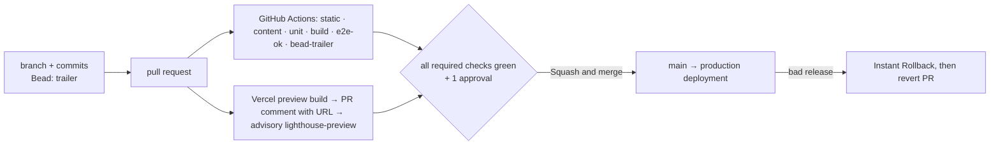

# 09 · Deployment, operations & content-editing workflow

## Purpose

This document says how the Green Pastures site gets from a pull request to parents' browsers and how it stays
there: the three environments and the Vercel project that hosts them, every environment variable and secret and
where each lives, the CI/CD path with its branch protection and rollback, and — the part a non-developer will
read — how the daycare owner or a translator changes text on the site by editing one JSON file in the browser,
seeing the change on a preview in every language, and getting it merged. That editor workflow is now also how
the owner supplies the facts the plan does not know: the sending domain, the inquiry inbox, the phone number,
the licence number and the teacher names all ship as **provisional sample defaults** registered in
`content/site.json`, and the launch gate refuses to launch while any of them is still a sample (02 `D-02.20`,
`INV-02.10`). The site has three locales — `en`, `zh-Hans`, `zh-Hant` (02 `D-02.1`) — so every "in both
languages" instruction below is now "in every enabled locale". It also covers monitoring, incidents, backups,
dependency updates, security, access, cost, the launch checklist and the post-launch runbook. It builds on 02
(the content contract: `D-02.2`, `D-02.14`, `D-02.18`–`D-02.21`, `INV-02.6`, `INV-02.10`, `INV-02.11`), 07
(§5 environment table, §3 WAF rule, §2 logs), 11 (`D-11.4`, `D-11.5`, `OQ-11.3`) and 01 (ADR-007 hosting).
Vendor claims are labelled `[verified: source, 2026-08-22]` or `[assumed — confirm]`.

Status: draft · seat writer-ops · 2026-08-22 · revised 2026-08-22 for HD-2 (repo protection), HD-3 (Hobby
plan, domain bought), HD-4 · HD-7 · HD-9 (provisional values), HD-8 (one editor entry point), HD-10 (three
locales) and HD-13 (the domain is `greenpasturesdaycare.com`). HD-14 (the human confirmed 03 `D-03.5`'s system
CJK stack) was read against this document and changes nothing in it: 09 never treated the typeface as an open
launch item, and checklist item 16 is a check on those system faces either way.

## Decisions

- **D-09.1 Three environments, one mapping.** *Local* (`pnpm dev`), *Preview* (one Vercel deployment per
  pull request, built by the Vercel GitHub integration) and *Production* (the deployment of `main` behind the
  custom domain). Any branch that is not `main` is a preview; `main` is production; there is no staging branch
  and no Vercel custom environment. `main` only receives squash merges of reviewed PRs (`INV-09.4`).
- **D-09.2 Vercel plan: Hobby at the start, Pro before the DNS cutover (HD-3, 2026-08-22).** The human
  answered the plan half of `OQ-09.1`: the project starts on the **free Hobby plan**, which is enough for
  Phases 2–7 (builds, previews, a `*.vercel.app` production URL) and costs nothing while the site is not yet
  public. Two consequences, recorded bluntly because both bite at launch rather than now.
  **(1) Hobby is non-commercial and this site is commercial.** The Hobby plan "restricts users to
  non-commercial, personal use only" [verified: Vercel Hobby plan docs, 2026-08-22]; a daycare's marketing
  site is a business's site. So **"upgrade to Pro, or confirm eligibility with Vercel in writing" is a launch
  checklist item that gates the DNS cutover** (§5.1 item 3a, which item 2 must not precede). The event that
  makes the account non-compliant is exactly the event that makes the site real, so the upgrade cannot be left
  to "later"; Pro is $20 per user per month for Developer/Owner seats [verified: same page].
  **(2) Hobby allows one WAF custom rule per project, and 07's rate limit is that one rule.** Hobby gets 1
  custom rule, Pro 40 [verified: Vercel WAF docs via 07 §3, 2026-08-22]; 07 §3 publishes exactly one
  (`POST /api/inquiry`, fixed window 10 min, limit 5). The budget is therefore *exactly* consumed: while on
  Hobby there is no room for a second rule — no bot filter, no geo-block, no temporary blanket block during an
  attack. Nothing is lost before the cutover, because the rule is production-scoped and previews never carry
  it (§1), but a spam incident before the upgrade has only one lever, and it is already pulled.
  What else is degraded while on Hobby, so no one is surprised mid-phase: no custom analytics events, so 07
  §4's `inquiry_submitted` / `inquiry_failed` never arrive; runtime logs kept 1 hour instead of 1 day and no
  log drains, so D-09.15's monitoring shrinks to what is on screen; Instant Rollback only to the immediately
  previous production deployment, not to any earlier one; and no second team member, which removes the owner's
  and the translator's Viewer access to previews — D-09.4's reviewer flow and §4's preview step do not work
  until the upgrade [verified: Vercel plan limits, 2026-08-22]. Every one of these is repaired by the same
  upgrade; none of them blocks development, which is the point of starting free. Billing owner, seat count and
  the budget cap stay open in `OQ-09.1`; 01's `OQ-01.4` reads the answer from here.
- **D-09.3 Vercel project settings.** Framework preset Next.js; Node.js 24.x (Vercel's default for new projects
  and pinned again by `engines.node` [verified: Vercel Node.js versions, 2026-08-22]); pnpm from the committed
  `pnpm-lock.yaml` and the `packageManager` field; install `pnpm install --frozen-lockfile`; build `pnpm build`
  (= `next build`); output directory default; Fluid compute on (default for new projects since 2025-04-23
  [verified: Vercel Fluid compute docs, 2026-08-22]); Function region `sfo1` (San Francisco — the one closest to
  Fremont; default would be `iad1` [verified: Vercel regions docs, 2026-08-22]) for the inquiry Route Handler;
  the next-intl proxy is Routing Middleware and Vercel places it in all regions regardless of that setting
  [verified: same page]; an Ignored Build Step skips commits that touch only `docs/**`, `.beads/**` and root
  `*.md` (which is why Vercel's deployment status is **not** a required check — §3). Never `output: 'export'`
  (memo ADJ-2, ADR-007).
- **D-09.4 Deployment Protection: previews are private, production is public.** *Standard Protection* with
  *Vercel Authentication* (available on all plans; protects every URL except production domains
  [verified: Vercel Deployment Protection docs, 2026-08-22]). Reason: previews run the real Resend transport to
  the test inbox and have no WAF rate-limit rule (07 §5), so they must not be open to the internet. Reviewers
  (owner, translator) are Vercel team members with the free Viewer role, which is enough to open protected
  previews [verified: Vercel Authentication docs, 2026-08-22]; a one-off reviewer gets a Shareable Link
  [assumed — confirm the feature and its plan at setup]. This is 09's answer to 08's `OQ-08.4`: yes, previews
  are protected, so the `lighthouse-preview` job — the only CI job that touches a preview URL (08 `D-08.7`) —
  gets *Protection Bypass for Automation* (`VERCEL_AUTOMATION_BYPASS_SECRET`) and sends
  `x-vercel-protection-bypass`. Previews also carry `X-Robots-Tag: noindex` automatically
  [verified: Vercel KB, 2026-08-22]. **On Hobby (D-09.2) there is no team and therefore no Viewer seat**: only
  the account owner can open a protected preview, so until the upgrade the developer is the only reviewer and
  the owner sees screenshots or a screen share. The owner's own preview review (§4.3 step 6) and the
  first-content-PR rehearsal (§5.1 item 19) begin once the project is on a Pro team. Owner confirms in OQ-09.3.
- **D-09.5 Domains — the site is `greenpasturesdaycare.com` (HD-13, 2026-08-22).** Both hosts are attached to
  the project: the apex `greenpasturesdaycare.com` and `www.greenpasturesdaycare.com`. **The apex is the
  canonical host** and `www` 308-redirects to it. That is 06's default (`D-06.11`, `OQ-06.2` — "apex
  canonical, `www` → apex at the Vercel domain level"), and 09 implements rather than re-decides it (HD-13
  leaves the form untouched and only supplies the name); the counter-argument is Vercel's own
  recommendation to prefer `www` (a CNAME on `www` gives the CDN more control; the apex cannot carry a CNAME
  and needs an A record) [verified: Vercel domains docs, 2026-08-22], which is why flipping is worth keeping
  cheap — it is one Vercel setting plus one environment value. The production origin is
  `NEXT_PUBLIC_SITE_URL` (07 §5), owned by 06 (`D-06.11`, parsed once in `src/config/site-url.ts`); 09 only
  sets it, in the Production scope, and holds no competing source of truth (`INV-09.6`) — HD-13 makes its
  production value concrete, `https://greenpasturesdaycare.com` (§2), which is a one-line Vercel edit and no
  code or content change (06 `D-06.11` says the same). TLS is automatic
  (Let's Encrypt, HTTP → HTTPS 308, HSTS `max-age=63072000` on custom domains
  [verified: Vercel encryption docs, 2026-08-22]). With the name supplied, what is left of OQ-09.2 is **who
  holds the registrar login** and which DNS host serves the zone — the human has not said, and item 2 cannot
  be done by anyone who cannot sign in. The host form is 06's `OQ-06.2`, which was open for the name only and
  which HD-13 answers; 06's seat records that closure, not 09. The fate of `site.json.brand.url` is OQ-09.10,
  unchanged by HD-13 — knowing the origin does not decide whether it has two homes.
- **D-09.6 Secrets live in Vercel only.** Every variable in §2 is set in the Vercel project (Production /
  Preview / Development scopes), pulled locally with `vercel env pull`, and listed by name in a committed
  `.env.example`; secrets are never in git, never in the Development scope, never in CI variables except the
  bypass secret (`INV-09.1`, `INV-09.2`). Changing a variable takes effect on the next deployment only
  [verified: Vercel env docs, 2026-08-22], so every rotation ends with a redeploy.
- **D-09.7 CI is GitHub Actions; Vercel builds.** Actions runs 08's gates on every PR — job names are 08's
  (`static`, `content`, `unit`, `build`, `e2e` behind the roll-up `e2e-ok`, and the advisory
  `lighthouse-preview`), plus 11's `bead-trailer`. Actions also produces the artifact the end-to-end tests run
  against: 08 `D-08.7` runs Playwright on a local production build, never on the preview. The Vercel GitHub
  integration builds the preview and posts the URL as a PR comment. No Actions workflow deploys anything
  (confirms `OQ-11.3`'s assumption of GitHub Actions).
- **D-09.8 Branch protection on `main`** (a ruleset the human applies — the concrete list is §3): PR required,
  one approving review, code-owner review, required checks = 08's required job names + `bead-trailer` and
  **not** the Vercel deployment status (D-09.3's Ignored Build Step means a docs-only PR never produces one;
  08's required `build` job is what keeps a broken build unmergeable), branches up to date before merge,
  linear history, squash-only with squash message source
  "Pull request title and description" (answers `OQ-11.3`; `D-11.5`, TRAP-11.14), no force-push, no deletion,
  no bypass for admins, head branches auto-deleted.
  **State as of 2026-08-22 (HD-2) — the intent is answered, the setting is not finished.** A repository
  ruleset named **"Main Protection"** exists and is enabled with `deletion`, `non_fast_forward` and
  `pull_request` (**0** required approvals), but its `conditions.ref_name.include` list is **empty**, so it
  matches **no branch**: `main` is currently unprotected and a direct push would succeed. `INV-09.4` is
  therefore a requirement, not yet a fact. Three things close the gap, all of them the human's to do in
  repository settings (seats never change repo settings): add `~DEFAULT_BRANCH` (or `refs/heads/main`) to the
  ruleset's include list; raise required approvals from 0 to 1 and add the remaining rules above (code-owner
  review, required status checks with "branches up to date", linear history, no bypass); and add
  **`bead-trailer` as a required check once that workflow exists on `main`** — it cannot be required before it
  has run, so it joins the list at the Phase 2 gate (10 PR-2.x, 11 §6), not now. §5.1 item 10 is the tick.
- **D-09.9 Release, rollback, hotfix.** A release *is* a squash merge to `main` — nothing else. Rollback is
  Vercel **Instant Rollback** to any earlier production deployment (on Pro; on Hobby only to the immediately
  previous one — D-09.2 [verified: Vercel rollback docs, 2026-08-22]) first, then a revert PR so `main` and
  production agree again. A hotfix takes the normal PR path
  with expedited review; there is no direct-push exception (`INV-09.4`). Production promotion stays automatic
  (every `main` deployment is promoted); after a rollback it is re-enabled with "Undo Rollback".
- **D-09.10 Non-developers edit content through GitHub's web editor and a pull request.** No CMS at launch
  (`D-02.14`, ADR-003). The repository ships `content/README.md` (the editor guide, §4.2), a default pull-request
  template whose last line is the `Bead:` trailer, and a `CODEOWNERS` file that makes the owner and the
  developer co-owners of `content/**` and `public/images/**`. Every content change is a PR with green gates and
  a reviewed preview (`INV-09.3`); the developer merges, or the owner merges when the developer authored.
  **One entry point (02 `D-02.18`, HD-8):** everything the owner ever edits is inside `content/` — words in
  `content/<locale>/`, facts once in `content/site.json`. The guide states that plainly and never sends the
  owner anywhere else; a fact that reads differently per language becomes a *localized value* in that same one
  file (02 `D-02.19`), not a copy in three language files.
- **D-09.11 Bead trailer for content and bot PRs.** A standing, human-assigned bead "content edits" (and a
  second one for dependency updates) satisfies 11's gate without the editor learning the tracker: the editor
  pastes one line (`Bead: <id>`) into the commit's extended description and the PR template supplies the same
  line in the body (`D-11.4`, W-11.8: a bead assigned `human` is a valid target while open). Ids are recorded
  in `content/README.md` once 11 creates them (OQ-09.5). Both standing beads must be created, **claimed, and
  exported into `.beads/issues.jsonl` on `main`** before the first editor or Renovate PR: 11 §6 item 2
  resolves the trailer against `git show <head>:.beads/issues.jsonl`, and 11 §5 would otherwise force a
  `chore(beads): sync tracker snapshot` commit into a PR a non-developer cannot make. Launch item 10 carries
  this.
- **D-09.12 Translation workflow — three locales (HD-10, 2026-08-22).** English is edited first and is the
  reference locale; the `content` gate's coverage report (`INV-02.6`) is the translator's to-do list and now
  has a column per Chinese locale, because parity is three-way and `en` is compared with `zh-Hans` and
  `zh-Hant` independently (`INV-02.2`) — a key missing from both is two lines on the list, not one. Each
  translation is added in the same PR (CI fails on missing keys, `D-02.8`) or in a follow-up PR the owner
  opens from the report; a committed `content/GLOSSARY.md` fixes brand and recurring terms in all three
  languages. Machine translation is never committed without a fluent human reading it (rule in the guide; not
  mechanically enforceable).
  **What "done" means for `zh-Hant`** — 09 follows 02, which decides the policy (`D-02.21`, `INV-02.11`):
  `content/zh-Hant/` is seeded **once, by hand**, by running OpenCC `s2t` (glyph conversion only — `s2twp` is
  rejected) over `content/zh-Hans/` and committing the result as ordinary content. Conversion is never a build
  step, a `package.json` script or a runtime transform, so nothing in CI or in this document re-runs it and no
  reviewer's edit is ever overwritten. Seeded is **not** done. Done = a named human has read every file and
  the locale passes parity with no `--warn-locale` demotion; only then does its id go into `routing.locales`.
  Until then `zh-Hant` sits in the tree, out of `routing.locales`, out of the sitemap, out of `hreflang` and
  out of the launch checklist's per-locale items — and `en` + `zh-Hans` launch without it. Who reviews it and
  which regional conventions govern word choice is `OQ-02.8` (answerer: human), which names 09 as affected;
  the honest default recorded there is that the review is post-launch work.
- **D-09.13 Menu cadence.** At launch the menu collection is a **rotating sample week** (the design labels it
  "Sample menu" and `menu.note` says the live menu is posted each Monday — at the daycare, not on the site),
  refreshed when the kitchen's rotation changes. A true weekly menu is one 15-cell JSON edit per week and is
  feasible; the owner decides in OQ-09.6.
- **D-09.14 CMS later, by ADR.** A git-backed CMS (first candidate to evaluate: Keystatic — reads and writes
  the same JSON files in the repository, runs as a route in the Next.js app, authenticates with GitHub; fallback
  Decap) is adopted by a new ADR in 01 when one of these happens: a second regular non-developer editor,
  editing cadence of weekly or more, or the owner answers `OQ-02.3` with "yes, in-browser editing". Schemas
  stay 02's; the CMS maps onto them (ADR-003).
- **D-09.15 Monitoring and alerting at launch.** Vercel runtime logs (1 day on Pro, **1 hour on Hobby and no
  log drains** — D-09.2 [verified: Vercel runtime logs docs, 2026-08-22]) carry the inquiry handler's
  structured lines (07 §2) and next-intl `MISSING_MESSAGE` reports (`D-02.8`); Vercel Web Analytics is on (Pro
  bills $0.03 per 1,000 events against the monthly usage credit [verified: Vercel analytics pricing,
  2026-08-22]; **custom events are a paid-plan feature, so 07 §4's `inquiry_submitted` / `inquiry_failed` do
  not exist while the project is on Hobby** and the first analytics figures worth reading start at the
  upgrade); Speed Insights is on for the first 90 days
  ($10 per project per month on Pro [verified: Vercel Speed Insights pricing, 2026-08-22]) and reviewed then;
  an external HTTPS uptime check runs every 5 minutes against `/en` and alerts the developer. No log drain and
  no client error SDK at launch (07 D-07.9); the upgrade path is OQ-09.7.
  The **provider** is not 09's to pick: Vercel Web Analytics + Speed Insights is the launch default (07
  `D-07.9`, memo ADJ-10) and the human answers `OQ-01.1` / `OQ-07.9`, with 09 wiring whatever comes back. Both
  defaults are cookieless, so nothing is required of the pages. An answer of GA4 adds work to 09 and to the
  content contract: a consent banner in **every enabled locale** (new keys in 02's `common.*`, three
  translations not two), consent-gated script loading, and a privacy-page section (OQ-07.5) — budget a bead
  for it rather than treating it as a settings toggle.
- **D-09.16 Backups.** Git on GitHub is the backup of the site and of all content; the inquiry inbox is the
  record of submissions (07 D-07.8); the tracker is backed up per 11 (`D-11.6`: committed `issues.jsonl`,
  `bd dolt push` once `OQ-11.1` is yes). No database exists to back up.
- **D-09.17 Dependency updates with Renovate.** Weekly grouped minor/patch PRs, majors one PR each, automerge
  off, `commitTrailers` and `prFooter` carrying the dependency bead's `Bead:` line so 11's gate passes
  (Dependabot cannot write a commit body, so it is not used). Next.js majors are upgraded by the developer
  with the official codemods when the pinned major leaves Active LTS (01 ADR-001). Security advisories are
  merged out of cycle.
- **D-09.18 Security headers.** Shipped from `next.config.ts` on every route: `Strict-Transport-Security`
  (Vercel's default, kept), `X-Content-Type-Options: nosniff`, `Referrer-Policy: strict-origin-when-cross-origin`,
  `Permissions-Policy: camera=(), microphone=(), geolocation=()`, and
  `Content-Security-Policy: frame-ancestors 'none'`. A full CSP is **not** shipped at launch: Next.js inline
  hydration scripts need nonces, nonces need per-request rendering, and every page is statically generated
  (`D-02.9`); a `Content-Security-Policy-Report-Only` allowlist (self, `challenges.cloudflare.com`, Vercel
  analytics hosts) is a post-launch task once a report endpoint exists.
- **D-09.19 Access control.** GitHub: owner = admin, developer = admin, translator = write (branches and PRs
  only; `main` is protected for everyone — once D-09.8's include list is fixed, which it is not yet); Vercel:
  owner = Owner, developer = Member, translator = Viewer — **these three roles exist only on a Pro team, so
  while the project is on Hobby (D-09.2) there is exactly one Vercel account and the developer holds it**;
  Resend and Cloudflare accounts belong to the daycare (owner's email) with the developer invited, never the
  reverse (07 §5, OQ-07.4). Two-factor authentication is required on all four.
- **D-09.20 Cost model** (monthly, before tax), in two phases because of D-09.2. **Before the cutover
  (Hobby):** Vercel $0, Resend free tier, Turnstile free, uptime check free tier — the only spend is the
  domain, already bought. **From the cutover (Pro):** Vercel Pro $20 per paid seat (1–2 seats) + Speed
  Insights $10 while on + analytics pennies at this traffic; Resend free tier (3,000 emails per month, 100 per
  day [verified: Resend pricing, 2026-08-22]); Turnstile free; domain renewal ≈ $10–20 per year [assumed];
  uptime check free tier [assumed]. Roughly $30–50 per month for the first quarter after launch, $20–40 after.
  OQ-09.1 still holds the budget cap and who pays.
- **D-09.21 The owner supplies the missing facts by replacing provisional values (HD-4 · HD-7 · HD-9,
  2026-08-22).** 02 owns the mechanism (`D-02.20`, *Provisional values*, `INV-02.10`); 09 owns the two places
  a human meets it — the editor guide (§4.2, §4.12) and the launch gate (§5.1 item 11). The operational shape:
  the sending domain, the inquiry inbox, the phone, the address, the licence number, the Yelp figures, the
  brand names and the three teacher names/credentials ship as **plausible sample defaults**, each registered
  by dotted path in the `provisional` array of `content/site.json` — **23 entries at Phase 3** (02's verbatim
  list). `pnpm validate:content` prints them and exits 0; `pnpm validate:content --release` **fails while the
  array is non-empty** and still fails on any literal `TODO`/`TBD`/`FIXME`/`XXX` under `content/`. Replacing a
  value is two edits in one file and no code change (§4.12). Consequences 09 must respect: there is **no
  runtime marker** — nothing on the rendered page says "this phone number is fake", so the coverage report is
  the only surface and the launch checklist must actually read it; and **no environment variable may become a
  second home for a provisional fact** (`INV-09.6`, extended by `OQ-09.11`) — the owner edits one file, not a
  file and a dashboard. This is also what closes §4.11's old complaint that the licence number `000000000`
  was invisible to a `TODO` scan: it is `provisional` entry 14, and `--release` names it.
- **D-09.22 Three documentation entry points, each pointing at the next.** Root `README.md` = the
  **developer's** first screen (what the site is, the stack, `pnpm install` / `pnpm dev` / the gate commands)
  and the signpost to the other two; `docs/technical/00-README.md` = the plan of record and its index;
  `content/README.md` = the **owner's and translator's** guide (§4.2) and the only document a non-developer
  needs. 09 does not own the root README — the file was stale Create React App boilerplate, is being replaced
  this round, and Phase 2 finishes it (10 PR-2.2, 00 `OQ-00.2`). 09's one requirement of it: **once
  `content/README.md` exists it must be linked from the root README**, because an owner who lands on the
  repository home page has to be one click from their guide; until it exists, the root README points at this
  document's §4, which is where the workflow is written. Wherever 09 says "the repository docs" it means these
  three files and nothing else — never `docs/design/**`, which is a handoff, not documentation for the owner.

## Design

### 1 · Environments

| | Local | Preview | Production |
|---|---|---|---|
| Trigger | `pnpm dev` | every push to a PR branch (Vercel GitHub integration) | squash merge to `main` |
| URL | `http://localhost:3000` | `<project>-git-<branch>-<team>.vercel.app` + per-commit URL, in the PR comment | `https://greenpasturesdaycare.com` (`www` redirects to the apex — D-09.5) |
| Access | developer's machine | Vercel Authentication (team Viewers and up — **Hobby has no team, so the account owner only**, D-09.2; Shareable Link for others; bypass header for CI) | public |
| Indexing | n/a | `X-Robots-Tag: noindex` set by Vercel | indexable; sitemap + `hreflang` per 06 |
| Env scope | `.env.local` from `vercel env pull` (Development scope) | Preview scope | Production scope |
| Inquiry form | `INQUIRY_TRANSPORT=log` prints the email to the terminal; Turnstile test pair | real Resend transport → **test inbox**; Turnstile test pair; no WAF rule | real inbox; real Turnstile keys; WAF rate-limit rule |
| Logs | terminal | Vercel runtime logs (filter `environment: preview`) | Vercel runtime logs — 1 hour on Hobby, 1 day on Pro |
| Locales served | all ids in `routing.locales` | all ids in `routing.locales`, incl. one still being filled under `--warn-locale` | only complete locales — `INV-02.11` removes an unfinished id from `routing.locales` |

Local setup (developer): `pnpm install`, `vercel link` (once), `vercel env pull .env.local` — which brings the
Development scope, i.e. the Turnstile test pair and nothing secret — then copy the single line
`INQUIRY_TRANSPORT=log` out of `.env.example` into `.env.local` by hand, because that variable is deliberately
never set in Vercel (§2) and therefore cannot arrive in a pull; then
`pnpm dev`. `.env.example` is the checklist of names; `.env.local` is git-ignored. `BEADS_DIR` is not an
application variable: it is exported in a shell that runs `bd` inside a worktree (11 W-11.12) and never
appears in `.env.*`.

Branch → environment mapping is the whole of D-09.1: `main` → production; everything else → preview. Vercel's
first deployment of a new project is always production [verified: Vercel environments docs, 2026-08-22], so
the project is created from a throwaway `main` state before the domain is attached (launch checklist).

Preview WAF scope: the one rate-limit rule (07 §3: `POST /api/inquiry`, key IP, fixed window 10 min, limit 5,
action 429) is published for production. Rate-limit counters are **per region**, so 5 per 10 minutes is
approximate — a visitor routed through two regions can exceed it (07 §3); the number is an anti-abuse floor,
not an accounting figure, and the handler behaves correctly with or without the rule. WAF custom rules are
project-wide and take effect without a redeploy [verified: Vercel WAF custom rules docs, 2026-08-22], so the
rule carries an `environment` condition set to `production` — a documented rule parameter
(`environment (preview | production)`) [verified: Vercel WAF custom rules docs, 2026-08-22] — with a
host-name condition as the fallback if the dashboard's rule builder does not expose it. Previews are
protected by Deployment Protection instead. On Hobby this one rule is the project's whole custom-rule budget
(D-09.2): it is published at launch item 8, by which time item 3a has moved the project to Pro, so the
constraint bites only if something needs a *second* rule before the upgrade.

### 2 · Environment variables and secrets

| Name | Kind | Development | Preview | Production | Owner | Set where | Rotation |
|---|---|---|---|---|---|---|---|
| `RESEND_API_KEY` | server secret | — (transport is `log`) | sending-only key, restricted to the sending domain | same, separate key | developer (Resend account = owner) | Vercel env, *Sensitive* | yearly; on leak; on offboarding |
| `INQUIRY_FROM_EMAIL` | server | — | verified sender | verified sender | owner (OQ-07.6) | Vercel env — **but see the note below: 02 now holds this as `site.json.email.fromAddress`** | when the mailbox changes |
| `INQUIRY_TO_EMAIL` | server | — | **test inbox only** | daycare inbox(es), comma-separated | owner | Vercel env — kept as the **per-environment override** of `email.notifyTo` / `contact.email` | on staff change |
| `INQUIRY_AUTOACK` | server flag | unset | `0` | `0` until OQ-07.2 says `1` | owner | Vercel env | n/a |
| `INQUIRY_TRANSPORT` | server | `log` (shipped in `.env.example`) | unset (= `resend`) | unset (= `resend`) | developer | `.env.example` only — never set in Vercel | n/a |
| `NEXT_PUBLIC_TURNSTILE_SITE_KEY` | public | test `1x00000000000000000000AA` (in `.env.example`) | test key | real site key | developer (Cloudflare account = owner) | Vercel env | with the secret |
| `TURNSTILE_SECRET_KEY` | server secret | test `1x0000000000000000000000000000000AA` | test secret | real secret | developer | Vercel env, *Sensitive* | yearly; on leak |
| `NEXT_PUBLIC_SITE_URL` | public | unset | unset (07 §2's origin check falls back to `VERCEL_*`; what `metadataBase` uses on a preview is 06's call — OQ-09.10) | `https://greenpasturesdaycare.com` — the one production origin (HD-13), 06 `D-06.11` | developer | Vercel env | when the domain changes |
| `VERCEL_AUTOMATION_BYPASS_SECRET` | system secret | — | set by Vercel on deployments; copied to a GitHub Actions secret for `lighthouse-preview` (08 OQ-08.4 — the only job that hits a preview URL) | — | developer | Vercel Deployment Protection settings | yearly; on leak |
| `VERCEL_ENV`, `VERCEL_URL`, `VERCEL_BRANCH_URL`, `VERCEL_PROJECT_PRODUCTION_URL` | system | — | set by Vercel | set by Vercel | — | automatic | — |

**The sending identity moved into content (HD-4, 02 `D-02.20`; samples per ADJ-24 / 07 `D-07.10`,
2026-08-22).** `content/site.json` now carries an `email` block — `sendingDomain` (sample
`mail.greenpasturesdaycare.com`), `fromAddress` (sample `no-reply@mail.greenpasturesdaycare.com`, display name
taken from `brand.name[locale]`) and optional `notifyTo` (defaults to `contact.email`, sample
`hello@greenpasturesdaycare.com`) — all of them provisional entries the owner replaces in the one file they
already edit. The samples are spelled on the domain HD-13 names so the owner can verify them in Resend without
first inventing a hostname. That spelling is a convenience, **not a derivation**: the sending domain is a value
of its own, nothing at runtime reads it from the site domain or from `NEXT_PUBLIC_SITE_URL`, and it stays
**provisional** until Resend verification, so `validate:content --release` blocks launch on it either way
(launch item 6, `INV-09.7`). 09's position, because two homes for one fact is how facts
drift (`INV-09.6`): the **from-address is content, not an environment variable**, so `INQUIRY_FROM_EMAIL`
should disappear rather than shadow `email.fromAddress`; `INQUIRY_TO_EMAIL` **survives**, not as a second
source of truth but as the one thing content cannot express — a *per-environment* override, because
`content/site.json` is identical in every deployment and a Preview build must never mail the real inbox.
Which of the two 07's handler actually reads, and in what precedence, is `OQ-09.11` (07's seat, with 02); this
table is annotated rather than rewritten until that lands.

Rules: the table is the complete list at launch (06 and 08 add nothing that reaches Vercel; CI-only values 08
needs are GitHub Actions secrets or variables and are listed in 08). `.env.example` carries every name with an
empty value except the two safe local defaults (07 §5); 08's `.env.example` completeness gate fails when a
`process.env.X` read in `src/**` has no line in `.env.example`. Rotation procedure (any secret): create the new
credential at the vendor → paste into the Vercel scope → redeploy production (env changes apply to new
deployments only) → send one real inquiry and see it arrive → revoke the old credential → note the date in the
runbook log (a dated list in `content/README.md`'s operations appendix is enough; no tool).

### 3 · CI/CD, branch protection, release



**Required checks on `main`** (08 §CI owns the list and the names; 09 lists the roles): `static` (types, lint,
CSS lint, formatting, token/`TODO`-in-source/env scripts), `content` (`pnpm validate:content`,
INV-02.2/3/4/8/10, three-way parity and the provisional block, with the coverage report attached to the PR —
this job **reports** provisional values and does not fail on them; only `--release` does, §4.11), `unit`,
`build` (`next build` plus the bundle secret grep — this is what makes a broken build unmergeable), `e2e-ok`
(the roll-up over the sharded `e2e` job; Playwright per locale — one row per id in `routing.locales`, so two
or three — against the **local production build** from `build`'s artifact, never the preview — 08 `D-08.7` —
including the not-found URL per locale, INV-02.5), and `bead-trailer` (11 §6, required from the Phase 2 gate
onward — see D-09.8).

Not required: `lighthouse-preview` is **advisory** on PRs (08's table) and becomes a gate only at launch as
`lighthouse-prod`; and Vercel's deployment commit status is deliberately left out, because D-09.3's Ignored
Build Step skips docs-only and `.beads/`-only commits and such a PR would then wait forever for a status
Vercel will never post. Build health is covered by the required `build` job instead. If the human wants the
Vercel status required anyway, the Ignored Build Step has to go with it — the two cannot both stand.

**Ruleset for `main`** (repository settings, applied by the human — OQ-11.3's action list): require a pull
request before merging · required approving reviews: 1 · dismiss stale approvals on new commits · require review
from code owners (`CODEOWNERS`: `content/** public/images/**` → owner + developer; everything else → developer)
· require status checks to pass with "require branches to be up to date" · require linear history · block
force pushes · restrict deletions · do not allow bypassing (admins included). Repository settings: allow
**squash merging only** (merge commits and rebase merging off); default squash message "Pull request title and
description" (one of GitHub's four options [verified: GitHub docs, 2026-08-22]); automatically delete head
branches. The bead-trailer gate's PR-body check (11 §6 item 3) is what keeps INV-11.1 true on `main`.

**What is actually configured today (2026-08-22, HD-2) — read this before assuming `main` is safe.** The
human has created the ruleset; it is not yet in force. Ground truth, and the delta:

| Rule | In the "Main Protection" ruleset today | Target (above) | Action |
|---|---|---|---|
| Branches the ruleset applies to | **none** — `conditions.ref_name.include` is empty | `~DEFAULT_BRANCH` | add it; **until then every rule below is inert and `main` accepts a direct push** |
| Restrict deletions | on | on | — |
| Block force pushes (non-fast-forward) | on | on | — |
| Pull request required | on, **0 required approvals** | 1 approval + dismiss stale + code-owner review | raise to 1, tick the two boxes |
| Required status checks | not set | 08's `static` · `content` · `unit` · `build` · `e2e-ok` + `bead-trailer` | add each **after its workflow has run once on `main`** — a check that has never reported cannot be selected |
| Linear history · no bypass | not set | both on | set both |
| Squash-only + squash message source | repository setting, not verified | squash only, "Pull request title and description" | set at the Phase 2 gate |

Two honest consequences. `INV-09.4` ("no direct push to `main`") is a **requirement, not a fact**, and stays
one until the include list is filled. And `bead-trailer` is deliberately last: it becomes a required check
**once that workflow exists on `main`** (Phase 2, 10 PR-2.x, 11 §6) — requiring it before its first run makes
every PR unmergeable. Repository settings belong to the human; no seat and no workflow changes them.

**Vercel Git settings:** production branch `main`; preview deployments for all branches; PR comments on;
GitHub Deployments on — the Vercel GitHub integration posts a GitHub deployment and its statuses for every
Vercel deployment [verified: Vercel for GitHub docs, 2026-08-22], so 08's `lighthouse-preview` job triggers on
GitHub's native `deployment_status` event, filters it to a Vercel **preview** deployment, and reads the URL
from `deployment_status.target_url`. There is **no relay endpoint**: no `src/app/api/vercel-dispatch/route.ts`,
no `repository_dispatch` hop, no PAT and no third Function — the only functions are the proxy and
`/api/inquiry`, which is what 06 `INV-06.7` / `D-06.1` require (memo ADJ-14).
Git fork protection on; Ignored Build Step
`git diff --quiet HEAD^ HEAD -- ':!docs/**' ':!.beads/**' ':(exclude,glob)*.md'` (exit 0 = skip). The `glob`
magic is what root-anchors the third pathspec: without it `*` matches `/` and `content/README.md` would be
excluded too.

**Release.** Merge = release. No tags, no release branches, no manual promotion. Every production deployment
therefore maps to exactly one squash commit, one PR and one `Bead:` id (`INV-09.5`); the Vercel deployment
shows the commit message, the PR number and the author.

**Rollback.** Production misbehaves → Vercel project → Instant Rollback → pick the last known-good production
deployment → Confirm (seconds; environment variables stay as they were at that build [verified: Vercel
rollback docs, 2026-08-22]). Then open a revert PR (`git revert` of the squash commit, normal gates) so `main`
matches production, merge it, and press "Undo Rollback" (or let the revert's deployment be promoted via
`vercel promote`) to restore automatic promotion. Content-only mistakes (a wrong sentence) are fixed forward
with a new content PR, not rolled back. A **bad firewall rule** is the third case and does not involve a
deployment at all: WAF configuration is versioned separately, so Firewall tab → audit log → pick the previous
configuration version → **Restore**, and it applies without a redeploy [verified: Vercel WAF docs,
2026-08-22]. Use this when a rate-limit change starts 429-ing real parents; then re-publish the corrected rule
in log mode first (launch item 8).

**Hotfix.** A bug bead (11 W-11.4), a branch from `main`, a PR reviewed within the hour, squash merge. The
only shortcut is the rollback above. Nobody pushes to `main`, including admins (`INV-09.4`).

### 4 · Content-editing workflow for non-developers

This is the section the daycare owner reads. It assumes a GitHub account (free), the Viewer role on the
Vercel team (free, but it needs the project to be on a Pro team — D-09.2/D-09.4; before the upgrade the
developer shares screenshots instead), and nothing installed. Technical background is in 02; this section
never restates its schema, it points at files.

**One folder.** Everything the owner or the translator ever edits is inside `content/` (02 `D-02.18`,
D-09.10). Words live in a language folder, facts live once in `content/site.json`, and nothing else in the
repository is theirs. If the answer to "where do I change this?" is not a path starting `content/`, the answer
is "ask the developer". A reader who arrives at the repository home page finds the root `README.md`, which
links here and to `content/README.md` (D-09.22).

#### 4.1 Who edits what

| Person | Edits | Does not edit |
|---|---|---|
| Owner (daycare) | English text in `content/en/**`; facts in `content/site.json` (hours, phone, inbox, sending domain, Yelp count, licence, order of teachers) and the `provisional` list as those facts become real (§4.12); photos in `public/images/**` | anything under `src/`, config files, `.github/`, `docs/`, the root `README.md` |
| Translator | Chinese text in `content/zh-Hans/**` (Simplified) and `content/zh-Hant/**` (Traditional); `content/GLOSSARY.md` | `content/site.json` — except `brand.name` / `brand.shortName`, which are the one *localized value* a translator may touch (02 `D-02.19`); English files, except to flag a problem |
| Developer | everything; reviews every content PR; fixes formatting or structure problems on the editor's branch; seeds `content/zh-Hant/` once with OpenCC `s2t` (02 `D-02.21`) | — |

Rule of thumb (02 `D-02.3`): if it is words, it is in a locale folder; if it is a number, a date, a URL, an image
path or a switch, it is in `content/site.json`; the validator refuses the opposite (`INV-02.4`). The one
deliberate exception is a fact that *reads* differently per language — the brand name — which stays in
`site.json` as an object with one entry per language rather than being copied into three language files
(02 `D-02.19`): still one place, still one edit.

**Three languages, not two (02 `D-02.1`).** `en` is the reference: every key exists in English first.
`zh-Hans` (Simplified) is the Chinese that ships at launch. `zh-Hant` (Traditional) is an additional language,
seeded once from Simplified by machine and then read by a human before it is switched on (D-09.12); while it
is being reviewed it may be absent from the site altogether, which is normal and blocks nothing.

#### 4.2 `content/README.md` — the editor guide the repository ships

A one-page guide at the top of the content tree, maintained by the developer and written for the owner. 10
schedules it with the first content PR. It must contain, in this order:

1. **"Where is the text for…"** — a table from what the owner sees to the file and top-level key, derived from
   02's coverage map (*Per-locale string homes*):

   | Screen / element | File (under `content/en/`, `content/zh-Hans/` or `content/zh-Hant/`) | Top-level key |
   |---|---|---|
   | Top bar, menu, footer links, "Book a tour", language switch | `messages/common.json` | `nav`, `footer`, `localeSwitcher` |
   | Home — hero headline, badge, buttons | `messages/home.json` | `hero` |
   | Home — philosophy quote, programs / menu / gallery / teachers intros, reviews line, visit block | `messages/home.json` | `philosophy`, `programs`, `menu`, `gallery`, `testimonials`, `teachers`, `visit` |
   | Philosophy page (principles, daily rhythm) | `messages/philosophy.json` | `principles`, `day` |
   | Programs / Menu / Gallery / Reviews / Team page chrome | `messages/<page>.json` | `kicker`, `heading`, `intro`, `footnote` |
   | Program cards (names, ages, descriptions) | `collections/programs.json` | one entry per program id |
   | Menu dishes and dietary chips | `collections/menu.json` | `week.<day>.<meal>`, `dietary` |
   | Teacher cards | `collections/teachers.json` | one entry per teacher id |
   | Parent reviews | `collections/testimonials.json` | one entry per review id |
   | Photo captions / alt text | `collections/gallery.json` | `photos.<id>` |
   | Inquiry form labels, errors, success message | `messages/visit.json` | `form` |
   | Emails the form sends | `messages/email.json` | `inquiry`, `autoReply` |
   | "Page not found" and "Something went wrong" pages | `messages/errors.json` | `notFound`, `serverError` |
   | Browser-tab titles and the Google search descriptions | `messages/<page>.json` and `messages/common.json` | `meta` in each page file (`meta.title`, `meta.description`); `common.meta` for the site name and title template |
   | FAQ questions and answers — **reserved, not built** at launch (02 `D-02.17`, HD-5); the files exist and are excluded from every check | `messages/faq.json` (page chrome) and `collections/faq.json` (the questions) | `kicker`, `heading`, `meta`; one entry per question id |
   | Hours, phone, email, address, Yelp rating and count, licence number, sending domain, image files, order of things | `content/site.json` (one file, no language) | `hours`, `contact`, `yelp`, `license`, `email`, `images`, `teachers`, … |
   | The daycare's name in each language | `content/site.json` → `brand.name`, `brand.shortName` | one entry per language inside the one field (02 `D-02.19`) |
   | Anything still showing a made-up sample value | `content/site.json` → `provisional` | the list of what is not real yet (§4.12) |

   Three things the table cannot show. **A key whose name ends in `Short` is the phone wording of the key next
   to it** (`subtitle` / `subtitleShort`, `intro` / `introShort` — 02 `D-02.13`): both exist in every language,
   the site picks one by screen width, and **changing one without the other leaves the old text on half the
   visitors' screens with no check to warn you**. Always fix the pair. The footer's year is computed at
   build time, not stored (02: `{year}` in `common.footer.copyright`) — there is nothing to update in January.
   And **the daycare's name is never typed into a sentence**: copy contains `{brandName}` / `{brandShortName}`
   and the site fills in the right language, so changing the name is one edit in `site.json` and every page
   follows (02 `D-02.19`, and the English footer prints the Chinese name beside the English one by itself).

2. **Seven rules:** change only the text between the quotes; keep every `{name}` and every `<em>…</em>` exactly
   as in English (they are filled in by the site); `\n` is a line break; every English change needs the same
   key in **each** Chinese file (the check tells you which, and lists Simplified and Traditional separately);
   never put numbers, phone numbers, links or file names in a
   language file — they go in `site.json`; never type HTML; and **JSON files have no comments — never add a
   `_comment` key** (02's rule; the validator rejects it). A note about a change belongs in the pull request,
   or in this guide.
3. **The one line to paste** into the commit's extended description and (already present) at the end of the
   PR: `Bead: <content-edits id>` (D-09.11).
4. **"Values that are not real yet"** — the provisional list, in the owner's words (§4.12): what a sample
   default is, where the list lives, how to replace one, and the plain statement that **the site cannot be
   launched until the list is empty**. This section is the owner's launch homework and the guide should carry
   the current list inline the day it is written, not a pointer to it.
5. **Recipes** 4.5–4.9 and 4.12 below, in the owner's words.
6. **Where to ask:** the developer's contact, and the PR itself (comments on the PR are the conversation).
7. **Operations appendix** (developer-facing, short): rotation log, last dependency review, uptime-check
   location.

#### 4.3 Editing a sentence, step by step (GitHub in the browser)

1. Open the repository on github.com → `content` → `en` → `messages` → the file from the table (say
   `home.json`). Click the **pencil** ("Edit this file").
2. Change the words between the quotes. Do not touch the key on the left of the colon, the quotes, the commas,
   or anything in `{…}` or `<…>`.
3. Click **Commit changes…**. Commit message: what changed in plain words ("Update hero subtitle"). In
   **Extended description** paste the `Bead:` line from `content/README.md`. Choose **Create a new branch for
   this commit and start a pull request**, keep the suggested branch name, click **Propose changes**.
4. On the next screen the PR description is pre-filled from the template (what changed · which screens · which
   languages · the `Bead:` line last). Fill the first three and click **Create pull request**.
5. If the same sentence has Chinese versions (it always does, unless the file is new): switch to your new
   branch (branch selector, top left of the file view), open the same file under `content/zh-Hans/messages/`,
   edit the same key, **Commit directly to the branch** — **paste the same `Bead:` line into the extended
   description again**, because every commit is checked, not just the first — and it joins the same PR. Then
   do it once more under `content/zh-Hant/messages/`, unless the developer has told you Traditional is still
   being reviewed and switched off (D-09.12), in which case the check will not ask for it. **There are three
   language folders and the check names each one separately**, so a sentence you change in English produces
   two lines on the to-do list, not one. If you cannot translate it, write the English sentence in the Chinese
   file for now and say so in the PR; the translator replaces it before merge (OQ-02.2 decides whether English
   may ship in a Chinese locale). If the key you changed has a `Short` twin, edit that too, in every language.
6. Within a few minutes the PR shows **checks** and a comment from Vercel with the **preview** link. Open it
   (sign in to Vercel once — this needs the project to be on a Pro team, D-09.4; before that the developer
   sends screenshots), look at `/en/…`, `/zh-Hans/…` and `/zh-Hant/…` for the screen you changed — desktop and
   phone. Two things to watch for on the preview: text in brackets like `⟦home.hero.title⟧` means that key is
   missing from **every** language file (check the spelling of the key you added), and an English sentence
   sitting on a `/zh-Hans/` or `/zh-Hant/` page means that language's key is missing and the site fell back to
   English (02 `D-02.8`) — add the key.
7. Green checks + the preview looks right → write "ready" in the PR. The developer (or the owner, when the
   developer wrote it) approves and presses **Squash and merge**. The site updates within about two minutes.
8. Red check → click **Details** next to the failed check, scroll to the red lines, and look the message up in
   §4.4. Something looks wrong on the preview → edit again on the same branch (repeat 1–3 choosing the branch,
   `Bead:` line each time); the preview rebuilds.

#### 4.4 What the checks say, in plain language

The `content` check prints one line per problem and names the language it is talking about; the report
attached to the PR (`INV-02.6`) lists the missing keys as a to-do list, with `zh-Hans` and `zh-Hant` counted
separately (02 `INV-02.2` compares English against each Chinese file on its own). The common ones:

| The check says | It means | What to do |
|---|---|---|
| `missing in zh-Hans: home.hero.subtitle` | English has a key Simplified Chinese lacks | add the key to `content/zh-Hans/…` (step 5) |
| `missing in zh-Hant: home.hero.subtitle` | the same key is also missing from Traditional | add it there too — the two are separate lines, and fixing one does not fix the other |
| `extra key in zh-Hans: home.hero.subtitel` | typo or leftover in that language | fix the spelling to match `en`, or delete it |
| `empty string: team.footnote (zh-Hant)` | `""` is not allowed anywhere | write the text, or remove the key in **every** language |
| `ICU arguments differ: reviews.countLine — en {count}, zh-Hans none` | a `{…}` placeholder was lost | put `{count}` back exactly. A placeholder English never had is always an error; one a translation drops is only a warning (02 `INV-02.2`), so read whether the line says *error* or *warning* |
| `rich tags differ: home.hero.title — en <em>, zh-Hans none` | an `<em>…</em>` was lost | wrap the same words in `<em>…</em>` |
| `invalid JSON: content/zh-Hans/messages/home.json:12` | a quote or comma is missing near line 12 | compare with the English file; the developer can fix it |
| `illegal escape: programs.footnote — "'{"` | an apostrophe sits directly before a `{`, which the message format reads as "start quoting" and silently eats the placeholder | put a space between them, or reword ("the child's {age}" → "the age of the child: {age}"); apostrophes anywhere else are fine |
| `HTML not allowed in value: home.visit.subtitle` | a tag other than the `<em>…</em>` the English already has was typed (`<br>`, `<b>`, `<a href…>`) | delete the tag; use `\n` for a line break, and ask the developer for a link or bold |
| `array length differs: philosophy.badges — en 3, zh-Hant 2` | a list lost or gained an item in one language | every language must have the same number of items, in the same order; add the missing one back |
| `teachers.lopez: required field missing — summaryShort, bioShort, photoAlt (zh-Hans)` | a collection entry (teacher, program, review, photo) is missing a field the site needs | open §4.6, copy an existing entry of the same kind as the shape to follow, and fill every field it has — including the `Short` ones and `photoAlt` |
| `locale-agnostic value in zh-Hans: "/images/…"` or a phone number | data in a language file | move it to `site.json`; keep only words in the language file |
| `brand name in content: "绿茵园" (zh-Hans home.gallery.title)` | a daycare name was typed into a sentence instead of using `{brandShortName}` | put the placeholder back; the name lives only in `site.json` → `brand` (02 `INV-02.4`, `D-02.19`) |
| `unknown id "lopez" in teachers.json (en)` | the id is not in `site.json` | add the entry to `site.json` → `teachers[]` first (§4.6) |
| `image not found: public/images/team/lopez.jpg` | the file name in `site.json` is wrong or the upload is missing | upload the file (§4.9) or fix the name |
| `provisional values (6 remaining): license · contact.phone · …` | **not an error** — a normal run listing the values that are still made-up samples | nothing today; before launch, replace each and delete its line (§4.12) |
| `provisional path does not resolve: yelp.rating` | a value was deleted but its line is still in the `provisional` list | delete the leftover line too — this one **does** fail the check, in every mode |
| `--release: 6 provisional values remain` | the launch gate refusing to launch a site with sample data in it | §4.12; nothing launches until this prints nothing |
| `warning (zh-Hant, --warn-locale): 12 keys missing` | a language is still being filled in and its gaps have been demoted to warnings on purpose | nothing — the developer set that flag; it is **ignored** at launch, so the language either gets finished or is switched off (02 `INV-02.11`) |
| `format` (Prettier) | spacing/indentation drifted | the developer runs `pnpm format` on your branch; nothing for you to do |

The `static`, `unit`, `build` and `e2e-ok` checks do not fail on text changes; if one does, the developer
looks. `lighthouse-preview` is advisory — an orange or failed Lighthouse run never blocks a merge. The
`bead-trailer` check fails with *"no Bead: trailer on commit …"* when the paste in step 3 or step 5 was
skipped — the developer rewords the commit on your branch; next time paste the line into every commit.

#### 4.5 Adding or changing a Chinese translation

Translator's path: open the latest coverage report (linked from the PR, or `reports/content-coverage.md` on
`main` after CI runs) → it has a section per language → for each missing key, open the file at the same path
under `content/zh-Hans/` (and under `content/zh-Hant/`, when that locale is switched on), add the key with the
Chinese text, keeping `{…}`, `<em>…</em>` and `\n` → commit to the PR's branch (or open a new PR from `main`
with the same steps) → the report on the next run shrinks. Style: full-width punctuation `，。：` (02 CJK
rules), the glossary's renderings for brand and fixed terms, no machine output unread.

**Traditional (`zh-Hant`) specifically.** The tree is seeded once by the developer, by hand, running OpenCC
`s2t` over the Simplified tree — glyph conversion only, no vocabulary substitution (02 `D-02.21`). That
produces files that are *readable*, not *finished*: `s2t` cannot know that a word choice natural in Simplified
reads oddly in Taiwan or Hong Kong, and it never touches punctuation conventions such as 「 」. So the
translator's job on `zh-Hant` is a **read-through**, not a re-translation, and the definition of done is 02's
(D-09.12): a named human has read every file, parity is clean without `--warn-locale`, and only then does the
id enter `routing.locales` and the locale appear on the site. Everything after the seed is ordinary content
work — nothing re-converts, so an edit is never overwritten. Who does the read-through and which regional
conventions win is `OQ-02.8`, still open; the default is that it happens after launch.

#### 4.6 Adding a teacher, a menu week, a review, a program

Collections need **two edits**: the shared entry in `content/site.json` (id, order, icon or photo, flags) and
the text entry with the same id in `content/en/collections/<name>.json` **and in each Chinese
`collections/<name>.json`** (02 *Checklists → Add a collection entry*). Concretely, a new teacher: in
`site.json` append
`{ "id": "lopez", "icon": "📚" }` to `teachers[]` at the position she should appear; in **each language's**
`teachers.json` add `"lopez": { "name": …, "credentials": …, "summary": …, "summaryShort": …, "bio": …, "bioShort": …,
"tags": [ … ], "photoAlt": … }` — all eight fields are required (02 *Collections*), the two `Short` ones are
the phone wording, and `photoAlt` is what a screen reader and a broken image show, so it is required even for
a teacher who has an emoji instead of a photo. Leaving any of them out fails the `content` check with the
field name (§4.4, last row). If she has a photo, upload it (§4.9) and use
`"photo": { "src": "/images/team/lopez.jpg", "width": 800, "height": 800 }` in `site.json` instead of `icon`.
Removing: delete from `site.json` and from every language's `teachers.json`. Reordering: move the entry in
`site.json` only. A menu week is the 15 dish cells `week.<mon…fri>.<breakfast|lunch|snack>` in each language's
`menu.json` — no `site.json` change. A review is `site.json` → `testimonials[]` (`id`, `rating`, `sourceUrl`,
`onHome`, `onMobile`) plus `quote`/`author`/`relation` in every language.
**The three teachers who ship with the site are samples**, not real people: their names and credential lines
are provisional values (§4.12), so replacing them is an edit here *plus* deleting six lines from the
`provisional` list.

#### 4.7 Changing hours, phone, Yelp count, licence, the inbox, links

One file, no language: `content/site.json`. `hours.open` / `hours.close` are 24-hour `"07:30"` / `"18:00"`
(the site formats them per language — never type "7:30 am" into a language file). There is **one** opening
and closing time and it applies to every weekday in `hours.days` (02's shape): a Friday-only or per-day
exception has no field to go in and is a developer change — ask, do not improvise. `contact.phone` (the
dialling form, `+15105550142`) and `contact.phoneDisplay` (what the page prints, `(510) 555-0142`) are a pair
and both must change; then `contact.email`, `contact.address`, `contact.mapsUrl`; `email.sendingDomain` and
`email.fromAddress` (the address the tour-request e-mails come *from* — it must be on a domain verified with
Resend, §5.1 item 6, so change it with the developer); `yelp.rating`, `yelp.reviewCount`, `yelp.url`;
`license`; `social.*`. A wrong type (letters in a number) fails the `content` check with the field name.
**Most of the values in this paragraph ship as samples**, so almost every edit here is also a §4.12 edit.

#### 4.8 What not to edit

Anything under `src/`, `public/` other than `public/images/`, `package.json`, `pnpm-lock.yaml`,
`next.config.ts`, `.github/`, `.beads/`, `docs/`, and in `site.json` the `routes[]`, `nav`, `menu.days`,
`menu.meals` and `ages` blocks (they are structure, not facts). Keys (left of the colon) are never renamed by
editors. **No `_comment` keys**, in any JSON file: JSON has no comment syntax, a `_comment` key is a real key
the validator rejects (02's JSON-style rule), and the place for an explanation is the pull request or
`content/README.md`. If a change seems to need one of these, it is a developer PR.

#### 4.9 Images

Put the file in `public/images/<area>/` (`hero/`, `philosophy/`, `team/`, `gallery/`, `map/`) through GitHub:
open the folder on your branch → **Add file → Upload files** → drag the file → commit to the branch, pasting
the `Bead:` line into the extended description as in step 3 (this is a commit like any other and the check
looks at all of them). Then
reference it in `site.json` with its pixel `width` and `height`, and add the `alt` text in every language (the
`content` check insists on all of them). Sizes that keep pages fast (the site resizes per device with `next/image`):
hero and philosophy photos ≤ 1,600 px wide, gallery photos ≤ 1,200 px on the long edge, teacher portraits
800 × 800, JPEG or WebP, ≤ 400 KB each; file names lowercase with hyphens; replace a photo by uploading under
the same name.

#### 4.10 Glossary and brand consistency

`content/GLOSSARY.md` (translator-owned, developer-reviewed) lists each fixed term once with its rendering in
all three languages: "Montessori" ↔ 蒙特梭利, the program names, the six navigation words as the design
renders them (`docs/design/desktop/Green Pastures - Homepage.dc.html`, `I18N` table, Simplified: Philosophy
教学理念 · Programs 课程班级 · Menu 餐点 · Gallery 相册 · Reviews 家长评价 · Our Team 我们的团队 · Book a
tour 预约参观 — every Chinese gloss in that table is `zh-Hans`, and the Traditional column is filled in when
`zh-Hant` is reviewed), "Fremont, CA" ↔ 加州弗里蒙特, and credential acronyms that stay Latin (AMS).

**The brand name is not a glossary entry — it is data.** It lives once in `content/site.json` as
`brand.name` / `brand.shortName`, each an object with one entry per language (`en` "Green Pastures Montessori
Daycare", `zh-Hans` 优朵幼儿园, `zh-Hant` 優朵幼兒園 — 02 `D-02.19`, answering OQ-02.4). Copy never contains
it: messages carry `{brandName}`, `{brandShortName}` and, in the footer, `{brandNameOther}` for the paired
language, so the English footer prints both names without any locale branching. `brand.nameZh` and
`{brandNameZh}` no longer exist. Two consequences for the glossary and the translator: the rejected candidate
**绿茵园 must not reappear anywhere in copy** (the validator hunts brand-name strings inside `content/<locale>/**`,
02 `INV-02.4`) — the prototype's gallery title 绿茵园的生活 is re-authored as `{brandShortName}的日常`; and the
Chinese name is **provisional** (§4.12), so changing it is one edit in `site.json` plus deleting its
`provisional` lines, and nothing else in the repository mentions it. The glossary should say exactly that
instead of listing the name.

#### 4.11 Review, approval and cadence

- Every content PR is reviewed by the other code owner (owner ↔ developer) before merge; the translator's PRs
  are reviewed by the owner for meaning and by the developer for structure. No self-merge of unreviewed text.
- Expected cadence: hours/contact/teachers/programs — a few times a year; reviews/Yelp count — monthly at
  most; menu — per D-09.13 (rotation changes) or weekly if OQ-09.6 says so; translations — whenever the report
  is non-empty. A content PR takes the owner about ten minutes end to end once the preview is up.
- The `--release` gate (`pnpm validate:content --release`) runs manually before launch and, after launch, on
  every PR (a repository variable flips it on at launch) so placeholders cannot return. **What it checks
  changed on 2026-08-22 (HD-9, 02 `D-02.20` / `INV-02.10`):** it no longer looks for the string `"TODO"` in
  five named fields — it **fails while `content/site.json`'s `provisional` array is non-empty**, listing every
  path still in it, and additionally fails on any literal `TODO`/`TBD`/`FIXME`/`XXX` value anywhere under
  `content/`. That is strictly stronger, and it repairs the hole this section used to record: the licence
  number `000000000` is a plausible string with no `"TODO"` in it, so the old gate was blind to it; it is now
  `provisional` entry 14 and the gate names it. `--release` also refuses a locale that is in
  `routing.locales` with parity gaps, ignoring `--warn-locale` (02 `INV-02.11`) — which is what lets
  `zh-Hant` be built in the open without holding up launch. The residue for item 11a is no longer a missing
  check but an unverifiable one: emptying the list is the owner *asserting* each value is real, and no
  software can confirm that.

#### 4.12 Replacing a value that is not real yet (the provisional list)

The site ships with a working phone number, address, inbox, licence number, Yelp rating and three teachers —
none of them real. They are **sample defaults** (02 `D-02.20`, HD-4/HD-7): plausible on purpose, so previews
and layouts look honest and the owner edits a value instead of inventing one from a blank field. Because a
convincing fake is exactly what a machine cannot spot, every one of them is listed by name in one place, and
**the site cannot be launched until that list is empty**.

Where the list is: `content/site.json`, a block called `provisional`, near the bottom. It starts with **23
entries** (02 prints the full set verbatim, in *Provisional values*), each one a path to a value elsewhere in
the same file — or, for the teachers, in the collection files. Shortened here to show the shape:

```json
{
  "provisional": [
    "brand.url", "brand.name.zh-Hans", "contact.email", "contact.phone", "contact.phoneDisplay",
    "contact.address.street", "email.sendingDomain", "license", "yelp.rating",
    "collections.teachers.ping.name"
  ]
}
```

Replacing one, as the owner does it (this is the whole procedure — there is no second step somewhere else):

1. Open `content/site.json` on github.com and click the **pencil**. Read the `provisional` list top to bottom
   and pick one line, say `"license"`.
2. Scroll up to the field with that name — `"license": "000000000"` — and type the real number between the
   quotes. A dotted path is a route through the file: `contact.phoneDisplay` means the `phoneDisplay` field
   inside the `contact` block; `brand.name.zh-Hans` means the Simplified entry inside `brand` → `name`.
   Teacher names are the one exception — `collections.teachers.ping.name` lives in each language's
   `collections/teachers.json`, so that one is edited in three files, then cleared here once.
3. **Delete the `"license",` line from the `provisional` list**, keeping the commas around it valid (no comma
   after the last entry). This is the step people forget; the check will remind you.
4. Commit with the `Bead:` line as in §4.3 step 3, and open the PR. The `content` check prints what is still
   provisional and passes — a shorter list is progress, not an error.
5. Repeat whenever a real value arrives. There is no deadline until launch, and no rush: the site works with
   the samples, it just may not go live with them.

Two special cases. **Deleting instead of replacing:** if the daycare has no Yelp page, delete the whole `yelp`
block and its three `provisional` lines — an optional block that is gone is not provisional. **A value you
never change:** if a sample turns out to be right (unlikely, but the brand name may be confirmed as-is),
delete its line anyway — the list means "not yet confirmed", and confirming is the act.

How to see what is left, without reading the file: every PR's `content` check prints a **provisional values**
block (path · current value · file), and the same block is in `reports/content-coverage.md`. Before launch the
developer runs `pnpm validate:content --release`, which **fails** while anything remains and prints the
remaining paths; that failure is the launch gate (§5.1 item 11). Nothing on the live site ever marks a
provisional value — there is no yellow badge, no "sample" watermark — so this list and that report are the
only places the truth is visible. That is the trade HD-9 accepted for having real-looking previews.

### 5 · Operations

**Monitoring.** Daily/weekly look at: Vercel Logs filtered `level:error` and route `/api/inquiry` (07's
structured events: `inquiry.spam`, `email_failed`, `turnstile_unavailable` — the retention window is 1 hour
while the project is on Hobby and 1 day from the upgrade, D-09.2, so "daily" is the honest cadence only after
the cutover); Web Analytics (page views per locale — three locales once `zh-Hant` is enabled — plus the
`inquiry_submitted` / `inquiry_failed` events from 07 §4, which exist only on a paid plan); Speed Insights
(Core Web Vitals per route, first 90 days); the uptime check's status page. Alerting at launch = the uptime
check's email/SMS (site down
or `/en` not 200) and Vercel's own deployment-failed emails to the developer. Error-level log lines do not page
anyone at launch; OQ-09.7 decides the first upgrade (a log drain to a hosted log service with an alert rule on
`level:error` and `event:email_failed`, or Sentry for the client — 07 §6 already scopes it). Standing
constraint on everyone who reads, screenshots, pastes or exports these logs: **the lines carry no personal
data by design** (07 `INV-07.5` — no parent name, email, message, IP or Turnstile token), and nothing may be
added that would change that, including a "just for debugging" field, a drain to a service that would then
hold it, or a support ticket pasted with a request body.

**Incident basics.**

| Symptom | First action | Then |
|---|---|---|
| Site down / 5xx on `/en` | Instant Rollback to the last good deployment (§3) | revert PR; read the failed deployment's logs |
| Form returns `email_failed` | check Resend status and the API key's validity; direct-contact fallback is already on the page (07 D-07.5 `noscript` + banner) | rotate the key if revoked; redeploy |
| Form returns `turnstile_unavailable` | Cloudflare status; the handler fails closed by design (07 §2 step 5) | nothing to roll back; wait, then verify with one real submission |
| Spam burst | confirm the WAF rule is live and counting (Firewall tab); tighten to 3 / 10 min temporarily | consider the Upstash limiter (07 §3 upgrade path). **On Hobby there is no second custom rule to add** (D-09.2) — tightening the existing one is the only lever until the plan is upgraded |
| Real parents getting 429s after a firewall change | Firewall tab → audit log → **Restore** the previous configuration version (no redeploy, seconds — §3) | re-publish the corrected rule in log mode first and watch it for a day |
| Wrong text live | fix-forward content PR | — |
| Secret leaked (key in a log, a screenshot, a commit) | rotate at the vendor first (old key dead), then Vercel, then redeploy | note in the rotation log; if a commit, the developer rewrites history on the branch before merge — never on `main` |

**Backups.** Git on GitHub holds every version of every string and image; a deleted file is a `git revert`.
Vercel keeps previous deployments (rollback targets). The inbox keeps inquiries (07 D-07.8; Resend's own copy
retention is OQ-07.4). The tracker: 11 `D-11.6` (`issues.jsonl` committed; `.beads/backup/`; Dolt push after
`OQ-11.1`). Nothing else holds state.

**Dependency updates (D-09.17).** `renovate.json`: schedule "before 6am on Monday"; `packageRules` grouping all
minor and patch updates into one PR ("deps (non-major)"), each major alone; `lockFileMaintenance` monthly;
`automerge: false`; `commitTrailers: ["Bead: <deps id>"]` and `prFooter` with the same line so `bead-trailer`
passes (Renovate options `commitBody`/`commitTrailers`, `prFooter` [verified: Renovate configuration options,
2026-08-22]); Next.js, React and next-intl majors get the `next-upgrade` codemod treatment by the developer
and a bead of their own. Quarterly, the developer merges what Renovate has queued and re-runs Lighthouse.

**Security.** Headers per D-09.18; secrets per D-09.6 and the rotation procedure in §2; Turnstile + WAF per
07; Deployment Protection per D-09.4; two-factor on GitHub, Vercel, Resend, Cloudflare; the Resend key is
sending-only and domain-restricted (07 §5); `robots` disallows `/api/` (06); no third-party script beyond
Turnstile and Vercel analytics (07 INV-07.8). Access list and roles per D-09.19, reviewed when anyone joins or
leaves; offboarding = remove from GitHub and Vercel the same day and rotate both secrets.

**Cost (D-09.20).** Nothing until the upgrade: Hobby is free. From the cutover — fixed: Vercel Pro seats;
Speed Insights while enabled. Variable but negligible at a daycare's traffic: Vercel usage (edge requests,
function invocations, image transformations — the Pro monthly usage credit covers them), Web Analytics events.
Free throughout: Resend (≤ 100 emails per day — an inquiry volume a daycare will not exceed; alerts if it ever
does), Turnstile, GitHub (public or private repo), Renovate, the uptime check's free tier. Budget and billing
owner: OQ-09.1.

#### 5.1 Launch checklist (each item has an owner; done = ticked in the launch PR's description)

The numbers are labels, not an order. Two orderings are load-bearing: **3a comes before 2** (the plan must be
commercial-eligible before the domain points at it), and **10's required checks come after their workflows
have run on `main`** (§3).

1. Domain: **bought and named — `greenpasturesdaycare.com`** (HD-13, 2026-08-22). What HD-13 supplies is the
   **site** domain, and that settles `NEXT_PUBLIC_SITE_URL` (`https://greenpasturesdaycare.com`), item 2's DNS
   records and the cutover target, item 7's Turnstile hostnames, and item 13's Search Console property,
   sitemap and `hreflang` — all now written out concretely. It does **not** settle two things that read as
   domain-shaped and are not: `site.json` → `brand.url`, still the provisional sample
   `https://greenpastures.example` until OQ-09.10 decides whether it survives at all (item 11), and item 6's
   **sending** domain. That one now *reads* like the site domain — its sample is `mail.greenpasturesdaycare.com`
   (ADJ-24, 07 `D-07.10`), chosen so the owner can verify a real hostname in Resend rather than a `.example`
   stand-in — but the resemblance is spelling, not derivation: it is a separate value, nothing computes it from
   `NEXT_PUBLIC_SITE_URL` or from this item, it stays **provisional** until Resend verification (item 6), so
   `--release` still blocks launch on it, and OQ-09.11 (variable versus content precedence) stays open.
   **What is still outstanding here is access, not identity:** who holds the **registrar login** — and
   the DNS host, if it is not the registrar — which the owner supplies (OQ-09.2), with the developer invited
   there before item 2 can be attempted at all.
2. DNS, at the registrar or DNS host for **`greenpasturesdaycare.com`**: apex `greenpasturesdaycare.com` A
   record → Vercel's value as shown on the project's domain card (documented value `76.76.21.21`
   [verified: Vercel KB, 2026-08-22]); `www.greenpasturesdaycare.com` CNAME → Vercel's target; both hosts
   added to the Vercel project; **`www` → apex** 308 redirect set and the apex marked primary
   (D-09.5 / 06 `OQ-06.2`); certificate issued (automatic). This is the cutover: before it the site answers
   only on `*.vercel.app`, after it `https://greenpasturesdaycare.com` is the production origin every
   canonical, `hreflang` and sitemap URL uses. **Do not do this before 3a.**
3. Vercel project settings per D-09.3 (Node 24, pnpm, region `sfo1`, Fluid, Ignored Build Step); production
   branch `main`; first production deployment made before the domain is attached. The project is created on
   the free **Hobby** plan (D-09.2) and stays there through development.
   3a. **Plan upgraded to Pro — or eligibility for Hobby confirmed with Vercel in writing — before the DNS
   cutover (item 2).** Hobby is licensed for non-commercial personal use and this is a business's site
   (D-09.2). Ticking this item also restores, in one step, the five things Hobby withholds: custom analytics
   events (item 12), 1-day log retention (D-09.15), rollback to any earlier deployment (§3), a second WAF rule
   (item 8), and team seats for the owner and translator (item 4). Record who owns the billing against
   OQ-09.1.
4. Deployment Protection per D-09.4; owner and translator invited (Viewer — needs 3a done); bypass secret
   generated and copied to the GitHub Actions secret used by `lighthouse-preview` (08 OQ-08.4 answered yes).
5. Production and Preview environment variables per §2, Preview `INQUIRY_TO_EMAIL` = test inbox, no secret in
   Development; `.env.example` complete (08 gate green).
6. Resend: account owned by the daycare; sending domain verified with the three records Resend shows, entered
   at the DNS host by name — DKIM `TXT` at `resend._domainkey`, Return-Path `MX` at `send` →
   `feedback-smtp.<region>.amazonses.com` priority 10, and the SPF `TXT` at `send`
   [verified: Resend domain docs, 2026-08-22]; a DMARC `TXT` at `_dmarc` is recommended, not required for
   verification, and is worth adding; the from-address on that domain; retention setting reviewed (OQ-07.4).
   **The domain and the from-address are now content, not invention:** `site.json` → `email.sendingDomain` and
   `email.fromAddress`, shipped as the samples `mail.greenpasturesdaycare.com` /
   `no-reply@mail.greenpasturesdaycare.com` (ADJ-24, 07 `D-07.10`) and replaced by the owner in the same edit
   that clears their `provisional` entries (§4.12). The samples sit on the site's own domain only so that the
   owner has something they can actually add to Resend; the sending domain remains a **separate value** that
   nothing derives from the site domain, and it is **provisional until this item passes** — a recognisable
   hostname is not a verified one, and `--release` keeps blocking launch until the owner replaces the value and
   clears the marker. Verify in Resend exactly the domain that file names — a mismatch between the
   verified domain and `email.fromAddress` is the classic silent bounce.
7. Turnstile: widget created with the production hostnames only (`greenpasturesdaycare.com` and
   `www.greenpasturesdaycare.com` — both hosts, as the placeholder already required), managed mode; real site
   key and secret in the Production scope; test pair stays in Preview/Development.
8. WAF: rate-limit rule published with 07's values, scoped to `environment: production`; observed once in log
   mode first (Vercel's recommended practice). Vercel shows a **Rate Limiting Pricing** dialog on a project's
   first rate-limit rule — read the per-rule pricing, accept it deliberately, and record what it said next to
   OQ-09.1's budget; the rule cannot be saved until someone does. This rule is the *only* custom rule the
   project has while on Hobby (D-09.2); after 3a there is room for 40, so any second rule waits for the
   upgrade rather than displacing this one.
9. Security headers present on `/en` (curl) per D-09.18; HSTS present; no `X-Robots-Tag: noindex` on
   production.
10. Branch protection: the "Main Protection" ruleset **actually applies to `main`** — its include list
    contains `~DEFAULT_BRANCH`, approvals raised from 0 to 1, and the remaining rules of §3's delta table set;
    repository merge settings per §3; `bead-trailer` workflow live on `main` (11 §6) **and then** added to the
    required checks. Verify, do not assume: `gh api repos/<owner>/<repo>/rules/branches/main` must return the
    rules, not an empty list — an enabled ruleset with an empty include list protects nothing (D-09.8, HD-2).
    Also merged: CODEOWNERS, PR template, `content/README.md`, `content/GLOSSARY.md`, `renovate.json` and the
    replaced root `README.md` (D-09.22 — it links to `content/README.md` and `docs/technical/00-README.md`,
    and no Create React App text survives); the two standing beads (D-09.11) created, claimed, `bd export`ed
    and their `.beads/issues.jsonl` committed on `main`, with their ids written into the PR template,
    `content/README.md` and `renovate.json`.
11. Content: `pnpm validate:content --release` green. That gate now means two things (02 `INV-02.10`,
    `INV-02.11`): **`content/site.json`'s `provisional` array is empty** — all 23 sample defaults replaced or
    their optional blocks deleted, which covers the inbox, sending domain, phone, address, licence number,
    Yelp figures, brand names and teacher names in one check (§4.12) — and **every locale in
    `routing.locales` has complete parity**, with `--warn-locale` ignored, so a Chinese locale either ships
    finished or is not in the list. Practically: the `zh-Hans` coverage report is empty (or OQ-02.2 explicitly
    allows the remainder); `zh-Hant` is either reviewed and enabled or removed from `routing.locales` with its
    directory left in place (D-09.12, OQ-02.8) — its absence is not a launch blocker; the Chinese brand name
    is confirmed (OQ-02.4 chose 优朵幼儿园 provisionally, so this tick is the confirmation); real Yelp figures
    and URL, or the block deleted (OQ-07.7); `NEXT_PUBLIC_SITE_URL` set in the Production scope to the
    canonical origin — `https://greenpasturesdaycare.com`, no trailing slash, apex not `www` (HD-13, 06
    `D-06.11`) — and `brand.url` reconciled with it (OQ-09.10).
    11a. **By eye, not by gate:** emptying `provisional` is the owner *asserting* each value is real — no
    check can verify that the number typed in is the daycare's number. Before ticking, the owner re-reads the
    23 replaced values against their own records — licence number, phone, address, inbox, Yelp figures,
    teacher names and credentials — and says so in the launch PR. This is what item 11a is for now that the
    licence number is covered by the gate (§4.11).
12. Analytics: Web Analytics and Speed Insights enabled on the project; events appear from a preview — custom
    events need 3a done, so check this after the upgrade, not before (D-09.15).
13. SEO: `robots.txt` and `/sitemap.xml` served from production (06); Search Console property verified for
    `greenpasturesdaycare.com` (the apex — the canonical host, D-09.5); the sitemap submitted once — it lists
    **every enabled locale** with alternates (7 page routes × 3
    locales = 21 URLs if `zh-Hant` is on, 14 if it is not; 02 `D-02.9`, 06 `D-06.12`); `hreflang` spot-checked
    on `/en` and `/zh-Hans` (and `/zh-Hant` when enabled), including the `x-default` → `en` entry.
14. Redirects from the previous site's URLs, if the old site had any indexed paths (OQ-09.8; the former site
    was a single-page CRA build, so the expected answer is "none beyond `/`").
15. First real-key Turnstile submission in production: one inquiry from a phone on mobile data **in each
    enabled locale** → arrives in the real inbox, `reply_to` is the parent, the from-address is the one
    `email.fromAddress` names, and the templates render in that language, with the "preferred language" line
    showing the right endonym (English / 简体中文 / 繁體中文 — 02 `LOCALE_META`). Then check the **Preview test
    inbox received nothing** from those submissions — if it did, Production is still holding the Preview
    `INQUIRY_TO_EMAIL` and item 5 is wrong.
16. Lighthouse on the production URL for `/en` and `/zh-Hans` (and `/zh-Hant` when enabled) meets 08's
    thresholds; axe pass on home and the form states (08); manual keyboard walk-through of the form in every
    enabled locale; `https://greenpasturesdaycare.com/en/nope`, `/zh-Hans/nope` (and `/zh-Hant/nope`) each
    return a localised 404 page in that locale (INV-02.5), not an English one and not a Vercel error page.
    Also open one Chinese
    page in each script and confirm the glyphs are right for the locale — Traditional pages rendering
    Simplified forms means 03's CJK stack is missing its `TC` faces, not a content bug.
17. Uptime check created against `https://greenpasturesdaycare.com/en`; alert recipients confirmed; Vercel
    deployment notifications on for the developer.
18. Instant Rollback dry run: the developer has located the button and read §3 once; `vercel` CLI linked locally.
19. Owner walk-through of §4 with one real edit merged to production (the first content PR is the rehearsal).
    Make it a §4.12 edit — replacing a provisional value and deleting its line — so the rehearsal doubles as
    the first tick against item 11. Needs 3a done for the owner to open the preview (D-09.4).
20. Privacy page live if OQ-07.5 says it is required; Turnstile notice under the form present (07 §4).
21. **Owner signs off**: a final line in the launch PR's description — "Launched by `<name>` on `<date>`; items
    1–20 ticked" — written by the owner, not the developer. Nothing is "launched" until that line exists; it is
    also the date the Speed Insights 90-day review (D-09.15) and the first quarterly review count from.

#### 5.2 Post-launch runbook

**Day 1** (the developer, with the owner reachable), before the cadence below starts:

1. Watch Vercel Logs live for the first hour and again at the end of the day, filtered `level:error` — a
   misconfigured key shows up here first.
2. Confirm the **first real inquiry from a stranger** arrived, and reply to it from the inbox, not from the
   dashboard: that proves `reply_to` as well as delivery.
3. Search Console → Coverage/Pages: no errors on the submitted sitemap, every enabled locale discovered;
   re-submit once if the fetch failed.
4. Open the site on a real phone on mobile data, in every enabled locale, and walk home → one subpage → the
   form.
5. Check the uptime monitor actually fired at least one successful probe, and that its alert address is a
   mailbox someone reads.

| When | What | Who |
|---|---|---|
| Weekly | glance at Logs (`level:error`), the inbox, and open content PRs | developer / owner |
| Monthly | merge Renovate's grouped PR; skim Web Analytics per locale; Yelp count refresh if changed | developer / owner |
| Quarterly | dependency majors review; Lighthouse re-run on production; content review with the owner (hours, teachers, programs, menu rotation) — and a re-read of the `provisional` list, which should stay empty after launch (§4.12); Speed Insights keep-or-drop decision (first quarter) | developer + owner |
| Yearly | rotate `RESEND_API_KEY` and `TURNSTILE_SECRET_KEY` (§2 procedure); domain renewal check; Next.js major when the pinned one leaves Active LTS; review the access list (D-09.19) | developer |
| On demand | content PRs (§4); hotfix or rollback (§3); incident table above | all |

### 6 · Invariants

- **INV-09.1 No production secret outside Vercel's Production scope.** `RESEND_API_KEY` and
  `TURNSTILE_SECRET_KEY` exist in git nowhere (08's bundle and repo grep), in no CI variable, and in no
  Development-scope value; Preview holds its own sending key and the Turnstile test secret.
- **INV-09.2 Every environment variable the code reads is documented in `.env.example`** by name (08's
  completeness gate) and in §2's table with scope, owner and rotation.
- **INV-09.3 Content reaches production only through a pull request with green gates and a reviewed preview.**
  There is no other write path to `content/**` or `public/images/**` on `main`.
- **INV-09.4 No direct push to `main`.** The ruleset blocks it for everyone, admins included; releases are
  squash merges; emergencies are rollbacks, not pushes. **Not yet true in fact:** the "Main Protection"
  ruleset matches no branch until its include list names the default branch (D-09.8, §3) — this invariant is
  a requirement on the human's repository settings and is verified by launch item 10.
- **INV-09.5 Every production deployment is traceable** to one squash commit, one PR and one `Bead:` id
  (11 INV-11.1 + D-09.9).
- **INV-09.6 One production origin, and 09 does not own it.** The production origin is
  `NEXT_PUBLIC_SITE_URL` in the Production scope (06 `D-06.11`); 09 sets it and introduces no second source of
  truth for it, no derived copy and no cross-check of its own. Whether `content/site.json` → `brand.url`
  survives at all is OQ-09.10, answered by 02 on 06's requirement. The same rule generalises to every
  owner-editable fact: **no environment variable may hold a value `content/site.json` already holds**, so the
  owner never has to remember a second place (D-09.21; the open case is the sending identity, `OQ-09.11`).
- **INV-09.7 Nothing launches while a provisional value remains.** `pnpm validate:content --release` must
  exit 0 before the DNS cutover and before the launch PR is signed off, which by 02 `INV-02.10` means
  `site.json.provisional` is empty and no `TODO`/`TBD`/`FIXME`/`XXX` value exists under `content/`, and by
  02 `INV-02.11` means every id in `routing.locales` is complete. 09 owns the running of it (launch item 11);
  08 owns wiring it into CI; 02 owns what it checks. After launch the gate runs on every PR so samples cannot
  come back.

## Open questions

- **OQ-09.1** · **PLAN HALF ANSWERED 2026-08-22 (human, HD-3)** · answerer for the rest: human (owner /
  Hanyi) — The plan is **Hobby at the start** (free; no budget concern while the site is not public) and the
  answer is recorded in `D-09.2`; 01's `OQ-01.4` reads it from here rather than asking a second time. What
  stays open, and must be settled before the DNS cutover rather than at it: **who holds the Vercel billing**,
  **how many paid seats** (1 or 2 — the owner and translator need only free Viewer seats, which still require
  the project to be on a team), **the monthly budget cap** for Vercel + Resend + domain (`D-09.20`), and
  **whether the answer to Hobby's non-commercial terms is an upgrade to Pro or a written eligibility
  confirmation from Vercel** — launch item 3a will not tick without one of the two.
- **OQ-09.2** · **DOMAIN NAME ANSWERED 2026-08-22 (human, HD-13)**, narrowed 2026-08-22 (human, HD-3) ·
  answerer for the remainder: human (owner) — The domain is **`greenpasturesdaycare.com`**, bought. That is
  the **site** domain, and it releases what was waiting on *that*: `NEXT_PUBLIC_SITE_URL`
  (`https://greenpasturesdaycare.com`), item 2's DNS records and the cutover target, item 7's Turnstile
  hostnames, and item 13's Search Console property, sitemap and `hreflang` — all now written out concretely.
  It does **not** release `brand.url`, which stays the provisional sample `https://greenpastures.example`
  until OQ-09.10 decides whether it survives at all (checklist item 11), nor item 6's **sending** domain, whose
  sample is now spelled `mail.greenpasturesdaycare.com` (ADJ-24, 07 `D-07.10`, 2026-08-22) so the owner can
  verify it in Resend. Sharing the domain's letters does not make it the same value: nothing derives the sending
  domain from the site domain, it is provisional until Resend verification so `--release` blocks launch on it,
  and OQ-09.11 (variable versus content precedence) remains open.
  **Still open here, and only this: who holds the registrar login** — plus the DNS host, if it is not the
  registrar. The human has not said. It is not a naming question but an access one: item 2's records cannot
  be entered by someone who cannot sign in, so the answer is needed before the cutover — and the shape of the
  answer follows D-09.19: the account belongs to the daycare and the developer is **invited** to it, never the
  reverse, so what is wanted is an invitation, not a shared password. The **host form** (apex vs `www`) is
  *not* asked here: it is 06's `OQ-06.2`, whose default — apex canonical, `www` → apex — D-09.5 implements,
  and which HD-13 also settles for the name; 06 records its own closure.
- **OQ-09.3** · answerer: human (owner) — Deployment Protection on previews confirmed (D-09.4), i.e. reviewers
  sign in to Vercel (free Viewer seat) rather than opening public preview links. Note the dependency HD-3
  created: a Viewer seat exists only on a team, so on Hobby this question has no practical form — the
  developer is the only person who can open a preview until launch item 3a (D-09.2).
- **OQ-09.4** · answerer: human (owner) — Who approves and merges content PRs: the rule in D-09.10/§4.11 (owner
  ↔ developer as co-owners; translator's PRs reviewed by the owner), or owner-only merges after launch?
- **OQ-09.5** · answerer: orchestrator (11, tracker) — Create the two standing human-assigned beads ("content
  edits", "dependency updates") whose ids the PR template, `content/README.md` and `renovate.json` carry
  (D-09.11, D-09.17). Creating them is not enough: both must be **claimed and exported into
  `.beads/issues.jsonl` on `main`** before the first editor or Renovate PR, or 11 §6 item 2 fails the trailer
  and 11 §5 demands a `chore(beads): sync tracker snapshot` commit the editor cannot produce (launch item 10).
  Also decide whether content-only PRs may satisfy the per-commit half of the `bead-trailer`
  gate by the PR-body trailer alone (today editors paste the line into every commit, per §4.3 steps 3 and 5).
- **OQ-09.6** · answerer: human (owner) — Menu: rotating sample week refreshed on rotation changes (D-09.13
  default) or a real weekly menu edited every Friday for the coming week (one 15-cell PR per week)?
- **OQ-09.7** · answerer: human (owner) with the developer — Error monitoring beyond Vercel's built-in logs
  (1 hour on Hobby, 1 day from the upgrade — D-09.2): a log drain with alerting, Sentry for the client, or
  neither until the first incident (D-09.15)? Decides a monthly cost and a DSN/secret.
- **OQ-09.8** · answerer: human (owner) — Did the previous site have indexed URLs other than `/` that need
  308 redirects at launch (checklist item 14)?
- **OQ-09.9** · answerer: human (owner) via OQ-02.3 — When (if ever) in-browser editing is wanted (D-09.14
  triggers); answered "yes" → ADR-010 in 01 evaluating Keystatic first.
- **OQ-09.10** · answerer: 02's seat, on 06's requirement (06 `D-06.11` / §6.12; 09 only consumes the answer) —
  06 makes `NEXT_PUBLIC_SITE_URL` the one production origin and calls `content/site.json` → `brand.url`
  redundant, to be dropped; 02 still ships `brand.url` — now as the **provisional sample
  `https://greenpastures.example`**, `provisional` entry 1, which `--release` blocks until replaced (02
  `D-02.20`). That sharpens rather than settles the question: keeping it means the owner types the real
  origin into `site.json` *and* the developer types it into a Vercel variable, two homes for one string, which
  `INV-09.6` forbids; dropping it means deleting both the field and its `provisional` entry. Drop it, or keep
  it as the human-edited value 06 reads? The same answer must say what `metadataBase`, the sitemap and robots
  use on a **Preview** deployment, where §2 leaves `NEXT_PUBLIC_SITE_URL` unset — 07 §2's `VERCEL_*` fallback
  covers only the CSRF origin check, not metadata.
- **OQ-09.11** · answerer: 07's seat, with 02 (09 consumes the answer and edits §2's table) — HD-4 moved the
  sending identity into content: `site.json` → `email.sendingDomain`, `email.fromAddress` and optional
  `email.notifyTo` (02 `D-02.20`, *Shared config*), all provisional samples the owner replaces. 07 still reads
  the environment variables `INQUIRY_FROM_EMAIL` and `INQUIRY_TO_EMAIL` (07 §5). Which survives, and in what
  precedence? 09's position, for the record: the from-address should be content only — one owner-editable
  place, `INV-09.6` — so `INQUIRY_FROM_EMAIL` goes; `INQUIRY_TO_EMAIL` should stay, **not** as a duplicate but
  as the per-environment override that content cannot express, because `content/site.json` is byte-identical
  in every deployment and a Preview build must never mail the real inbox (§1, launch item 15). Whatever is
  decided, `.env.example`, 08's completeness gate and §2's table must agree with 07's handler.

## Cross-references

- `SCRATCH/memo.md` (orchestrator memo) — ADR-001 hosting line, ADJ-2 (never static export), doc conventions;
  `SCRATCH/decisions-2026-08-22.md` — HD-2 (repo protection ground truth), HD-3 (Hobby plan, domain bought),
  HD-4 · HD-7 · HD-9 (provisional values), HD-8 (one editor entry point), HD-10 (three locales),
  HD-13 (`greenpasturesdaycare.com`, the cutover target in §2, D-09.5 and items 1–2), HD-14 (system CJK stack
  confirmed — read against this document, no change here), ADJ-24 (the sending-identity samples move to
  `mail.greenpasturesdaycare.com`; §2's note, items 1 and 6, OQ-09.2 — `brand.url` untouched).
- `README.md` (repository root) — the developer's entry point and the signpost to `content/README.md` and
  `docs/technical/00-README.md` (D-09.22); replaced in Phase 2 (10 PR-2.2), not written by 09.
- `docs/technical/00-README.md` — the plan's index and the "only editing the words" path into §4.
- `docs/technical/01-stack-decisions.md` — ADR-003 (JSON, CMS-ready), ADR-006 (form), ADR-007 (Vercel),
  OQ-01.1 (analytics provider — 09 wires the answer), OQ-01.4 (plan — reads D-09.2's Hobby-then-Pro answer).
- `docs/technical/02-i18n-content-contract.md` — `D-02.1` (three locales) and *Locales* / `LOCALE_META`,
  `D-02.2`, `D-02.3`, `D-02.7`, `D-02.8`, `D-02.9`, `D-02.13` (`Short` siblings), `D-02.14`, `D-02.17` (FAQ
  reserved, not built), `D-02.18` (*Where the owner edits*), `D-02.19` + *Brand names*, `D-02.20` +
  *Provisional values* (the 23-entry Phase 3 set and the *Replace a provisional value* checklist), `D-02.21`
  (`zh-Hant` seeding), `INV-02.2`–`INV-02.6`, `INV-02.8`, `INV-02.10`, `INV-02.11`, the JSON-style rule that
  forbids `_comment`, *Collections* (required fields), *Checklists*, *Per-locale string homes*, the
  `--release` gate, OQ-02.2, OQ-02.3, OQ-02.4 (answered), OQ-02.7 (answered), OQ-02.8 (`zh-Hant` review).
- `docs/technical/03-design-system-tokens.md` — `D-03.5`'s CJK font stack, confirmed by the human as the
  launch face (HD-14: system stack, no webfont), and `D-03.14`, which is where the Traditional faces are named
  beside the Simplified ones — without them `zh-Hant` renders Simplified glyph forms (checklist item 16).
- `docs/technical/06-routing-pages-seo.md` — `D-06.11` (the one origin, which 09 defers to), `D-06.12`
  (sitemap and `hreflang` counts, now per locale), `OQ-06.2` (apex vs `www`), robots, `/api` exclusion,
  privacy route.
- `docs/technical/07-forms-integrations.md` — §2 logging, `INV-07.5` (no PII in logs) and the origin check,
  §3 WAF rule, its per-region counters and the per-plan rule budget, §4 analytics events, §5 environment table
  and per-environment behaviour, §6 analytics/error monitoring, `D-07.9` (launch analytics default),
  `D-07.10` (the sending-identity samples this doc's §2 note and items 1/6 follow, per ADJ-24),
  OQ-07.2/4/5/6/7, OQ-07.9 (analytics provider — the same question as OQ-01.1).
- `docs/technical/08-testing-quality.md` — required job names and the advisory ones, `D-08.7` (e2e against a
  local production build, never the preview), `.env.example` completeness gate, bundle secret grep,
  `lighthouse-preview` as the only preview-facing job, OQ-08.4 (answered by D-09.4), Lighthouse thresholds,
  and the `--release` / `--warn-locale` wiring behind `INV-09.7`.
- `docs/technical/10-work-breakdown.md` — schedules the root `README.md` replacement (PR-2.2),
  `content/README.md`, `content/GLOSSARY.md`, PR template, `CODEOWNERS`, `renovate.json`, `.env.example`, the
  `bead-trailer` workflow, and the seeding of the 23-entry `provisional` array.
- `docs/technical/11-work-tracking.md` — `D-11.4`–`D-11.7`, W-11.8, W-11.12, §5 (tracker-snapshot commits),
  §6 gate, OQ-11.1, OQ-11.3 (branch protection — see D-09.8's ground-truth table).
- `docs/technical/12-open-questions.md` — roll-up of OQ-09.1–OQ-09.11.
- `docs/design/README.md` — section inventory (the screen → file table); `docs/design/desktop/Green Pastures -
  Homepage.dc.html` — the prototype `I18N` table quoted in the glossary.
