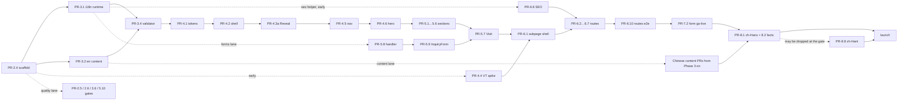

# 10 · Phases, roadmap & PR stack

## Purpose

This document turns the decisions in `01`–`09` and `11` into an execution plan: the phases the build goes
through, what each phase delivers and how it is accepted (a human-closed gate bead per phase, per 11), the
PR stack inside each phase with its primary bead, file areas, dependencies, size and verifier check, the
dependency graph and critical path, which lanes run in parallel on disjoint file sets, a relative roadmap
(weeks from kickoff, not dates) with milestones and the review cadence, and the working agreements every PR
follows. It is a plan only: nothing here starts until the human closes the Phase 1 gate (`gp-dln.4`). It
decides *when* and *in what order*; the *what* and *how* stay in the owning documents and are cited by id.
It now also carries the human's Phase 1 gate answers (HD-1…HD-15, 2026-08-22) wherever they change scope,
order or what blocks a gate.

Status: draft · seat writer-breakdown · 2026-08-22 · revised 2026-08-22 (HD-2, HD-3, HD-5, HD-6, HD-7, HD-9,
HD-10; second round the same day: HD-13 domain, HD-14 CJK stack) · revised 2026-08-23 (ruleset ground truth
re-read from the GitHub API: the include list *does* name the default branch, so the protection half of HD-2 /
OQ-11.3 is live; what is missing is a `required_status_checks` rule, and that is what the Phase 2 gate now
turns on — §2, §12, §14)

Notes: pass 1 was drafted while 04, 06, 08 and 09 were still being written; pass 2 reconciled every phase with
them by decision id (§2–§8), added the rows their artifacts need, and rebuilt the open-question roll-up against
02's renumbered set (§14). **Pass 3 (2026-08-22)** applies the human's gate decisions: three locales instead of
two (HD-10 — Phase 3 gains a `zh-Hant` seed row, Phase 4 a three-option switcher, Phase 6 a 21-URL sitemap,
Phase 8 a second Chinese lane), the provisional-value registry that replaces `TODO` sentinels (HD-9 — new scope
in PR-3.2, PR-3.4, PR-3.8 and the Phase 8 gate), Vercel Hobby at start with an upgrade decision before cutover
(HD-3), the branch-protection ruleset (HD-2, Phase 2 entry — its ground truth was re-read from the GitHub API
on 2026-08-23: the ruleset *does* target the default branch, and it requires no check), and the answers
that unblock build work — six subpages (HD-5), the provisional brand name (HD-6) and provisional owner facts
(HD-7). §14 and the *Human inputs by phase* table are re-derived from those answers. **Pass 4 (2026-08-22,
later the same day)** applies the second round: the domain is `greenpasturesdaycare.com` (HD-13), which moves
OQ-06.2 / OQ-09.2's name half out of Phase 6's and Phase 8's blocking columns and leaves only registrar-login
ownership behind it (D-10.14); and the system CJK stack is *confirmed* rather than defaulted (HD-14), which
closes OQ-03.4 / OQ-01.2 / OQ-04.9 outright instead of shipping a default under an open question. §14 was then
re-checked row by row against the owning documents rather than against `12` — `12` re-syncs last this round
(ADJ-22) — and six questions those documents have declared since pass 3 were added to it. **The roadmap's
weeks do not move** (§11, stated there rather than left to inference). The memo's skeleton is
Purpose → Status → Decisions; the one-screen summary below sits ahead of Decisions deliberately, because
`00-README.md` lifts it unedited — the only such deviation.

## Summary (one screen)

**Stack** (`01-stack-decisions.md`, ADR-001 + ADJ-1…9):

1. Next.js 16.x App Router · TypeScript `strict` · React 19.2 · pnpm · Node 24 · Vercel (preview per PR,
   production from `main`; never `output: 'export'`) — D-01.1, D-01.7.
2. next-intl 4.x: `[locale]` segment, `src/proxy.ts`, `localePrefix: 'always'`, JSON messages, typed keys
   — D-01.2, D-01.8. Three locales, one identifier each: `en` (default, reference), `zh-Hans` (ships at
   launch), `zh-Hant` (additional) — D-02.1, HD-10. The id is the URL segment, the `<html lang>` and the
   `hreflang`; the plain `zh` no longer exists anywhere.
3. Content = versioned JSON under `content/` (messages + collections per locale, one `site.json`), Zod-validated,
   CMS-ready — D-01.3, `02`. `content/` is the owner's single entry point (D-02.18); every value that is a
   sample default rather than the owner's real one is listed in `site.json.provisional` and blocks
   `validate:content --release` until it is gone (D-02.20, INV-02.10).
4. Tailwind CSS v4 with design tokens in `@theme`; `--dur-*` as plain custom properties; CSS Modules for keyframes
   — D-01.4, `03`.
5. Motion (`motion` package) for in-page reveals, stagger, count-up and the locale enter cascade; ambient loops
   are CSS keyframes (05 `D-05.7`); route-level subpage slide = React `<ViewTransition>` +
   `<Link transitionTypes>` (Next ≥ 16.2), instant-swap fallback; GSAP only by a later ADR — D-01.5, D-01.9, `05`.
6. Inquiry form = Route Handler + Zod ≥ 4 + Resend + Turnstile + honeypot, with a Vercel WAF rate-limit rule on
   `POST /api/inquiry` (5 per IP per 10 min → 429) — D-01.6, D-07.7, `07`; quality = ESLint run directly
   (Next 16 removed `next lint`; `react/jsx-no-literals` bans literal JSX text), Stylelint, Vitest/RTL,
   Playwright per locale, `validate:content`, GitHub Actions gates — D-08.3, `08`, `11`.

**Phases** (gate = the human-owned bead that closes the phase; numbering continues the tracker's, where the plan
itself is Phase 1 and `gp-dln.4` is its gate):

| # | Phase | Goal (one line) | Exit gate bead (`-a human`) |
|---|---|---|---|
| 1 | Technical plan | `docs/technical/00`–`12` accepted as the plan of record | `gp-dln.4` · Phase 1 gate · Human sign-off on the technical plan |
| 2 | Foundation | Repo scaffolded (Next 16/TS/pnpm/Tailwind v4/next-intl/Motion), tooling + CI gates, tracker snapshot + `bead-trailer`, governance files (CODEOWNERS, PR template, `renovate.json`), root README (replaced in this plan round — §2), first Vercel preview | Phase 2 gate · Foundation accepted (CI + trailer gate required on `main` — which needs a required-status-checks rule on the HD-2 ruleset first; the ruleset already protects `main` — preview deploys) |
| 3 | Content & i18n infrastructure | `content/` tree (all `en` keys, `site.json` incl. the 23-entry `provisional` array, schemas), i18n runtime, proxy, `validate:content` + coverage report, `zh-Hans` for the 33 prototype strings, `zh-Hant` seeded from it | Phase 3 gate · Content contract live (`/en`, `/zh-Hans` and `/zh-Hant` render on preview; INV-02.1–11 gates on) |
| 4 | Design system & motion primitives | Tokens, fonts + SC/TC CJK stack, layout shell, sticky nav + hamburger + three-option locale menu, footer, Reveal/variants/WordSwap/CountUp, View Transitions spike → `PageTransition`, Hero as the vertical slice | Phase 4 gate · **M1** skeleton on preview: three locales, nav + hero + footer, cascade, reveals |
| 5 | Homepage | The remaining seven sections (both views, hi-fi) + the inquiry form lane (schema, handler, `InquiryForm`) | Phase 5 gate · **M2** homepage complete; form submits on preview (log transport) |
| 6 | Subpages, transitions & SEO | Six routes + catch-all, slide/Back, per-locale metadata, `hreflang` × 3 + `x-default`, 21-URL sitemap, robots, JSON-LD, 404, security headers | Phase 6 gate · **M3** subpages + SEO |
| 7 | Integrations | Resend domain + inbox, Turnstile production keys, Vercel env scopes + WAF rule, analytics | Phase 7 gate · **M4** inquiry form live in production |
| 8 | Hardening, content completion & launch | `zh-Hans` complete and `zh-Hant` reviewed (or dropped from `routing.locales`), owner facts replacing every provisional value, photography in, a11y/perf/visual-regression gates, `validate:content --release`, Vercel plan resolved, launch checklist | Phase 8 gate · **M5** launch (`provisional` empty, DNS cutover approved) |

**Critical path:** `gp-dln.4` → scaffold (PR-2.4) → i18n runtime + `en` content + validator (PR-3.1/3.2/3.4) →
tokens (PR-4.1) → shell primitives + motion core (PR-4.2/4.3a) → nav (PR-4.5) → hero (PR-4.6) → sections
(PR-5.1…5.7, Visit last, fed by the forms lane) → subpage shell (PR-6.1, needs the spike PR-4.4) → routes
(PR-6.2…6.7, fed by PR-6.8's metadata helper, which early-starts from Phase 3) → routes e2e (PR-6.10) →
integrations (owner accounts) → translation + real owner facts + `--release` (PR-8.1/8.2) → launch.
Unchanged by HD-10: three locales widen the matrices on this chain but add no link to it — the `zh-Hant`
rows (PR-3.9, PR-8.8) hang off it and can be dropped at the Phase 8 gate without moving the date (D-10.12).

**Human inputs by phase** (ids in the owning docs; §14 is the full register — every external open question with
its answerer, the row that needs it and what ships if it is never answered). HD-1…HD-12 removed a block of
these on 2026-08-22 and HD-13…HD-15 removed a second block later the same day; the rows they answered are
listed as *answered* so nobody re-asks, and the residue that is genuinely still needed sits in the
**Decide / supply** column. Where an answer left a sliver behind — the domain is named but the registrar login
is not — the sliver stays in **Decide / supply** at its real phase and the answered half moves right, because
a half-answered row that keeps its whole question is how a settled fact gets asked for twice:

| Before | Decide / supply | Answered at the Phase 1 gate (no longer blocking) |
|---|---|---|
| Phase 2 | Close `gp-dln.4`; **add a `required_status_checks` rule to the "Main Protection" ruleset** and list 08's six names in it, `bead-trailer` once PR-2.3 has created it — the ruleset already protects `main` (verified against the GitHub API 2026-08-23); requiring a check is the half HD-2 left undone — OQ-11.3; OQ-11.4 `CLAUDE.md`; OQ-09.3 preview protection; OQ-09.5 standing beads; OQ-11.1 Dolt push (optional); verify-only: OQ-01.3 / OQ-05.1 (scaffold), OQ-08.5 lint stack, OQ-08.3 CI minutes, OQ-08.8 INV-02.1 wording | HD-1 stack (ADR-001…009 stand); HD-3 plan — **Hobby at start**, so OQ-09.1's plan half and OQ-01.4's are settled for Phase 2 and reopen only before cutover (D-10.13); the root README replacement (done in this plan round) |
| Phase 3 | OQ-02.2 prod fallback; OQ-06.5 cookie lifetime; OQ-09.4 content-PR approver; OQ-10.4 translation resource and timing (its policy half is answered — HD-12); OQ-02.8 who reviews `zh-Hant` and to which regional conventions; doc-level: OQ-04.8, OQ-06.8, OQ-09.10. **Retired by 02's own decisions:** root-path detection (D-02.9) and the "Child's age" option set (D-02.4 rule 8) | HD-10 locales — OQ-02.1 answered (`en` + `zh-Hans` + `zh-Hant`), OQ-03.3 follows it; HD-6 brand name — OQ-02.4 / `gp-dln.12` answered provisionally; HD-5 subpage set — OQ-02.7 / `gp-dln.6` answered; HD-7 + HD-9 owner facts — `gp-dln.13` ships as 23 provisional sample defaults, so Phase 3 no longer waits on any of them |
| Phase 4 | OQ-03.2 AA palette; OQ-03.1 tablet; OQ-03.5 emoji; OQ-03.6 vector logo; OQ-04.1 hamburger sheet; OQ-04.4 photo placeholder; OQ-04.6 mobile footer; OQ-04.7 nav at `lg`; OQ-06.6 active-section highlight; OQ-06.10 / OQ-04.11 what the three-option switcher *looks* like (new — HD-10 made it a menu and the handoff draws none); OQ-05.2 spike verdict; OQ-05.3/05.4/05.6/05.8 motion sign-offs; OQ-05.5 (answered by 02 + 06) — all have stated defaults; doc-level: OQ-08.9 (03 §5 → `MC-08.1`) | HD-14 CJK typeface — **closed**, not merely defaulted: OQ-03.4 / OQ-01.2 / OQ-04.9 ship the system stack at launch, split per script by 03 D-03.14 (`--font-cjk-sc` / `--font-cjk-tc`). HD-11 established that the design names no face; HD-14 confirms nobody will name one, so PR-4.1 has no font decision left in it |
| Phase 5 | OQ-02.6 testimonials in the Chinese locales; OQ-07.10 / OQ-04.10 option sets; OQ-07.1 / OQ-02.5 e-mail language; OQ-07.2 auto-ack; OQ-04.3 drop `gpdevelop`; OQ-08.1 visual-regression scope; OQ-08.6 contrast gate; OQ-10.3 photography timing | HD-7 street address and Maps link — OQ-07.8 ships as a provisional sample, so PR-5.7 and PR-6.8 render a real-looking address from day one |
| Phase 6 | OQ-07.5 / OQ-06.4 privacy page; OQ-04.2 lightbox + filters; OQ-06.7 share image; **registrar or DNS-host access for the developer** (OQ-09.2's residue — nothing in Phase 6 builds against it, but it is opened with OPS-7.x at the Phase 5 gate so propagation overlaps Phase 7, D-10.14) | HD-13 **domain = `greenpasturesdaycare.com`** — OQ-06.2 / OQ-09.2's name half closed; `metadataBase` still reads `NEXT_PUBLIC_SITE_URL` (06 D-06.11, INV-06.10), but that variable now has a known production value, so PR-6.8's canonicals, `hreflang` and 21-URL sitemap resolve to real URLs; HD-5 — `gp-dln.6` / OQ-02.7 / OQ-04.5 / OQ-06.1 answered: six routes, FAQ and Enrollment reserved and not built; HD-7 — OQ-06.9's JSON-LD facts exist as provisional samples, so PR-6.8 emits a complete `ChildCare` object |
| Phase 7 | OQ-07.6 the **real** sending domain and inbox — narrowed by HD-13 to the mailbox names and the DKIM/SPF publication that verifies them, since 07 D-07.10 now writes its samples on `mail.greenpasturesdaycare.com`; OQ-07.4 retention; OQ-01.1 / OQ-07.9 analytics; OQ-09.2's residue — who owns the accounts and holds the registrar login; OQ-08.4 preview bypass secret; OQ-10.7 whether the Vercel plan is upgraded here or at Phase 8 | HD-3 — the plan question for Phases 2–6 (Hobby): capability and default, not a disagreement — Hobby is *capable* through Phase 7 (09 `D-09.2`), and 10's *default* under OQ-10.7 is to upgrade at OPS-7.3 inside Phase 7, so the tier changes partway through that phase unless the human defers it to OPS-8.1; HD-4 — the sending identity's *shape* is now content (`email.sendingDomain`, `email.fromAddress`), not an invention at OPS-7.1; HD-13 — the domain name, so OPS-7.3 attaches it to the Vercel project without waiting on an answer (D-10.14) |
| Phase 8 | `gp-dln.13` all facts **final** (empty the 23-entry `provisional` array); `gp-dln.12` brand name confirmed or replaced; OQ-07.7 real Yelp figures/URL; OQ-10.3 photos; OQ-10.4 translation delivered; OQ-02.8 `zh-Hant` review verdict; OQ-06.3 / OQ-09.8 legacy redirects (expected "none beyond `/`"); OQ-08.2 Lighthouse thresholds; OQ-09.6 menu cadence; OQ-09.7 error monitoring; OQ-10.2 launch window; **OQ-09.1 reopens** — upgrade to Vercel Pro or confirm Hobby eligibility before the cutover (HD-3); OQ-09.2's residue — **who holds the registrar login**, the one small item OPS-8.1 still cannot proceed without | HD-13 — the domain name. OPS-8.1's "get the name" step is gone: the cutover is now paced by registrar access and DNS propagation, which is owner lead time the roadmap already budgets, not an unanswered question (D-10.14) |
| Post-launch | OQ-01.5 GSAP trigger; OQ-02.3 / OQ-09.9 CMS; OQ-07.3 CRM; OQ-08.7 `pnpm audit` policy; OQ-11.2 tracker's future (§9) | HD-10 — `zh-Hant` moves out of the post-launch backlog into Phases 3 and 8 (§9) |

**Size** (PR count and band mix; bands per D-10.8; days are implementer-days at the midpoints, ±30 %):

| Phase | PRs | S / M / L | ≈ days | ≈ weeks at two implementers |
|---|---|---|---|---|
| 2 Foundation | 9 (+2 ops) | 7 / 2 / 0 | 11 | 1 |
| 3 Content & i18n | 9 | 5 / 3 / 1 | 16 | 1.5–2 |
| 4 Design system & motion | 7 | 0 / 6 / 1 | 20 | 2 |
| 5 Homepage (+ forms lane) | 11 | 1 / 7 / 3 | 34 | 3 |
| 6 Subpages & SEO | 11 (1 conditional) | 5 / 5 / 1 | 21 | 2 |
| 7 Integrations | 2 (+3 ops) | 2 / 0 / 0 | 2 + owner lead time | 1 |
| 8 Hardening & launch | 8 (+2 ops) | 4 / 4 / 1 (translator) | 13 + translation | 2 |
| **Total** | **≈ 57** | | **≈ 117** | **≈ 12–13** |

The two S rows D-10.15 added — PR-2.10 (`audit.yml`) and PR-5.11 (`nightly.yml`) — are the whole difference
from the previous count of ≈ 55. Neither is on the critical path, neither adds a dependency edge, and the
weeks column does not move: both are quality-lane workflow files that run beside the phase they sit in.

**Does HD-10 change the roadmap's shape or only its size?** Only its size, with one exception. The phase set,
their order, the gates and the critical path are untouched: a third locale is a third column in matrices that
already iterate `routing.locales`, and 02's add-a-locale checklist is deliberately "one directory + one config
entry". It adds two S rows (PR-3.9 seeds `zh-Hant`, PR-8.8 reviews it), widens every route × locale matrix from
2 to 3 (smoke, a11y, Lighthouse, visual regression), turns a two-name toggle into a menu inside PR-4.5, and
takes the sitemap from 14 to 21 URLs — ≈ 2 implementer-days and no new dependency edge. The exception is a
change of *kind*, not of order: `zh-Hant` is the first deliverable the plan carries that may be **dropped at
its gate** instead of finished (INV-02.11, D-10.12). HD-9 is the shape change worth naming — the provisional
registry moves the owner-facts dependency off Phase 3 and Phase 6 (where it used to block build work) onto the
Phase 8 gate alone (D-10.11).

## Decisions

- **D-10.1 Phase set and numbering.** Eight phases as in the summary table; the plan is Phase 1 so that the
  existing gate bead `gp-dln.4` ("Phase 1 gate") keeps its title and every later gate is titled `Phase <n> gate ·
  <acceptance>` as 11 requires (TRAP-11.12, W-11.8). Implementation is Phases 2–8; post-launch work is a backlog
  epic, not a phase (§9).
- **D-10.2 A gate is a merge barrier, not a start barrier.** No PR belonging to phase *n* merges to `main` before
  the Phase *n − 1* gate is closed by the human (INV-10.1). A PR whose named dependencies are merged may be
  started on a branch earlier (rows marked *early-start*), so a slow gate review never idles the seats; it only
  delays landing. Entry criteria are per PR (named PRs, symbols, OQs) — never "the stack says so".
- **D-10.3 PR granularity.** One coherent change per PR: one section (both views) = one PR; one primitive family
  = one PR; one route = one PR; content-only changes (files under `content/**`) are separate PRs from code, so
  diffs show copy only and the editor workflow of 09 stays clean; ops work that has no code (Vercel, Resend,
  Cloudflare, DNS) is a bead without a PR (`OPS-<phase>.<n>` rows). A PR is split for reviewability — different
  concern, different verifier, different file set — never to a line count (§12).
- **D-10.4 The inquiry form is a lane inside Phase 5, integrations are Phase 7.** Schema + handler + `InquiryForm`
  (07 §1–2) are built beside the sections on disjoint files (`src/lib/inquiry/**`, `src/app/api/inquiry/**`,
  the form component) with the `log` transport and Turnstile test keys, so M2 shows a working form on preview;
  accounts, domain DNS, production keys, the WAF rule and analytics (07 §5–6, 09) are Phase 7.
- **D-10.5 View Transitions spike first.** OQ-05.2 (a)–(f) is answered by a spike in Phase 4 (PR-4.4), before any
  route work; its outcome fixes `PageTransition` as View Transitions (D-05.10) or the F1 fallback (05 §5.7), and
  if F1, 01 records the amendment to ADR-005 in the same PR.
- **D-10.6 Chinese parity runs in *warn* mode until Phase 8 — for both scripts (amended, HD-10/HD-12).** Only
  33 of the ≈ 200 copy keys have prototype Chinese (R1 inventory), and those 33 are `zh-Hans`; the rest come
  from a translator (OQ-10.4). From PR-3.4 the validator fails on `en` problems and on any *invented* or empty
  Chinese value, but reports missing keys as warnings in the coverage report (INV-02.6) under
  `--warn-locale zh-Hans --warn-locale zh-Hant` — the flag spelling `--warn-locale zh` no longer exists.
  Parity is three-way (INV-02.2): `en` is compared with each Chinese locale independently, so a key missing
  from both is two warnings, and the coverage report carries a column per locale. PR-8.1 flips `zh-Hans` to
  fail; PR-8.8 flips `zh-Hant` or removes it from `routing.locales` (D-10.12). No English text is ever placed
  in a Chinese file; missing keys render `⟦key⟧` in dev and English on previews (D-02.8). HD-12 confirms this
  policy; what stays open in OQ-10.4 is the translator and the timing, not the mode.
- **D-10.7 Hero is the Phase 4 vertical slice.** M1 is reached when nav, hero and footer render in every locale
  on a Vercel preview with tokens, fonts, the locale cascade, `Reveal`, ambient loops and reduced motion — one
  real section proves the primitives before seven more are built on them.
- **D-10.8 Effort bands.** S ≈ ½–1 implementer-day, M ≈ 2–3, L ≈ 4–6, each *including* tests, the verifier's
  check and review fixes; the midpoints (0.75 / 2.5 / 5) give the sums in the summary. Capacity is assumed to be
  two implementers (human engineers or orchestrated agent seats) with the human closing gates within two
  business days — A-10.1, confirmed by OQ-10.1. The bands are re-calibrated against Phase 2's actuals at its gate.
- **D-10.9 Tracker shape for the build.** One epic per phase (`Phase <n> · <name>`), one task bead per PR row
  (child of the epic; the PR id is in the bead title), `OPS-` rows as `chore` beads, the gate as a `task` bead
  titled `Phase <n> gate · …` assigned `human`, with `bd dep add <Phase n epic> <Phase n−1 gate>` and `bd dep add
  <Phase n gate> <each task bead>` so `bd` refuses to close a gate with open work (TRAP-11.13). The orchestrator
  creates them at kickoff; seats never run `bd` (INV-11.4). Existing beads are reused where they exist
  (`gp-dln.5/7/8/10/11`, decisions `gp-dln.6/12/13`).
- **D-10.10 Order of the first Phase 2 PRs.** The tracker-snapshot commit (`export.auto`, `issues.jsonl`,
  `.beads/PRIME.md`, `.gitattributes` `merge=union`) lands before the `bead-trailer` workflow PR — the gate
  cannot pass until `issues.jsonl` exists at the PR head (11 §5–6; `gp-dln.10`, `gp-dln.11`). If `gp-dln.10`
  and `gp-dln.7` are folded into the plan PR at landing (as their bead text says), PR-2.1/2.2 shrink accordingly.
- **D-10.11 The provisional registry is scheduled work, and only the launch gate is blocked by it (HD-4 · HD-7
  · HD-9).** Owner facts, the brand name and the sending identity ship as sample defaults from Phase 3 (D-02.20)
  instead of `"TODO"`, so no build row waits on the owner. Three rows carry the new scope and they are the only
  ones: **PR-3.2** seeds `content/site.json` with 02's verbatim 23-entry `provisional` array beside the sample
  values; **PR-3.4** teaches `validate:content` to resolve the registry, print the provisional block into
  `reports/content-coverage.md`, fail in *every* mode on a path that does not resolve, and fail under
  `--release` while the array is non-empty or any literal `TODO`/`TBD`/`FIXME`/`XXX` remains under `content/`
  (INV-02.10); **PR-3.8** documents *Replace a provisional value* in `content/README.md`. There is no runtime
  marker, so 04, 05 and 06 build nothing for this. The Phase 8 gate is the one place emptiness is required
  (INV-10.8): PR-8.2 empties the array, and a value the owner never supplies stops the launch, not the build.
- **D-10.12 `zh-Hant` is built in the open and may be dropped at its gate.** PR-3.9 seeds `content/zh-Hant/`
  from `content/zh-Hans/` with a hand-run OpenCC `s2t` conversion and commits it as ordinary content (D-02.21 —
  never a build step or a `package.json` script); the locale sits in `routing.locales` under
  `--warn-locale zh-Hant` while it fills. PR-8.8 re-seeds from the finished `zh-Hans`, takes the named
  reviewer's read (OQ-02.8) and flips the locale to fail-on-parity. **If the review has not happened by the
  Phase 8 gate, PR-8.8 removes `zh-Hant` from `routing.locales` instead** — the directory stays, the sitemap
  drops to 14 URLs, the switcher menu shows two options, and launch proceeds on `en` + `zh-Hans` (INV-02.11).
  That fallback is a one-line config change with a test matrix that re-derives itself, which is the whole
  reason the locale can be developed before its reviewer is named.
- **D-10.13 Vercel Hobby now, plan resolved before the cutover (HD-3).** Phases 2–6 run on the Hobby tier —
  capability and default, not a disagreement: Hobby is *capable* through Phase 7 (09 `D-09.2`), and 10's
  *default* under OQ-10.7 is to upgrade at OPS-7.3 inside Phase 7, so the tier changes partway through that
  phase unless the human defers it to OPS-8.1. Hobby costs nothing, previews per PR and production from
  `main` both work, and no gate before Phase 8 depends on a paid feature. Two things reopen the plan
  question later, and both are scheduled rather than assumed. (a) OPS-7.3's WAF rate-limit rule consumes
  Hobby's single custom rule — Hobby gets 1, Pro 40 [verified: Vercel WAF docs, 2026-08-22; 07 `D-07.12`, 09
  `D-09.2`] — so Phase 7 must publish it knowing that. (b) Hobby "restricts users to non-commercial,
  personal use only" [verified: Vercel Hobby plan docs, 2026-08-22; 09 `D-09.2`] and a daycare's marketing
  site is commercial, so OPS-8.1 cannot cut DNS over until the human has upgraded to Pro or confirmed
  eligibility in writing — that item is in the Phase 8 launch row, not a footnote. And (c) the Deployment
  Protection that OQ-08.4 and OQ-09.3 rely on *does* exist on Hobby — Standard Protection with Vercel
  Authentication is available on every plan [verified: Vercel Deployment Protection docs, 2026-08-22; 09
  `D-09.4`] — but Hobby has no team and therefore no Viewer seat, so the owner's and the translator's
  preview review waits for the upgrade (OQ-09.3) [verified: Vercel plan limits, 2026-08-22; 09 `D-09.2`];
  OPS-2.1's bead still records what the tier's settings screens actually offer, because a bead records a
  configuration and this row records its source. Both hedges ADJ-19 asked for are discharged: the owning
  documents sourced these facts on 2026-08-22, and 09's `D-09.2` now reads Hobby-first (HD-3) rather than
  assuming Pro, so 10 cites it instead of re-deciding it.
- **D-10.14 The domain is named, so DNS becomes lead time instead of a blocker (HD-13).** The production host
  is `greenpasturesdaycare.com`; the host form was never the open half and stands as decided — apex canonical,
  `www` → apex 308 (09 D-09.5, 06 D-06.11). Nothing in the build changes: `metadataBase` still reads
  `NEXT_PUBLIC_SITE_URL` and no absolute origin is written into `src/` (06 INV-06.10). HD-13 supplies the
  production *value* of that variable, not a new source for it. What changes is scheduling, in three places.
  (a) **OPS-7.3** attaches the domain to the Vercel project the moment Phase 7 opens, because the string it
  needs exists. (b) **OPS-8.1** loses one of its two first-checks: the plan question (D-10.13) survives, "get
  the domain name" does not, so the cutover is paced by registrar access and DNS propagation. Both are owner
  lead time, which §11 already budgets inside weeks 11–13, and both are why the access request rides with
  OPS-7.x at the **Phase 5 gate**: the roadmap already opens those rows there so DNS propagates while Phase 6
  runs, and registrar access is the same kind of ask. (c) **What stays open is who holds the registrar
  login** (OQ-09.2's residue). It is small and it is not a design question, but OPS-8.1 cannot change a record
  without it, so it is listed as a human input at Phase 7 and Phase 8 instead of being assumed into existence.
  Two consequences this decision deliberately does *not* claim: the `provisional` registry is untouched —
  `brand.url` remains a registered provisional entry that PR-8.2 clears (D-10.11), and HD-13 only tells PR-8.2
  which string to type; and whether `brand.url` survives at all is still OQ-09.10's, not this document's.
- **D-10.15 The two out-of-band workflows are scheduled: `audit.yml` in Phase 2, `nightly.yml` in Phase 5
  (raised by 08 §10).** 08's job table carried `e2e-full` and `audit` as `no · unscheduled` and said so in
  prose, because §12.2 makes "`e2e-full` green on `main` (4 projects)" a condition of *every* phase gate and
  §12.3 repeats it at launch, while no row here created either workflow. A gate condition nothing builds does
  not in practice block a phase — it gets waived, and a waived item teaches the next one that gates are
  waivable. So the two rows land here rather than the condition being softened by habit. Verified against the
  tree on 2026-08-23: `.github/workflows/` holds `ci.yml` and `bead-trailer.yml` only, and
  `playwright.config.ts` already carries `firefox-desktop` and `chromium-mobile` behind `E2E_FULL === "1"`,
  so 08 is right that the config half is done and only the workflows are missing.

  **(a) `audit.yml` is Phase 2 (PR-2.10).** `pnpm audit --prod --audit-level=high` has something real to
  protect from the day `package.json` exists: PR-2.4's tree is Next 16 + React 19 + Tailwind v4 + next-intl +
  Motion + Zod and its transitive closure. The same phase turns Renovate on (PR-2.9, and `renovate.json` is
  already in the tree), and a bot that opens dependency PRs weekly with nothing scanning what it proposes is
  the wrong way round — the scanner belongs in the phase that ships the bot, not five phases after it. The
  gitleaks half is the second reason: INV-07.3 names `audit` as one of the three jobs enforcing "no secret
  reaches the bundle or the repo", and gitleaks scans the **PR diff**, so its value is catching the first
  accidental paste, which can happen in any phase — including this one, where `.env.example` and the preview
  bypass secret both appear. Cost is not an argument for waiting: 08 §10's two-column table already bills
  `bead-trailer · audit` at 2 minutes per PR in *both* columns, so the ≈ 1,200–1,900 runner-minutes a month
  OQ-08.3 is weighing already assumes this job runs on every PR from the start. Scheduling it in Phase 2 makes
  that estimate true; scheduling it later means the published figure has been counting a job that does not
  exist. The weekly cron adds ≈ 8 minutes a month. It ships **advisory** — the six required checks are
  INV-08.2's set and only the human changes it — which is also OQ-08.7's stated default, now with a row that
  ships it instead of a default that ships nothing.

  **(b) `nightly.yml` is Phase 5 (PR-5.11).** `e2e-full`'s entire content is the two projects PRs do not run,
  `firefox-desktop` and `chromium-mobile` (D-08.7). Before Phase 5, `main` is a blank page (Phase 2), a content
  tree with `e2e/smoke*` (Phase 3) and layout primitives (Phase 4); running Gecko and a Pixel 7 over a smoke
  spec doubles the bill to re-assert `200`, `<html lang>` and `hreflang`, none of which vary by engine. Phase 5
  is the first phase whose gate a second engine can falsify: the whole homepage lands, and with it `@motion`,
  `@nojs`, `@form` and `@hover`'s touch half — the tags whose expected values are engine- and
  device-dependent — and it is where `main` starts changing fast enough for a cross-engine break to sit
  unnoticed, since Phases 6, 7 and 8 all build on the homepage. Phase 6 was the other candidate, because
  `@nav-instant` under `firefox-desktop` — an engine that genuinely lacks `startViewTransition` — is the single
  most valuable assertion in the extra matrix and does not exist until PR-6.10. That argues for Phase 5 rather
  than against it: the workflow should be running and trusted **before** the phase whose findings need it, not
  stood up in the same PR that first depends on it.

  **(c) The trigger set is what the budget decides, and it is `workflow_dispatch` first.** At three locales
  `e2e` costs 19 runner-minutes for two projects (08 §10), so four cost ≈ 35–40. A true nightly is ≈ 1,140
  minutes a month; a `push: main` trigger at 33–50 merges a month is ≈ 1,250–1,900. Either one, on top of the
  ≈ 1,200–1,900 already spent on PRs, is a multiple of the 2,000 free minutes a private repo gets — and
  OQ-08.3 is open precisely because the PR figure alone lands within about a hundred minutes of that limit.
  Neither fits. What §12.2 actually asks for is narrower than what 08 §10's trigger cell specifies: **one green
  `e2e-full` run against the tip of `main` at gate time**. That is four gates from Phase 5 on, plus the release
  SHA — ≈ 200 minutes for the whole remaining build. So PR-5.11 ships the workflow with `workflow_dispatch`
  live, the orchestrator dispatches it when it opens the gate bead and pastes the run URL onto that bead
  (which is what makes the gate item checkable rather than asserted), and the `schedule` and `push: main`
  triggers are written but guarded at job level on a repository variable defaulting to off — so turning the
  nightly on when OQ-08.3 closes is a settings flip, not a second PR. This is a scheduling choice and not an
  amendment to 08: the job still runs all four projects with `retries: 0` in the same Playwright container,
  and a failure still opens a bead rather than an auto-issue.

  **(d) What this asks of 08.** §12.2's `e2e-full` clause needs the scope 08 already gives two of its
  neighbours — `@visual` carries "(from 04's phase)" and `MC-08.1` carries "from the phase that ships the
  sections onward". Without one, the Phase 2, 3 and 4 gates carry a condition whose workflow does not exist,
  which is the same defect in a smaller font. It should read: *from the Phase 5 gate onward, `e2e-full` green
  on the gate's `main` SHA (4 projects), dispatched at the gate with its run linked from the gate bead.*
  Three neighbouring clauses in the same paragraph have the same shape and are named in §14's note below;
  none of them is 10's to edit. Both new rows also flip their `Built?` cell in 08 §10 in the same PR, per that
  section's own convention.

## Design

### 1 · Phase model

Each phase has: **entry** (the previous gate closed; owner inputs for the phase supplied or their defaults
accepted), **scope** (which decisions it implements, by id), a **PR stack** (table), an **exit gate** (what the
human looks at; the bead title), **risks**, and **human inputs**. PR ids `PR-<phase>.<n>` are stable and are the
board's plan rows (11 D-11.3; the board projects this table and never re-derives it). Rows say *early-start* when
branch work may begin before the previous gate closes (D-10.2). "Verifier check" is the adversarial check the
second seat authors before seeing the implementation (W-11.11); the CI gates it leans on are 08's.

Paths below are the owning documents' (02 content and i18n, 03 tokens, 04 components, 05 motion, 06 routes,
07 form, 08 gates, 09 operations, 11 tracker); the TS token mirror is `src/design/tokens.ts` (memo ADJ-8).

**Seats.** Two seats work every row (W-11.11, INV-11.3): implementer `writer-<topic>` and verifier
`check-<topic>`, where `<topic>` is the row's slug listed under each phase table; the orchestrator is neither
and closes the bead on the verdict (W-11.6, TRAP-11.8).

**Starting state.** The tree today is `README.md` (stale CRA boilerplate), `docs/**`, `.claude/**`, `.beads/`
and `.gitignore`. There is no `package.json`, no `.github/`, no `.gitattributes` and no `.beads/issues.jsonl`
— the first Phase 2 PRs create all four, which is why PR-2.1 and PR-2.4 have no code dependencies.

### 2 · Phase 2 · Foundation

**Entry.** `gp-dln.4` closed **and the "Main Protection" ruleset carrying a `required_status_checks` rule that
lists 08 `D-08.12`'s six check names.** The older wording of this condition — "the ruleset actually protecting
`main`" — was both wrong and easier to pass than intended, because that half is already satisfied. Ground
truth, read from the GitHub API on 2026-08-23 rather than inferred: the ruleset (id 21223922) is **active**
and its `conditions.ref_name.include` list **does** name the default branch (`~DEFAULT_BRANCH`), so its
`deletion`, `non_fast_forward` and `pull_request` (squash-only) rules are live and `main` rejects a direct
push, a force-push and a non-squash merge today. What the ruleset has **no** rule for is
`required_status_checks`: **zero** checks are required, so a pull request still merges with `content` red.
That is the outstanding half, and it is the human's — add the rule, list the six names in it, `bead-trailer`
last, once PR-2.3 has created that workflow and it has reported the check name on `main`. Repo settings are
the human's to change; no seat touches them. Until that rule exists, the Phase 2 exit gate's "CI and
`bead-trailer` required on `main`" cannot be verified — a green check on a PR proves the workflow runs, not
that it can block a merge — so this is entry *and* exit criteria for the same reason, and OQ-11.3's
required-checks half stays open in fact even though its protection half is now true and the question is
answered in intent.
**Scope.** D-01.1, D-01.4 (scaffold), D-01.7 (Vercel); 08's tooling and gate
inventory by id — D-08.1 (pyramid), D-08.2 (literal-text config), D-08.3 (ESLint run directly), D-08.4
(Stylelint), D-08.6 (Vitest/RTL), D-08.7 (Playwright projects), D-08.11 (bundle-secret + trailer scripts),
D-08.12 (CI, required checks), D-08.13 (flake policy), D-08.14 (`pnpm verify`, no git hooks), D-08.15 (DoD, §12),
D-08.16 (coverage policy); 09's platform and governance decisions — D-09.1 (three environments),
D-09.2 (plan: Hobby at start, Pro before the cutover), D-09.3 (project settings: Node 24, pnpm, region
`sfo1`, Fluid, Ignored Build Step), D-09.4 (Deployment Protection), D-09.6 (secrets in Vercel only),
D-09.7 (Actions runs gates, Vercel builds), D-09.8 (branch protection), D-09.9 (release = squash merge;
rollback), D-09.11 (trailer for content and bot PRs), D-09.16 (backups), D-09.17 (Renovate), D-09.19
(access control); 11 §5–6 (tracker snapshot, `bead-trailer`); chores `gp-dln.5/7/8/10/11`; INV-02.1/02.7/02.9
and INV-03.1–3 lint rules switched on before any component exists.
Two amendments from the Phase 1 gate. (a) **D-09.2's Pro half does not apply yet:** OPS-2.1 links the project on the
**Hobby** tier per HD-3 and D-10.13; nothing in Phase 2 needs a paid feature, and the plan decision returns at
Phase 7/8. (b) **The root README is replaced in the plan round, not here.** `gp-dln.8`'s bead note calls itself
"a phase-0 task", and it is now literally that: a separate seat replaces the Create-React-App boilerplate
alongside these plan edits, so PR-2.2 keeps only the remaining hygiene items and inherits the README check
rather than the README work. If that replacement does not land with the plan, PR-2.2 carries it as originally
scheduled — the row is written to work either way, because INV-10.1 keeps every *other* repo change behind
`gp-dln.4`.

| PR | Title | Primary bead | Files / areas | Depends on | Size | Parallel with | Verifier check |
|---|---|---|---|---|---|---|---|
| PR-2.1 | Tracker snapshot + config: `export.auto` on, the orchestrator's `bd export -o .beads/issues.jsonl` output committed (the seat commits the file, never runs `bd` — INV-11.4), `.beads/PRIME.md`, `.gitattributes` `merge=union` | `gp-dln.10` | `.beads/issues.jsonl`, `.beads/interactions.jsonl`, `.beads/config.yaml`, `.beads/PRIME.md`, `.gitattributes` | — (first PR; or folded into the plan PR) | S | all | `issues.jsonl` lists every claimed bead; `git check-attr merge .beads/interactions.jsonl` → `union`; the committed `.beads/PRIME.md` carries the seat-facing tracker text and `.beads/issues.jsonl` parses as JSONL — both read from the files, never by running `bd` (INV-11.4, D-10.9) |
| PR-2.2 | Repo hygiene: untrack `.DS_Store` + macOS ignores, `.editorconfig`, `CLAUDE.md` per OQ-11.4, and the project README **only if the plan round's replacement has not already landed** (§2 scope (b)) | `gp-dln.8` (+ `gp-dln.7` under `## Beads`) | `.gitignore`, `.DS_Store`, `CLAUDE.md`, `README.md` (conditional) | — | S | all | README points at `docs/technical/00-README.md` and no CRA text remains — checked against `main` whether this PR wrote it or inherited it; `git ls-files .DS_Store` empty |
| PR-2.3 | CI: `bead-trailer` gate | `gp-dln.11` | `.github/workflows/bead-trailer.yml`, `scripts/ci/bead-trailer.sh` | PR-2.1 | S | 2.2, 2.4, 2.5 | Script fails a commit without trailer and a PR body without one; passes on itself; `jq` only; required check on `main` (OQ-11.3, human) |
| PR-2.4 | App scaffold: `package.json` (pnpm, `engines.node 24.x`), Next 16.x + React 19.2 + TS strict, Tailwind v4 + `@tailwindcss/postcss`, `globals.css`, root layout + blank page (no text), deps pinned (next-intl 4.x, `motion`, `zod ≥ 4`), `.env.example`, `.nvmrc` | new: *Phase 2 · app scaffold* | `package.json`, `pnpm-lock.yaml`, `next.config.ts`, `tsconfig.json`, `postcss.config.*`, `src/app/layout.tsx`, `src/app/page.tsx`, `src/app/globals.css`, `.env.example` | — | M | 2.1–2.3 | `pnpm install --frozen-lockfile && pnpm build` green; scaffold-time verifications recorded in the bead: Next ≥ 16.2 `ViewTransition` + `Link transitionTypes` present (OQ-01.3 / OQ-05.1), Tailwind v4 browser floor, Zod 4 APIs, next-intl peer range |
| PR-2.5 | Lint & test tooling: ESLint flat config (`react/jsx-no-literals` per INV-02.1, `no-restricted-imports` INV-02.7, `no-restricted-syntax` INV-02.9 + INV-03.1/03.2 regexes, breakpoint-variant rule INV-03.3), Stylelint (`color-no-hex`, disallowed lists), Prettier, Vitest + RTL, Playwright projects (1280 / 390, reduced-motion), `pnpm` scripts | new: *Phase 2 · lint & test tooling* | `eslint.config.*`, `.stylelintrc*`, `.prettierrc*`, `vitest.config.*`, `playwright.config.*`, `e2e/`, `package.json` scripts | PR-2.4 | M | 2.1–2.3 | A fixture with a literal string, a `next/link` import, a `#hex` and a `[13px]` each fail lint; a clean fixture passes; one unit + one e2e smoke run |
| PR-2.6 | CI: `ci.yml` — install, typecheck, lint (ESLint + Stylelint + Prettier), unit, build, e2e smoke, `TODO\|FIXME\|HACK` grep over `src/**` (TRAP-11.9); concurrency; required-checks list for 09 | new: *Phase 2 · CI pipeline* | `.github/workflows/ci.yml` | PR-2.4, PR-2.5 | S | 2.3 | Workflow green on the PR; a seeded `TODO` fails it; job names match 08's gate inventory |
| PR-2.8 | Skill sync: `super-orchestrator` SKILL.md ids → 11 (§9 table), W-11.2 unclaim recipe, `board.py` path notes | `gp-dln.5` | `.claude/skills/super-orchestrator/SKILL.md` (+ `scripts/board.py` comments) | — | S | all | Every row of 11 §9 applied; no `13-work-tracking`, `W1`–`W7`, `PRO-*` left outside the history note |
| PR-2.9 | Repo governance (09): `CODEOWNERS` (`content/** public/images/**` → owner + developer, everything else → developer, D-09.19), `.github/PULL_REQUEST_TEMPLATE.md` whose last line is the `Bead:` trailer (D-09.11), `renovate.json` (weekly grouped minors, majors singly, automerge off, `commitTrailers`/`prFooter` carrying the standing dependency bead, D-09.17) | new: *Phase 2 · repo governance* | `.github/CODEOWNERS`, `.github/PULL_REQUEST_TEMPLATE.md`, `renovate.json` | PR-2.3 (`scripts/ci/bead-trailer.sh` defines the trailer the template must satisfy) | S | 2.4–2.6, 2.8 | Template's trailer passes the PR-2.3 script unedited; `CODEOWNERS` parses in the GitHub UI and covers `content/**`; Renovate's dry run opens one grouped PR carrying the bead trailer; the two standing beads exist (OQ-09.5) |
| PR-2.10 | CI: `audit.yml` (D-10.15 (a)) — `pnpm audit --prod --audit-level=high` plus `gitleaks` over the PR diff, on `pull_request` and a weekly `schedule`, `permissions: contents: read`, no repository secret; **advisory**, deliberately not added to INV-08.2's six required checks (OQ-08.7's default, now shipped rather than assumed); its own workflow file because the weekly cron is a different `on:` block from `ci.yml`'s | new: *Phase 2 · dependency & secret audit* (label `ci`) | `.github/workflows/audit.yml`, `docs/technical/08-testing-quality.md` (§10's `Built?` cell for the `audit` row only) | PR-2.4 (`package.json` + `pnpm-lock.yaml` — `pnpm audit` resolves from the lockfile) | S | 2.1–2.3, 2.6, 2.8, 2.9 | A fixture branch pinning a dependency with a known **high** advisory fails the job and one with a **moderate** advisory does not, so `--audit-level` is proven rather than assumed; a seeded fake key in the diff fails gitleaks and the same string already present on the base branch does not, which is the diff scope INV-07.3 relies on; the run carries no secret but `GITHUB_TOKEN` (INV-08.7); `GET /repos/…/rules/branches/main` names no required check outside INV-08.2's six — as of 2026-08-23 it carries no `required_status_checks` rule at all, so the check is that `audit` is absent from that rule whenever the human adds it and cannot drift into being a seventh required check; a Renovate PR is scanned by it |
| OPS-2.1 | Vercel project linked on the **Hobby** tier (HD-3, D-10.13; D-09.3 settings otherwise: framework Next.js, Node 24.x, pnpm, region `sfo1`, Fluid, Ignored Build Step skipping `docs/**` + `.beads/**` + root-doc-only commits), preview per PR, production from `main`, `NEXT_PUBLIC_SITE_URL` per scope, Deployment Protection on previews with a bypass secret for CI (D-09.4, OQ-09.3, OQ-08.4) | new chore: *Phase 2 · Vercel project* | dashboard (no code) | PR-2.4 | S | all | Preview URL on PR-2.5; production deploy of `main` succeeds; a docs-only commit produces no build; the bypass secret is stored as a GitHub Actions secret and nowhere else; the bead records which tier the project is on and which of D-09.3's settings Hobby does not offer, so Phase 7 knows what the upgrade buys |
| OPS-2.2 | Tracker relocation before this plan's worktree is removed (TRAP-11.6): export, then move `.beads/embeddeddolt/` and `.beads/backup/` into the main checkout, re-point `BEADS_DIR`, confirm one database | new chore: *Phase 2 · tracker relocation* | `.beads/` outside the worktree (no code) | PR-2.1 (the export it protects) | S | all | The orchestrator's shell reports one database at the main checkout; `git worktree remove` afterwards deletes no tracker data; `issues.jsonl` at `main` still lists every claimed bead |

**Seats** (`writer-<topic>` / `check-<topic>`): 2.1 `tracker-snapshot` · 2.2 `repo-hygiene` · 2.3 `trailer-gate` ·
2.4 `scaffold` · 2.5 `lint-tooling` · 2.6 `ci-pipeline` · 2.8 `skill-sync` · 2.9 `governance` ·
2.10 `dep-audit` · OPS-2.1 `vercel-project` · OPS-2.2 `tracker-relocation`. The id PR-2.7 is retired — the stack deliberately
jumps 2.6 → 2.8 — and is never reused, so a plan row's id always means the same work on the board.

**Exit gate.** `Phase 2 gate · Foundation accepted`: CI and `bead-trailer` **required on `main`**. The HD-2
ruleset's `conditions.ref_name.include` list already names the default branch (verified against the GitHub API
2026-08-23), so what this gate turns on is the other half — the ruleset carries a `required_status_checks`
rule and both checks are listed in it, verified by reading `GET /repos/…/rules/branches/main` and finding
**that rule**, not by seeing green checks on a PR and **not** by getting a non-empty answer, which the live
`deletion`, `non_fast_forward` and `pull_request` rules already produce (OQ-11.3, human); a preview URL on
every PR; `issues.jsonl` tracked; the root README
replaced (in this round or by PR-2.2); lint rules proven by fixtures; governance files merged (09 §5.1 item
10's repo half).
**Risks.** Version drift between the docs' pins and what `pnpm` resolves (mitigation: PR-2.4 records the
verified versions and any mismatch becomes an ADR note in 01); the trailer gate failing on its own first PR
(mitigation: PR-2.1 lands first, D-10.10); 08's gate inventory names `.github/dependabot.yml` while D-09.17
decides Renovate because Dependabot cannot write a commit body (mitigation: PR-2.9 ships `renovate.json` and
corrects 08's line in the same PR, per the DoD's "changed decisions change in their owning doc"); **a protected
branch mistaken for a gated one** (HD-2) — `main` genuinely does reject direct pushes, force-pushes and
non-squash merges, which makes it easy to read `GET /repos/…/rules/branches/main` returning rules as proof the
checks are enforced when the ruleset carries no `required_status_checks` rule at all; the mitigation is the
gate wording above, which names the rule instead of counting rules.
**Human inputs.** OQ-11.3 (the `required_status_checks` rule and the six names in it — the include list
already names the default branch), OQ-11.4, OQ-09.3, OQ-09.5,
OQ-11.1; verification-only: OQ-01.3 / OQ-05.1 at PR-2.4, OQ-08.5 and OQ-08.8 at PR-2.5, OQ-08.3 at PR-2.6.
**No longer asked here:** OQ-09.1 / OQ-01.4's plan half — HD-3 answers it with Hobby, and it reopens at Phase 8
(D-10.13).

### 3 · Phase 3 · Content & i18n infrastructure

**Entry.** Phase 2 gate. **Scope.** D-02.1–D-02.21, INV-02.1–INV-02.11, ADR-002/003/008; D-06.4 (prerender per
locale, `generateStaticParams`), D-06.5 (`src/proxy.ts` = `createMiddleware(routing)`), D-06.14 (error routes);
D-08.5 (content gates are one script); D-09.10 (editors work through the GitHub web editor), D-09.12
(translation workflow and `content/GLOSSARY.md`), D-09.13 (menu = rotating sample week). The input is the R1
string inventory taken from the design handoff — 243 keys, 33 of them with prototype Chinese in the `I18N`
table inside `docs/design/desktop/Green Pastures - Homepage.dc.html` — and 02's key naming is the output.

Three clusters of gate decisions land inside this phase and are what most of its rows changed for.
**HD-10:** three locale directories, not two (`content/en/`, `content/zh-Hans/`, `content/zh-Hant/`),
three-way parity (INV-02.2, with ICU arguments now a *subset* check rather than equality), `LOCALE_META`
carrying `htmlLang`/`hreflang`/`nativeName`/`shortLabel`/`brandPairLocale`, and the new PR-3.9 seed row.
**HD-6/HD-7/HD-9:** `site.json` ships sample defaults plus the `provisional` registry instead of `TODO`
sentinels, so **no row in this phase waits on the owner any more** — the brand name (优朵幼儿园 / 優朵幼兒園), the
phone, the address, the licence number, the Yelp figures, the sending identity and the three teacher names
are all authored at PR-3.2 and all listed for replacement at PR-8.2 (D-10.11). **HD-8:** `content/` is the
owner's single entry point, which is what PR-3.8's guide must say and the reason no owner-editable value is
added anywhere else.

| PR | Title | Primary bead | Files / areas | Depends on | Size | Parallel with | Verifier check |
|---|---|---|---|---|---|---|---|
| PR-3.1 | i18n runtime + routing: `routing.ts` (`locales` = the three ids, `LOCALE_META` with `htmlLang`/`hreflang`/`nativeName`/`shortLabel`/`brandPairLocale`), `navigation.ts`, `request.ts` (`onError`, `⟦…⟧` fallback), `messages.ts`, `formats.ts`, `global.d.ts`, `src/proxy.ts` (matcher excludes `/api`, `/_next`, `/_vercel`, files; D-02.9's Accept-Language table; 308 to canonical casing for `/zh-hans/…`), next-intl plugin + `createMessagesDeclaration`, `[locale]/layout.tsx` (`lang`, `NextIntlClientProvider` namespaces per D-02.16, `generateStaticParams`, `data-scroll-behavior="smooth"`), minimal `[locale]/page.tsx`, `common.json` + `errors.json` seed | new: *Phase 3 · i18n runtime* | `src/i18n/**`, `src/proxy.ts`, `next.config.ts`, `src/app/[locale]/layout.tsx`, `src/app/[locale]/page.tsx`, `content/en/messages/{common,errors}.json` (two-key seed only) | PR-2.4 | M | 3.3; and 3.2 on every path except the two seed files it hands over | `/` → the locale 02's negotiation table names (bare `zh`, `zh-CN`, `zh-SG`, `zh-MY`, `zh-Hans-*` → `zh-Hans`; `zh-TW`, `zh-HK`, `zh-MO`, `zh-Hant-*` → `zh-Hant`; anything else → `en`), **and each row is an ordered preference chain filtered by `routing.locales`, first survivor wins** — which is why, while `zh-Hant` is out of that list (before PR-3.9, and again if D-10.12's fallback fires), `zh-TW` falls back to `zh-Hans` (06 `D-06.15(a)`), the same language in the other script, and never to `en`; `/zh-hans/` 308s to `/zh-Hans/`; `/en/x` 404s in `en`; `<html lang>` is the locale id verbatim; `t('nope')` is a type error; a missing key renders `⟦common.nope⟧` in dev |
| PR-3.2 | `en` content tree: every R1 key under 02's names (`home`, `philosophy`, `programs`, `menu`, `gallery`, `reviews`, `team`, `visit`, `errors`, `email`, `common`), `Short` variants (D-02.13), rich tags (D-02.5), production-only keys (meta, a11y, form states, `visit.form.errors.<code>` for all 07 §9 codes); `content/site.json` with 02's **sample defaults** (localized `brand.name`/`brand.shortName`, `contact.*` incl. `phoneDisplay`, `email.sendingDomain`/`fromAddress`, `license`, `yelp.*`) and its verbatim 23-entry `provisional` array — no `TODO` sentinels anywhere (D-02.20, D-10.11) | new: *Phase 3 · en content + site.json* (label `i18n`) | `content/en/**`, `content/site.json` | — (JSON only; *early-start* after Phase 2 gate). It completes `content/en/messages/{common,errors}.json` only after PR-3.1's seed merges — the two files are serialised, the rest of `content/en/**` is PR-3.2's alone | L | 3.1 (outside the two seed files), 3.3 | Every non-implied R1 key has a home (R1 `strings.json` cross-walk); 02 §Key naming rules hold; no URL/phone/`/images/`/brand name in locale files (INV-02.4 — 绿茵园 must appear nowhere); the `provisional` array is 02's list minus the two `zh-Hant` brand paths PR-3.9 adds with the locale — 21 entries here, 23 once PR-3.9 lands — and every path resolves; `brand.name` has an entry per locale in `routing.locales` and no others (INV-02.3); JSON valid + Prettier clean |
| PR-3.3 | Zod schemas + typed access: `src/content/schemas/*` (site, programs, menu, gallery, testimonials, teachers, faq), `site.ts`, `collections.ts`; loader parses on first use | new: *Phase 3 · content schemas* | `src/content/**` | PR-3.2 (`content/site.json` and the collection JSON the schemas parse and type); PR-2.4 for the toolchain | M | 3.1 | An invalid `site.json` fails `next build` with a readable Zod issue; `z.infer` types used by a sample component compile |
| PR-3.4 | `pnpm validate:content`: three-way parity (keys, rich tags, array lengths; ICU arguments as a **subset** check per INV-02.2 — undeclared-in-`en` is an error, omitted-in-locale a warning), empty/`'{`/HTML checks, locale-agnostic-value + brand-name scan, schemas incl. localized-value completeness, id cross-refs, asset + alt checks, **the `provisional` registry** (resolve every path or fail in every mode; print the block; D-10.11), `--report` → `reports/content-coverage.md` attached in CI, `--warn-locale <id>`, `--release` (ignores `--warn-locale`, INV-02.11; fails while `provisional` is non-empty, INV-02.10) | new: *Phase 3 · validate:content gate* (label `ci`,`i18n`) | `scripts/validate-content.ts`, `.github/workflows/ci.yml` | PR-3.2, PR-3.3 | M | 3.5, 3.6 | Seeded faults each fail: extra `zh-Hans` key, missing `en` key, `""`, `'{`, `<b>`, a phone in `zh-Hant`, an id without text, a photo without `alt`, a `provisional` path that resolves to nothing, a `brand.name` missing the `zh-Hant` entry; a key missing from both Chinese locales counts twice; coverage report has a column per locale and the provisional block; `--release` fails while `provisional` is non-empty and on a literal `TODO`, and refuses `--warn-locale` |
| PR-3.5 | `zh-Hans` seed: the 33 prototype strings + 02's worked examples, `common.localeSwitcher.ariaLabel` + `optionAriaLabel` (the retired `.label` template is **not** authored; endonyms and short labels are `LOCALE_META` data, never message keys — 02 rule 11, memo ADJ-13), punctuation keys, `home.gallery.title` = `{brandShortName}的日常` (the prototype's 绿茵园的生活 is re-authored, D-02.19) | new: *Phase 3 · zh-Hans seed* (label `i18n`) | `content/zh-Hans/**` | PR-3.2 | S | 3.4 | Every value is verbatim from the prototype `I18N` table in `docs/design/desktop/Green Pastures - Homepage.dc.html`, or from 02's worked examples; no invented Chinese; no brand-name literal; `/zh-Hans` renders them |
| PR-3.6 | Playwright smoke per route × locale (INV-02.5) — three locales, so the matrix is 1.5× its old size: 200, `<html lang>` equals the locale id, no `⟦`, the three-entry `hreflang` set plus `x-default` when present; reads routes from `site.json.routes[]` and locales from `routing.locales` (never a literal list) | new: *Phase 3 · route × locale smoke* (label `ci`) | `e2e/smoke*` | PR-3.2 (`site.json.routes[]`, the list the spec iterates), PR-3.1 (`routing.locales`, `<html lang>` and the rendered pages it asserts on) | S | 3.4 | Fails when a `⟦` marker is injected; removing a locale from `routing.locales` shrinks the matrix with no spec edit (the D-10.12 fallback must be one line); runs on preview URL in CI |
| PR-3.7 | Error routes: `[locale]/not-found.tsx`, root `not-found.tsx` (`en`), `error.tsx`, copy from `errors.json` | new: *Phase 3 · error routes* | `src/app/**/not-found.tsx`, `src/app/**/error.tsx` | PR-3.1 | S | 3.4–3.6 | `/zh-Hans/nope` and `/zh-Hant/nope` each render that locale's 404; `/xx/nope` renders en 404; no literal text |
| PR-3.8 | Editor and translator guide (09 §4): `content/README.md` — 02's *Where the owner edits* map reproduced (HD-8: `content/` is the one entry point), what each file is, how to edit one on GitHub, the `Bead:` line to paste, **the *Replace a provisional value* checklist** (edit the value → delete its path from `provisional` → what `--release` then says), the operations appendix (D-09.10, D-09.11); `content/GLOSSARY.md` — every fixed term with its `en`, `zh-Hans` and `zh-Hant` rendering (D-09.12); menu cadence recorded as the rotating sample week (D-09.13); root README links both | new: *Phase 3 · editor guide* (label `docs`) | `content/README.md`, `content/GLOSSARY.md`, `README.md` | PR-3.2 (the tree it documents), PR-2.9 (the PR template it quotes) | S | 3.4–3.7 | A reader who has never seen the repo can follow it to change one string and open a PR that passes `bead-trailer`, and to replace one provisional value end to end; every path it names exists; the glossary covers each brand term in `site.json` in all three locales |
| PR-3.9 | `zh-Hant` seed — 02's add-a-locale checklist executed once, in one PR (D-02.21, D-10.12): OpenCC `s2t` run **by hand** over `content/zh-Hans/`, output committed as ordinary content (no build step, no `package.json` script, no runtime transform); the id added to `routing.locales` + its `LOCALE_META` row; `brand.name["zh-Hant"]` / `shortName` (優朵幼兒園 / 優朵) added to `site.json` with their two `provisional` entries; CI gains `--warn-locale zh-Hant` | new: *Phase 3 · zh-Hant seed* (label `i18n`) | `content/zh-Hant/**`, `src/i18n/routing.ts` (the id + its `LOCALE_META` row), `content/site.json` (the two localized brand entries + two `provisional` paths) | PR-3.5 (its conversion source), PR-3.1 (`routing.ts`), PR-3.4 (the `--warn-locale` flag it needs) | S | 3.6, 3.7 | The tree is a pure `s2t` conversion of `content/zh-Hans/` — re-running the conversion at this commit reproduces it byte-for-byte, and the bead records the OpenCC version and the exact command; `s2twp` was not used; `brand.name["zh-Hant"]` is its own authored value, never derived at runtime; `/zh-Hant` renders and the switcher shows three options; `provisional` is now 02's 23 entries; **reverting only this PR's config half leaves a working two-locale site** (the D-10.12 fallback, rehearsed once here) |

**Seats** (`writer-<topic>` / `check-<topic>`): 3.1 `i18n-runtime` · 3.2 `en-content` · 3.3 `content-schemas` ·
3.4 `content-gate` · 3.5 `zh-hans-seed` · 3.6 `route-smoke` · 3.7 `error-routes` · 3.8 `editor-guide` ·
3.9 `zh-hant-seed`.

**Exit gate.** `Phase 3 gate · Content contract live`: `/en`, `/zh-Hans` and `/zh-Hant` on preview,
`validate:content` + coverage report (a column per locale, plus the provisional block) in CI, all `en` keys
authored, `zh-Hans` 33 + examples, `zh-Hant` seeded and warn-moded, `site.json` carrying sample defaults and
the 23-entry `provisional` array with every path resolving, INV-02.1/02.7/02.9 lint proven, 02's four
checklists rehearsed once (add a key, add a collection entry, replace a provisional value, and add-a-locale —
which PR-3.9 performs for real rather than as a dry run).
**Risks.** Key-name churn once 04 keys components (mitigation: PR-3.2 follows 02's rules exactly and 04 maps to
them; a rename is one content PR + type errors list usages); the Chinese parity policy (D-10.6) if the human
wants fail-from-day-one (then translation moves onto the critical path — OQ-10.4); **a provisional sample read
as real** — the samples are deliberately plausible, so the safeguards are the registry, the coverage report and
the reserved fake ranges 02 chose (`.example` domains, `555-01xx` phone numbers) rather than anyone's memory.
**Human inputs.** OQ-02.2, OQ-06.5, OQ-09.4, OQ-10.4 (resource and timing; the mode is settled by HD-12),
OQ-02.8 (`zh-Hant`'s reviewer and its regional conventions — needed for PR-8.8, not for PR-3.9); doc-level
answers owed by 02 to 04, 06 and 09: OQ-06.8 and OQ-09.10 (`brand.url` versus `NEXT_PUBLIC_SITE_URL`, sharpened
by HD-13 — the field's justification was never "the real origin is unknown", and now it demonstrably is known,
so 02 chooses between seeding the real domain and deleting the field with its `provisional` entry; which
literal it seeds meanwhile is 02's, and 07 has already moved its own samples onto the real host). OQ-04.8 is
**no longer asked** — 04 closed it as never open.
**No longer asked here** (HD-5, HD-6, HD-7, HD-9, HD-10 answered them): OQ-02.1 / OQ-03.3 (three locales),
OQ-02.4 / `gp-dln.12` (优朵幼儿园, provisional), OQ-02.7 / `gp-dln.6` (six routes, Staff = Team), `gp-dln.13`
(owner facts ship as sample defaults). Root-path detection and the "Child's age" option set were never asked
here — 02 retired both, answering them with D-02.9 and D-02.4 rule 8.

### 4 · Phase 4 · Design system & motion primitives

**Entry.** Phase 3 gate (PR-4.1 and PR-4.4 are *early-start* after PR-2.4). **Scope.** D-03.1–D-03.13,
INV-03.1–INV-03.5, D-05.1–D-05.13, INV-05.1–INV-05.11, D-02.10 (switcher), ADJ-4/5/6/8; 04's shell and
primitives by id — D-04.1 (server sections, enumerated client leaves), D-04.2 (client leaves take props, never
content), D-04.3 (one `Section` shell), D-04.4 (sections are self-sufficient), D-04.5 (`*Short` siblings, no
branching), D-04.6 (layout geometry is component config), D-04.8 (hamburger = full-screen sheet), D-04.9 (nav
row at `lg`), D-04.12 (`Picture`), D-04.13 (`richTags()`), D-04.15 (decorations are client components);
06's home-navigation decisions — D-06.6 (anchors are `site.json.routes[].homeAnchor` data), D-06.7 (home
navigation is hash-first), D-06.9 (language switcher = same-path `Link` with `locale`).

| PR | Title | Primary bead | Files / areas | Depends on | Size | Parallel with | Verifier check |
|---|---|---|---|---|---|---|---|
| PR-4.1 | Tokens: `tokens.css` (`@theme static` + `:root` `--dur-*`/`--stagger-*`/`--section-*`/`--tap-*`/`--nav-h`, `:root:lang(zh)` — one selector still serves both Chinese locales — focus ring), `globals.css` import, `fonts.ts` (Fredoka 500/600, Nunito 600/700/800, and the CJK stack **resolving per script** per 03 D-03.14 — `--font-cjk-sc` and `--font-cjk-tc` as separate token values, `--font-cjk` selecting between them under `:root:lang(zh-Hans)` / `:root:lang(zh-Hant)`; no webfont, HD-14), `src/design/tokens.ts` mirror + parity test (INV-03.4), `public/brand/logo.png` | new: *Phase 4 · design tokens* | `src/styles/tokens.css`, `src/app/globals.css`, `src/design/fonts.ts`, `src/design/tokens.ts`, `public/brand/**` | PR-2.4 (*early-start*) | M | 4.4 | Every 03 §2–§7 token present with the quoted value; parity test fails when one side changes; no `--duration-*` in `@theme`; `bg-sage` etc. generated; `--font-cjk-sc` and `--font-cjk-tc` each list a face per platform and the `:lang()` selectors pick the right one, so `/zh-Hant` does not render Simplified glyph forms (screenshot at the gate — `MC-08.1`, not an automated check); no `next/font` loader is added for either Chinese script (HD-14) |
| PR-4.2 | Layout shell + primitives (04): `Section` (bg/padding tokens, `scroll-snap-align`, `scroll-margin-top: var(--nav-h)`, id from `site.routes[].homeAnchor`), container, `Eyebrow`, `SectionTitle` (heading/subhead recipes), `LearnMoreLink`, pill `Button`, `Chip`, `Emoji` (D-03.8), `PhotoSlot` (03 §9), card radii | new: *Phase 4 · layout shell & primitives* | `src/components/ui/**` and `src/components/layout/{Section,SectionHeader}.tsx` (04 §2's tree) | PR-4.1, PR-3.1 | M | 4.3a, 4.3b | Token-only (INV-03.1–3 lint green); `uppercase` only via the eyebrow recipe; `PhotoSlot` fill is `color-mix` of the section bg; 44 px hit areas |
| PR-4.3a | Motion core (05 §5.1–5.3, 5.9): `MotionProvider` (`LazyMotion` + `MotionConfig reducedMotion="user"`), `Reveal`/`RevealItem`, `variants.ts` (11 entries, keyframe `times`, `reduced`), `registry.ts`, noscript stylesheet, unit tests for catalogue fidelity | new: *Phase 4 · Reveal & variants* | `src/components/motion/{MotionProvider,Reveal}.tsx`, `src/components/motion/registry.ts`, `src/components/motion/variants.ts`, tests (04 §2's tree, ADJ-15) | PR-4.1 | M | 4.2, 4.3b, 4.4 | `variants.ts` equals 05 §5.2 (values, `times`, origins); reveal once survives a client navigation; reduced motion yields opacity-only; one IntersectionObserver |
| PR-4.3b | Text, numbers, decorations: `WordSwap` (D-05.9), `CountUp` (D-05.8), `Sun`/`Leaf`/`ScrollCue` two-layer components + `ambient.css` loops paused off-screen (D-05.7, INV-05.5) | new: *Phase 4 · WordSwap, CountUp, decorations* | `src/components/motion/{WordSwap,CountUp}.tsx`, `src/components/motion/ambient.css`, `src/components/decor/**` (04 §2's tree) | PR-4.3a | M | 4.2, 4.4 | Cascade delay `min(i×14, 300)` ms; count-up final value in SSR HTML; loops `animation: none` under reduced motion; outer layer has stable `id` + forwarded `ref` |
| PR-4.4 | View Transitions spike (OQ-05.2 a–f) on a throwaway branch, then land `PageTransition` + `view-transitions.css` per the verdict (VT or F1, D-10.5) | new: *Phase 4 · View Transitions spike & PageTransition* | `src/components/motion/PageTransition.tsx`, `src/components/motion/view-transitions.css` (04 §2's tree); spike routes never merged | PR-2.4 (*early-start*), PR-4.1 | M | 4.1–4.3 | Bead note answers (a)–(f) with browser matrix; typed forward/back animate, untyped instant, reduced motion instant; next-intl `Link`/`useRouter` pass `transitionTypes` (or the F1 wrapper is in place and 01 amended) |
| PR-4.5 | Sticky nav (links from `site.nav` + `common.nav.*`, "Book a tour" → `#visit`; `LangSwitcher` (04 §3.1's name) is now a **three-option menu**, not a two-name toggle — trigger renders `LOCALE_META[current].shortLabel` (`EN`/`简`/`繁`), the list renders every id in `routing.locales` by endonym with `aria-current` on the current one, labels from `common.localeSwitcher.ariaLabel` + `optionAriaLabel` (the `.label` template is retired), each option a next-intl `Link` + `router.replace(pathname, {locale, scroll:false})` + `transitionTypes` + `markLocaleSwap()` — D-02.10, HD-10; its *appearance* is OQ-06.10 / OQ-04.11, whose defaults ship if unanswered and whose every answer is a class change inside this one component, so the row is not blocked on it), mobile hamburger sheet (default motion per OQ-05.3) with the full link set incl. Contact + the switcher, `SiteFooter` (`LogoCard`, `site.nav.footer[]` = six links + Contact on both views per OQ-04.6, copyright taking `{brandName}` + `{brandNameOther}` — never `{brandNameZh}`, which is retired — and the licence-number line on both views — `gp-dln.9`, whose decision belongs to 02 and 12; 10 only schedules where it renders) | new: *Phase 4 · nav, switcher, footer* | `src/components/layout/{SiteHeader,PrimaryNav,LangSwitcher,BookTourButton,TrackedLink,Hamburger,MobileMenu,SiteFooter,LogoCard,FooterLinks,Copyright,SkipLink}` (04 §2's tree; `Section`/`SectionHeader` in the same folder are PR-4.2's and the subpage trio is PR-6.1's), `src/app/[locale]/layout.tsx` | PR-4.2, PR-4.3b, PR-4.4 | L | 4.6 (after 4.5 merges: none) | The menu is built from `routing.locales` with no literal locale list and no `locale === …` comparison (INV-02.9), so adding or dropping `zh-Hant` changes nothing here; keyboard a11y of the menu (roving focus, Esc, `aria-current`); switch keeps path/hash, no full reload, cascade plays, CLS ≤ 0.02 and no font request on toggle (03 §3.3); hamburger a11y (focus trap, `menuOpen/menuClose` labels); the footer renders both brand names from `brandPairLocale`; `--nav-h` matches rendered height |
| PR-4.6 | Hero section (D-10.7): text column `rise`, photo `rise` + `opaque` (OQ-05.8), badge, CTAs (`#visit`, philosophy link), trust row (`{rating, number, rating}`, ages + `agesShort`), meals card, `Sun` + 3 `Leaf` / 1 on mobile, `ScrollCue`, `PhotoSlot` | new: *Phase 5-ready · Hero section* | `src/components/sections/Hero*`, `src/app/[locale]/page.tsx` | PR-4.5 | M | — | Matches `docs/design/desktop/README.md` §1 and `mobile/README.md` §1 at 1280/390 (snapshot baseline started); LCP element never at opacity 0; both Chinese locales render with CJK fallback and ≥ 1.2 headline leading, with `zh-Hant`'s denser glyphs checked for overflow at 390 |

**Seats** (`writer-<topic>` / `check-<topic>`): 4.1 `tokens` · 4.2 `shell` · 4.3a `motion-core` ·
4.3b `motion-text` · 4.4 `vt-spike` · 4.5 `nav` · 4.6 `hero`.

**Exit gate.** `Phase 4 gate · M1 skeleton`: preview with nav + hero + footer in all three locales, the
switcher menu working from the keyboard in both directions, reveals and loops, reduced-motion parity, cascade
on switch, tokens proven by the parity test, spike verdict recorded.
**Risks.** View Transitions not behaving at the pinned Next (mitigation: F1 is one file, D-10.5); AA palette
(OQ-03.2) answered late → token change PR under INV-03.5; CJK rendering differences across OSes, now including
Simplified-versus-Traditional glyph substitution — HD-14 makes the system stack the decision rather than the
fallback, which removes the "a webfont may still land" branch and leaves only the per-OS variance itself
(per-OS screenshots at the gate, `MC-08.1`); the switcher regressing to a two-way toggle in code even though
the data has three entries (mitigation: INV-02.9's lint plus PR-4.5's "no literal locale list" check).
**Human inputs.** OQ-03.1/03.2/03.5/03.6, OQ-04.1/04.4/04.6/04.7, OQ-06.10 / OQ-04.11 (the switcher's
appearance), OQ-05.2 (spike verdict), OQ-05.3/05.4/05.6/05.8, OQ-06.6 — every one has a stated default that
ships if unanswered; OQ-05.5 is answered by 02 (D-02.10, D-02.16) and 06 (D-06.7, D-06.8).
**No longer asked here:** OQ-03.4 / OQ-01.2 / OQ-04.9 — HD-11 found the design names no CJK face and **HD-14
closed the question on that corrected premise**: the system stack ships at launch, split per script by
D-03.14, and PR-4.1 carries no font decision. Naming a webfont later remains a one-token change, but it is a
new brand choice raised as new work, not this row waiting.
Doc-level: OQ-08.9, owed by 03 — reword 03 §5 to name `MC-08.1`, the manual per-OS glyph check, because 08 has
no per-OS visual snapshot to point at (D-08.10).

### 5 · Phase 5 · Homepage

**Entry.** Phase 4 gate. **Scope.** the eight "worlds" of `docs/design/README.md` (hero done in Phase 4),
05 §5.3 composition per section, D-02.11/02.13 collections and slicing, D-07.1–D-07.8 and INV-07.1–INV-07.8
(forms lane); 04's section-level decisions by id — D-04.10 (menu day chips swap server-rendered sample lines)
and D-04.14 (the error-code record lives in `InquiryForm`), with D-04.3/04.4/04.5/04.6/04.12/04.13 applied to
every section; D-08.8 (axe in the e2e run) starts here and becomes a blocking gate in Phase 8.

Every section PR owns its own component family and appends one composition line to the single file they share,
`src/app/[locale]/page.tsx` — created by PR-4.6, then edited one PR at a time. That append is the phase's only
serialisation point; the component files are disjoint, so the rows below are otherwise mutually parallel.

| PR | Title | Primary bead | Files / areas | Depends on | Size | Parallel with | Verifier check |
|---|---|---|---|---|---|---|---|
| PR-5.1 | Philosophy: quote block `ink` (rich `<em>`), badges `ink`, photo, link (`Link transitionTypes` to `site.routes.philosophy`), mobile `Leaf` | new: *Phase 5 · Philosophy section* | `src/components/sections/Philosophy*`, one line in `src/app/[locale]/page.tsx` | PR-4.2 (`Section`, `Eyebrow`, `PhotoSlot`, `LearnMoreLink`), PR-4.3a (`Reveal`, `variants.ts` `ink`), PR-4.6 (`src/app/[locale]/page.tsx`) | M | 5.2–5.9 | Quote mark/colour tokens; `ink` reduced = opacity only; link target from `site.routes[]` |
| PR-5.2 | Programs: three `SteppingStone` from `collections.programs` × `site.programs[]`, `sprout` stagger, `featured` raised, `ratioLabel` ICU, mobile alternating path, `lg:` three columns | new: *Phase 5 · Programs section* | `src/components/sections/Programs*`, `SteppingStone`, one line in `src/app/[locale]/page.tsx` | PR-4.2 (`Section`, `Chip`, `PhotoSlot`), PR-4.3a (`variants.ts` `sprout` stagger), PR-4.6 (`src/app/[locale]/page.tsx`) | M | 5.1, 5.3–5.9 | Stone sizes 150/188/150 ≥ `lg`, 104/122/104 < `md`; highlights slice per view; no locale branching |
| PR-5.3 | Menu: `Plate` + dots, `MenuDayChips` (client, `menu` + `common` namespaces; default day in `America/Los_Angeles` after hydration, weekend → `mon`), `WordSwap` sample line (`home.menu.sampleLine` with `<day>`), `roll`/`drop`, dietary chips slicing, weekday via `weekdayShort` | new: *Phase 5 · Menu section* | `src/components/sections/Menu*`, `Plate`, `MenuDayChips`, one line in `src/app/[locale]/page.tsx` | PR-4.2 (`Section`, `Chip`), PR-4.3a (`variants.ts` `roll`/`drop`), PR-4.3b (`WordSwap`), PR-4.6 (`src/app/[locale]/page.tsx`) | L | 5.1, 5.2, 5.4–5.9 | No SSR/CSR day mismatch; chip hit area ≥ 44 px; sample line text from the collection only; swap is `WordSwap` |
| PR-5.4 | Gallery: `Polaroid` ×7 desktop / ×5 mobile from `onHome`/`onMobile`, `polaroid` variant by index parity, resting tilt on the inner frame, hover straighten, link | new: *Phase 5 · Gallery section* | `src/components/sections/Gallery*`, `Polaroid`, one line in `src/app/[locale]/page.tsx` | PR-4.2 (`Section`, `PhotoSlot`), PR-4.3a (`variants.ts` `polaroid`), PR-4.6 (`src/app/[locale]/page.tsx`) | M | 5.1–5.3, 5.5–5.9 | Fly-in bleed absorbed by `html { overflow-x: clip }` (INV-05.2); alt from collection; positions/rotations from data |
| PR-5.5 | Testimonials: `Bubble` tails per view, `bubble` origin by tail, two `CountUp`s (rating, count), Yelp badge + new-tab link (`common.links.newTab`), locale quote marks, surface flags (`karenT` desktop only) | new: *Phase 5 · Testimonials section* | `src/components/sections/Testimonials*`, `Bubble`, one line in `src/app/[locale]/page.tsx` | PR-4.2 (`Section`, `Eyebrow`), PR-4.3a (`variants.ts` `bubble`), PR-4.3b (`CountUp`), PR-4.6 (`src/app/[locale]/page.tsx`) | M | 5.1–5.4, 5.6–5.9 | Count-up reads `site.yelp`; plural `countLine` per locale; `aria-hidden` stars + rating text |
| PR-5.6 | Teachers: `TeacherFrame` ×3, `swing`, `PhotoSlot` for `ping` only, icon dots, roles via eyebrow recipe, desktop order Reyes·Ping·Chen / mobile `head` first | new: *Phase 5 · Teachers section* | `src/components/sections/Teachers*`, `TeacherFrame`, one line in `src/app/[locale]/page.tsx` | PR-4.2 (`Section`, `Eyebrow`, `PhotoSlot`), PR-4.3a (`variants.ts` `swing`), PR-4.6 (`src/app/[locale]/page.tsx`) | M | 5.1–5.5, 5.7–5.9 | No assistant photo slot; `team.roles.*` uppercase by CSS only; `introShort` on mobile |
| PR-5.7 | Visit section + footer composition: three `fade` blocks, info panel (hours via `timeShort` + `timeRange`/`dayRange`, city, languages), map `PhotoSlot` + `mapsLink`, `InquiryForm` (PR-5.9) in the card | new: *Phase 5 · Visit section* | `src/components/sections/Visit*`, one line in `src/app/[locale]/page.tsx` | PR-4.2 (`Section`, `PhotoSlot`), PR-4.3a (`variants.ts` `fade`), PR-5.9 (`InquiryForm`), PR-4.6 (`src/app/[locale]/page.tsx`) | M | 5.1–5.6 | Hours derived from `site.hours` (never typed); form card radius/inputs per 03 §4–6; `#visit` anchor = `site.routes`/nav CTA target |
| PR-5.8 | Inquiry schema + handler (07 §1–2): `inquirySchema` (codes only), `POST /api/inquiry` guards (405/415/413/403), parse + normalise, decoy path, Turnstile `siteverify` (test keys), e-mail rendering from `email.*` via `getTranslations` + `t.markup`, the sending identity read from `site.json` (`email.fromAddress`, `email.sendingDomain`, `email.notifyTo` defaulting to `contact.email`; display name from `brand.name[locale]`) rather than invented at OPS-7.1 — HD-4, so the sample defaults work on preview and the real ones are a content edit; transports `log`/`resend` + idempotency key, urlencoded → 303, structured log without PII; unit tests per 07 §8 | new: *Phase 5 · inquiry handler* | `src/lib/inquiry/**`, `src/app/api/inquiry/route.ts`, tests | PR-3.1, PR-3.2 (*early-start* after Phase 3 gate) | L | 4.x, 5.1–5.6 | 07 §8 handler list green with mocked Resend; decoy body byte-identical to success; fail-closed on siteverify outage; bundle grep finds no `RESEND_`/`TURNSTILE_SECRET` (INV-07.3) |
| PR-5.9 | `InquiryForm` + `Turnstile` wrapper + success panel + alert banner + `noscript` fallback (07 §1, D-07.4/07.5): shared schema, blur/submit validation, `aria-*` contract, lazy script on view/focus, error-code → key record (02 §Forms), `visit` namespace to the client; RTL tests | new: *Phase 5 · InquiryForm* | `src/components/forms/**` (04 §2's tree: `InquiryForm`, `FormField`, `Turnstile`, `SuccessPanel`, `FormAlert`, `NoscriptFallback`, `inquiry-codes.ts`) | PR-4.2, PR-5.8 | L | 5.1–5.6 | Codes map to keys with a type error on a missing key; focus to first invalid / success heading; button never `disabled`; widget height reserved |
| PR-5.10 | Form e2e per locale on preview (test keys, `log` transport): success, inline errors, forced 502 banner, honeypot decoy, 390 px layout, keyboard-only, axe on idle/error/success, no-JS fallback visible | new: *Phase 5 · form e2e* (label `ci`) | `e2e/form*` | PR-5.7 (the Visit section that renders `InquiryForm` on `/{locale}`), PR-5.8 (`/api/inquiry` in `log` transport) | M | 5.1–5.6 | 07 §8 e2e list green in `en` and `zh-Hans` — the full form journey runs on the two launch locales, not all three, because `zh-Hant` differs from `zh-Hans` only in glyphs at this point; `zh-Hant`'s form is covered by PR-3.6's smoke and PR-8.6's visual matrix, and by one manual pass at PR-8.8 |

| PR-5.11 | CI: `nightly.yml` — the `e2e-full` job 08 §10 specifies (same Playwright `container:` as `e2e`, `needs: build`, all four projects via `E2E_FULL=1` which `playwright.config.ts` already switches on, `retries: 0`, 40 min, report artifact, a failure opening a bead and never an auto-issue). **`workflow_dispatch` is the live trigger**, so the orchestrator runs it against the tip of `main` when it opens a gate bead; `schedule` and `push: main` are written but job-level guarded on a repository variable defaulting to off until OQ-08.3 closes, because neither fits the free tier as costed (D-10.15 (c)) | new: *Phase 5 · nightly cross-engine e2e* (label `ci`) | `.github/workflows/nightly.yml`, `docs/technical/08-testing-quality.md` (§10's `Built?` cell for the `e2e-full` row only) | PR-2.6 (the `build` job whose `.next` artifact it downloads), PR-5.10 (the last Phase 5 spec family — the suite it runs four ways is complete at this row) | S | 5.1–5.9 (it adds no dependency, touches no `src/` file and does not edit `ci.yml`) | A dispatched run on `main` is green in all four projects and its URL is on the Phase 5 gate bead; a fixture that passes in `chromium-desktop` and fails in `firefox-desktop` reds the run, proving the two extra projects execute rather than being silently `grepInvert`ed away; `@nojs` and `@hover`'s touch half are reported from `chromium-mobile`; with the variable off a scheduled run bills no runner minutes, and flipping it on once then off again exercises that path; `e2e` on PRs is untouched — same two projects, same shards, same wall time |

**Seats** (`writer-<topic>` / `check-<topic>`): 5.1 `philosophy` · 5.2 `programs` · 5.3 `menu` · 5.4 `gallery` ·
5.5 `testimonials` · 5.6 `teachers` · 5.7 `visit` · 5.8 `inquiry-handler` · 5.9 `inquiry-form` ·
5.10 `form-e2e` · 5.11 `nightly-e2e`.

**Exit gate.** `Phase 5 gate · M2 homepage complete`: all eight sections at 1280/390 match the references (snapshot
baseline), motion per 05 §5.3, reduced-motion parity, toggle CLS ≤ 0.02, form submits on preview and the rendered
e-mails (log output) read correctly in `en` and `zh-Hans`, axe clean, Lighthouse baseline recorded for 09's budgets;
**and the first dispatched `e2e-full` run green on the gate's `main` SHA, all four projects, its run URL on the
gate bead** — this is the gate where 08 §12.2's `e2e-full` condition first has a workflow behind it (PR-5.11,
D-10.15 (b)–(d)), and it repeats at every gate from here.
**Risks.** Section PRs diverging from one another in spacing (mitigation: `Section` shell + token lint; the
verifier compares against the per-view READMEs line by line); Chinese heights differing from `en` (03 §3.3:
`min-height` per section where more than one line differs — measured at this gate against `zh-Hans`, whose
line counts the Traditional tree shares); photography absent (`PhotoSlot` stands in; LCP tuning repeats in
Phase 8). **Human inputs.** OQ-02.6 (testimonials in the Chinese locales), OQ-07.10, OQ-07.1 / OQ-02.5,
OQ-07.2, OQ-04.3 (drop `gpdevelop`), OQ-08.1 (visual-regression scope, decided at the first sections PR),
OQ-08.6 (contrast reports until OQ-03.2 lands), OQ-10.3. **No longer blocking:** OQ-07.8 — HD-7 ships a
provisional street address and Maps link, so PR-5.7 renders the real layout from day one and the real address
is a PR-8.2 replacement rather than a Phase 5 dependency.

### 6 · Phase 6 · Subpages, transitions & SEO

**Entry.** Phase 5 gate. `gp-dln.6` is **answered** (HD-5, 2026-08-22): six routes — Philosophy, Programs, Menu,
Gallery, Reviews, Team — "Staff" *is* Team (one page, the `team` namespace, no `staff` namespace ever), and FAQ
and Enrollment are reserved, not built (D-02.17). This is no longer a risk the phase carries; it is a fixed
input, and the only thing left for the human here is the privacy route (OQ-07.5).
**Scope.** D-02.9 (routing, `hreflang`, sitemap), D-02.17, D-05.10 (slide); 06 by id — D-06.1 (route set),
D-06.2 (English slugs in every locale), D-06.3 (explicit folders plus one `[...rest]` catch-all), D-06.8
(detail ↔ home), D-06.10 (metadata), D-06.11 (one origin), D-06.12 (sitemap and robots), D-06.13 (JSON-LD
`ChildCare`), and 06 §6.9's `next.config.ts` items; D-04.7 (gallery lightbox as a native `<dialog>`) and
D-04.11 (menu subpage renders two structures, toggled by CSS); D-09.18 (security headers, same file as 06's
config items); 07 §9 requirements on 06 (`#visit`, `/api` exclusions, robots, privacy route).

| PR | Title | Primary bead | Files / areas | Depends on | Size | Parallel with | Verifier check |
|---|---|---|---|---|---|---|---|
| PR-6.1 | Subpage shell: kicker/eyebrow/heading/intro/footnote recipe, sticky subnav bar + Back pill (`common.back.*`, `router.replace(home#anchor, {transitionTypes:['subpage-exit']})`, focus `h1`), `PageTransition` on every `page.tsx` incl. home, `transitionTypes={['subpage-enter']}` on section links; the `[...rest]` catch-all that calls `notFound()` (D-06.3) | new: *Phase 6 · subpage shell & transitions* | `src/app/[locale]/(subpages)/**` layout (06's tree), `src/components/layout/{SubpageBar,BackLink,SubpageHeader}` (04 §2's tree — the only `layout/` files this phase touches), `src/app/[locale]/[...rest]/page.tsx`, `src/app/[locale]/page.tsx` | PR-4.4 (`PageTransition`, `view-transitions.css`), PR-5.7 (the last section, so `src/app/[locale]/page.tsx` is complete before the shell wraps it) | M | 6.8, 6.10, 6.11 | Typed forward/back slide 103 %/500 ms/`--ease-soft`; browser Back instant; hash landing on the origin section; reduced motion instant; `/{locale}/nope` reaches the localised 404 through `[...rest]` and is never linked or prefetched |
| PR-6.2 | Philosophy page: principles (keyed messages + `site.principles[].icon`), daily rhythm (`timeShort`), badges, meta | new: *Phase 6 · Philosophy page* | `src/app/[locale]/philosophy/**` (incl. its `generateMetadata`) | PR-6.1 (subpage shell), PR-6.8 (`buildMetadata()`) | M | 6.3–6.7 | Times from `site.dailyRhythm[]`; `riseChild` stagger; both views |
| PR-6.3 | Programs page: per-room cards with `ratioLabel`, highlights, footnote, meta | new: *Phase 6 · Programs page* | `src/app/[locale]/programs/**` (incl. its `generateMetadata`) | PR-6.1 (subpage shell), PR-6.8 (`buildMetadata()`) | S | 6.2, 6.4–6.7 | Highlights arrays equal length per locale (validator) |
| PR-6.4 | Menu page: desktop table (meals × Mon–Fri), mobile per-day cards, three dietary chips, note, meta | new: *Phase 6 · Menu page* | `src/app/[locale]/menu/**` (incl. its `generateMetadata`) | PR-6.1 (subpage shell), PR-6.8 (`buildMetadata()`) | M | 6.2, 6.3, 6.5–6.7 | Weekday headers via `weekdayShort`/`weekdayLong`; same collection as the home sample line |
| PR-6.5 | Gallery page: filter chips (`gallery.filters.all` + categories, `onMobile`), grid 8 desktop (one `wide`) / 6 mobile, lightbox (client; `common.lightbox.*`), meta | new: *Phase 6 · Gallery page* | `src/app/[locale]/gallery/**` (incl. its `generateMetadata`), `Lightbox` | PR-6.1 (subpage shell), PR-6.8 (`buildMetadata()`) | L | 6.2–6.4, 6.6, 6.7 | Lightbox focus trap + Esc + prev/next labels; filters are data-driven; axe clean |
| PR-6.6 | Reviews page: 4 desktop / 3 mobile by flags, `countLine` plural, Yelp CTA ↗, meta | new: *Phase 6 · Reviews page* | `src/app/[locale]/reviews/**` (incl. its `generateMetadata`) | PR-6.1 (subpage shell), PR-6.8 (`buildMetadata()`) | S | 6.2–6.5, 6.7 | `alanW` subpage-only; new-tab hint |
| PR-6.7 | Team page: Ping bio + tags, assistants, footnote, meta | new: *Phase 6 · Team page* | `src/app/[locale]/team/**` (incl. its `generateMetadata`) | PR-6.1 (subpage shell), PR-6.8 (`buildMetadata()`) | S | 6.2–6.6 | Photo slot for `ping` only; `bioShort` on mobile |
| PR-6.8 | SEO plumbing (06): the shared `buildMetadata()` helper each route calls (title template, description, OG image, canonical, `alternates.languages` = every id in `routing.locales` plus `x-default` → the `en` URL, D-06.10), `metadataBase` and `title.template` on `[locale]/layout.tsx` (D-06.11), `sitemap.ts` (routes × locales with alternates, no `/api` — **7 page routes × 3 locales = 21 URLs**, not the 14 D-06.12 was written for, D-02.9), `robots.ts` (`Disallow: /api/`), `ChildCare` JSON-LD (D-06.13) — which now emits a **complete** object because HD-7's sample defaults exist, so the old "only non-`TODO` facts" rule is replaced by "emit every field `site.json` has, and let the `provisional` registry be what stops a sample reaching production" (D-10.11); next-intl `alternateLinks: false` | new: *Phase 6 · metadata, sitemap, robots, JSON-LD* | `src/lib/seo/**`, `src/app/sitemap.ts`, `src/app/robots.ts`, `src/app/[locale]/layout.tsx` metadata block — **no `page.tsx`**: each route's own `generateMetadata` is one call to this helper and lands in that route's PR (PR-6.2…6.7), which is what makes those rows parallel | PR-3.1 (`routing.ts`, `LOCALE_META`) and PR-3.2 (`site.json.routes[]`, which the sitemap iterates) — *early-start* after the Phase 3 gate | M | 6.1–6.7, 6.11 | `hreflang` sets are symmetric on every route and have one entry per locale plus `x-default`; sitemap entries = routes × `routing.locales` (21 today, 14 if D-10.12's fallback fires — derived, never a literal); JSON-LD validates against Google's Rich Results test with the sample facts in place; the helper is the only place a canonical URL is built |
| PR-6.9 | Privacy route (only if OQ-07.5 = yes): `[locale]/privacy`, copy from owner/counsel, footer link, form notice link | new: *Phase 6 · privacy page* (blocked on OQ-07.5) | `src/app/[locale]/privacy/**` (incl. its `generateMetadata`), `content/*/messages/privacy.json` | PR-6.1 (subpage shell), PR-6.8 (`buildMetadata()`), OQ-07.5 answered yes | S | all | Linked from the form's privacy line; every locale in `routing.locales` |
| PR-6.10 | Playwright: smoke extended to all routes, transition tests (typed/untyped/reduced), `hreflang`/canonical/sitemap assertions, internal link check (no 404) | new: *Phase 6 · routes e2e* (label `ci`) | `e2e/routes*` (extends, never edits, `e2e/smoke*`) | PR-6.1–6.8 | M | 6.11 | 05 §5.14 subpage list green; zero broken internal links in any locale |
| PR-6.11 | `next.config.ts` route and security items: 06 §6.9 (`trailingSlash` false, `poweredByHeader: false`, `images.remotePatterns: []` + AVIF/WebP formats, **no** `output`) and D-09.18's headers on every route (`Strict-Transport-Security` kept, `X-Content-Type-Options`, `Referrer-Policy`, `Permissions-Policy`, `frame-ancestors 'none'`; no full CSP at launch, report-only is post-launch) | new: *Phase 6 · next.config route + security items* | `next.config.ts` (the file's last scheduled edit before PR-8.7 adds `redirects()`) | PR-3.1 (the next-intl plugin block it extends) | S | 6.1–6.10 | `curl -I` on `/en` shows every listed header; `output` is absent; a preview image request serves AVIF or WebP; the security-header e2e assertion runs in CI |

**Seats** (`writer-<topic>` / `check-<topic>`): 6.1 `subpage-shell` · 6.2 `philosophy-page` · 6.3
`programs-page` · 6.4 `menu-page` · 6.5 `gallery-page` · 6.6 `reviews-page` · 6.7 `team-page` · 6.8 `seo` ·
6.9 `privacy-page` · 6.10 `routes-e2e` · 6.11 `next-config`.

**Exit gate.** `Phase 6 gate · M3 subpages + SEO`: six routes in every locale in `routing.locales`, slide/Back
per 05 (or F1), metadata/`hreflang`/sitemap/robots verified (21 URLs), JSON-LD valid, no broken links, 404 pages
(including the `[...rest]` catch-all), security headers present on `/en` (09 §5.1 item 9), Lighthouse SEO clean.
**Risks.** A locale count baked into a spec or a snapshot rather than read from `routing.locales` (mitigation:
PR-3.6 and PR-6.8's checks both require derivation, because D-10.12 may change the count late); owner facts
turning out wrong rather than missing — the JSON-LD now carries a plausible sample address and phone, so the
failure mode moved from "incomplete markup" to "confident markup with the wrong number" (mitigation: the
`provisional` registry and 09 §5.1's read of the coverage report before cutover). **Human inputs.**
OQ-07.5 / OQ-06.4 (privacy page, gates PR-6.9), OQ-04.2 (lightbox and filter style), OQ-06.7 (share image; a
placeholder is generated otherwise), and one *access* item rather than an answer: **registrar or DNS-host
access for the developer** (OQ-09.2's residue), asked with OPS-7.x at the Phase 5 gate rather than because
Phase 6 needs it — asking that early is what lets propagation overlap Phase 7 (D-10.14). **No longer asked
here:** `gp-dln.6` / OQ-02.7
and OQ-04.5 / OQ-06.1 (HD-5); OQ-06.9 / `gp-dln.13` (HD-7 — the facts exist as samples; their real values
are a PR-8.2 replacement); and **OQ-06.2 / OQ-09.2's name half — HD-13 supplies `greenpasturesdaycare.com`**,
so PR-6.8 no longer builds against an unknown host. It still reads `NEXT_PUBLIC_SITE_URL` and writes no
literal origin (06 D-06.11, INV-06.10) — what the name changes is that 06 §6.5–6.6's worked canonical,
`hreflang` and sitemap examples are now the real strings the verifier can compare against, and that the 21
sitemap URLs have a production form to check rather than a template.

### 7 · Phase 7 · Integrations

**Entry.** Phase 6 gate; owner accounts exist (Resend, Cloudflare, Vercel plan per OQ-09.1) and the developer
has registrar or DNS-host access, requested at the Phase 5 gate (OQ-09.2's residue — the domain *name* is no
longer an entry condition, HD-13/D-10.14). **Scope.** 07 §3–§6,
D-07.6–D-07.9; 09 by id — D-09.5 (apex and `www` attached, apex canonical; the domain is added, not cut over),
D-09.6 (every variable set in Vercel only, per scope), D-09.20 (the cost model the plan answer confirms);
OQ-01.1 / OQ-07.9 decide the analytics provider PR-7.1 wires.

| PR | Title | Primary bead | Files / areas | Depends on | Size | Parallel with | Verifier check |
|---|---|---|---|---|---|---|---|
| OPS-7.1 | Resend: account ownership, sending domain verified (SPF/DKIM/DMARC), `INQUIRY_FROM_EMAIL`, `INQUIRY_TO_EMAIL` per scope (Preview = test inbox), sending-only key (OQ-07.6, OQ-07.4); the verified domain and from-address are then written into `content/site.json` (`email.sendingDomain`, `email.fromAddress`) and their `provisional` entries deleted — a content edit landing with PR-8.2, not a dashboard-only change (HD-4, INV-10.7) | new chore: *Phase 7 · Resend* | Resend + DNS (no code); the `site.json` half rides PR-8.2 | owner | S | 7.2, 7.3 | Domain shows verified; a preview submission lands in the test inbox; the address the site sends from is the one in `site.json`, not one that exists only in the Resend dashboard |
| OPS-7.2 | Turnstile: production widget with production hostnames, `NEXT_PUBLIC_TURNSTILE_SITE_KEY` / `TURNSTILE_SECRET_KEY` per scope (test keys on preview/dev) | new chore: *Phase 7 · Turnstile* | Cloudflare + Vercel env | owner | S | 7.1, 7.3 | Real-key manual submission from production passes `siteverify`; the `2x…` test pair fails on preview |
| OPS-7.3 | Vercel: env scopes per 07 §5, WAF rule `POST /api/inquiry` IP 5 / 10 min → 429 (production), Deployment Protection on previews, log drain decision, domain added (not cut over); **the plan decision is taken or deliberately deferred here** — the rate-limit rule consumes Hobby's single custom rule — Hobby 1, Pro 40 [verified: Vercel WAF docs, 2026-08-22; 07 `D-07.12`, 09 `D-09.2`] — so the bead records whether the project upgraded to Pro now or is publishing the rule on Hobby and upgrading at OPS-8.1 (OQ-10.7, D-10.13) | new chore: *Phase 7 · Vercel env, WAF, logs* | Vercel dashboard / CLI | OPS-2.1 (the project it configures); the domain name — **answered, `greenpasturesdaycare.com`** (HD-13, D-10.14), so the "domain added, not cut over" half waits only on registrar access, not on OQ-09.2; OQ-09.1 reopened by HD-3 | S | 7.1, 7.2 | Sixth POST in 10 min returns 429 and the client shows `rateLimited`; no secret in the client bundle; the tier the rule was published on is written in the bead, and the Rate Limiting Pricing dialog's text is recorded next to it (09 §5.1 item 8) |
| PR-7.1 | Analytics: `@vercel/analytics/next` + `@vercel/speed-insights/next` in the root layout (or the provider OQ-01.1 / OQ-07.9 names — GA4 would add a consent UI, a scope change), events per 07 §4 without PII | new: *Phase 7 · analytics & events* | `src/app/layout.tsx`, `src/lib/analytics.ts`, call sites, `package.json` (adds `@vercel/analytics`, `@vercel/speed-insights`) | PR-5.9 (`InquiryForm`, the only component with events), OQ-01.1 answered | S | ops (no other dependency-adding PR at the same time) | Events fire with only the listed properties (INV-07.5); no third-party script beyond Turnstile + Analytics (INV-07.8) |
| PR-7.2 | Form go-live: `INQUIRY_TRANSPORT` defaults to `resend` outside dev, `INQUIRY_AUTOACK` per OQ-07.2, e-mail templates reviewed from `log` output in `en` and `zh-Hans` (the two locales that can receive a real submission at this point), 429 mapping verified against the WAF, manual real-key submission recorded in the bead | new: *Phase 7 · form go-live* | `src/lib/inquiry/**` (config only), `.env.example` | OPS-7.1–7.3, PR-5.10 | S | — | A production submission reaches the inbox with `reply_to` = parent; logs carry no PII; auto-ack behaves per flag |

**Seats** (`writer-<topic>` / `check-<topic>`): 7.1 `analytics` · 7.2 `form-golive` · OPS-7.1 `resend` ·
OPS-7.2 `turnstile` · OPS-7.3 `vercel-env`.

**Exit gate.** `Phase 7 gate · M4 inquiry form live`: real submission from the production URL in `en` and
`zh-Hans` reaches the daycare inbox, Turnstile real challenge passes, WAF 429 verified, analytics events
visible, no PII in logs. **Risks.** Owner lead time on DNS and accounts (mitigation: OPS-7.x opened at the
Phase 5 gate so DNS propagates while Phase 6 runs); the WAF rule and the plan colliding — HD-3 starts the
project on Hobby, whose single custom rule this consumes, and whose terms are non-commercial (mitigation:
OQ-10.7 forces the choice at OPS-7.3 instead of discovering it at the cutover); a verified sending domain that
never reaches `site.json`, leaving the sample `.example` address live (mitigation: OPS-7.1's second check).
**Human inputs.** OQ-07.6, **narrowed by HD-13**: 07 D-07.10 now writes its samples on the real domain
(`mail.greenpasturesdaycare.com`, `hello@greenpasturesdaycare.com`), so what is still owed is the mailbox
names the owner actually wants plus the DKIM/SPF publication that makes the sending subdomain verifiable in
Resend — a known domain is not a verified one, and there is still no default that can send mail; OQ-07.4,
OQ-07.2, OQ-01.1 / OQ-07.9, OQ-09.1 (reopened: Pro now or at the cutover — OQ-10.7), **OQ-09.2's residue** —
the registrar, the DNS host and who holds the login (the name itself is settled), OQ-08.4 (the preview bypass
secret Lighthouse needs).

### 8 · Phase 8 · Hardening, content completion & launch

**Entry.** Phase 7 gate; translation and photography delivered (OQ-10.3/10.4); owner facts final (`gp-dln.13`,
`gp-dln.12`, OQ-07.7) — this is the phase where HD-6/HD-7's provisional defaults stop being acceptable, and the
machine statement of that is "`site.json.provisional` is empty" (INV-10.8), not "no `TODO` remains".
**Scope.** D-02.8 (flip to fail), INV-02.6, INV-02.10, INV-02.11, D-02.21 (the `zh-Hant` review),
03 §10 (approved AA fixes, INV-03.5), 03 §3.3
toggle stability, 05 §5.14 full list, 07 §8 static checks; 08's remaining gates by id — D-08.8 (axe becomes
blocking on every route × locale × viewport), D-08.9 (Lighthouse CI on the preview URL), D-08.10 (visual
regression, chromium-only); 09's launch decisions — D-09.5 (cutover to the canonical host), D-09.15
(monitoring: Vercel logs, deployment notifications and the external uptime check), and 09 §5.1's 21-item
launch checklist, which the launch PR's description ticks item by item.

| PR | Title | Primary bead | Files / areas | Depends on | Size | Parallel with | Verifier check |
|---|---|---|---|---|---|---|---|
| PR-8.1 | `zh-Hans` translation completion: all remaining keys (≈ 165 copy keys + production-only keys), testimonials per OQ-02.6, and every `zh-Hans` `alt` value PR-8.3's photography needs; drop `--warn-locale zh-Hans` so that locale fails on parity (D-10.6) | new: *Phase 8 · zh-Hans complete* (label `i18n`) | `content/zh-Hans/**` (this PR is the only writer of that tree in Phase 8), `.github/workflows/ci.yml` (the flag) | translator, PR-3.4 (content PRs may trickle from Phase 3 on) | L (translator) + S | 8.2–8.6 | Coverage 100 % for `zh-Hans`; validator green without the warn flag for that locale; Playwright smoke shows no `⟦` on `/zh-Hans`; no English left in the tree (INV-10.6) |
| PR-8.2 | Owner facts into `site.json` (`gp-dln.13`) — **the PR that empties `provisional`**: phone + `phoneDisplay`, inbox, street address and postcode, `mapsUrl`, `brand.url` and `email.sendingDomain`/`fromAddress` — **known strings since HD-13**, so those three entries are bookkeeping rather than a wait (and OQ-09.10 may delete `brand.url` and its entry instead of replacing it), with the sending identity still gated on OPS-7.1's Resend verification; Yelp URL + real rating/count or the whole block deleted (OQ-07.7), licence number, brand names confirmed or replaced in all three locales (`gp-dln.12`, HD-6's one-line procedure), teacher names/credentials; each replacement deletes its path from the array | new: *Phase 8 · owner facts* | `content/site.json` (owner-fact fields, the `provisional` array; PR-8.3 edits the same file after this one merges), `content/en/collections/teachers.json` — the Chinese teacher files stay with PR-8.1 / PR-8.8 | `content/site.json` from PR-3.2, owner facts from `gp-dln.13`, the verified sending identity from OPS-7.1 | S | 8.1, 8.4–8.6 | `provisional` is `[]` and `validate:content --release` passes (INV-02.10); no `TODO`/`TBD`/`FIXME`/`XXX` under `content/`; the licence number is not `000000000` and the phone is not in the `555-01xx` range — the two the old `TODO` scan could never see (09 §4.11); JSON-LD carries the real address/phone; footer licence renders on both views |
| PR-8.3 | Photography: real images under `public/images/**` with dimensions in `site.json`, `alt` in every locale, `next/image` `sizes` + blur placeholders, hero LCP tuned | new: *Phase 8 · photography* | `public/images/**`, `content/site.json` image blocks (serialised behind PR-8.2 — same file), `content/en/**` `alt` keys (the `zh-Hans` half is PR-8.1's, the `zh-Hant` half PR-8.8's) | PR-8.2 (`content/site.json`, so the two never edit it at once), owner photos | M | 8.1, 8.4–8.6 | Asset + alt checks pass; LCP ≤ 09's budget on 4G emulation; no layout shift vs `PhotoSlot` |
| PR-8.4 | Accessibility pass: axe on every route × locale × viewport in CI, keyboard paths (nav, hamburger, chips, filters, lightbox, form, Back), focus management of the slide, skip link, approved OQ-03.2 palette changes (token + doc in one PR, INV-03.5), reduced-motion parity tests (05 §5.14) | new: *Phase 8 · a11y pass* (label `a11y`) | `e2e/a11y*`, `src/styles/tokens.css`, `docs/technical/03-design-system-tokens.md` if palette changes | PR-6.10 (`e2e/routes*`, the route × locale matrix it reuses), PR-6.1 (the slide's focus handling it asserts on), OQ-03.2 answered | M | 8.1–8.3, 8.5, 8.6 | Zero axe violations; every 05 §5.9 row verified under emulation; contrast per decided palette |
| PR-8.5 | Performance budgets (09): Lighthouse CI / Speed Insights thresholds, Motion bundle via `LazyMotion` measured, font preload checks, image sizes, build-size check in CI | new: *Phase 8 · perf budgets* (label `ci`) | `.github/workflows/ci.yml`, `lighthouserc*`, `package.json` (adds `@lhci/cli`) | PR-8.3 (real images, without which the budgets are not the launch numbers), OPS-2.1 (the preview bypass secret the Lighthouse job sends, OQ-08.4) | M | 8.1, 8.2, 8.4, 8.6 (no other dependency-adding PR at the same time) | Budgets enforced as a gate; a seeded regression fails it |
| PR-8.6 | Visual regression: Playwright screenshot baselines per locale in `routing.locales` × 390/1280 per section and route — three rows now, `zh-Hant` included because its glyphs are denser than `zh-Hans` at the same size (02's CJK section) — section-height `en` vs each Chinese locale + `min-height` fixes, glyph fallback (`→ ★`) check | new: *Phase 8 · visual regression* (label `ci`) | `e2e/visual*`, section components (min-heights) | PR-8.3 (the images the baselines capture), PR-8.8 if `zh-Hant` ships (its baselines are worthless before the reviewed text lands) | M | 8.1, 8.2, 8.4, 8.5 | Baselines reviewed by a human once; a `zh-Hant` baseline exists for every `zh-Hans` one, or the locale is out of `routing.locales` and the matrix has shrunk on its own; switch CLS ≤ 0.02; no font request on switch |
| PR-8.7 | Launch plumbing (09's checklist): `NEXT_PUBLIC_SITE_URL` production, legacy redirects per OQ-06.3 / OQ-09.8 using 06 §6.9's map (`next.config.ts` `redirects()`; the expected answer is "none beyond `/`", 09 §5.1 item 14), 404/500 final copy, editor guide link in README, Search Console sitemap submission recorded | new: *Phase 8 · launch plumbing* | `next.config.ts` (`redirects()` only — PR-6.11 owns the rest of the file), `README.md` | PR-6.11 (`next.config.ts` as it stands after Phase 6), OQ-06.3 / OQ-09.8 answered | S | 8.1–8.6 | Redirect table has a test per entry; sitemap reachable on production |
| PR-8.8 | `zh-Hant` completion **or** withdrawal (D-10.12, D-02.21): re-run OpenCC `s2t` by hand over the finished `zh-Hans` tree, land the diff, take the named reviewer's read (OQ-02.8 — including the Taiwan-versus-Hong-Kong word-choice question the seed cannot answer), fix what the review flags, then drop `--warn-locale zh-Hant`. If no reviewer has read it by the gate, this PR instead removes `zh-Hant` from `routing.locales` and leaves `content/zh-Hant/` in the tree for later | new: *Phase 8 · zh-Hant review* (label `i18n`) | `content/zh-Hant/**`, `src/i18n/routing.ts` (only in the withdrawal case), `.github/workflows/ci.yml` (the flag) | PR-8.1 (the finished `zh-Hans` it converts), PR-8.2 (`brand.name["zh-Hant"]` confirmed), a named reviewer (OQ-02.8) | S + human review | 8.3–8.5, 8.7 (**not** 8.6, which waits on this row's outcome) | Either coverage is 100 % for `zh-Hant`, the reviewer is named in the bead with what they changed, and smoke shows no `⟦` on `/zh-Hant`; **or** `routing.locales` has two ids, the sitemap has 14 URLs, the switcher has two options, the visual matrix has two rows, and `validate:content --release` is green — with no other file touched, which is the property PR-3.9 rehearsed |
| OPS-8.1 | Launch platform + DNS cutover: **one first check now, not two** — resolve the Vercel plan (upgrade to Pro, or confirm in writing that this project is eligible to stay on Hobby, because Hobby is offered for non-commercial use and a daycare's marketing site is commercial — HD-3, D-10.13). The second first-check is gone: **the domain is `greenpasturesdaycare.com`** (HD-13, D-10.14), so this row is no longer waiting on OQ-06.2 / OQ-09.2 for a name, only on registrar access and propagation, and `NEXT_PUBLIC_SITE_URL` in the Production scope is set to that one string. Then the cutover (domain → Vercel per D-09.5: apex and `www` attached, apex canonical), post-cutover smoke in every shipped locale, Instant Rollback dry run and the owner's first real content edit (09 §5.1 items 18–19), monitoring window per 09 | new chore: *Phase 8 · cutover* | DNS / Vercel | Phase 8 gate closed; registrar or DNS-host access in the developer's hands (OQ-09.2's residue, requested at the Phase 5 gate — D-10.14) | S | — | The plan question is answered in the bead with what was chosen and why, before any DNS record changes; production resolves on `greenpasturesdaycare.com`; `hreflang`/canonical point at it and match 06 §6.5–6.6's worked examples verbatim; the developer has performed the rollback dry run once |
| OPS-8.2 | Monitoring (D-09.15, 09 §5.1 item 17): external HTTPS uptime check every 5 minutes against `/en` on the production host, alert recipients confirmed, Vercel deployment notifications on for the developer, log-drain decision recorded (OQ-09.7) | new chore: *Phase 8 · uptime & alerts* | uptime provider / Vercel | OPS-8.1 (the host it checks) | S | — | A deliberate 5-minute outage of the check's target raises the alert to a named recipient; the check's status page URL is recorded in the bead |

**Seats** (`writer-<topic>` / `check-<topic>`): 8.1 `zh-hans-complete` · 8.2 `owner-facts` · 8.3 `photography` ·
8.4 `a11y` · 8.5 `perf-budgets` · 8.6 `visual-regression` · 8.7 `launch-plumbing` · 8.8 `zh-hant-review` ·
OPS-8.1 `cutover` · OPS-8.2 `uptime`.

**Exit gate.** `Phase 8 gate · M5 launch`: `validate:content --release` green — which now means **three things
at once**: `site.json.provisional` is empty (INV-02.10, INV-10.8), no literal `TODO`/`TBD`/`FIXME`/`XXX`
remains under `content/`, and every locale still listed in `routing.locales` is 100 % complete with no
`--warn-locale` demotion accepted (INV-02.11) — plus every CI gate green, budgets met, a11y/visual baselines
accepted, 09 §5.1's 21 items ticked in the launch PR's description — the last of them being the owner's own
sign-off line, which attests to the rest — the Vercel plan resolved (D-10.13) and the human approves the
cutover (OPS-8.1 and OPS-8.2 run after the gate).
**Risks.** Translation or photography late (mitigation: both are content-only PRs that can land any time after
Phase 3; the gate lists them explicitly so the human sees the dependency); approved palette changes late
(mitigation: PR-8.4 bundles token + doc; INV-03.5); **the owner replacing a provisional value with something
that is still not real** — the registry proves an entry was deleted, not that the value is true, which is why
09 §5.1 keeps the licence number and the phone as by-eye items; the `zh-Hant` reviewer never being named
(mitigation: PR-8.8's withdrawal branch, which costs one line and no schedule); the plan question surfacing at
the cutover instead of before it (mitigation: OQ-10.7 and OPS-8.1's first check); and the newest one, which
HD-13 created by removing the older one — **a named domain read as a reachable one**. Knowing the string
settles `metadataBase`, the examples and the sitemap, and settles nothing about who can log in to the
registrar or how long its records take to propagate (mitigation: the access ask rides with OPS-7.x at the
Phase 5 gate, and OPS-8.1's dependency column names it rather than assuming it — D-10.14).
**Human inputs.** `gp-dln.13` (every one of the 23 provisional paths), `gp-dln.12` (confirm or replace
优朵幼儿园 / 優朵幼兒園), OQ-07.7, OQ-02.8 (the `zh-Hant` reviewer), OQ-10.2/10.3/10.4, OQ-06.3 / OQ-09.8 (legacy
redirects), OQ-08.2 (Lighthouse thresholds after the calibration run), OQ-09.6 (menu cadence), OQ-09.7 (error
monitoring), OQ-09.1 (Pro or confirmed Hobby eligibility, HD-3), **OQ-09.2's residue — who holds the registrar
login** (small, but OPS-8.1 changes no DNS record without it), OQ-02.3 / OQ-09.9 (post-launch acceptable).
**No longer asked here:** the domain name — HD-13 supplies `greenpasturesdaycare.com`, so what was a hard
blocker with no default (12 §6) is now a scheduling dependency on the owner's registrar (D-10.14).

### 9 · Post-launch backlog (epic, no gate)

Beads under a `Post-launch` epic, opened at the Phase 8 gate, prioritised by the human: FAQ and Enrollment pages
(OQ-02.7 / OQ-04.5 / OQ-06.1, reserved namespaces `faq.json` / `visit.json`); GSAP ScrollTrigger by a new ADR
when a request trips ADR-009's trigger (OQ-01.5); git-backed CMS UI if editors need one (OQ-02.3 / OQ-09.9,
D-09.14 — ADR-010 evaluates Keystatic first); Yelp Fusion with ISR (OQ-07.7); CRM hand-off (OQ-07.3); client
error capture (07 §6, OQ-09.7); a `Content-Security-Policy` report-only allowlist once a report endpoint exists
(D-09.18); `pnpm audit` as a blocking gate (OQ-08.7); Upstash rate limiter if the WAF rule is too coarse
(D-07.7); tablet spec (OQ-03.1); icon set (OQ-03.5); vector logo (OQ-03.6); tracker retirement or continuation
(OQ-11.2). One item **joins** the list because HD-14 closed a question rather than leaving it open: naming a
CJK webfont. It is no longer an open question with a default (OQ-03.4 is closed), so if the owner ever wants
one it arrives here as new brand work — two token values repointed and a `next/font` loader scoped to the
Chinese layouts, per 03 D-03.5/D-03.14, with a multi-megabyte artefact per script as the cost. Nothing waits
on it and no Phase 4 row is written as if it might land. **`zh-Hant` has left this list** — HD-10 moved it
into Phases 3 and 8 (PR-3.9, PR-8.8). It returns
here in exactly one case: PR-8.8 withdrew it from `routing.locales` for want of a reviewer (D-10.12), in which
case the backlog item is "review the seeded Traditional tree and re-enable the locale", not "add a locale",
because the directory, the config row and the brand names already exist.

### 10 · Dependency graph, critical path, parallel lanes

Phase-level graph (gates are the human's beads):

```mermaid
flowchart LR
  G1["gp-dln.4 · Phase 1 gate"] --> P2[Phase 2 Foundation] --> G2{{Phase 2 gate}}
  G2 --> P3[Phase 3 Content & i18n] --> G3{{Phase 3 gate}}
  G3 --> P4[Phase 4 Design system & motion] --> G4{{Phase 4 gate · M1}}
  G4 --> P5[Phase 5 Homepage + forms lane] --> G5{{Phase 5 gate · M2}}
  G5 --> P6[Phase 6 Subpages & SEO] --> G6{{Phase 6 gate · M3}}
  G6 --> P7[Phase 7 Integrations] --> G7{{Phase 7 gate · M4}}
  G7 --> P8[Phase 8 Hardening & launch] --> G8{{Phase 8 gate · M5}}
  P5 -. OPS-7.x opened early .-> P7
  P3 -. content lane: Chinese copy / facts / photos .-> P8
```

PR-level critical path (bold chain) and the lanes beside it:



| Lane | File set (disjoint) | Runs beside | Notes |
|---|---|---|---|
| App / sections | `src/app/**` except `src/app/globals.css` and `src/app/api/inquiry/**`, `src/components/**` except `src/components/forms/**`, `src/components/motion/**` and `src/components/decor/**`, `src/i18n/**`, `src/content/**`, `src/lib/seo/**` | — (critical path) | Section PRs within a phase are mutually parallel (one component family each); the one shared file is `src/app/[locale]/page.tsx`, appended one PR at a time (§6) |
| Content | `content/**` only | everything from Phase 3 on | `en` authoring (PR-3.2), the editor guide (PR-3.8), the Chinese trickle, owner facts and the `provisional` array, `en` alt keys; `content/zh-Hans/**` and `content/zh-Hant/**` each have exactly one writer per phase (PR-3.5/PR-8.1 and PR-3.9/PR-8.8); never touches `src/` except for the one `routing.ts` line that adds or removes a locale id |
| Forms | `src/lib/inquiry/**`, `src/app/api/inquiry/**`, `src/components/forms/**`, `e2e/form*` | Phases 4–5 | Reads keys 02 already defines; no content edits |
| Design tokens / motion | `src/styles/**`, `src/design/**`, `src/components/motion/**` and `src/components/decor/**` (04 §2's tree), `src/app/globals.css` (PR-4.1 only, which is why the App lane excludes it) | Phase 3 (early-start) | Lands after Phase 3 gate (D-10.2) |
| Quality | `.github/**`, `scripts/**`, `lighthouserc*`, test configs, `e2e/**` except `e2e/form*` (`e2e/smoke*` PR-3.6, `e2e/routes*` PR-6.10, `e2e/a11y*` PR-8.4, `e2e/visual*` PR-8.6) | everything | e2e scaffolding and gates grow with each phase; each family has one owning PR. **One owning PR per workflow file too**, which is what keeps four `.github/workflows/**` files out of each other's way: `bead-trailer.yml` PR-2.3, `ci.yml` PR-2.6 (the one shared file, rule below), `audit.yml` PR-2.10, `nightly.yml` PR-5.11 |
| Ops | Vercel / Resend / Cloudflare / DNS | Phases 2, 6–8 | Beads without PRs; owner-paced |
| Tracker / skill | `.beads/**`, `.claude/skills/**`, `.gitattributes` | Phase 2 | `issues.jsonl` conflicts between parallel PRs are regenerated, never hand-merged (11 §5) |

Three files sit outside every lane because more than one lane must edit them; each carries a serialisation rule:

- `package.json` + `pnpm-lock.yaml` — created by PR-2.4, extended by PR-2.5 (test tooling), PR-3.4 (validator
  deps), PR-7.1 (`@vercel/analytics`, `@vercel/speed-insights`) and PR-8.5 (`@lhci/cli`). **Rule:** at most one
  dependency-adding PR is open at a time; the lockfile is regenerated with `pnpm install`, never hand-merged.
- `next.config.ts` — PR-2.4 (scaffold), PR-3.1 (next-intl plugin), PR-6.11 (06 §6.9 + D-09.18 headers), PR-8.7
  (`redirects()`). **Rule:** one owner per phase, in that order; a later phase never reopens an earlier block.
- `.github/workflows/ci.yml` — PR-2.6 creates it, PR-3.4 and PR-8.5 add a job each. **Rule:** additions are new
  jobs, never edits to an existing job, so two lanes never touch the same lines. One exception, named because
  it is unavoidable: the `--warn-locale` flags on PR-3.4's content job are turned on by PR-3.9 and off again by
  PR-8.1 (`zh-Hans`) and PR-8.8 (`zh-Hant`). Those are one-token edits to a single line, they are serialised by
  phase, and no other PR may touch that line. `audit.yml` (PR-2.10) and `nightly.yml` (PR-5.11) are
  deliberately **not** jobs inside this file: each carries a `schedule`/`workflow_dispatch` trigger `ci.yml`
  does not have, and a single-owner file needs no serialisation rule at all (D-10.15).

### 11 · Roadmap

Relative weeks from kickoff = the day `gp-dln.4` closes. Assumption A-10.1 (two implementers, gate reviews
within two business days); the same stack at one implementer stretches to ≈ 24 weeks, at more seats it shortens
until gate latency dominates.

| Weeks | Phase | Milestone at the gate | Human touchpoints |
|---|---|---|---|
| 1 | 2 Foundation | Foundation accepted | close gate 2; **add the ruleset's missing `required_status_checks` rule** and list the six check names in it — the include list already names the default branch, so `main` is protected already (OQ-11.3, HD-2); Vercel project on Hobby |
| 2–3 | 3 Content & i18n | Content contract live | answer Phase 3 OQs or accept defaults; name the `zh-Hant` reviewer if one is known (OQ-02.8); close gate 3 |
| 4–5 | 4 Design system & motion | **M1** skeleton on preview (three locales, nav + hero + footer) | look at the preview on phone + desktop, in all three languages; close gate 4 |
| 6–8 | 5 Homepage + forms lane | **M2** homepage hi-fi complete, form submits on preview | section-by-section look; close gate 5; open OPS-7.x (accounts, DNS) **including registrar or DNS-host access for the developer** — the one part of the domain still outstanding after HD-13, and the part with lead time (D-10.14) |
| 9–10 | 6 Subpages & SEO | **M3** six routes + SEO | close gate 6 (the domain name is settled — HD-13; what is asked instead, and already asked at gate 5, is registrar or DNS-host access) |
| 10–11 | 7 Integrations (overlaps 6) | **M4** form live in production | provide the inbox and mailbox names, publish the sending subdomain's DKIM/SPF, supply keys; decide the Vercel plan or defer it deliberately (OQ-10.7); test a real submission; close gate 7 |
| 11–13 | 8 Hardening & launch | **M5** launch | deliver translation/photos/facts (all 23 provisional paths); `zh-Hant` review verdict; upgrade to Pro or confirm eligibility; name who holds the registrar login; approve cutover; close gate 8 |

The gate answers of 2026-08-22 do not move these weeks. HD-10 adds ≈ 2 implementer-days spread over Phases 3
and 8; HD-9 adds a day to PR-3.4 and takes the owner-facts wait off Phases 3 and 6 entirely, which if anything
buys back more than it costs; HD-3, HD-5, HD-6 and HD-7 remove decisions from the critical path without adding
work.

**Nor does the second round — stated rather than left silent, because a table that does not change looks
unread.** HD-14 confirms the choice PR-4.1 was already going to make: the system CJK stack was the shipping
default before the answer and is the decision after it, so Phase 4 costs exactly what week 4–5 said, and the
only difference is that no one is now waiting for a webfont that might have forced a token-and-loader PR into
that window. HD-13 removes a wait rather than adding work: the DNS cutover was always scheduled inside weeks
11–13, and it is now paced by registrar access and propagation instead of by an unanswered question. That
buys back no calendar on paper, because §11 never budgeted a slip for the missing name — it budgeted the
cutover. What it does change is the *shape* of the risk in those weeks, from "the launch may have nothing to
cut over to" to "the launch may not have the login" (D-10.14, Phase 8 risks). What *would* move the weeks is
unchanged from pass 2: the translator's timing (OQ-10.4) and the human's gate latency (A-10.1).

Review cadence: one gate review per phase (eight in total, one already in flight), each with the acceptance list
in its phase section; between gates the human is only asked for OQs named in the phase table. Discovered work
joins the current phase as a new bead (W-11.4) and the affected rows here are updated in the same PR (INV-10.5).

### 12 · Working agreements and PR sizing

- **Tracking.** Bead before branch (W-11.1); one primary bead per PR with the PR body ending in its `Bead:`
  trailer and other beads under `## Beads` (11 §5); every commit carries one trailer (W-11.3, INV-11.1);
  squash-merge only with "PR title and description" as the message source (D-11.5); branch name carries the bead
  id (`gp-<id>-<slug>`) so the board can tie the branch to the row.
- **Two seats per PR** (W-11.11, INV-11.3), named `writer-<topic>` and `check-<topic>` from the topic slug listed
  under each phase table: the verifier authors its check from the row's "Verifier check" cell
  and the cited D-/INV- ids before seeing code, the implementer makes it green, the verifier grades
  adversarially; the orchestrator closes the bead on the verdict (W-11.6). A standing sweep lane
  (`super-code-reviewer`) runs the whole time; accepted findings become beads, never comments (W-11.4).
- **Board.** The PR ids in this document are the board's plan rows; bead ids appear in row titles once created;
  the board projects `bd` and this table, never a second backlog (D-11.3, INV-11.2).
- **Sizing.** A PR is one coherent change that its verifier can check on its own: one section, one primitive
  family, one route, one gate, one content change. Split when the reviewer would need two mental models
  (different concern), when two verifiers would be needed, or when two file families would collide with a parallel
  lane — never to hit a line count. Merge small PRs only when they share a verifier check. Target: a PR a
  reviewer reads in one sitting; the S/M/L band is a forecast, not a cap.
- **No TODOs.** A `TODO`/`FIXME`/`HACK` in `src/**` is a bead (W-11.4, TRAP-11.9); the CI grep (PR-2.6)
  enforces it. Placeholder *content* is no longer a `"TODO"` value either: since HD-9 it is a real-looking
  sample default whose dotted path sits in `site.json.provisional`, which `validate:content` reports on every
  PR and `--release` rejects at the launch gate (D-02.20, D-10.11). Both rules still hold — `--release` also
  fails on a literal `TODO`/`TBD`/`FIXME`/`XXX` under `content/` — but the registry is the one that catches a
  plausible fake, which is the case that used to slip through.
- **Definition of done per PR** (08's DoD applies; until 08 lands this list is the minimum): typecheck, ESLint +
  Stylelint + Prettier, unit tests, `validate:content` (+ coverage report), e2e smoke, `bead-trailer`, build — all
  green; verifier check authored and graded; preview reviewed by a human at 390 and 1280 in `en` and `zh-Hans`
  (`zh-Hant` is covered by the automated route × locale matrix — smoke, axe, visual regression — plus the one
  deliberate human read at PR-8.8, because eyeballing three locales × two widths on every PR buys nothing while
  the Traditional tree is a script conversion of the Simplified one); the PR body names the D-/INV- ids
  implemented (INV-10.2); any decision the PR changes is changed in its owning doc in the same PR.

### 13 · Invariants

- **INV-10.1** No PR of phase *n* merges to `main` before the `Phase n − 1 gate` bead is closed by the human
  (W-11.8); branch work may start earlier only when the row's named dependencies are merged (D-10.2).
- **INV-10.2** Every PR body names its primary bead and the D-/INV- ids it implements; a PR that implements no
  listed decision is discovered work and gets a bead first (W-11.4).
- **INV-10.3** From PR-3.1 onward the content JSON under `content/` is the only source of user-visible text; the
  INV-02.1 lint is on from PR-2.5, before the first component exists, so no literal copy ever merges.
- **INV-10.4** Gate beads are titled `Phase <n> gate · …`, typed `task`, assigned `human`, depend on every
  task bead of their phase, and are closed only by the human (D-10.9, TRAP-11.12, W-11.8).
- **INV-10.5** This document's PR-stack tables are the board's plan rows; a PR split, merge, addition or drop is
  an edit to the affected row in the same PR (or an accompanying docs PR), so the board never invents structure.
- **INV-10.6** Chinese content files (`content/zh-Hans/**`, `content/zh-Hant/**`) never contain invented or
  English text; while D-10.6's warn policy is active the coverage report is attached to every PR (INV-02.6);
  PR-8.1 is the only PR that flips the policy for `zh-Hans` and PR-8.8 the only one for `zh-Hant`.
- **INV-10.7** Ops work without code is still a bead (`OPS-` rows) with a verifier check; nothing the launch
  depends on lives only in a dashboard or a chat message. This is why OPS-7.1's verified sending identity and
  OPS-8.1's plan decision both end up written into the repository or the bead, never only in Vercel or Resend.
- **INV-10.8** No gate before Phase 8 is blocked by a provisional value, and the Phase 8 gate cannot close
  while one remains: `site.json.provisional` must be `[]` and `validate:content --release` green (INV-02.10).
  A phase that finds itself waiting on an owner fact has mis-read D-10.11 — the correct move is to ship the
  sample, register it and carry on.

### 14 · Open-question register

Every open question in `01`–`09` and `11`, the phase and row that needs it, who answers it, and what ships if
nobody does. This is the roll-up the summary table abbreviates; ids belong to the owning doc and 10 never
re-asks a question another doc already owns. Retired or answered elsewhere: OQ-03.7 and OQ-05.7 (both closed by
memo ADJ-8), OQ-04.8 (04 now records it as *closed, no answerer* — 02's error table already carried the
`invalid_email` row, so the reconciliation was never open; the residue is a §10 requirement on 02, not a
question), 02's root-path detection and "Child's age" questions (retired by D-02.9 and D-02.4 rule 8), and
this document's own OQ-10.5 and OQ-10.6 (see *Open questions* below). Re-synced on the third pass against
`12`'s register, which added OQ-04.9, OQ-04.10, OQ-06.9, OQ-08.9 and OQ-09.10 after the first roll-up was
written: per OQ-12.2's default the table below stays and `12` is authoritative wherever the two disagree.

**Re-synced again on pass 4 (2026-08-22), this time against the owning documents rather than `12`,** because
`12` re-syncs last this round (ADJ-22) and would have been the older of the two sources. Six questions the
owning documents have declared since the third pass were missing from the table and are added with their
phase and row: OQ-04.11 and OQ-06.10 (the three-option switcher, one question asked in two documents),
OQ-07.11 (preview sending before the sending domain verifies), OQ-08.10 and OQ-08.11 (both consequences of
`zh-Hant` being droppable — a provisional path whose locale is not enabled, and negotiation to a locale that
is not in `routing.locales`), and OQ-09.11 (whether the from-address survives as an environment variable now
that HD-4 made it content). None of the six is answered *by this document*; each row names the document that
owns it, and where that owner has since answered — OQ-08.11, by 06 `D-06.15(a)` — the row records the answer
in place rather than a default.

**Gate-condition sweep (2026-08-23), the general form of the `e2e-full` gap.** D-10.15 fixed one gate item
whose workflow nothing scheduled. Since one instance of that is rarely alone, every clause of 08 §12.2 and
§12.3 was read against these tables to see whether a job, script or spec family stands behind it. Two rows
were genuinely unscheduled and are now PR-2.10 and PR-5.11. **Four more clauses are scheduled but
mis-scoped**, and all four are 08's to fix, not 10's — 10 records them here so the next reader does not
re-derive them:
(i) §12.2's `lighthouse-preview` clause applies to every phase gate, but PR-8.5 builds that workflow in
**Phase 8**, so gates 2–7 carry a condition with no runner behind it;
(ii) §12.2's `@a11y` "0 violations across the matrix" likewise — `e2e/a11y*` is PR-8.4, and the axe coverage
before it is the form's (PR-5.10) and PR-6.5's, not the route × locale × viewport matrix;
(iii) §12.2's `@visual` clause carries a scope note that is **wrong rather than missing**: it says "from 04's
phase", but `e2e/visual*` is PR-8.6, and §14's own OQ-08.9 row already says "the baselines it describes are
PR-8.6's";
(iv) §12.3's `seo-smoke.ts` and `@headers` "on the real domain" are satisfied in substance (PR-6.10's
assertions and PR-6.11's headers, executed by `lighthouse-prod`), but no row names either file, so the
launch checklist's spelling and the plan's are not the same words.
Two further items are named by 08 and scheduled by nobody, though neither is a gate condition, so neither
got a row here: `scripts/ci/bundle-secrets.sh` and `env-example.ts` — D-08.11 sits in Phase 2's **Scope**
line and INV-07.3 maps to both, yet no row's *Files* column carries either path — and
`scripts/ci/todo-grep.sh`, which INV-08.6 names as a knowingly open CI-versus-`pnpm verify` divergence that
"closes when that script is written". PR-2.6 ships the greps inlined, which is the divergence, not its close.
All of this is reported to 08's seat rather than acted on unilaterally.

**Answered at the Phase 1 gate (2026-08-22).** Rows below marked **answered** keep their id and their place so
that nothing is silently dropped, and record the answer instead of a default. A block closed at once:
OQ-02.1 / OQ-03.3 (HD-10, three locales), OQ-02.4 / `gp-dln.12` (HD-6, provisionally), OQ-02.7 / OQ-04.5 /
OQ-06.1 / `gp-dln.6` (HD-5), OQ-06.9 / OQ-07.8 / `gp-dln.13`'s blocking half (HD-7 + HD-9, as provisional
samples), OQ-03.4 / OQ-01.2 / OQ-04.9 (HD-11, the design names no CJK face), OQ-09.1 / OQ-01.4's plan half
for Phases 2–6 (HD-3, Hobby — capability and default, not a disagreement: Hobby is *capable* through Phase 7
(09 `D-09.2`), and 10's *default* under OQ-10.7 is to upgrade at OPS-7.3 inside Phase 7, so the tier changes
partway through that phase unless the human defers it to OPS-8.1) and OQ-10.4's policy half (HD-12, warn
mode). One is answered in intent and only **half true in fact** — OQ-11.3: verified against the GitHub API on
2026-08-23, the ruleset *does* target the default branch, so `main` is protected from direct pushes,
force-pushes and non-squash merges; it carries no `required_status_checks` rule, so no check is required
(HD-2). Two
are new: OQ-02.8 (02's, the `zh-Hant` reviewer) and OQ-10.7 (this document's, when the Vercel plan changes).
The general restatement HD-9 forces: every row that used to say "the value stays `TODO` and `--release`
rejects it" now reads "the value ships as a registered sample default and `--release` rejects it while its
`provisional` entry remains".

**The second round (HD-13…HD-15) closes two more and narrows a third.** OQ-03.4 / OQ-01.2 / OQ-04.9 go from
*defaulted* to **closed** (HD-14): the system stack is the launch decision, not the fallback under an open
question. OQ-06.2 / OQ-09.2's name half is **answered** — `greenpasturesdaycare.com` (HD-13) — which takes the
last row in `12` §6 that had *no shippable default at all* and leaves behind a much smaller thing: who holds
the registrar login, an access item rather than a decision (D-10.14). And OQ-07.6 narrows without closing,
because 07 D-07.10 now writes its samples on the real domain: a named domain is not a verified one, and the
mailbox names plus DKIM/SPF publication are still owed. HD-15 changes no row here — it confirms HD-8's
`site.json` split, which this document never re-asked.

| Phase | OQ | Answerer | Needed by | If unanswered |
|---|---|---|---|---|
| 2 | OQ-11.3 | human | Phase 2 gate | **answered in intent; the protection half is true in fact, the required-checks half is not (HD-2)** — verified against the GitHub API 2026-08-23: the "Main Protection" ruleset is active and its `conditions.ref_name.include` list names the default branch, so `main` rejects a direct push, a force-push and a non-squash merge. What it carries no rule for is `required_status_checks`, so none of 08's six blocks a merge. No default; the gate cannot close until that rule exists and lists CI + `bead-trailer` (§2) |
| 2 | OQ-11.4 | orchestrator → 00-README owner (`gp-dln.3`) | PR-2.2 | no `CLAUDE.md`; `00-README.md` stays the conventions of record |
| 2 | OQ-11.1 | human | PR-2.1 | export-only (D-11.6); no `bd dolt push` |
| 2 → 8 | OQ-09.1 | human (owner) | OPS-2.1, then **reopens** at OPS-7.3 / OPS-8.1 | **answered for Phases 2–6 (HD-3): Hobby** — capability and default, not a disagreement: Hobby is *capable* through Phase 7 (09 `D-09.2`), and 10's *default* under OQ-10.7 is to upgrade at OPS-7.3 inside Phase 7, so the tier changes partway through that phase unless the human defers it to OPS-8.1. No budget concern. Reopens twice: OPS-7.3's WAF rule consumes Hobby's single custom rule, and Hobby's non-commercial terms must be resolved before the cutover — default if still unanswered at OPS-8.1: **the cutover does not happen** (D-10.13) |
| 2 | OQ-01.4 | human | OPS-2.1, OPS-7.3 | plan answered by HD-3 (Hobby now, revisit before launch); the budget half stays with the owner |
| 2 | OQ-09.3 | human (owner) | OPS-2.1 | D-09.4 ships: previews private, reviewers get a free Viewer seat |
| 2 | OQ-09.5 | orchestrator (11) | PR-2.3, PR-2.9 | the two standing beads are created at kickoff; editors paste the trailer into every commit |
| 2 | OQ-08.5 | scaffold PR implementer (verify) | PR-2.5 | the 20-line local ESLint rule replaces whichever plugin fails; gates unchanged |
| 2 | OQ-08.8 | 02 (writer-contracts) | PR-2.5 | INV-02.1 ships as written; the wording fix is a docs PR |
| 2 | OQ-08.3 | human | PR-2.6, then PR-5.11 | `webkit-mobile` stays on PRs; it moves to `main`-only if minutes bite. PR-5.11 needs the same answer for the other half of the bill: `e2e-full`'s `schedule` and `push: main` triggers ship guarded-off, because at ≈ 35–40 runner-minutes a run neither fits the free tier (D-10.15 (c)); if unanswered the workflow stays dispatch-only, which is all §12.2 actually requires |
| 2 | OQ-01.3, OQ-05.1 | scaffold + spike (this doc) | PR-2.4, PR-4.4 | if `ViewTransition` is absent, F1 (05 §5.7) ships and 01 is amended |
| 3 | OQ-02.1 | human | PR-3.5, PR-3.9 | **answered 2026-08-22 (HD-10)** — three locales: `en`, `zh-Hans` (launch Chinese), `zh-Hant` (additional, D-02.21). Follow-up: OQ-02.8 |
| 3 | OQ-03.3 | orchestrator / 02 | PR-4.1 | **answered by HD-10, implemented by 03 D-03.14** — `--font-cjk` resolves per script into `--font-cjk-sc` and `--font-cjk-tc` under `:root:lang(zh-Hans)` / `:root:lang(zh-Hant)`, rather than one stack listing both, because both Chinese locales ship; the shared `:lang(zh)` typography rules are *not* split and still match both |
| 3 | OQ-02.2 | human (may overrule) | PR-3.4 | D-02.8 stands: CI fails on missing keys, production falls back to `en` and logs; a lagging locale is demoted with `--warn-locale <id>`, never left silent, and `--release` refuses the demotion (INV-02.11) |
| 3 | OQ-02.4 / `gp-dln.12` | human | PR-3.2, final at PR-8.2 | **answered 2026-08-22 (HD-6)**, provisionally: 优朵幼儿园 / 优朵, with 優朵幼兒園 / 優朵 for `zh-Hant`; 绿茵园 rejected and banned by INV-02.4. The four brand paths sit in `provisional`, so `--release` still blocks launch until the human confirms or replaces them |
| 3 | OQ-02.7 / `gp-dln.6` | human | PR-3.2 namespaces, hard at PR-6.1 | **answered 2026-08-22 (HD-5)** — six routes; Staff *is* Team; FAQ and Enrollment reserved, not built (D-02.17) |
| 3 | OQ-02.8 | human (Hanyi); affects 09, 10 | PR-8.8 (not PR-3.9) | `zh-Hant` ships as the reviewed `s2t` seed if a named reviewer reads it; if nobody does by the Phase 8 gate, PR-8.8 removes the locale from `routing.locales` and launch proceeds on `en` + `zh-Hans` (D-10.12, INV-02.11) |
| 3 | OQ-06.5 | human | PR-3.1 | one-year `NEXT_LOCALE` cookie; detection on `/` stays on (D-02.9) |
| 3 | OQ-06.8 | 02 (writer-contracts) | PR-3.2 | 06 §6.12's requests are folded in as written |
| 3 | OQ-04.8 | — | PR-3.2 | **closed by 04, not answered** — the `invalid_email` reconciliation was never open (02's error table already carries the row D-04.14 records). What remains is 04 §10's key and field additions, which are a requirement on 02 tracked there, folded into PR-3.2 as written |
| 3 | OQ-09.10 | 02's seat, on 06's requirement (D-06.11) | PR-3.2, PR-6.8 | both `site.json` → `brand.url` and `NEXT_PUBLIC_SITE_URL` ship; `brand.url` is a registered provisional sample and `--release` blocks on its entry rather than on a `TODO` string. **HD-13 sharpened rather than settled this**: the reason to keep `brand.url` was never that the real origin was unknown, and now it demonstrably is not — 06 INV-06.10 still forbids any code path from reading the field, so keeping it means one string with two homes (09 INV-09.6) and dropping it deletes both the field and its `provisional` entry. Which literal 02 seeds meanwhile is 02's call; what a Preview deployment's `metadataBase` uses stays unspecified |
| 3 | OQ-09.4 | human (owner) | PR-3.8 | D-09.10: owner and developer co-own content PRs; the translator's are reviewed by the owner |
| 3 | OQ-10.4 | human | PR-3.4 | **policy half answered (HD-12)** — warn-mode parity for both Chinese locales until PR-8.1 / PR-8.8 (D-10.6); the translator and the timing are still open, and if they never arrive `zh-Hans` cannot launch (there is no fallback that ships English under a Chinese URL) |
| 3 | OQ-08.10 | 02 (writer-contracts) | PR-3.4, and PR-3.9 the day D-10.12's fallback fires | **new** — 02's 23-entry seed contains `brand.name.zh-Hant` and `brand.shortName.zh-Hant`, INV-02.3 allows a localized value an entry only for ids in `routing.locales`, and INV-02.11 lets `zh-Hant` leave that list. Those three make two seeded paths unresolvable, and an unresolvable path fails `validate:content` in every mode — so the `content` job would go red on the day the escape hatch is used, which is exactly the day nobody wants a second failure. 08 §3 rule 6 proposes *pending locale* (reported, still blocking `--release`, never an error); 02 either confirms that in one line or drops the two paths from the seed until the locale is enabled. If unanswered: PR-8.8's withdrawal branch turns CI red and the fallback D-10.12 calls "one line" costs three |
| 3 | OQ-08.11 | 06 (writer-routing) | PR-3.1 | **answered 2026-08-22 by its owner (06 `D-06.15(a)`)** — 02's Accept-Language table is implemented as ordered preference chains filtered by `routing.locales`, first survivor wins: `zh-TW`/`zh-HK`/`zh-MO`/`zh-Hant-*` prefer `zh-Hant`, and while that id is out of the list (INV-02.11, D-10.12) such a reader **falls back to `zh-Hans` (06 `D-06.15(a)`)** — the same language in the other script — and never to `en`. PR-3.1's verifier check in §3 now says exactly that, and 08's `@i18n` test asserts that one row |
| 4 | OQ-03.2 | design owner (with 04) | PR-4.1; blocking at PR-8.4 | ship the design values; 03 §10 stays the known-failure list |
| 4 | OQ-03.4 / OQ-01.2 / OQ-04.9 | human | PR-4.1 (04's typography PR is the deadline 03 names) | **closed 2026-08-22 (HD-11 then HD-14)** — HD-11 found the premise false: the design handoff names no CJK typeface, so the system stack (D-03.5, memo ADJ-6) is exactly what the prototypes show. HD-14 then confirmed it as the launch decision for **both** scripts, resolved per script by D-03.14. No webfont ships, PR-4.1 carries no font decision, and nothing here defaults under an open question any more. Naming a face later is still a one-token change, but it is new brand work raised as new work — not this row reopening |
| 4 | OQ-03.1 | design owner | PR-4.2 | no tablet spec; 768–1023 keeps desktop type on mobile structure |
| 4 | OQ-03.5 | design owner | PR-4.2 | emoji stay (D-03.8) |
| 4 | OQ-03.6 | client | PR-4.1 | the 373×161 PNG ships; crisp rendering above ~186 px is not available |
| 4 | OQ-04.1 | design owner | PR-4.5 | D-04.8's full-screen sheet ships |
| 4 | OQ-04.6 | design owner | PR-4.5 | the footer renders `site.nav.footer[]` (six + Contact) on both views |
| 4 | OQ-04.7 | design owner | PR-4.5 | the nav row switches at `lg` (D-04.9) |
| 4 | OQ-04.4 | human | PR-4.6 | `PhotoSlot` colour fill; no stock imagery (D-04.12) |
| 4 | OQ-05.2 | 04 implementer, spike here | PR-4.4 | the spike answers (a)–(f) itself; a "no" on any is F1 |
| 4 | OQ-05.3 | design / owner | PR-4.5, PR-5.3 | defaults ship: `fade`+`rise` sheet, `WordSwap` on the sample line, `gpdevelop` dropped |
| 4 | OQ-05.4 | design / owner | Phase 4 gate | both deviations ship as decided (enter-only cascade; nav stays anchored) |
| 4 | OQ-05.5 | 02 · 06 | PR-4.5, PR-6.1 | already answered by D-02.10, D-02.16, D-06.7 and D-06.8 |
| 4 | OQ-05.6 | design / owner | PR-4.3a | `--reveal-rise-sm: 18px` |
| 4 | OQ-05.8 | 09 · owner | PR-4.6 | the hero photo is `opaque` (transform-only rise), never at opacity 0 |
| 4 | OQ-06.6 | design owner | PR-4.5 | no active-section highlight in the sticky nav |
| 4 | OQ-06.10 / OQ-04.11 | design owner (via Hanyi); 06 raised it, 04 builds it | PR-4.5 | **new, created by HD-10** — making the two-name toggle a three-option menu asked the design handoff for a drawing it does not contain: the desktop prototype has one nav item reading "EN · 中文" and the mobile sheet one row, so there is no trigger, open, or selected state to copy. Defaults ship and none of them blocks the row (every answer is a class change inside `LangSwitcher`): the trigger is the same nav-item type showing `shortLabel`, the open list a plain popover on 03's card surface with endonyms and the current row marked by weight plus `aria-current`, and three inline rows on mobile with no popover. Two sub-answers are already fixed and are not the design owner's to reopen: the trigger carries **no chevron** (memo ADJ-20 — the handoff's only `⌄` is the hero scroll cue's), and `D-06.9`'s semantics do not move whatever the styling |
| 4 | OQ-08.9 | 03 (writer-design-system) | the Phase 4 docs pass; the baselines it describes are PR-8.6's | 03 §5 keeps naming a per-OS visual snapshot 08 cannot pin (D-08.10); `MC-08.1`'s manual per-OS glyph check still runs |
| 5 | OQ-04.3 | design owner (with OQ-05.3) | PR-5.4 | `gpdevelop` is dropped; no component is built for it |
| 5 | OQ-07.10 / OQ-04.10 | owner | PR-5.8 (04 asks for it before the enrollment bead) | the canonical five ages and the start set ship (D-07.2); trimming later is JSON + enum only |
| 5 | OQ-07.1 / OQ-02.5 | owner | PR-5.8 | staff mail in `en` with a preferred-language line (D-07.6) |
| 5 | OQ-07.2 | owner | PR-7.2 | parent auto-acknowledgement off |
| 5 | OQ-09.11 | 07's seat with 02; 09 consumes it | PR-5.8 (the handler that resolves the identity), then `.env.example` at PR-7.2 | **new** — HD-4 moved the sending identity into `site.json` while 07 §5 still reads `INQUIRY_FROM_EMAIL` and `INQUIRY_TO_EMAIL`; which wins, and in what precedence? 09's position for the record: the from-address should be content only (one owner-editable place, 09 INV-09.6), while `INQUIRY_TO_EMAIL` survives as the per-environment override content cannot express, because `content/site.json` is byte-identical in every deployment and a Preview build must never mail the real inbox. If unanswered: PR-5.8 ships 07's current shape — environment overrides with content defaults — and `.env.example`, 08's completeness gate and 09 §2's table must all match whatever it ships |
| 5 | OQ-07.8 | owner | PR-5.7, PR-6.8; real value at PR-8.2 | **answered 2026-08-22 (HD-7)** — a provisional street address (`1234 Sample Way`, `94538`) and `mapsUrl` ship, so the section and the JSON-LD render their real shape; `--release` blocks launch while those `provisional` entries remain |
| 5 | OQ-08.1 | 04 implementer with the design owner | PR-8.6 | chromium-only, `maxDiffPixelRatio 0.01`, `threshold 0.2` |
| 5 | OQ-08.6 | design owner (= OQ-03.2) | Phase 5 gate | `color-contrast` reports but does not block until OQ-03.2 lands |
| 5 | OQ-02.6 | human | PR-8.1 (planned here), PR-8.8 for the Traditional rendering | translated quotes; an attribution-only answer is a content edit, not a code change |
| 5 | OQ-10.3 | owner via human | PR-8.3 | `PhotoSlot` stands in and LCP tuning repeats in Phase 8 |
| 6 | OQ-04.2 | human | PR-6.5 | D-04.7: native `<dialog>` lightbox, client-side filters |
| 6 | OQ-04.5 / OQ-06.1 / `gp-dln.6` | human | PR-6.1 | **answered 2026-08-22 (HD-5)** — six routes; FAQ and Enrollment are not built, their namespaces stay reserved and excluded from parity, sitemap, nav and the Playwright matrix while `site.json.faq[]` is empty (D-02.17) |
| 6 | OQ-07.5 / OQ-06.4 | owner with counsel | PR-6.9 | no privacy route ships; PR-6.9 stays blocked and is dropped at the gate |
| 6 | OQ-06.7 | design owner / human | PR-6.8 | a logo-on-cream 1200×630 placeholder is generated once and committed |
| 6 | OQ-06.9 / `gp-dln.13` | human (owner); 06 implements | PR-6.8, hard at PR-8.2 | **answered for build (HD-7 + HD-9)** — the `ChildCare` object ships complete, built from registered sample defaults rather than `TODO` values, and `--release` fails at Phase 8 while any of those entries remains in `provisional`; `geo`, `priceRange`, `aggregateRating` and `review` stay absent regardless |
| 6 → 8 | OQ-06.2 / OQ-09.2 | human (owner) | PR-6.8 (`metadataBase`), OPS-7.3, OPS-8.1 | **name answered 2026-08-22 (HD-13): `greenpasturesdaycare.com`**, with the host form as already decided — apex canonical, `www` → apex 308 (D-09.5, 06 D-06.11). The build never waited on it and still does not read it: `metadataBase` resolves from `NEXT_PUBLIC_SITE_URL` and no absolute origin is written into `src/` (06 INV-06.10); what the name buys is a known production value for that variable and worked examples PR-6.8's verifier can compare against. **Still open, and now the whole of the question: who holds the registrar login** (plus the DNS host, if it is not the registrar) — no default, because nobody can be assumed into an account; if it is never answered OPS-8.1 changes no record and the cutover does not happen, which is the same outcome as before for a much smaller reason (D-10.14) |
| 7 | OQ-01.1 / OQ-07.9 | human | PR-7.1 | Vercel Web Analytics + Speed Insights, cookieless, no consent UI (D-07.9, memo ADJ-10) |
| 7 | OQ-07.6 | owner / 09 | OPS-7.1 | **narrowed twice.** HD-4 gave the *shape* a default — `email.sendingDomain`, `email.fromAddress` and the inbox `contact.email` are provisional fields in `site.json`, not constants. HD-13 then gave those samples a real host: 07 D-07.10 writes them as `mail.greenpasturesdaycare.com`, `no-reply@mail.greenpasturesdaycare.com` and `hello@greenpasturesdaycare.com`, so the owner opens `site.json` and sees addresses they might actually keep. **No default for the real thing survives, and the reason changed**: it is no longer that a `.example` domain cannot be verified, but that a known domain is not a verified one — the mailbox names are the owner's to confirm and DKIM/SPF on the sending subdomain must be published before Resend will send. The form cannot go live on the name alone |
| 7 | OQ-07.4 | 09 + owner | OPS-7.1 | Resend's default retention, reviewed at 09 §5.1 item 6 |
| 7 | OQ-07.11 | 09 (the owner only if the answer is "verify early") | PR-5.10 and PR-7.2 (what Preview sends), OPS-7.1 | **new, raised by HD-4** — real transport on a preview cannot succeed while the sending domain is an unverified sample, which HD-13 does not fix (a named domain still has no DKIM). Options: `INQUIRY_TRANSPORT=log` in the Preview scope, Preview `INQUIRY_FROM_EMAIL` = Resend's shared `onboarding@resend.dev` (delivers only to the account owner, 07 A-07.6), or verify the real sending domain early. If unanswered: the `log` transport, which is what PR-5.8 and PR-5.10 already assume — so this row costs the plan nothing unless the answer is the third option, which moves OPS-7.1's DNS work earlier |
| 7 | OQ-08.4 | 09 | PR-8.5 | previews stay protected (D-09.4); OPS-2.1 generates the bypass secret the Lighthouse job needs |
| 7 | OQ-10.7 | human (owner), this doc | OPS-7.3 | upgrade at OPS-7.3 so the WAF rule is published once on the plan that will run it; the alternative — publish on Hobby's single custom rule and upgrade at OPS-8.1 — is acceptable only if someone re-verifies the rule after the upgrade |
| 8 | OQ-07.7 | owner | PR-8.2 | `5.0` / `47` / a plausible Yelp URL ship as registered sample defaults (HD-7); `--release` fails while `yelp.rating`, `yelp.reviewCount` and `yelp.url` remain in `provisional`, so launch still cannot proceed without an answer — but the answer may also be "delete the `yelp` block", which clears all three entries |
| 8 | OQ-02.8 | human (Hanyi) | PR-8.8 | see the Phase 3 row: unreviewed means `zh-Hant` leaves `routing.locales` and launch proceeds on two locales (D-10.12) |
| 8 | `gp-dln.13` (as a whole) | human (owner) | PR-8.2 | **build-unblocked (HD-7 + HD-9), launch-blocking still** — all 23 provisional paths must be replaced (or their optional blocks deleted) before `--release` passes; the licence number and the phone are additionally by-eye items in 09 §5.1 because a replaced-but-still-fake value passes every machine check |
| 8 | OQ-06.3 / OQ-09.8 | human (owner) | PR-8.7 | "none beyond `/`" (09 §5.1 item 14); 06 §6.9's map ships only if the old site was public |
| 8 | OQ-08.2 | human with 09 | PR-8.5 | 08 §7's plan thresholds are enforced as written after the calibration run |
| 8 | OQ-09.6 | human (owner) | PR-8.2 | rotating sample week (D-09.13) |
| 8 | OQ-09.7 | human (owner) with the developer | OPS-8.2 | Vercel logs plus the uptime check only; no drain, no Sentry (D-09.15) |
| 8 | OQ-10.2 | human | Phase 8 gate | the roadmap stays relative; no fixed date, nothing is cut |
| post | OQ-01.5 | human with 05 | — | no GSAP; ADR-009's trigger is unfired |
| post | OQ-02.3 / OQ-09.9 | human | — | the Vercel preview per PR is the editor tool; a CMS needs ADR-010 (D-09.14) |
| post | OQ-07.3 | owner | — | no CRM; the inbox is the record (D-07.8) |
| post | OQ-08.7 | human | PR-2.10 ships it advisory; the blocking question stays post-launch | `pnpm audit` stays advisory — but as a job that exists from Phase 2 (D-10.15 (a)), not as a default that ships nothing. The open half is only whether it ever becomes blocking |
| post | OQ-11.2 | human | — | `bd` continues; `issues.jsonl` is the archive either way |

## Open questions

- **OQ-10.1** · answerer: human (Hanyi) — Capacity: how many implementers or agent seats run in parallel, and what
  gate-review turnaround can the human commit to? The roadmap assumes two implementers and ≤ 2 business days
  (A-10.1); the answer rescales §11, not the order.
- **OQ-10.2** · answerer: human (Hanyi) — Target launch window or hard date (enrolment season, marketing)? The plan
  is relative (≈ 12–13 weeks at A-10.1); a fixed date decides which Phase 8 items slip to the backlog.
- **OQ-10.3** · answerer: owner via human — Photography delivery (hero, classroom, three rooms, 5–7 gallery, Ms.
  Ping, map/building — `docs/design/README.md` "Assets"): by the Phase 5 gate for LCP tuning, at the latest before
  PR-8.3. `PhotoSlot` stands in until then.
- **OQ-10.4** · answerer: human (Hanyi) — **partially answered 2026-08-22 (human, HD-12):** warn-mode parity is
  confirmed as the policy, now spelled `--warn-locale zh-Hans` / `--warn-locale zh-Hant` (D-10.6). Still open:
  the translation resource and timing for the ≈ 165 remaining `zh-Hans` copy keys plus the production-only
  keys. `zh-Hant` needs no separate translator — it is an OpenCC `s2t` conversion of whatever `zh-Hans` says
  (D-02.21) — but it does need the reviewer OQ-02.8 asks for. If the human ever wants fail-from-day-one
  (OQ-02.2 strict), translation joins the critical path at Phase 3 and the roadmap extends.
- **OQ-10.5** · **retired** — account and registrar ownership is already asked by OQ-09.1 (plan, billing, seats),
  OQ-09.2 (domain, registrar, DNS host and who holds the login) and OQ-07.6 (Resend domain and inbox), with
  OQ-01.4 carrying the budget. §14 places all four; 10 does not ask the human a fourth time. **HD-13 does not
  revive it** (2026-08-22): naming the domain answered OQ-09.2's larger half and left the registrar login as
  its remainder, which is still OQ-09.2's to carry — this document schedules the ask (Phase 5 gate, D-10.14)
  and does not restate the question.
- **OQ-10.6** · **retired** — the legacy-URL list is OQ-06.3 and OQ-09.8, and both already carry the
  expected answer: 06 §6.9 derives the previous site's paths from git `647da4c` and 09 §5.1 item 14 records
  "the former site was a single-page CRA build, so the expected answer is 'none beyond `/`'". PR-8.7 cites
  those two ids.
- **OQ-10.7** · answerer: human (Hanyi / owner); raised by HD-3 — **When does the Vercel plan change?**
  Hobby is right for Phases 2–6 and wrong for launch (its terms are non-commercial and this is a commercial
  site) — capability and default, not a disagreement: Hobby is *capable* through Phase 7 (09 `D-09.2`), and
  10's *default* under OQ-10.7 is to upgrade at OPS-7.3 inside Phase 7, so the tier changes partway through
  that phase unless the human defers it to OPS-8.1 — and the awkward row is OPS-7.3 in between: the WAF
  rate-limit rule consumes Hobby's single custom rule [verified: Vercel WAF docs, 2026-08-22; 07 `D-07.12`,
  09 `D-09.2`], and a rule published on one plan should be re-verified after an upgrade. Upgrade at OPS-7.3,
  or publish on Hobby and upgrade at OPS-8.1? Default if unanswered: upgrade at OPS-7.3, because it is the
  cheaper of the two mistakes — an unnecessary month of Pro against a rate-limit rule nobody re-checked.
  Either way OPS-8.1 cannot cut DNS over until the plan is settled (D-10.13).

Assumptions carried (local id family, rolled up by 12): **A-10.1** two implementers and ≤ 2-business-day gate
reviews; **A-10.2** the `.dc.html` references remain the acceptance baseline for visual checks until photography
lands; **A-10.3** the orchestrator creates the phase epics, task beads and gate beads at kickoff per D-10.9.

## Cross-references

- `docs/technical/00-README.md` — the one-page overview that lifts the summary above.
- `docs/technical/01-stack-decisions.md` — ADR-001…009, OQ-01.1…5 (stack lines, version pins verified at PR-2.4).
- `docs/technical/02-i18n-content-contract.md` — D-02.1…21, INV-02.1…11, OQ-02.1…8 (the contract retired its
  root-detection and child's-age questions and answered OQ-02.1/02.4/02.7 at the gate); the three locale ids
  and `LOCALE_META`; the `provisional` registry and its 23-entry Phase 3 list, which PR-3.2 copies verbatim;
  the *Retiring the `zh` identifier* table this pass applied; the four checklists rehearsed at the Phase 3
  gate; `validate:content` and its flags.
- `docs/technical/03-design-system-tokens.md` — D-03.1…14, INV-03.1…6, OQ-03.1…7; PR-4.1 (D-03.14 splits the
  CJK stack per script, which is what HD-14 confirms as final); AA fixes in PR-8.4.
- `docs/technical/04-components-sections.md` — D-04.1…18, OQ-04.1…11; component tree, `<WordSwap>` placement,
  client namespaces; section rows PR-4.6, PR-5.1…5.7, PR-6.1…6.7.
- `docs/technical/05-animation-system.md` — D-05.1…13, INV-05.1…11, OQ-05.1…8; PR-4.3a/b, the spike PR-4.4,
  and 05 §5.14's test list.
- `docs/technical/06-routing-pages-seo.md` — D-06.1…15, INV-06.1…10, OQ-06.1…10; route list, the `[...rest]`
  catch-all, metadata, `hreflang`, sitemap, robots, JSON-LD, §6.9's `next.config.ts` items; §6.3 carries HD-13's
  production origin and §6.5–6.6's worked URLs are written against it; Phase 6.
- `docs/technical/07-forms-integrations.md` — D-07.1…13, INV-07.1…9, OQ-07.1…11, §8 tests, §9 requirements;
  D-07.10's sending identity is already written on HD-13's domain; forms lane PR-5.8…5.10, Phase 7.
- `docs/technical/08-testing-quality.md` — D-08.1…19, OQ-08.1…11; the gate inventory and DoD behind every
  "Verifier check" cell; PR-2.5/2.6 build it, PR-8.4/8.5/8.6 finish it. §10's two `no · unscheduled` rows are
  scheduled by D-10.15 — `audit.yml` at PR-2.10, `nightly.yml` at PR-5.11 — and both PRs flip their `Built?`
  cell there in the same PR. What 08 owes in return is the scope note on §12.2's `e2e-full` clause
  (D-10.15 (d)) and the four mis-scoped gate clauses in §14's sweep note.
- `docs/technical/09-deployment-operations.md` — D-09.1…22, INV-09.1…7, OQ-09.1…11; Vercel settings, env scopes,
  WAF, DNS, security headers, governance files, budgets, §5.1's launch checklist, editor workflow; OPS rows.
- `docs/technical/11-work-tracking.md` — W-11.1…12, INV-11.1…5, D-11.1…8, TRAP-11.9/11.12/11.13; gate beads,
  trailer, squash, snapshot order (D-10.10); PR size guidance delegated to §12 here.
- `docs/technical/12-open-questions.md` — roll-up of OQ-10.1…4 and the new OQ-10.7 (OQ-10.5 and OQ-10.6 are
  retired here in favour of OQ-09.1/09.2/07.6/01.4 and OQ-06.3/09.8), A-10.1…3, and `gp-dln.9`'s routing to 02;
  §14 is re-synced against that register per OQ-12.2 and 12 is authoritative where the two disagree. The gate
  answers of 2026-08-22 (HD-1…HD-15) change many "if unanswered" columns in both documents; §14 states 10's
  version and names the HD that closed each row. **Pass 4 re-synced §14 against the owning documents instead
  of against 12**, because 12 re-syncs last this round (ADJ-22) and was therefore the older source; the six
  ids that were missing (OQ-04.11, OQ-06.10, OQ-07.11, OQ-08.10, OQ-08.11, OQ-09.11) are the ones 12's own
  INV-12.1 census already counted, so the two should agree once 12's pass lands.
- `docs/design/README.md` (section inventory, fidelity, animation-ready requirement, assets),
  `docs/design/desktop/README.md`, `docs/design/mobile/README.md` — acceptance references per section row.
- `.claude/skills/super-orchestrator/SKILL.md` — two seats, standing sweep, board; `scripts/board.py` plan rows.
- Beads: `gp-dln.4` (Phase 1 gate), `gp-dln.5/7/8/10/11` (Phase 2 rows), `gp-dln.6/12/13` (decisions), `gp-dln.9`
  (the mobile footer's licence segment — its own note routes it to 02 and 12; 10 only schedules where the line
  renders, in PR-4.5 and PR-8.2, and takes no decision on it).
