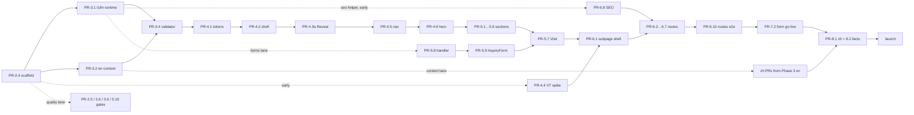

# 10 · Phases, roadmap & PR stack

## Purpose

This document turns the decisions in `01`–`09` and `11` into an execution plan: the phases the build goes
through, what each phase delivers and how it is accepted (a human-closed gate bead per phase, per 11), the
PR stack inside each phase with its primary bead, file areas, dependencies, size and verifier check, the
dependency graph and critical path, which lanes run in parallel on disjoint file sets, a relative roadmap
(weeks from kickoff, not dates) with milestones and the review cadence, and the working agreements every PR
follows. It is a plan only: nothing here starts until the human closes the Phase 1 gate (`gp-dln.4`). It
decides *when* and *in what order*; the *what* and *how* stay in the owning documents and are cited by id.

Status: draft · seat writer-breakdown · 2026-08-22

Notes: pass 1 was drafted while 04, 06, 08 and 09 were still being written — this pass reconciles every phase
with them by decision id (§2–§8), adds the rows their artifacts need, and rebuilds the open-question roll-up
against 02's renumbered set (§14). The memo's skeleton is Purpose → Status → Decisions; the one-screen summary
below sits ahead of Decisions deliberately, because `00-README.md` lifts it unedited — the only such deviation.

## Summary (one screen)

**Stack** (`01-stack-decisions.md`, ADR-001 + ADJ-1…9):

1. Next.js 16.x App Router · TypeScript `strict` · React 19.2 · pnpm · Node 24 · Vercel (preview per PR,
   production from `main`; never `output: 'export'`) — D-01.1, D-01.7.
2. next-intl 4.x: `[locale]` segment, `src/proxy.ts`, `localePrefix: 'always'`, JSON messages, typed keys
   — D-01.2, D-01.8.
3. Content = versioned JSON under `content/` (messages + collections per locale, one `site.json`), Zod-validated,
   CMS-ready — D-01.3, `02`.
4. Tailwind CSS v4 with design tokens in `@theme`; `--dur-*` as plain custom properties; CSS Modules for keyframes
   — D-01.4, `03`.
5. Motion (`motion` package) for in-page reveals, stagger, count-up and the locale enter cascade; ambient loops
   are CSS keyframes (05 `D-05.7`); route-level subpage slide = React `<ViewTransition>` +
   `<Link transitionTypes>` (Next ≥ 16.2), instant-swap fallback; GSAP only by a later ADR — D-01.5, D-01.9, `05`.
6. Inquiry form = Route Handler + Zod ≥ 4 + Resend + Turnstile + honeypot, with a Vercel WAF rate-limit rule on
   `POST /api/inquiry` (5 per IP per 10 min → 429) — D-01.6, D-07.7, `07`; quality = ESLint run directly
   (Next 16 removed `next lint`; `react/jsx-no-literals` bans literal JSX text), Stylelint, Vitest/RTL,
   Playwright per locale, `validate:content`, GitHub Actions gates — D-08.3, `08`, `11`.

**Phases** (gate = the human-owned bead that closes the phase; numbering continues the tracker's, where the plan
itself is Phase 1 and `gp-dln.4` is its gate):

| # | Phase | Goal (one line) | Exit gate bead (`-a human`) |
|---|---|---|---|
| 1 | Technical plan | `docs/technical/00`–`12` accepted as the plan of record | `gp-dln.4` · Phase 1 gate · Human sign-off on the technical plan |
| 2 | Foundation | Repo scaffolded (Next 16/TS/pnpm/Tailwind v4/next-intl/Motion), tooling + CI gates, tracker snapshot + `bead-trailer`, governance files (CODEOWNERS, PR template, `renovate.json`), README, first Vercel preview | Phase 2 gate · Foundation accepted (CI + trailer gate required on `main`, preview deploys) |
| 3 | Content & i18n infrastructure | `content/` tree (all `en` keys, `site.json`, schemas), i18n runtime, proxy, `validate:content` + coverage report, `zh` for the 33 prototype strings | Phase 3 gate · Content contract live (`/en` and `/zh` render on preview; INV-02.1–9 gates on) |
| 4 | Design system & motion primitives | Tokens, fonts + CJK stack, layout shell, sticky nav + hamburger + locale switcher, footer, Reveal/variants/WordSwap/CountUp, View Transitions spike → `PageTransition`, Hero as the vertical slice | Phase 4 gate · **M1** skeleton on preview: both locales, nav + hero + footer, cascade, reveals |
| 5 | Homepage | The remaining seven sections (both views, hi-fi) + the inquiry form lane (schema, handler, `InquiryForm`) | Phase 5 gate · **M2** homepage complete; form submits on preview (log transport) |
| 6 | Subpages, transitions & SEO | Six routes + catch-all, slide/Back, per-locale metadata, `hreflang`, sitemap, robots, JSON-LD, 404, security headers | Phase 6 gate · **M3** subpages + SEO |
| 7 | Integrations | Resend domain + inbox, Turnstile production keys, Vercel env scopes + WAF rule, analytics | Phase 7 gate · **M4** inquiry form live in production |
| 8 | Hardening, content completion & launch | `zh` complete, owner facts + photography in, a11y/perf/visual-regression gates, `validate:content --release`, launch checklist | Phase 8 gate · **M5** launch (DNS cutover approved) |

**Critical path:** `gp-dln.4` → scaffold (PR-2.4) → i18n runtime + `en` content + validator (PR-3.1/3.2/3.4) →
tokens (PR-4.1) → shell primitives + motion core (PR-4.2/4.3a) → nav (PR-4.5) → hero (PR-4.6) → sections
(PR-5.1…5.7, Visit last, fed by the forms lane) → subpage shell (PR-6.1, needs the spike PR-4.4) → routes
(PR-6.2…6.7, fed by PR-6.8's metadata helper, which early-starts from Phase 3) → routes e2e (PR-6.10) →
integrations (owner accounts) → translation + `--release` (PR-8.1/8.2) → launch.

**Human inputs by phase** (ids in the owning docs; §14 is the full register — every external open question with
its answerer, the row that needs it and what ships if it is never answered):

| Before | Decide / supply |
|---|---|
| Phase 2 | Close `gp-dln.4`; OQ-11.3 repo settings (branch protection, squash-only, "PR title and description"); OQ-11.4 `CLAUDE.md`; OQ-09.1 Vercel Pro + billing + budget (supersedes OQ-01.4's plan half); OQ-09.3 preview protection; OQ-09.5 standing beads; OQ-11.1 Dolt push (optional); verify-only: OQ-01.3 / OQ-05.1 (scaffold), OQ-08.5 lint stack, OQ-08.3 CI minutes, OQ-08.8 INV-02.1 wording |
| Phase 3 | OQ-02.1 / OQ-03.3 zh-Hans vs Hant; OQ-02.2 prod fallback; OQ-02.4 / `gp-dln.12` Chinese brand name; OQ-02.7 / `gp-dln.6` subpage set (namespaces now, routes at Phase 6); OQ-06.5 cookie lifetime + root detection; OQ-09.4 content-PR approver; OQ-10.4 translation policy; `gp-dln.13` owner facts (`TODO` allowed until Phase 8); doc-level: OQ-04.8, OQ-06.8, OQ-09.10. **Retired by 02's own decisions:** root-path detection (D-02.9) and the "Child's age" option set (D-02.4 rule 8) |
| Phase 4 | OQ-03.2 AA palette; OQ-03.4 / OQ-01.2 / OQ-04.9 CJK typeface; OQ-03.1 tablet; OQ-03.5 emoji; OQ-03.6 vector logo; OQ-04.1 hamburger sheet; OQ-04.4 photo placeholder; OQ-04.6 mobile footer; OQ-04.7 nav at `lg`; OQ-06.6 active-section highlight; OQ-05.2 spike verdict; OQ-05.3/05.4/05.6/05.8 motion sign-offs; OQ-05.5 (answered by 02 + 06) — all have stated defaults; doc-level: OQ-08.9 (03 §5 → `MC-08.1`) |
| Phase 5 | OQ-02.6 testimonials in zh; OQ-07.10 / OQ-04.10 option sets; OQ-07.1 / OQ-02.5 e-mail language; OQ-07.2 auto-ack; OQ-07.8 street address + Maps link; OQ-04.3 drop `gpdevelop`; OQ-08.1 visual-regression scope; OQ-08.6 contrast gate; OQ-10.3 photography timing |
| Phase 6 | `gp-dln.6` / OQ-02.7 subpage set (hard); OQ-04.5 / OQ-06.1 FAQ + Enrollment; OQ-07.5 / OQ-06.4 privacy page; OQ-04.2 lightbox + filters; OQ-06.7 share image; OQ-06.2 / OQ-09.2 host form; OQ-06.9 / `gp-dln.13` owner facts for the JSON-LD |
| Phase 7 | OQ-07.6 sending domain + inbox; OQ-07.4 retention; OQ-01.1 / OQ-07.9 analytics; OQ-09.1 / OQ-09.2 plan, domain and who owns the accounts; OQ-08.4 preview bypass secret |
| Phase 8 | `gp-dln.13` all facts final; `gp-dln.12`; OQ-07.7 Yelp figures/URL; OQ-10.3 photos; OQ-10.4 translation delivered; OQ-06.3 / OQ-09.8 legacy redirects (expected "none beyond `/`"); OQ-08.2 Lighthouse thresholds; OQ-09.6 menu cadence; OQ-09.7 error monitoring; OQ-10.2 launch window |
| Post-launch | OQ-01.5 GSAP trigger; OQ-02.3 / OQ-09.9 CMS; OQ-07.3 CRM; OQ-08.7 `pnpm audit` policy; OQ-11.2 tracker's future (§9) |

**Size** (PR count and band mix; bands per D-10.8; days are implementer-days at the midpoints, ±30 %):

| Phase | PRs | S / M / L | ≈ days | ≈ weeks at two implementers |
|---|---|---|---|---|
| 2 Foundation | 8 (+2 ops) | 6 / 2 / 0 | 10 | 1 |
| 3 Content & i18n | 8 | 4 / 3 / 1 | 16 | 1.5–2 |
| 4 Design system & motion | 7 | 0 / 6 / 1 | 20 | 2 |
| 5 Homepage (+ forms lane) | 10 | 0 / 7 / 3 | 33 | 3 |
| 6 Subpages & SEO | 11 (1 conditional) | 5 / 5 / 1 | 21 | 2 |
| 7 Integrations | 2 (+3 ops) | 2 / 0 / 0 | 2 + owner lead time | 1 |
| 8 Hardening & launch | 7 (+2 ops) | 3 / 4 / 1 (translator) | 12 + translation | 2 |
| **Total** | **≈ 53** | | **≈ 114** | **≈ 12–13** |

## Decisions

- **D-10.1 Phase set and numbering.** Eight phases as in the summary table; the plan is Phase 1 so that the
  existing gate bead `gp-dln.4` ("Phase 1 gate") keeps its title and every later gate is titled `Phase <n> gate ·
  <acceptance>` as 11 requires (TRAP-11.12, W-11.8). Implementation is Phases 2–8; post-launch work is a backlog
  epic, not a phase (§9).
- **D-10.2 A gate is a merge barrier, not a start barrier.** No PR belonging to phase *n* merges to `main` before
  the Phase *n − 1* gate is closed by the human (INV-10.1). A PR whose named dependencies are merged may be
  started on a branch earlier (rows marked *early-start*), so a slow gate review never idles the seats; it only
  delays landing. Entry criteria are per PR (named PRs, symbols, OQs) — never "the stack says so".
- **D-10.3 PR granularity.** One coherent change per PR: one section (both views) = one PR; one primitive family
  = one PR; one route = one PR; content-only changes (files under `content/**`) are separate PRs from code, so
  diffs show copy only and the editor workflow of 09 stays clean; ops work that has no code (Vercel, Resend,
  Cloudflare, DNS) is a bead without a PR (`OPS-<phase>.<n>` rows). A PR is split for reviewability — different
  concern, different verifier, different file set — never to a line count (§12).
- **D-10.4 The inquiry form is a lane inside Phase 5, integrations are Phase 7.** Schema + handler + `InquiryForm`
  (07 §1–2) are built beside the sections on disjoint files (`src/lib/inquiry/**`, `src/app/api/inquiry/**`,
  the form component) with the `log` transport and Turnstile test keys, so M2 shows a working form on preview;
  accounts, domain DNS, production keys, the WAF rule and analytics (07 §5–6, 09) are Phase 7.
- **D-10.5 View Transitions spike first.** OQ-05.2 (a)–(f) is answered by a spike in Phase 4 (PR-4.4), before any
  route work; its outcome fixes `PageTransition` as View Transitions (D-05.10) or the F1 fallback (05 §5.7), and
  if F1, 01 records the amendment to ADR-005 in the same PR.
- **D-10.6 `zh` parity runs in *warn* mode until Phase 8.** Only 33 of the ≈ 200 copy keys have prototype
  Chinese (R1 inventory); the rest come from a translator (OQ-10.4). From PR-3.4 the validator fails on `en`
  problems and on any *invented* or empty `zh` value, but reports missing `zh` keys as warnings in the coverage
  report (INV-02.6); PR-8.1 flips the `zh` policy to fail. No English text is ever placed in a `zh` file; missing
  keys render `⟦key⟧` in dev and English on previews (D-02.8). This is the build-time application of OQ-02.2 and
  needs the human's confirmation (OQ-10.4).
- **D-10.7 Hero is the Phase 4 vertical slice.** M1 is reached when nav, hero and footer render in both locales
  on a Vercel preview with tokens, fonts, the locale cascade, `Reveal`, ambient loops and reduced motion — one
  real section proves the primitives before seven more are built on them.
- **D-10.8 Effort bands.** S ≈ ½–1 implementer-day, M ≈ 2–3, L ≈ 4–6, each *including* tests, the verifier's
  check and review fixes; the midpoints (0.75 / 2.5 / 5) give the sums in the summary. Capacity is assumed to be
  two implementers (human engineers or orchestrated agent seats) with the human closing gates within two
  business days — A-10.1, confirmed by OQ-10.1. The bands are re-calibrated against Phase 2's actuals at its gate.
- **D-10.9 Tracker shape for the build.** One epic per phase (`Phase <n> · <name>`), one task bead per PR row
  (child of the epic; the PR id is in the bead title), `OPS-` rows as `chore` beads, the gate as a `task` bead
  titled `Phase <n> gate · …` assigned `human`, with `bd dep add <Phase n epic> <Phase n−1 gate>` and `bd dep add
  <Phase n gate> <each task bead>` so `bd` refuses to close a gate with open work (TRAP-11.13). The orchestrator
  creates them at kickoff; seats never run `bd` (INV-11.4). Existing beads are reused where they exist
  (`gp-dln.5/7/8/10/11`, decisions `gp-dln.6/12/13`).
- **D-10.10 Order of the first Phase 2 PRs.** The tracker-snapshot commit (`export.auto`, `issues.jsonl`,
  `.beads/PRIME.md`, `.gitattributes` `merge=union`) lands before the `bead-trailer` workflow PR — the gate
  cannot pass until `issues.jsonl` exists at the PR head (11 §5–6; `gp-dln.10`, `gp-dln.11`). If `gp-dln.10`
  and `gp-dln.7` are folded into the plan PR at landing (as their bead text says), PR-2.1/2.2 shrink accordingly.

## Design

### 1 · Phase model

Each phase has: **entry** (the previous gate closed; owner inputs for the phase supplied or their defaults
accepted), **scope** (which decisions it implements, by id), a **PR stack** (table), an **exit gate** (what the
human looks at; the bead title), **risks**, and **human inputs**. PR ids `PR-<phase>.<n>` are stable and are the
board's plan rows (11 D-11.3; the board projects this table and never re-derives it). Rows say *early-start* when
branch work may begin before the previous gate closes (D-10.2). "Verifier check" is the adversarial check the
second seat authors before seeing the implementation (W-11.11); the CI gates it leans on are 08's.

Paths below are the owning documents' (02 content and i18n, 03 tokens, 04 components, 05 motion, 06 routes,
07 form, 08 gates, 09 operations, 11 tracker); the TS token mirror is `src/design/tokens.ts` (memo ADJ-8).

**Seats.** Two seats work every row (W-11.11, INV-11.3): implementer `writer-<topic>` and verifier
`check-<topic>`, where `<topic>` is the row's slug listed under each phase table; the orchestrator is neither
and closes the bead on the verdict (W-11.6, TRAP-11.8).

**Starting state.** The tree today is `README.md` (stale CRA boilerplate), `docs/**`, `.claude/**`, `.beads/`
and `.gitignore`. There is no `package.json`, no `.github/`, no `.gitattributes` and no `.beads/issues.jsonl`
— the first Phase 2 PRs create all four, which is why PR-2.1 and PR-2.4 have no code dependencies.

### 2 · Phase 2 · Foundation

**Entry.** `gp-dln.4` closed. **Scope.** D-01.1, D-01.4 (scaffold), D-01.7 (Vercel); 08's tooling and gate
inventory by id — D-08.1 (pyramid), D-08.2 (literal-text config), D-08.3 (ESLint run directly), D-08.4
(Stylelint), D-08.6 (Vitest/RTL), D-08.7 (Playwright projects), D-08.11 (bundle-secret + trailer scripts),
D-08.12 (CI, required checks), D-08.13 (flake policy), D-08.14 (`pnpm ci`, no git hooks), D-08.15 (DoD, §12),
D-08.16 (coverage policy); 09's platform and governance decisions — D-09.1 (three environments), D-09.2 (Pro),
D-09.3 (project settings: Node 24, pnpm, region `sfo1`, Fluid, Ignored Build Step), D-09.4 (Deployment
Protection), D-09.6 (secrets in Vercel only), D-09.7 (Actions runs gates, Vercel builds), D-09.8 (branch
protection), D-09.9 (release = squash merge; rollback), D-09.11 (trailer for content and bot PRs), D-09.16
(backups), D-09.17 (Renovate), D-09.19 (access control); 11 §5–6 (tracker snapshot, `bead-trailer`); chores
`gp-dln.5/7/8/10/11`; INV-02.1/02.7/02.9 and INV-03.1–3 lint rules switched on before any component exists.
`gp-dln.8`'s bead note calls itself "a phase-0 task": it is scheduled here, in Phase 2, because replacing the
README is a repo change and INV-10.1 keeps every repo change behind the `gp-dln.4` gate.

| PR | Title | Primary bead | Files / areas | Depends on | Size | Parallel with | Verifier check |
|---|---|---|---|---|---|---|---|
| PR-2.1 | Tracker snapshot + config: `export.auto` on, the orchestrator's `bd export -o .beads/issues.jsonl` output committed (the seat commits the file, never runs `bd` — INV-11.4), `.beads/PRIME.md`, `.gitattributes` `merge=union` | `gp-dln.10` | `.beads/issues.jsonl`, `.beads/interactions.jsonl`, `.beads/config.yaml`, `.beads/PRIME.md`, `.gitattributes` | — (first PR; or folded into the plan PR) | S | all | `issues.jsonl` lists every claimed bead; `git check-attr merge .beads/interactions.jsonl` → `union`; the committed `.beads/PRIME.md` carries the seat-facing tracker text and `.beads/issues.jsonl` parses as JSONL — both read from the files, never by running `bd` (INV-11.4, D-10.9) |
| PR-2.2 | Repo hygiene: project README, untrack `.DS_Store` + macOS ignores, `.editorconfig`, `CLAUDE.md` per OQ-11.4 | `gp-dln.8` (+ `gp-dln.7` under `## Beads`) | `README.md`, `.gitignore`, `.DS_Store`, `CLAUDE.md` | — | S | all | README points at `docs/technical/00-README.md`; `git ls-files .DS_Store` empty; no CRA text remains |
| PR-2.3 | CI: `bead-trailer` gate | `gp-dln.11` | `.github/workflows/bead-trailer.yml`, `scripts/ci/bead-trailer.sh` | PR-2.1 | S | 2.2, 2.4, 2.5 | Script fails a commit without trailer and a PR body without one; passes on itself; `jq` only; required check on `main` (OQ-11.3, human) |
| PR-2.4 | App scaffold: `package.json` (pnpm, `engines.node 24.x`), Next 16.x + React 19.2 + TS strict, Tailwind v4 + `@tailwindcss/postcss`, `globals.css`, root layout + blank page (no text), deps pinned (next-intl 4.x, `motion`, `zod ≥ 4`), `.env.example`, `.nvmrc` | new: *Phase 2 · app scaffold* | `package.json`, `pnpm-lock.yaml`, `next.config.ts`, `tsconfig.json`, `postcss.config.*`, `src/app/layout.tsx`, `src/app/page.tsx`, `src/app/globals.css`, `.env.example` | — | M | 2.1–2.3 | `pnpm install --frozen-lockfile && pnpm build` green; scaffold-time verifications recorded in the bead: Next ≥ 16.2 `ViewTransition` + `Link transitionTypes` present (OQ-01.3 / OQ-05.1), Tailwind v4 browser floor, Zod 4 APIs, next-intl peer range |
| PR-2.5 | Lint & test tooling: ESLint flat config (`react/jsx-no-literals` per INV-02.1, `no-restricted-imports` INV-02.7, `no-restricted-syntax` INV-02.9 + INV-03.1/03.2 regexes, breakpoint-variant rule INV-03.3), Stylelint (`color-no-hex`, disallowed lists), Prettier, Vitest + RTL, Playwright projects (1280 / 390, reduced-motion), `pnpm` scripts | new: *Phase 2 · lint & test tooling* | `eslint.config.*`, `.stylelintrc*`, `.prettierrc*`, `vitest.config.*`, `playwright.config.*`, `e2e/`, `package.json` scripts | PR-2.4 | M | 2.1–2.3 | A fixture with a literal string, a `next/link` import, a `#hex` and a `[13px]` each fail lint; a clean fixture passes; one unit + one e2e smoke run |
| PR-2.6 | CI: `ci.yml` — install, typecheck, lint (ESLint + Stylelint + Prettier), unit, build, e2e smoke, `TODO\|FIXME\|HACK` grep over `src/**` (TRAP-11.9); concurrency; required-checks list for 09 | new: *Phase 2 · CI pipeline* | `.github/workflows/ci.yml` | PR-2.4, PR-2.5 | S | 2.3 | Workflow green on the PR; a seeded `TODO` fails it; job names match 08's gate inventory |
| PR-2.8 | Skill sync: `super-orchestrator` SKILL.md ids → 11 (§9 table), W-11.2 unclaim recipe, `board.py` path notes | `gp-dln.5` | `.claude/skills/super-orchestrator/SKILL.md` (+ `scripts/board.py` comments) | — | S | all | Every row of 11 §9 applied; no `13-work-tracking`, `W1`–`W7`, `PRO-*` left outside the history note |
| PR-2.9 | Repo governance (09): `CODEOWNERS` (`content/** public/images/**` → owner + developer, everything else → developer, D-09.19), `.github/PULL_REQUEST_TEMPLATE.md` whose last line is the `Bead:` trailer (D-09.11), `renovate.json` (weekly grouped minors, majors singly, automerge off, `commitTrailers`/`prFooter` carrying the standing dependency bead, D-09.17) | new: *Phase 2 · repo governance* | `.github/CODEOWNERS`, `.github/PULL_REQUEST_TEMPLATE.md`, `renovate.json` | PR-2.3 (`scripts/ci/bead-trailer.sh` defines the trailer the template must satisfy) | S | 2.4–2.6, 2.8 | Template's trailer passes the PR-2.3 script unedited; `CODEOWNERS` parses in the GitHub UI and covers `content/**`; Renovate's dry run opens one grouped PR carrying the bead trailer; the two standing beads exist (OQ-09.5) |
| OPS-2.1 | Vercel project linked (D-09.3: framework Next.js, Node 24.x, pnpm, region `sfo1`, Fluid, Ignored Build Step skipping `docs/**` + `.beads/**` + root-doc-only commits), preview per PR, production from `main`, `NEXT_PUBLIC_SITE_URL` per scope, Deployment Protection on previews with a bypass secret for CI (D-09.4, OQ-09.3, OQ-08.4) | new chore: *Phase 2 · Vercel project* | dashboard (no code) | PR-2.4 | S | all | Preview URL on PR-2.5; production deploy of `main` succeeds; a docs-only commit produces no build; the bypass secret is stored as a GitHub Actions secret and nowhere else |
| OPS-2.2 | Tracker relocation before this plan's worktree is removed (TRAP-11.6): export, then move `.beads/embeddeddolt/` and `.beads/backup/` into the main checkout, re-point `BEADS_DIR`, confirm one database | new chore: *Phase 2 · tracker relocation* | `.beads/` outside the worktree (no code) | PR-2.1 (the export it protects) | S | all | The orchestrator's shell reports one database at the main checkout; `git worktree remove` afterwards deletes no tracker data; `issues.jsonl` at `main` still lists every claimed bead |

**Seats** (`writer-<topic>` / `check-<topic>`): 2.1 `tracker-snapshot` · 2.2 `repo-hygiene` · 2.3 `trailer-gate` ·
2.4 `scaffold` · 2.5 `lint-tooling` · 2.6 `ci-pipeline` · 2.8 `skill-sync` · 2.9 `governance` ·
OPS-2.1 `vercel-project` · OPS-2.2 `tracker-relocation`. The id PR-2.7 is retired — the stack deliberately
jumps 2.6 → 2.8 — and is never reused, so a plan row's id always means the same work on the board.

**Exit gate.** `Phase 2 gate · Foundation accepted`: CI and `bead-trailer` required on `main` (OQ-11.3 done by the
human), a preview URL on every PR, `issues.jsonl` tracked, README replaced, lint rules proven by fixtures,
governance files merged (09 §5.1 item 10's repo half).
**Risks.** Version drift between the docs' pins and what `pnpm` resolves (mitigation: PR-2.4 records the
verified versions and any mismatch becomes an ADR note in 01); the trailer gate failing on its own first PR
(mitigation: PR-2.1 lands first, D-10.10); 08's gate inventory names `.github/dependabot.yml` while D-09.17
decides Renovate because Dependabot cannot write a commit body (mitigation: PR-2.9 ships `renovate.json` and
corrects 08's line in the same PR, per the DoD's "changed decisions change in their owning doc").
**Human inputs.** OQ-11.3, OQ-11.4, OQ-09.1 (with OQ-01.4's budget half), OQ-09.3, OQ-09.5, OQ-11.1;
verification-only: OQ-01.3 / OQ-05.1 at PR-2.4, OQ-08.5 and OQ-08.8 at PR-2.5, OQ-08.3 at PR-2.6.

### 3 · Phase 3 · Content & i18n infrastructure

**Entry.** Phase 2 gate. **Scope.** D-02.1–D-02.17, INV-02.1–INV-02.9, ADR-002/003/008; D-06.4 (prerender per
locale, `generateStaticParams`), D-06.5 (`src/proxy.ts` = `createMiddleware(routing)`), D-06.14 (error routes);
D-08.5 (content gates are one script); D-09.10 (editors work through the GitHub web editor), D-09.12
(translation workflow and `content/GLOSSARY.md`), D-09.13 (menu = rotating sample week). The input is the R1
string inventory taken from the design handoff — 243 keys, 33 of them with prototype Chinese in the `I18N`
table inside `docs/design/desktop/Green Pastures - Homepage.dc.html` — and 02's key naming is the output.

| PR | Title | Primary bead | Files / areas | Depends on | Size | Parallel with | Verifier check |
|---|---|---|---|---|---|---|---|
| PR-3.1 | i18n runtime + routing: `routing.ts` (`LOCALE_META`), `navigation.ts`, `request.ts` (`onError`, `⟦…⟧` fallback), `messages.ts`, `formats.ts`, `global.d.ts`, `src/proxy.ts` (matcher excludes `/api`, `/_next`, `/_vercel`, files), next-intl plugin + `createMessagesDeclaration`, `[locale]/layout.tsx` (`lang`, `NextIntlClientProvider` namespaces per D-02.16, `generateStaticParams`, `data-scroll-behavior="smooth"`), minimal `[locale]/page.tsx`, `common.json` + `errors.json` seed | new: *Phase 3 · i18n runtime* | `src/i18n/**`, `src/proxy.ts`, `next.config.ts`, `src/app/[locale]/layout.tsx`, `src/app/[locale]/page.tsx`, `content/en/messages/{common,errors}.json` (two-key seed only) | PR-2.4 | M | 3.3; and 3.2 on every path except the two seed files it hands over | `/` → `/en` or `/zh` by Accept-Language; `/en/x` 404s in `en`; `<html lang>` = `en` / `zh-Hans`; `t('nope')` is a type error; a missing key renders `⟦common.nope⟧` in dev |
| PR-3.2 | `en` content tree: every R1 key under 02's names (`home`, `philosophy`, `programs`, `menu`, `gallery`, `reviews`, `team`, `visit`, `errors`, `email`, `common`), `Short` variants (D-02.13), rich tags (D-02.5), production-only keys (meta, a11y, form states, `visit.form.errors.<code>` for all 07 §9 codes), `content/site.json` with `TODO` owner fields | new: *Phase 3 · en content + site.json* (label `i18n`) | `content/en/**`, `content/site.json` | — (JSON only; *early-start* after Phase 2 gate). It completes `content/en/messages/{common,errors}.json` only after PR-3.1's seed merges — the two files are serialised, the rest of `content/en/**` is PR-3.2's alone | L | 3.1 (outside the two seed files), 3.3 | Every non-implied R1 key has a home (R1 `strings.json` cross-walk); 02 §Key naming rules hold; no URL/phone/`/images/` in locale files (INV-02.4); JSON valid + Prettier clean |
| PR-3.3 | Zod schemas + typed access: `src/content/schemas/*` (site, programs, menu, gallery, testimonials, teachers, faq), `site.ts`, `collections.ts`; loader parses on first use | new: *Phase 3 · content schemas* | `src/content/**` | PR-3.2 (`content/site.json` and the collection JSON the schemas parse and type); PR-2.4 for the toolchain | M | 3.1 | An invalid `site.json` fails `next build` with a readable Zod issue; `z.infer` types used by a sample component compile |
| PR-3.4 | `pnpm validate:content`: parity (keys, ICU args, rich tags, array lengths), empty/`'{`/HTML checks, locale-agnostic-value scan, schemas, id cross-refs, asset + alt checks, `--report` → `reports/content-coverage.md` attached in CI, `--release`, per-locale policy (`zh` warn per D-10.6) | new: *Phase 3 · validate:content gate* (label `ci`,`i18n`) | `scripts/validate-content.ts`, `.github/workflows/ci.yml` | PR-3.2, PR-3.3 | M | 3.5, 3.6 | Seeded faults each fail: extra `zh` key, missing `en` key, `""`, `'{`, `<b>`, a phone in `zh`, an id without text, a photo without `alt`; coverage report shows 33/N zh; `--release` fails on `TODO` |
| PR-3.5 | `zh` seed: the 33 prototype strings + 02's worked examples, `common.localeSwitcher.label` and `.ariaLabel` (the endonyms themselves are `LOCALE_META` data, never message keys — 02 rule 11, D-02.14), punctuation keys | new: *Phase 3 · zh seed* (label `i18n`) | `content/zh/**` | PR-3.2 | S | 3.4 | Every value is verbatim from the prototype `I18N` table in `docs/design/desktop/Green Pastures - Homepage.dc.html`, or from 02's worked examples; no invented zh; `/zh` renders them |
| PR-3.6 | Playwright smoke per route × locale (INV-02.5): 200, `<html lang>`, no `⟦`, `hreflang` set when present; reads routes from `site.json.routes[]` | new: *Phase 3 · route × locale smoke* (label `ci`) | `e2e/smoke*` | PR-3.2 (`site.json.routes[]`, the list the spec iterates), PR-3.1 (`<html lang>` and the rendered pages it asserts on) | S | 3.4 | Fails when a `⟦` marker is injected; runs on preview URL in CI |
| PR-3.7 | Error routes: `[locale]/not-found.tsx`, root `not-found.tsx` (`en`), `error.tsx`, copy from `errors.json` | new: *Phase 3 · error routes* | `src/app/**/not-found.tsx`, `src/app/**/error.tsx` | PR-3.1 | S | 3.4–3.6 | `/zh/nope` renders zh 404; `/xx/nope` renders en 404; no literal text |
| PR-3.8 | Editor and translator guide (09 §4): `content/README.md` — what each file is, how to edit one on GitHub, the `Bead:` line to paste, the operations appendix (D-09.10, D-09.11); `content/GLOSSARY.md` — every fixed term with its `en` and `zh` rendering (D-09.12); menu cadence recorded as the rotating sample week (D-09.13); root README links both | new: *Phase 3 · editor guide* (label `docs`) | `content/README.md`, `content/GLOSSARY.md`, `README.md` | PR-3.2 (the tree it documents), PR-2.9 (the PR template it quotes) | S | 3.4–3.7 | A reader who has never seen the repo can follow it to change one string and open a PR that passes `bead-trailer`; every path it names exists; the glossary covers each brand term in `site.json` |

**Seats** (`writer-<topic>` / `check-<topic>`): 3.1 `i18n-runtime` · 3.2 `en-content` · 3.3 `content-schemas` ·
3.4 `content-gate` · 3.5 `zh-seed` · 3.6 `route-smoke` · 3.7 `error-routes` · 3.8 `editor-guide`.

**Exit gate.** `Phase 3 gate · Content contract live`: `/en` and `/zh` on preview, `validate:content` + coverage
report in CI, all `en` keys authored, `zh` 33 + examples, INV-02.1/02.7/02.9 lint proven, 02's three checklists
rehearsed once (add a key, add a collection entry, add-a-locale dry run).
**Risks.** Key-name churn once 04 keys components (mitigation: PR-3.2 follows 02's rules exactly and 04 maps to
them; a rename is one content PR + type errors list usages); the `zh` parity policy (D-10.6) if the human wants
fail-from-day-one (then translation moves onto the critical path — OQ-10.4). **Human inputs.** OQ-02.1 with
OQ-03.3, OQ-02.2, OQ-02.4 / `gp-dln.12`, OQ-02.7 / `gp-dln.6` (namespace reservation now, route set at Phase 6),
OQ-06.5, OQ-09.4, OQ-10.4, `gp-dln.13` (placeholders allowed); doc-level answers owed by 02 to 04, 06 and 09:
OQ-04.8, OQ-06.8, OQ-09.10 (`brand.url` versus `NEXT_PUBLIC_SITE_URL`, and preview `metadataBase`).
Root-path detection and the "Child's age" option set are **not** asked here — 02 retired both,
answering them with D-02.9 and D-02.4 rule 8.

### 4 · Phase 4 · Design system & motion primitives

**Entry.** Phase 3 gate (PR-4.1 and PR-4.4 are *early-start* after PR-2.4). **Scope.** D-03.1–D-03.13,
INV-03.1–INV-03.5, D-05.1–D-05.13, INV-05.1–INV-05.11, D-02.10 (switcher), ADJ-4/5/6/8; 04's shell and
primitives by id — D-04.1 (server sections, enumerated client leaves), D-04.2 (client leaves take props, never
content), D-04.3 (one `Section` shell), D-04.4 (sections are self-sufficient), D-04.5 (`*Short` siblings, no
branching), D-04.6 (layout geometry is component config), D-04.8 (hamburger = full-screen sheet), D-04.9 (nav
row at `lg`), D-04.12 (`Picture`), D-04.13 (`richTags()`), D-04.15 (decorations are client components);
06's home-navigation decisions — D-06.6 (anchors are `site.json.routes[].homeAnchor` data), D-06.7 (home
navigation is hash-first), D-06.9 (language switcher = same-path `Link` with `locale`).

| PR | Title | Primary bead | Files / areas | Depends on | Size | Parallel with | Verifier check |
|---|---|---|---|---|---|---|---|
| PR-4.1 | Tokens: `tokens.css` (`@theme static` + `:root` `--dur-*`/`--stagger-*`/`--section-*`/`--tap-*`/`--nav-h`, `:root:lang(zh)`, focus ring), `globals.css` import, `fonts.ts` (Fredoka 500/600, Nunito 600/700/800, `--font-cjk` stack), `src/design/tokens.ts` mirror + parity test (INV-03.4), `public/brand/logo.png` | new: *Phase 4 · design tokens* | `src/styles/tokens.css`, `src/app/globals.css`, `src/design/fonts.ts`, `src/design/tokens.ts`, `public/brand/**` | PR-2.4 (*early-start*) | M | 4.4 | Every 03 §2–§7 token present with the quoted value; parity test fails when one side changes; no `--duration-*` in `@theme`; `bg-sage` etc. generated |
| PR-4.2 | Layout shell + primitives (04): `Section` (bg/padding tokens, `scroll-snap-align`, `scroll-margin-top: var(--nav-h)`, id from `site.routes[].homeAnchor`), container, `Eyebrow`, heading/subhead recipes, `SectionLink`, pill `Button`, `Chip`, `Emoji` (D-03.8), `PhotoSlot` (03 §9), card radii | new: *Phase 4 · layout shell & primitives* | `src/components/ui/**` and `src/components/layout/{Section,SectionHeader}.tsx` (04 §2's tree) | PR-4.1, PR-3.1 | M | 4.3a, 4.3b | Token-only (INV-03.1–3 lint green); `uppercase` only via the eyebrow recipe; `PhotoSlot` fill is `color-mix` of the section bg; 44 px hit areas |
| PR-4.3a | Motion core (05 §5.1–5.3, 5.9): `MotionProvider` (`LazyMotion` + `MotionConfig reducedMotion="user"`), `Reveal`/`RevealItem`, `variants.ts` (11 entries, keyframe `times`, `reduced`), `registry.ts`, noscript stylesheet, unit tests for catalogue fidelity | new: *Phase 4 · Reveal & variants* | `src/components/motion/{MotionProvider,Reveal}.tsx`, `src/components/motion/registry.ts`, `src/components/motion/variants.ts`, tests (04 §2's tree, ADJ-15) | PR-4.1 | M | 4.2, 4.3b, 4.4 | `variants.ts` equals 05 §5.2 (values, `times`, origins); reveal once survives a client navigation; reduced motion yields opacity-only; one IntersectionObserver |
| PR-4.3b | Text, numbers, decorations: `WordSwap` (D-05.9), `CountUp` (D-05.8), `Sun`/`Leaf`/`ScrollCue` two-layer components + `ambient.css` loops paused off-screen (D-05.7, INV-05.5) | new: *Phase 4 · WordSwap, CountUp, decorations* | `src/components/motion/{WordSwap,CountUp}.tsx`, `src/components/motion/ambient.css`, `src/components/decor/**` (04 §2's tree) | PR-4.3a | M | 4.2, 4.4 | Cascade delay `min(i×14, 300)` ms; count-up final value in SSR HTML; loops `animation: none` under reduced motion; outer layer has stable `id` + forwarded `ref` |
| PR-4.4 | View Transitions spike (OQ-05.2 a–f) on a throwaway branch, then land `PageTransition` + `view-transitions.css` per the verdict (VT or F1, D-10.5) | new: *Phase 4 · View Transitions spike & PageTransition* | `src/components/motion/PageTransition.tsx`, `src/components/motion/view-transitions.css` (04 §2's tree); spike routes never merged | PR-2.4 (*early-start*), PR-4.1 | M | 4.1–4.3 | Bead note answers (a)–(f) with browser matrix; typed forward/back animate, untyped instant, reduced motion instant; next-intl `Link`/`useRouter` pass `transitionTypes` (or the F1 wrapper is in place and 01 amended) |
| PR-4.5 | Sticky nav (links from `site.nav` + `common.nav.*`, "Book a tour" → `#visit`, `LocaleSwitcher` = next-intl `Link` + `router.replace(pathname, {locale, scroll:false})` + `transitionTypes` + `markLocaleSwap()`), mobile hamburger sheet (default motion per OQ-05.3) with the full link set incl. Contact + toggle, `Footer` (logo card, `site.nav.footer[]` = six links + Contact on both views per OQ-04.6, copyright and the licence-number line on both views — `gp-dln.9`, whose decision belongs to 02 and 12; 10 only schedules where it renders) | new: *Phase 4 · nav, switcher, footer* | `src/components/layout/{SiteHeader,PrimaryNav,LangSwitcher,BookTourButton,TrackedLink,Hamburger,MobileMenu,SiteFooter,LogoCard,FooterLinks,Copyright,SkipLink}` (04 §2's tree; `Section`/`SectionHeader` in the same folder are PR-4.2's and the subpage trio is PR-6.1's), `src/app/[locale]/layout.tsx` | PR-4.2, PR-4.3b, PR-4.4 | L | 4.6 (after 4.5 merges: none) | Switch keeps path/hash, no full reload, cascade plays, CLS ≤ 0.02 and no font request on toggle (03 §3.3); hamburger a11y (focus trap, `menuOpen/menuClose` labels); `--nav-h` matches rendered height |
| PR-4.6 | Hero section (D-10.7): text column `rise`, photo `rise` + `opaque` (OQ-05.8), badge, CTAs (`#visit`, philosophy link), trust row (`{rating, number, rating}`, ages + `agesShort`), meals card, `Sun` + 3 `Leaf` / 1 on mobile, `ScrollCue`, `PhotoSlot` | new: *Phase 5-ready · Hero section* | `src/components/sections/Hero*`, `src/app/[locale]/page.tsx` | PR-4.5 | M | — | Matches `docs/design/desktop/README.md` §1 and `mobile/README.md` §1 at 1280/390 (snapshot baseline started); LCP element never at opacity 0; zh renders with CJK fallback and ≥ 1.2 headline leading |

**Seats** (`writer-<topic>` / `check-<topic>`): 4.1 `tokens` · 4.2 `shell` · 4.3a `motion-core` ·
4.3b `motion-text` · 4.4 `vt-spike` · 4.5 `nav` · 4.6 `hero`.

**Exit gate.** `Phase 4 gate · M1 skeleton`: preview with nav + hero + footer in `en` and `zh`, reveals and loops,
reduced-motion parity, cascade on toggle, tokens proven by the parity test, spike verdict recorded.
**Risks.** View Transitions not behaving at the pinned Next (mitigation: F1 is one file, D-10.5); AA palette
(OQ-03.2) answered late → token change PR under INV-03.5; CJK rendering differences across OSes (OQ-03.4 default
system stack; screenshots at the gate). **Human inputs.** OQ-03.1/03.2/03.4 (= OQ-01.2 = OQ-04.9)/03.5/03.6,
OQ-04.1/04.4/04.6/04.7, OQ-05.2 (spike verdict), OQ-05.3/05.4/05.6/05.8, OQ-06.6 — every one has a stated
default that ships if unanswered, and OQ-05.5 is answered by 02 (D-02.10, D-02.16) and 06 (D-06.7, D-06.8).
Doc-level: OQ-08.9, owed by 03 — reword 03 §5 to name `MC-08.1`, the manual per-OS glyph check, because 08 has
no per-OS visual snapshot to point at (D-08.10).

### 5 · Phase 5 · Homepage

**Entry.** Phase 4 gate. **Scope.** the eight "worlds" of `docs/design/README.md` (hero done in Phase 4),
05 §5.3 composition per section, D-02.11/02.13 collections and slicing, D-07.1–D-07.8 and INV-07.1–INV-07.8
(forms lane); 04's section-level decisions by id — D-04.10 (menu day chips swap server-rendered sample lines)
and D-04.14 (the error-code record lives in `InquiryForm`), with D-04.3/04.4/04.5/04.6/04.12/04.13 applied to
every section; D-08.8 (axe in the e2e run) starts here and becomes a blocking gate in Phase 8.

Every section PR owns its own component family and appends one composition line to the single file they share,
`src/app/[locale]/page.tsx` — created by PR-4.6, then edited one PR at a time. That append is the phase's only
serialisation point; the component files are disjoint, so the rows below are otherwise mutually parallel.

| PR | Title | Primary bead | Files / areas | Depends on | Size | Parallel with | Verifier check |
|---|---|---|---|---|---|---|---|
| PR-5.1 | Philosophy: quote block `ink` (rich `<em>`), badges `ink`, photo, link (`Link transitionTypes` to `site.routes.philosophy`), mobile `Leaf` | new: *Phase 5 · Philosophy section* | `src/components/sections/Philosophy*`, one line in `src/app/[locale]/page.tsx` | PR-4.2 (`Section`, `Eyebrow`, `PhotoSlot`, `SectionLink`), PR-4.3a (`Reveal`, `variants.ts` `ink`), PR-4.6 (`src/app/[locale]/page.tsx`) | M | 5.2–5.9 | Quote mark/colour tokens; `ink` reduced = opacity only; link target from `site.routes[]` |
| PR-5.2 | Programs: three `SteppingStone` from `collections.programs` × `site.programs[]`, `sprout` stagger, `featured` raised, `ratioLabel` ICU, mobile alternating path, `lg:` three columns | new: *Phase 5 · Programs section* | `src/components/sections/Programs*`, `SteppingStone`, one line in `src/app/[locale]/page.tsx` | PR-4.2 (`Section`, `Chip`, `PhotoSlot`), PR-4.3a (`variants.ts` `sprout` stagger), PR-4.6 (`src/app/[locale]/page.tsx`) | M | 5.1, 5.3–5.9 | Stone sizes 150/188/150 ≥ `lg`, 104/122/104 < `md`; highlights slice per view; no locale branching |
| PR-5.3 | Menu: `Plate` + dots, day chips (client, `menu` + `common` namespaces; default day in `America/Los_Angeles` after hydration, weekend → `mon`), `WordSwap` sample line (`home.menu.sampleLine` with `<day>`), `roll`/`drop`, dietary chips slicing, weekday via `weekdayShort` | new: *Phase 5 · Menu section* | `src/components/sections/Menu*`, `Plate`, `MenuDayPicker`, one line in `src/app/[locale]/page.tsx` | PR-4.2 (`Section`, `Chip`), PR-4.3a (`variants.ts` `roll`/`drop`), PR-4.3b (`WordSwap`), PR-4.6 (`src/app/[locale]/page.tsx`) | L | 5.1, 5.2, 5.4–5.9 | No SSR/CSR day mismatch; chip hit area ≥ 44 px; sample line text from the collection only; swap is `WordSwap` |
| PR-5.4 | Gallery: `Polaroid` ×7 desktop / ×5 mobile from `onHome`/`onMobile`, `polaroid` variant by index parity, resting tilt on the inner frame, hover straighten, link | new: *Phase 5 · Gallery section* | `src/components/sections/Gallery*`, `Polaroid`, one line in `src/app/[locale]/page.tsx` | PR-4.2 (`Section`, `PhotoSlot`), PR-4.3a (`variants.ts` `polaroid`), PR-4.6 (`src/app/[locale]/page.tsx`) | M | 5.1–5.3, 5.5–5.9 | Fly-in bleed absorbed by `html { overflow-x: clip }` (INV-05.2); alt from collection; positions/rotations from data |
| PR-5.5 | Testimonials: `Bubble` tails per view, `bubble` origin by tail, two `CountUp`s (rating, count), Yelp badge + new-tab link (`common.links.newTab`), locale quote marks, surface flags (`karenT` desktop only) | new: *Phase 5 · Testimonials section* | `src/components/sections/Testimonials*`, `Bubble`, one line in `src/app/[locale]/page.tsx` | PR-4.2 (`Section`, `Eyebrow`), PR-4.3a (`variants.ts` `bubble`), PR-4.3b (`CountUp`), PR-4.6 (`src/app/[locale]/page.tsx`) | M | 5.1–5.4, 5.6–5.9 | Count-up reads `site.yelp`; plural `countLine` per locale; `aria-hidden` stars + rating text |
| PR-5.6 | Teachers: `TeacherFrame` ×3, `swing`, `PhotoSlot` for `ping` only, icon dots, roles via eyebrow recipe, desktop order Reyes·Ping·Chen / mobile `head` first | new: *Phase 5 · Teachers section* | `src/components/sections/Teachers*`, `TeacherFrame`, one line in `src/app/[locale]/page.tsx` | PR-4.2 (`Section`, `Eyebrow`, `PhotoSlot`), PR-4.3a (`variants.ts` `swing`), PR-4.6 (`src/app/[locale]/page.tsx`) | M | 5.1–5.5, 5.7–5.9 | No assistant photo slot; `team.roles.*` uppercase by CSS only; `introShort` on mobile |
| PR-5.7 | Visit section + footer composition: three `fade` blocks, info panel (hours via `timeShort` + `timeRange`/`dayRange`, city, languages), map `PhotoSlot` + `mapsLink`, `InquiryForm` (PR-5.9) in the card | new: *Phase 5 · Visit section* | `src/components/sections/Visit*`, one line in `src/app/[locale]/page.tsx` | PR-4.2 (`Section`, `PhotoSlot`), PR-4.3a (`variants.ts` `fade`), PR-5.9 (`InquiryForm`), PR-4.6 (`src/app/[locale]/page.tsx`) | M | 5.1–5.6 | Hours derived from `site.hours` (never typed); form card radius/inputs per 03 §4–6; `#visit` anchor = `site.routes`/nav CTA target |
| PR-5.8 | Inquiry schema + handler (07 §1–2): `inquirySchema` (codes only), `POST /api/inquiry` guards (405/415/413/403), parse + normalise, decoy path, Turnstile `siteverify` (test keys), e-mail rendering from `email.*` via `getTranslations` + `t.markup`, transports `log`/`resend` + idempotency key, urlencoded → 303, structured log without PII; unit tests per 07 §8 | new: *Phase 5 · inquiry handler* | `src/lib/inquiry/**`, `src/app/api/inquiry/route.ts`, tests | PR-3.1, PR-3.2 (*early-start* after Phase 3 gate) | L | 4.x, 5.1–5.6 | 07 §8 handler list green with mocked Resend; decoy body byte-identical to success; fail-closed on siteverify outage; bundle grep finds no `RESEND_`/`TURNSTILE_SECRET` (INV-07.3) |
| PR-5.9 | `InquiryForm` + `Turnstile` wrapper + success panel + alert banner + `noscript` fallback (07 §1, D-07.4/07.5): shared schema, blur/submit validation, `aria-*` contract, lazy script on view/focus, error-code → key record (02 §Forms), `visit` namespace to the client; RTL tests | new: *Phase 5 · InquiryForm* | `src/components/forms/**` (04 §2's tree: `InquiryForm`, `FormField`, `Turnstile`, `SuccessPanel`, `FormAlert`, `NoscriptFallback`, `inquiry-codes.ts`) | PR-4.2, PR-5.8 | L | 5.1–5.6 | Codes map to keys with a type error on a missing key; focus to first invalid / success heading; button never `disabled`; widget height reserved |
| PR-5.10 | Form e2e per locale on preview (test keys, `log` transport): success, inline errors, forced 502 banner, honeypot decoy, 390 px layout, keyboard-only, axe on idle/error/success, no-JS fallback visible | new: *Phase 5 · form e2e* (label `ci`) | `e2e/form*` | PR-5.7 (the Visit section that renders `InquiryForm` on `/{locale}`), PR-5.8 (`/api/inquiry` in `log` transport) | M | 5.1–5.6 | 07 §8 e2e list green in `en` and `zh` |

**Seats** (`writer-<topic>` / `check-<topic>`): 5.1 `philosophy` · 5.2 `programs` · 5.3 `menu` · 5.4 `gallery` ·
5.5 `testimonials` · 5.6 `teachers` · 5.7 `visit` · 5.8 `inquiry-handler` · 5.9 `inquiry-form` ·
5.10 `form-e2e`.

**Exit gate.** `Phase 5 gate · M2 homepage complete`: all eight sections at 1280/390 match the references (snapshot
baseline), motion per 05 §5.3, reduced-motion parity, toggle CLS ≤ 0.02, form submits on preview and the rendered
e-mails (log output) read correctly in both locales, axe clean, Lighthouse baseline recorded for 09's budgets.
**Risks.** Section PRs diverging from one another in spacing (mitigation: `Section` shell + token lint; the
verifier compares against the per-view READMEs line by line); `zh` heights differing from `en` (03 §3.3:
`min-height` per section where more than one line differs — measured at this gate); photography absent
(`PhotoSlot` stands in; LCP tuning repeats in Phase 8). **Human inputs.** OQ-02.6 (testimonials in `zh`),
OQ-07.10, OQ-07.1 / OQ-02.5, OQ-07.2, OQ-07.8 (street address and Maps link — the design shows only "Fremont,
California"), OQ-04.3 (drop `gpdevelop`), OQ-08.1 (visual-regression scope, decided at the first sections PR),
OQ-08.6 (contrast reports until OQ-03.2 lands), OQ-10.3.

### 6 · Phase 6 · Subpages, transitions & SEO

**Entry.** Phase 5 gate; `gp-dln.6` answered or its default (six routes; FAQ/Enrollment reserved, D-02.17).
**Scope.** D-02.9 (routing, `hreflang`, sitemap), D-02.17, D-05.10 (slide); 06 by id — D-06.1 (route set),
D-06.2 (English slugs in every locale), D-06.3 (explicit folders plus one `[...rest]` catch-all), D-06.8
(detail ↔ home), D-06.10 (metadata), D-06.11 (one origin), D-06.12 (sitemap and robots), D-06.13 (JSON-LD
`ChildCare`), and 06 §6.9's `next.config.ts` items; D-04.7 (gallery lightbox as a native `<dialog>`) and
D-04.11 (menu subpage renders two structures, toggled by CSS); D-09.18 (security headers, same file as 06's
config items); 07 §9 requirements on 06 (`#visit`, `/api` exclusions, robots, privacy route).

| PR | Title | Primary bead | Files / areas | Depends on | Size | Parallel with | Verifier check |
|---|---|---|---|---|---|---|---|
| PR-6.1 | Subpage shell: kicker/eyebrow/heading/intro/footnote recipe, sticky subnav bar + Back pill (`common.back.*`, `router.replace(home#anchor, {transitionTypes:['subpage-exit']})`, focus `h1`), `PageTransition` on every `page.tsx` incl. home, `transitionTypes={['subpage-enter']}` on section links; the `[...rest]` catch-all that calls `notFound()` (D-06.3) | new: *Phase 6 · subpage shell & transitions* | `src/app/[locale]/(subpages)/**` layout (06's tree), `src/components/layout/{SubpageBar,BackLink,SubpageHeader}` (04 §2's tree — the only `layout/` files this phase touches), `src/app/[locale]/[...rest]/page.tsx`, `src/app/[locale]/page.tsx` | PR-4.4 (`PageTransition`, `view-transitions.css`), PR-5.7 (the last section, so `src/app/[locale]/page.tsx` is complete before the shell wraps it) | M | 6.8, 6.10, 6.11 | Typed forward/back slide 103 %/500 ms/`--ease-soft`; browser Back instant; hash landing on the origin section; reduced motion instant; `/{locale}/nope` reaches the localised 404 through `[...rest]` and is never linked or prefetched |
| PR-6.2 | Philosophy page: principles (keyed messages + `site.principles[].icon`), daily rhythm (`timeShort`), badges, meta | new: *Phase 6 · Philosophy page* | `src/app/[locale]/philosophy/**` (incl. its `generateMetadata`) | PR-6.1 (subpage shell), PR-6.8 (`buildMetadata()`) | M | 6.3–6.7 | Times from `site.dailyRhythm[]`; `riseChild` stagger; both views |
| PR-6.3 | Programs page: per-room cards with `ratioLabel`, highlights, footnote, meta | new: *Phase 6 · Programs page* | `src/app/[locale]/programs/**` (incl. its `generateMetadata`) | PR-6.1 (subpage shell), PR-6.8 (`buildMetadata()`) | S | 6.2, 6.4–6.7 | Highlights arrays equal length per locale (validator) |
| PR-6.4 | Menu page: desktop table (meals × Mon–Fri), mobile per-day cards, three dietary chips, note, meta | new: *Phase 6 · Menu page* | `src/app/[locale]/menu/**` (incl. its `generateMetadata`) | PR-6.1 (subpage shell), PR-6.8 (`buildMetadata()`) | M | 6.2, 6.3, 6.5–6.7 | Weekday headers via `weekdayShort`/`weekdayLong`; same collection as the home sample line |
| PR-6.5 | Gallery page: filter chips (`gallery.filters.all` + categories, `onMobile`), grid 8 desktop (one `wide`) / 6 mobile, lightbox (client; `common.lightbox.*`), meta | new: *Phase 6 · Gallery page* | `src/app/[locale]/gallery/**` (incl. its `generateMetadata`), `Lightbox` | PR-6.1 (subpage shell), PR-6.8 (`buildMetadata()`) | L | 6.2–6.4, 6.6, 6.7 | Lightbox focus trap + Esc + prev/next labels; filters are data-driven; axe clean |
| PR-6.6 | Reviews page: 4 desktop / 3 mobile by flags, `countLine` plural, Yelp CTA ↗, meta | new: *Phase 6 · Reviews page* | `src/app/[locale]/reviews/**` (incl. its `generateMetadata`) | PR-6.1 (subpage shell), PR-6.8 (`buildMetadata()`) | S | 6.2–6.5, 6.7 | `alanW` subpage-only; new-tab hint |
| PR-6.7 | Team page: Ping bio + tags, assistants, footnote, meta | new: *Phase 6 · Team page* | `src/app/[locale]/team/**` (incl. its `generateMetadata`) | PR-6.1 (subpage shell), PR-6.8 (`buildMetadata()`) | S | 6.2–6.6 | Photo slot for `ping` only; `bioShort` on mobile |
| PR-6.8 | SEO plumbing (06): the shared `buildMetadata()` helper each route calls (title template, description, OG image, canonical, `alternates.languages` `en`/`zh-Hans`/`x-default`, D-06.10), `metadataBase` and `title.template` on `[locale]/layout.tsx` (D-06.11), `sitemap.ts` (routes × locales with alternates, no `/api`, D-06.12), `robots.ts` (`Disallow: /api/`), `ChildCare` JSON-LD with only non-`TODO` facts (D-06.13), next-intl `alternateLinks: false` | new: *Phase 6 · metadata, sitemap, robots, JSON-LD* | `src/lib/seo/**`, `src/app/sitemap.ts`, `src/app/robots.ts`, `src/app/[locale]/layout.tsx` metadata block — **no `page.tsx`**: each route's own `generateMetadata` is one call to this helper and lands in that route's PR (PR-6.2…6.7), which is what makes those rows parallel | PR-3.1 (`routing.ts`, `LOCALE_META`) and PR-3.2 (`site.json.routes[]`, which the sitemap iterates) — *early-start* after the Phase 3 gate | M | 6.1–6.7, 6.11 | `hreflang` pairs symmetric on every route; sitemap entries = routes × locales; JSON-LD validates; no `TODO` leaks into structured data; the helper is the only place a canonical URL is built |
| PR-6.9 | Privacy route (only if OQ-07.5 = yes): `[locale]/privacy`, copy from owner/counsel, footer link, form notice link | new: *Phase 6 · privacy page* (blocked on OQ-07.5) | `src/app/[locale]/privacy/**` (incl. its `generateMetadata`), `content/*/messages/privacy.json` | PR-6.1 (subpage shell), PR-6.8 (`buildMetadata()`), OQ-07.5 answered yes | S | all | Linked from the form's privacy line; both locales |
| PR-6.10 | Playwright: smoke extended to all routes, transition tests (typed/untyped/reduced), `hreflang`/canonical/sitemap assertions, internal link check (no 404) | new: *Phase 6 · routes e2e* (label `ci`) | `e2e/routes*` (extends, never edits, `e2e/smoke*`) | PR-6.1–6.8 | M | 6.11 | 05 §5.14 subpage list green; zero broken internal links in both locales |
| PR-6.11 | `next.config.ts` route and security items: 06 §6.9 (`trailingSlash` false, `poweredByHeader: false`, `images.remotePatterns: []` + AVIF/WebP formats, **no** `output`) and D-09.18's headers on every route (`Strict-Transport-Security` kept, `X-Content-Type-Options`, `Referrer-Policy`, `Permissions-Policy`, `frame-ancestors 'none'`; no full CSP at launch, report-only is post-launch) | new: *Phase 6 · next.config route + security items* | `next.config.ts` (the file's last scheduled edit before PR-8.7 adds `redirects()`) | PR-3.1 (the next-intl plugin block it extends) | S | 6.1–6.10 | `curl -I` on `/en` shows every listed header; `output` is absent; a preview image request serves AVIF or WebP; the security-header e2e assertion runs in CI |

**Seats** (`writer-<topic>` / `check-<topic>`): 6.1 `subpage-shell` · 6.2 `philosophy-page` · 6.3
`programs-page` · 6.4 `menu-page` · 6.5 `gallery-page` · 6.6 `reviews-page` · 6.7 `team-page` · 6.8 `seo` ·
6.9 `privacy-page` · 6.10 `routes-e2e` · 6.11 `next-config`.

**Exit gate.** `Phase 6 gate · M3 subpages + SEO`: six routes in both locales, slide/Back per 05 (or F1),
metadata/`hreflang`/sitemap/robots verified, JSON-LD valid, no broken links, 404 pages (including the
`[...rest]` catch-all), security headers present on `/en` (09 §5.1 item 9), Lighthouse SEO clean.
**Risks.** `gp-dln.6` changing the route set late (mitigation: `site.routes[]` is the single mapping, D-02.12;
FAQ/Enrollment are reserved namespaces — adding a route is one PR); owner facts missing for LocalBusiness
(mitigation: emit only present fields). **Human inputs.** `gp-dln.6` / OQ-02.7 (route set, hard here),
OQ-04.5 / OQ-06.1 (FAQ and Enrollment — default: not at launch), OQ-07.5 / OQ-06.4 (privacy page, gates
PR-6.9), OQ-04.2 (lightbox and filter style), OQ-06.7 (share image; a placeholder is generated otherwise),
OQ-06.2 / OQ-09.2 (host form, which fixes `metadataBase`), OQ-06.9 / `gp-dln.13` (the JSON-LD owner facts:
telephone, e-mail, street address or a locality-only decision, the real Yelp URL, current opening hours).

### 7 · Phase 7 · Integrations

**Entry.** Phase 6 gate; owner accounts exist (Resend, Cloudflare, Vercel plan per OQ-09.1). **Scope.** 07 §3–§6,
D-07.6–D-07.9; 09 by id — D-09.5 (apex and `www` attached, apex canonical; the domain is added, not cut over),
D-09.6 (every variable set in Vercel only, per scope), D-09.20 (the cost model the plan answer confirms);
OQ-01.1 / OQ-07.9 decide the analytics provider PR-7.1 wires.

| PR | Title | Primary bead | Files / areas | Depends on | Size | Parallel with | Verifier check |
|---|---|---|---|---|---|---|---|
| OPS-7.1 | Resend: account ownership, sending domain verified (SPF/DKIM/DMARC), `INQUIRY_FROM_EMAIL`, `INQUIRY_TO_EMAIL` per scope (Preview = test inbox), sending-only key (OQ-07.6, OQ-07.4) | new chore: *Phase 7 · Resend* | Resend + DNS (no code) | owner | S | 7.2, 7.3 | Domain shows verified; a preview submission lands in the test inbox |
| OPS-7.2 | Turnstile: production widget with production hostnames, `NEXT_PUBLIC_TURNSTILE_SITE_KEY` / `TURNSTILE_SECRET_KEY` per scope (test keys on preview/dev) | new chore: *Phase 7 · Turnstile* | Cloudflare + Vercel env | owner | S | 7.1, 7.3 | Real-key manual submission from production passes `siteverify`; the `2x…` test pair fails on preview |
| OPS-7.3 | Vercel: env scopes per 07 §5, WAF rule `POST /api/inquiry` IP 5 / 10 min → 429 (production), Deployment Protection on previews, log drain decision, domain added (not cut over) | new chore: *Phase 7 · Vercel env, WAF, logs* | Vercel dashboard / CLI | OPS-2.1 (the project it configures), OQ-09.1 (plan) and OQ-09.2 (domain) answered | S | 7.1, 7.2 | Sixth POST in 10 min returns 429 and the client shows `rateLimited`; no secret in the client bundle |
| PR-7.1 | Analytics: `@vercel/analytics/next` + `@vercel/speed-insights/next` in the root layout (or the provider OQ-01.1 / OQ-07.9 names — GA4 would add a consent UI, a scope change), events per 07 §4 without PII | new: *Phase 7 · analytics & events* | `src/app/layout.tsx`, `src/lib/analytics.ts`, call sites, `package.json` (adds `@vercel/analytics`, `@vercel/speed-insights`) | PR-5.9 (`InquiryForm`, the only component with events), OQ-01.1 answered | S | ops (no other dependency-adding PR at the same time) | Events fire with only the listed properties (INV-07.5); no third-party script beyond Turnstile + Analytics (INV-07.8) |
| PR-7.2 | Form go-live: `INQUIRY_TRANSPORT` defaults to `resend` outside dev, `INQUIRY_AUTOACK` per OQ-07.2, e-mail templates reviewed from `log` output in both locales, 429 mapping verified against the WAF, manual real-key submission recorded in the bead | new: *Phase 7 · form go-live* | `src/lib/inquiry/**` (config only), `.env.example` | OPS-7.1–7.3, PR-5.10 | S | — | A production submission reaches the inbox with `reply_to` = parent; logs carry no PII; auto-ack behaves per flag |

**Seats** (`writer-<topic>` / `check-<topic>`): 7.1 `analytics` · 7.2 `form-golive` · OPS-7.1 `resend` ·
OPS-7.2 `turnstile` · OPS-7.3 `vercel-env`.

**Exit gate.** `Phase 7 gate · M4 inquiry form live`: real submission from the production URL in `en` and `zh`
reaches the daycare inbox, Turnstile real challenge passes, WAF 429 verified, analytics events visible, no PII in
logs. **Risks.** Owner lead time on DNS and accounts (mitigation: OPS-7.x opened at the Phase 5 gate so DNS
propagates while Phase 6 runs); Hobby-plan WAF limit/pricing dialog (OQ-09.1, which supersedes OQ-01.4 on the
plan). **Human inputs.** OQ-07.6, OQ-07.4, OQ-07.2, OQ-01.1 / OQ-07.9, OQ-09.1 (plan, billing, seats),
OQ-09.2 (domain, registrar and who holds the login), OQ-08.4 (the preview bypass secret Lighthouse needs).

### 8 · Phase 8 · Hardening, content completion & launch

**Entry.** Phase 7 gate; translation and photography delivered (OQ-10.3/10.4); owner facts final (`gp-dln.13`,
`gp-dln.12`, OQ-07.7). **Scope.** D-02.8 (flip to fail), INV-02.6, 03 §10 (approved AA fixes, INV-03.5), 03 §3.3
toggle stability, 05 §5.14 full list, 07 §8 static checks; 08's remaining gates by id — D-08.8 (axe becomes
blocking on every route × locale × viewport), D-08.9 (Lighthouse CI on the preview URL), D-08.10 (visual
regression, chromium-only); 09's launch decisions — D-09.5 (cutover to the canonical host), D-09.15
(monitoring: Vercel logs, deployment notifications and the external uptime check), and 09 §5.1's twenty-item
launch checklist, which the launch PR's description ticks item by item.

| PR | Title | Primary bead | Files / areas | Depends on | Size | Parallel with | Verifier check |
|---|---|---|---|---|---|---|---|
| PR-8.1 | Translation completion: all remaining `zh` keys (≈ 165 copy keys + production-only keys), testimonials per OQ-02.6, brand name per `gp-dln.12`, and every `zh` `alt` value PR-8.3's photography needs; flip `zh` parity policy to fail (D-10.6) | new: *Phase 8 · zh complete* (label `i18n`) | `content/zh/**` (this PR is the only writer of that tree in Phase 8), `scripts/validate-content.ts` flag | translator, PR-3.4 (content PRs may trickle from Phase 3 on) | L (translator) + S | 8.2–8.6 | Coverage 100 %; validator in fail mode green; Playwright smoke shows no `⟦` in `zh` |
| PR-8.2 | Owner facts into `site.json` (`gp-dln.13`): phone, e-mail, address, Yelp URL + real rating/count (OQ-07.7), license, teacher names/credentials; `validate:content --release` green | new: *Phase 8 · owner facts* | `content/site.json` (owner-fact fields; PR-8.3 edits the same file after this one merges), `content/en/collections/teachers.json` — the `zh` teacher file stays with PR-8.1 | `content/site.json` from PR-3.2, owner facts from `gp-dln.13` | S | 8.1, 8.4–8.6 | No `TODO` anywhere; JSON-LD now carries address/phone; footer license renders on both views |
| PR-8.3 | Photography: real images under `public/images/**` with dimensions in `site.json`, `alt` in both locales, `next/image` `sizes` + blur placeholders, hero LCP tuned | new: *Phase 8 · photography* | `public/images/**`, `content/site.json` image blocks (serialised behind PR-8.2 — same file), `content/en/**` `alt` keys (the `zh` half is PR-8.1's) | PR-8.2 (`content/site.json`, so the two never edit it at once), owner photos | M | 8.1, 8.4–8.6 | Asset + alt checks pass; LCP ≤ 09's budget on 4G emulation; no layout shift vs `PhotoSlot` |
| PR-8.4 | Accessibility pass: axe on every route × locale × viewport in CI, keyboard paths (nav, hamburger, chips, filters, lightbox, form, Back), focus management of the slide, skip link, approved OQ-03.2 palette changes (token + doc in one PR, INV-03.5), reduced-motion parity tests (05 §5.14) | new: *Phase 8 · a11y pass* (label `a11y`) | `e2e/a11y*`, `src/styles/tokens.css`, `docs/technical/03-design-system-tokens.md` if palette changes | PR-6.10 (`e2e/routes*`, the route × locale matrix it reuses), PR-6.1 (the slide's focus handling it asserts on), OQ-03.2 answered | M | 8.1–8.3, 8.5, 8.6 | Zero axe violations; every 05 §5.9 row verified under emulation; contrast per decided palette |
| PR-8.5 | Performance budgets (09): Lighthouse CI / Speed Insights thresholds, Motion bundle via `LazyMotion` measured, font preload checks, image sizes, build-size check in CI | new: *Phase 8 · perf budgets* (label `ci`) | `.github/workflows/ci.yml`, `lighthouserc*`, `package.json` (adds `@lhci/cli`) | PR-8.3 (real images, without which the budgets are not the launch numbers), OPS-2.1 (the preview bypass secret the Lighthouse job sends, OQ-08.4) | M | 8.1, 8.2, 8.4, 8.6 (no other dependency-adding PR at the same time) | Budgets enforced as a gate; a seeded regression fails it |
| PR-8.6 | Visual regression: Playwright screenshot baselines `en`/`zh` × 390/1280 per section and route, section-height `en` vs `zh` snapshot + `min-height` fixes, glyph fallback (`→ ★`) check | new: *Phase 8 · visual regression* (label `ci`) | `e2e/visual*`, section components (min-heights) | PR-8.3 (the images the baselines capture) | M | 8.1, 8.2, 8.4, 8.5 | Baselines reviewed by a human once; toggle CLS ≤ 0.02; no font request on toggle |
| PR-8.7 | Launch plumbing (09's checklist): `NEXT_PUBLIC_SITE_URL` production, legacy redirects per OQ-06.3 / OQ-09.8 using 06 §6.9's map (`next.config.ts` `redirects()`; the expected answer is "none beyond `/`", 09 §5.1 item 14), 404/500 final copy, editor guide link in README, Search Console sitemap submission recorded | new: *Phase 8 · launch plumbing* | `next.config.ts` (`redirects()` only — PR-6.11 owns the rest of the file), `README.md` | PR-6.11 (`next.config.ts` as it stands after Phase 6), OQ-06.3 / OQ-09.8 answered | S | 8.1–8.6 | Redirect table has a test per entry; sitemap reachable on production |
| OPS-8.1 | DNS cutover (domain → Vercel per D-09.5: apex and `www` attached, apex canonical), post-cutover smoke in both locales, Instant Rollback dry run and the owner's first real content edit (09 §5.1 items 18–19), monitoring window per 09 | new chore: *Phase 8 · cutover* | DNS / Vercel | Phase 8 gate closed | S | — | Production resolves on the custom domain; `hreflang`/canonical point at it; the developer has performed the rollback dry run once |
| OPS-8.2 | Monitoring (D-09.15, 09 §5.1 item 17): external HTTPS uptime check every 5 minutes against `/en` on the production host, alert recipients confirmed, Vercel deployment notifications on for the developer, log-drain decision recorded (OQ-09.7) | new chore: *Phase 8 · uptime & alerts* | uptime provider / Vercel | OPS-8.1 (the host it checks) | S | — | A deliberate 5-minute outage of the check's target raises the alert to a named recipient; the check's status page URL is recorded in the bead |

**Seats** (`writer-<topic>` / `check-<topic>`): 8.1 `zh-complete` · 8.2 `owner-facts` · 8.3 `photography` ·
8.4 `a11y` · 8.5 `perf-budgets` · 8.6 `visual-regression` · 8.7 `launch-plumbing` · OPS-8.1 `cutover` ·
OPS-8.2 `uptime`.

**Exit gate.** `Phase 8 gate · M5 launch`: `validate:content --release` green, `zh` 100 %, every CI gate green,
budgets met, a11y/visual baselines accepted, 09 §5.1's twenty items ticked in the launch PR's description,
the human approves the cutover (OPS-8.1 and OPS-8.2 run after the gate).
**Risks.** Translation or photography late (mitigation: both are content-only PRs that can land any time after
Phase 3; the gate lists them explicitly so the human sees the dependency); approved palette changes late
(mitigation: PR-8.4 bundles token + doc; INV-03.5). **Human inputs.** `gp-dln.13`, `gp-dln.12`, OQ-07.7,
OQ-10.2/10.3/10.4, OQ-06.3 / OQ-09.8 (legacy redirects), OQ-08.2 (Lighthouse thresholds after the calibration
run), OQ-09.6 (menu cadence), OQ-09.7 (error monitoring), OQ-02.3 / OQ-09.9 (post-launch acceptable).

### 9 · Post-launch backlog (epic, no gate)

Beads under a `Post-launch` epic, opened at the Phase 8 gate, prioritised by the human: FAQ and Enrollment pages
(OQ-02.7 / OQ-04.5 / OQ-06.1, reserved namespaces `faq.json` / `visit.json`); GSAP ScrollTrigger by a new ADR
when a request trips ADR-009's trigger (OQ-01.5); git-backed CMS UI if editors need one (OQ-02.3 / OQ-09.9,
D-09.14 — ADR-010 evaluates Keystatic first); Yelp Fusion with ISR (OQ-07.7); CRM hand-off (OQ-07.3); client
error capture (07 §6, OQ-09.7); a `Content-Security-Policy` report-only allowlist once a report endpoint exists
(D-09.18); `pnpm audit` as a blocking gate (OQ-08.7); `zh-Hant` locale (OQ-02.1 / OQ-03.3, the add-a-locale
checklist); Upstash rate limiter if the WAF rule is too coarse (D-07.7); tablet spec (OQ-03.1); icon set
(OQ-03.5); vector logo (OQ-03.6); tracker retirement or continuation (OQ-11.2).

### 10 · Dependency graph, critical path, parallel lanes

Phase-level graph (gates are the human's beads):

```mermaid
flowchart LR
  G1["gp-dln.4 · Phase 1 gate"] --> P2[Phase 2 Foundation] --> G2{{Phase 2 gate}}
  G2 --> P3[Phase 3 Content & i18n] --> G3{{Phase 3 gate}}
  G3 --> P4[Phase 4 Design system & motion] --> G4{{Phase 4 gate · M1}}
  G4 --> P5[Phase 5 Homepage + forms lane] --> G5{{Phase 5 gate · M2}}
  G5 --> P6[Phase 6 Subpages & SEO] --> G6{{Phase 6 gate · M3}}
  G6 --> P7[Phase 7 Integrations] --> G7{{Phase 7 gate · M4}}
  G7 --> P8[Phase 8 Hardening & launch] --> G8{{Phase 8 gate · M5}}
  P5 -. OPS-7.x opened early .-> P7
  P3 -. content lane: zh / facts / photos .-> P8
```

PR-level critical path (bold chain) and the lanes beside it:



| Lane | File set (disjoint) | Runs beside | Notes |
|---|---|---|---|
| App / sections | `src/app/**` except `src/app/globals.css` and `src/app/api/inquiry/**`, `src/components/**` except `src/components/forms/**`, `src/components/motion/**` and `src/components/decor/**`, `src/i18n/**`, `src/content/**`, `src/lib/seo/**` | — (critical path) | Section PRs within a phase are mutually parallel (one component family each); the one shared file is `src/app/[locale]/page.tsx`, appended one PR at a time (§6) |
| Content | `content/**` only | everything from Phase 3 on | `en` authoring (PR-3.2), the editor guide (PR-3.8), `zh` trickle, owner facts, `en` alt keys; `content/zh/**` has exactly one writer per phase; never touches `src/` |
| Forms | `src/lib/inquiry/**`, `src/app/api/inquiry/**`, `src/components/forms/**`, `e2e/form*` | Phases 4–5 | Reads keys 02 already defines; no content edits |
| Design tokens / motion | `src/styles/**`, `src/design/**`, `src/components/motion/**` and `src/components/decor/**` (04 §2's tree), `src/app/globals.css` (PR-4.1 only, which is why the App lane excludes it) | Phase 3 (early-start) | Lands after Phase 3 gate (D-10.2) |
| Quality | `.github/**`, `scripts/**`, `lighthouserc*`, test configs, `e2e/**` except `e2e/form*` (`e2e/smoke*` PR-3.6, `e2e/routes*` PR-6.10, `e2e/a11y*` PR-8.4, `e2e/visual*` PR-8.6) | everything | e2e scaffolding and gates grow with each phase; each family has one owning PR |
| Ops | Vercel / Resend / Cloudflare / DNS | Phases 2, 6–8 | Beads without PRs; owner-paced |
| Tracker / skill | `.beads/**`, `.claude/skills/**`, `.gitattributes` | Phase 2 | `issues.jsonl` conflicts between parallel PRs are regenerated, never hand-merged (11 §5) |

Three files sit outside every lane because more than one lane must edit them; each carries a serialisation rule:

- `package.json` + `pnpm-lock.yaml` — created by PR-2.4, extended by PR-2.5 (test tooling), PR-3.4 (validator
  deps), PR-7.1 (`@vercel/analytics`, `@vercel/speed-insights`) and PR-8.5 (`@lhci/cli`). **Rule:** at most one
  dependency-adding PR is open at a time; the lockfile is regenerated with `pnpm install`, never hand-merged.
- `next.config.ts` — PR-2.4 (scaffold), PR-3.1 (next-intl plugin), PR-6.11 (06 §6.9 + D-09.18 headers), PR-8.7
  (`redirects()`). **Rule:** one owner per phase, in that order; a later phase never reopens an earlier block.
- `.github/workflows/ci.yml` — PR-2.6 creates it, PR-3.4 and PR-8.5 add a job each. **Rule:** additions are new
  jobs, never edits to an existing job, so two lanes never touch the same lines.

### 11 · Roadmap

Relative weeks from kickoff = the day `gp-dln.4` closes. Assumption A-10.1 (two implementers, gate reviews
within two business days); the same stack at one implementer stretches to ≈ 24 weeks, at more seats it shortens
until gate latency dominates.

| Weeks | Phase | Milestone at the gate | Human touchpoints |
|---|---|---|---|
| 1 | 2 Foundation | Foundation accepted | close gate 2; repo settings (OQ-11.3); Vercel project |
| 2–3 | 3 Content & i18n | Content contract live | answer Phase 3 OQs or accept defaults; close gate 3 |
| 4–5 | 4 Design system & motion | **M1** skeleton on preview (both locales, nav + hero + footer) | look at the preview on phone + desktop; close gate 4 |
| 6–8 | 5 Homepage + forms lane | **M2** homepage hi-fi complete, form submits on preview | section-by-section look; close gate 5; open OPS-7.x (accounts, DNS) |
| 9–10 | 6 Subpages & SEO | **M3** six routes + SEO | confirm subpage set; close gate 6 |
| 10–11 | 7 Integrations (overlaps 6) | **M4** form live in production | provide domain/inbox/keys; test a real submission; close gate 7 |
| 11–13 | 8 Hardening & launch | **M5** launch | deliver translation/photos/facts; approve cutover; close gate 8 |

Review cadence: one gate review per phase (eight in total, one already in flight), each with the acceptance list
in its phase section; between gates the human is only asked for OQs named in the phase table. Discovered work
joins the current phase as a new bead (W-11.4) and the affected rows here are updated in the same PR (INV-10.5).

### 12 · Working agreements and PR sizing

- **Tracking.** Bead before branch (W-11.1); one primary bead per PR with the PR body ending in its `Bead:`
  trailer and other beads under `## Beads` (11 §5); every commit carries one trailer (W-11.3, INV-11.1);
  squash-merge only with "PR title and description" as the message source (D-11.5); branch name carries the bead
  id (`gp-<id>-<slug>`) so the board can tie the branch to the row.
- **Two seats per PR** (W-11.11, INV-11.3), named `writer-<topic>` and `check-<topic>` from the topic slug listed
  under each phase table: the verifier authors its check from the row's "Verifier check" cell
  and the cited D-/INV- ids before seeing code, the implementer makes it green, the verifier grades
  adversarially; the orchestrator closes the bead on the verdict (W-11.6). A standing sweep lane
  (`super-code-reviewer`) runs the whole time; accepted findings become beads, never comments (W-11.4).
- **Board.** The PR ids in this document are the board's plan rows; bead ids appear in row titles once created;
  the board projects `bd` and this table, never a second backlog (D-11.3, INV-11.2).
- **Sizing.** A PR is one coherent change that its verifier can check on its own: one section, one primitive
  family, one route, one gate, one content change. Split when the reviewer would need two mental models
  (different concern), when two verifiers would be needed, or when two file families would collide with a parallel
  lane — never to hit a line count. Merge small PRs only when they share a verifier check. Target: a PR a
  reviewer reads in one sitting; the S/M/L band is a forecast, not a cap.
- **No TODOs.** A `TODO`/`FIXME`/`HACK` is a bead (W-11.4, TRAP-11.9); the CI grep (PR-2.6) enforces it.
  Placeholder
  *content* is the `"TODO"` value in `site.json` that `--release` rejects (02), never a code comment.
- **Definition of done per PR** (08's DoD applies; until 08 lands this list is the minimum): typecheck, ESLint +
  Stylelint + Prettier, unit tests, `validate:content` (+ coverage report), e2e smoke, `bead-trailer`, build — all
  green; verifier check authored and graded; preview reviewed at 390 and 1280 in `en` and `zh`; the PR body names
  the D-/INV- ids implemented (INV-10.2); any decision the PR changes is changed in its owning doc in the same PR.

### 13 · Invariants

- **INV-10.1** No PR of phase *n* merges to `main` before the `Phase n − 1 gate` bead is closed by the human
  (W-11.8); branch work may start earlier only when the row's named dependencies are merged (D-10.2).
- **INV-10.2** Every PR body names its primary bead and the D-/INV- ids it implements; a PR that implements no
  listed decision is discovered work and gets a bead first (W-11.4).
- **INV-10.3** From PR-3.1 onward the content JSON under `content/` is the only source of user-visible text; the
  INV-02.1 lint is on from PR-2.5, before the first component exists, so no literal copy ever merges.
- **INV-10.4** Gate beads are titled `Phase <n> gate · …`, typed `task`, assigned `human`, depend on every
  task bead of their phase, and are closed only by the human (D-10.9, TRAP-11.12, W-11.8).
- **INV-10.5** This document's PR-stack tables are the board's plan rows; a PR split, merge, addition or drop is
  an edit to the affected row in the same PR (or an accompanying docs PR), so the board never invents structure.
- **INV-10.6** `zh` files never contain invented or English text; while D-10.6's warn policy is active the coverage
  report is attached to every PR (INV-02.6) and PR-8.1 is the only PR that flips the policy.
- **INV-10.7** Ops work without code is still a bead (`OPS-` rows) with a verifier check; nothing the launch
  depends on lives only in a dashboard or a chat message.

### 14 · Open-question register

Every open question in `01`–`09` and `11`, the phase and row that needs it, who answers it, and what ships if
nobody does. This is the roll-up the summary table abbreviates; ids belong to the owning doc and 10 never
re-asks a question another doc already owns. Retired or answered elsewhere: OQ-03.7 and OQ-05.7 (both closed by
memo ADJ-8), 02's root-path detection and "Child's age" questions (retired by D-02.9 and D-02.4 rule 8), and
this document's own OQ-10.5 and OQ-10.6 (see *Open questions* below). Re-synced on this pass against `12`'s
register, which added OQ-04.9, OQ-04.10, OQ-06.9, OQ-08.9 and OQ-09.10 after the first roll-up was written:
per OQ-12.2's default the table below stays and `12` is authoritative wherever the two disagree.

| Phase | OQ | Answerer | Needed by | If unanswered |
|---|---|---|---|---|
| 2 | OQ-11.3 | human | Phase 2 gate | no default — the gate cannot close without branch protection and squash-only |
| 2 | OQ-11.4 | orchestrator → 00-README owner (`gp-dln.3`) | PR-2.2 | no `CLAUDE.md`; `00-README.md` stays the conventions of record |
| 2 | OQ-11.1 | human | PR-2.1 | export-only (D-11.6); no `bd dolt push` |
| 2 | OQ-09.1 | human (owner) | OPS-2.1 | Vercel **Pro**, one paid seat, budget per D-09.20; supersedes OQ-01.4's plan half |
| 2 | OQ-01.4 | human | OPS-2.1, OPS-7.3 | plan answered by OQ-09.1; the budget half stays with the owner |
| 2 | OQ-09.3 | human (owner) | OPS-2.1 | D-09.4 ships: previews private, reviewers get a free Viewer seat |
| 2 | OQ-09.5 | orchestrator (11) | PR-2.3, PR-2.9 | the two standing beads are created at kickoff; editors paste the trailer into every commit |
| 2 | OQ-08.5 | scaffold PR implementer (verify) | PR-2.5 | the 20-line local ESLint rule replaces whichever plugin fails; gates unchanged |
| 2 | OQ-08.8 | 02 (writer-contracts) | PR-2.5 | INV-02.1 ships as written; the wording fix is a docs PR |
| 2 | OQ-08.3 | human | PR-2.6 | `webkit-mobile` stays on PRs; it moves to `main`-only if minutes bite |
| 2 | OQ-01.3, OQ-05.1 | scaffold + spike (this doc) | PR-2.4, PR-4.4 | if `ViewTransition` is absent, F1 (05 §5.7) ships and 01 is amended |
| 3 | OQ-02.1 | human | PR-3.5 | Simplified only (`zh-Hans`) |
| 3 | OQ-03.3 | orchestrator / 02 | PR-4.1 | SC-first `--font-cjk` stack; a `zh-Hant` locale would need a TC-first stack |
| 3 | OQ-02.2 | human (may overrule) | PR-3.4 | D-02.8 stands: CI fails on missing keys, production falls back to `en` and logs |
| 3 | OQ-02.4 / `gp-dln.12` | human | PR-3.2, final at PR-8.1 | brand name stays `TODO`; `--release` rejects it at Phase 8 |
| 3 | OQ-02.7 / `gp-dln.6` | human | PR-3.2 namespaces, hard at PR-6.1 | six routes; FAQ and Enrollment reserved (D-02.17) |
| 3 | OQ-06.5 | human | PR-3.1 | one-year `NEXT_LOCALE` cookie; detection on `/` stays on (D-02.9) |
| 3 | OQ-06.8 | 02 (writer-contracts) | PR-3.2 | 06 §6.12's requests are folded in as written |
| 3 | OQ-04.8 | 02 (writer-contracts) | PR-3.2 | 04 §10's key and field additions are folded in as written |
| 3 | OQ-09.10 | 02's seat, on 06's requirement (D-06.11) | PR-3.2, PR-6.8 | both `site.json` → `brand.url` and `NEXT_PUBLIC_SITE_URL` ship and `--release` checks `brand.url` for `TODO`; what a Preview deployment's `metadataBase` uses stays unspecified |
| 3 | OQ-09.4 | human (owner) | PR-3.8 | D-09.10: owner and developer co-own content PRs; the translator's are reviewed by the owner |
| 3 | OQ-10.4 | human | PR-3.4 | warn-mode `zh` parity until PR-8.1 (D-10.6) |
| 4 | OQ-03.2 | design owner (with 04) | PR-4.1; blocking at PR-8.4 | ship the design values; 03 §10 stays the known-failure list |
| 4 | OQ-03.4 / OQ-01.2 / OQ-04.9 | human | PR-4.1 (04's typography PR is the deadline 03 names) | system CJK stack via `--font-cjk` (D-03.5, memo ADJ-6); the question stays open for a post-launch review |
| 4 | OQ-03.1 | design owner | PR-4.2 | no tablet spec; 768–1023 keeps desktop type on mobile structure |
| 4 | OQ-03.5 | design owner | PR-4.2 | emoji stay (D-03.8) |
| 4 | OQ-03.6 | client | PR-4.1 | the 373×161 PNG ships; crisp rendering above ~186 px is not available |
| 4 | OQ-04.1 | design owner | PR-4.5 | D-04.8's full-screen sheet ships |
| 4 | OQ-04.6 | design owner | PR-4.5 | the footer renders `site.nav.footer[]` (six + Contact) on both views |
| 4 | OQ-04.7 | design owner | PR-4.5 | the nav row switches at `lg` (D-04.9) |
| 4 | OQ-04.4 | human | PR-4.6 | `PhotoSlot` colour fill; no stock imagery (D-04.12) |
| 4 | OQ-05.2 | 04 implementer, spike here | PR-4.4 | the spike answers (a)–(f) itself; a "no" on any is F1 |
| 4 | OQ-05.3 | design / owner | PR-4.5, PR-5.3 | defaults ship: `fade`+`rise` sheet, `WordSwap` on the sample line, `gpdevelop` dropped |
| 4 | OQ-05.4 | design / owner | Phase 4 gate | both deviations ship as decided (enter-only cascade; nav stays anchored) |
| 4 | OQ-05.5 | 02 · 06 | PR-4.5, PR-6.1 | already answered by D-02.10, D-02.16, D-06.7 and D-06.8 |
| 4 | OQ-05.6 | design / owner | PR-4.3a | `--reveal-rise-sm: 18px` |
| 4 | OQ-05.8 | 09 · owner | PR-4.6 | the hero photo is `opaque` (transform-only rise), never at opacity 0 |
| 4 | OQ-06.6 | design owner | PR-4.5 | no active-section highlight in the sticky nav |
| 4 | OQ-08.9 | 03 (writer-design-system) | the Phase 4 docs pass; the baselines it describes are PR-8.6's | 03 §5 keeps naming a per-OS visual snapshot 08 cannot pin (D-08.10); `MC-08.1`'s manual per-OS glyph check still runs |
| 5 | OQ-04.3 | design owner (with OQ-05.3) | PR-5.4 | `gpdevelop` is dropped; no component is built for it |
| 5 | OQ-07.10 / OQ-04.10 | owner | PR-5.8 (04 asks for it before the enrollment bead) | the canonical five ages and the start set ship (D-07.2); trimming later is JSON + enum only |
| 5 | OQ-07.1 / OQ-02.5 | owner | PR-5.8 | staff mail in `en` with a preferred-language line (D-07.6) |
| 5 | OQ-07.2 | owner | PR-7.2 | parent auto-acknowledgement off |
| 5 | OQ-07.8 | owner | PR-5.7, PR-6.8 | "Fremont, California" only; the JSON-LD emits no street address |
| 5 | OQ-08.1 | 04 implementer with the design owner | PR-8.6 | chromium-only, `maxDiffPixelRatio 0.01`, `threshold 0.2` |
| 5 | OQ-08.6 | design owner (= OQ-03.2) | Phase 5 gate | `color-contrast` reports but does not block until OQ-03.2 lands |
| 5 | OQ-02.6 | human | PR-8.1 (planned here) | translated quotes; an attribution-only answer is a content edit, not a code change |
| 5 | OQ-10.3 | owner via human | PR-8.3 | `PhotoSlot` stands in and LCP tuning repeats in Phase 8 |
| 6 | OQ-04.2 | human | PR-6.5 | D-04.7: native `<dialog>` lightbox, client-side filters |
| 6 | OQ-04.5 / OQ-06.1 / `gp-dln.6` | human | PR-6.1 | FAQ and Enrollment are not at launch; namespaces stay reserved |
| 6 | OQ-07.5 / OQ-06.4 | owner with counsel | PR-6.9 | no privacy route ships; PR-6.9 stays blocked and is dropped at the gate |
| 6 | OQ-06.7 | design owner / human | PR-6.8 | a logo-on-cream 1200×630 placeholder is generated once and committed |
| 6 | OQ-06.9 / `gp-dln.13` | human (owner); 06 implements | PR-6.8, hard at PR-8.2 | the `ChildCare` object ships with `TODO` values and 02's release gate fails at Phase 8; `geo`, `priceRange`, `aggregateRating` and `review` stay absent regardless |
| 6 | OQ-06.2 / OQ-09.2 | human (owner) | PR-6.8 (`metadataBase`), OPS-8.1 | apex is canonical, `www` → apex 308 (D-09.5) |
| 7 | OQ-01.1 / OQ-07.9 | human | PR-7.1 | Vercel Web Analytics + Speed Insights, cookieless, no consent UI (D-07.9, memo ADJ-10) |
| 7 | OQ-07.6 | owner / 09 | OPS-7.1 | no default — the form cannot go live without a verified sending domain and an inbox |
| 7 | OQ-07.4 | 09 + owner | OPS-7.1 | Resend's default retention, reviewed at 09 §5.1 item 6 |
| 7 | OQ-08.4 | 09 | PR-8.5 | previews stay protected (D-09.4); OPS-2.1 generates the bypass secret the Lighthouse job needs |
| 8 | OQ-07.7 | owner | PR-8.2 | `5.0` / `47` stay `TODO` and `--release` fails, so launch cannot proceed without it |
| 8 | OQ-06.3 / OQ-09.8 | human (owner) | PR-8.7 | "none beyond `/`" (09 §5.1 item 14); 06 §6.9's map ships only if the old site was public |
| 8 | OQ-08.2 | human with 09 | PR-8.5 | 08 §7's plan thresholds are enforced as written after the calibration run |
| 8 | OQ-09.6 | human (owner) | PR-8.2 | rotating sample week (D-09.13) |
| 8 | OQ-09.7 | human (owner) with the developer | OPS-8.2 | Vercel logs plus the uptime check only; no drain, no Sentry (D-09.15) |
| 8 | OQ-10.2 | human | Phase 8 gate | the roadmap stays relative; no fixed date, nothing is cut |
| post | OQ-01.5 | human with 05 | — | no GSAP; ADR-009's trigger is unfired |
| post | OQ-02.3 / OQ-09.9 | human | — | the Vercel preview per PR is the editor tool; a CMS needs ADR-010 (D-09.14) |
| post | OQ-07.3 | owner | — | no CRM; the inbox is the record (D-07.8) |
| post | OQ-08.7 | human | — | `pnpm audit` stays advisory |
| post | OQ-11.2 | human | — | `bd` continues; `issues.jsonl` is the archive either way |

## Open questions

- **OQ-10.1** · answerer: human (Hanyi) — Capacity: how many implementers or agent seats run in parallel, and what
  gate-review turnaround can the human commit to? The roadmap assumes two implementers and ≤ 2 business days
  (A-10.1); the answer rescales §11, not the order.
- **OQ-10.2** · answerer: human (Hanyi) — Target launch window or hard date (enrolment season, marketing)? The plan
  is relative (≈ 12–13 weeks at A-10.1); a fixed date decides which Phase 8 items slip to the backlog.
- **OQ-10.3** · answerer: owner via human — Photography delivery (hero, classroom, three rooms, 5–7 gallery, Ms.
  Ping, map/building — `docs/design/README.md` "Assets"): by the Phase 5 gate for LCP tuning, at the latest before
  PR-8.3. `PhotoSlot` stands in until then.
- **OQ-10.4** · answerer: human (Hanyi) — Translation resource and timing for the ≈ 165 remaining copy keys
  plus the production-only keys, and confirmation of D-10.6 (warn-mode `zh` parity until PR-8.1). If the human
  wants fail-from-day-one (OQ-02.2 strict), translation joins the critical path at Phase 3 and the roadmap
  extends.
- **OQ-10.5** · **retired** — account and registrar ownership is already asked by OQ-09.1 (plan, billing, seats),
  OQ-09.2 (domain, registrar, DNS host and who holds the login) and OQ-07.6 (Resend domain and inbox), with
  OQ-01.4 carrying the budget. §14 places all four; 10 does not ask the human a fourth time.
- **OQ-10.6** · **retired** — the legacy-URL list is OQ-06.3 and OQ-09.8, and both already carry the expected
  answer: 06 §6.9 derives the previous site's paths from git `647da4c` and 09 §5.1 item 14 records "the former
  site was a single-page CRA build, so the expected answer is 'none beyond `/`'". PR-8.7 cites those two ids.

Assumptions carried (local id family, rolled up by 12): **A-10.1** two implementers and ≤ 2-business-day gate
reviews; **A-10.2** the `.dc.html` references remain the acceptance baseline for visual checks until photography
lands; **A-10.3** the orchestrator creates the phase epics, task beads and gate beads at kickoff per D-10.9.

## Cross-references

- `docs/technical/00-README.md` — the one-page overview that lifts the summary above.
- `docs/technical/01-stack-decisions.md` — ADR-001…009, OQ-01.1…5 (stack lines, version pins verified at PR-2.4).
- `docs/technical/02-i18n-content-contract.md` — D-02.1…17, INV-02.1…9, OQ-02.1…7 (the contract retired its
  root-detection and child's-age questions); checklists rehearsed at the Phase 3 gate; `validate:content`.
- `docs/technical/03-design-system-tokens.md` — D-03.1…13, INV-03.1…5, OQ-03.1…7; PR-4.1; AA fixes in PR-8.4.
- `docs/technical/04-components-sections.md` — D-04.1…15, OQ-04.1…10; component tree, `<WordSwap>` placement,
  client namespaces; section rows PR-4.6, PR-5.1…5.7, PR-6.1…6.7.
- `docs/technical/05-animation-system.md` — D-05.1…13, INV-05.1…11, OQ-05.1…8; PR-4.3a/b, the spike PR-4.4,
  and 05 §5.14's test list.
- `docs/technical/06-routing-pages-seo.md` — D-06.1…14, OQ-06.1…9; route list, the `[...rest]` catch-all,
  metadata, `hreflang`, sitemap, robots, JSON-LD, §6.9's `next.config.ts` items; Phase 6.
- `docs/technical/07-forms-integrations.md` — D-07.1…9, INV-07.1…8, OQ-07.1…10, §8 tests, §9 requirements; forms
  lane PR-5.8…5.10, Phase 7.
- `docs/technical/08-testing-quality.md` — D-08.1…16, OQ-08.1…9; the gate inventory and DoD behind every
  "Verifier check" cell; PR-2.5/2.6 build it, PR-8.4/8.5/8.6 finish it.
- `docs/technical/09-deployment-operations.md` — D-09.1…20, OQ-09.1…10; Vercel settings, env scopes, WAF, DNS,
  security headers, governance files, budgets, §5.1's launch checklist, editor workflow; OPS rows.
- `docs/technical/11-work-tracking.md` — W-11.1…12, INV-11.1…5, D-11.1…8, TRAP-11.9/11.12/11.13; gate beads,
  trailer, squash, snapshot order (D-10.10); PR size guidance delegated to §12 here.
- `docs/technical/12-open-questions.md` — roll-up of OQ-10.1…4 (OQ-10.5 and OQ-10.6 are retired here in favour
  of OQ-09.1/09.2/07.6/01.4 and OQ-06.3/09.8), A-10.1…3, and `gp-dln.9`'s routing to 02; §14 is re-synced
  against that register per OQ-12.2 and 12 is authoritative where the two disagree.
- `docs/design/README.md` (section inventory, fidelity, animation-ready requirement, assets),
  `docs/design/desktop/README.md`, `docs/design/mobile/README.md` — acceptance references per section row.
- `.claude/skills/super-orchestrator/SKILL.md` — two seats, standing sweep, board; `scripts/board.py` plan rows.
- Beads: `gp-dln.4` (Phase 1 gate), `gp-dln.5/7/8/10/11` (Phase 2 rows), `gp-dln.6/12/13` (decisions), `gp-dln.9`
  (the mobile footer's licence segment — its own note routes it to 02 and 12; 10 only schedules where the line
  renders, in PR-4.5 and PR-8.2, and takes no decision on it).
